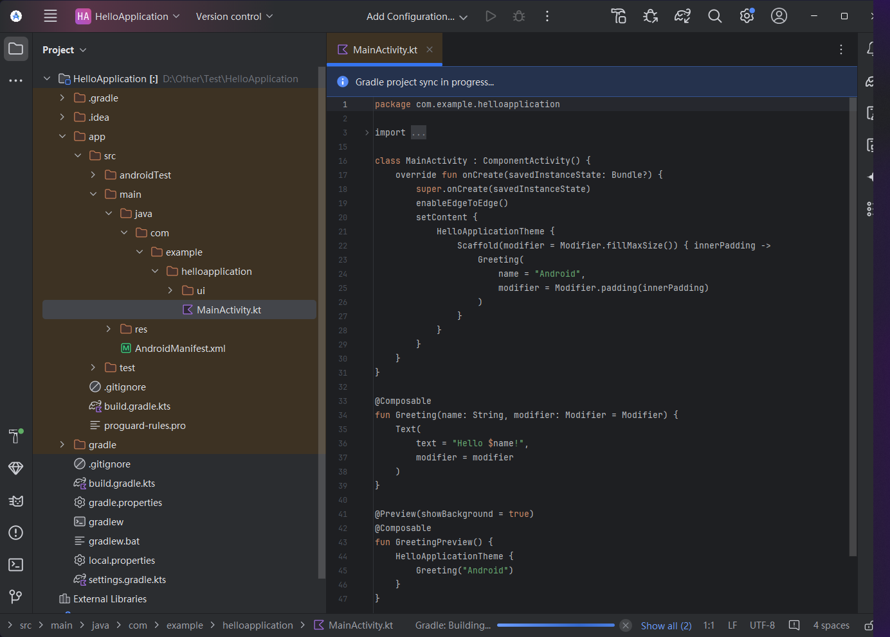

>   前要：我们本次的学习目标如下：
>
>   *   如何使用 `Android Studio` 创建 `Android` 应用
>   *   如何在 `Android Studio` 中使用预览工具运行应用
>   *   如何使用 `Kotlin` 更新文本
>   *   如何使用 `Jetpack Compose` 更新 `UI`
>   *   如何在 `Jetpack Compose` 中使用预览功能预览应用
>   *   创建出一个可让您自定义自我介绍的应用

# 1.安装 AS 和 SDK

首先我们必须先安装一个下载一个 [Android Studio(AS)](https://developer.android.google.cn/studio?hl=zh-cn) 和对应的 `sdk`，我使用的环境就是 `Windows11`，您可以参考 [这个安装教程](https://developer.android.google.cn/studio/install?hl=zh-cn)，然后在这个网页的底部下载安装包进行安装。如果您发现只能下载 `AS` 无法下载 `sdk`（也就是无法选中关于 `sdk` 的多选框），那就直接完成安装，不要使用 `Android StudioSetup Wizar` 的引导安装 `sdk`。

而是重新打开 `AS` 先配置一个代理服务器，这是我验证过的最有效的方法，没有之一。


在这里点击 `Edit` 选择 `sdk` 的安装目录，然后在新打开的面板中下载即可，然后点击 `Next` 和 `Finsh` 回到上面这个面板后点击 `OK` 即可。

安装完毕后，就可以根据 [第一个 Android 应用](https://developer.android.google.cn/codelabs/basic-android-kotlin-compose-first-app?continue=https%3A%2F%2Fdeveloper.android.com%2Fcourses%2Fpathways%2Fandroid-basics-compose-unit-1-pathway-2%23codelab-https%3A%2F%2Fdeveloper.android.com%2Fcodelabs%2Fbasic-android-kotlin-compose-first-app&%3Bhl=zh-cn&hl=zh-cn#0) 这份文档来开始开发了。

# 2.编程语言 Kotlin

在 `Android` 世界的 `Kotlin` 和 `ios` 世界的 `Swift` 类似，都是适用于移动端的编程语言，最大的特点就是兼容 `Java`，并且也有很多现代语言的特性，可以运行在 `Java` 虚拟机上。关于 `Kotlin` 的教程，您可以 [前往菜鸟教程进行快速学习](https://www.runoob.com/kotlin/kotlin-tutorial.html)，这里不详细解释 `Kotlin` 的语法内容。

# 3.使用 AS 创建项目

然后使用 `AS` 创建一个空项目，并且做一些基础的设置。


然后如下配置：

-   **Name** 字段用于输入项目名称。在本 `Codelab` 中，请输入 `"HelloApplication"`
-   保持 **Package name** 字段不变。该字段用于指定文件在文件结构中的组织方式。在本例中，软件包名称将会指定为 `com.example.helloapplication`
-   **Save location** 可以指定保存与项目相关的所有文件的位置。请记下这些文件在您计算机上的保存位置，以便查找文件
-   在 **Language** 字段中，系统已选择 `Kotlin`，`Language` 字段用于指定您在构建项目时所采用的编程语言，选择默认的即可
-   从 **Minimum SDK** 字段提供的菜单中选择 `API 21: Android 5.0 (Lollipop)`，`Minimum SDK` 字段用于指定可运行您应用的最低 `Android` 版本


这一步也是依靠代理提升速度。


然后就可以打开和 `IDEA` 类似的项目界面。



不过这个时候有可能还会出现一些别的问题，我这里就出现了即便是代理也无法下载 `gradle`（也有可能我设置得有些小问题...），这种情况下就只能手动进行下载了，可以参考这篇文章，把链接对应的安装压缩包直接手动下载下来放置到（不用您解压） `C:\Users\{您的用户名}\.gradle\wrapper\dists\gradle-某个版本号-bin\一串乱码数字串\` 中即可，然后重新打开 `AS` 即可自动识别和解压（[参考这篇文章](https://zhuanlan.zhihu.com/p/356437190)）。

# 4.简单解析各个文件

我们先解析下目录下存在的各种文件，以便您找到在其他语言中比较熟悉的部分...不过我稍微调整了一下目录文件，以辅助您对比文件。

```cmd
# 使用我自己下载的 tree 命令在 bash 中进行文件查看
Limou@Limou MINGW64> /d/Other/Test/HelloApplication # 项目目录
> tree
.
|-- app # 应用程序模块的根目录
|   |-- build # [在项目还没构建运行之前是没有的]构建目录, 构建好的目标文件都存放在这里
|   |-- src # 类似 Java 构建工具得到的源代码目录
|   |   |-- main # 主代码目录
|   |   |   |-- AndroidManifest.xml # 应用的清单文件，定义应用的基本信息和组件
|   |   |   |-- java # 主 Java 代码
|   |   |   |   `-- com
|   |   |   |       `-- example
|   |   |   |           `-- helloapplication
|   |   |   |               |-- MainActivity.kt # AS 默认打开的文件
|   |   |   |               `-- ui
|   |   |   |                   `-- theme
|   |   |   |                       |-- Color.kt
|   |   |   |                       |-- Theme.kt
|   |   |   |                       `-- Type.kt
|   |   |   `-- res # 资源目录
|   |   |       |-- drawable # 资源目录
|   |   |       |   `-- ic_launcher_background.xml
|   |   |       |-- drawable-v24 # 针对 API 级别 24 及以上的可绘制资源
|   |   |       |   `-- ic_launcher_foreground.xml
|   |   |       |-- mipmap-anydpi-v26 # 适用于 API 级别 26 及以上不同分辨率的启动图标
|   |   |       |   |-- ic_launcher.xml
|   |   |       |   `-- ic_launcher_round.xml
|   |   |       |-- mipmap-hdpi # 高分辨率图标
|   |   |       |   |-- ic_launcher.webp
|   |   |       |   `-- ic_launcher_round.webp
|   |   |       |-- mipmap-mdpi # 中等分辨率图标
|   |   |       |   |-- ic_launcher.webp
|   |   |       |   `-- ic_launcher_round.webp
|   |   |       |-- mipmap-xhdpi # 超高分辨率图标
|   |   |       |   |-- ic_launcher.webp
|   |   |       |   `-- ic_launcher_round.webp
|   |   |       |-- mipmap-xxhdpi # 超超高分辨率图标
|   |   |       |   |-- ic_launcher.webp
|   |   |       |   `-- ic_launcher_round.webp
|   |   |       |-- mipmap-xxxhdpi # 超超超高分辨率图标
|   |   |       |   |-- ic_launcher.webp
|   |   |       |   `-- ic_launcher_round.webp
|   |   |       |-- values # 资源值目录
|   |   |       |   |-- colors.xml
|   |   |       |   |-- strings.xml
|   |   |       |   `-- themes.xml
|   |   |       `-- xml # XML 配置文件目录
|   |   |           |-- backup_rules.xml
|   |   |           `-- data_extraction_rules.xml
|   |   |-- androidTest # 设备化测试代码目录
|   |   |   `-- java
|   |   |       `-- com
|   |   |           `-- example
|   |   |               `-- helloapplication
|   |   |                   `-- ExampleInstrumentedTest.kt
|   |   `-- test # 单元测试代码目录
|   |       `-- java
|   |           `-- com
|   |               `-- example
|   |                   `-- helloapplication
|   |                       `-- ExampleUnitTest.kt
|   |-- build.gradle.kts # [应用模块 Module]的 Gradle 构建脚本，使用 Kotlin DSL, 主要用来配置如何使用依赖
|   `-- proguard-rules.pro # ProGuard 工具的配置文件, 用于代码混淆和优化, 该工具可在构建应用时对代码进行压缩和混淆, 减少 APK 的大小并保护代码不被反编译
|   
|-- build.gradle.kts # [整个项目 Project]的 Gradle 构建脚本，使用 Kotlin DSL, 主要用来配置如何使用依赖
|-- gradle # 和 Gradle 相关的文件, Gradle 是一个现代化的构建自动化工具, 广泛用于 Java、Android、Groovy、Kotlin 
|   |-- libs.versions.toml # toml 格式, 专注于版本管理, 提供了一个集中化的地方来定义和更新依赖版本
|   `-- wrapper # 包含与 Gradle Wrapper 相关的文件, 这是一种机制, 允许项目用特定版本的 Gradle, 而不需要用户手动安装 Gradle
|       |-- gradle-wrapper.jar # # Gradle Wrapper JAR 文件
|       `-- gradle-wrapper.properties # Gradle Wrapper 自己的配置文件
|-- gradle.properties # [项目级]配置文件, 影响整个项目的构建过程, 包括 JVM 参数、并行构建、AndroidX 支持、Kotlin 代码风格等
|-- local.properties # [本地级]配置文件, 通常包含开发者自身环境的设置, 如 Android SDK 路径, 它的内容因开发者的环境而异
|-- gradlew # Unix 系统下的 Gradle Wrapper 脚本
|-- gradlew.bat # Windows 系统下的 Gradle Wrapper 脚本
`-- settings.gradle.kts # 项目设置文件，定义项目的模块和依赖关系, 使用 include 语句来包含子模块, 指定哪些模块是项目的一部分

32 directories, 37 files

```

不过这些文件会比较繁琐，`AS` 会通过抽象为一个 `Porject` 面板来加快您快速理解整个项目文件（不过这只对于那些非常熟悉安卓开发需要用到什么工具的人），您如果不习惯，也可以切换回来。


另外，默认的 `.gitignore` 也暗示您哪些文件值得被 `.git` 进行远程管理，哪些文件不应该进行远程管理，如果忽视了某些忽略，可能会给某些开发者的拉取运行造成困扰...

```ini
# 。gitignor
*.iml
.gradle
/local.properties
/.idea/caches
/.idea/libraries
/.idea/modules.xml
/.idea/workspace.xml
/.idea/navEditor.xml
/.idea/assetWizardSettings.xml
.DS_Store
/build
/captures
.externalNativeBuild
.cxx
local.properties

```

# 5.开始您进一步开发

## 5.1.打开视图开始构建和运行程序


您可以直接使用 `[ctrl+shift+f5]` 开始构建整个项目并且运行程序，我猜测和很多构建工具类似，第一次构建也是比较久的。不过完成后，预览便会显示一个内容为 `Hello Android!` 的文本框，可以看到第一次构建就花了大概 `1 min` 左右。


## 5.2.开始编写您的 Kotlin 代码

欲修改代码，我们先要了解下面的代码，这里引用了官方文档的描述文本，它写得非常易懂。

```kotlin
// MainActivity.kt
package com.example.helloapplication

import android.os.Bundle
import androidx.activity.ComponentActivity
import androidx.activity.compose.setContent
import androidx.activity.enableEdgeToEdge
import androidx.compose.foundation.layout.fillMaxSize
import androidx.compose.foundation.layout.padding
import androidx.compose.material3.Scaffold
import androidx.compose.material3.Text
import androidx.compose.runtime.Composable
import androidx.compose.ui.Modifier
import androidx.compose.ui.tooling.preview.Preview
import com.example.helloapplication.ui.theme.HelloApplicationTheme

class MainActivity : ComponentActivity() { // MainActivity 类继承自 ComponentActivity 类负责管理应用的主活动, 管理用户界面
    override fun onCreate(savedInstanceState: Bundle?) {
        super.onCreate(savedInstanceState)
        enableEdgeToEdge()
        setContent {
            HelloApplicationTheme {
                Scaffold(modifier = Modifier.fillMaxSize()) { innerPadding ->
                    Greeting(
                        name = "Android",
                        modifier = Modifier.padding(innerPadding)
                    )
                }
            }
        }
    }
}

@Composable
fun Greeting(name: String, modifier: Modifier = Modifier) {
    Text(
        text = "Hello $name!",
        modifier = modifier
    )
}

@Preview(showBackground = true)
@Composable
fun GreetingPreview() {
    HelloApplicationTheme {
        Greeting("Android")
    }
}

```

这里官方的描述很清楚：`onCreate()` 函数是此应用的入口点，并会调用其他函数来构建 `UI`。

-   在 `Kotlin` 程序中，`main()` 函数是 `Kotlin` 编译器在代码中开始编译的特定位置
-   在 `Android` 应用中，则是由 `onCreate()` 函数来担任这个角色

`onCreate()` 函数中的 [`setContent()`](https://developer.android.google.cn/reference/kotlin/androidx/compose/ui/platform/ComposeView?hl=zh-cn#setContent(kotlin.Function0)) 函数用于通过可组合函数定义布局。任何标有 `@Composable` 注解的函数都可通过 `setContent()` 函数或其他可组合函数进行调用。该注解可告知 `Kotlin` 编译器 `Jetpack Compose` 使用的这个函数会生成 `UI`。

*   `@Composable` 函数名称采用首字母大写形式。
*   需在该函数前面添加 `@Composable` 注解。
*   `@Composable` 函数无法返回任何内容。

我们尝试修改下部分代码，修改一下文本把，新版本的 `AS` 可以自动加载修改后的结果，如果没有就重行运行即可。


其他部分细节细看 [这个链接的文档](https://developer.android.google.cn/codelabs/basic-android-kotlin-compose-first-app?continue=https%3A%2F%2Fdeveloper.android.com%2Fcourses%2Fpathways%2Fandroid-basics-compose-unit-1-pathway-2%23codelab-https%3A%2F%2Fdeveloper.android.com%2Fcodelabs%2Fbasic-android-kotlin-compose-first-app&%3Bhl=zh-cn&hl=zh-cn#4) 即可。

# 6.优化您的开发过程

可以设置汉化插件，如果您没有找到插件，则可以 [根据这篇文章导入外部下载的插件](https://blog.csdn.net/qq_43811536/article/details/139470049)，另外您可以勾选下面的多选框，使用 `[ctrl+鼠标滚轮]` 来调整每个编辑框的字体大小。

 

