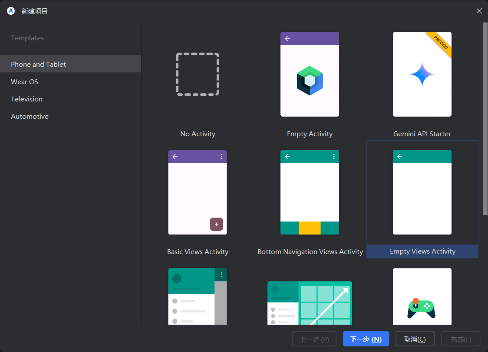
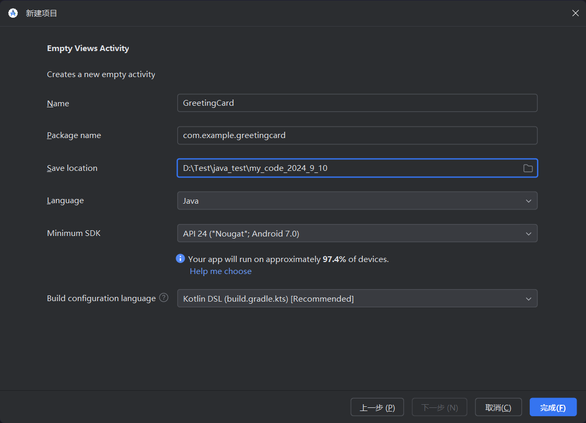
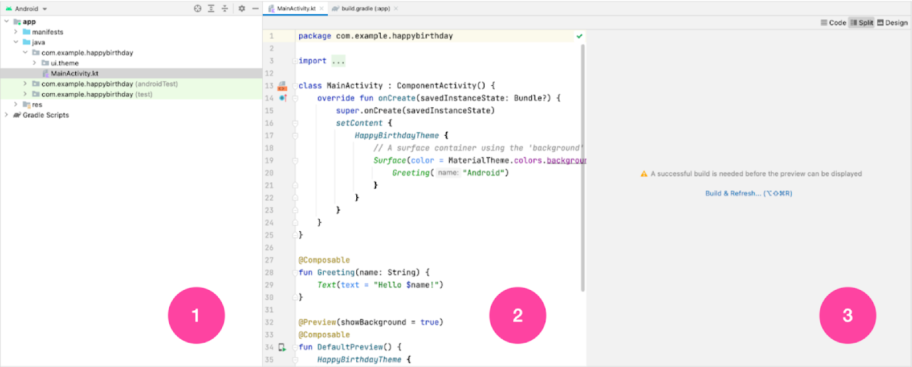

```java
package com.example.greetingcard; // 定义包名

import android.os.Bundle; // 导入 Bundle 类, 用于传递活动的状态信息
import androidx.activity.EdgeToEdge; // 导入 EdgeToEdge 类, 用于启用全屏模式
import androidx.appcompat.app.AppCompatActivity; // 导入 AppCompatActivity 类, 作为活动的基类
import androidx.core.graphics.Insets; // 导入 Insets 类, 用于处理插图的边距
import androidx.core.view.ViewCompat; // 导入 ViewCompat 类, 提供对视图的兼容性支持
import androidx.core.view.WindowInsetsCompat; // 导入 WindowInsetsCompat 类, 用于处理窗口插图

public class MainActivity extends AppCompatActivity { // 定义 MainActivity 类, 继承自 AppCompatActivity
    @Override
    protected void onCreate(Bundle savedInstanceState) { // 重写 onCreate 方法, 活动创建时调用
        super.onCreate(savedInstanceState); // 调用父类的 onCreate 方法, 防止影响原本的行为
        EdgeToEdge.enable(this); // 启用全屏模式, 使内容延伸到屏幕边缘
        setContentView(R.layout.activity_main); // 设置活动的布局为 activity_main.xml 这是一个配置文件, 在项目生成的时候会自动给出

        // 后面这段代码可以以后再来了解...
        // 设置视图的窗口插图监听器(确保应用的视图在系统栏, 如状态栏和导航栏出现时不会被遮挡)
        ViewCompat.setOnApplyWindowInsetsListener(findViewById(R.id.main), (v, insets) -> { // 当系统栏的插图发生变化时(例如状态栏出现或消失), 就会自动调用这里的 Lambda 表达式
            // 获取系统栏的插图(边距)
            Insets systemBars = insets.getInsets(WindowInsetsCompat.Type.systemBars());
            // 设置视图的内边距，以适应系统栏的显示
            v.setPadding(systemBars.left, systemBars.top, systemBars.right, systemBars.bottom);
            return insets; // 返回处理后的插图
        });
    }
}

```

>   区分：活动和视图是不太一样的。
>
>   *   **活动** 代表 `Android` 应用中的一个单独屏幕，具有用户界面。它是 `Android` 应用的一个重要组成部分，作为用户与应用交互的入口点。每个活动负责创建一个窗口，在其中可以放置 `UI` 组件（如按钮、文本框等）。一个活动可以包含多个视图，并管理它们的生命周期。
>   *   **视图** 视图是 `Android` 中用户界面组件的基本构建块。它代表屏幕上的一个矩形区域，负责绘制和事件处理。视图的例子包括按钮、文本框、图像和布局。视图可以组合在一起，创建更复杂的 `UI` 组件，例如包含多个视图的布局。



*   **Project** 视图 (1) 用于显示项目的文件和文件夹
*   **Code** 视图 (2) 是您修改代码的地方
*   **Design** 视图 (3) 是您预览应用外观的地方