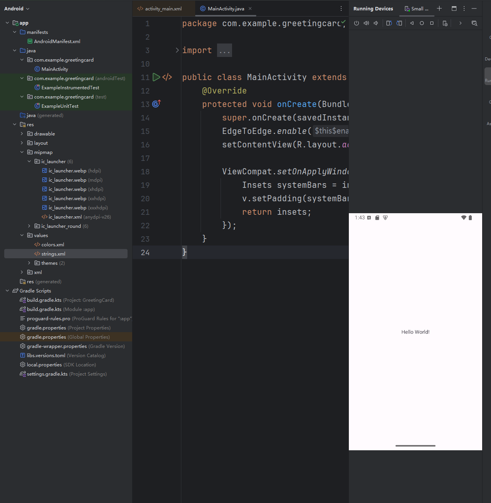

# 1.Android 开发架构

-   **Linux 内核** 在所有层的最底下是 `Linux`，提供了基本的系统功能，比如进程管理，内存管理，设备管理（如摄像头，键盘，显示器）。同时，内核处理所有 `Linux` 所擅长的工作，如网络和大量的设备驱动，从而避免兼容大量外围硬件接口带来的不便。

-   **其他程序库** 在 `Linux` 内核层的上面是一系列程序库的集合，包括开源的 `Web` 浏览器渲染引擎 `Webkit` ，知名的 `libc` 标准库（`C` 语言的），用于仓库存储和应用数据共享的轻量级 `SQLite` 数据库，用于播放、录制音视频的音视频库，用于网络安全的 `SSL` 网络安全库...

-   **安卓程序库** 这个类别包括了专门为 `Android` 开发的基于 `Java` 的程序库。这个类别程序库的示例包括应用程序框架库，如用户界面构建，图形绘制和数据库访问。一些 `Android` 开发者可用的 `Android` 核心程序库总结如下：

    (1)android.app - 提供应用程序模型的访问，是所有 Android 应用程序的基石。

    (2)android.content - 方便应用程序之间，应用程序组件之间的内容访问，发布，消息传递。

    (3)android.database - 用于访问内容提供者发布的数据，包含 SQLite 数据库管理类。

    (4)android.opengl - OpenGL ES 3D 图片渲染 API 的 Java 接口。

    (5)android.os - 提供应用程序访问标注操作系统服务的能力，包括消息，系统服务和进程间通信。

    (6)android.text - 在设备显示上渲染和操作文本。

    (7)android.view - 应用程序用户界面的基础构建块。

    (8)android.widget - 丰富的预置用户界面组件集合，包括按钮，标签，列表，布局管理，单选按钮等。

    (9)android.webkit - 一系列类的集合，允许为应用程序提供内建的 Web 浏览能力。

-   **运行时** 提供名为 `Dalvik` 虚拟机的关键组件，类似于 `Java` 虚拟机，但专门为 `Android` 设计和优化.`Dalvik` 虚拟机使得可以在 `Java` 中使用 `Linux` 核心功能，如内存管理和多线程。`Dalvik` 虚拟机使得每一个 `Android` 应用程序运行在自己独立的虚拟机进程。`Android` 运行时同时提供一系列核心的库来为 `Android` 应用程序开发者使用标准的 `Java` 语言来编写 `Android` 应用程序。

-   **应用框架** 应用框架层以 `Java` 类的形式为应用程序提供许多高级的服务。应用程序开发者被允许在应用中使用这些服务。

    (1)活动管理者，控制应用程序生命周期和活动栈的所有方面

    (2)内容提供者，允许应用程序之间发布和分享数据

    (3)资源管理器，提供对非代码嵌入资源的访问，如字符串，颜色设置和用户界面布局

    (4)通知管理器，允许应用程序显示对话框或者通知给用户

    (5)视图系统，一个可扩展的视图集合，用于创建应用程序用户界面

-   **应用程序** 顶层中有所有的 `Android` 应用程序，您写的应用程序也将被安装在这层。这些应用程序包括通讯录，浏览器，游戏等。

# 2.Android 应用组件

应用程序组件是一个 `Android` 应用程序的基本构建块，以下是可以在 `Android` 应用程序中使用的四个主要组件。

| 组件                      | 描述                                        |
| :------------------------ | :------------------------------------------ |
| Activities(活动)          | 描述 `UI`，并且处理用户与机器屏幕的交互     |
| Services(后台)            | 处理与应用程序关联的后台操作                |
| Broadcast Receivers(通信) | 处理 `Android` 操作系统和应用程序之间的通信 |
| Content Providers(数据)   | 处理数据和数据库管理方面的问题              |

-   **Activities** 一个活动标识一个具有用户界面的单一屏幕。举个例子，一个邮件应用程序可以包含一个活动用于显示新邮件列表，另一个活动用来编写邮件，再一个活动来阅读邮件。当应用程序拥有多于一个活动，其中的一个会被标记为当应用程序启动的时候显示。一个活动一定是 `Activity` 类的一个子类。

    ```java
    public class MainActivity extends Activity {}
    ```
    
-   **Services** 服务是运行在后台，执行长时间操作的组件。举个例子，服务可以是用户在使用不同的程序时在后台播放音乐，或者在活动中通过网络获取数据但不阻塞用户交互。一个服务一定是 `Service` 类的子类。

    ```java
    public class MyService extends Service {}
    ```

-   **Broadcast Receivers** 广播接收器简单地响应从其他应用程序或者系统发来的广播消息。举个例子，应用程序可以发起广播来让其他应用程序知道一些数据已经被下载到设备，并且可以供他们使用。因此广播接收器会拦截这些通信并采取适当的行动。广播接收器一定是 `BroadcastReceiver` 类的一个子类，每个消息以 `Intent` 对象的形式来广播。

    ```java
    public class MyReceiver  extends  BroadcastReceiver {}
    ```
    
-   **Content Providers** 内容提供者组件通过请求从一个应用程序到另一个应用程序提供数据。这些请求由 `ContentResolver` 类的方法来处理。这些数据可以是存储在文件系统、数据库或者其他其他地方。内容提供者一定是 `ContentProvider` 类的子类，并实现一套标准的 `API`，以便其他应用程序来执行事务。

    ```java
    public class MyContentProvider extends  ContentProvider {}
    ```

我们的重点就从这个几个类开始，然后我们开始了解项目的文件树、主活动文件、清单文件。

```shell
# 查看项目文件夹
$ tree -L 4
.
|-- app
|   `-- src # 包含项目中所有的.java源文件，默认情况下，它包括一个 MainActivity.java 源文件对应的活动类, 当应用程序通过应用图标启动时，将运行它。
|       |-- androidTest
|       |   `-- java
|       |-- main
|       |   |-- AndroidManifest.xml # 这个是应用程序的清单文件, 描述了应用程序的基础特性, 定义它的各种组件
|       |   |-- java
|       |   `-- res
|       |       |-- drawable # 包括所有的为高密度屏幕设计所需的 drawable 对象
|       |       |-- layout # 这个目录存放用于定义用户界面的文件
|       |       |-- values # 这个目录存放各种各样的包含一系列资源的 XML 文件(字符串和颜色的定义)
...
```

```java
// 查看主活动文件 MainActivity.java
package com.example.greetingcard; // 定义包名

import android.os.Bundle; // 导入 Bundle 类, 用于传递活动的状态信息
import androidx.activity.EdgeToEdge; // 导入 EdgeToEdge 类, 用于启用全屏模式
import androidx.appcompat.app.AppCompatActivity; // 导入 AppCompatActivity 类, 作为活动的基类
import androidx.core.graphics.Insets; // 导入 Insets 类, 用于处理插图的边距
import androidx.core.view.ViewCompat; // 导入 ViewCompat 类, 提供对视图的兼容性支持
import androidx.core.view.WindowInsetsCompat; // 导入 WindowInsetsCompat 类, 用于处理窗口插图

public class MainActivity extends AppCompatActivity { // 定义 MainActivity 类, 继承自 AppCompatActivity
    @Override
    protected void onCreate(Bundle savedInstanceState) { // 重写 onCreate 方法, 活动创建时调用
        super.onCreate(savedInstanceState); // 调用父类的 onCreate 方法, 防止影响原本的行为
        EdgeToEdge.enable(this); // 启用全屏模式, 使内容延伸到屏幕边缘
        setContentView(R.layout.activity_main); // 设置活动布局(内容视图)为 activity_main.xml 这是一个配置文件, 在项目生成的时候会自动给出, R.layout.activity_main 代表引用自 res/layout/activity_main.xml

        // 后面这段代码可以以后再来了解...
        // 设置视图的窗口插图监听器(确保应用的视图在系统栏, 如状态栏和导航栏出现时不会被遮挡)
        ViewCompat.setOnApplyWindowInsetsListener(findViewById(R.id.main), (v, insets) -> { // 当系统栏的插图发生变化时(例如状态栏出现或消失), 就会自动调用这里的 Lambda 表达式
            // 获取系统栏的插图(边距)
            Insets systemBars = insets.getInsets(WindowInsetsCompat.Type.systemBars());
            // 设置视图的内边距，以适应系统栏的显示
            v.setPadding(systemBars.left, systemBars.top, systemBars.right, systemBars.bottom);
            return insets; // 返回处理后的插图
        });
    }
}

```

```shell
# 主活动配置文件 activity_main.xml
<?xml version="1.0" encoding="utf-8"?>
# ConstraintLayout 是一种灵活的布局, 可以帮助我们创建复杂的界面
# xmlns:android, xmlns:app, xmlns:tools 是 XML 命名空间的声明
<androidx.constraintlayout.widget.ConstraintLayout
    xmlns:android="http://schemas.android.com/apk/res/android"
    xmlns:app="http://schemas.android.com/apk/res-auto"
    xmlns:tools="http://schemas.android.com/tools"
    android:id="@+id/main" # android:id="@+id/main" 为该布局指定一个唯一的 ID, 方便在代码中引用
    android:layout_width="match_parent" # android:layout_width, 设置布局的宽度, match_parent 这意味着该布局将填充其父视图的整个可用空间
    android:layout_height="match_parent" # android:layout_height, 设置布局的高度, match_parent 这意味着该布局将填充其父视图的整个可用空间
    tools:context=".MainActivity"> # 指定了该布局的上下文, 通常是与之关联的 Activity 类

    <TextView # TextView 是一个用于显示文本的视图
        android:layout_width="wrap_content" # 表示 TextView 的宽度将根据其内容自动调整
        android:layout_height="wrap_content" # 表示 TextView 的高度将根据其内容自动调整
        android:text="Hello World!" # 设置 TextView 显示的文本内容
        app:layout_constraintBottom_toBottomOf="parent" # 将 TextView 的底部约束到父布局的底部
        app:layout_constraintEnd_toEndOf="parent" # 将 TextView 的右边约束到父布局的右边
        app:layout_constraintStart_toStartOf="parent" # 将 TextView 的左边约束到父布局的左边
        app:layout_constraintTop_toTopOf="parent" /> # 将 TextView 的顶部约束到父布局的顶部
        # 通过这些约束 TextView 将被放置在父布局的中心位置

</androidx.constraintlayout.widget.ConstraintLayout>
```

```shell
# 清单文件 AndroidManifest.xml
# 无论您开发什么组件用作应用程序中的一部分, 都需要在应用程序项目根目录下的 manifest.xml 文件中声明所有的组件, 这个文件是 Android 操作系统与您的应用程序之间的接口。因此, 如果没有在这个文件中声明您的组件, 将无法被操作系统所识别

<?xml version="1.0" encoding="utf-8"?> # 定义工具命名空间, 用于提供额外的构建工具信息
<manifest xmlns:android="http://schemas.android.com/apk/res/android"
    xmlns:tools="http://schemas.android.com/tools">

    <application
        android:allowBackup="true" # 允许应用程序的数据备份
        android:dataExtractionRules="@xml/data_extraction_rules" # 指定数据提取规则的 XML 文件
        android:fullBackupContent="@xml/backup_rules" # 指定完整备份内容的 XML 文件
        android:icon="@mipmap/ic_launcher" # 指定应用程序图标 res/mipmap-hdpi/ic_launcher.webp
        android:label="@string/app_name" # 指定应用程序名称 res/values/string.xml 中的 app_name
        android:roundIcon="@mipmap/ic_launcher_round" # 指定应用程序圆形图标 res/mipmap-hdpi/ic_launcher_round.webp
        android:supportsRtl="true" # 指定应用程序是否支持从右到左的布局
        android:theme="@style/Theme.GreetingCard" # 指定应用程序的主题样式 res/values/styles.xml
        tools:targetApi="31"> # 提供给构建工具的信息, 指明该应用程序的目标 API 级别
        <activity # 定义一个 Activity 组件
            android:name=".MainActivity" # 指定该活动的类名
            android:exported="true"> # 指定该活动是否可以被其他应用程序访问
            <intent-filter> # 定义该活动可以响应的意图
                <action android:name="android.intent.action.MAIN" /> # 指定了该活动是应用程序的主入口点, 它表示该活动是用户启动应用程序时首先要显示的界面
                <category android:name="android.intent.category.LAUNCHER" /> # 这个标签指定了该活动是一个启动器 Activity, 意味着它会出现在设备的应用程序列表中, 用户可以通过点击图标来启动该活动
            </intent-filter>
        </activity>
    </application>

</manifest>
```

不过有个尴尬的问题，我手上没有安卓手机，只能使用模拟器才能运行代码，待补充...


