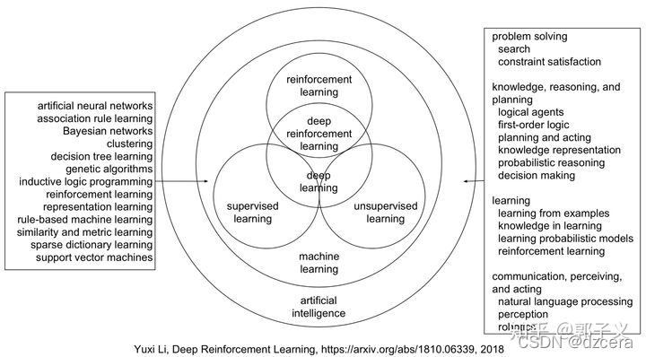
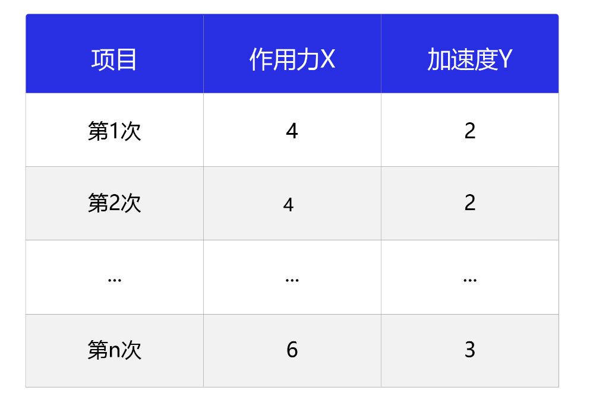
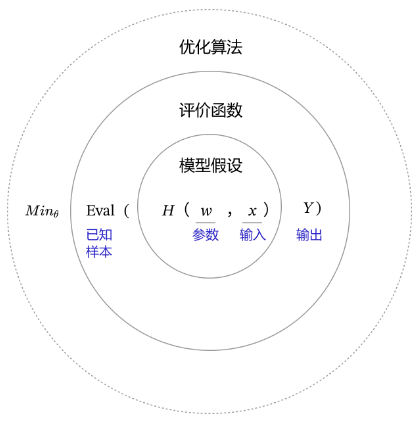
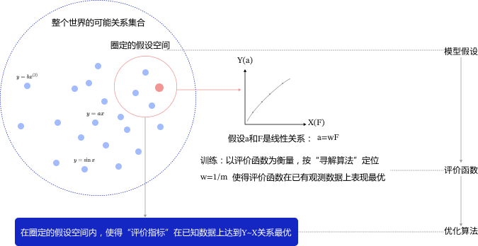
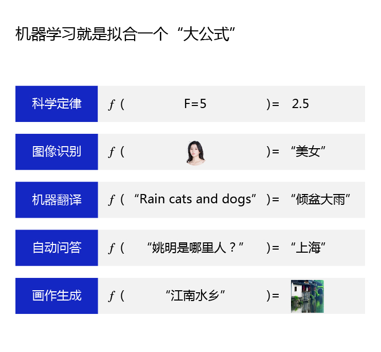
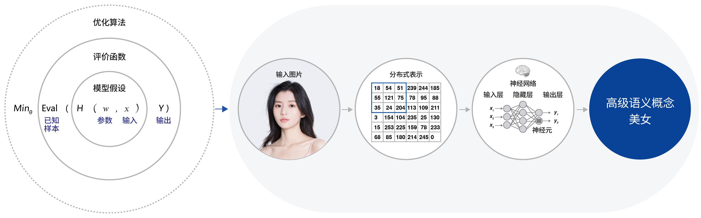
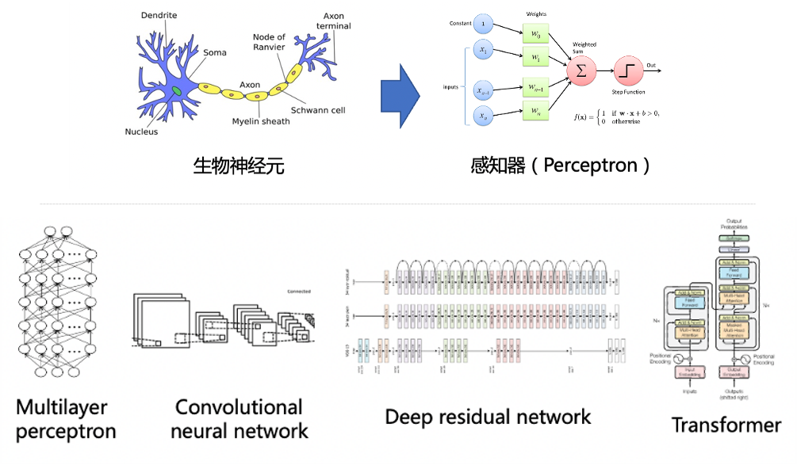
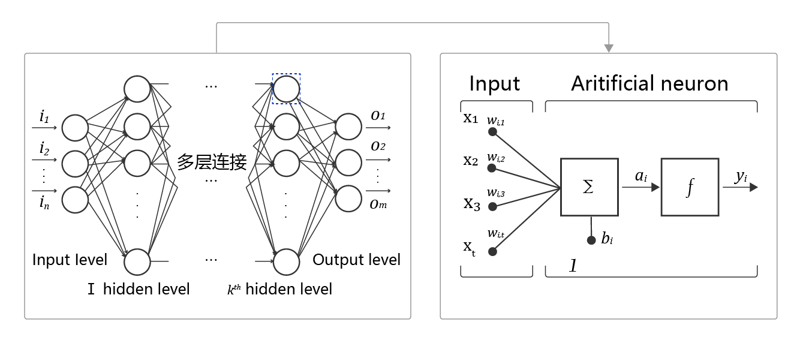
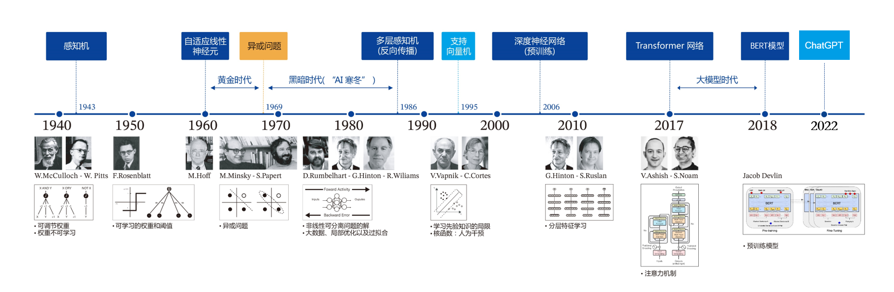

# 1.人工智能之领域划分

人工智能（`Artificial Intelligence, AI`）是最宽泛的概念，是研发用于模拟、延伸和扩展人的智能的理论、方法、技术及应用系统的一门新的技术科学。

人工智能存在的诸多方法和分支，导致其变成一个“大杂烩”式的学科。机器学习是当前比较有效的一种实现人工智能的方式。深度学习是机器学习算法中最热门的一个分支，近些年取得了显著的进展，并替代了大多数传统机器学习算法。

>   补充：更加专业的领域划分如下。
>
>   

# 2.人工智能之机器学习

## 2.1.概念阐述

机器学习是专门研究计算机怎样模拟或实现人类的学习行为，以获取新的知识或技能，重新组织已有的知识结构，使之不断改善自身的性能。

## 2.2.实现原理

机器学习的实现可以分成两步：训练（归纳）和预测（演绎）

*   **训练/归纳：** 从具体案例中抽象一般规律，机器学习中的“训练”亦是如此。从一定数量的样本（已知模型输入 $x$ 和模型输出 $y$）中，学习输出 $y$ 与输入 $x$ 的关系（可以想象成是某种表达式）
*   **预测/演绎** 从一般规律推导出具体案例的结果，机器学习中的“预测”亦是如此。基于上述训练中得到的 $y$ 与 $x$ 之间的关系，如出现新的输入 $x$，计算出输出 $y$。通常情况下，如果通过模型计算的输出和真实场景的输出一致，则说明模型是有效的

机器学习的实施方法和人类科研的过程有着异曲同工之妙，下面以“机器从牛顿第二定律实验中学习知识”为例，帮助读者更加深入理解机器学习（监督学习）的方法论本质，即在“机器思考”的过程中确定模型的三个关键要素：假设、评价、优化。

>   补充：牛顿第二定律是艾萨克·牛顿在 `1687` 年于《自然哲学的数学原理》一书中提出的，其常见表述：物体加速度的大小跟作用力成正比，跟物体的质量成反比，与物体质量的倒数成正比（也就是 $a \propto \frac{1}{m}$）。牛顿第二运动定律和第一、第三定律共同组成了牛顿运动定律，阐述了经典力学中基本的运动规律。

### 2.3.1.科研研究过程

在中学课本中，牛顿第二定律有两种实验设计方法：**倾斜滑动法** 和 **水平拉线法**，如下所示。

相信很多读者都有摆弄滑轮和小木块做物理实验的青涩年代和美好回忆。通过多次实验数据，可以统计出如下表所示的不同作用力下的木块加速度。

观察实验数据不难猜测，物体的加速度 $a$ 和作用力 $F$ 之间的关系应该是线性关系。因此我们提出假设 $a = w⋅F$，其中 $w$ 是待确定的参数。

通过大量实验数据的训练，确定参数 $w$ 是物体质量的倒数 $\frac{1}{m}$，即得到完整的模型公式 $a = F⋅\frac{1}{m}$。当已知作用到某个物体的力时，基于模型可以快速预测物体的加速度。如燃料对火箭的推力 $F = 10$，火箭的质量 $m = 2$，可快速得出火箭的加速度 $a = 5$。

>   补充：模型即公式，训练出一个模型就是训练出一个公式，但是这个公式不一定需要被我们使用数学表达式撰写出来，这个公式只需要满足能输入和输出即可。

### 2.3.2.模型三个要素

这个案例演示了机器学习的基本过程，但其中有一个关键点的实现我们尚不清晰，即：**如何通过程序的方式来确定模型参数（w = 1/m）**，这点很重要。

确定参数的过程与科学家提出假说的方式类似，合理的假说可以最大化的解释所有的已知观测数据。

如果未来观测到不符合理论假说的新数据，科学家会尝试提出新的假说。如：天文史上，使用大圆和小圆组合的方式计算天体运行，在中世纪是可以拟合观测数据的。但随着欧洲工业革命的推动，天文观测设备逐渐强大，已有的理论已经无法解释越来越多的观测数据，这促进了使用椭圆计算天体运行的理论假说出现。

因此，**模型有效的基本条件是能够拟合已知的样本**，这给我们提供了学习有效模型的实现方案（说白了就是尝试）。

上图是以参数 $H$ 为模型的假设，它是一个关于参数 $w$ 和输入 $x$ 的函数，用 $H(w, x)$ 表示。

模型的优化目标是 $H(w, x)$ 的输出与真实输出 $Y$ 尽量一致，两者的相差程度即是模型效果的评价函数（相差越小越好）。

那么，确定参数的过程就是在已知的样本上，不断减小该评价函数（$H$ 的计算结果和 $Y$ 的差距）的过程。

这个不断的过程中，一直到模型学习到一个参数 $w$，使得评价函数的值最小，**衡量模型预测值和真实值差距的评价函数也被称为损失函数**。

假设机器通过尝试答对（最小化损失）大量的习题（已知样本）来学习得到知识（模型参数 $w$），并期望用学习到的知识所代表的模型 $H(w, x)$，回答不知道答案的考试题（未知样本）。

最小化损失是模型的优化目标，实现损失最小化的方法称为优化算法，也称为寻解算法（找到使得损失函数最小的参数解）。

参数 $w$ 和输入 $x$ 组成公式的基本结构称为假设。在牛顿第二定律的案例中，基于对数据的观测，我们提出了线性假设，即作用力和加速度是线性关系，用线性方程表示。

由此可见，**模型假设、评价函数、优化算法是构成模型的三个关键要素**。

### 2.3.3.细化模型结构

模型假设、评价函数、优化算法是如何支撑机器学习流程的呢？如下所示。

-   **模型假设** 世界上的可能关系千千万，漫无目标的试探 $Y$ 和 $X$ 之间的关系显然是十分低效的。因此假设空间先圈定了一个模型能够表达的关系可能，如红色圆圈所示。机器还会进一步在假设圈定的圆圈内寻找最优的 $Y \sim X$ 关系，即确定参数 $w$。
-   **评价函数** 寻找最优之前，我们需要先定义什么是最优，即评价一个 $Y \sim X$ 关系的好坏的指标。通常衡量该关系是否能很好的拟合现有观测样本，将拟合的误差最小作为优化目标。
-   **优化算法** 设置了评价指标后，就可以在假设圈定的范围内，将使得评价指标最优（损失函数最小/最拟合已有观测样本）的 $Y \sim X$ 关系找出来，这个寻找最优解的方法即为优化算法。最笨的优化算法即按照参数的可能，穷举每一个可能取值来计算损失函数，保留使得损失函数最小的参数作为最终结果。

从上述过程可以得出，机器学习的过程与牛顿第二定律的学习过程基本一致，都分为假设、评价和优化三个关键要素：

-   **假设** 通过观察加速度 $a$ 和作用力 $F$ 的观测数据，假设 $a$ 和 $F$ 是线性关系，即 $a = w⋅F$。
-   **评价** 对已知观测数据上的拟合效果好，即 $w⋅F$ 计算的结果要和观测的 $a$ 尽量接近。
-   **优化** 在参数 $w$ 的所有可能取值中，发现 $w = 1/m$ 可使得评价最好（最拟合观测样本）。

机器执行学习任务的框架体现了其 **学习的本质是“参数估计”**。上述方法论使用更规范化的表示如下图所示。

从假设集合 $H$ 中，通过学习算法 $A$ 找到一个函数 $g$。如果 $g$ 能够最大程度的拟合训练样本 $D$，那么可以认为函数 $g$ 就接近于目标函数 $f$。

因此在此基础上，许多看起来完全不一样的问题都可以使用同样的框架进行学习，如科学定律、图像识别、机器翻译和自动问答等，它们的学习目标都是拟合一个“大公式 $f$”。

# 3.人工智能之深度学习

## 3.1.概念阐述

机器学习算法理论在上个世纪 `90` 年代发展成熟，在许多领域都取得了成功，但平静的日子只延续到 `2010` 年左右。随着大数据的涌现和计算机算力提升，深度学习模型异军突起，极大改变了机器学习的应用格局。今天，多数机器学习任务都可以使用深度学习模型解决，尤其在语音、计算机视觉和自然语言处理等领域，深度学习模型的效果比传统机器学习算法有显著提升。

相比传统的机器学习算法，深度学习做出了哪些改进呢？其实 **两者在理论结构上是一致的，即：模型假设、评价函数和优化算法，其根本差别在于假设的复杂度**。如下图的图像识别，对于对于美女照片，人脑可以接收到五颜六色的光学信号，能快速反应出这张图片是一位美女，而且是程序员喜欢的类型。但对计算机而言，只能接收到一个数字矩阵，对于美女这种高级的语义概念，从像素到高级语义概念中间要经历的信息变换的复杂性是难以想象的。

## 3.2.实现原理

这种变换已经无法用数学公式表达，因此研究者们借鉴了人脑神经元的结构，设计出神经网络的模型。

1.   上半部分展示了神经网络中的一个基本单元（也叫“感知机”）。感知机的设计方案，其处理信息的方式与人脑中的单一神经元有很强的相似性
2.   下半部分展示了几种经典的神经网络结构（后面提及），类似于人脑中多种基于大量神经元连接而形成的不同职能的器官

>   补充：常见的四个神经网络模型
>
>   -   **Multilayer Perceptron (MLP)**: 基本的全连接神经网络，由多层感知器组成，适用于简单的分类和回归任务，不适合处理时序数据或图像。
>   -   **Convolutional Neural Network (CNN)**: 专门用于图像处理，利用卷积层提取局部特征，减少参数数量，适合图像和视频识别。
>   -   **Deep Residual Network (ResNet)**: 在深层网络中通过“残差连接”解决梯度消失问题，允许信息绕过某些层，提升训练效果。
>   -   **Transformer**: 专为处理序列数据（如自然语言）的模型，依赖自注意力机制并行处理数据，优于 `RNN` 和 `LSTM` 处理长距离依赖问题。

人工神经网络包括多个神经网络层，如：卷积层、全连接层、`LSTM` 等，每一层又包括很多神经元，超过三层的非线性神经网络都可以被称为深度神经网络。

通俗的讲，深度学习的模型可以视为是输入到输出的映射函数，如图像到高级语义（美女）的映射，足够深的神经网络理论上可以拟合任何复杂的函数。

因此神经网络非常适合学习样本数据的内在规律和表示层次，对文字、图像和语音任务有很好的适用性。这几个领域的任务是人工智能的基础模块，因此深度学习被称为实现人工智能的基础也就不足为奇了。

*   **神经元** 神经网络中每个节点称为神经元，由两部分组成：
    *   加权和：将所有输入加权求和
    *   非线性变换（激活函数）：加权和的结果经过一个非线性函数变换，让神经元计算具备非线性的能力
*   **多层连接** 大量这样的节点按照不同的层次排布，形成多层的结构连接起来，即称为“神经网络”
*   **前向计算** 从输入计算输出的过程，顺序从网络前至后
*   **计算图** 以图形化的方式展现神经网络的计算逻辑又称为计算图，也可以将神经网络的计算图以公式的方式表

$Y = f_3(f_2(f_1(w_1⋅x_1+w_2⋅x_2+w_3⋅x_3+b)+…)…)…)$

由此可见，神经网络并没有那么神秘，它的本质是一个含有很多参数的“大公式”（以一个章节用具体代码进行演示）。

>   补充：神经网络思想的提出已经是 `70` 多年前的事情了，现今的神经网络和深度学习的设计理论是一步步趋于完善的。在这漫长的发展岁月中，一些取得关键突破的闪光时刻，值得深度学习爱好者们铭记。
>
>   
>
>   *   **1940 年代** 首次提出神经元的结构，但权重是不可学的
>   *   **50-60 年代** 提出权重学习理论，神经元结构趋于完善，开启了神经网络的第一个黄金时代
>   *   **1969 年** 提出异或问题（人们惊讶的发现神经网络模型连简单的异或问题也无法解决，对其的期望从云端跌落到谷底），神经网络模型进入了被束之高阁的黑暗时代
>   *   **1986 年** 新提出的多层神经网络解决了异或问题，但随着 `90` 年代后理论更完备并且实践效果更好的 `SVM` 等机器学习模型的兴起，神经网络并未得到重视
>   *   **2010 年左右** 深度学习进入真正兴起时期。随着神经网络模型改进的技术在语音和计算机视觉任务上大放异彩，也逐渐被证明在更多的任务，如自然语言处理以及海量数据的任务上更加有效。至此，神经网络模型重新焕发生机，并有了一个更加响亮的名字：深度学习。
>   *   **2017 年-2021 年**：`2017` 年，基于多头注意力机制的序列到序列模型 `Transformer` 在论文 `《Attention is all you need》` 中被提出。`Transformer` 是一个具有里程碑意义的模型，它的提出催生了众多基于 `Transformer` 网络结构的模型，特别是在 `2018` 年预训练模型 `BERT(Bidirectional Encoder Representations from Transformers)` 的提出，其在多项 `NLP(Natural Language Processing, 自然语言)` 任务上均取得了突破性的进展。自此，不管是学术界，还是工业界均掀起了基于 `Transformer` 的预训练模型研究和应用的热潮，并且逐渐从 `NLP` 领域延伸到 `CV`、语音等多项领域。
>   *   **2022 年之后**：`2022` 年 `Open AI` 的 `ChatGPT` 正式发布，`2023` 年百度的文心一言正式发布，使得生成式大规模语言模型正式破圈，人工智能开始被千行百业了解，进入应用爆发时代。
>
>   为何神经网络到 `2010` 年后才焕发生机呢？这与深度学习成功所依赖的先决条件：大数据涌现和硬件发展有关。
>
>   *   **大数据是神经网络发展的有效前提**。神经网络和深度学习是非常强大的模型，需要足够量级的训练数据。时至今日，之所以很多传统机器学习算法和人工特征依然是足够有效的方案，原因在于很多场景下没有足够的标记数据来支撑深度学习。深度学习的能力特别像科学家阿基米德的豪言壮语：“给我一根足够长的杠杆，我能撬动地球！”。深度学习也可以发出类似的豪言：“给我足够多的数据，我能够学习任何复杂的关系”。但在现实中，足够长的杠杆与足够多的数据一样，往往只能是一种美好的愿景。直到近些年，各行业 `IT` 化程度提高，累积的数据量爆发式地增长，才使得应用深度学习模型成为可能。
>   *   **依靠芯片硬件的发展**。现阶段，依靠更强大的 `GPU` 芯片（`graphics processing unit, 图形处理器`）和并行计算技术，深度学习在模型训练上的困难已经被逐渐克服。`GPU` 本来被计算机厂商生产用于优化图形显示效果，它特别适用于大规模矩阵计算，而不是强控制的场景。在 `3D` 图像建模和渲染场景十分实用，所以大型游戏的发烧友均会为电脑单独购买 `GPU` 显卡来追求极致的画面体验。这种硬件特性同样非常适用于深度学习模型的训练和推理，促进深度学习大发展的同时也为自身拓展了更广阔的市场空间，造就了英伟达这样的巨型企业。

