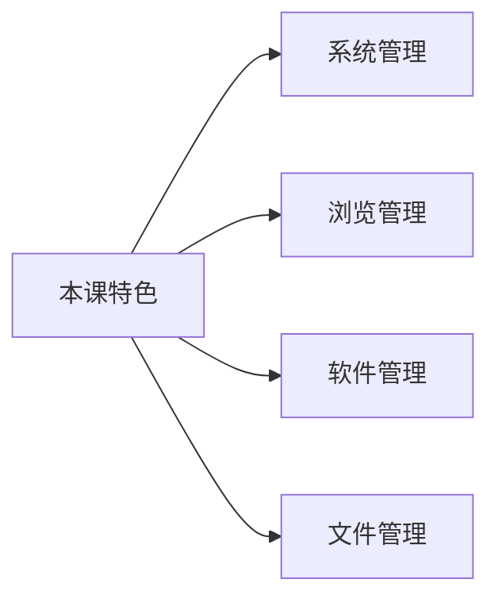

>   场景：一名普通的大学生选购了一台电脑，这台电脑是亲戚/父母/朋友/淘宝上购买的，不管怎么样，ta 拿到了电脑，但是 ta 却很苦恼，如何正确的使用电脑？因此本教程重点在于您在第一时间拿到电脑后，正确的使用方式。

# 1.系统设置

>   系统面板为展开...

## 个性设置

1.   背景
2.   颜色
3.   主题
4.   锁屏界面
5.   输入法

## 密码设置

## 网络设置

## 蓝牙设置

## 屏幕设置

## 任务处理

## 复制剪切

# 2.浏览器

>   edge 为展开...

## 访问网页

## 常见网站

## 插件强化

# 3.软件

## 下载安装

## 常见软件

## 卸载清理

# 4.文件

>   资源管理器作为展开...

## 区分盘符

## 管理习惯

## 文件后缀

## 压缩解压

>   Windows 自己和其他压缩软件作为展开...

