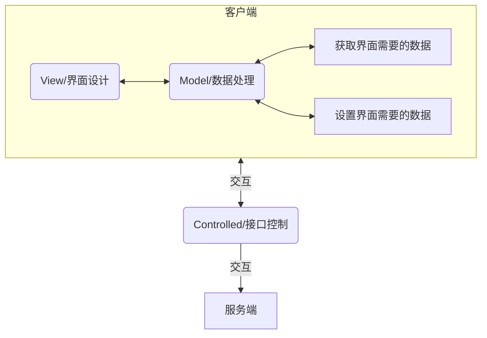
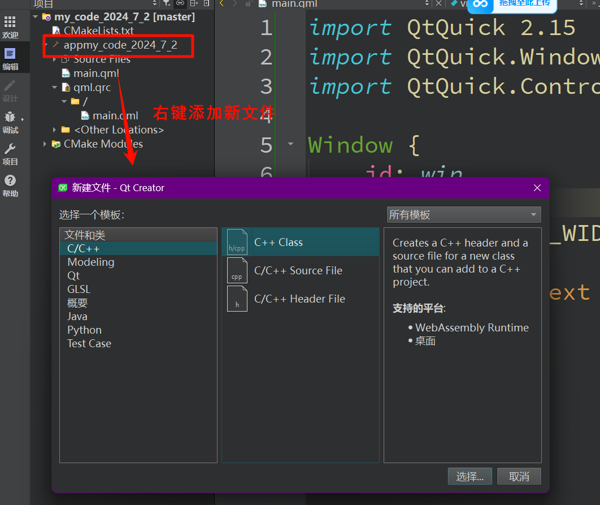
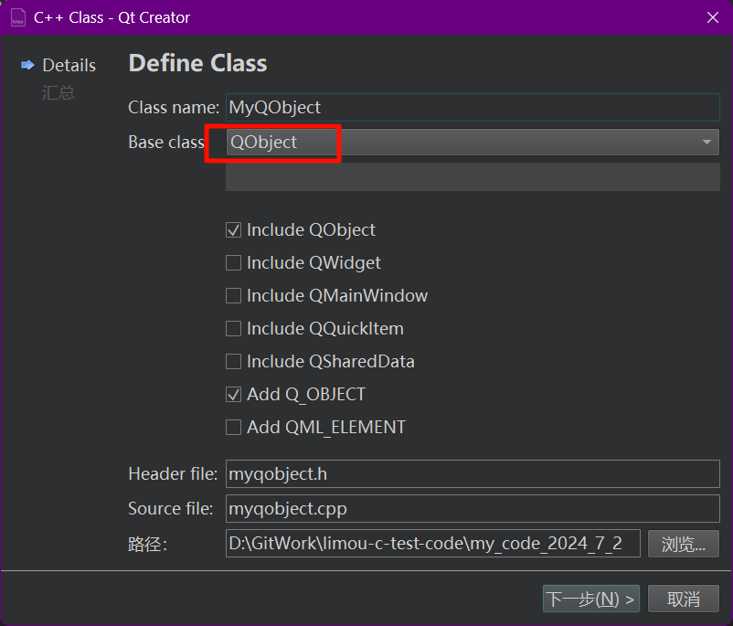

>   前要：

# 1.创建 QML 项目

使用版本还有构建过程，待补充...

# 2.基本的组件

下面介绍基本组件的同时，还会提到一些常见的概念，一边使用一边归纳总结。另外，有些属性是继承自父类组件的，因此有些组件的属性是重叠的，不过我想要在最后才总结组件的继承关系（我希望您先实践一下，不要有太大的负担，同时希望您快速上手）。如果您急需这份图的话，请看我的下一小结内容，里面就对继承关系做了解释。

## 2.1.主窗口(Window)

```cpp
// 使用 Window 的例子
import QtQuick 2.15 // 导入相关模块
import QtQuick.Window 2.15

Window {
    id: window // 设置组件的 id 值
    width: 640 // 设置宽度
    height: 480 // 设置高度
    visible: true // 设置组件是否可见
    title: qsTr("Hello World") // 设置窗口标题
    x: 100 // 组件左上角位置设置为父组件（这里是整个屏幕）原点的 x 轴 100 处
    y: 150 // 组件左上角位置设置为父组件（这里是整个屏幕）原点的 y 轴 200 处
    minimumWidth: 50 // 设置组件的最小宽度
    minimumHeight: 50 // 设置组件的最小高度
    maximumWidth: 800 // 设置组件的最大宽度
    maximumHeight: 800 // 设置组件的最大高度
    opacity: 0.8 // 取值为 [0, 1]
    property int value: 0 // 一个自定义的属性

    /* 尝试定义一个信号槽
    signal mySig() // 定义一个信号
    onMySig: { // 使用 "on" + "信号名" 定义触发事件(这里这个事件可以随时触发)
        // 这个我们后面提及信号槽的时候进行补充...
    }
    */

    // 对于组件的大部分属性（包括自定义属性）都会自动生成 "on" + "属性" + "Changed" 这个改动槽, 并且在属性值改动时自动触发对应的信号
    onWidthChanged: {
        console.log(window.width);
        window.value += 1; // 顺便修改自定义属性的内部值
    }

    onValueChanged: { // 当自定义属性 value 发生修改时打印对应的值
        console.log(window.value);
    }
}

```

>   补充：一旦父控件的 `visible` 被设置为 `false`，那么即便子控件设置为 `true` 也依旧无法显示（但是后续提到的 `Popup` 是一个例外，不会被父控件影响）。

## 2.2.文本(Text)

```cpp
// 使用 Text 的例子
import QtQuick 2.15
import QtQuick.Controls 2.15

Window {
    visible: true
    width: 640
    height: 480
    title: "QML Text Example"

    Column {
        anchors.centerIn: parent
        spacing: 10

        Text {
            id: helloText
            text: "Hello, World!"
            color: "blue"
            font.pixelSize: 24
            font.bold: true
            horizontalAlignment: Text.AlignHCenter
            wrapMode: Text.Wrap
            // Text.NoWrap: 不进行换行, 如果文本超出了分配的宽度, 超出的部分将不会显示
            // Text.Wrap: 进行换行, 文本将在分配的宽度范围内自动换行, 以确保所有文本都能显示
            // Text.WrapAnywhere: 类似于 Wrap, 但允许在任何位置换行, 而不仅仅是在单词边界
            // Text.WrapAtWordBoundaryOrAnywhere: 优先在单词边界处换行, 如果无法在单词边界处换行, 则在任意位置换行
        }

        Text {
            text: "This is a red text with Arial font."
            color: "red"
            font { // 设置字体
                family: "Arial"
                pixelSize: 16
            }
        }

        Text {
            text: "Center aligned text."
            horizontalAlignment: Text.AlignHCenter
            verticalAlignment: Text.AlignVCenter
        }
    }
}

```

## 2.3.矩形(Rectangle)

```cpp
// 使用 Rectangle 的例子
import QtQuick 2.15
import QtQuick.Controls 2.15
import QtQuick.Window 2.15

Window {
    visible: true
    width: 640
    height: 480
    title: "Rotated Rectangle with Gradient"

    Rectangle {
        width: 200
        height: 100
        border.color: "blue"
        border.width: 2 // 设置向内宽度
        radius: 25 // 圆角半径为 25 像素
        rotation: 45 // 旋转角度为 45 度
        anchors.centerIn: parent // 设置处于父元素中心位置
        gradient: Gradient { // 设置渐变色
            GradientStop { position: 0.0; color: "lightsteelblue" }
            GradientStop { position: 1.0; color: "steelblue" }
        }

        // 设置鼠标输入区域
        MouseArea {
            anchors.fill: parent // 设置区域充满父元素
            onClicked: { // 主要在区域内点击鼠标救会打印日志
                console.log("Clicked rotated gradient rectangle");
            }
        }

        // 设置矩形内的文本
        Text {
            text: "Rotated Gradient Rectangle"
            color: "white"
            anchors.centerIn: parent
            font.pixelSize: 20 // 设置文字大小
            font.bold: true // 设置文字粗体
        }
    }

    Rectangle {
        width: 200
        height: 100
        color: "lightgreen"
        border.color: "green"
        anchors.top: parent.top
        anchors.centerIn: parent
        z: 1 // 默认所有组件一开始处于 0 图层

        Text {
            text: "Non-rotated Rectangle"
            color: "green"
            anchors.centerIn: parent
            font.pixelSize: 20
            font.bold: true
        }
    }
}

```

>   补充：`Popup` 组件在 `z` 轴属性上也同样是一个例外，无论 `z` 有多小，都会覆盖其他组件，只局限于 `Popup` 之间的顺序。

## 2.4.图片(Image)

```cpp
// 使用 Image 的例子
import QtQuick
import QtQuick.Window 2.15
import QtQuick.Controls 2.15

Window {
    width: 800
    height: 600
    title: "win"
    visible: true

    Image {
        id: img
        source: ":/code.jpg"
    }
}

```

## 2.5.按钮(Button)

```cpp
// 使用 Button 的例子
import QtQuick 2.15
import QtQuick.Window 2.15
import QtQuick.Controls 2.15

Window {
    id: window
    width: 640
    height: 480
    visible: true
    title: qsTr("Hello World")
    x: 100
    y: 150
        
    Button { // 一个按钮控件
        id: but1
        width: 100
        height: 100
        x: 0
        y: 0
        // focus: true // 置为 true 就可以显示获得焦点, 默认鼠标点击按钮后按钮就会得到焦点
        background: Rectangle { // background 属性定义了按钮的背景内容(这里设置为一个矩形组件), 后面会提及
            border.color: but1.focus ? "blue" : "black" // 设置矩形的边框样式(这里是获取到焦点就显示蓝色, 否则为黑色)
            border.width: 5 // 设置边框的向内宽度
        }
        onClicked: { // 当按钮被按下时触发日志输出
            console.log("but1 clicked!")
        }
        Keys.onRightPressed: { // 设置键位, 点击右方向键可以让另外一个按钮获得焦点
            but2.focus = true;
        }
    }
    
    Button {
        id: but2
        width: 100
        height: 100
        x: 110
        y: 0
        background: Rectangle {
            border.color: but2.focus ? "blue" : "black"
            border.width: 5
        }
        onClicked: {
            console.log("but2 clicked!")
        }
        Keys.onLeftPressed: {
            but1.focus = true;
        }
    }
}

```

```cpp
// 使用 Button 的例子
import QtQuick 2.15
import QtQuick.Window 2.15
import QtQuick.Controls 2.15

Window {
    id: root
    visible: true
    width: 640
    height: 480

    Button {
        id: but
        width: 100
        height: 40
        // enabled: true // 设置按钮是否可以被按下, 默认为 true
        text: "a button"
        background: Rectangle { // 定义按钮的背景
            color: { // 设置背景颜色
                if(but.pressed) {
                    return "yellow"
                } else {
                    return "blue"
                }
            }
            border.color: "red" // 设置边框颜色
            border.width: 1 // 设置边框宽度
            radius: 5 // 设置圆角
        }

        autoRepeat: true // 设置按住时允许连续触发 pressed()/released()/clicked()
        autoRepeatDelay: 3000 // 设置第一次触发到下一次触发的时间间隔
        autoRepeatInterval: 1000 // 设置连续触发的时间间隔

        // 下面都是常见的事件
        onPressed: { // 按下按钮时就触发
            console.log("pressed~")
            but.checkable = true // 强制属性
        }
        onReleased: { // 松开按钮时就触发
            console.log("released~")
        }
        onClicked: { // 按下按钮并且松开按钮时就触发
            console.log("clicked~")
        }
        onDoubleClicked: { // 双击按钮时就触发
            console.log("double clicked~")
        }
        onPressAndHold: { // 长按按钮时就触发
            console.log("time out clicked~")
        }
        onDownChanged: { // 按下状态改变时就触发
            console.log("down", down, "pressed", pressed)
        }

        // flat: true // 只有在按下时才会显示按钮颜色, 一般很少使用
        // highlighted: true // 在按前提供一个类似黑遮罩把按钮颜色略微遮住, 一般很少使用
    }
}

```

>   补充：在按钮内部加上 `contentItem: Rectangle {}` 可以用来自定义按钮内部的样式，而不使用简易的类似 `text` 等属性。同时塞上 `Text {}, Image {}` 等元素，高自定义出一个按钮组件。

此外还有几个特殊的按钮，您可以稍微了解一下。

```cpp
// 使用 DelayButton(延迟按钮) 的例子
import QtQuick 2.15
import QtQuick.Window 2.15
import QtQuick.Controls 2.15

Window {
    id: win
    width: 640
    height: 480
    visible: true
    title: qsTr("Hello World")
    x: 100
    y: 150

    DelayButton {
        width: 150
        height: 50
        delay: 3000 // 设置延迟最长时间
        x: 100
        y: 100
        onProgressChanged: { // 长按延迟按钮就可以触发事件
            console.log(progress)
        }
    }
    Button {
        width: 150
        height: 50
        x: 300
        y: 300
    }
}

```

```cpp
// 使用 RadioButton(单选按钮) 的例子
import QtQuick 2.15
import QtQuick.Window 2.15
import QtQuick.Controls 2.15

Window {
    id: win
    width: 640
    height: 480
    visible: true
    title: qsTr("Hello World")
    x: 100
    y: 150

    Column {
        RadioButton { // RadioButton 会实现自动排他
            text: qsTr("first")
        }
        RadioButton {
            text: qsTr("second")
        }
        RadioButton {
            text: qsTr("third")
        }
    }
}

```

```cpp
// 使用 TabButton(标签按钮) 的例子
import QtQuick 2.15
import QtQuick.Window 2.15
import QtQuick.Controls 2.15

Window {
    id: win
    width: 640
    height: 480
    visible: true
    title: qsTr("Hello World")
    x: 100
    y: 150

    TabBar { // 一般用来作为标签页切换使用
        TabButton {
            text: qsTr("first")
        }
        TabButton {
            text: qsTr("second")
        }
        TabButton {
            text: qsTr("third")
        }
    }
}

```

## 2.6.多选项(CheckBox)

```cpp
// 使用 CheckBox 的例子
import QtQuick 2.15
import QtQuick.Window 2.15
import QtQuick.Controls 2.15

Window {
    id: win
    width: 640
    height: 480
    visible: true
    title: qsTr("Hello World")
    x: 100
    y: 150

    ButtonGroup { // 借助 ButtonGroup 来实现排他性
        id: gro
        exclusive: true // 设置为排他的
        buttons: col.children // 需要实现排他的选项, 如果不使用这一个属性, 则可以在 CheckBox{} 中增加 ButtonGroup.group: <ButtonGroupId> 来实现
    }

    Column {
        id: col
        CheckBox {
            id: ch1
            tristate: true // 设置选项具有三态, 勾选和不勾选这两种还比较好理解, 剩下一种状态代表该选项既包含勾选又包含不勾选(之后我另写一份代码解释这个事情)
            text: qsTr("first")
            onCheckStateChanged: { // 选项勾选状态变化时就触发
                console.log(checkState) // 对应三个枚举类型 Qt.Unchecked, Qt.PartiallyChecked, Qt.Checked
            }

            // autoExclusive: true // 这个设置只对按钮有效, 想要实现排他性只能使用 ButtonGroup{} 来实现
        }
        CheckBox {
            id: ch2
            checked: true // 默认勾选
            text: qsTr("second")
        }
        CheckBox {
            id: ch3
            checked: false // 默认不勾选
            text: qsTr("third")
        }
    }
}

```

```cpp
// 实现一个 CheckBox 管理多个 CheckBox 的目的
// 使用自定义的组件
import QtQuick 2.15
import QtQuick.Window 2.15
import QtQuick.Controls 2.15

Window {
    id: win
    width: 640
    height: 480
    visible: true
    title: qsTr("Hello World")
    x: 100
    y: 150

    Column {
        id: col
        CheckBox {
            id: ch1
            text: qsTr("all")
            checkState: gro.checkState
        }

        ButtonGroup {
            id: gro
            exclusive: false
            checkState: ch1.checkState
        }
        CheckBox {
            id: ch2
            text: qsTr("first")
            leftPadding: indicator.width // 设置左边距
            ButtonGroup.group: gro
        }
        CheckBox {
            id: ch3
            text: qsTr("second")
            leftPadding: indicator.width // 设置左边距
            ButtonGroup.group: gro
        }
    }
}

```

```cpp
// 手动切换 CheckBox 的显示状态
import QtQuick 2.15
import QtQuick.Window 2.15
import QtQuick.Controls 2.15

Window {
    id: win
    width: 640
    height: 480
    visible: true
    title: qsTr("Hello World")
    x: 100
    y: 150

    Column {
        id: col
        CheckBox {
            id: ch1
            text: qsTr("aCheck")
            checkState: gro.checkState
            nextCheckState: function() { // 修改点击选项时所显示的图标
                if (checkState == Qt.Unchecked) {
                    return Qt.Unchecked // 因此这里这个选项会无法被勾选
                }
            }
        }
    }
}

```

## 2.7.滑动开关(Switch)

```cpp
// 使用 Switch 的例子
import QtQuick 2.15
import QtQuick.Window 2.15
import QtQuick.Controls 2.15

Window {
    id: win
    width: 640
    height: 480
    visible: true
    title: qsTr("Hello World")
    x: 100
    y: 150

    Column {
        Switch { // Switch 也需要使用组来实现排他
            text: qsTr("first")
            onPositionChanged: {
                console.log("pos: ", position)
            }
        }
        Switch {
            LayoutMirroring.enabled: true // 设置组件为镜像, 其他组件也有类似的功能
            text: qsTr("second")
        }
        Switch {
            text: qsTr("third")
        }
    }
}

```

## 2.8.弹出窗口(Popup)

```cpp
// 使用 Popup 的例子
import QtQuick 2.15
import QtQuick.Window 2.15
import QtQuick.Controls 2.15

Window {
    id: win
    width: 640
    height: 480
    visible: true
    title: qsTr("Hello World")
    x: 100
    y: 150

    Popup {
        id: pop
        x: 100
        y: 100
        width: 200
        height: 300
        closePolicy: Popup.NoAutoClose // 默认关闭逻辑为 Popup.CloseOnEscape | Popup.CloseOnPressOutside
        // modal: true // 设置是否为模态组件, 必须关闭该弹窗才能操作其他控件, 本例中如果设置这个属性为 true 就会导致 "关闭" 按钮失效
        dim: true // 但设置了 dim 为 true 后, 除了弹窗以外的地方都会被覆盖为灰黑色
        enter: Transition { // 设置弹窗弹出过渡动画
            NumberAnimation {
                property: "opacity"
                from: 0.0
                to: 1.0
            }
        }
        exit: Transition { // 设置弹窗退出过渡动画
            NumberAnimation {
                property: "opacity"
                from: 1.0
                to: 0.0
            }
        }
        contentItem: Rectangle {
            anchors.fill: parent
            Text {
                id: txt
                text: qsTr("limou3434")
            }
        }

        // 可以在 modal: true 情况下自定义弹窗以外的地方的颜色
        // Overlay.modal: Rectangle {
        //     anchors.fill: parent
        //     color: "#FF0000"
        // }
    }

    // 制作一个打开弹窗按钮
    Button {
        text: qsTr("打开")
        width: 50
        height: 50
        x: 0
        y: 0
        onClicked: {
            pop.open() // 相当于 pop.visible = true
        }
    }

    // 制作一个关闭弹窗按钮
    Button {
        text: qsTr("关闭")
        width: 50
        height: 50
        x: 100
        y: 0
        onClicked: {
            pop.close() // 相当于 pop.visible = false
        }
    }
}

```

## 2.8.重复器(Repeater)

```cpp
// 使用 Repeater 的例子
import QtQuick 2.15
import QtQuick.Controls 2.15

Window {
    visible: true
    width: 640
    height: 480
    title: "QML Text Example"

    Repeater {
        model: 3 // 代表重复绘制的组件个数
        // model: [Button, Rectangle, MouseArea]
        Rectangle {
            x: index * 120 // index 代表第 i 个组件
            width: 100
            height: 40
            color: "yellow"
        }
    }

    Repeater {
        model: ["Button", "Rectangle", "MouseArea"] // 还可以使用列表
        Button {
            x: index * 120 // index 代表第 i 个组件
            y: 90
            width: 100
            height: 40
            text: modelData // 可以访问列表中的数据, 这很有用
        }
    }
}

```

## 2.9.列表视图(ListView)

```cpp
// 使用 ListView 的例子
import QtQuick 2.15
import QtQuick.Controls 2.15

Window {
    visible: true
    width: 640
    height: 480
    title: "QML Text Example"

    ListView {
        width: 180
        height: 200
        spacing: 10 // 设置间隔
        model: 3 // 控制数据(也可以使用列表)
        delegate: Button { // 控制每项数据的绘制方式
           text: index // 也可以使用 modelData
        }
    }

    ListView {
        width: 180
        height: 200
        x: 200
        spacing: 10 // 设置间隔
        // header: ...
        // footer: ...
        model: ListModel { // 还可以使用
            ListElement {
                name: "Bill Smith"
                number: "555 3264"
                myValue: 111
            }
            ListElement {
                name: "John Brown"
                number: "555 8426"
                myValue: 222
            }
            ListElement {
                name: "Sam Wise"
                number: "555 0473"
                myValue: 333
            }
        }
        delegate: Button { // 控制每项数据的绘制方式
            text: name + " " + number + " " + myValue // 类似使用对象来使用属性
        }
        // section.property: ...
        // section.criteria: ...
        // section.delegate: ...
    }
}

```

## 2.10.下拉框(ComboBox)

```cpp
// 使用 ComboBox 的例子
import QtQuick 2.15
import QtQuick.Controls 2.15

Window {
    visible: true
    width: 640
    height: 480
    title: "QML Text Example"

    ComboBox {
        editable: true // 选项框内变成可编辑的状态
        textRole: "text"
        valueRole: "name"
        width: 300
        // displayText: currentText + " " + currentValue // 选项框中显示为 text + value 的形式, 但是只有在 editable: false 时有效
        model: ListModel { // 也可以是数字和数字
            id: mod
            ListElement {
                text: "text1"
                name: "name1"
            }
            ListElement {
                text: "text2"
                name: "name2"
            }
            ListElement {
                text: "text3"
                name: "name2" // 这里时故意填写 name2 的
            }
        }
        Component.onCompleted: {
            console.log(count)
        }
        onAccepted:  { // 编辑后按下回车时就会触发
            if (find(editText) === -1) {
                console.log(editText) // 打印用户输入的文本
                mod.append({text: editText}) // 将用户输入的不存在的项加入到下拉框中
            }
        }
        onCurrentTextChanged: { // 选项切换时对应的 Text 值发生改动时就触发
            console.log(currentText)
        }
        onCurrentValueChanged: { // 选项切换时对应的 Value 值发生改动时就触发
            console.log(currentValue)
        }
    }

    ComboBox {
        x: 100
        y: 100
        model: 10
        editable: true
        validator: IntValidator { // 限制输入的大小为 [0, 20]
            top: 20
            bottom: 0
            // 或者写一下正则表达式, 不过就需要换为 RegExpValidator{} 了
        }
        onAcceptableInputChanged: {
            console.log(acceptableInput) // 输出经过验证器后是否为真
        }
    }
}

```

## 2.11.布局(Column)

```cpp
// 使用 Column 的例子
import QtQuick 2.15
import QtQuick.Window 2.15
import QtQuick.Controls 2.15

Window {
    id: win
    visible: true
    width: 800
    height: 480
    title: "limou"

    Column {
        spacing: 5 // 子组件的间距
        Button {
            width: 100
            height: 50
        }
        Button {
            width: 100
            height: 50
        }
        Button {
            width: 100
            height: 50
        }
        populate: Transition { // 会设置出一个动画效果, 
            NumberAnimation {
                properties: "x, y"
                from: 1000
                duration: 100 // 1ms
                easing.type: Easing.OutBounce
            }
        }
    }

    // Column { // 和上述等价的写法
    //     spacing: 5 // 子组件的间距
    //     Repeater {
    //         model: 3
    //         Button {
    //             width: 100
    //             height: 50
    //             x: 150
    //         }
    //     }
    // }
}

```

```cpp
// 使用 Column 的例子
import QtQuick 2.15
import QtQuick.Window 2.15
import QtQuick.Controls 2.15

Window {
    id: win
    visible: true
    width: 800
    height: 480
    title: "limou"

    Column {
        id: col
        spacing: 5 // 子组件的间距

        Repeater {
            id: rep
            model: ListModel {
                // 内部一开始是空的...
            }

            delegate: Button { // 定义如何渲染每一个项
                width: 100
                height: 50
                text: model.name
            }
        }

        // 添加弹跳动画效果
        move: Transition {
            NumberAnimation {
                properties: "x, y"
                easing.type: Easing.OutBounce
            }
        }
        add: Transition {
            NumberAnimation {
                properties: "x, y"
                easing.type: Easing.OutBounce
            }
        }
        // 入场缩放动画效果
        populate: Transition {
            NumberAnimation {
                properties: "x, y"
                from: 1000
                duration: 100 // 1ms
                easing.type: Easing.OutBounce
            }
        }
    }

    Button {
        width: 100
        height: 50
        anchors.bottom: parent.bottom
        anchors.left: parent.left
        text: "Add Item"
        onClicked: {
            rep.model.insert(
                0, // 添加到的 index
                {"name": "Item " + rep.model.count} // 为元素添加属性(insert 的第二个参数实际上就是把新属性添加到 delegate 模板中，然后生成新的 ListElement 插入到列表视图中)
            )
        }
    }
}

```

如果 `Column` 换为 `Row` 就可以变成横向布局。

## 2.12.定时器(Timer)

```cpp

```

## 2.12.区域(XArea)

### 2.12.1.鼠标区域(MouseArea)

```cpp
// 鼠标区域的常见事件
import QtQuick
import QtQuick.Window 2.15
import QtQuick.Controls 2.15

Window {
    width: 800
    height: 600
    title: "win"
    visible: true

    MouseArea {
        id: mou
        width: 200
        height: 200
        acceptedButtons: Qt.LeftButton | Qt.RightButton | Qt.MiddleButton // 设置允许鼠标左键、鼠标中键、鼠标右键...(默认只设置了鼠标左键)

        Rectangle { // 由于鼠标区域是不可见的, 因此利用矩形达到间接可见的目的
            anchors.fill: parent
            color: "black"
        }

        onPressed: { // 鼠标按下时触发
            console.log("pressed~")
            if (pressedButtons & Qt.LeftButton) { // pressedButtons 是该槽获取到的一个 Qt 变量, 可以用来区分鼠标的左右键...
                console.log("left pressed~")
            } else if (pressedButtons & Qt.RightButton) {
                console.log("right pressed~")
            } else if (pressedButtons & Qt.MiddleButton) {
                console.log("middle pressed~")
            }
        }
        onReleased: { // 鼠标松开时触发
            console.log("released~")
        }
        onClicked: { // 鼠标按下并且松开时触发
            console.log("clicked~")
        }

        hoverEnabled: true // 设置是否打开"悬浮/鼠标徘徊"
        // 若为 false 就会触发和 onContainsPressChanged() 槽一样的行为, 都是按下松开鼠标区域时触发
        // 若为 true 时鼠标悬浮进入鼠标区域和离开都会触发 onContainsMouseChanged() 槽, 无论是否按下或松开
        cursorShape: Qt.CrossCursor // 设置鼠标样式为十字光标, 还有其他的样式...
        onContainsMouseChanged: { // 鼠标悬浮进入或悬浮离开就触发
            console.log("onContainsMouseChanged()->", "(", mouseX, ",", mouseY, ")")
        }
        onContainsPressChanged: { // 鼠标进入按下或进入松开就触发
            console.log("onContainsPressChanged()")
        }

        onDoubleClicked: console.log("double clicked!") // 鼠标双击就触发

        onMouseXChanged: { // 鼠标有移动就触发
            console.log("mouse is move");
        }

        // pressAndHoldInterval: 300 可以修改长按事件的触发时间(默认为 800ms)
        onPressAndHold: { // 长按触发, 默认 800ms
            console.log("double clicked~")
        }
    }
}

```

还可以进行拖动组件的设置，这点可以依靠鼠标区域做到，非常强大。

```cpp
// 鼠标区域设置拖动功能
import QtQuick
import QtQuick.Window 2.15
import QtQuick.Controls 2.15

Window {
    id: win
    width: 800
    height: 600
    title: "win"
    visible: true

    Rectangle { // 被拖动的块
        id: rec
        width: 100
        height: 100
        color: "red"
        visible: true

        MouseArea {
            id: mou
            anchors.fill: parent
            drag.target: rec // 允许鼠标拖拽的作用对象
            drag.axis: Drag.XAndYAxis // 限制拖动操作的轴向, 可以设置为 Drag.XAxisD、Drag.YAxis、Drag.XAndYAxis
            drag.minimumX: 0 // 设置可移动的 x 轴最小值
            drag.maximumX: win.width - rec.width // 设置可移动的 x 轴最大值
            drag.minimumY: 0 // 设置可移动的 y 轴最小值
            drag.maximumY: win.height - rec.height // 设置可移动的 y 轴最大值
            /* 不设置限制就可以无限制移动 */

            drag.filterChildren: false
            // 设置 drag.filterChildren = true 可以让子组件的鼠标区域继承父组件的拖动属性（并和父组件一起做拖动）
            // 但如果设置为 false 就不会继承父组件的拖动属性, 也会导致自己的拖动事件失效

            Rectangle {
                id: sub
                width: 50
                height: 50
                color: "blue"
                visible: true

                MouseArea {
                    anchors.fill: parent
                }
            }
        }

    }
}

```

有时会有两个重叠的组件同时具有各自的鼠标区域，这种情况下有可能需要在触发 `z` 轴靠前的组件鼠标事件的同时，需要触发其背后的组件（其实这也是一种事件冒泡），这种情况就需要通过两个属性来做到。

```cpp
// 实现鼠标事件冒泡
import QtQuick 2.12
import QtQuick.Window 2.12

Window {
    id: root
    visible: true
    width: 640
    height: 480

    MouseArea {
        anchors.fill: parent
        onClicked: console.log("root clicked")
    }

    Rectangle {
        id: item
        width: 200
        height: 200
        color: "green"

        MouseArea {
            anchors.fill: parent
            propagateComposedEvents: true // 设置是否允许传递事件到 MouseArea
            onClicked: function(mouse) { // mouse 是由 MouseArea 组件的 onClicked:{} 事件自动传递给处理函数, 在较新的 Qt 版本中, mouse 事件变量将不会自动注入到处理函数中, 所以需要您手动添加 function(mouse) 提示注入
                console.log("item clicked")
                mouse.accepted = false // 设置为 true 就会遮挡事件传递(如果这里您爆警告了有可能就是事件注入的问题)
            }
        }
    }
}

```

### 2.12.2.键盘区域()


# 3.自定义组件

```cpp
// 创建自定义的组件
import QtQuick 2.15

Rectangle {
    id: borderRect
    visible: true
    color: "red"
    property int myTopMargin: 10
    property int myBottomMargin: 10
    property int myLeftMargin: 10
    property int myRightMargin: 10

    Rectangle {
        id: innerRect
        visible: true
        color: "blue"
        anchors.fill: parent
        anchors.topMargin: borderRect.myTopMargin
        anchors.bottomMargin: borderRect.myBottomMargin
        anchors.leftMargin: borderRect.myLeftMargin
        anchors.rightMargin: borderRect.myRightMargin
    }
}

```

```cpp
// 使用自定义的组件
import QtQuick 2.15
import QtQuick.Window 2.15
import QtQuick.Controls 2.15

Window {
    id: win
    width: 640
    height: 480
    visible: true
    title: qsTr("Hello World")
    x: 100
    y: 150

    MyRectangle {
        id: myret
        width: 200
        height: 200
        myTopMargin: 10
        myBottomMargin: 20
        myLeftMargin: 30
        myRightMargin: 40
        x: 10
        y: 15
    }
}

```

>   补充：自定义属性 `property` 的相关使用，上述自定义组件中就是最常见的使用方法，除了使用 `int(整数)` 还可以使用 `real(实数), string(字符串), color(颜色), url(路径), list<元素类型>(数组)...`。
>
>   不过由于设置颜色的值和设置字符串的值都是使用字符串，因此实际上两种类型定义出来的自定义属性都可以拿来赋值给颜色属性，不过一般不推荐使用字符串类型替代颜色类型（同理也不推荐使用字符串替代路径）。
>
>   甚至还可以定义一个 `Component(组件)` 类型，这种类型的自定义属性有什么用呢？最典型的用法就是在这个自定义组件中包含 `Loader` 加载器的用法（关于加载器后面会提到，您可以先跳过不看）。
>
>   ```cpp
>   // 一份自定义组件的伪代码
>   自定义组件 {
>      	property Component myComponent
>      	Loader: {
>   		id: loa
>          	sourceComponent: myComponent
>      }
>   }
>   
>   ```
>
>   这样就可以达到又外部传递组件进行加载的目的，还可以是更加具体的组件作为类型。此外还有一个更加通用的类型 `var(通用类型)`，在有些时候会更加方便。
>
>   另外，如果我们希望对自定义属性进行控制访问怎么办呢？例如，规定用户只能对自定义属性进行访问而无法修改。可以在自定义属性的定义最前面加一个 `readonly`。
>
>   那如果遇到需要强制让使用自定义组件的用户对某个属性进行赋值怎么办？也有类似的关键字 `required` 可以使用，如果用户没有赋值，就会导致程序奔溃。
>
>   此外，还有一个别名的操作，使用关键字 `alias` 替换属性类型声明的自定义属性，如果赋值为本自定义组件的子组件的 `id`，这种别名的操作就可以运行外部使用自定义组件时，可以访问该自定义组件内部的子组件。还可以使用 `id.属性` 的形式暴露控件的某个属性（这种做法会更多一些）。
>
>   如果希望某些属性不被用户所见呢？也是可以的，不过需要借助 `QObject{}` 来实现，对于一个组件来说，如果希望某些属性只能自己所用，则可以包含 `QObject{}` 对象，把被隐藏的属性放入其中，则属性只能本组件访问，而无法被其他外部组件访问。

# 4.状态切换和动画

使用 `states` 和 `state` 可以在 `QML` 中创建不同的界面状态，并在这些状态之间进行切换。并且也有相当多的组件可以设置动画效果，包括数值改动时动画效果（`NumberAnimation`）、颜色改动时的动画效果（`ColorAnimation`）。甚至还有循环动画队列（`SequentialAnimation` ）、预加载动画（`Behavior`）...

```cpp
// 设置按钮动画效果
import QtQuick 2.15
import QtQuick.Controls 2.15
import QtQuick.Window 2.15

Window {
    id: root;
    visible: true;
    width: 640;
    height: 480;
    title: "States Example";

    Rectangle {
        id: rect;
        width: 200;
        height: 200;
        anchors.centerIn: parent
        color: "lightblue";
        radius: 10;
        states: [ // 设置展开和收缩状态
            State {
                name: "expanded"; // 展开状态
                PropertyChanges {
                    target: rect; // 明确指出哪个对象的属性会在状态变化或过渡动画中被修改
                    width: 400;
                    height: 400;
                    color: "lightgreen";
                    radius: 20;
                    y: 100;
                }
            },
            State {
                name: "collapsed"; // 收缩状态
                PropertyChanges {
                    target: rect; // 明确指出哪个对象的属性会在状态变化或过渡动画中被修改
                    width: 200;
                    height: 200;
                    color: "lightblue";
                    radius: 10;
                }
            }
        ]
        state: "collapsed"; // 默认设置为收缩状态
        transitions: [ // 设置转场动画效果
            Transition {
                from: "collapsed"; // 起始状态
                to: "expanded"; // 目的状态
                reversible: true; // 设置动画平滑过渡的过程是可逆的
                /* 后续根据需要改为动画的属性进行对应的关注和时间设置... */
                // 设置颜色动画
                ColorAnimation {
                    property: "color"; // 单个属性
                    duration: 100; // 动画持续时间
                }
                // 设置数值动画
                NumberAnimation {
                    properties: "width,height,radius"; // 众多属性
                    duration: 100; // 动画持续时间
                }
            }
        ]

        // 设置文字组件
        Text {
            text: rect.state === "collapsed" ? "Click to Expand" : "Click to Collapse";
            anchors.centerIn: parent;
            font.pixelSize: 20;
            color: "white";
        }

        // 设置鼠标输入区域
        MouseArea {
            anchors.fill: parent;
            onClicked: { // 当鼠标点击矩形时发送状态切换
                rect.state = rect.state === "collapsed" ? "expanded" : "collapsed"; // 这里的三等号用于比较两个值及其类型是否都相等
            }
        }
    }
}

```

# 5.代码调试

在创建组件时会自动发送生命周期信号，在销毁组件的时候会自动发送 `Destruction` 信号。这两个生命周期信号特别适合用来调试打印，您使用 `Component.onCompleted: {}` 和 `Component.onDestruction: {}` 即可。

```cpp
// 利用生命周期信号进行调试
import QtQuick 2.15
import QtQuick.Controls 2.15
import QtQuick.Window 2.15

Window {
    visible: true
    width: 640
    height: 480

    Rectangle {
        id: parentRect
        width: 200
        height: 200
        color: "lightblue"
        anchors.centerIn: parent

        Rectangle {
            id: childRect
            width: 100
            height: 100
            color: "red"
            anchors.centerIn: parent

            visible: false // 初始状态隐藏子级 Rectangle

            Component.onCompleted: { // 子矩形被创建时触发
                console.log("Child rectangle completed creation.")
            }

            Component.onDestruction: { // 子矩形被销毁时触发
                console.log("Child rectangle is being destroyed.")
            }
        }

        MouseArea {
            anchors.fill: parent
            onClicked: {
                // 切换子级 Rectangle 的可见性
                childRect.visible = !childRect.visible;
                if (childRect.visible) {
                    console.log("Child rectangle shown.");
                } else {
                    console.log("Child rectangle hidden.");
                }
            }
        }
    }
}

```

当然，这种使用还是 `Component` 中比较粗浅的用法。

# 6.部件和加载器

-   `Loader` 用来动态加载其他 `QML` 组件，允许在运行时根据需要加载不同的 `QML` 文件或组件，并将它们作为子项添加到界面中。
-   `Component` 用来定义可重用的组件，它通常与 `Loader` 结合使用，以便在需要时动态加载和显示特定的 `QML` 组件，因此在创建成功时不会立刻显示出来。

```cpp
// 页面 1 的代码
import QtQuick 2.15

Rectangle {
    width: 400
    height: 300
    color: "lightblue"

    Text {
        text: "Page 1"
        font.pixelSize: 24
        anchors.centerIn: parent
    }
}

```

```cpp
// 页面 2 的代码
import QtQuick 2.15

Rectangle {
    width: 400
    height: 300
    color: "lightgreen"

    Text {
        text: "Page 2"
        font.pixelSize: 24
        anchors.centerIn: parent
    }
}

```

```cpp
// 随机动态切换不同的页面
import QtQuick 2.15
import QtQuick.Controls 2.15

Window {
    visible: true
    width: 400
    height: 300
    title: "Dynamic Component Loading"

    // 声明页面 1
    Component {
        id: pageComponent1 // 定义默认加载的组件
        Page1 { // 装入 Page1 组件
            Component.onCompleted: { // 设置创建时的回调
                console.log("create~", width, height);
            }
            Component.onDestruction: { // 设置销毁时的回调
                console.log("destroy~", width, height);
            }
        }
    }

    // 声明页面 2
    Component {
        id: pageComponent2 // 定义备选的组件
        Page2 { // 装入 Page2 组件
            Component.onCompleted: { // 设置创建时的回调
                console.log("create~", width, height);
            }
            Component.onDestruction: { // 设置销毁时的回调
                console.log("destroy~", width, height);
            }
        }
    }

    // 加载器
    Loader {
        id: pageLoader
        anchors.fill: parent // Loader 占据整个父窗口的大小
        sourceComponent: pageComponent1 // 默认先加载 pageComponent 中定义的组件
        /* 另外一种等价写法是 source: "/file_path" */
        onStatusChanged: { // 状态发送改变就被触发
            console.log("status: ", status);
        }
    }

    // 根据条件切换加载的组件
    function loadPage(condition) {
        if (condition === "page2") {
            pageLoader.sourceComponent = pageComponent2;
        } else {
            pageLoader.sourceComponent = pageComponent1;
        }
    }

    // 模拟条件变化, 实际项目中这里可能是动态绑定到数据模型或其他条件变化的地方
    Timer {
        interval: 2000; // 每 2 秒变化一次条件
        running: true;
        repeat: true;
        onTriggered: {
            var condition = Math.random() > 0.5 ? "page2" : "page1";
            loadPage(condition); // 调用回调函数
        }
    }

    // 设置销毁按钮
    Button {
        width: 50;
        height: 50;
        onClicked: {
            pageLoader.sourceComponent = null;
        }
    }
}

```

不过这种动态创建出来的组件有时是有些修改困惑的，由于无法确定加载时间，因此希望修改被加载组件的某些特性时，就不能直接进行加载了。例如在下面这个例子中，我尝试使用了三种方式来修改动态加载组件的属性，其中只有最后一种是成功的。

```cpp
// 修改动态加载组件的属性
import QtQuick 2.15
import QtQuick.Controls 2.15

Window {
    width: 800
    height: 600
    visible: true
    title: "Dynamic Component Loading"

    // 声明矩形
    Component {
        id: comp
        Rectangle {
            id: rect
            width: 50
            height: 50
            color: "lightblue"
            Component.onCompleted: {
                console.log("create: ", width, height);
            }
            Component.onDestruction: {
                console.log("destroy: ", width, height);
            }
        }
    }

    // 加载器
    Loader {
        id: loader
        sourceComponent: comp // 默认先加载 pageComponent 中定义的组件
    }

    // 设置销毁按钮
    Button {
        width: 50;
        height: 50;
        y: 50;
        onClicked: {
            /* 错误写法: rect.width += 50; */
            /* 错误写法: comp.rect.width += 50; */
            loader.item.width += 50; // 虽然不知道加载了什么...但我们知道一定有一个 item, 这是一个异步的属性
        }
    }
}

```

另外如果需要加载图片，就没必要一次性加载图片再进行渲染，这样对于界面渲染来说太慢了（会被图片的渲染速度拖累到）。因此必须把图片加载的过程变成异步加载，因此就需要使用异步属性来加载图片。

```cpp
// 加载静态图片
import QtQuick
import QtQuick.Window 2.15
import QtQuick.Controls 2.15

Window {
    width: 800
    height: 600
    title: "win"
    visible: true

    Component {
        id: com
        Image {
            id: img
            source: ":/code.jpg"
            width: 100
            height: 100
            visible: true
        }
    }

    Loader {
        id: loa
        sourceComponent: com // 无法加载动态图片
    }
}
```

同时需要注意 `Loader.source=.../Loader.sourceComponent=...` 是直接无法动态显示 `Image{}` 组件中的类似 `.gif` 图片文件的，需要用到继承而来的 `AnimatedImage{}` 来动态加载这种类型的图片（这个组件还有一个 `speed` 属性来控制速度，布尔属性 `paused` 控制是否暂停）。

```cpp
// 加载动态图片
import QtQuick
import QtQuick.Window 2.15
import QtQuick.Controls 2.15

Window {
    width: 800
    height: 600
    title: "win"
    visible: true

    Component {
        id: com
        AnimatedImage {
            id: img
            source: ":/code.jpg"
            width: 100
            height: 100
            visible: true
        }
    }

    Loader {
        id: loa
        sourceComponent: com // 无法加载动态图片
    }
}

```

# 7.Cpp 和 QML 交互

>   这要重新书写...待补充...

前面基本都是对 `UI` 进行静态绘制，因此可以使用 `Cpp` 来进行动态渲染，并且我们需要先了解一下一些前后端开发的流程。



这种统一的分离设计就是经典的 `MVC` 架构。然后我们再来看看迟迟未看的 `QML` 项目中的 `main.cpp` 文件。

```cpp
// 查看并解读 main.cpp 文件
#include <QGuiApplication> // QGuiApplication 类的头文件, 是所有 Qt 应用程序的基类, 负责应用程序的生命周期和资源管理
#include <QQmlApplicationEngine> // QQmlApplicationEngine 类的头文件, 用于加载和执行 QML 代码。

int main(int argc, char *argv[])
{
    QGuiApplication app(argc, argv); // 创建应用程序对象
    QQmlApplicationEngine engine; // 创建 QML 对象
    const QUrl url(QStringLiteral("qrc:/my_code_2024_7_2/main.qml")); // 创建 QML 文件的 URL

    QObject::connect( // 使用 QObject::connect（） 连接 QQmlApplicationEngine：：objectCreated（） 信号到一个 lambda表达式槽函数
        &engine, // 发送信号对象
        &QQmlApplicationEngine::objectCreated, // 信号类型
        &app, // 处理信号对象
        [url](QObject *obj, const QUrl &objUrl) { // 信号处理
            if (!obj && url == objUrl)
                QCoreApplication::exit(-1);
        },
        Qt::QueuedConnection // 指定连接的类型为排队连接, 信号的传递将在事件循环中排队进行
    );

    engine.load(url); // 加载 QML 文件
    return app.exec(); // 进入事件循环
}

```

## 7.1.Cpp 返回 QML 数值

假设场景：我们希望通过 `Cpp` 和 `QML` 交互的形式，对界面做动态的修改。因此我们可以尝试使用一个叫做 **全局对象/上下文对象(头文件 QQmlContext)** 的东西，让所有的 `.qml` 文件都可以访问到 `Cpp` 传递回来的数据。

```cpp
// main.cpp
#include <QGuiApplication> // QGuiApplication 类的头文件, 是所有 Qt 应用程序的基类, 负责应用程序的生命周期和资源管理
#include <QQmlApplicationEngine> // QQmlApplicationEngine 类的头文件, 用于加载和执行 QML 代码。
#include <QQmlContext> // 引入上下文对象的头文件

int main(int argc, char *argv[])
{
    QGuiApplication app(argc, argv); // 创建应用程序对象
    QQmlApplicationEngine engine; // 创建 QML 对象
    const QUrl url(QStringLiteral("qrc:/my_code_2024_7_2/main.qml")); // 创建 QML 文件的 URL
    QQmlContext* context = engine.rootContext(); // 创建一个上下文对象

    context->setContextProperty("SCREEN_WIDTH", 200); // 返回所有 .qml 一个全局对象 "SCREEN_WIDTH", 可以直接被使用

    QObject::connect( // 使用 QObject::connect（） 连接 QQmlApplicationEngine：：objectCreated（） 信号到一个 lambda表达式槽函数
        &engine, // 发送信号对象
        &QQmlApplicationEngine::objectCreated, // 信号类型
        &app, // 处理信号对象
        [url](QObject *obj, const QUrl &objUrl) { // 信号处理
            if (!obj && url == objUrl)
                QCoreApplication::exit(-1);
        },
        Qt::QueuedConnection // 指定连接的类型为排队连接, 信号的传递将在事件循环中排队进行
    );

    engine.load(url); // 加载 QML 文件
    return app.exec(); // 进入事件循环
}

```

```cpp
// main.qml
import QtQuick 2.15
import QtQuick.Window 2.15
import QtQuick.Controls 2.15

Window {
    id: win
    visible: true
    width: SCREEN_WIDTH
    height: 480
    title: "QML Text Example"
}

```

## 7.2.Cpp 注册 QML 模块

另外，如果复杂一些，希望使用 `Cpp` 制作一个类对象，然后交给 `.qml` 文件作为模块导入，这样也可以达到自定义组件的目的。





```cpp
// myqobject.h
#ifndef MYQOBJECT_H
#define MYQOBJECT_H

#include <QObject>

// 编写下述类
class MyQObject : public QObject
{
    Q_OBJECT

public:
    explicit MyQObject(QObject *parent = nullptr);

    int getMyValue() const;
    void setMyValue(int newMyValue);

    QString getMyString() const;
    void setMyString(const QString &newMyString);

signals:
    void myValueChanged();

    void myStringChanged();

private:
    int myValue;
    QString myString;

    // 属性 + 读方法 + 写方法 + 检测到属性在 qml 中被修改后就会立刻发送的通知信号 + FINAL
    // 允许您将 Cpp 类的成员变量以属性的形式暴露给 QML 以及其他 Qt 系统
    Q_PROPERTY(int myValue READ getMyValue WRITE setMyValue NOTIFY myValueChanged FINAL) // 设置需要返回给 .qml 文件的 QObject 组件的属性
    Q_PROPERTY(QString myString READ getMyString WRITE setMyString NOTIFY myStringChanged FINAL)
    /* 还有一种比较简便的写法
    Q_PROPERTY(int myValue MEMBER myValue NOTIFY myValueChanged FINAL)
    Q_PROPERTY(QString myString MEMBER myString NOTIFY myStringChanged FINAL)
    */
};

#endif // MYQOBJECT_H

```

```cpp
// myqobject.cpp
#include "myqobject.h"

MyQObject::MyQObject(QObject *parent)
    : QObject{parent}
{}

int MyQObject::getMyValue() const
{
    return myValue;
}

void MyQObject::setMyValue(int newMyValue)
{
    if (myValue == newMyValue)
        return;
    myValue = newMyValue;
    emit myValueChanged();
}

QString MyQObject::getMyString() const
{
    return myString;
}

void MyQObject::setMyString(const QString &newMyString)
{
    if (myString == newMyString)
        return;
    myString = newMyString;
    emit myStringChanged();
}

```

```cpp
// main.cpp
#include <QGuiApplication> // QGuiApplication 类的头文件, 是所有 Qt 应用程序的基类, 负责应用程序的生命周期和资源管理
#include <QQmlApplicationEngine> // QQmlApplicationEngine 类的头文件, 用于加载和执行 QML 代码。
#include <QQmlContext> // 引入上下文对象的头文件
#include "myqobject.h"

int main(int argc, char *argv[])
{
    QGuiApplication app(argc, argv); // 创建应用程序对象
    QQmlApplicationEngine engine; // 创建 QML 对象
    const QUrl url(QStringLiteral("qrc:/my_code_2024_7_2/main.qml")); // 创建 QML 文件的 URL

    /* 一般不会这么做, 并且可能需要设置一些 CMake 的选项, 很麻烦...
    QQmlContext* context = engine.rootContext(); // 创建一个上下文对象
    MyQObject mqo; // 创建一个自定义的 MyQObject 对象
    context->setContextProperty("MyQObject", &mqo); // 返回所有 .qml 一个全局对象 "SCREEN_WIDTH", 可以直接被使用
    */

    // 常见的用法（将 Cpp 类注册到上下文中）
    qmlRegisterType<MyQObject>("com.example.mymodle", 1, 0, "MyQObjectModle"); // 命名空间, 主版本号, 次版本号, 模块名

    QObject::connect( // 使用 QObject::connect（） 连接 QQmlApplicationEngine：：objectCreated（） 信号到一个 lambda 表达式槽函数
        &engine, // 发送信号对象
        &QQmlApplicationEngine::objectCreated, // 信号类型
        &app, // 处理信号对象
        [url](QObject *obj, const QUrl &objUrl) { // 信号处理
            if (!obj && url == objUrl)
                QCoreApplication::exit(-1);
        },
        Qt::QueuedConnection // 指定连接的类型为排队连接, 信号的传递将在事件循环中排队进行
    );

    engine.load(url); // 加载 QML 文件
    return app.exec(); // 进入事件循环
}

```

```cpp
// main.qml
import QtQuick 2.15
import QtQuick.Window 2.15
import QtQuick.Controls 2.15
import com.example.mymodle 1.0

Window {
    id: win
    visible: true
    width: mqo.myValue // 这里就是动态绑定的部分了, 如果 mqo.myValue 发送了改变, 就会发送信号通过自己被改变了(多亏前面使用了 NOTIFY 才能有这种效果), 因此后面如果 id:mqo 组件的的 myValue 发生了改变, 就会导致这里的发生变化
    height: 480
    title: mqo.myString

    MyQObjectModle {
        id: mqo
        myValue: 1000
        myString: "limou3434"
        Component.onCompleted: {
            console.log(myValue, myString)
        }
    }
}

```

>   补充：通过注册的方式可以只在必要的时候导入，进而提高性能。

## 7.3.QML 调用 Cpp 函数

而上述把类封装为模型给 `QML` 使用，主要使用的是类的属性，那么可否让 `.qml` 文件中的自定义模型对应的组件使用上 `Cpp` 类中的方法呢？其实可以，并且还挺简单的，只需要在方法声明前加上一个 `Q_INVOKABLE` 关键字即可。

```cpp
// myqobject.h
#ifndef MYQOBJECT_H
#define MYQOBJECT_H

#include <QObject>

class MyQObject : public QObject
{
    Q_OBJECT

public:
    explicit MyQObject(QObject *parent = nullptr);

    int getMyValue() const;
    void setMyValue(int newMyValue);

    QString getMyString() const;
    void setMyString(const QString &newMyString);

    Q_INVOKABLE void testFunc(void); // 其他代码不变, 这里加上 Q_INVOKABLE 即可

signals:
    void myValueChanged();

    void myStringChanged();

private:
    int myValue;
    QString myString;

    Q_PROPERTY(int myValue READ getMyValue WRITE setMyValue NOTIFY myValueChanged FINAL)
    Q_PROPERTY(QString myString READ getMyString WRITE setMyString NOTIFY myStringChanged FINAL)
};

#endif // MYQOBJECT_H

```

```cpp
// myqobject.cpp
#include "myqobject.h"
#include <QDebug>

MyQObject::MyQObject(QObject *parent)
    : QObject{parent}
{}

int MyQObject::getMyValue() const
{
    return myValue;
}

void MyQObject::setMyValue(int newMyValue)
{
    if (myValue == newMyValue)
        return;
    myValue = newMyValue;
    emit myValueChanged();
}

QString MyQObject::getMyString() const
{
    return myString;
}

void MyQObject::setMyString(const QString &newMyString)
{
    if (myString == newMyString)
        return;
    myString = newMyString;
    emit myStringChanged();
}

void MyQObject::testFunc()
{
    qDebug() << __FUNCTION__;
}

```

```cpp
// main.cpp
#include <QGuiApplication>
#include <QQmlApplicationEngine>
#include <QQmlContext>
#include "myqobject.h"

int main(int argc, char *argv[])
{
    QGuiApplication app(argc, argv);
    QQmlApplicationEngine engine;
    const QUrl url(QStringLiteral("qrc:/my_code_2024_7_2/main.qml"));
    qmlRegisterType<MyQObject>("com.example.mymodle", 1, 0, "MyQObjectModle");

    QObject::connect(
        &engine,
        &QQmlApplicationEngine::objectCreated,
        &app,
        [url](QObject *obj, const QUrl &objUrl) {
            if (!obj && url == objUrl)
                QCoreApplication::exit(-1);
        },
        Qt::QueuedConnection
    );

    engine.load(url);
    return app.exec();
}

```

```cpp
// main.qml
import QtQuick 2.15
import QtQuick.Window 2.15
import QtQuick.Controls 2.15
import com.example.mymodle 1.0

Window {
    id: win
    visible: true
    width: mqo.myValue
    height: 480
    title: mqo.myString

    MyQObjectModle {
        id: mqo
        myValue: 1000
        myString: "limou3434"
        Component.onCompleted: {
            console.log(myValue, myString)
        }
    }

    Button {
        width: 100
        onClicked: {
            mqo.testFunc()
        }
    }
}

```

上述调用函数还属于比较直接的调用，另外一种函数调用就是由 `qml` 发送信号给 `Cpp`，让其做出对应的响应。

## 7.4.Cpp 调用 QML 函数

首先是需要明确 `Object` 对象有的 `QML` 函数，并且使用 `QVariant res; QVariant arg_1 = 1, arg_2 = "limou"; QMetaObject::invokeWethod(<Object调用对象>, <调用函数名称>, <Q_RETURN_ARG(QVariant, res)存储返回值>, <Q_ARG(QVariant, arg_1)函数需要的参数>, <Q_ARG(QVariant, arg_2)函数需要的参数>, ...);` 即可。

## 7.5.QML 和 Cpp 信号槽混杂

### 7.5.1.QML 制作信号 QML 制作槽

```cpp
// 信号槽的第一种写法
import QtQuick 2.15
import QtQuick.Window 2.15
import QtQuick.Controls 2.15

Window {
    visible: true
    width: 640
    height: 480
    title: "QML Text Example"

    signal testSig(string str, int value) // 制作信号（信号）

    function func(s, v) { // 制作信号对应的处理方法（槽）
        console.log(s, v)
    }

    Component.onCompleted: { // 设置主界面被创建时的回调
        testSig.connect(func) // 绑定信号所对应的处理方法
    }

    Button {
        width: 50
        height: 50
        onClicked: {
            testSig("limou3434", "18") // 触发信号（发出者）
        }
    }
}

```

```cpp
// 信号槽的第二种写法
import QtQuick 2.15
import QtQuick.Window 2.15
import QtQuick.Controls 2.15

Window {
    id: win
    visible: true
    width: 640
    height: 480
    title: "QML Text Example"

    signal testSig(string str, int value) // 制作信号（信号）

    Connections { // 绑定信号(槽)
        target: win // 信号源
        // onTestSig: { // 已经摈弃的写法
        //     console.log(str, value)
        // }
        function onTestSig(s, v) {
            console.log(s, v)
        }
    }

    Button { // 触发信号的按钮
        width: 50
        height: 50
        onClicked: {
            testSig("limou3434", "18") // 触发信号（发出者）
        }
    }
}

```

### 7.5.2.QML 制作信号 Cpp 制作槽

#### 7.4.2.1.交给 QML 来绑定

```cpp
// myqobject.h
#ifndef MYQOBJECT_H
#define MYQOBJECT_H

#include <QObject>
#include <Qstring>

class MyQObject : public QObject
{
    Q_OBJECT

public:
    explicit MyQObject(QObject *parent = nullptr);

    int getMyValue() const;
    void setMyValue(int newMyValue);

    QString getMyString() const;
    void setMyString(const QString &newMyString);

    Q_INVOKABLE void testFunc(void);

public slots:
    void cppSlot(int i, QString s); // 首先必定是需要定义一个槽函数的, 然后后续进行连接

signals:
    void myValueChanged();

    void myStringChanged();

private:
    int myValue;
    QString myString;

    Q_PROPERTY(int myValue READ getMyValue WRITE setMyValue NOTIFY myValueChanged FINAL)
    Q_PROPERTY(QString myString READ getMyString WRITE setMyString NOTIFY myStringChanged FINAL)
};

#endif // MYQOBJECT_H

```

```cpp
// myqobject.cpp
#include "myqobject.h"
#include <QDebug>

MyQObject::MyQObject(QObject *parent)
    : QObject{parent}
{}

int MyQObject::getMyValue() const
{
    return myValue;
}

void MyQObject::setMyValue(int newMyValue)
{
    if (myValue == newMyValue)
        return;
    myValue = newMyValue;
    emit myValueChanged();
}

QString MyQObject::getMyString() const
{
    return myString;
}

void MyQObject::setMyString(const QString &newMyString)
{
    if (myString == newMyString)
        return;
    myString = newMyString;
    emit myStringChanged();
}

void MyQObject::testFunc()
{
    qDebug() << __FUNCTION__;
}

void MyQObject::cppSlot(int i, QString s)
{
    qDebug() << __FUNCTION__;
}

```

```cpp
// main.cpp
#include <QGuiApplication>
#include <QQmlApplicationEngine>
#include <QQmlContext>
#include "myqobject.h"

int main(int argc, char *argv[])
{
    QGuiApplication app(argc, argv);
    QQmlApplicationEngine engine;
    const QUrl url(QStringLiteral("qrc:/my_code_2024_7_2/main.qml"));
    qmlRegisterType<MyQObject>("com.example.mymodle", 1, 0, "MyQObjectModle");

    QObject::connect(
        &engine,
        &QQmlApplicationEngine::objectCreated,
        &app,
        [url](QObject *obj, const QUrl &objUrl) {
            if (!obj && url == objUrl)
                QCoreApplication::exit(-1);
        },
        Qt::QueuedConnection
    );

    engine.load(url);
    return app.exec();
}

```

```cpp
// main.qml
import QtQuick 2.15
import QtQuick.Window 2.15
import QtQuick.Controls 2.15
import com.example.mymodle 1.0

Window {
    id: win
    visible: true
    width: mqo.myValue
    height: 480
    title: mqo.myString

    MyQObjectModle {
        id: mqo
        myValue: 1000
        myString: "limou3434"
        Component.onCompleted: {
            console.log(myValue, myString)
        }
    }

    signal qmlSig(string str, int value) // 制作信号(信号)

    Button { // 触发信号的按钮
        width: 50
        height: 50
        onClicked: {
            qmlSig("limou", "18") // 触发信号(发出者)
        }
    }

    Connections { // 绑定信号(槽)
        target: win
        function onQmlSig(s, v) {
            mqo.cppSlot(s, v)
        }
    }
    
    // Component.onCompleted: { // 当然这种方法也可以
        // qmlSig.connect(mqo.cppSlot)
    // }
}

```

#### 7.4.2.2.交给 Cpp 来绑定

```cpp
// myqobject.h
#ifndef MYQOBJECT_H
#define MYQOBJECT_H

#include <QObject>
#include <Qstring>

class MyQObject : public QObject
{
    Q_OBJECT

public:
    explicit MyQObject(QObject *parent = nullptr);

    int getMyValue() const;
    void setMyValue(int newMyValue);

    QString getMyString() const;
    void setMyString(const QString &newMyString);

    Q_INVOKABLE void testFunc(void);

    // 增加一个简单的单例接口并且设置一个简单的销毁
    static MyQObject* getInstance(void);

public slots:
    void cppSlot(int i, QString s); // 首先必定是需要定义一个槽函数, 然后后续进行连接

signals:
    void myValueChanged();

    void myStringChanged();

private:
    int myValue;
    QString myString;

    Q_PROPERTY(int myValue READ getMyValue WRITE setMyValue NOTIFY myValueChanged FINAL)
    Q_PROPERTY(QString myString READ getMyString WRITE setMyString NOTIFY myStringChanged FINAL)

    MyQObject* instance;
};

#endif // MYQOBJECT_H

```

```cpp
// myqobject.cpp
#include "myqobject.h"
#include <QDebug>

MyQObject::MyQObject(QObject *parent)
    : QObject{parent}
{}

int MyQObject::getMyValue() const
{
    return myValue;
}

void MyQObject::setMyValue(int newMyValue)
{
    if (myValue == newMyValue)
        return;
    myValue = newMyValue;
    emit myValueChanged();
}

QString MyQObject::getMyString() const
{
    return myString;
}

void MyQObject::setMyString(const QString &newMyString)
{
    if (myString == newMyString)
        return;
    myString = newMyString;
    emit myStringChanged();
}

void MyQObject::testFunc()
{
    qDebug() << __FUNCTION__;
}

MyQObject *MyQObject::getInstance()
{
    return new MyQObject();
}

void MyQObject::cppSlot(int i, QString s)
{
    qDebug() << __FUNCTION__;
}

```

```cpp
// main.cpp
#include <QGuiApplication>
#include <QQmlApplicationEngine>
#include <QQmlContext>
#include "myqobject.h"
#include <QObject>

int main(int argc, char *argv[])
{
    QGuiApplication app(argc, argv);
    QQmlApplicationEngine engine;
    const QUrl url(QStringLiteral("qrc:/my_code_2024_7_2/main.qml"));
    qmlRegisterType<MyQObject>("com.example.mymodle", 1, 0, "MyQObjectModle");

    QObject::connect(
        &engine,
        &QQmlApplicationEngine::objectCreated,
        &app,
        [url](QObject *obj, const QUrl &objUrl) {
            if (!obj && url == objUrl)
                QCoreApplication::exit(-1);
        },
        Qt::QueuedConnection
    );

    engine.load(url); // 必须等待这个加载完毕

    // 下面是示例代码
    // auto list = engine.rootObjects();
    // auto objName = list.first()->objectName();
    // auto objChildName = list.first()->findChild<QObject*>("nameIsMqo"); // 查找对象名为 nameIsMqo 的子组件
    // qDebug() << objName; // 可以看到打印了 NameIsWin
    // qDebug() << objChildName;

    // 开始使用 Cpp 来做连接信号和槽的工作（和 Cpp-Qt 做的工作完全一样）
    auto window = engine.rootObjects().first();
    QObject::connect( // 使用常规的 connect() 进行
        window, // 发送信号对象
        SIGNAL(qmlSig(int, QString)), // 信号类型
        MyQObject::getInstance(), // 处理信号对象
        SLOT(cppSlot(int, QString)) // 信号处理
    );

    return app.exec();
}

```

```cpp
// main.qml
import QtQuick 2.15
import QtQuick.Window 2.15
import QtQuick.Controls 2.15
import com.example.mymodle 1.0

Window {
    id: win
    visible: true
    width: mqo.myValue
    height: 480
    title: mqo.myString
    objectName: "nameIsWin"

    MyQObjectModle {
        id: mqo
        myValue: 1000
        myString: "limou3434"
        objectName: "nameIsMqo"
    }

    signal qmlSig(int value, string str) // 制作信号（信号）

    Button { // 触发信号的按钮
        id: but
        width: 50
        height: 50
        onClicked: {
            qmlSig("limou", "18") // 触发信号（发出者）
        }
        objectName: "nameIsBut"
    }
}

```

### 7.5.3.Cpp 制作信号 Cpp 制作槽

待补充...

### 7.5.4.Cpp 制作信号 QML 制作槽

```cpp
// myqobject.h
#ifndef MYQOBJECT_H
#define MYQOBJECT_H

#include <QObject>
#include <Qstring>

class MyQObject : public QObject
{
    Q_OBJECT

public:
    explicit MyQObject(QObject *parent = nullptr);

    int getMyValue() const;
    void setMyValue(int newMyValue);

    QString getMyString() const;
    void setMyString(const QString &newMyString);

    Q_INVOKABLE void testFunc(void);

    static MyQObject* getInstance(void);

public slots:
    void cppSlot(int i, QString s);


signals:
    void myValueChanged();

    void myStringChanged();

    void cppSig(int i, QString s); // 做一个 Cpp 端的信号


private:
    int myValue;
    QString myString;

    Q_PROPERTY(int myValue READ getMyValue WRITE setMyValue NOTIFY myValueChanged FINAL)
    Q_PROPERTY(QString myString READ getMyString WRITE setMyString NOTIFY myStringChanged FINAL)

    MyQObject* instance;
};

#endif // MYQOBJECT_H

```

```cpp
// myqobject.cpp
#include "myqobject.h"
#include <QDebug>

MyQObject::MyQObject(QObject *parent)
    : QObject{parent}
{}

int MyQObject::getMyValue() const
{
    return myValue;
}

void MyQObject::setMyValue(int newMyValue)
{
    if (myValue == newMyValue)
        return;
    myValue = newMyValue;
    emit myValueChanged();
}

QString MyQObject::getMyString() const
{
    return myString;
}

void MyQObject::setMyString(const QString &newMyString)
{
    if (myString == newMyString)
        return;
    myString = newMyString;
    emit myStringChanged();
}

void MyQObject::testFunc()
{
    qDebug() << __FUNCTION__;
}

MyQObject *MyQObject::getInstance()
{
    return new MyQObject();
}

void MyQObject::cppSlot(int i, QString s)
{
    qDebug() << __FUNCTION__;
}

```

```cpp
// main.cpp
#include <QGuiApplication>
#include <QQmlApplicationEngine>
#include <QQmlContext>
#include "myqobject.h"
#include <QObject>

int main(int argc, char *argv[])
{
    QGuiApplication app(argc, argv);
    QQmlApplicationEngine engine;
    const QUrl url(QStringLiteral("qrc:/my_code_2024_7_2/main.qml"));
    qmlRegisterType<MyQObject>("com.example.mymodle", 1, 0, "MyQObjectModle");

    QObject::connect(
        &engine,
        &QQmlApplicationEngine::objectCreated,
        &app,
        [url](QObject *obj, const QUrl &objUrl) {
            if (!obj && url == objUrl)
                QCoreApplication::exit(-1);
        },
        Qt::QueuedConnection
    );

    engine.load(url);

    return app.exec();
}

```

```cpp
// main.qml
import QtQuick 2.15
import QtQuick.Window 2.15
import QtQuick.Controls 2.15
import com.example.mymodle 1.0

Window {
    id: win
    visible: true
    width: mqo.myValue
    height: 480
    title: mqo.myString
    objectName: "nameIsWin"

    MyQObjectModle {
        id: mqo
        myValue: 1000
        myString: "limou3434"
        objectName: "nameIsMqo"
    }

    Button {
        width: 100
        onClicked: {
            mqo.cppSig(9, "eimou") // 触发信号
        }
    }

    Connections {
        target: mqo
        function onCppSig(i, s) { // 收到 Cpp 端对应的信号时对应的槽
            mqo.cppSlot(i, s)
        }
    }
}

```

但是如果还希望由 `Cpp` 来发送信号呢？

```cpp
// myqobject.h
#ifndef MYQOBJECT_H
#define MYQOBJECT_H

#include <QObject>
#include <Qstring>

class MyQObject : public QObject
{
    Q_OBJECT

public:
    explicit MyQObject(QObject *parent = nullptr);

    int getMyValue() const;
    void setMyValue(int newMyValue);

    QString getMyString() const;
    void setMyString(const QString &newMyString);

    Q_INVOKABLE void testFunc(int i, QString s); // 把这个作为发送信号的接口

    static MyQObject* getInstance(void);

public slots:
    void cppSlot(int i, QString s);


signals:
    void myValueChanged();

    void myStringChanged();

    void cppSig(int i, QString s); // 做一个 Cpp 端的信号


private:
    int myValue;
    QString myString;

    Q_PROPERTY(int myValue READ getMyValue WRITE setMyValue NOTIFY myValueChanged FINAL)
    Q_PROPERTY(QString myString READ getMyString WRITE setMyString NOTIFY myStringChanged FINAL)

    MyQObject* instance;
};

#endif // MYQOBJECT_H

```

```cpp
// myqobject.cpp
#include "myqobject.h"
#include <QDebug>

MyQObject::MyQObject(QObject *parent)
    : QObject{parent}
{}

int MyQObject::getMyValue() const
{
    return myValue;
}

void MyQObject::setMyValue(int newMyValue)
{
    if (myValue == newMyValue)
        return;
    myValue = newMyValue;
    emit myValueChanged();
}

QString MyQObject::getMyString() const
{
    return myString;
}

void MyQObject::setMyString(const QString &newMyString)
{
    if (myString == newMyString)
        return;
    myString = newMyString;
    emit myStringChanged();
}

void MyQObject::testFunc(int i, QString s)
{
    emit cppSig(i, s); // 由 Cpp 端发送信号
    qDebug() << __FUNCTION__;
}

MyQObject *MyQObject::getInstance()
{
    return new MyQObject();
}

void MyQObject::cppSlot(int i, QString s)
{
    qDebug() << __FUNCTION__;
}

```

```cpp
// main.cpp
#include <QGuiApplication>
#include <QQmlApplicationEngine>
#include <QQmlContext>
#include "myqobject.h"
#include <QObject>

int main(int argc, char *argv[])
{
    QGuiApplication app(argc, argv);
    QQmlApplicationEngine engine;
    const QUrl url(QStringLiteral("qrc:/my_code_2024_7_2/main.qml"));
    qmlRegisterType<MyQObject>("com.example.mymodle", 1, 0, "MyQObjectModle");

    QObject::connect(
        &engine,
        &QQmlApplicationEngine::objectCreated,
        &app,
        [url](QObject *obj, const QUrl &objUrl) {
            if (!obj && url == objUrl)
                QCoreApplication::exit(-1);
        },
        Qt::QueuedConnection
    );

    engine.load(url);

    return app.exec();
}

```

```cpp
// main.qml
import QtQuick 2.15
import QtQuick.Window 2.15
import QtQuick.Controls 2.15
import com.example.mymodle 1.0

Window {
    id: win
    visible: true
    width: mqo.myValue
    height: 480
    title: mqo.myString
    objectName: "nameIsWin"

    MyQObjectModle {
        id: mqo
        myValue: 1000
        myString: "limou3434"
        objectName: "nameIsMqo"
    }

    Button {
        width: 100
        onClicked: {
            mqo.testFunc(9, "eimou") // 触发信号(但实际上是 Cpp 端触发信号)
        }
    }

    Connections {
        target: mqo
        function onCppSig(i, s) { // 收到 Cpp 端对应的信号时对应的槽
            mqo.cppSlot(i, s)
        }
    }
}

```

能不能简化 `QML` 创建自定义组件的步骤呢？也就是全局的信号。

```cpp
// myqobject.h
#ifndef MYQOBJECT_H
#define MYQOBJECT_H

#include <QObject>
#include <Qstring>

class MyQObject : public QObject
{
    Q_OBJECT

public:
    explicit MyQObject(QObject *parent = nullptr);

    int getMyValue() const;
    void setMyValue(int newMyValue);

    QString getMyString() const;
    void setMyString(const QString &newMyString);

    Q_INVOKABLE void testFunc(int i, QString s); // 把这个作为发送信号的接口

    static MyQObject* getInstance(void);

public slots:
    void cppSlot(int i, QString s);


signals:
    void myValueChanged();

    void myStringChanged();

    void cppSig(int i, QString s); // 做一个 Cpp 端的信号


private:
    int myValue;
    QString myString;

    Q_PROPERTY(int myValue READ getMyValue WRITE setMyValue NOTIFY myValueChanged FINAL)
    Q_PROPERTY(QString myString READ getMyString WRITE setMyString NOTIFY myStringChanged FINAL)

    MyQObject* instance;
};

#endif // MYQOBJECT_H

```

```cpp
// myqobject.cpp
#include "myqobject.h"
#include <QDebug>

MyQObject::MyQObject(QObject *parent)
    : QObject{parent}
{}

int MyQObject::getMyValue() const
{
    return myValue;
}

void MyQObject::setMyValue(int newMyValue)
{
    if (myValue == newMyValue)
        return;
    myValue = newMyValue;
    emit myValueChanged();
}

QString MyQObject::getMyString() const
{
    return myString;
}

void MyQObject::setMyString(const QString &newMyString)
{
    if (myString == newMyString)
        return;
    myString = newMyString;
    emit myStringChanged();
}

void MyQObject::testFunc(int i, QString s)
{
    emit cppSig(i, s); // 由 Cpp 端发送信号
    qDebug() << __FUNCTION__;
}

MyQObject *MyQObject::getInstance()
{
    return new MyQObject();
}

void MyQObject::cppSlot(int i, QString s)
{
    qDebug() << __FUNCTION__;
}

```

```cpp
// main.cpp
#include <QGuiApplication>
#include <QQmlApplicationEngine>
#include <QQmlContext>
#include "myqobject.h"
#include <QObject>

int main(int argc, char *argv[])
{
    QGuiApplication app(argc, argv);
    QQmlApplicationEngine engine;
    const QUrl url(QStringLiteral("qrc:/my_code_2024_7_2/main.qml"));
    qmlRegisterType<MyQObject>("com.example.mymodle", 1, 0, "MyQObjectModle");

    qmlRegisterSingletonInstance("com.example.mymodle", 1, 0, "MyQObjectModle", MyQObject::getInstance()); // 通过单例的形式直接传递, QML 中就可以直接使用类中的信号, 而不必借助组件

    QObject::connect(
        &engine,
        &QQmlApplicationEngine::objectCreated,
        &app,
        [url](QObject *obj, const QUrl &objUrl) {
            if (!obj && url == objUrl)
                QCoreApplication::exit(-1);
        },
        Qt::QueuedConnection
    );

    engine.load(url);

    return app.exec();
}

```

```cpp
// main.qml
import QtQuick 2.15
import QtQuick.Window 2.15
import QtQuick.Controls 2.15
import com.example.mymodle 1.0

Window {
    id: win
    visible: true
    width: 800
    height: 480
    title: "limou"
    objectName: "nameIsWin"

    // MyQObjectModle {
    //     id: mqo
    //     myValue: 1000
    //     myString: "limou3434"
    //     objectName: "nameIsMqo"
    // }

    Button {
        width: 100
        onClicked: {
            MyQObjectModle.testFunc(9, "eimou") // 触发信号(但实际上是 Cpp 端触发信号)
        }
    }

    Connections {
        target: MyQObjectModle
        function onCppSig(i, s) { // 收到 Cpp 端对应的信号时对应的槽
            MyQObjectModle.cppSlot(i, s)
        }
    }
}

```

>   补充：上面其实有一点误区，`QML` 信号传递到 `Cpp` 中，参数类型统一变成了 `QVariant`。

# 8.打包