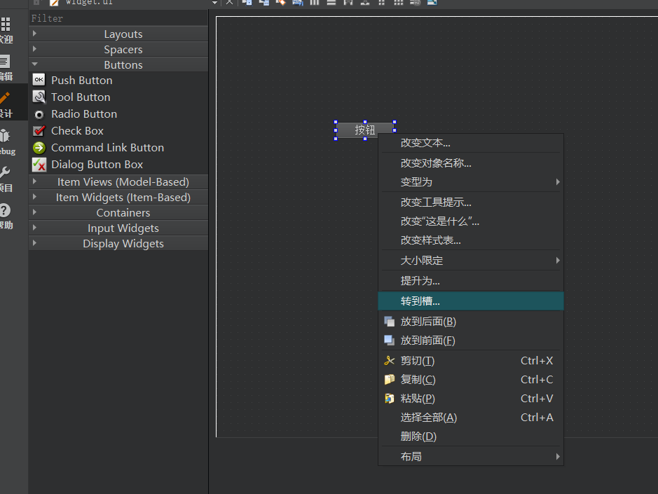
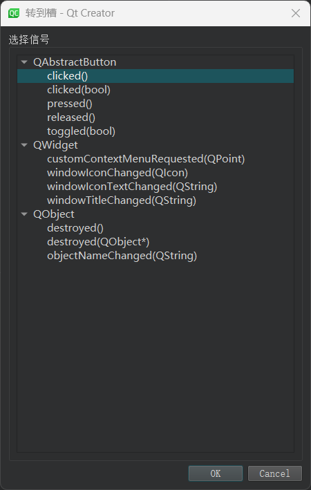
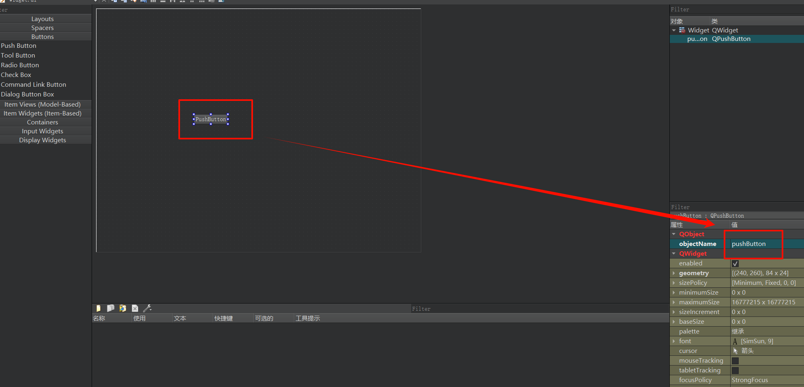
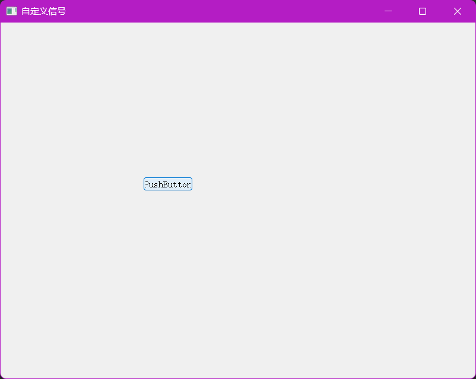
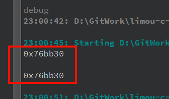

# 1.信号槽

谈到信号，基本脱离不了三个因素：

-   信号的源：是谁发送的信号？
-   信号类型：是哪种类别信号？
-   信号处理：是怎么处理信号？

因此，如果您熟悉操作系统中的进程信号机制，那么理解 `Qt` 的信号也是类似上述的理解，也要谈及三个因素。

-   信号的源：由控件发出信号。
-   信号类型：用户交互时的不同操作触发不同类型的信号。
-   信号处理：`Qt` 把信号处理方法叫做“槽”，可以使用 `connect()` 把信号和槽关联起来，理论上来说应该也算一种回调函数。

这个回调函数在 `C++` 就有很多选择，可以使用函数指针、仿函数、`Lambda` 表达式。

再次强调，`connect()` 和 `TCP` 套接字编程中的系统调用 `connect()` 没有太多关系，不要产生过多的关联。这个方法实际上是 `class QObject{/*...*/};` 的静态成员函数，大部分的控件类父类都是 `class Qwidget{/*...*/};` 而和它并列的其他类一起还有一个更上层的父类 `class QObject{/*...*/};`。

>   吐槽：这个设计和 `Java` 很类似，但是至于是谁先大量采用这种方法，很可能是 `Java`。

# 2.设置信号槽

## 2.1.设置槽

### 2.1.1.默认的槽

```cpp
// connect 声明
connect(
	const QObject* sender, //描述发生信号的控件(发送信号对象)
    const char* signal, //描述信号的类型(信号类型)
    const QObject* receiver, //哪个控件处理信号(处理信号对象)
    const char* method, //这个控件要怎么处理信号(信号处理)
    Qt::ConnectionType type = Qt::AutoConnection // 先不考虑, 按照默认的就行, 也很少使用
);
```

我们创建一个控件项目，然后创建一个子按钮控件，然后绑定窗口关闭的槽函数，并且设置信号的执行控件为按钮的父控件。

```cpp
// 绑定信号和槽函数
#include "widget.h"
#include "ui_widget.h"

#include <QPushButton>

Widget::Widget(QWidget *parent)
    : QWidget(parent)
    , ui(new Ui::Widget)
{
    ui->setupUi(this);

    //创建一个按钮
    QPushButton* button = new QPushButton(this);
    button->setText("按钮");

    connect(button, &QPushButton::clicked, this, &Widget::close);
    //不同控件对应的信号不同, 必须一一对应, 这里的按钮被绑定了关闭窗口的槽函数, 其处理对象是按钮的父控件
}

Widget::~Widget()
{
    delete ui;
}
```

注意，按钮控件的默认信号和默认槽函数都是在自己类内或者继承而来的。当然，您还可以自定义槽函数。

关于默认信号和默认槽函数您可以直接查看文档，观察 `QPushButton{/*...*/};` 的类声明即可。但是这里我们会看到一个奇怪的现象，为什么信号的槽函数的类型是 `void(*)()` 和 `bool(*)()`，但是 `connect()` 对应的参数却都是 `char*`。

原因是上面实际上是旧版本的 `connect()` 函数，传参方式不一样，需要搭配 `SIGNAL()` 和 `SLOT()` 宏分别把信号和槽函数转化为 `char*`，但是在 `Qt5` 中提供了重载版本，第二和第四个参数变成了泛型参数。

在新的实现中使用的是泛型编程，还具备检查 `2、4` 参数是否为 `1、3` 成员的功能，如果不符合就会在编译时报错。

### 2.1.2.自定义槽

实际上就是在控件的父类内新定义一个成员函数，让执行的父控件对应类内有相应的槽函数。

```cpp
//widget.h
#ifndef WIDGET_H
#define WIDGET_H

#include <QWidget>

QT_BEGIN_NAMESPACE
namespace Ui { class Widget; }
QT_END_NAMESPACE

class Widget : public QWidget
{
    Q_OBJECT

public:
    Widget(QWidget *parent = nullptr);
    ~Widget();

    void HandleClicked(); //自定义的槽函数

private:
    Ui::Widget *ui;
};
#endif // WIDGET_H

```

```cpp
//widget.cpp
#include "widget.h"
#include "ui_widget.h"

#include <QPushButton>

Widget::Widget(QWidget *parent)
    : QWidget(parent)
    , ui(new Ui::Widget)
{
    ui->setupUi(this);

    //创建一个按钮
    QPushButton* button = new QPushButton(this);
    button->setText("按钮");

    connect(button, &QPushButton::clicked, this, &Widget::HandleClicked);
    //不同控件对应的信号不同, 必须一一对应, 这里的按钮被绑定了关闭窗口的槽函数, 其处理对象是按钮的父控件
}

Widget::~Widget()
{
    delete ui;
}

void Widget::HandleClicked()
{
    //修改窗口的标题
    this->setWindowTitle("已点击");
}

```

>   注意：如果需要让一个类使用信号槽，就必须使用 `Q_OBJECT` 宏实现说明，展开会得到一系列的代码，但这里不深入研究。另外除非没有信号槽的定义和声明操作，如果缺少 `Q_OBJECT` 就会在编译时报错。

>   补充：而早期的 `Qt` 必须使用一个拓展关键字 `slots` 才能在父控件内新定义一个成员函数，不是 `C++` 标准中的语法，这是 `Qt` 广泛使用元编程扫描拓展关键字来生成相关代码的结果。

除了代码，还可以通过界面拖拽的方式来直接关联信号槽。





我们双击 `clicked()`，就会自动生成槽函数对应的代码。

```cpp
#ifndef WIDGET_H
#define WIDGET_H

#include <QWidget>

QT_BEGIN_NAMESPACE
namespace Ui { class Widget; }
QT_END_NAMESPACE

class Widget : public QWidget
{
    Q_OBJECT

public:
    Widget(QWidget *parent = nullptr);
    ~Widget();

private slots:
    void on_pushButton_clicked();

private:
    Ui::Widget *ui;
};
#endif // WIDGET_H

```

```cpp
#include "widget.h"
#include "ui_widget.h"

#include <QPushButton>

Widget::Widget(QWidget *parent)
    : QWidget(parent)
    , ui(new Ui::Widget)
{
    ui->setupUi(this);
}

Widget::~Widget()
{
    delete ui;
}


void Widget::on_pushButton_clicked()
{
    //修改窗口标题
    this->setWindowTitle("按钮已按下");
}

```

那这份代码在哪里进行的 `connect()`，难道在 `ui_widget.h` 里？里面是没有的，那究竟在哪里呢？实际上在，`Qt` 中除了使用 `connect()` 进行信号槽关联，还可以通过函数名字来自动关联。

这是依靠控件的 `objectName` 属性，结合 `on_<objectName>_clicked()` 来说明，和 `objectName` 对应属性的控件的点击信号和该函数实现的槽进行关联。

>   补充：有一个很简单的验证方法就是保持上述代码中 `on_pushButton_clicked()` 的函数名不变，把按钮的 `objectName=pushButton` 属性修改为 `myPushButton` 试试...是不是按钮的槽函数就无法生效了？并且控制台报错 `QMetaObject::connectSlotsByName: No matching signal for on_pushButton_clicked()`，而这个 `connectSlotsByName()` 其实就在 `ui_widget.h` 中。
>
>   这个时候再把槽函数名字改为 `on_myPushButton` 试试，是不是槽函数又可以生效了？
>
>   如果图形化界面创建的控件就推荐使用这种方法，但是纯代码创建的控件最好不用这种方法。

除了函数指针，也可以使用 `Lambda` 表达式（函数的语法糖罢）。

```cpp
//widget.h
#ifndef WIDGET_H
#define WIDGET_H

#include <QWidget>

QT_BEGIN_NAMESPACE
namespace Ui { class Widget; }
QT_END_NAMESPACE

class Widget : public QWidget
{
    Q_OBJECT

public:
    Widget(QWidget *parent = nullptr);
    ~Widget();

private:
    Ui::Widget *ui;
};
#endif // WIDGET_H

```

```cpp
//widget.cpp
#include "widget.h"
#include "ui_widget.h"

#include <QPushButton>

Widget::Widget(QWidget *parent)
    : QWidget(parent)
    , ui(new Ui::Widget)
{
    ui->setupUi(this);

    QPushButton* button = new QPushButton(this);
    button->setText("按钮");
    connect(button, &QPushButton::clicked, this, [=](){
        this->setWindowTitle("新标题");
    });
}

Widget::~Widget()
{
    delete ui;
}

```

>   补充：`C++` 的 `Lambda` 的行为和实际的函数很相似（获取参数时必须进行捕获），但是其他语言中（例如 `JS`）可能不需要这样。

l另外，上面使用 `Lambda` 表达式的按钮是 `new` 出来的，生命周期跟随整个窗口（挂在对象树上，窗口关闭才会进行释放），因此可以保证绑定的 `Lamdba` 表达式是随时可用的。

因此我们设定信号槽时，必须保证回调内的操作是可用的，尤其需要注意 `Lambda` 表达式捕获到的对象是否可用。

当然 `Qt` 中多使用 `[=]` 而不使用 `[&]` 因为传值的时候大多是传递控件 `new` 返回的指针值，无所谓引用和赋值。

>   注意：`Lambda` 表达式时 `C++11` 语法，如果您使用的 `QT5` 一下的版本，可能就需要手动在 `.pro` 文件中加入 `CONFIG += c++11` 才可使用 `Lambda` 表达式（`Qt5` 的不用担心，会自动加入该选项）。

## 2.2.设置信号

### 2.2.1.默认的信号

这个没什么好讲的，在文档和具体类实现中都可以看到。

### 2.2.2.自定义信号

这种自定义信号很少使用，`Qt` 内置的信号基本能涵盖用户交互时发生的一系列操作，足以应付大多数的场景。当然也可以程序员根据自己需求进行自定义。

`Qt` 的信号实际上也是一个函数，但在高版本的 `Qt5` 中，是一个非常特殊的函数，程序员只要写出函数声明并且告诉 `Qt` 这是一个信号即可，并且函数的定义是在 `Qt` 的编译期间中自动生成的，程序员无法直接干扰（因为信号很特殊需要配合 `Qt` 框架做很多的事情）。

作为信号函数，其返回值也必须是 `void`，有无参数都可以，还支持重载。

```cpp
//widget.h
#ifndef WIDGET_H
#define WIDGET_H

#include <QWidget>

QT_BEGIN_NAMESPACE
namespace Ui { class Widget; }
QT_END_NAMESPACE

class Widget : public QWidget
{
    Q_OBJECT

public:
    Widget(QWidget *parent = nullptr);
    ~Widget();

signals:
    //1.这也是 Qt 自己拓展的关键字, 扫描到这个关键字后就会把后面的函数识别为自定义信号, 并且自动生成对应的定义
    void MySignal();

public:
    //2.槽函数声明
    void MyHandleSignal();

private slots:
    void on_pushButton_clicked();

private:
    Ui::Widget *ui;
};
#endif // WIDGET_H

```

```cpp
//widget.cpp
#include "widget.h"
#include "ui_widget.h"

#include <QPushButton>

Widget::Widget(QWidget *parent)
    : QWidget(parent)
    , ui(new Ui::Widget)
{
    ui->setupUi(this);

    //4.建立信号槽关联, 但是不代表控件已经发送信号
    connect(this, &Widget::MySignal, this, &Widget::MyHandleSignal); //如果在一个类的成员函数中调用 emit 来发射信号，那么这个信号就是在当前对象上发射的
}

Widget::~Widget()
{
    delete ui;
}

//3.槽函数定义
void Widget::MyHandleSignal()
{
    this->setWindowTitle("自定义信号");
}

void Widget::on_pushButton_clicked() //注意这个槽函数是通过界面拖拽直接生成的槽函数
{
    //5.由于是自定义信号, 因此就需要我们自己编写触发代码
    emit MySignal(); //这里就是使用拓展关键字 emit 触发信号（通过按钮的点击间接触发自定义信号）, 这句话也可以写在别的地方进行触发
}

```





>   补充：在 `Qt` 中这个 `emit` 实际上也可以不写了，这样触发信号就相当于是调用函数，但是加上这个拓展关键字可以提高可读性。并且 `Qt` 内置的信号也可以使用这种 `emit` 的方式进行发送。

# 3.带参信号槽

当信号带有参数时，槽也必须带有参数并且必须保持一致。这样发射信号的时候就会把参数传递给槽。我们直接来结合代码试一试：

```cpp
//widget.h
#ifndef WIDGET_H
#define WIDGET_H

#include <QWidget>

QT_BEGIN_NAMESPACE
namespace Ui { class Widget; }
QT_END_NAMESPACE

class Widget : public QWidget
{
    Q_OBJECT

public:
    Widget(QWidget *parent = nullptr);
    ~Widget();

signals:
    //1.这也是 Qt 自己拓展的关键字, 扫描到这个关键字后就会把后面的函数识别为自定义信号, 并且自动生成对应的定义
    void MySignal(const QString& str);

public:
    //2.槽函数声明
    void MyHandleSignal(const QString& str); //带上参数

private slots:
    void on_pushButton_clicked();

private:
    Ui::Widget *ui;
};
#endif // WIDGET_H

```

```cpp
//widget.cpp
#include "widget.h"
#include "ui_widget.h"

#include <QPushButton>

Widget::Widget(QWidget *parent)
    : QWidget(parent)
    , ui(new Ui::Widget)
{
    ui->setupUi(this);

    //4.建立信号槽关联, 但是不代表控件已经发送信号
    connect(this, &Widget::MySignal, this, &Widget::MyHandleSignal); //如果在一个类的成员函数中调用 emit 来发射信号，那么这个信号就是在当前对象上发射的
}

Widget::~Widget()
{
    delete ui;
}

//3.槽函数定义
void Widget::MyHandleSignal(const QString& str) //带上参数
{
    qDebug() << &str << '\n';
    this->setWindowTitle(str);
}

void Widget::on_pushButton_clicked() //注意这个槽函数是通过界面拖拽直接生成的槽函数
{
    //5.由于是自定义信号, 因此就需要我们自己编写触发代码
    const QString& str = "一个自定义信号";
    qDebug() << &str << '\n';
    emit MySignal(str); //这里就是使用拓展关键字 emit 触发信号（通过按钮的点击间接触发自定义信号）, 这句话也可以写在别的地方进行触发
}

```



而传参有什么用处呢？如果有多个逻辑整体一致，但是涉及的数据不同，这一做法有很有用。

```cpp
//widget.h
#ifndef WIDGET_H
#define WIDGET_H

#include <QWidget>

QT_BEGIN_NAMESPACE
namespace Ui { class Widget; }
QT_END_NAMESPACE

class Widget : public QWidget
{
    Q_OBJECT

public:
    Widget(QWidget *parent = nullptr);
    ~Widget();

signals:
    //1.自定义信号声明
    void MySignal(const QString& str);

public:
    //2.自定义槽函数声明
    void MyHandleSignal(const QString& str); //带上参数

public slots:
    void on_pushButton_1_clicked();

    void on_pushButton_2_clicked();

private:
    Ui::Widget *ui;
};
#endif // WIDGET_H

```

```cpp
//widget.cpp
#include "widget.h"
#include "ui_widget.h"

#include <QPushButton>
#include <QString>

Widget::Widget(QWidget *parent)
    : QWidget(parent)
    , ui(new Ui::Widget)
{
    ui->setupUi(this);

    //建立信号槽关联, 但是不代表控件已经发送信号
    connect(this, &Widget::MySignal, this, &Widget::MyHandleSignal); //如果在一个类的成员函数中调用 emit 来发射信号，那么这个信号就是在当前对象上发射的
}

Widget::~Widget()
{
    delete ui;
}

//3.自定义槽函数定义
void Widget::MyHandleSignal(const QString& str) //带上参数
{
    this->setWindowTitle(str);
}

//4.由于是自定义信号, 因此就需要我们自己编写触发代码
void Widget::on_pushButton_1_clicked() //注意这个槽函数是通过界面拖拽直接生成的槽函数
{
    //触发信号
    emit MySignal("标题1");
}

void Widget::on_pushButton_2_clicked() //注意这个槽函数是通过界面拖拽直接生成的槽函数
{
    //触发信号
    emit MySignal("标题2");
}

```

另外，很多内置的信号也是有默认的参数的，但是不需要我们自己来传递。

>   补充：信号和槽的参数可以不对等，至少保证槽的每个参数都有值。
>
>   -   信号的参数个数可以超过槽的参数个数
>   -   槽的参数个数不可超过信号的参数个数
>
>   这样可以让信号灵活绑定到更多的槽函数，信号触发时参数可以有多余，但是不能缺少（宁滥勿缺）。

最后我稍微总结一下，要想使用 `Qt` 的信号槽，必须：

-   需要使用信号槽类，添加 `Q_OBJECT` 宏
-   使用关键字 `signals` 自定义信号
-   使用关键字 `public slots` 自定义槽
-   如果是界面使用函数名自动关联，如果是代码使用 `connect()` 接口进行关联
-   触发信号使用 `emit`，其发送信号的对象就是 `emit` 所处的 `this` 指针指向的对象

# 4.断接信号槽

可以使用 `disconnect()` 取消信号槽的关联，其使用方式和 `connect()` 十分类似，不过这种操作很少见。

```cpp
//widget.h
#ifndef WIDGET_H
#define WIDGET_H

#include <QWidget>

QT_BEGIN_NAMESPACE
namespace Ui { class Widget; }
QT_END_NAMESPACE

class Widget : public QWidget
{
    Q_OBJECT

public:
    Widget(QWidget *parent = nullptr);
    ~Widget();

public slots:
    //自定义槽函数声明
    void MySlot1();
    void MySlot2();

private:
    Ui::Widget *ui;
};
#endif // WIDGET_H

```

```cpp
//widget.cpp
#include "widget.h"
#include "ui_widget.h"

#include <QPushButton>

Widget::Widget(QWidget *parent)
    : QWidget(parent)
    , ui(new Ui::Widget)
{
    ui->setupUi(this);
    connect(ui->pushButton, &QPushButton::clicked, this, &Widget::MySlot1);
    connect(ui->pushButtonDis, &QPushButton::clicked, this, &Widget::MySlot2);

}

Widget::~Widget()
{
    delete ui;
}

void Widget::MySlot1()
{
    if (this->windowTitle() == "新标题")
    {
        this->setWindowTitle("标题");
    }
    else
    {
        this->setWindowTitle("新标题");
    }
}

void Widget::MySlot2()
{
    disconnect(ui->pushButton, &QPushButton::clicked, this, &Widget::MySlot1);
}

```

# 5.信号槽的意义

实际上很多现有的 `GUI` 开发框架，使用的用户响应方案虽然也是挂载回调函数，但代码编写会更加方便一些（尤其是使用 `JS` 处理网页的一些交互操作时）。

那为什么 `Qt` 会有信号槽机制呢？这里猜测几点：

-   解耦合，把用户触发的控件和处理信号的操作解耦合，可以分开设计
-   多对多，一个信号可以 `connect()` 到多个槽上，一个槽可以被多个信号 `connect()`

```cpp
//widget.h
#ifndef WIDGET_H
#define WIDGET_H

#include <QWidget>

QT_BEGIN_NAMESPACE
namespace Ui { class Widget; }
QT_END_NAMESPACE

class Widget : public QWidget
{
    Q_OBJECT

public:
    Widget(QWidget *parent = nullptr);
    ~Widget();

signals:
    //1.自定义信号声明
    void MySignal1();
    void MySignal2();
    void MySignal3();

public slots:
    //2.自定义槽函数声明
    void MySlot1();
    void MySlot2();
    void MySlot3();

private:
    Ui::Widget *ui;
};
#endif // WIDGET_H

```

```cpp
//widget.cpp
#include "widget.h"
#include "ui_widget.h"

#include <QPushButton>
#include <QDebug>

Widget::Widget(QWidget *parent)
    : QWidget(parent)
    , ui(new Ui::Widget)
{
    ui->setupUi(this);
    connect(this, &Widget::MySignal1, this, &Widget::MySlot1); //this 对象发出 MySignal1 信号对应 MySlot1 槽
    connect(this, &Widget::MySignal2, this, &Widget::MySlot1); //this 对象发出 MySignal2 信号对应 MySlot1 槽
    connect(this, &Widget::MySignal3, this, &Widget::MySlot2); //this 对象发出 MySignal3 信号对应 MySlot2 槽

    emit MySignal1();
    emit MySignal2();
    emit MySignal3();
}

Widget::~Widget()
{
    delete ui;
}

void Widget::MySlot1()
{
    qDebug() << "MySlot1()\n";
}

void Widget::MySlot2()
{
    qDebug() << "MySlot2()\n";
}

void Widget::MySlot3()
{
    qDebug() << "MySlot3()\n";
}

```

但是实际编码中，信号和槽一对一就足够使用的，多对多的需求很可能是伪需求...

>   注意：因此对一个信号重复进行槽关联，就会导致一个信号触发多个槽，而并非是覆盖或替换，只能使用 `disconnect()` 进行取消，这点需要您注意。
