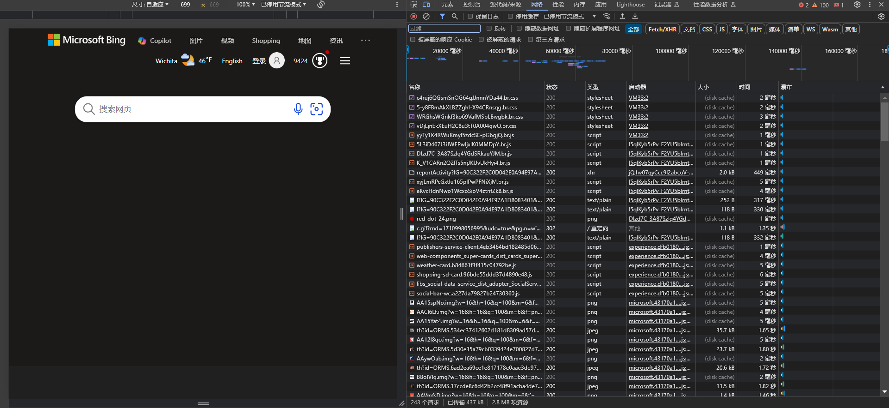

>   前腰：本文只是概括重要的 `CSS` 的较为重要的内容，详细的您可以跳转 [Mmdn](https://developer.mozilla.org/zh-CN/docs/Glossary/HTML) 进行深入的学习。

# 1.CSS 概念

`HTML` 最重要的作用，就是让普通的文本具有“语义”（也就是“超文本标记”），可以根据不同的语义显示出不同的效果。但是其对于的用户体验不算好，需要进行一点的修饰

# 2.CSS 环境

待补充...

# 3.CSS 使用

## 3.1.引入样式表

### 3.1.1.行内样式表

行内样式表是通过标签的 `style` 属性来实现的，这种方式比较直观，但是封装程度不够，很难分离和后期更改。

### 3.1.2.内部样式表

可以使用 `<style>` 来写多条声明语句在 `<head>` 标签中，来做到内部引入，优点是不会丢失，实现了一定程度的分离。缺点是分离的不够彻底，声明语句过多时会很复杂。

### 3.1.3.外部样式表

`CSS` 的语法主要是 `选择器 + n条声明` 构成，然后在 `<head>` 中使用 `<link rel="stylesheet" href="css_file_path">`。

## 3.2.标签选择器

`CSS` 选择器是用来选择 `HTML` 元素的一种语法，可以通过标签名、类名、`ID`、属性等方式来选择元素。以下是一些常用的 `CSS` 选择器：

1. **标签选择器**：通过 HTML 元素的标签名来选择元素。例如：

   ```css
   /* 标签选择器 */
   p {
       color: blue;
   }
   ```

2. **类选择器**：通过元素的类名来选择元素。类选择器以 `.` 开头，后面跟类名。例如：

   ```css
   /* 类选择器 */
   .highlight {
       background-color: yellow;
   }
   ```

3. **ID 选择器**：通过元素的 `ID` 来选择元素。`ID` 选择器以 `#` 开头，后面跟 `ID` 名。例如：

   ```css
   /* ID 选择器 */
   #header {
       font-size: 24px;
   }
   ```

4. **属性选择器**：通过元素的属性值来选择元素。例如：

   ```css
   /* 属性选择器 */
   input[type="text"] {
       border: 1px solid black;
   }
   ```

5. **后代选择器**：选择某个元素的后代元素。例如：

   ```css
   /* 后代选择器 */
   div p {
       font-style: italic;
   }
   ```

6. **相邻兄弟选择器**：选择紧接在另一个元素后的元素。例如：

   ```css
   /* 相邻兄弟选择器 */
   h2 + p {
       color: red;
   }
   ```

7. **通用选择器**：选择所有元素。例如：

   ```css
   /* 通用选择器 */
   * {
       margin: 0;
       padding: 0;
   }
   ```

   这个会对所有标签起作用，实际应用中针对页面中所有元素默认样式进行消除，主要消除边距。

8. **伪类选择器**：表示一种特殊的状态。伪类选择器在 CSS 中的作用是允许你根据元素的特定状态或者位置选择元素，并对其应用样式。这些状态可能是用户的交互行为（如鼠标悬停）、元素的位置关系（如第一个子元素）、或者是元素的某些特征（如是否被选中）。伪类选择器可以增强用户体验、提供更精确的样式控制，并且允许你根据不同的场景为元素应用样式。例如：

   ```css
   /* 伪类选择器 */
   a:hover {
       color: red;
   }
   ```

这些只是 `CSS` 选择器中的一部分，还有更多复杂的选择器和组合方式可以用来选择 `HTML` 元素，不过我们这里先用几个常用的，其他等学习了 `JS` 后再来理解。

>   补充：上述引入 `CSS` 的例子中，优先级为 `行内样式表>内部样式表>外部样式表`。

另外，为了文档的完整性，本文使用内部样式表，实际开发中外部样式表会比较多。

```html
<!-- 演示选择器 -->
<!DOCTYPE html>
<html lang="en">
<head>
    <meta charset="UTF-8">
    <meta name="viewport" content="width=device-width, initial-scale=1.0">
    <title>Document</title>

    <style>
        /* 普通选择器 */
        h {
            color: red;
        }

        .class_1 {
            color: chocolate;
        }
        .class_2 {
            color: burlywood;
        }

        h1.class_1 {
            color: blue;
        }

        #my_id_1{
            color: blueviolet;
        }
        h2.class_1#my_id_1 {
            color: chartreuse;
        }

        /* 后代选择器 */
        ol li {
            color: aquamarine;
        }

        /* 通用选择器 */
        * {
            font-size:20px;
        }

        /* 伪类选择器 */
        a {
            color: black;
        }
        a:hover {
            color: brown;
        }
        a:active {
            color: chartreuse;
        }
    </style>
</head>
    <h1>test_1</h1> <!--标签选择器-->

    <p class="class_1">test_2</p> <!--类选择器-->
    <p class="class_2">test_3</p> <!--类选择器-->
    <p class="class_1 class_2">test_3</p> <!--叠加类选择器-->
    <h1 class="class_1 class_2">test_4</h1> <!--标签选择器 + 类选择器-->

    <p id="my_id_1">test_5</p> <!--id 选择器-->
    <h2 class="class_1" id="my_id_1">test_6</h2> <!--标签选择器 + 类选择器 + id 选择器-->

    <ul>
        <li>test_7</li>
        <li>test_7</li>
        <li>test_7</li>
    </ul>
    <ol>
        <li>test_8</li>
        <li>test_8</li>
        <li>test_8</li>
    </ol>
    
    <a href="#">test_9</a>
</body>
</html>
```

可以看到选择器之间可以进行叠加、组合。

## 3.3.CSS 属性

引入方式和选择器我们都有了，还差一个重要的点，就是 `CSS` 可以设置哪些属性？

这方面有很多的资料可以查阅，这里只提及几个常用的：

-   文本声明：

    (1)文本风格：`font-family: '某种字体'`

    (2)文本大小：`font-size: 大小px`，`px` 就是像素点

    (3)文本颜色：`color: 颜色标识符 / #色号 / rgb(num_1, num_2, num_3)`

    (4)文本粗细：`font-weight: 粗细标识符 / 粗细大小`

    (5)文本风格：`font-style: normal / italic / oblique`，设置倾斜和取消倾斜，若设置了 `inhert` 则可以从父元素继承字体样式

    (6)文本对齐：`text-align: center / left / right`

    (7)文本缩进：`text-indent: px / em`，但是一般使用 `em`，一个 `em` 代表一个相对于父元素的文字大小

    (8)文本装饰：`text-decoration: underline / none / overline / line-through`，分别对应下划线、无、上划线、删除线

    (9)文本行高：`line-height: 高度px`，行高指的是上下文本行之间的基准线（顶线、中线、基线、底线），其中顶线和底线包裹区域被称为内容区

-   背景声明：

    (1)`background-color: 颜色标识符 / #色号 / rgb(num_1, num_2, num_3) `

    (2)`background-image: url('颜色路径')`，可以给一个标签元素加上图片背景（引号可以不加，但是建议加上），比 `<image>` 跟方便控制位置，不过需要注意是可能需要设置照片的大小（也就是设置 `width`、`height`）

    (3)`background-repeat: repeat(平铺) / no-repeat(不平铺) / repeat-x(水平平铺) / repeat-y(垂直平铺)`，默认为平铺，其效果就是使背景图片平铺
    
    (4)`background-position: 坐标px 坐标px / top / left / right / bottom`，也可以选择将方位词和精确单位混合使用（需要注意的是，如果是给 `<div>` 声明就是根据容器来抉择方位），原点是容器的左上角，即 `(0, 0)` 点
    
    (5)`background-size: 宽度px 宽度px / length / percentage / cover / contain`，可以设置背景尺寸
    
-   块声明：

    (1)`width: 宽度px`、`height: 高度px`、`border: 粗度px 颜色`

    (2)`border-redius: length(是内切圆的半径)`，可以使边框带有圆角，圆角是通过椭圆和矩形叠加来实现的，也可以拿来实现圆形（只要满足 `width==height==2*border-redius`，或者直接使用 `border-redius=50%` 也可以，可以用来生成头像框），如果 `border-redius` 是高度的一半，就可以实现左右为半圆形，中间为矩形的组合图形。而实际上，该声明只是一种符合写法，还可以对四个角分别设置。

    `border-radius: 半径px/em 半径px/em 半径px/em 半径px/em;`，左上点开始逆时针填写半径

    `border-top-left-radius: 半径px/em;`
    `border-top-right-radius: 半径px/em;`
    `border-bottom-right-radius: 半径px/em;`
    `border-bottom-left-radius: 半径px/em;`

## 3.4.元素显示模式

`HTML` 元素的显示模式很多，但是这里只介绍两个：块级元素、行内元素（通常把行内元素转化为块级元素，只要使用选择器选择一个元素然后使用 `display: block` 声明即可）

-   **块级元素（Block-level elements）**：
    *   块级元素通常在页面中以独立的块的形式展示，会占据一整行或一定的宽度空间。
    *   块级元素会从新的一行开始，其后的元素也会被强制换行。
    *   常见的块级元素包括 `<div>`、`<p>`、`<h1>`~`<h6>`、`<ul>`、`<ol>`、`<li>` 等。
-   **行内元素（Inline elements）**：
    *   行内元素通常在页面中以行内的方式显示，不会独占一行，而是在同一行内水平排列。
    *   行内元素只占据它所包含内容的宽度，不会强制换行。
    *   常见的行内元素包括 `<span>`、`<a>`、`<strong>`、`<em>`、``、`<input>` 等。

对于创建块级元素，有两种主要的方案：

1.  **使用 `display: block;`：** 您可以将行内元素或者其他元素通过 `CSS` 属性 `display: block;` 设置为块级元素。这种方式适用于您需要在页面中将某个元素从行内或其他显示方式转变为块级元素的情况，例如将 `<span>` 元素设置为块级元素。

    ```
    cssCopy codespan { display: block; }
    ```

2.  **直接使用 `<div>` 元素：** 它默认就是块级元素，无需额外设置。 这种方式适用于您需要在页面中直接添加新的块级元素的情况，例如用于布局的容器、分割页面区域等。

    ```
    htmlCopy code<div> <!-- 内容 --> </div>
    ```

两种方案都可以实现将元素显示为块级的效果，选择哪种方式取决于具体的需求和设计习惯。如果您需要的是一个新的块级元素，通常直接使用 `<div>` 更为简洁明了；而如果您需要将现有的元素转变为块级元素，可以通过 `CSS` 的 `display: block;` 实现。

## 3.5.元素盒子

每一个 `HTML` 都相当于一个矩形的盒子：

1.  **内容区域（Content）：**显示元素内部的内容，例如文本、图片等。
    
    内容区域的大小由元素的宽度（`width`）和高度（`height`）决定。
2.  **内边距区域（Padding）：**内边距是内容区域与边框之间的空白区域，控制元素内部内容与边框的间距。
    
    可以使用 `CSS` 属性设置内边距，如 `padding-top`、`padding-right`、`padding-bottom`、`padding-left`，也可以使用简写形式 `padding` 同时设置四个方向的内边距。
3.  **边框区域（Border）：**边框位于内边距的外部，围绕着元素内容和内边距，可为元素创建边框效果。
    
    可以使用 `CSS` 属性设置边框样式、颜色和宽度，如 `border-top`、`border-right`、`border-bottom`、`border-left`，也可以使用简写形式 `border` 同时设置四个边框。
4.  **外边距区域（Margin）：**外边距是边框与周围元素之间的空白区域，用于控制元素与其他元素之间的距离。
    
    可以使用 `CSS` 属性设置外边距，如 `margin-top`、`margin-right`、`margin-bottom`、`margin-left`，也可以使用简写形式 `margin` 同时设置四个方向的外边距。另外，如果将 `Margin` 设置为 `auto` 就会自动居中（但是是对于整个盒子的）

对一个元素设置了高度和宽度之后，如果还设置了盒子的大小（内边距、边框和外边距），那么整个元素的最终大小将受到这些属性的影响。

如果不希望受到影响，就可以使用 `box-sizing: border-box;`，对于 `CSS` 中的 `box-sizing` 属性，它决定了元素的盒子模型的计算方式。默认情况下（`box-sizing: content-box;`），`width` 和 `height` 属性只应用于元素的内容框（`Content Box`），而不包括内边距（`Padding`）、边框（`Border`）和外边距（`Margin`）。这意味着元素的实际宽度和高度会受到内边距、边框和外边距的影响，会超出设置的 `width` 和 `height` 值。

而当将 `box-sizing` 属性设置为 `border-box` 时（`box-sizing: border-box;`），`width` 和 `height` 属性将包括内边距、边框和外边距，即整个盒子的合计宽度和高度就是设置的 `width` 和 `height` 值，不会再增加额外的空间。

## 3.6.弹性布局

当给父元素使用弹性布局（`Flexbox`）时，您可以实现许多不同的布局效果和设计方案。弹性布局可以使布局适应多种设备场景，让页面可移植性提高。

### 3.6.1.弹性布局概念

-   ==flex container==：被设置为 `display: flex` 属性的元素，被称为 `flex container`

-   ==flex item==：其子元素立刻称为该容器的成员，被称为 `flex item`

-   ==flex direction==：`flex item` 可以纵向布局，也可以横向布局，这个布局方向就被称为 `flex direction`，也被称为主轴。主轴的方向可以通过设置 `flex-direction` 属性来改变，包括以下几种可能：

    (1)`row`：主轴是水平方向，弹性项从左到右排列。

    (2)`row-reverse`：主轴是水平方向，弹性项从右到左排列。

    (3)`column`：主轴是垂直方向，弹性项从上到下排列。

    (4)`column-reverse`：主轴是垂直方向，弹性项从下到上排列。

-   ==cross axis==：交叉轴是与主轴垂直的轴线，用于控制弹性项在交叉轴上的对齐方式。默认情况下，交叉轴是垂直方向的。交叉轴的方向取决于主轴的方向。当主轴是水平方向时，交叉轴是垂直方向。当主轴是垂直方向时，交叉轴是水平方向。

### 3.6.2.弹性布局方式

1. **水平居中对齐**：将弹性容器的 `justify-content` 属性设置为 `center`，可以使容器内的弹性项在水平方向上居中对齐。

```css
/* 水平居中对齐 */
.flex-container { /* 选择父元素 */
  display: flex;
  justify-content: center; /* 也有其他的取值 */
}
```

2. **垂直居中对齐**：将弹性容器的 `align-items` 属性设置为 `center`，可以使容器内的弹性项在垂直方向上居中对齐。

```css
/* 垂直居中对齐 */
.flex-container { /* 选择父元素 */
  display: flex;
  align-items: center;
}
```

3. **等分布局**：将弹性项的 `flex` 属性设置为相同的值，可以实现将容器内的弹性项等分排列的效果（或者说等分父元素的剩余空间）。

```css
/* 等分布局 */
.flex-item { /* 选择子元素 */
  flex: 1; /* 还可以设定其他值，可以查询以下 */
}
```

4. **响应式布局**：通过媒体查询结合弹性布局，可以实现不同屏幕尺寸下的不同布局效果，使网页在移动设备和桌面设备上都能呈现良好的视觉效果。

```css
/* 响应式布局 */
@media screen and (min-width: 768px) and (max-width: 1023px) {
  /* 在屏幕宽度在 768px 到 1023px 范围内时应用的样式 */
    .flex-container { /* 选择父元素 */
    flex-direction: column;
  }
}
```

```css
@media screen and (orientation: landscape) {
  /* 设备处于横向时应用的样式 */
}

@media screen and (orientation: portrait) {
  /* 设备处于纵向时应用的样式 */
}
```

```css
@media screen and (min-resolution: 300dpi) {
  /* 屏幕分辨率大于等于 300dpi 时应用的样式 */
}
```

5. **定位布局**：使用弹性布局的弹性项可以轻松实现复杂的定位布局，例如侧边栏布局、网格布局等。

```html
<div class="flex-container">
  <div class="sidebar">侧边栏</div>
  <div class="content">主内容</div>
</div>
```

```css
.flex-container {
  display: flex;
}

.sidebar {
  flex: 0 0 25%; /* 占据容器宽度的 25% */
}

.content {
  flex: 1; /* 占据剩余空间 */
}
```

这些示例只是弹性布局的一部分应用场景，实际上，你可以通过组合不同的属性和值来实现更加复杂和多样化的布局效果，满足各种设计需求。

# 4.CSS 插件

这里推荐一些 `VSCode` 的插件，可以帮助您提高效率，待补充...

# 5.CSS 调试


