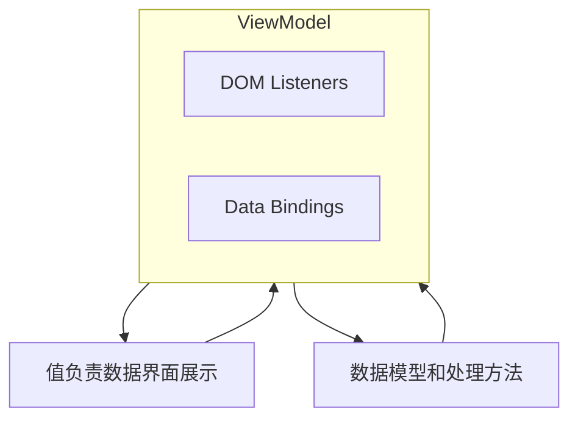

Vue 是前端框架，主要简化对 `DOM API` 繁琐操作，本身基于 `Model-View-ViewModel` 思想进行实现，实现数据的双向绑定。

```mermaid
graph 

subgraph "ViewModel"
dow_listeners["DOM Listeners"]
data_bindings["Data Bindings"]
end

Model["数据模型和处理方法"] --> ViewModel --> View
View["值负责数据界面展示"] --> ViewModel --> Model
```

