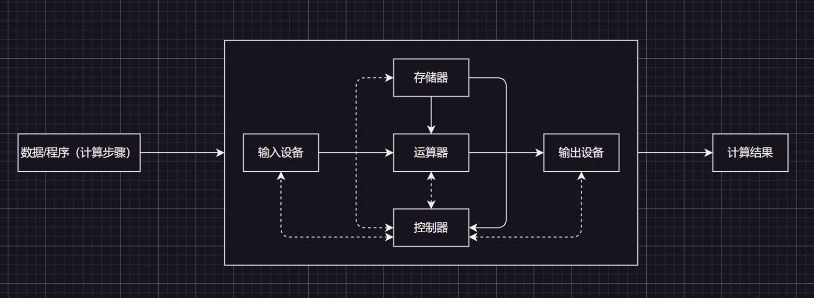
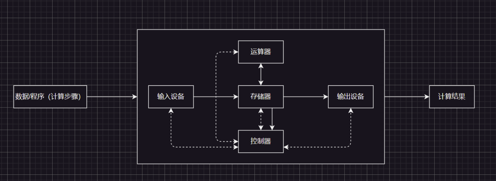
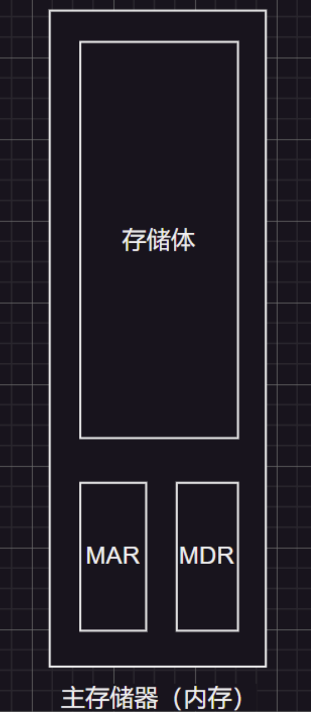
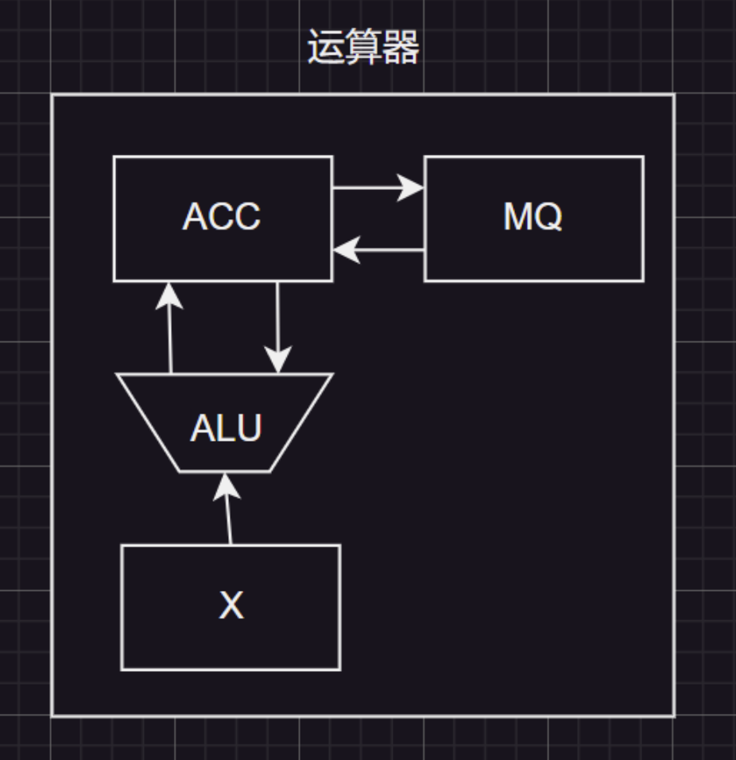
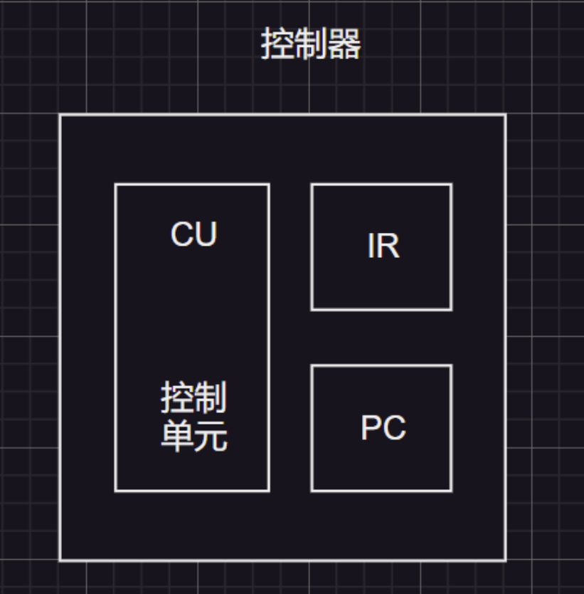
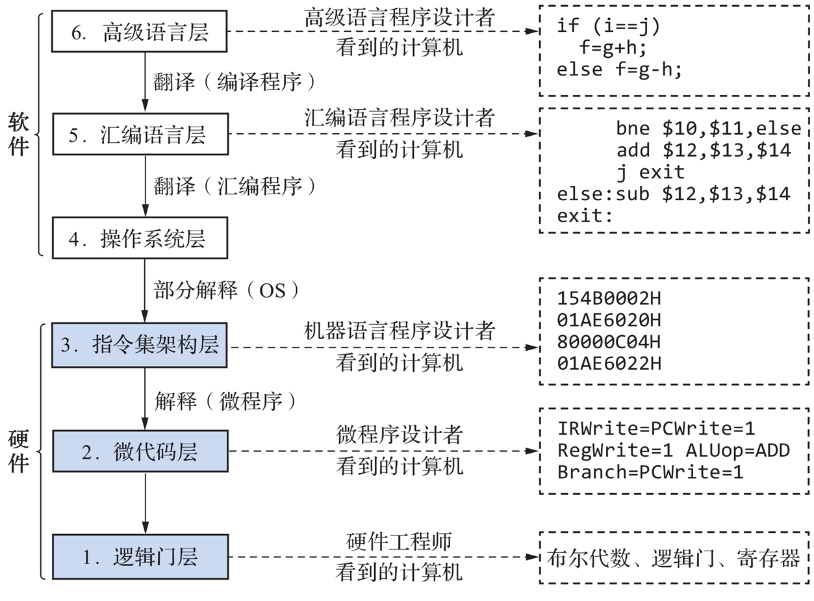

1.计算机早晚期结构
============

## 1.1.早期冯·诺依曼体系结构

冯·诺依曼提出“存储程序”的概念，是指将指令以二进制代码的形式事先输入计算机的主存储器（内存），然后按照其在存储器中的首地址执行程序的第一条指令，以后就按该程序的规定顺序执行其他指令，直至程序执行结束。

于是第一台采用冯·诺依曼结构的计算机 `EDVAC` 诞生了（这是世界上第一台计算机 `ENIAC`，使用手动接线来控制计算，用起来相当麻烦），接下来让我们看看具体的冯·诺依曼计算机结构图（实线为数据线、虚线为控制线或反馈线）：



输入设备将信息转化为机器能识别的形式，然后通过运算器的中转存入存储器，需要用到数据和程序时，就要经过运算器中转到输出设备，得出计算结果，而整个过程都是由控制器使用电信号来进行指挥的，另外这个控制器也会负责解析存储器里的存储指令。

另外，对于计算机系统来说，软件和硬件在逻辑上是等效的，例如：可以专门制作出一个乘法硬件（硬件），也可以利用现有的加法硬件实现乘法（软件）

冯·诺依曼计算机的特点：

1. 计算机由五大部件组成

    (1)运算器：完成算术运算，逻辑运算
    (2)控制器：控制指令的执行，根据指令功能给出实现指令功能所需的控制信号
    (3)主存储器：存放程序及数据
    (4)输入设备、输出设备
    (5)总线：地址总线、数据总线、控制总线

2. 指令和数据化以同等地位存储在存储器里，可按地址寻址

3. 指令和数据使用二进制表示。其中指令组成：操作码（指明指令的操作）、地址码（指明操作数据的内存地址）有的计算机指令采用多个地址码

4. 整个体系以运算器为中心，以运算器为中转站，这样会导致数据计算效率降低（比如：输入设备本来是可以直接交给存储器的，但是却交给了运算器）

## 2.现代冯·诺依曼体系结构



现代计算机有几个很不一样的特点

1. 以存储器为中心

2. 通常控制器和运算器被集成为一个 `CPU`

因此我们可以改写一下结构，让这个体系变得更加模块化：

# 2.计算机硬件内部结构（现代）

## 2.1.主存储



主存储器里用于存放数据的东西叫存储体

1. 存储体内部可以分为一个一个“存储单光”，并且根据地址总线进行编址

2. 每一个存储单元存储的二进制数据组合我们称为“存储字（`word`）”

3. 存储单元存放二进制的最大长度称为“字长”，一般是 `8` 的整数倍。

4. 用于存储二进制的电子元件简称“存储元”，利用电容的原理，每个存储元可存 `1bit`，而存储单元由若干个存储元构成

主存储器内部还有两个寄存器

1. 分别是 `MAR`（存储地址寄存器）、`MDR`（存储数据寄存器）

2. 主存储器里的控制逻辑会根据 `MAR` 存储的地址查找主存储器里的数据，然后取出存放到 `MDR` 中，而 `CPU` 就可以从这里拿走数据。

3. 同理，`CPU` 写入主存储器的方式也和读取类似：`CPU` 想要写入的对应地址放在 `MAR` 里，想要写入的数据放在 `MDR` 里，最后通过控制总线告诉主存储器本次为写操作。

`MAR` 是里有指向存储单元的地址，因此 `MAR` 反映存储单元的个数

`MDR` 是有由要存储到 `MAR` 指向地址的数据内容，反映存储单元的存储字长

## 2.2.运算器

运算器是用于实现算术运算和逻辑运算的，内部有：

1. `ACC` 累加器：实际是一个寄存器，用于存放操作数或运算结果

2. `MQ` 乘商寄存器：在乘、除运算的时候，用于存放操作数或运算结果

3. `X` 通用寄存器：通用的操作数寄存器，用于存放操作数

4. `ALU` 算术逻辑单元：通过内部复杂的电路实现算术运算、逻辑运算，是运算器的核心部件，制作成本也是最高的。

|       | 加     | 减     | 乘       | 除      |
| ----- | ----- | ----- | ------- | ------ |
| `ACC` | 被加数、和 | 被减数、差 | 乘积高位    | 被除数、余数 |
| `MQ`  |       |       | 乘数、乘积低位 |        |
| `X`   | 加数    | 减数    | 被乘数     | 除数     |



> 乘积的高位表示了乘法结果的较高位数部分，而乘积的低位表示了较低位数部分。

## 2.3.控制器

控制器内部有：

1. `CU` 控制单元（Control Unit）：分析指令，给出控制信号，内部有很复杂的电路，是控制器内最核心的部件

2. `IR` 指令寄存器（Instruction Register）：本质是一个寄存器，存放当前执行的指令

3. `PC` 程序计数器（Program Counter）：本质是一个寄存器，存放下一条指令地址，有自动 `+1` 的功能



在控制器内部的工作逻辑是：`PC` 取得指令-> `IR` 分析指令-> `CU` 执行指令，前面两个过程为“取指阶段”，后面一个过程为“执行阶段”

# 3.计算机硬件协调流程（现代）

下面是高级语言 C 语言的一段代码：

```cpp
int a = 2, b = 3, c = 1, y = 0;
int main() 
{
    y = a * b + c;
    return 0;
}
```

接下来让我们看看这段代码在计算机硬件中运作流程：


首先高级语言 C 语言经过编译和链接生成二进制指令，通过 `CPU` 操控 `MAR` 和 `MDR`，将这些二进制指令存储到主存的存储体中（存储的二进制指令假设为上图表格内容），接下来如果运行这个代码，就会发生：

## 3.1.执行指令 0

1. `(PC)=0,(PC)++`：`CPU` 内部的 `PC` 存储的是下一条指令的地址，因此 `PC=0`，即：`PC` 存储了第一条指令的代码地址，在执行后续的步骤后 `PC` 自动+1（`PC` 是程序计时器，可以存放下一条指令地址，有自动 `+1` 的功能）

2. `(PC)->MAR,(MAR)=0,(MAR)->存储体->MDR,(MDR)=0000 01|00 0000 0101`：`PC` 将指令地址交给 `MAR`，`MAR` 通过这个指令地址在存储体内部查找指令数据，存储到 `MDR` 中

3. `(MDR)->IR`：从 `MDR` 得到的指令数据存放到 `IR` 中（`IR` 负责存放当前执行的指令）

4. `(IR)->CU,(IR)->MAR,(MAR)->存储体->MDR,(MDR)=0000 0000 0000 0010=2`：而在当前要执行的指令中，前六位 `0000 01` 操作码会被送到 `CU` 分析，得知这是“取数 `d` 到 `ACC`”的命令，后 `10` 位代表这个数的地址在主存储器存储体的 `5` 处。因此 `IR` 把后续的 10 位交给 `MAR`，`MAR` 再去存储体内找主存地址 `5` 处的 `a` 的数据 `0000 0000 0000 0010=2` 存入 `MDR` 中（`CU` 控制单元负责分析指令，给出控制信号）

5. `(MDR)->ACC`：因此 `0000 0000 0000 0010=2` 被拷贝到 `IR` 内部，然后 `CU` 控制 `MDR` 送到 `ACC` 里

## 3.2.执行指令 1

根据 [3.1.执行指令 0](##3.1.执行指令0) 中的步骤 1，`OP(PC)=1`，`(ACC)=2`，然后就会发生：

1. `(PC)=1,(PC)->MAR,(MAR)=1,(MAR)->存储体->MDR,(MDR)=0000 01|00 0000 0101,(PC)++`：`PC` 内部存储了当前要第二条指令的地址，在执行了后续的步骤了 `+1`，然后 `MAR` 得到的指令地址是“1”，传递给 `MAR` 后，`MAR` 在存储体中找到指令 `0000 01|00 0000 0101`

2. `(MDR)->IR,(IR)->CU,(IR)->MAR,(MAR)->存储体->MDR,(MDR)=0000 0000 0000 0011=3`：接下来 `MDR` 将内部的指令传给 `IR`，`IR` 交给 `CU` 分析后得知前六位 `0001 00` 为“乘法操作，将 `ab` 并且存储到 `ACC` 中” ，后 10 位 `00 0000 0101` 为操作数地址，于是这个地址就被 `IP` 传给 `MAR` 在存储体中找到并且存储给 `MDR`

3. `(MDR)->MQ,(MQ)=0000 0000 0000 0011=3`：接下来 `CU` 控制 `MDR` 内部的数据拷贝到 `MQ`（`MQ` 乘商寄存器：在乘、除运算的时候，用于存放操作数或运算结果，这里是存储了乘数 `b`）

4. `(ACC)->X,(X)=0000 0000 0000 0010=2,ALU->(X)*(MQ)->ACC,(ACC)=6`：`CU` 控制 `ACC` 里的值拷贝到通用寄存器 `X` 里，然后控制 `ALU` 把通用寄存器 `X` 里的值和乘商寄存器 `MQ` 里的值相乘，然后存储到 `ACC` 中（如果乘积太大，`MQ` 也会辅助存储，存储的是乘积低位，`ACC` 那边则是乘积高位）

## 3.3.执行指令 2

根据 [3.2.执行指令 1](##3.2.执行指令1) 中的步骤 `1`，`OP(PC)=2`, `(ACC)=6`，然后就会发生：

1. `(PC)->MAR,(MAR)=2,(MAR)->存储体->MDR,(MDR)=0000 11|0000 0000 0000 0111,(PC)++`：`PC` 将指令地址拷贝给 `MAR`，`MAR` 在存储体内查找到指令，拷贝给 `MDR`，然后 `PC` 内部的计时器 `+1`，存储了指向下一条指令的地址

2. `(MDR)->IR,(IR)->CU,(IR)->MAR,(MAR)=0000 0000 0000 0111=7,(MAR)->存储体->MDR,MDR=0000 0000 0000 0001=1`：MDR 内部的指令值拷贝给 `IR`，`IR` 传递给 `CU` 分析指令，得知 `0000 11` 为“加法指令 `ab+c`，并且最终存储在 `ACC` 中”，于是 `CU` 控制 `IR` 剩下的 `0000 0000 0000 0111`，传递给 `MAR`，`MAR` 在存储体内找到指令数据 `0000 0000 0000 0001`，传递给 `MDR`

3. `(MDR)->X,(x)=0000 0000 0000 0001=1,ALU->(ACC)+(X)->ACC`：然后 `MDR` 将内部数据拷贝到通用寄存器 `X` 内，接下来控制单元 `CU` 向 `ALU` 发生信号，让 `X` 和 `ACC` 里的值相加，最后存储到 `ACC` 内部

## 3.4.执行指令 3

根据 [3.3.执行指令 2](##3.3.执行指令2) 中的步骤 `1`，`OP(PC)=3`，`(ACC)=7`，然后就会发生：

1. `(PC)->MAR,(MAR)=3,(MAR)->存储体->MDR,(MDR)=0000 10|0000 0000 0000 1000,(PC)++`

2. `(MDR)->IR,(IR)->CU,(IR)->MAR,(MAR)=0000 0000 0000 1000=8,(MAR)->存储体->MDR,MDR=0000 0000 0000 0000=0`

3. `(ACC)=7,(ACC)->MDR,(MDR)=7,(MAR)=0000 0000 0000 1000=8`：这里就有个地方需要注意，`CU` 控制了 `ACC` 寄存器的值拷贝到 MDR，此时 MAR 也有 y 变量的主存地址，此时 `CU` 再控制 `MAR` 和 `MDR` 把 `ab+c` 存入 `y` 中

## 3.5.执行指令 4

根据 [3.4.执行指令 3](##3.4.执行指令3) 中的步骤 1，`OP(PC)=4`，然后像上面一样类似的流程，取得 `000110` 停机指令，接下来就会执行操作系统的相关指令了，这后面的我们不再讨论。

# 4.计算机软硬件层次结构



在撰写完高级语言后，就会转变为汇编语言（非解释型语言除外），然后经过操作系统进行部分解释，转化为机器语言，调用指令集，调用一条指令集实际上就是调用多条微代码，再往下就涉及到数字电路等硬件学科了。

>   补充：编译程序、解释程序、汇编程序的区别
>
>   1. 编译程序：将高级语言编写的源程序一次全部翻译成机器语言程序，而后执行机器语言程序（只需翻译一次），因此编译程序有解释程序，效率比较高一些
>
>   2. 解释程序：将源代码的一条语句翻译成对应于机器语言的语句，并立刻执行，紧接着再翻译下一句（每次执行都要翻译），因此解释程序没有执行文件，执行效率比较低一些
>
>   3. 汇编程序：将汇编语言翻译成机器语言

