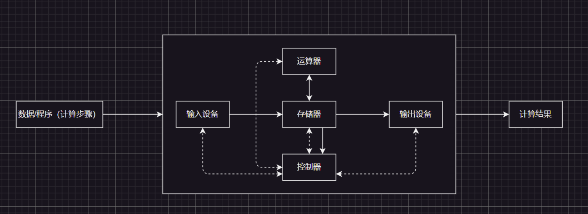

1.计算机早晚期结构
============

## 1.1.早期冯·诺依曼体系结构

世界上第一台计算机`ENIAC`是使用手动接线来控制计算，十分麻烦。

冯·诺依曼提出“存储程序”的概念，是指将指令以二进制代码的形式事先输入计算机的主存储器（内存），然后按照其在存储器中的首地址执行程序的第一条指令，以后就按该程序的规定顺序执行其他指令，直至程序执行结束。

于是第一台采用冯·诺依曼结构的计算机`EDVAC`诞生了，接下来让我们看看具体的冯·诺依曼计算机结构图（实线为数据线、虚线为控制线或反馈线）：


输入设备将信息转化为机器能识别的形式，然后通过运算器的中转存入存储器，需要用到数据和程序时，就要经过运算器中转到输出设备，得出计算结果，而整个过程都是由控制器使用电信号来进行指挥的，另外这个控制器也会负责解析存储器里的存储指令。

另外，对于计算机系统来说，软件和硬件在逻辑上是等效的，例如：可以专门制作出一个乘法硬件（硬件），也可以利用现有的加法硬件实现乘法（软件）

冯·诺依曼计算机的特点：

1. 计算机由五大部件组成

2. 指令和数据化以同等地位存储在存储器里，可按地址寻址

3. 指令和数据使用二进制表示。其中指令组成：操作码（指明指令的操作）、地址码（指明操作数据的内存地址）有的计算机指令采用多个地址码

4. 整个体系以运算器为中心，以运算器为中转站，这样会导致数据计算效率降低（比如：输入设备本来是可以直接交给存储器的，但是却交给了运算器）

## 2.现代冯·诺依曼体系结构



现代计算机有几个很不一样的特点

1. 以存储器为中心

2. 通常控制器和运算器被集成为一个`CPU`

因此我们可以改写一下结构，让这个体系变得更加模块化：

# 2.计算机硬件内部结构（现代）

## 2.1.主存储


主存储器里用于存放数据的东西叫存储体

1. 存储体内部可以分为一个一个“存储单光”，并且根据地址总线进行编址

2. 每一个存储单元存储的二进制数据组合我们称为“存储字（`word`）”

3. 存储单元存放二进制的最大长度称为“字长”，一般是8的整数倍。

4. 用于存储二进制的电子元件简称“存储元”，利用电容的原理，每个存储元可存`1bit`，而存储单元由若干个存储元构成

主存储器内部还有两个寄存器

1. 分别是`MAR`（存储地址寄存器）、`MDR`（存储数据寄存器）

2. 主存储器里的控制逻辑会根据`MAR`存储的地址查找主存储器里的数据，然后取出存放到`MDR`中，而`CPU`就可以从这里拿走数据。

3. 同理，`CPU`写入主存储器的方式也和读取类似：`CPU`想要写入的对应地址放在`MAR`里，想要写入的数据放在`MDR`里，最后通过控制总线告诉主存储器本次为写操作。

`MAR`是里有指向存储单元的地址，因此`MAR`反映存储单元的个数

`MDR`是有由要存储到`MAR`指向地址的数据内容，反映存储单元的存储字长

## 2.2.运算器

运算器是用于实现算术运算和逻辑运算的，内部有：

1. `ACC`累加器：实际是一个寄存器，用于存放操作数或运算结果

2. `MQ`乘商寄存器：在乘、除运算的时候，用于存放操作数或运算结果

3. `X`通用寄存器：通用的操作数寄存器，用于存放操作数

4. `ALU`算术逻辑单元：通过内部复杂的电路实现算术运算、逻辑运算，是运算器的核心部件，制作成本也是最高的。

|       | 加     | 减     | 乘       | 除      |
| ----- | ----- | ----- | ------- | ------ |
| `ACC` | 被加数、和 | 被减数、差 | 乘积高位    | 被除数、余数 |
| `MQ`  |       |       | 乘数、乘积低位 |        |
| `X`   | 加数    | 减数    | 被乘数     | 除数     |


> 乘积的高位表示了乘法结果的较高位数部分，而乘积的低位表示了较低位数部分。

## 2.3.控制器

控制器内部有：

1. `CU`控制单元（Control Unit）：分析指令，给出控制信号，内部有很复杂的电路，是控制器内最核心的部件

2. `IR`指令寄存器（Instruction Register）：本质是一个寄存器，存放当前执行的指令

3. `PC`程序计数器（Program Counter）：本质是一个寄存器，存放下一条指令地址，有自动`+1`的功能


在控制器内部的工作逻辑是：`PC`取得指令->`IR`分析指令->`CU`执行指令，前面两个过程为“取指阶段”，后面一个过程为“执行阶段”

# 3.计算机硬件协调流程（现代）

下面是高级语言C语言的一段代码：

```cpp
int a = 2, b = 3, c = 1, y = 0;
int main() 
{
    y = a * b + c;
    return 0;
}
```

接下来让我们看看这段代码在计算机硬件中运作流程：


首先高级语言C语言经过编译和链接生成二进制指令，通过`CPU`操控`MAR`和`MDR`，将这些二进制指令存储到主存的存储体中（存储的二进制指令假设为上图表格内容），接下来如果运行这个代码，就会发生：

## 3.1.执行指令0

1. `(PC)=0,(PC)++`：`CPU`内部的`PC`存储的是下一条指令的地址，因此`PC=0`，即：`PC`存储了第一条指令的代码地址，在执行后续的步骤后`PC`自动+1（`PC`是程序计时器，可以存放下一条指令地址，有自动`+1`的功能）

2. `(PC)->MAR,(MAR)=0,(MAR)->存储体->MDR,(MDR)=0000 01|00 0000 0101`：`PC`将指令地址交给`MAR`，`MAR`通过这个指令地址在存储体内部查找指令数据，存储到`MDR`中

3. `(MDR)->IR`：从`MDR`得到的指令数据存放到`IR`中（`IR`负责存放当前执行的指令）

4. `(IR)->CU,(IR)->MAR,(MAR)->存储体->MDR,(MDR)=0000 0000 0000 0010=2`：而在当前要执行的指令中，前六位`0000 01`操作码会被送到`CU`分析，得知这是“取数`d`到`ACC`”的命令，后`10`位代表这个数的地址在主存储器存储体的`5`处。因此`IR`把后续的10位交给`MAR`，`MAR`再去存储体内找主存地址`5`处的`a`的数据`0000 0000 0000 0010=2`存入`MDR`中（`CU`控制单元负责分析指令，给出控制信号）

5. `(MDR)->ACC`：因此`0000 0000 0000 0010=2`被拷贝到`IR`内部，然后`CU`控制`MDR`送到`ACC`里

## 3.2.执行指令1

根据[3.1.执行指令0](##3.1.执行指令0)中的步骤1，`OP(PC)=1`，`(ACC)=2`，然后就会发生：

1. `(PC)=1,(PC)->MAR,(MAR)=1,(MAR)->存储体->MDR,(MDR)=0000 01|00 0000 0101,(PC)++`：`PC`内部存储了当前要第二条指令的地址，在执行了后续的步骤了`+1`，然后`MAR`得到的指令地址是“1”，传递给`MAR`后，`MAR`在存储体中找到指令`0000 01|00 0000 0101`

2. `(MDR)->IR,(IR)->CU,(IR)->MAR,(MAR)->存储体->MDR,(MDR)=0000 0000 0000 0011=3`：接下来`MDR`将内部的指令传给`IR`，`IR`交给`CU`分析后得知前六位`0001 00`为“乘法操作，将`ab`并且存储到`ACC`中” ，后10位`00 0000 0101`为操作数地址，于是这个地址就被`IP`传给`MAR`在存储体中找到并且存储给`MDR`

3. `(MDR)->MQ,(MQ)=0000 0000 0000 0011=3`：接下来`CU`控制`MDR`内部的数据拷贝到`MQ`（`MQ`乘商寄存器：在乘、除运算的时候，用于存放操作数或运算结果，这里是存储了乘数`b`）

4. `(ACC)->X,(X)=0000 0000 0000 0010=2,ALU->(X)*(MQ)->ACC,(ACC)=6`：`CU`控制`ACC`里的值拷贝到通用寄存器`X`里，然后控制`ALU`把通用寄存器`X`里的值和乘商寄存器`MQ`里的值相乘，然后存储到`ACC`中（如果乘积太大，`MQ`也会辅助存储，存储的是乘积低位，`ACC`那边则是乘积高位）

## 3.3.执行指令2

根据[3.2.执行指令1](##3.2.执行指令1)中的步骤`1`，`OP(PC)=2`,`(ACC)=6`，然后就会发生：

1. `(PC)->MAR,(MAR)=2,(MAR)->存储体->MDR,(MDR)=0000 11|0000 0000 0000 0111,(PC)++`：`PC`将指令地址拷贝给`MAR`，`MAR`在存储体内查找到指令，拷贝给`MDR`，然后`PC`内部的计时器`+1`，存储了指向下一条指令的地址

2. `(MDR)->IR,(IR)->CU,(IR)->MAR,(MAR)=0000 0000 0000 0111=7,(MAR)->存储体->MDR,MDR=0000 0000 0000 0001=1`：MDR内部的指令值拷贝给`IR`，`IR`传递给`CU`分析指令，得知`0000 11`为“加法指令`ab+c`，并且最终存储在`ACC`中”，于是`CU`控制`IR`剩下的`0000 0000 0000 0111`，传递给`MAR`，`MAR`在存储体内找到指令数据`0000 0000 0000 0001`，传递给`MDR`

3. `(MDR)->X,(x)=0000 0000 0000 0001=1,ALU->(ACC)+(X)->ACC`：然后`MDR`将内部数据拷贝到通用寄存器`X`内，接下来控制单元`CU`向`ALU`发生信号，让`X`和`ACC`里的值相加，最后存储到`ACC`内部

## 3.4.执行指令3

根据[3.3.执行指令2](##3.3.执行指令2)中的步骤`1`，`OP(PC)=3`，`(ACC)=7`，然后就会发生：

1. `(PC)->MAR,(MAR)=3,(MAR)->存储体->MDR,(MDR)=0000 10|0000 0000 0000 1000,(PC)++`

2. `(MDR)->IR,(IR)->CU,(IR)->MAR,(MAR)=0000 0000 0000 1000=8,(MAR)->存储体->MDR,MDR=0000 0000 0000 0000=0`

3. `(ACC)=7,(ACC)->MDR,(MDR)=7,(MAR)=0000 0000 0000 1000=8`：这里就有个地方需要注意，`CU`控制了`ACC`寄存器的值拷贝到MDR，此时MAR也有y变量的主存地址，此时`CU`再控制`MAR`和`MDR`把`ab+c`存入`y`中

## 3.5.执行指令4

根据[3.4.执行指令3](##3.4.执行指令3)中的步骤1，`OP(PC)=4`，然后像上面一样类似的流程，取得`000110`停机指令，接下来就会执行操作系统的相关指令了，这后面的我们不再讨论。


