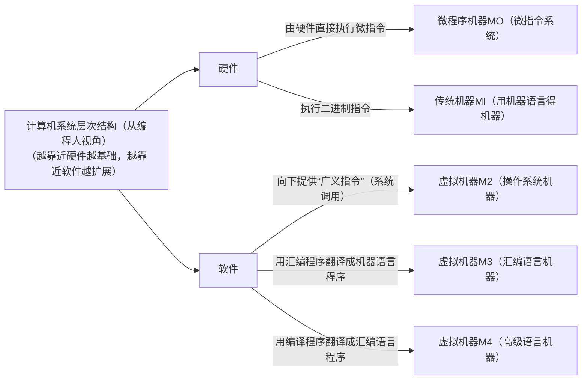

# 1.计算机系统的多级层级结构

# 2.三种级别的语言

1. 机器语言：二进制代码

2. 汇编语言：助记符

3. 高级语言：C/C++、Java

# 3.编译程序、解释程序、汇编程序的区别

1. 编译程序：将高级语言编写的源程序一次全部翻译成机器语言程序，而后执行机器语言程序（只需翻译一次），因此编译程序有解释程序，效率比较高一些。

2. 解释程序：将源代码的一条语句翻译成对应于机器语言的语句，并立刻执行，紧接着再翻译下一句（每次执行都要翻译），因此解释程序没有执行文件，执行效率比较低一些。

3. 汇编程序：将汇编语言翻译成机器语言。

# 4.计算机体系结构和计算机组成原理区别

前者研究“是否提供乘法指令”，后者研究“乘法指令的实现”
