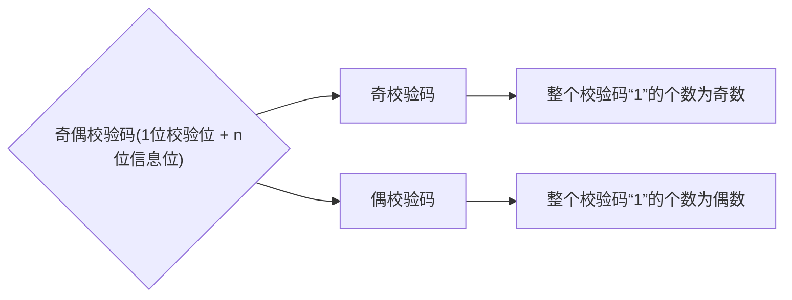

[TOC]

数据表示可以方便计算机识别和使用，一般要考虑：数据类型、范围和精度、存储和处理代价、可移植性等。

# 1.整数

## 1.1.无符号整数

### 1.1.1.无符号整数表示

对于`n bit`的二进制数，有以下的表示结论：

1. 全部二进制位都是数值位，没有符号位
2. 第`i`位的位权是$2^{i-1}$
3. `n bit`无符号整数表示的十进制整数的范围是$[0,2^{n}-1]$，超出就会发生溢出

### 1.1.2.无符号整数加法

对于计算机来说无符号整数的加法直接和人类进行手算是一样的，直接相加即可，无需做特殊处理。

>   $(99 + 9)_{10} \\= (0110\,\,0011)_{2} + (0000\,\,1001)_{2} \\= (0110\,\,1100)_{2} \\= 108_{10}$

### 1.1.3.无符号整数减法

对于计算机来说无符号的减法需要进行一些特殊处理，需要：

1. `被减数`无需变化，`减数`全部`bit`位取反，然后`+1`
3. 改`-`为`+`转化为加法

>   这里举一个例子，对于`8bit`位的寄存器：
>
>   $(99 - 9)_{10} \\= (0110\,\,0011)_{2} - (0000\,\,1001)_{2} \\= (0110\,\,0011)_{2} + (1111\,\,0111)_{2} \\= (1)_{溢出部分} (0101\,\,1010) \\= (1)_{溢出部分}(0101\,\,1010) \\= 90_{10}$

## 1.2.有符号整数

### 1.2.1.有符号整数表示

对于`n bit`的二进制数，有以下的表示结论：

1.   最高`bit`位使用数值表示`+/-`，即`0`表示`+`，`1`表示`-`，剩下都是数值位
2.   第`i-1`位的位权是$2^{i-2}$
3.   `n bit`无符号整数表示的十进制整数的范围是$[-2^{n-1},2^{n-1}-1]$，超出就会发生溢出

而需要注意的是，`真值0`有两种表达方式，一个是$00_2$另一个是$10_2$，也就是所谓的`+0`和`-0`，不过一般`-0`被表示位`n bit`数的最小负数，这样可以多使用一个数。

### 1.2.2.有符号整数加法

加法运算把两个操作数都转化为补码（对于有符号整数，如果是正数原反补相同，如果是负数则需要转化），然后就变成了补码的加法运算，直接进行加法运算即可（补码加法需要包含符号位）

>   例`1`：$(19)_{10} + (-19)_{10} \\= (0,001\,\,0011)_{原} + (1,001\,\,0011)_{原} \\ (0,001\,\,0011)_{补} + (1,110 1101)_{补} \\= ((1)_{溢出}\,\,0,000\,\,0000)_{补} = (0,000\,\,0000)_{原} = (0)_{10}$
>
>   例`2`：$(-19)_{10} + (-19)_{10} = (1,001\,\,0011)_{原} + (1,001\,\,0011)_{原} \\= (1,110 1101)_{补} + (1,110 1101)_{补} = ((1)_{溢出}1,101\,\,1010)_{补} \\= (1,010\,\,0110)_{原} = (-38)_{10}$

### 1.2.2.有符号整数减法

而有符号整数的减法我们的思路还是转化为加法运算，$A-B = A + (-B)$，那就转化为$A_{补} + (-B)_{补}$。

那么如何得到从$B$得到$-B_{补}$呢？实际上$B_{补}$全部位取反（包括符号位），再加$1$就可以得到$(-B)_{补码}$（还有一种转化方法我写在下面的“补充`1`”里了）。

这样就可以在计算$A - B$的时候，先转变为$A + (-B)$，转化为$A_{补} + (-B)_{补}$（实际上就是$A_{补} - B_{补}$），因此可以通过$B_{补}$来计算$(-B)_补$，然后对结果转化为原码就可以得到$A - B$的结果。

> 补充`1`：如果希望加快转化补码到负补码速度，可以从右往左找到第一个`1`，然后这个`1`左边的所有`比特位`（要包括符号位）按位取反即可。
>
> 补充`2`：如果希望加快转化原码到补码的速度，可以从右往左找到第一个`1`，然后这个`1`左边的所有`数值位`（不包括符号位）按位取反即可。
>
> 补充`3`：如果没有指明字长，写带符号位的二进制可以不用写多余的`0`，例如：`1000011`可以写成`1,11`
>
> 补充`4`：对于有符号整数的原反补码最高位都是符号位，进位的时候不应该考虑符号位。
>
> 补充`5`：实际上，“无符号整数的减法运算的过程”和“有符号整数的减法运算中补码减法的过程”是一样的。因为
>
> 1.   前者需要将减数的全部`bit`位取反加一，然后改符号为`+`
> 2.   后者需要将$A_{补} - B_{补}$的$B_{补}$全部`bit`位取反加一，然后改符号为$A_{补} + (-B_{补})$
>
> 由于这两个过程是一样的，因此可以让“无符号整数相减”和“补码相减”共用一个加法器。


# 4.正数和负数的补码关系

`B[补]`全部比特位（包括符号位）按位取反后末尾加`1`得到`-B[补]`，而`-B[补]`得到`B[补]`也是一样的步骤。

> 补充1：如果希望加快转化`B[补]`和`-B[补]`的速度，还可以从右往左找到第一个`1`，然后这个`1`左边的所有`比特位（包括符号位）`按位取反。
> 
> 补充2：如果是原码转补码也有类似的特性，`-24(10)=10011000(2)`的补码可以从右到左找第一个`1`，`1`的左边全部取反，不算符号位，因此得到`11101000`。

# 5.原反补码特性对比

补码的合法范围会多出一个负数，即所谓`-0`，这个数被看作非零数，并不是`0`。因此真值`0`对于补码来所只有一种表达方式（对于反码和原码都是两种）。

若假设目前有`8`个`bit`位的补码，则最小数应该是`1000 0000(2) = -128(10)`。

因此原码和反码的合法范围完全相同，但是补码会多出一个负数

> 注意：对于8`bit`的二进制，如果使用原码保存结果，则`(-64)+(-64)`会发生溢出，但使用补码不会。

# 6.移码

移码实在补码的基础上将符号位取反诞生的，移码只能表示整数。

移码对于真值`0`的表示也只有一种，表示的合法范围和补码一样，也是可以多表示一个负数。

移码会运用在浮点数的阶当中（以后讲）。

移码能从0开始和补码一一映射。 


# 1.定点整数

也就是带符号整数，默认小数点固定在最后的位置。

# 2.定点小数

定点小数的小数点固定在符号位的后面。小数点位置的不同，会导致二进制的位权不一样，造成结果不同。

> 补充：如果是定点整数，通常会在符号位后使用`,`隔离开符号位和数值位。如果是定点小数就在符号位后使用`.`来隔开符号位和数值位。

定点小数的原反补码以及有无符号相加和定点整数一样没有太大区别。

不过需要注意的是，定点小数的补码也会多出一位，并且真值`0`也只有一种表达方式。

> 注意：由于小数点的位置不同，还要保证小数点不变，并且不改变权值。因此定点整数拓展位置应该在符号位的后面拓展位数。而定点小数拓展位置应该在最右边。


# 1.真值数与机器数

1.  真值数就是把正负号的符号写在数值前（人类习惯的样子）
2.  机器数就是把正负号数字化的数（存到机器中的样子）

# 2.BCD码的原理

`BCD`码（Binary-Coded Decimal）是一种用二进制数来编码十进制数字的方式。`BCD`码使用4位二进制数来表示一个十进制数的每一位。

## 2.1.8421码映射

`8421`码是`BCD`码的一种实例化。

| 0    | 1    | 2    | 3    | 4    | 5    | 6    | 7    | 8    | 9    |
| ---- | ---- | ---- | ---- | ---- | ---- | ---- | ---- | ---- | ---- |
| 0000 | 0001 | 0010 | 0011 | 0100 | 0101 | 0110 | 0111 | 1000 | 1001 |

因此`132`可以表示为`0001 0011 0010`，其中`8421`码没有`1010~1111`的定义（也就是`10~15`）。那么如果进行计算`+`运算呢？

`5 + 8 = 13`就可以先直接`0101 + 1000 = 1101`，但是`BCD`码没有`1101`定义怎么办呢？可以在原二进制值`+6`来进行进位修正。即：`1101 + 0110 = 1 0011 = (13)10`。

```
9 + 9 = 18`即：`1001 + 1001 = 1 0010`而`1 0010`本身不再`BCD`码的定义范围内，因此也需要`+0110`，最终结果为`1 1000 = (18)10
```

>   补充：由于`BCD`码只使用了`4bit`位组中的10个定义，还剩下了6个定义没有被使用，因此如果我们修改映射方案就可以得到不同的编码规则。

## 2.2.余3码映射

在`8421`码的基础上，每个码值的定义都加上`0011`（十进制为3）

| 0    | 1    | 2    | 3    | 4    | 5    | 6    | 7    | 8    | 9    |
| ---- | ---- | ---- | ---- | ---- | ---- | ---- | ---- | ---- | ---- |
| 0011 | 0100 | 0101 | 0110 | 0111 | 1000 | 1001 | 1010 | 1011 | 1100 |

## 2.3.2412码映射

这种映射方案直接改变了权值，把`8421`对应的二进制权值修改为`2421`，因此码值的映射关系如下：

| 0    | 1    | 2    | 3    | 4    | 5    | 6    | 7    | 8    | 9    |
| ---- | ---- | ---- | ---- | ---- | ---- | ---- | ---- | ---- | ---- |
| 0000 | 0001 | 0010 | 0011 | 0100 | 1011 | 1100 | 1101 | 1110 | 1111 |

但是这种编码方案有一个问题，比如`5`有两种表示方法`0101`和`1011`，因此我们还额外规定`0~4`的第一位二进制位是`0`，`5~9`的第一位二进制位是`1`，这样就可以使得定义变得唯一确定。


# 1.校验原理

在二进制信息的传输中，由于多种不明环境干扰，有可能造成二进制错乱（位错误，`1`变成`0`，`0`变成`1`），导致信息错误的产生，这个时候就诞生出`校验`的概念。

如果在两位的二进制数据的最高位加上用于校验的`校验位`，则计算机可以依靠这个校验位达到校验的目的，确认数据的正确性。

原数据映射表（有4种合法状态）：

| 信息 | A    | B    | C    | D    |
| ---- | ---- | ---- | ---- | ---- |
| 编码 | `00` | `01` | `10` | `11` |

加上校验位则变为（除了四种合法状态还有4种冗余的非法状态）：

| 信息 | A      | B      | C      | D      |
| ---- | ------ | ------ | ------ | ------ |
| 编码 | `1 00` | `0 01` | `0 10` | `1 11` |

对于原来的映射表，如果发生了位错误，例如：`00`变成`10`或者`01`则计算机识别不错来错误。

对于修正后的映射表，如果发生了位错误，例如：`100`变成了`110`或者`101`或者`000`计算机都能识别出来这是非法的编码。同理其他情况也是，不过这种只能针对只有一个比特位数据发生修改的行为，如果发生多个比特位数据的位错误就不一定能识别出来了。

# 2.奇偶校验

因此我们可以得到奇偶校验码的相关概念。



例如`1001101`的奇校验码的校验位就是`1`，`1001101`的偶校验码的校验位就是`0`，因此开头我们提到的映射表里，计算机之所以可以识别信息的错误就是采用了奇校验的原理，只要有一个位发生了位错误计算机就可以察觉。

那么计算机究竟是怎么“察觉”的呢？

我们是通过计数的方式，来查看是否为奇数个`1`或偶数个`1`。

而计算机则通过`^`运算，比如：对于奇校验码`11001101`，对每一个二进制位使用异或，异或到一起的值就是`1^1^0^0^1^1^0^1`为`1`因此计算机认为这是正确的数据，但是如果发生位错误，数据变为`11001100`，则异或的结果变为`0`，计算机成功识别出错误！（对于奇校验码异或的结果一定为`1`，对于偶校验码异或的结果一定为`0`）

> 补充：根据异或的特性，我们很容易明白一个事情。
>
> 1. “奇校验码”只有奇数个位发生位错乱才可以识别出错误
>
> 2. “偶校验码”只有偶数个位发生位错乱才可以识别出错误。
>
> 并且无论是奇校验码还是偶校验码都无法察觉出究竟是哪一个比特位发生错误，只能知道所给的二进制码必然发生了错误，进而抛弃整个二进制码。


# 2.浮点


