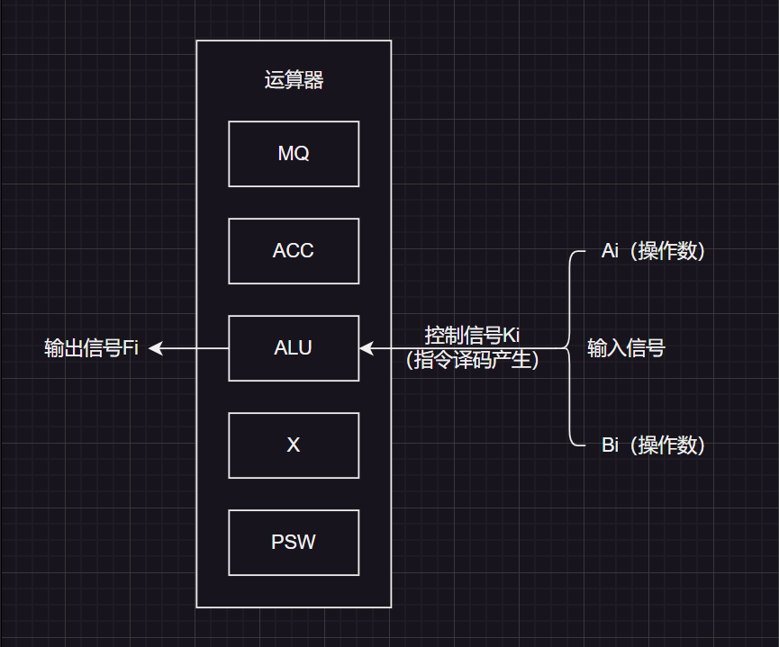
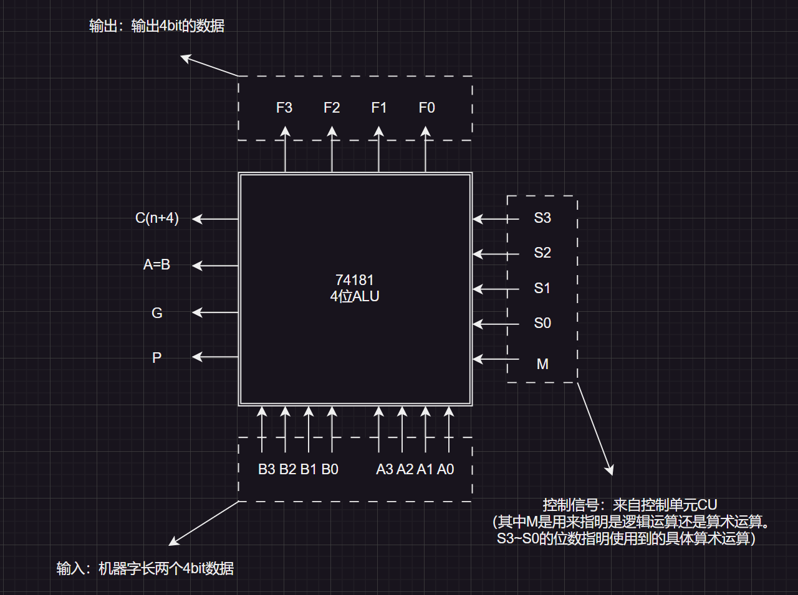
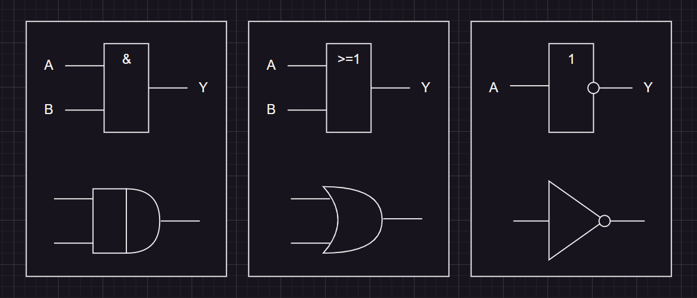
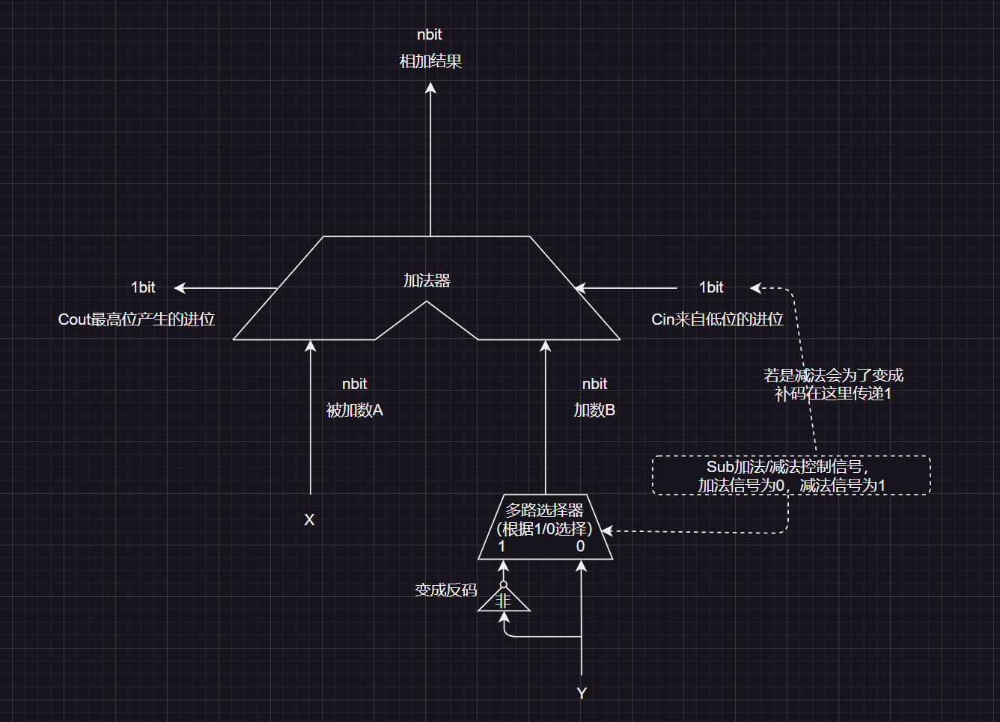

[TOC]

# 1.运算器硬件

我们回顾一下运算器的内容：

运算器是用于实现算术运算和逻辑运算的（还有一些辅助功能），内部有：

1.   `ACC`累加器：实际是一个寄存器，用于存放操作数或运算结果
2.   `MQ`乘商寄存器：在乘、除运算的时候，用于存放操作数或运算结果
3.   `X`通用寄存器：通用的操作数寄存器，用于存放操作数
4.   `ALU`算术逻辑单元：通过内部复杂的电路实现算术运算、逻辑运算，是运算器的核心部件，制作成本也是最高的。

# 2.算术逻辑单元

## 2.1.简单示意图

当然也有简单画图为这样的：

## 2.2.实际示意图

在运算器内部的`ALU`（算术逻辑单元）的内部结构具体如下：

>   补充：其中$M=0$的时候代表算术运算，$M==1$的时候代表逻辑运算。

# 3.基本逻辑电路

`ALU`的内部是一些基础的门电路组成的，因此我们需要学习门电路的知识和表示图。

## 3.1.基本逻辑电路

基本逻辑有：`&&`、`||`、`!`

逻辑运算的实现可以使用门电路表示：

> 补充1：实际`&&`和`||`的关系类似`*`和`/`三个律都满足。
> 
> 补充2：`&&`在逻辑表达式中经常写成`·`，`||`在逻辑表达式中经常写成`+`

## 3.2.复合逻辑电路

符合的逻辑电路还有：`!&&与非`、`!||或非`、`^异或`，这些电路可以使用数学表达式转化成基本逻辑电路进行复合来实现。

>   补充：利用数电的知识，化简逻辑公式，可以化简门电路设计，简化硬件电路的实现，这些内容更多在数字逻辑电路学科中。

# 4.加法器的实现

## 4.1.单位加法器

通过基本电路构成的更加复合的电路就可以设计出一位加法器。

如果我们将加法限定在某一个二进制位中，定义以下概念：操作位的本位$A(i)$、本位$B(i)$以及进位$C(i-1)$的相加，得到本位和$S(i)$。

1.   得到本位的位运算/逻辑函数就是：$S_{i} = A_{i} \textasciicircum B_{i} \textasciicircum C_{i-1}$
2.   得到进位的位运算/逻辑函数就是：$C_{i} = A_{i}·B_{i} + (A_{i} \textasciicircum B_{i})·C_{i-1}$

>   前一个表达式：很好理解，$A(i)$和$B(i)$和$C(i-1)$里有奇数个$1$就得到$1$，例如：$0+1+0=1$、$1+1+1 = 1$、$0+0+1=1$等。
>
>   后一个表达式：函数中的$+$不是算术加法，而是逻辑加法$||$，因此可以解读为两种情况
>
>   1. 一是$A(i)$和$B(i)$都是$1$的情况，这种情况整个逻辑函数的结果就为$1$
>   2. 二是$A(i)$和$B(i)$中有一个$1$，再加上进位的$1$（即：$(A(i)^B(i)$的结果为$0 \textasciicircum 1 = 1$或者$ 1 \textasciicircum 0 = 1$，再进位的$1$逻辑乘$\&\&$，真个逻辑函数的结果就为$1$）

因此一个单位加法器可以根据上述逻辑函数实现对应的复合门电路，就可以进一步实现串行加法器了。

## 4.2.串行加法器

下面就是串行加法器的实现图解：

串行加法器就是循环使用一个一位加法器，虽然达到了对两数相加的结果，但是效率比较低下（因为每一位都要按顺序计算，有$n$个比特位就要计算$n$次）。

## 4.3.并行加法器

并行加法器相比串行加法器效率要高一些。

上面这是一种串行的并行加法器，把$n$个单位加法器串接起来，这种“串行进位”又叫做“行波进位”，每一位进位直接依赖于低级的进位，进位信号是逐级形成（虽然并行加法器可以同时计算本位，但是还缺乏进位的运算，效率取决于什么时候计算出前一级结果的速度和传递速度）。

## 4.4.复合加法器

$$
\left
\{
\begin{array}{left}
1.本位的位运算/逻辑函数：S_{i} = A_{i} \textasciicircum B_{i} \textasciicircum C_{i-1}\\
2.进位的位运算/逻辑函数：C_{i} = A_{i}·B_{i} + (A_{i} \textasciicircum B_{i})·C_{i-1}\\
\end{array}
\right.
$$

根据$S_i(A,B,C)$，我们可以知道因为$C_{i-1}$无法在本位阶段直接确定，需要根据前一级来计算。

而$C_{i-1}$又是根据$C_{i-1} = A_{i-1}·B_{i-1} + (A_{i-1} \textasciicircum B_{i-1})·C_{i-2}$计算的，因此可以得到：

$$
\begin{array}{left}
C_{i-1} = C_{i-1}\\

C_{i-1} = A_{i-1}·B_{i-1} + (A_{i-1} \textasciicircum B_{i-1})·C_{i-2}\\

C_{i-1} = A_{i-1}·B_{i-1} + (A_{i-1} \textasciicircum B_{i-1})·(A_{i-2}·B_{i-2} + (A_{i-2} \textasciicircum B_{i-2})·C_{i-3})\\

C_{i-1} = A_{i-1}·B_{i-1} + (A_{i-1} \textasciicircum B_{i-1})·(A_{i-2}·B_{i-2} + (A_{i-2} \textasciicircum B_{i-2})·(A_{i-3}·B_{i-3} + (A_{i-3} \textasciicircum B_{i-3})·C_{i-4}))\\

C_{i - 1} = A_{i-1}·B_{i-1} + (A_{i-1} \textasciicircum B_{i-1})·(A_{i-2}·B_{i-2} + (A_{i-2} \textasciicircum B_{i-2})·(A_{i-3}·B_{i-3} + (A_{i-3} \textasciicircum B_{i-3})·\,\,... + (A_{1}·B_{1} + A_{1} \textasciicircum B_{1})·C_0)...)\\
\end{array}
$$
一直展开到底就一定可以展开到$C_{0}$，而$C_{0}$和其他本位都是常数，就可以直接使用门电路计算出每一本位的进位。

上面式子太过于冗余了，不太好看，因此我们假设$G_{i-1}=A_{i-1}·B_{i-1}$和$P_{i-1}=A_{i-1} \textasciicircum B_{i-1}$，因此$C_{i-1} = A_{i-1}·B_{i-1} + (A_{i-1} \textasciicircum B_{i-1})·C_{i-2}$化简为$C_{i-1} = G_{i-1} + P_{i-1}·C_{i-2}$，上述递归公式也转变为下述：

$$
\begin{array}{left}
C_{i-1} = G_{i-1} + P_{i-1}·C_{i-2}\\

C_{i-1} = G_{i-1} + (P_{i-1})·(G_{i-2} + (P_{i-2})·C_{i-3})\\

C_{i-1} = G_{i-1} + (P_{i-1})·(G_{i-2} + (P_{i-2})·(G_{i-3} + (P_{i-3})·C_{i-4}))\\

C_{i - 1} = G_{i-1} + (P_{i-1})·(G_{i-2} + (P_{i-2})·(G_{i-3} + (P_{i-3})\,·\,\,... + (G_{1} + P_{1})·C_0)...)\\
\end{array}
$$
这种并行进位（又被称为先行进位、同时进位）的并行加法器，各级的信号可同时/并行生成。

但是这种方式$C_{n}$过大时，逻辑式子就越大，电路设计也就越复杂，因此我们为了减低电路的复杂性，可以设计固定几位做并行进位，而不是全部位数都使用并行进位，然后再组合成复合加法器。

## 4.5.补码加法器

由于我们之前再实现有符号整数的加减运算中，用到了补码加减运算，因此这里就需要设计出补码加法器，这个补码加法器的内部就是串并行加法器。

首先要知道补码的加减运算，对于`n bit`的补码$X$、$Y$：

1. $X+Y$，直接相加即可

2. $X-Y$，取得$Y$的补码$[Y]_{补}$，减法变加法

3. 如果计算结果超出`n bit`就会发生溢出进而舍弃

> 注意：我们这里学习的是补码的加减法，而不是真值的加减法，要注意区分。

上述就是补码加法器，两个操作数$X$和$Y$都是补码，可以根据信号调整加减法。

并且这个补码加法器可以和无符号整数加减法共用（无符号整数的加法操作直接相加和补码加法一样，无符号整数的减法操作和补码减法操作一样）。

但是两者判断溢出的方法时不一样的（这涉及到标记位的使用）。

# 5.溢出判断

在使用加法器的时候，很容易发现溢出的问题。而上述所有的加减法运算都可以用补码加法器来实现，因此只需要考虑补码加法器的溢出问题即可。

而溢出主要是在同号整数相加减得到的两种情况：上溢（正数加正数得到负数）、下溢（负数加负数得到正数）。

## 5.1.一位符号位判断溢出

设$A$的符号为$A_{s}$，$B$的符号为$B_{s}$，运算结果的符号为$S_{s}$，则溢出判断函数$V = A_{s}B_{s}S_{s}^{'} + A_{s}^{'}B_{s}^{'}S_{s}$，这个式子很好解释，就是根据溢出两种情况来设计的，$V=1$表示溢出，$V = 0$表示没有溢出。

## 5.2.一位符号位和最高数值位判断溢出

在计算数$A$和$B$的时候，先得出在计算最高$bit$数值位时产生的进位$C_{1}$，然后得到符号位的进位$C_{s}$，感觉规律可以知道：溢出的情况就是$C_{s} \neq C_{1}$（不溢出就不会导致符号位进位了），或者说是逻辑函数$V = C_{s} \textasciicircum C_{1}$

## 5.3.双符号位判断溢出

如果一开始给二进制设置两个符号位：正数为$00$，负数为$11$。

因此”上溢就会变成$01$，下溢就会变成$10$“，根据这一点来设计函逻辑数，判断是否溢出即可。

而这个逻辑函数就是：记两个符号位为$S_{s1}$和$S_{s2}$，则$V = S_{s1} \textasciicircum S_{s2}$，则$V = 0$表示无溢出，$V = 1$表示有溢出。

实际上在存储的时候，双符号二进制的第二个符号位并不存在，该二进制也是单符号存储在计算机里的，但是在进行运算的时候，先复制了一个符号位作为第二个符号位，得到双符号位二进制在进行计算，进而进行溢出判断。

>   补充：单符号补码又叫做”模`2`补码“，双符号补码又叫做”模`4`补码“
