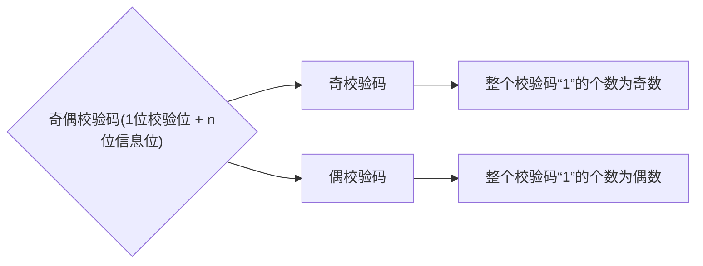

# 1.校验原理

在二进制信息的传输中，由于多种不明环境干扰，有可能造成二进制错乱（位错误，`1`变成`0`，`0`变成`1`），导致信息错误的产生，这个时候就诞生出`校验`的概念。

如果在两位的二进制数据的最高位加上用于校验的`校验位`，则计算机可以依靠这个校验位达到校验的目的，确认数据的正确性。

原数据映射表（有4种合法状态）：

| 信息  | A    | B    | C    | D    |
| --- | ---- | ---- | ---- | ---- |
| 编码  | `00` | `01` | `10` | `11` |

加上校验位则变为（除了四种合法状态还有4种冗余的非法状态）：

| 信息  | A      | B      | C      | D      |
| --- | ------ | ------ | ------ | ------ |
| 编码  | `1 00` | `0 01` | `0 10` | `1 11` |

对于原来的映射表，如果发生了位错误，例如：`00`变成`10`或者`01`则计算机识别不错来错误。

对于修正后的映射表，如果发生了位错误，例如：`100`变成了`110`或者`101`或者`000`计算机都能识别出来这是非法的编码。同理其他情况也是，不过这种只能针对只有一个比特位数据发生修改的行为，如果发生多个比特位数据的位错误就不一定能识别出来了。

# 2.奇偶校验

因此我们可以得到奇偶校验码的相关概念。

例如`1001101`的奇校验码的校验位就是`1`，`1001101`的偶校验码的校验位就是`0`，因此开头我们提到的映射表里，计算机之所以可以识别信息的错误就是采用了奇校验的原理，只要有一个位发生了位错误计算机就可以察觉。

那么计算机究竟是怎么“察觉”的呢？

我们是通过计数的方式，来查看是否为奇数个`1`或偶数个`1`。

而计算机则通过`^`运算，比如：对于奇校验码`11001101`，对每一个二进制位使用异或，异或到一起的值就是`1^1^0^0^1^1^0^1`为`1`因此计算机认为这是正确的数据，但是如果发生位错误，数据变为`11001100`，则异或的结果变为`0`，计算机成功识别出错误！（对于奇校验码异或的结果一定为`1`，对于偶校验码异或的结果一定为`0`）

> 补充：根据异或的特性，我们很容易明白一个事情。
> 
> 1. “奇校验码”只有奇数个位发生位错乱才可以识别出错误
> 
> 2. “偶校验码”只有偶数个位发生位错乱才可以识别出错误。
> 
> 并且无论是奇校验码还是偶校验码都无法察觉出究竟是哪一个比特位发生错误，只能知道所给的二进制码必然发生了错误，进而抛弃整个二进制码。

