# 1.存储器的层次

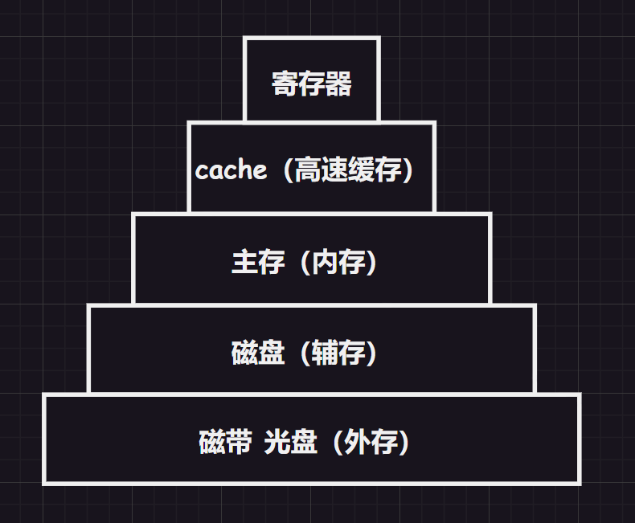

一般来说越高层越贵，空间存储量越小。

1.   `cache`和寄存器等高速存储器解决了与`CPU`速度不匹配的问题
2.   `cache`以上的部分是由硬件自动完成的，而主存和辅存部分主要是硬件和操作系统控制的，实现了虚拟存储系统，解决内存容量不够的问题

# 2.存储器的分类

## 2.1.根据存储介质来分类

1.   半导体存储器：主存、`cache`
2.   磁表面存储器：磁带、磁盘
3.   光存储器：光盘

## 2.2.根据存储方式来分类

1.   随机存取存储器：读写任何一个存储单元所需时间是一样的
2.   顺序存取存储器：读取一个存储单元所需时间取决于存储单元的物理位置
3.   直接存取存储器：这种存储器具有上述两种存储器的特征，最典型的就是磁盘，先选择数据存储的某一磁盘区域，然后使用磁头顺序查找一个磁盘上的数据
4.   相联存取存储器：按照内容访问的存储器，可以快速内容检索到存储位置进行读写，“块表”就是典型例子 

>   补充：另外读写时间和存储地址有关的存储器也可以归为串行访问存储器

## 2.3.根据信息更改来分类

1.   读写存储器：可读可写，磁盘等
2.   只读存储器：只可读取，典型的就是写入`BIOS`的`ROM`存储器（现在也有的可写，但是很麻烦）

## 2.4.根据信息保存来分类

1.   易失性存储器：主存、`cahce`等
2.   非易失性存储器：磁盘、光盘等

>   补充：信息读出后，原存储信息被破坏，就叫”破坏性读出“（典型的就是`DRAM`芯片）。信息读出后，原存储信息不被破坏，就叫”非破坏性读出“。

# 3.存储器的指标

## 3.1.存储容量

$存储容量 = 存储字的数量 × 存储字的字长$

>   补充：存储字的数量通常用一个纯量单位来表示，它表示存储器中可以保存的字（数据）的个数。这个单位可以是简单的数字，也可以根据具体情况使用诸如"个"、"条"、"项"等其他合适的单位。例如：一个存储器中可以保存`10000`个数据字，这里的"个"就是表示存储字数量的单位。
>
>   在实际应用中，存储字数量还经常以更大的计量单位来表示，例如千（`K`）、兆（`M`）、吉（`G`）、太（`T`）等。这些单位可以帮助我们更方便地描述存储器的容量规模，比如"`1K`个"、"`1M`个"、"`1G`个"等。

## 3.2.单位成本

$每位价格 = \frac{总成本}{总容量}$

## 3.3.存储速度

$数据传输率/主存带宽 = \frac{存储字的资产}{存储周期}$

>   补充：存储周期还可以被细分为存取时间和恢复时间。
>
>   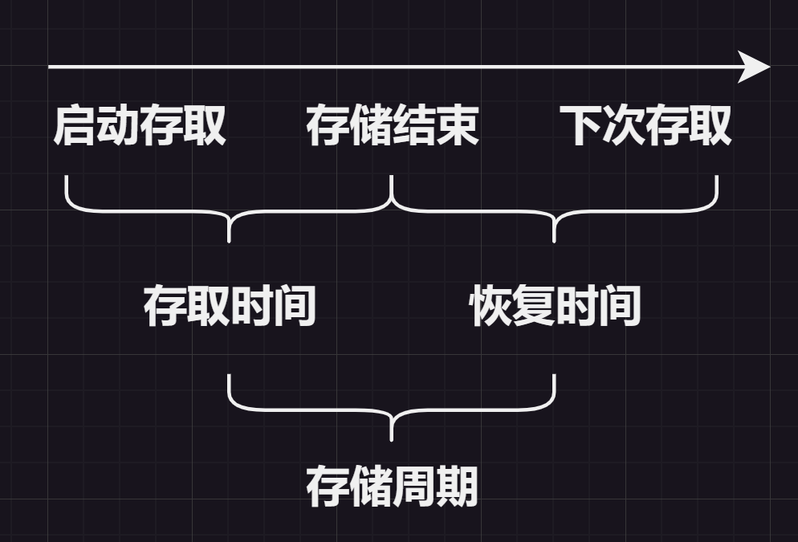

# 4.RAM芯片

`RAM`芯片分为`DRAM`和`SRAM`两种，分别可以做出内存和高速缓存两种硬件，是两种硬件各自的核心组成芯片。

## 4.1.DRAM（内存）

>   提醒：我们提到的内存和辅存，实际上在逻辑上是统一编址的，都可以被程序所使用，只不过在程序（尤其是进程）看来，自己使用的是内存地址（实际也就是虚拟地址）。
>
>   因此这里我们讨论的是内存中`DRAM`芯片，不过不同场景下，主存究竟是指内存还是内存加辅存，需要依上下文决定。

我们之前有提及，主存的大致结构就是由`MAR`、`MDR`和存储体构成，由时序控制逻辑来调配存储和寻址工作。而存储体由多个存储单元构成，而存储单元由多个存储元/存储元件构成。

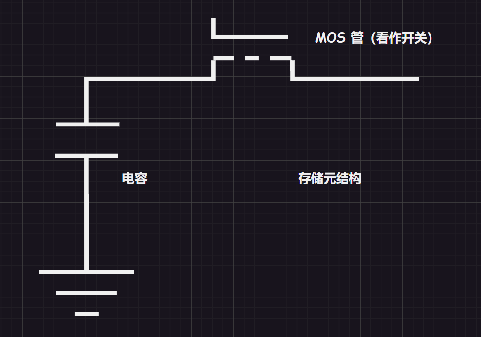

假定我们通电半导体，则半导体导通。然后输入电压，电容进行充电，则根据电容是否保存电荷来表示`1/0`。而如果不输入电压，但是让`MOS`管正常工作，则半导体导通，可以导出电容的电量，得到存储的数据是`1/0`。

这就完成了对一个比特位的读写过程，多个电元经过科学合理的连接，通过一条数据线统一管理进行读写。这条数据线就是一个存储单元（一个存储字），若干个存储单元就构成了一个存储体，或者叫做“存储矩阵”。

`CPU`通过地址总线，传输地址给`MAR`，`MAR`存储起来后，使用译码器将`n`位的地址数据翻译为对应的字选线，设置字选线的高电平信号。字选线选择好后，`MDR`就会通过数据总线（位线）取走对应的一个存储字长的数据。

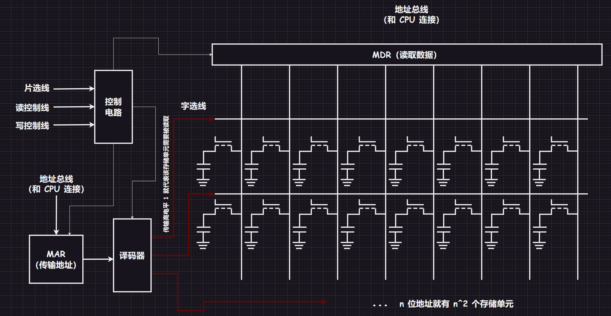

地址数据送给`MAR`后有可能出现电信号不稳定的情况，因此就需要控制电路控制`MAR`和译码器和`MDR`，只有`MAR`稳定后才可以将电信号交给译码器，同理译码器的输出也是一样的。

另外还有几条线路需要补充，控制电路内的存储芯片对外还接通了：片选线（芯片选择信号$\overline{CS}$和芯片使能信号$\overline{CE}$，上划线代表只有在低电平时才有效，可以通过$\overline{CS}$选择对应内存条上的某一块存储体）、读写控制线（$\overline{OE}$和$\overline{WE}$，低电平表示正在读写操作，还有一种设计方法是两者结合，只留$\overline{WE}$一根线，低电平写，高电平读，这会导致对外暴露金属引脚不一样）。

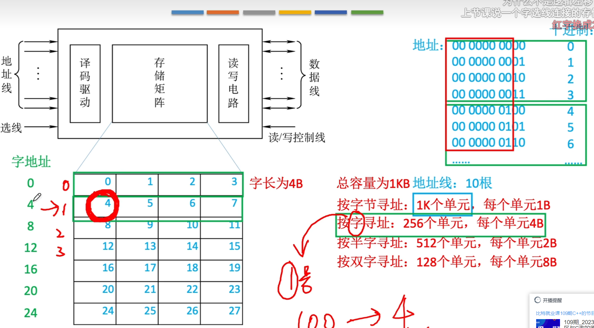

而上述提及的一整个电器器件就是`DRAM`芯片（利用栅极电容元件存储信息）。

另外，如果真的按照$2^n$个存储单元来排布线路，则将会排布相当多的线路，因此最好将多个存储单元列为一行，多行形成矩阵，将单个的译码器改为一个行地址译码器和列地址译码器，每一个译码器只需要处理一般的地址位信息，两者结合就可以找到对应的存储单元来进行读写。

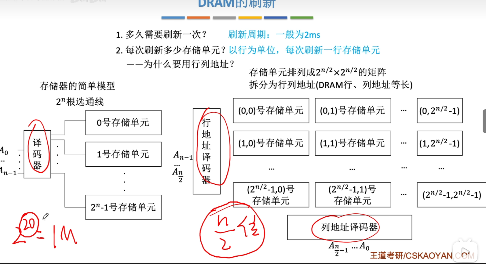

而电容的物理性质决定内存需要不断被刷新，因此就可以根据行地址译码器，选中一行的存储单元们，进行一次一行的刷新，而刷新一整行实际上就是做了一次读操作，也就需要占用一个读周期的时间。

另外刷新操作一般都是从年初起

而`DRAM`有三种主要的刷新策略。

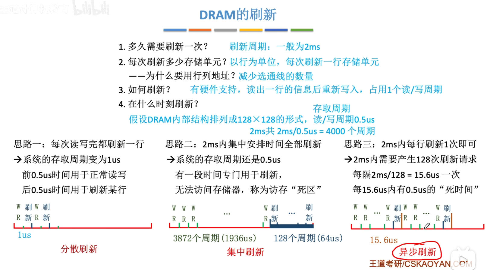

另外，如果使用地址线复用技术就可以让地址线减少。

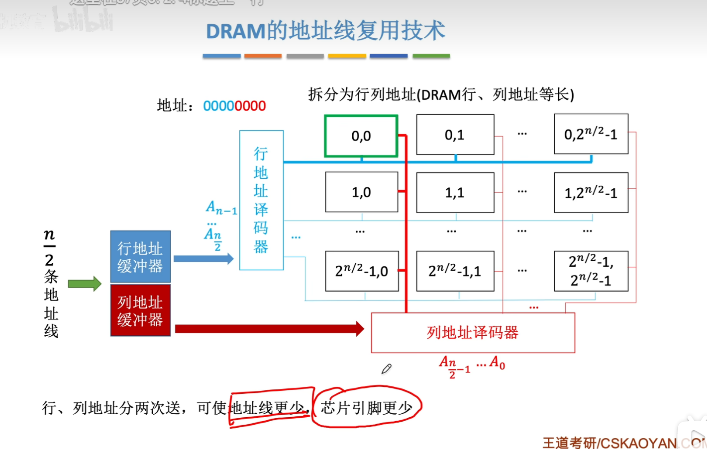

## 4.2.SRAM（高速缓存）

告诉缓存的电器器件中，电器元件为双态触发器（对标主存中的栅极电容）内部由`6`个`MOS`管构成，该元件对`1/0`的定义和电容不一样。

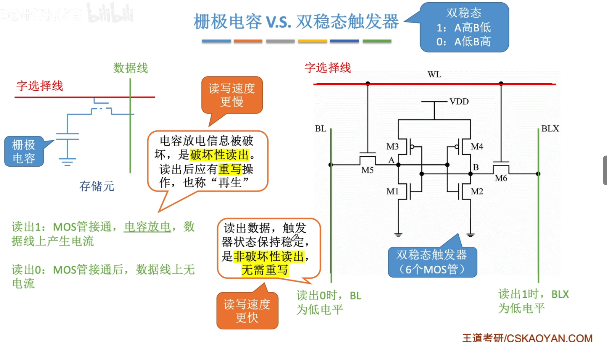

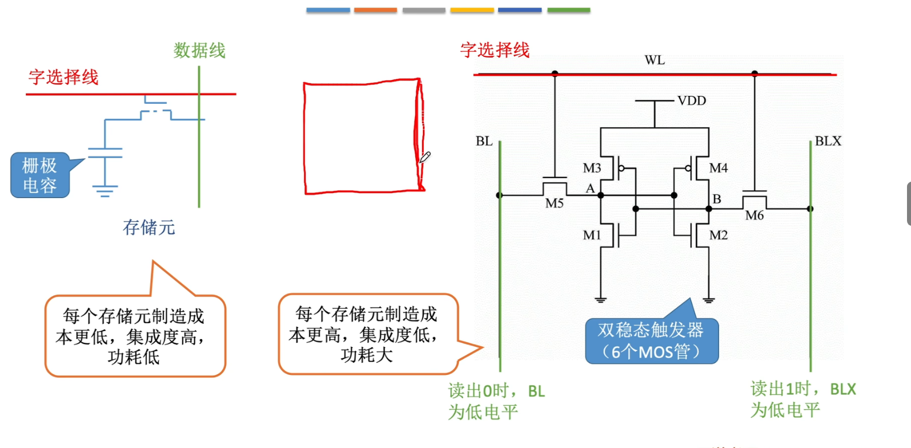

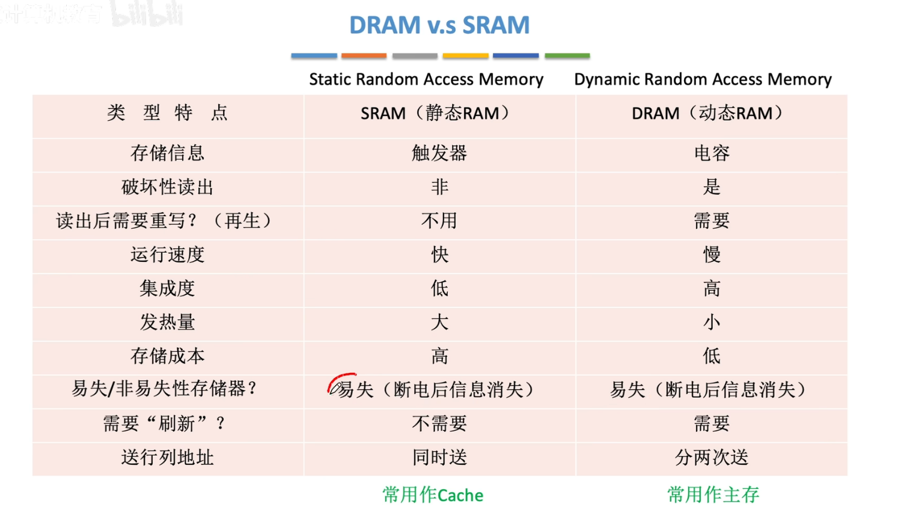

由于电容里的电荷会随时间消散，因此就需要不断写入数据刷新电容，也就是刷新主存，而双稳态就不会有这种问题。

同时送行列地址是因为`cache`的容量较小，同时送就可以了。 

# 5.ROM芯片

一般主板上的`BIOS`芯片就是一种`ROM`芯片，内部存储了“自举装入程序”，负责引导装入操作系统（也就是所谓“开机”）。

## 5.1.MROM

掩模式只读存储器，厂家根据需求...

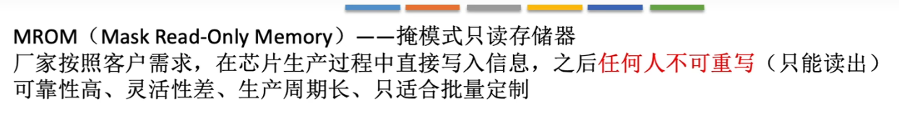

## 5.2.PROM

## 5.3.EPROM

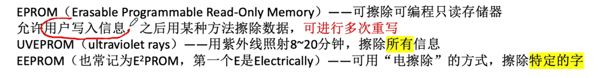

## 5.4.Flash

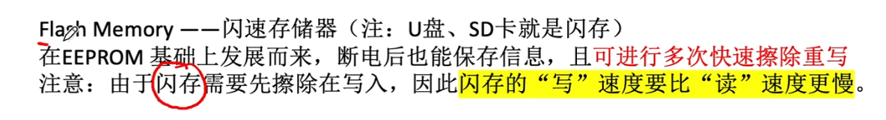

## 5.5.SSD

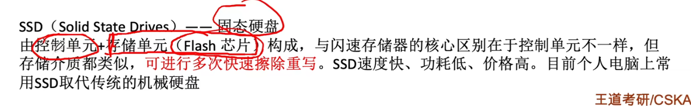

