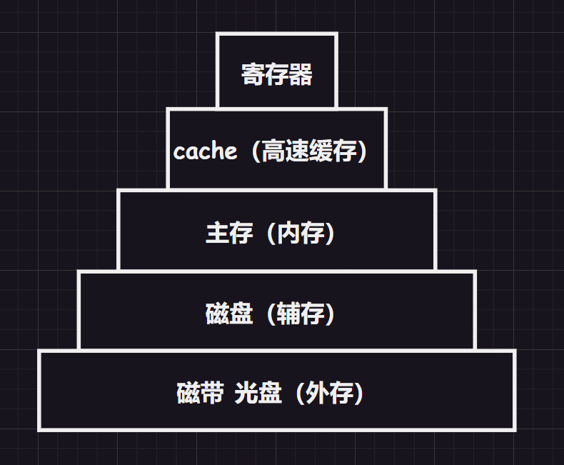

# 1.存储层次结构

一般来说越高层越贵，空间存储量越小。

1.   `cache`和寄存器等高速存储器解决了与`CPU`速度不匹配的问题
2.   `cache`以上的部分是由硬件自动完成的，而主存和辅存部分主要是硬件和操作系统控制的，实现了虚拟存储系统，解决内存容量不够的问题

# 2.存储器分类

## 2.1.根据存储介质来分类

1.   半导体存储器：主存、`cache`
2.   磁表面存储器：磁带、磁盘
3.   光存储器：光盘

## 2.2.根据存储方式来分类

1.   随机存取存储器：读写任何一个存储单元所需时间是一样的
2.   顺序存取存储器：读取一个存储单元所需时间取决于存储单元的物理位置
3.   直接存取存储器：这种存储器具有上述两种存储器的特征，最典型的就是磁盘，先选择数据存储的某一磁盘区域，然后使用磁头顺序查找一个磁盘上的数据
4.   相联存取存储器：按照内容访问的存储器，可以快速内容检索到存储位置进行读写，“块表”就是典型例子 

>   补充：另外读写时间和存储地址有关的存储器也可以归为串行访问存储器

## 2.3.根据信息更改来分类

1.   读写存储器：可读可写，磁盘等
2.   只读存储器：只可读取，典型的就是写入`BIOS`的`ROM`存储器（现在也有的可写，但是很麻烦）

## 2.4.根据信息保存来分类

1.   易失性存储器：主存、`cahce`等
2.   非易失性存储器：磁盘、光盘等

>   补充：信息读出后，原存储信息被破坏，就叫”破坏性读出“（典型的就是`DRAM`芯片）。信息读出后，原存储信息不被破坏，就叫”非破坏性读出“。