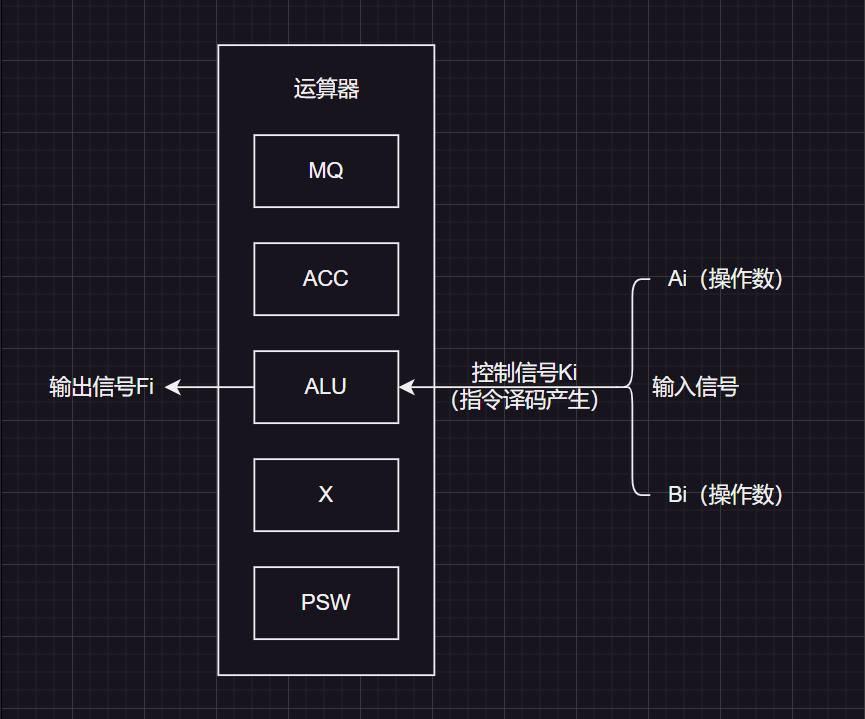
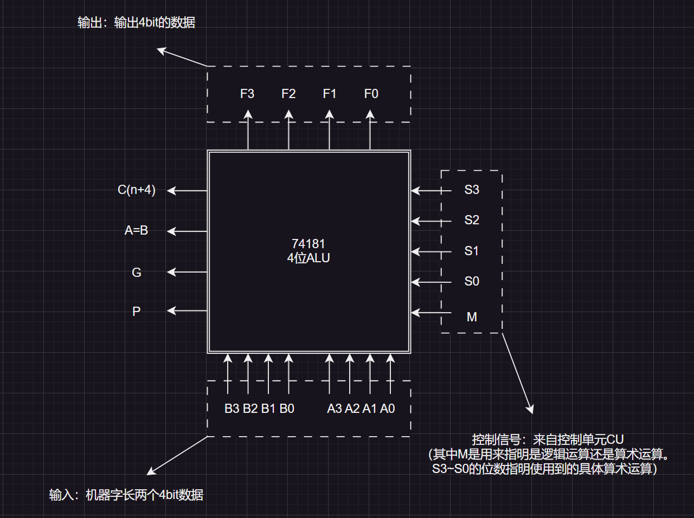
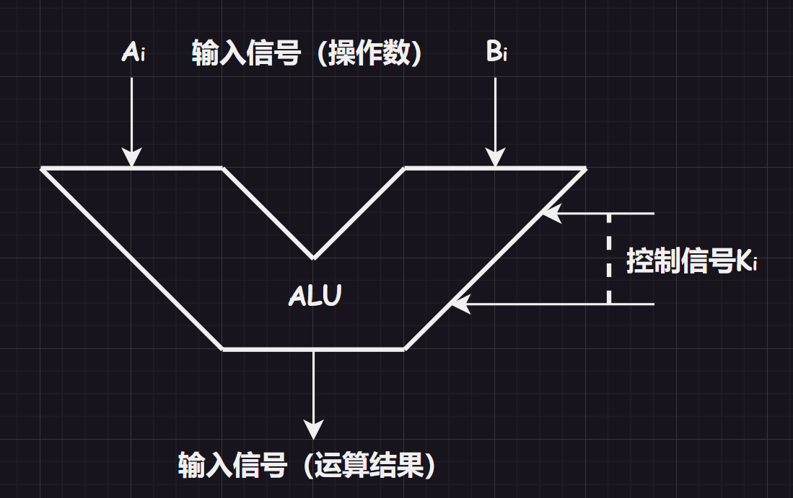
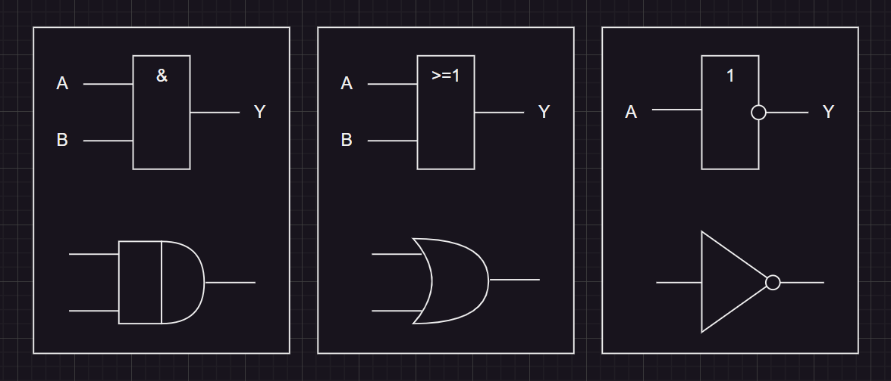
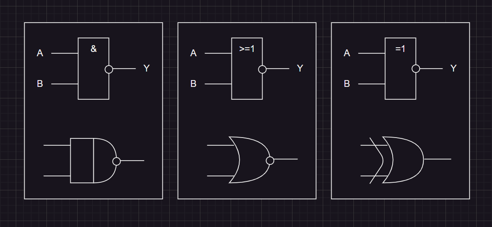
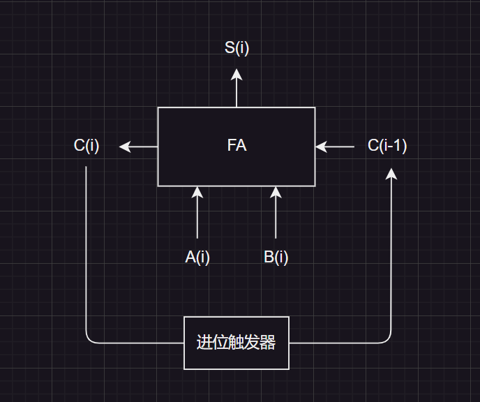
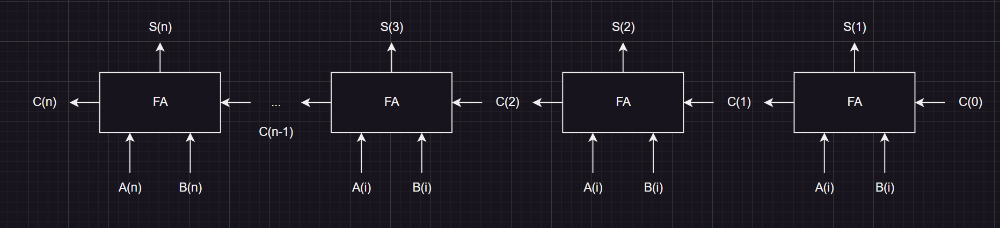
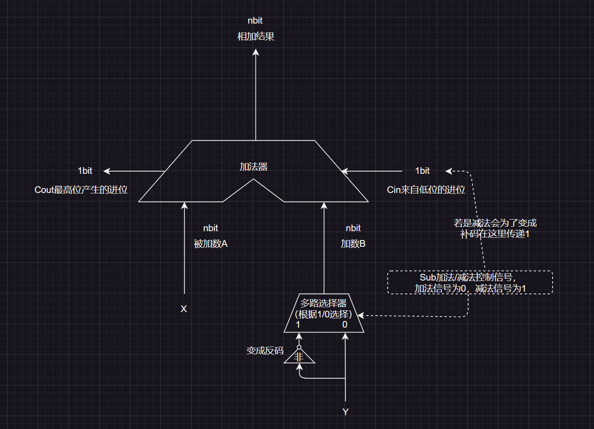

[TOC]

>   我们回顾一下运算器的内容：
>
>   
>
>   运算器是用于实现算术运算和逻辑运算的，内部有：
>
>   1. `ACC`累加器：实际是一个寄存器，用于存放操作数或运算结果
>
>   2. `MQ`乘商寄存器：在乘、除运算的时候，用于存放操作数或运算结果
>
>   3. `X`通用寄存器：通用的操作数寄存器，用于存放操作数
>
>   4. `ALU`算术逻辑单元：通过内部复杂的电路实现算术运算、逻辑运算，是运算器的核心部件，制作成本也是最高的。
>
>   而我们本次主要是讲解算术逻辑单元，基本门电路和加法器的实现原理。

# 1.算术逻辑单元

`ALU`（算术逻辑单元）的内部结构具体如下：

>   补充：其中`M==0`的时候代表算术运算，`m==1`的时候代表逻辑运算。

当然也有简单画图为这样的：

# 2.电路基础知识

`ALU`的内部是一些基础的门电路组成的，因此我们需要学习门电路的知识和表示图。

## 2.1.基本逻辑电路

基本逻辑有：`&&`、`||`、`!`

逻辑运算的实现可以使用门电路表示：

> 补充1：实际`&&`和`||`的关系类似`*`和`/`三个律都满足。
> 
> 补充2：`&&`在逻辑表达式中经常写成`·`，`||`在逻辑表达式中经常写成`+`

## 2.2.复合逻辑电路

符合的逻辑电路还有：`!&&与非`、`!||或非`、`^异或`，这些电路可以使用数学表达式转化成基本逻辑电路进行复合来实现。

>   补充：利用数电的知识，化简逻辑公式，可以化简门电路设计，简化硬件电路的实现。

# 3.加法器的实现

## 3.1.一位加法器

通过基本电路构成的更加复合的电路就可以设计出一位加法器。

如果我们将加法限定在某一个二进制位中，就是：操作位本位`A(i)`和本位`B(i)`以及进位`C(i-1)`的相加，得到`S(i)`。

如果转化位运算就是$S_{i} = A_{i}\,\^{}\,B_{i}\,\^{}\,C_{i-1}$，而得到进位的方法就是$C_{i} = A_{i}·B_{i} + (A_{i}\,\^{}\,B_{i})·C_{i-1}$

实际上前一个表达式很好理解：

1. `A(i)`和`B(i)`和`C(i-1)`里有奇数个`1`就得到`1`，例如`0+1+0=1`、`1+1+1 = 1`、`0+0+1=1`等

2. 后一个表达式的`+`不是加法，而是`||`，因此可以解读为两种情况，一是`A(i)`和`B(i)`都是`1`的情况，二是`A(i)`和`B(i)`中有一个`1`再加上进位的`1`（假设`(A(i)^B(i)`的结果为`0^1=1`或者`1^0=1`，再`&&`进位的`1`就可以得到`1`）

因此一个一位加法器得以实现，就可以进一步实现串行加法器了。

## 3.2.串行加法器

下面就是串行加法器的实现图解：

串行加法器就是循环使用一个一位加法器，虽然达到了对两数相加的结果，但是效率比较底。

## 3.3.并行加法器

并行加法器相比串行加法器效率要高一些。

上面这是一种串行的并行加法器，可以把`n`个串行加法串接起来，这种`串行进位`又叫做`行波进位`，每一位进位直接依赖前一级的进位，即：进位信号是逐级形成。

## 3.4.并行加法器优化

根据$S_i = A_i\,\^{}\,B_i\,\^{}\,C_{i-1}$，我们知道就是因为$C_{i-1}$无法确定，需要根据前一级来计算。

而$C_{i-1}$又是根据$C_{i-1} = A_{i-1}·B_{i-1} + (A_{i-1}\,\^{}\,B_{i-1})·C_{i-2}$计算的，因此可以得到：

1. $C_{i-1} = A_{i-1}·B_{i-1} + (A_{i-1}\,\^{}\,B_{i-1})·C_{i-2}$

2. $C_{i-1} = A_{i-1}·B_{i-1} + (A_{i-1}\,\^{}\,B_{i-1})·(A_{i-2}·B_{i-2} + (A_{i-2}\,\^{}\,B_{i-2})·C_{i-3})$

3. ...

一直展开到底就一定可以展开到$C_{0}$，而$C_{0}$又是直接给出的一个常数。

结论：第`i-1`位向跟高位的进位$C_{i-1}$看根据被加数、加数的第`1~i-1`位，再结合$C_{0}$即可确定。

因此假设$G_{i-1}=A_{i-1}·B_{i-1}$和$P_{i-1}=A_{i-1}\,\^{}\,B_{i-1}$，因此$C_{1} = A_{1}·B_{1} + (A_{1}\,\^{}\,B_{1})·C_{0}$化简为$C_{1} = G_{1} + P_{1}·C_{0}$

1. $C_{1}=G_{1} + P_{1}·C_{0}$

2. $C_{2}=G_{2} + P_{2}·G_{1} + P_{2}·P_{1}·C_{0}$

3. $C_{3} = G_{3} + P_{3}·G_{2} + P_{3}·P_{2}·G_{1}+P_{3}·P_{2}·P_{1}·C_{0}$

4. ...

观察规律我们可以看出规律为$C_{n}=G_{n}+P_{n}·G_{n-1}+P_{n}·P_{n-1}·G_{n-2}+...+P_{n}·...·P_{1}·C_{0}$，其中每一个`G`和`P`都可以根据两个二进制位快速计算出来，而$C_{0}$又是常数，这就意味着无论`n`是多少$C_{n}$都可以立马被算出，不需要依赖前一级的计算。则在$S_i = A_i\,\^{}\,B_i\,\^{}\,C_{i-1}$中，就可以立刻算出$S_{i}$的值。

这种`并行进位（又被称为先行进位、同时进位）`的并行加法器，各级的信号可同时生成。

但是这种方式$C_{n}$过大时，逻辑式子就越大，电路设计也就越复杂，因此我们为了减低电路的复杂性，可以设计固定几位做并行进位，而不是全部位数都使用并行进位。

## 3.5.补码加法器

首先要知道补码的加减运算，对于`nbit`的补码$X$、$Y$：

1. $X+Y$，直接相加即可

2. $X-Y$，取得$Y$的补码$[Y]_{补}$，减法变加法

3. 如果计算结果超出`nbit`就会发生溢出进而舍弃

> 补充1：对于`4bit`的补码$[X]_{补}=1000,[Y]_{补}=0111$，所以$X+Y=1111,X-Y=1000+(1000+1)=10001$，由于只能存储`4bit`故最后只剩下`0001`。
> 
> 补充2：$[A+B]_{补}=[A]_{补}+[B]_{补}$

> 注意：我们这里学习的是补码的加减法，而不是真值的加减法，要注意区分。

上述就是补码加法器，两个操作数都是补码，因此上述加法器针对的是`补码X+补码Y`或者`补码X-补码Y`两种。

例如：`4bit`情况下，对于补码`-8=11000`和`7=0111`，对应的二进制就是`1000`和`0111`如果是补码加补码就直接相加，如果是补码减补码就会将`Y`做特殊处理，将`Y`按位取反（符号位也参与），末尾`+1`得到`[-Y]补`，将减法变成加法。

1. $X+Y=1111$

2. $X-Y=1000+(1000+1)=10001$，但是需要舍弃一位，因此结果为`0001`

但是“补码的加减运算”和“无符号整数的加减运算”，从逻辑上来看是等效的，因此计算“无符号整数加减”和计算“补码加减”可以共用上面的电路。

例如：`4bit`情况下，对于无符号整数`8`和`7`，对于补码分别为`1000`和`0111`

1. $X+Y=1111$

2. $X-Y=1000+(1000+1)=10001$，但是需要舍弃一位，因此结果为`0001`

但是需要注意的是，对于最后的结果，补码和无符号整数的看待视角不一样。

> 总结：
> 
> 1. 无符号整数`X`、`Y`的加减运算，`X+Y`直接相加，`X-Y`则将`Y`转为补码后，减法变为加法（补码计算也是类似）
> 
> 2. 有符号整数`X`、`Y`的加减运算，将`X`转为补码，`符号Y`转化为补码，然后相加

# 4.加减运算和溢出判断

在使用加法器，很容易发现溢出的问题。

由于补码的运算最终都是加法，因此就看加法溢出就可以，而只有`正数+正数`和`负数+负数`才会有可能溢出。

## 4.1.一位符号判断

$V=A_{s}×B_{s}×S_{s}+A_{s}×B_{s}×S_{s}$
