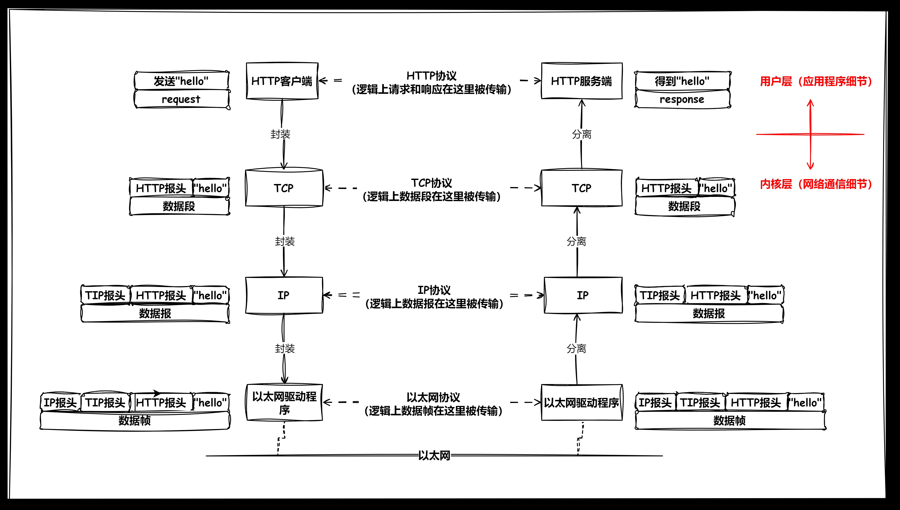
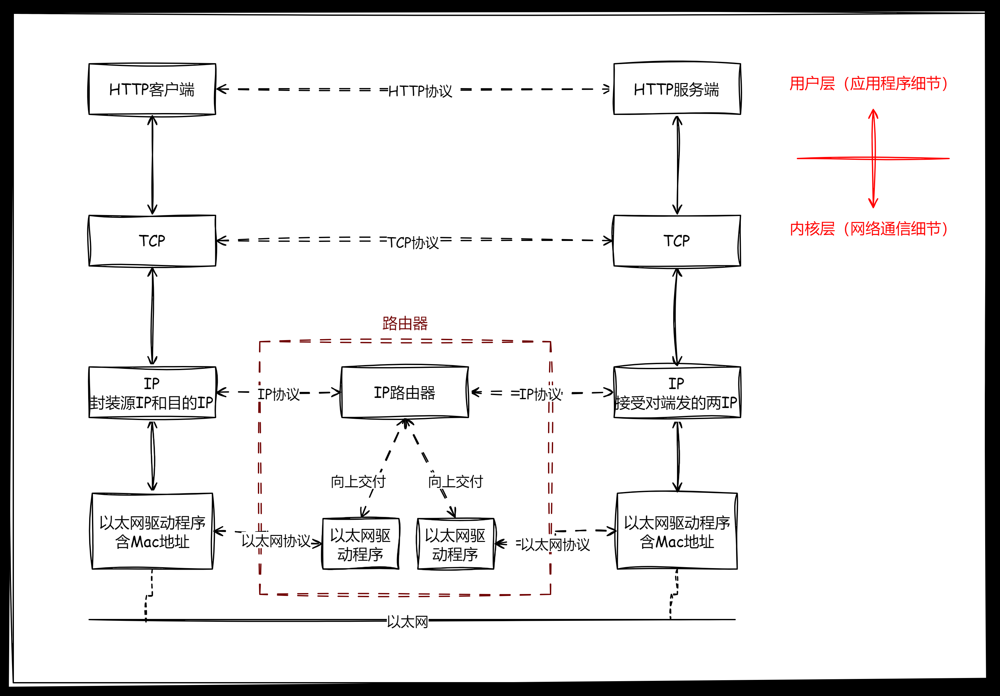

>   前言：最好在牢固前面几大件（编程语言、数据结构、操作系统），并且您有一个服务器的基础上（我使用的是腾讯云中配置最低的服务器）再来学习本系列的网络知识。

# 1.网络发展简要

下面就是简单提及一些概念而已，简单看看即可：

1.  **网络的层级结构**：网络可以分为局域网、城域网和广域网，根据规模不同而定（这是相对概念）。随着时间的推移，网络从小范围的局域网发展成连接城市和城市的城域网，最终形成全球性的广域网，使得互联网成为全球性的现象。

2.  **网络的基础设施建设**：

3.  **网络中的不同角色**：

    (1)**通信企业**: 如华为在生产各种通信设备上起着关键作用。

    (2)**运营商**:（如中国移动、中国联通、中国电信）在网络基础设施的建设中发挥关键作用，包括架设基站、路由器、交换机等硬件设备，这些设施的建设和维护为互联网的发展提供了基础。通信基础设施的建设成本高，赚取回报周期长，相对于互联网公司提供的服务来说，投入产出比较低，因此大型企业通常不愿意涉足这个领域。运营商通过用户支付的电话费、流量费等方式获得收入，但在一些情况下可能存在费用较高、服务贵的问题。

    (3)**互联网公司**：更愿意提供软件服务（如社交、购物、直播等服务），追求更短的投资回报周期来赚取收入，而不愿意进行基础设施建设。

# 2.网络协议简要

## 2.1.协议概念

-   **生活中的协议**：是约定俗成，如同购房、购车或进入企业签订劳动合同一样，它是双方达成一致的一种约定。
-   **软件中的协议**：也是一种约定，是为了在网络通信中，让远距离的计算机能够更快速地按照规则来进行通信。

当网络通信距离变得很长时，数据的传输需要有类别和约定，以便双方能够快速理解和正确处理种类不同的数据。

计算机之间的传输媒介是光信号和电信号。通过“频率”和“强弱”来表示 `0` 和 `1` 这样的信息。要想传递各种不同种类的信息, 就需要约定好双方的数据格式（在软硬件上都要约定）。软件上的协议一旦统一起来，就会变成通信行业的行业标准。而在 `Linux` 内核中，进行协议管理说白了就是使用结构体，也就是先描述再组织。

## 2.2.协议分层

协议可以简单理解为一种软件，而软件可以分层，而分层实际上就是一种封装，因此协议在设计的时候也会被分层封装起来，通常软件需要分层的原因如下：

1.   **模块化**：将系统分解成多个层次后可以视为多个独立的模块，每个模块负责特定的功能，有利于代码模块化，使每个模块都可以被单独开发、测试、维护，降低了系统的复杂性，提高了可维护性（也好分工、功能逻辑勤洗）。
2.   **可扩展**：分层解耦使得系统的各个层次之间的依赖性降低，当需要对系统进行扩展或修改时，可以更容易地定位和修改特定层次的代码，而不会对其他层次造成影响，这样做有利于系统的灵活性和可扩展性，使得系统更容易适应未来的需求变化（随时可以替换某一层）。
3.   **可复用**：每个层次都可以被视为一个独立的模块，具有清晰的接口和功能。这样做有利于提高代码的可重用性，使得同一层次的功能可以被多个模块共享和复用，减少了重复开发的工作量（无需反复制作轮子）。

通信的复杂程度一般和距离成正相关，那这些复杂的问题体现为什么呢？通信范畴上不同分层需要解决的问题简单可以归纳如下：

| 层级                               | 对应问题                         |
| ---------------------------------- | -------------------------------- |
| **应用层**：数据处理问题           | 数据如何进行进一步的处理？       |
| **传输层**：数据丢包问题           | 数据丢失怎么办？数据什么时候发送 |
| **网络层**：主机定位问题           | 如何定位到一个主机？             |
| **数据链路层**：下一跳主机传递问题 | 如果保证数据交付给下一个主机？   |
| **物理层**：硬件实现问题           | 在硬件上如何实现网络通信？       |

>   注意：由于我偏向软件方向，所以重点介绍协议中软件的部分（也就是上四层中的应用层、传输层、网络层、数据链路层）...

`Linux` 对传输层和网络层的支持就体现在对用户暴露的接口上，网络编程在本质上也是一种系统编程（因为有对应的系统调用），也就是说，学习网络就必须要先把操作系统学好。

每一层协议分层都可以填入不同的具体协议，例如应用层可以选择使用 `http` 协议，也可以选择使用 `https`。

因此，网络分层实际上是解决网络传输问题的一套解决方案。

接下来我们来详细归纳一下两个常见的网络协议栈概念，`OSI` 七层模型和 `TCP/IP` 五层模型。

### 2.2.1.OSI 七层模型

`OSI` 实际是一个参考标准，而我们上面提及的五层模型就是 `TCP/IP` 模型，是 `OSI` 的具体实现。

从官方标准来说，`OSI`（`Open Systems Interconnection`）是由国际标准化组织（`ISO`）制定的参考模型，用于描述计算机网络中不同层次之间的通信协议。该模型将网络通信划分为七个层次，每个层次负责不同的功能，从而实现了网络协议的分层设计，使得不同层次的协议能够独立开发和演化，以下是 `OSI` 模型的七个层级：

| **层级**                          | **功能**                                                     |
| --------------------------------- | ------------------------------------------------------------ |
| **应用层（Application Layer）**   | 提供网络服务和应用程序的接口，包括网络管理、文件传输、电子邮件等，提供用户与网络之间的交互。 |
| **表示层（Presentation Layer）**  | 处理数据的格式，确保不同系统的数据能够正确解释。负责数据的加密、压缩和格式转换。 |
| **会话层（Session Layer）**       | 管理会话控制，建立、维护和终止通信会话，提供数据同步和恢复。 |
| **传输层（Transport Layer）**     | 提供端到端的通信服务，确保可靠的数据传输。主要协议有 `TCP`（`Transmission Control Protocol`）和 `UDP`（`User Datagram Protocol`）。 |
| **网络层（Network Layer）**       | 负责在不同的网络中传输数据，进行路径选择和逻辑寻址。主要协议有 `IP`（`Internet Protocol`）。 |
| **数据链路层（Data Link Layer）** | 提供点对点的数据传输，将比特流组织成帧，进行差错检测和纠正，以及进行流量控制。 |
| **物理层（Physical Layer）**      | 负责传输比特流，定义硬件设备和传输媒体的规范，如电缆、光纤、电压等。 |

每个层次都定义了一组规范和协议，层次之间通过明确定义的接口进行通信。上面定义的层级包含了我们之前讨论的五个层，并且更加细化，理论上所有的网络编程都需要包含上述层级，但是在实践种被浓缩成了只有五层的 `TCP/IP` 模型。但在实践中，无处不体现 `OSI` 的七层结构（例如 `TCP/IP` 五层模型中，表示层和会话层可以统一在应用层中实现）...

`OSI` 七层结构将 **服务、接口、协议** 这三个概念明确区分开来。

### 2.2.2.TCP/IP 五层模型

我们来重新提及一下 `TCP/IP` 五层模型，让其概念更加清晰（之前提到的 [2.2.协议分层](##2.2.协议分层) 就简单提及了一下），`TCP/IP` 以两个具体协议（`TCP` 协议和 `IP` 协议）来命名，其主要原因是因为 `TCP/IP` 模型是 `OSI` 的一种实例化，在传输层和网络层分别采用了 `TCP` 协议和 `IP` 协议。这个名字可以概括该模型中最为核心的部分，其五层的作用如下：

| 层级                            | 功能                                                         | 目标                                                         |
| ------------------------------- | ------------------------------------------------------------ | ------------------------------------------------------------ |
| **应用层（Application Layer）** | 提供网络服务和应用程序的接口，包括网络管理、文件传输、电子邮件等。是通信的最高层，直接与用户应用程序和网络通信服务接口。 | 数据如何进行进一步的处理？需要拿数据实现什么业务需求？       |
| **传输层（Transport Layer）**   | 提供端到端的通信服务，确保可靠的数据传输。主要协议有 `TCP`（`Transmission Control Protocol`）和 `UDP`（`User Datagram Protocol`）。 | 提供端到端的通信服务，确保一定程度上可靠的数据传输，并且解决核心三个问题：要发多少数据？什么时候发数据？数据丢失了怎么办？ |
| **网络层（Network Layer）**     | 负责在不同的网络中传输数据，进行路径选择和逻辑寻址。提供 `IP`（`Internet Protocol`）协议，用于在网络中唯一标识设备并进行数据包的路由。 | 如何确定数据包从源主机到目标主机的路径，并确保数据包有按照正确的顺序到达目标的能力？（但不一定做得到，只是有这个能力）如何定位到一个主机？如何解决下一跳的问题？ |
| **链路层（Data Link Layer）**   | 提供点对点的数据传输，将比特流组织成帧，并进行差错检测和纠正。定义了数据包的格式，以及在共享介质上的访问控制。 |                                                              |
| **物理层（Physical Layer）**    | 定义了硬件设备和传输媒体的规范，负责传输比特流，包括电缆、光纤、无线电等。 |                                                              |

我们之后主要研究 `TCP/IP` 模型，重点聚焦在应用层、传输层、网络层、数据链路层。

>   补充：下述结论只是大概，不算严谨，因此不是绝对的
>
>   -   对于一主机，其操作系统内核实现了传输层到物理层的内容
>   -   对于路由器，实现了网络层到物理层的内容
>   -   对于交换机，实现了从数据链路层到物理层的内容
>   -   对于集线器，只实现了物理层的内容

>   补充：为什么不直接采用 `OSI` 的设计方案而使用删减版的 `TCP/IP` 呢？实际上这是在工程实践中总结出来的经验，在实践中如果要在操作系统中实现会话层和表示层是有难度的，并且 `TCP/IP` 的应用层在实际使用中也会从侧面体现这两层（只有您编写过完整的 `Web` 服务端程序才能明白）。

## 2.3.协议实例

每一层（相对于 `OSI` 七层模型来说）都有对应的可以替换的一系列的具体协议（您可以理解为协议分层中每一次的实例化），您可以简单看看：

1.   **常见的应用层协议（Application Layer）**
     -   **HTTP（Hypertext Transfer Protocol，超文本传输协议）**：用于在 `Web` 浏览器和 `Web` 服务器间传输超文本数据，支持网页浏览和交互。
     -   **HTTPS（Hypertext Transfer Protocol Secure，安全超文本传输协议）**：是 `HTTP` 的安全版本，通过使用 `SSL/TLS` 加密协议来保护数据的传输安全。
     -   **FTP（File Transfer Protocol，文件传输协议）**：用于在客户端和服务器之间传输文件，支持上传、下载、删除和重命名文件等操作。
     -   **SMTP（Simple Mail Transfer Protocol，简单邮件传输协议）**：用于在邮件服务器之间传输电子邮件，支持发送电子邮件。
     -   **POP3（Post Office Protocol version 3，邮局协议版本 3）**：用于从邮件服务器下载电子邮件，支持从邮件服务器中获取存储的电子邮件。
     -   **IMAP（Internet Message Access Protocol，互联网消息访问协议）**：也用于从邮件服务器下载电子邮件，支持在邮件服务器上管理电子邮件，并支持在多个设备之间同步电子邮件。
     -   **DNS（Domain Name System，域名系统）**：用于将域名解析为 `IP` 地址，支持通过域名访问网站。
     -   **SSH（Secure Shell，安全外壳协议）**：用于在网络上安全地进行远程访问和文件传输，提供了加密的通信通道。
     -   **SNMP（Simple Network Management Protocol，简单网络管理协议）**：用于在网络设备之间进行监控和管理，支持设备状态的查询和配置。
     -   **NTP（Network Time Protocol，网络时间协议）**：用于在计算机和网络设备之间同步时间，确保它们之间的时钟保持同步。
2.   **常见的会话层（Session Layer）**
     -   **NFS（Network File System）**：用于在网络上共享文件系统的协议。
     -   **NetBIOS（Network Basic Input/Output System）**：在计算机网络中提供通信服务的软件接口。
     -   **RPC（Remote Procedure Call）**：用于在远程计算机之间调用过程的协议。
     -   **SMB（Server Message Block）**：在计算机网络中共享文件、打印机和其他资源的协议。
3.	 **常见的表示层（Presentation Layer）**
     *   **ASCII（American Standard Code for Information Interchange）**：用于字符编码的标准。
     *   **JPEG（Joint Photographic Experts Group）**：用于压缩图像的标准。
     *   **GIF（Graphics Interchange Format）**：用于图像压缩的格式。
     *   **TLS（Transport Layer Security）**：用于保护网络通信安全的协议。
     *   **ASCII（American Standard Code for Information Interchange）**：用于字符编码的标准。
4.   **常见的传输层协议（Transport Layer）**
     -   **TCP（Transmission Control Protocol）**：`TCP` 提供了可靠的、面向连接的数据传输服务。它使用三次握手建立连接，并提供流量控制、拥塞控制和数据重传等机制，确保数据的可靠传输。适用于那些对数据传输的可靠性要求较高的应用场景，如网页浏览、文件传输、电子邮件等。
     -   **UDP（User Datagram Protocol）**：`UDP` 是一种无连接的、不可靠的传输协议。它不提供连接建立和数据传输的可靠性保证，但是具有较低的延迟和开销。适用于那些对数据传输的实时性要求较高、且可以容忍丢失数据的应用场景，如音频、视频流、在线游戏等。
5.   **常见的网络层协议（Network Layer）**
     -   **IP（Internet Protocol，互联网协议）**：`IP` 协议是网络层的核心协议，负责在网络中进行数据包的路由和转发。它定义了数据包的格式和传输规则，确保数据可以在不同的网络之间传输。
     -   **ICMP（Internet Control Message Protocol，互联网控制消息协议）**：`ICMP` 用于在 `IP` 网络中传输控制消息。它可以用于检测网络的可达性、测量网络延迟、诊断网络问题等。
     -   **ARP（Address Resolution Protocol，地址解析协议）**：`ARP` 用于将 `IP` 地址解析为 `MAC` 地址。当计算机要发送数据包到目标主机时，它需要知道目标主机的 MAC 地址，ARP 就负责将 IP 地址映射到对应的 MAC 地址。
     -   **RARP（Reverse Address Resolution Protocol，逆地址解析协议）**：`RARP` 与 `ARP` 相反，它用于将 `MAC` 地址解析为 `IP` 地址。当主机启动时，如果它只知道自己的 `MAC` 地址，但不知道自己的 `IP` 地址，就可以使用 `RARP` 来获取 `IP` 地址。
     -   **IPsec（Internet Protocol Security，互联网协议安全）**：`IPsec` 是一组协议，用于在 `IP` 网络上提供安全性服务，包括数据加密、数据完整性验证、身份验证等。
     -   **IPv6（Internet Protocol version 6，互联网协议第 6 版）**：`IPv6` 是 `IP` 协议的下一代版本，它提供了更多的地址空间和其他改进，以满足日益增长的互联网连接需求。
6.   **常见的数据链路层协议（Data Link Layer）**
     -   以太网（`Ethernet`）
     -   无线局域网协议（`Wi-Fi`，如 `IEEE 802.11`）
     -   广域网（`WAN`）协议（如 `HDLC、PPP`）
     -   令牌环（`Token Ring`）
     -   帧中继（`Frame Relay`）
     -   `ATM`（`Asynchronous Transfer Mode`）
7.   **常见的物理层协议（Physical Layer）：**
     -   `IEEE 802.3`（以太网物理层标准）
     -   `IEEE 802.11`（`Wi-Fi` 物理层标准）
     -   蓝牙（`Bluetooth`）
     -   `USB`（通用串行总线）
     -   电话调制解调器协议（`Modem Protocols`）
     -   光纤通信协议（如 `SONET、SDH`）
     -   `DSL`（数字用户线）

>   注意：上述话语对于初学者就是一通废话（指根本听不懂），我只是想让您简单了解一下网络最重要的学习要点之一就是关于协议的知识，同时也是在暗示您，后续的文章我们讨论的协议到底处于哪一个知识模块中，努力往下看就行。

# 3.网络传输简要

有了上述基本概念的理解后，这里我就简要提及一下网络传输中发生的 **封装** 和 **交付** 的过程，整个过程主要聚焦到四层（应用层、传输层、网络层、链路层）上。

-   报文如何和有效载荷一起封装？又如何进行分离（也就是封装分离）？
-   决定有效载荷交付给上层的哪一种协议（也就是数据分用）？

上面这两个问题就是所有协议都必须解决的公共问题。

## 3.1.封装分离



上图专指 `Linux` 内的网络协议实现（忽略了很多细节），其中传输层、网络层在操作系统内核中实现，遵循 `TCP/IP` 五层协议。

-   逻辑上每一层可以直接进行互相通信（这个直接只是逻辑上的直接）
-   物理上必须向下添加报头-> 向左传递-> 再向上去掉报头，达到通信目的（整个过程种，向下添加报头，向上去除报头）

每层都需要有自己的协议定制方案，选定具体的协议后，数据报文都需要有自己的协议报头，从上到下交付数据要添加报头，从下到上递交数据要去掉报头。

### 3.1.1.从生活来理解报文封装分离

快递的包装和贴上信息单可以很好来理解协议报头。

1.   在计算机网络中，数据的传输需要使用一定的协议来规定数据的格式和传输方式。协议报头就像是包裹的外包装和订单信息，包含了一些元信息（需要在包裹上贴上收寄方的地址、电话等信息的快递单等），告诉接收方如何正确地处理数据。类似地，协议报头包含了一些元信息，例如源地址、目标地址、数据类型等，以便接收方能够正确地处理数据，这些信息是给下一层看的。
2.   而接收方除了接受自己想要的数据，也会检验和拆解去掉报头（相当于我们只要一个商品，但是对方给我们不仅仅是商品，还给了贴了快递单的包裹，我们需要检验这份快递单确认快递是否是自己得，然后再去除这个带有快递单的包裹）。
3.   如果无法正确识别协议报头，通信双方就无法达成共识。
4.   而报头包裹的的数据信息就是有效载荷（也就是贴了快递单包裹内的货物），每一层都把报头和有效载荷进行分离，识别报头正确后，就将有效载荷交个上一层（也就是解包的过程）。

==在网络这块，封装的过程就是添加报头，解包的过程就是去掉报头。==

<span style="color:#FF0000;">之后，我会把报头称为“报头”，包裹的有效数据称为“有效载荷”，“报头+有效载荷”称为“报文/某某协议报文/数据包”。</span>另外，对于不同层来说，协议报文也有可能不同的叫法，应用层称为请求响应、传输层称为数据段、网络层称为数据报、链路层称为数据帧。

### 3.2.1.从代码理解报文封装和分离

而实际上添加报头的过程可以使用 `C` 语言来理解。

```cpp
//本端报头封装
typedef struct Header
{
    int _header_data_1;
    int _header_data_2;
    int _header_data_3;
    //...
} a_header {/* ... */};

typedef struct Data
{
    int _data_1;
    int _data_2;
    int _data_3;
    //...
} a_data {/* ... */};

typedef struct Datagram
{
    Header _header;
    Data _data;
} a_datagram { a_header, a_data };
```

上述过程就是报头封装的过程，而报头分离用代码也同样好理解。

```cpp
//对端报头分离
Header a_header = a_datagram._header;
Data a_data = a_datagram._data;
```

## 3.2.数据分用

接受端报文向上分离/交付时，会根据不同层中分离出来的报头，决定对本层报文的有效载荷做对应的处理，这点之后在我详细拆分各种协议的时候您再回来这里就可以充分体会到。

# 4.网络地址简要

## 4.1.简单理解通信原理

局域网通信中，一台主机的信息被发送给所有主机（广播），所有主机只有接受到了，才能用该数据和标识自己的唯一标识进行对比，确定该数据是否交给自己，若是则接受，若否则丢弃。而这个过程，在逻辑上看起来就是一对一的通信。

而如果多台主机一起投放数据进入网线，就会容易发送数据混乱/碰撞，规定好数据的先后投放顺序（错峰）就可以避免这个问题。

另外，由于物联网具有信息碰撞的天然属性，也会把局域网称为“碰撞域”，而这种基于碰撞概率的局域网也被称为以太网。

>   补充：因此对于极其简单的局域网，最简单的破坏方法就是在这个局域网中发送各种垃圾数据，导致错峰的时机加长，影响各主机之间的通信（实际操作中可能需要绕过以太网驱动，因为以太协议在信息碰撞的时候会调用碰撞算法避免碰撞，如果绕过该层就不会触发该机制）。这种原理较为简单的网络攻击也被叫做“拥塞攻击”。

## 4.2.MAC 地址的形式和作用

而标识一台主机的唯一标识符就是 `MAC` 地址，一般由 `48bit` 构成，使用十六进制读取，写入在电脑网卡中，一般是一个网卡一个 `MAC` 地址，但是并不排除有虚拟策略能虚拟出多个网卡和对应的虚拟 `MAC` 地址。

我们可以用指令 `ifconfig` 显示网络接口信息，可以查看和配置系统上的网络接口、`IP` 地址、子网掩码、广播地址等信息。

```shell
# 查看网卡信息(不同操作系统可能不一样)
$ ifconfig
eth0:   inet 内网ip地址  netmask 子网掩码
        ether MAC地址
```

>   补充：`Ether` 一词的源自可以追溯到古代希腊的概念。在古代希腊哲学中，人们认为存在五种基本元素，它们被称为 "五大元素"，包括地、水、火、空气和以太（`ether`）。
>
>   而以太（`ether`）曾被认为是一种超越物质世界的第五种元素，是宇宙中的一种特殊、纯净的物质。它被认为是上层天空中的物质，与地球上的物质是分开的。这个概念在古代哲学和科学中有所存在，曾被认为是光和光之间的传播介质，就像空气是声音的传播介质一样，尽管在现代科学中并没有证明以太真的存在。
>
>   而计算机网络资料的上下文中，`Ether` 一词被引入以表示以太网。以太网是一种局域网技术，它使用了一种称为 `Ethernet` 的协议，因此 `Ether` 在计算机网络术语中被用来指代以太网，它连接了计算机和设备，使它们能够在局域网中进行通信。

## 4.3.IP 地址的形式和作用

`IP` 地址（`Internet Protocol Address`）和 `MAC` 地址（`Media Access Control Address`）是网络中两个不同的地址标识符，用于识别和定位网络中的设备。`IP` 地址和 `MAC` 地址在网络通信中扮演不同的角色，有以下主要区别：

1. **作用范围**：
    - **IP 地址**：用于在网络层标识设备的位置。`IP` 地址是逻辑地址，它允许设备在网络中进行通信，以便数据能够正确地从一个设备传递到另一个设备，跨越不同的网络。
    - **MAC 地址**：用于在数据链路层标识设备的物理位置。`MAC` 地址是一个全球唯一的硬件地址，与网络接口卡（`NIC`）相关联。它用于在局域网内部直接识别和定位设备。

2. **适用层级**：
    - **IP 地址**：在 `OSI`（`Open Systems Interconnection`）模型中属于网络层（第三层）。它是用于在不同的网络中进行通信的网络层地址。
    - **MAC 地址**：在 `OSI` 模型中属于数据链路层（第二层）。它是用于在局域网内直接通信的数据链路层地址。

3. **地址唯一性**：
    - **IP 地址**：在互联网上是全球唯一的，但它们可以在不同的子网中重复。
    - **MAC 地址**：在全球范围内是唯一的，每个网络设备的 `NIC` 都有一个唯一的 `MAC` 地址。

4. **书写格式**：
    - **IP 地址**：通常以点分十进制（`IPv4`）或冒号分隔的十六进制（`IPv6`）表示。
    - **MAC 地址**：通常以冒号分隔的十六进制对表示，例如：`00: 1A: 2B: 3C: 4D: 5E`。

5. **动态/静态分配：**
    - **IP 地址**：可以通过动态主机配置协议（`DHCP`）自动分配，也可以手动配置为静态 `IP` 地址。
    - **MAC 地址**：通常是由硬件制造商预先分配的，不容易更改，`MAC` 地址的修改通常需要专门的工具和技术。

假设我们从 `A` 地址到 `B` 地址，中途会问路人方向，路人会告诉我们中途需要走的每个地址（现在在哪个地址，下一站应该走哪个地址接近 `B` 地址），此时可以类比为：

-   源地址 `A` 就是 `源IP`
-   目标地址 `B` 就是 `目的IP`
-   中途经过的源地址是 `MAC` 地址
-   下一站地址也是 `MAC` 地址

>   类比：这个过程就像西游记种，唐僧等人从大唐到西天，途中有很多询问下一站该如何走的情节。

可以看到 `源/目的IP` 地址在传输过程中基本不变，但是 `MAC` 地址时常变化。

>   注意：如果您实在理解不了这两种地址的区别，就可以先简单理解为一句话就行：`源/目的IP` 规定起点和目标，但是在实际传输中，需要依靠 `MAC` 地址来一步一步到达。在后续详细讲解 `TCP/IP` 协议时再慢慢理解。

>   注意：如果没有特殊说明，本系列文章提到的 `IP` 地址默认指 `IPv4`，而不是 `IPv6`。

## 4.4.MAC 和 IP 协作工作



数据交付后的时候，经过网络层后会增添报头 `源IP` 和 `目的IP`（标识该报文从哪来到哪去），而有效载荷填写需要传递的数据和之前封装的报头，经过链路层的以太驱动后又添加了报头 `MAC1`，然后将最终结果交付给路由器。

路由器向上对报文分离经过判断，知道了该数据的的来源和去向后（需要前往的 `MAC` 地址），又向下传递添加了报头 `MAC2`（代表传给对应 `MAC` 地址对应的主机），传给其他主机后继续向上去掉报头进行处理。

因此在 `TCP/IP` 协议的网络中，`IP` 及其向上的协议看到的报文都是一样的。路由器就是在不同网络中作适配的角色，这种一跳一跳的现象其实也就是网络通信的原理。

上述模型比之前我提到的更加细化，但仍然还有很多细节没提到，我们之后的目的就是细化这个流。

