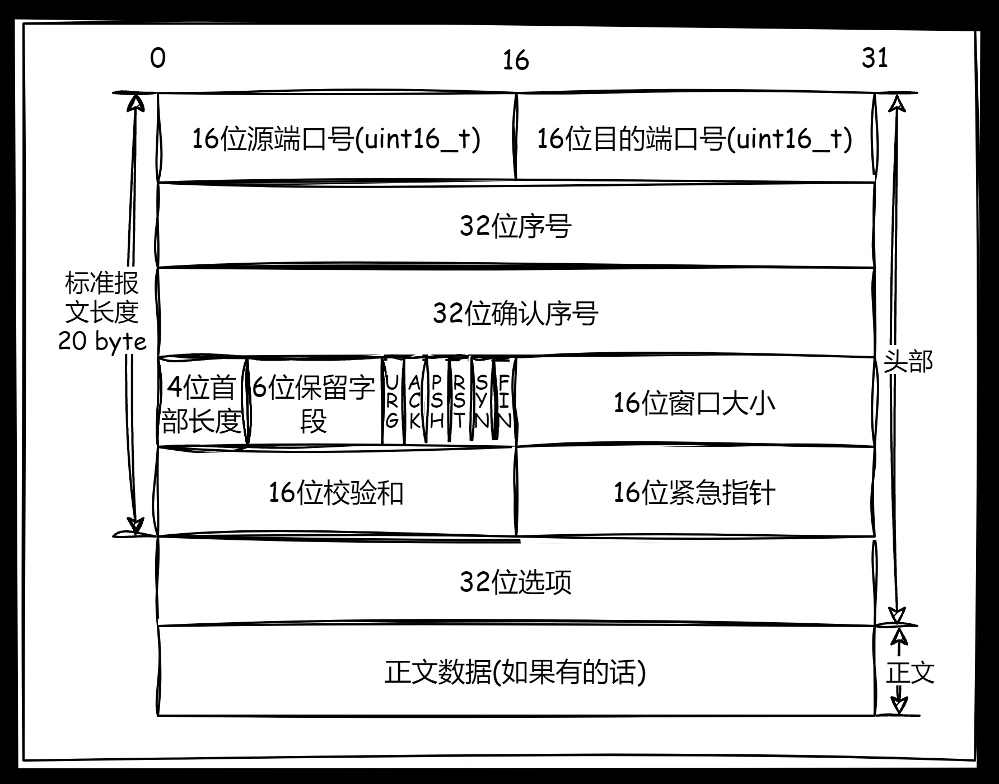
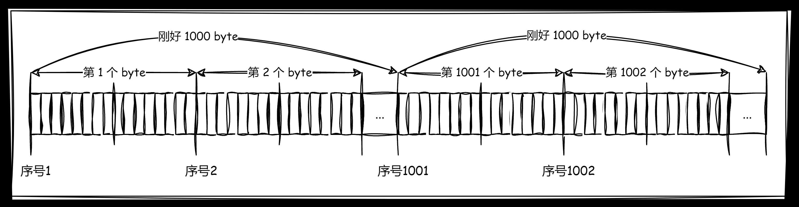
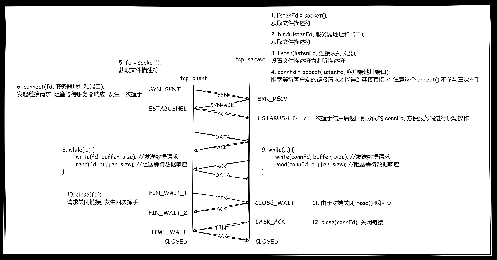
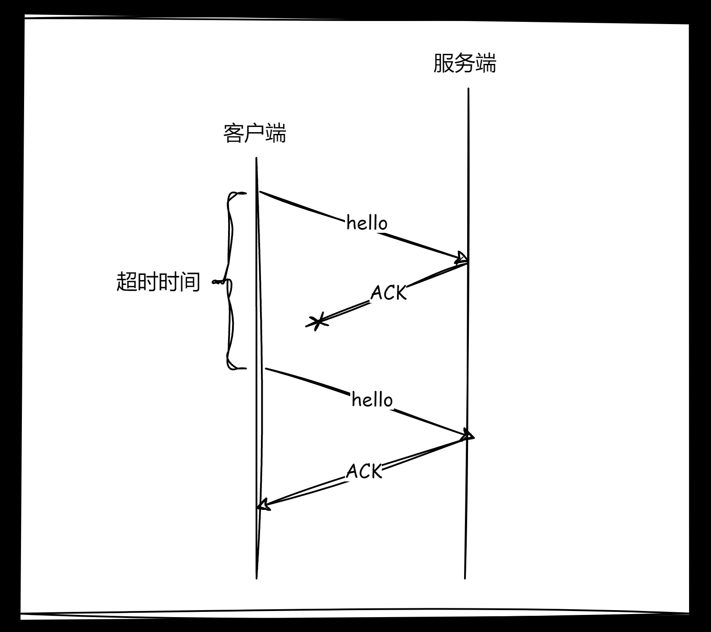
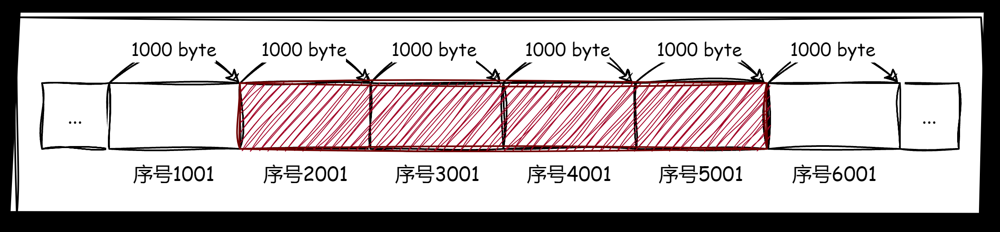
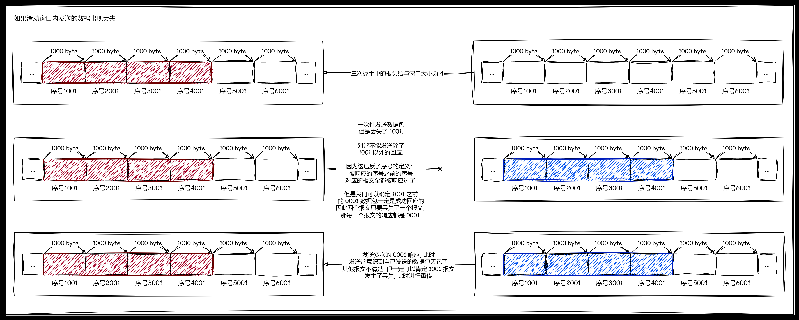
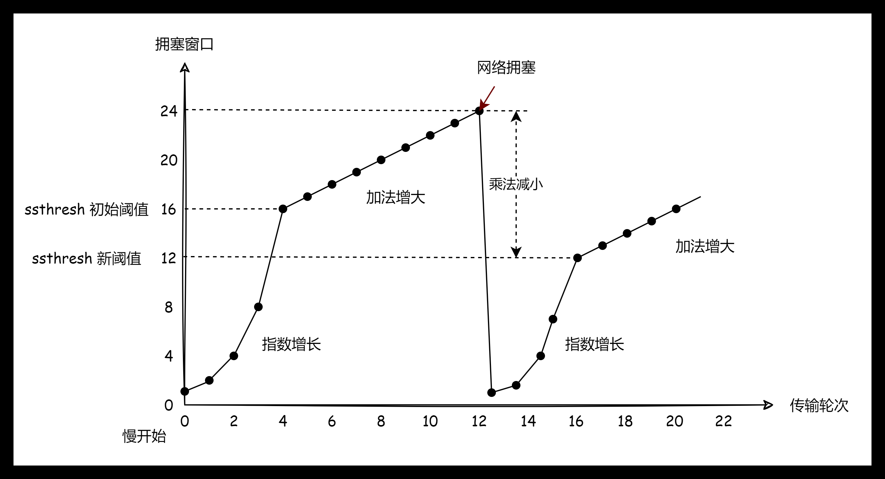
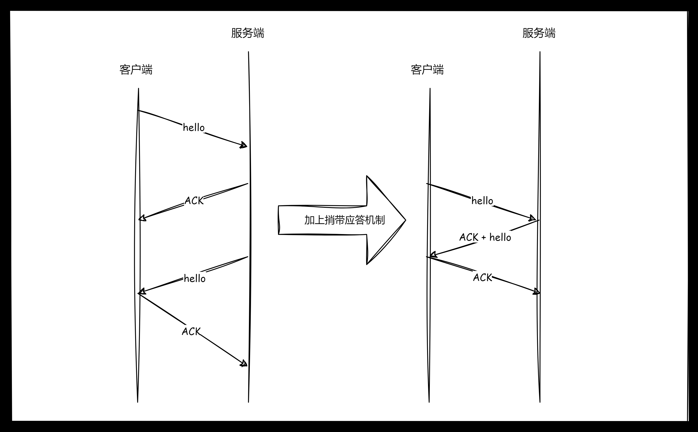

**叠甲：以下文章主要是依靠我的实际编码学习中总结出来的经验之谈，求逻辑自洽，不能百分百保证正确，有错误、未定义、不合适的内容请尽情指出！**

[TOC]

>   资料：本节所参考的相关资料和查找到的原始资料。
>
>   1.   [UDP Wiki](https://zh.wikipedia.org/wiki/%E7%94%A8%E6%88%B7%E6%95%B0%E6%8D%AE%E6%8A%A5%E5%8D%8F%E8%AE%AE) 和 [TCP Wiki](https://zh.wikipedia.org/wiki/TCP)
>   2.   酷壳的 [《TCP 的那些事（上）》](https://coolshell.cn/articles/11564.html) 和 [《TCP 的哪些事（下）》](https://coolshell.cn/articles/11609.html)
>   3.   https://datatracker.ietf.org/doc/html/rfc793
>   4.   https://datatracker.ietf.org/doc/html/rfc813
>   5.   https://datatracker.ietf.org/doc/html/rfc879
>   6.   https://datatracker.ietf.org/doc/html/rfc896
>   7.   https://datatracker.ietf.org/doc/html/rfc2581
>   8.   https://datatracker.ietf.org/doc/html/rfc5681
>   9.   https://datatracker.ietf.org/doc/html/rfc6582
>   10.   https://datatracker.ietf.org/doc/html/rfc2018
>   11.   https://datatracker.ietf.org/doc/html/rfc2883
>   12.   https://datatracker.ietf.org/doc/html/rfc2988
>   13.   https://datatracker.ietf.org/doc/html/rfc6298
>   14.   [《Congestion Avoidance and Control》](https://ee.lbl.gov/papers/congavoid.pdf)
>   15.   [Linux 的 TCP man](https://man7.org/linux/man-pages/man7/tcp.7.html) 中可查询 `TCP` 相关参数

>   概要：我们前面了解的应用层编程后，基本上您就可以作为一面准程序员，开始玩耍一些成熟的框架了。不过如果您有品位的话（或者说作为一名高素养的 `C++` 程序员），您绝对不能错过网络协议栈中偏软的部分。本节主要是讲解 `TCP/UDP` 这两种协议，不过哪怕您忽略这部分知识也不影响您做应用级的网络开发...

---

# 1.端口号的基础

虽然我们前面的网络编程中，有用过端口号，但是实际上，应用层协议中的请求行中的端口号主要不是给自己使用的，而是传递给下层的传输层。因此再 `UDP/TCP` 的报头中会出现端口号的相关字段，我之后和您细谈...

不过这里我们还需要稍微补充一下端口号的一些其他基础知识，实际上有一些端口号的作用已经被默认规定好了，程序员在请求一些 `IT` 公司提供的网络 `API` 时，也大概能猜出该公司提供域名的不同端口对应的作用，大致如下：

1.  **系统端口(Well-Known Ports)**：`0` 到 `1023`，这些端口号通常用于一些常见的服务
    
    | 服务   | 端口号 |
    |--------|-------|
    | SSH    | 22    |
    | HTTP   | 80    |
    | HTTPS  | 443   |
    | ftp    | 21    |
    | Telnet | 23    |
    | SMTP   | 25    |
    | POP3   | 110   |
    | IMAP   | 143   |
    | DNS    | 53    |
    | SMB    | 445   |
    | NFS    | 204   |

2.  **注册端口(Registered Ports)**：`1024` 到 `49151`，这些端口号用于用户定义的服务或应用程序，需要经过 `IANA` 注册。
3.  **动态端口/私有端口(Dynamic Ports/Private Ports)**：`49152` 到 `65535`，这些端口号用于客户端和服务端之间的动态分配，通常不固定于特定的应用程序或服务。

>   补充：可以使用 `cat /etc/services` 查看这些端口号。

# 2.传输层两协议

从应用层往下开始的传输层会更加原生，应用层的用户直接使用接口完成对应的服务（主要的工作就是字符传输），而传输层上下都有协议，因此必须解决两个问题：(1)如何向上分离 (2)如何向下交付。

另外，也不要忘记我们传输层的目标：**提供端到端的通信服务，确保一定程度上可靠的数据传输，并且解决核心三个问题，要发多少、什么时候发、丢失了怎么办**。

>   警告：本文的“本端”和“对端”两个用词，仅仅是相对概念，根据上下文来判断是否为服务端或者客户端，亦或者两种角色都有可能...

## 2.1.UDP 协议

### 2.1.1.协议结构

`udp` 协议结构如下。


-   `16` 位源端口号和 `16` 位目的端口号比较容易理解，就是填写应用层中涉及到了服务端和用户端的端口号，正好就是 `uint16_t` 类型
-   `16` 位 `udp` 长度的就是描述整个 `udp` 报文的长度，注意不是正文数据的长度，单位是字节
-   `16` 位 `udp` 校验和主要时检查比特位是否被翻转的问题，检查数据是否在传输过程中发生错乱
-   正文数据就是应用层传递过来的应用层报文，例如 `http/https` 报文

### 2.1.2.封装分离

我们先来理解 `udp` 报文的封装和分离过程。

```cpp
// 头部和正文的封装过程(32 位下)
// -- server 端 --
// 头部结构
struct UdpHdr {
	uint16_t _srcPort;  
	uint16_t _dstPort;  
	uint16_t _udpLen;  
	uint16_t _udpCheck;  
};

// 正文结构
struct UdpCon {
    // 一系列数据, 其实就是应用层报文
    type _data;
};

// UDP 结构
struct Udp {
    UdpHdr hdr; // 头部 
    UdpCon con; // 正文
};

Udp aUdp = {
    { _srcPort=..., _dstPort=..., _conLen=..., _udpCheck=... },
    { _data = "..." }
};
```

`udp` 报文包装好后向下交付协议栈，直到发送给对端，对端接受到后，进行如下的解析工作。

```cpp
// 头部和正文的分离过程(32 位下)
// -- client 端 --
Udp* newUdp = &aUdp; // 接受到 aUdp 后如下步骤进行解析

uint16_t len = newUdp._udpLen; // 先获取整个 udp 报文的长度

UdpCon newCon = *((char*)newUdp + sizeof(uint16_t) * 4); // sizeof(uint16_t) * 4 刚好是 8 byte, 此时 newUdp 指针根据 char* 类型跳过 8 个字节时, 正好指向正文内容的开头

read(newCon, len - sizeof(uint16_t) * 4); // 这个 read() 只是伪代码, 需要传递指向正文开始的指针和正文的总字节长度, 然后在内部进行读取, 就可以读取到所有的正文信息
```

此时通过 `read()` 就得到了对端应用层的数据，然后交付给本段的上层应用层进行业务处理。

>   注意：所有的协议封装和分离过程都和上述过程类似，包括之前我们使用 `http` 开发中对 `http` 做解析的工作，因此后续的相关解析工作我一句带过，不再细讲...

`udp` 固定头部长度为 `8 byte`，因此可以读取到的 `udp` 报文 `< 8 byte` 时，就可以检查出 `udp` 读取不全，此时就会直接丢弃（具体要看实现）。

而如果读取到了 `>= 8 byte` 的头部数据后，就可以读取内部的 `udp` 报文长度，进而得到一整个报文该有的长度 `len`。此时就可以检测 `udp` 报文是否完整。如果此时和读取到的实际报文长度 `< len`，就可以发现 `udp` 报文是不完整的，进而采取直接丢弃的策略。

因此我们可以说 `udp` 报文是面向整个数据报的，每次传输都可以保证是一个完整的数据报，因此对应上层的套接字编程就会非常的简单。

### 2.1.3.报文管理

不过，如果从更加具体实现的角度来看，大量的报文就需要被管理，而管理就需要先做描述，这就会涉及到 `sk_buff` 结构体，我们简单演示一下一些字段。

```cpp
// 报文管理
struct skb_buff {
    char* data; // 指向大缓冲区中的某个地址 addr
    char* tail; // 指向大缓冲区中的某个地址 addr
    struct sk_buff* next;
}
```

把数据拷贝到缓冲区中，`tail` 指针根据数据的字节数进行挪动，此时正文数据就被保存在缓冲区中。而需要添加报头时，做 `data` 指针的减操作，把填充好的头部填充进此时的 `data` 指针，就是对正文的 `udp` 封装，和我们上述的过程虽然表述不同，但是原理是类似的（具体要看操作系统的实现）。

不过这样就可以保存这一个报文进行管理，然后使用 `next` 做链表，此时就转化为对链表的管理（增删查改）。另外，只要双端支持一样的网络协议栈，分离其实也是移动指针...而这里报文管理的规定，其实也体现了协议的约定。

由于结构的特点，`udp` 不会对正文进行拆分，怎么发就必须怎么收。本端调用一次 `sendto()` 发送数据，对端就必须也只调用一次 `recvfrom()` 接受全部数据，一旦检测到报文数据缺少，就直接丢弃读取到的残缺数据，不会多次调用 `recvfrom() ` 进行读取，这也就是所谓的 **面向数据报**。

因此 `UDP` 其实不太需要发送缓冲区（这是相对 `TCP` 来说，这是因为 `udp` 报文发送一次就是完整的数据，无需像 `tcp` 一样在发送缓冲区中进行积攒后，再发送出去，这些后面讲解 `tcp` 的时候我会进行详细展开）。调用 `sendto()` 的时候会直接交给内核，直接通过协议栈，然后通过网路发送出去。

不过 `UDP` 在对端具有接受缓冲区（也就是 `skb_buff` 组成的链表队列），因为对端可能会一次接受到很多的 `udp` 报文，最好聚集缓冲起来统一管理（也算一种微小的可靠性）。而且，这也可以体现 `UDP` 是全双工的协议（某一端只管发就行了）。

>   警告：这里的发送缓冲区只是相对于 `TCP` 的发送缓冲区而言，并不意味着 `UDP` 封装的过程不需要用到缓冲区...

>   补充：我们可以简单看一下 `Linux` 源代码中的 `struct udphdr{/*...*/}` 和 `struct skb_buff{/*...*/}`。
>
>   ```cpp
>   // struct udphdr
>   struct udphdr {
>   	// ...
>   	__be16	source;
>   	__be16	dest;
>   	__be16	len;
>   	__sum16	check;
>   	// ...
>   };
>   ```
>
>   ```cpp
>   // struct skb_buff
>   struct skb_buff {
>   	// ...
>   	/* These elements must be at the end, see alloc_skb() for details.  */
>   	sk_buff_data_t		tail;
>   	sk_buff_data_t		end;
>   	unsigned char		*head,
>   				*data;
>   	unsigned int		truesize;
>   	refcount_t		users;
>   	// ...
>   }
>   ```

### 2.1.4.协议特点

总结起来的话，`udp` 的不可靠体现在三点：

1.   **如果 udp 报文丢弃了、校验失败了，发送端不关心、不重传，但是优点在代码维护必然简单、开发效率高**
2.   **接受缓冲区不保证收到的 udp 报文的顺序和发送 udp 报文的数据一致，有可能导致乱序（这可能需要程序员自己进行维护）**
3.   **接受缓冲区满了，就会导致后来 udp 报文直接被接受端丢弃，导致数据丢失**

并且还有一个缺点：**udp 报文能存储的正文的较小，这是由于内部结构和字段限制的原因，只能发送 64 K 大小的数据（包含整个报文），如果实在超过大小，就需要程序员自己对数据进行切分（可以使用 sendto() 的返回值来进行判断）**。

再补充一个特点：**UDP 的通信过程是全双工的，只要互相不影响接受缓冲区就行**。

### 2.1.5.协议目的

而到此，`UDP` 协议实现了传输层的目标：

-   解决了发多少的问题，固定了报文最大长度，发多少时确定的
-   解决了什么时候发的问题，封装好就立刻发送
-   解决了丢失了怎么办的问题，直接不关心丢失的后续问题

>   补充：基于 `UDP` 协议的应用层协议有很多，以下是其中一些常见的：
>
>   -   **NFS(Network File System)**：是一种网络分布式文件系统
>   -   **TFTP(Trivial File Transfer Protocol)**：`TFTP` 是一个简单的文件传输协议，通常用于在局域网内传输小文件
>   -   **DHCP(Dynamic Host Configuration Protocol)**：`DHCP` 协议用于动态分配 `IP` 地址和其他网络配置参数
>   -   **BOOTP(Bootstrap Protocol)**：是另一个基于 `UDP` 的应用层协议，它用于在网络启动过程中为计算机分配 `IP` 地址和其他配置信息
>   -   **DNS(Domain Name System)**：`DNS` 协议用于域名解析，将域名映射到 `IP` 地址
>   -   **SNMP(Simple Network Management Protocol)**：`SNMP` 协议用于网络设备的监控和管理

## 2.2.TCP 协议

### 2.2.1.协议结构

`TCP` 协议结构如下。



-   `16` 位源端口号和 `16` 位目的端口号比较容易理解，就是填写应用层中涉及到了服务端和用户端的端口号，正好就是 `uint16_t` 类型，和 `UDP` 结构内的字段是一样的
-   `32` 位序号和 `32` 位确认序号需要很长的解释，后面展开
-   `4` 位首部长度需要较长的解释，后面展开
-   `6` 位保留字段留做拓展使用，本文不深入这个内容
-   `6` 位标志位，分别对应 `tcp` 报文的六种不同类型，需要较长的解释，后面展开
-   `16` 位窗口大小，是为了平衡两端的传输压力的字段，需要较长的解释，后面展开
-   `16` 位校验和，用来检测报头数据有无发生比特位翻转，有则丢弃报文，然后通过重传机制要求重传
-   `16` 位紧急指针，需要较长解释，后面展开
-   `32` 位选项，长度和首部长度有关，需要较长的解释，后面展开
-   剩下的部分全是正文数据，能存储很大的数据，就是应用层传递过来的应用层报文，例如 `http/https` 报文

>   吐槽：从结构上 `TCP` 就比 `UDP` 要复杂许多了，具象化就对应到比 `UDP` 更为复杂的代码维护...

首先整个 `tcp` 报头是变长的，变长的数据在选项里。`tcp` 报头的长度由 `4` 位首部长度来决定，范围为 `[0, 15]`，其单位是 `4` 个字节，也就是说首部的大小在 `[0*4=0, 15*4=60]` 字节范围内。而由于标准报头的长度就先占用了 `20` 个字节，选项最多就占用 `40` 个字节，对应的范围就是 `[20=5*4, 60=15*4]` 字节。因此，首部内填写的数值就是 $[5, 15]==[(0101)_2, (1111)_2]$。

>   注意：这里一定要注意 `UDP` 是记录整个 `udp` 报文的长度，但是 `TCP` 的首部长度只计算了变长报头的长度，而不是整个 `tcp` 报文长度。

### 2.2.2.封装分离

而报头的分离，需要先提取 `tcp` 报文的前 `20` 个字节，进一步获取到首部长度值 `*4-20` 查看是否得到 `0`，是 `0` 就 `done`，否则就读取到了选项的长度，直接根据长度读取完毕选项里的数据即可。自此就分离了整个报头，剩下的就是报文数据。

另外，在内核中也可能找到对应的 `tcp` 报头数据结构。

```cpp
// struct tcphdr
struct tcphdr {
    //...
	__be16	source;
	__be16	dest;
	__be32	seq;
	__be32	ack_seq;
#if defined(__LITTLE_ENDIAN_BITFIELD)
	__u16	res1:4,
		doff:4,
		fin:1,
		syn:1,
		rst:1,
		psh:1,
		ack:1,
		urg:1,
		ece:1,
		cwr:1;
#elif defined(__BIG_ENDIAN_BITFIELD)
	__u16	doff:4,
		res1:4,
		cwr:1,
    //...
}
```

而封装的过程我不再描述，类似 `UDP` 的过程。

### 2.2.3.报文管理

当报文数量多了起来，也需要被先描述再组织，因此必然有对应的结构体进行管理。

而 `TCP` 在这里和 `UDP` 不同的地方在于，`TCP` 有发送缓冲区，也有接受缓冲区。并且发送接受过程中两端地位是相同的，本端发送缓冲区向对端接受缓冲区发送数据，对端发送缓冲区向本段发送数据，因此 `TCP` 也是全双工的。

而 `TCP` 的接受缓冲区和 `UDP` 一样可以对大量报文进行缓存（也就是存储在内存中的报文管理结构体）。但 `TCP` 还有发送缓冲区，也会对报文进行缓存，缓存的大量 `tcp` 报文不会被立马发送出去，触发发送时机的策略由操作系统决定，这也就是所谓的 **面向数据流**（这种机制很类似生产者消费者模型）。

`TCP` 传输过程中，数据量太多会被自动拆分为多个 `tcp` 报文（无需程序员管理），因此可能导致发送的数据不完整，报文发送的顺序混乱的问题。但是这个问题由于 `TCP` 内部的特殊字段产生的特殊机制来解决。

`tcp` 报文接受过多时，`TCP` 协议还有特殊字段产生的特殊机制来避免接受缓冲区承受不住过多的报文而导致报文丢弃。 

### 2.2.4.协议特点

`TCP` 报文头部复杂，因此不能直接看协议结构来得到具体的用途，需要结合各种保证可靠性和高效率的机制结合理解...

#### 2.2.4.1.确认应答机制(可靠)

确认应答机制由 **序号** 和 **确认序号** 来完成，主要保证两种可靠性，一是保证得到接收，二是保证按序接收。

##### 2.2.4.1.1.保证对端得到接收

首先，您需要知道一个事实：网络中不存在百分百可靠的传输，最新发送的数据无法保证可靠性（也就是一定被对方受到），但我们只需要保证旧消息被对端接收到即可。因为只要历史消息发送出去后，对端产生匹配的回应，就可以保证旧消息百分百可靠（只要回答了，就可以保证对方一定接受到了）。

因此 `TCP` 的可靠性不在于实现了“传输就百分百到达”的可靠性（技术上很难确保百分百，最多是大概率），而是“通过一系列的机制，确保历史消息被对端正确接受”的可靠性。

而这个机制就是确认应答机制，`tcp` 报文发送出去后，必须有对应的回应发送回来，这样就保证数据安全到达对端，否则就认为 `tcp` 报文发生了丢失。而实现这一回应机制的头部字段就是序号和确认序号，可以简单认为带有 `序号` 字段的 `tcp` 请求经过对端处理后，返回的是经过带有 `确认序号=序号+1` 的确认响应。

>   补充：为什么需要 `+1` ，发送的序号和返回的确认序号一样不也能保证可靠性么？为什么需要两个序号，一个序号不行么？这是因为 `TCP` 是全双工的，本端接收到对端的报文时，将对端的序号 `+1` 变为自己的确认序号进行回应。但是回应往往是不需要带上正文数据的，对端只需要获取响应报文，并且确认内部的确认序号是否 `+1`。
>
>   但是对于本端来说，只发送响应的头部是否有些浪费？能不能把下一次需要发送的正文数据也一起发送出去？那把空缺的正文部分填上这个部分吧，这样 `tcp` 报文就既是响应也是请求了（这其实就是捎带应答机制的部分了，后面我会重新提及）。
>
>   因此，两个序号，就有可能是“既想给对方确认消息，又想给对方发送消息”，而如果只有一个序号就无法做到这样的事情。

##### 2.2.4.1.2.保证对端按序接收

而实际上的 `TCP` 过程不一定是严格一发一收的（这也是大部分的情况），如果正文数据过大，本端可能向对端一次性发送多个被拆分的正文数据 `tcp` 报文（但保证每一个报文的头部都一样），也有可能干脆直接发送多个正文部分毫不相干的报文。但无论哪一种，理论上可以同时发送出去多个报文，然后回应对应个数的报文即可，在保证可靠性的同时，效率也会变高一些。

不过，这会带来正文顺序不确确定的问题，本端发送报文的顺序不一定是对端接收报文的顺序（这和中间设备选择有关），对端该如何确定哪一个应答对应哪一个请求呢？该怎么办把被拆分的正文部分的数据进行正确的拼接然后向上传递呢？

我们有对应的解决方案，每一个被接受的 `tcp` 报文一定携带了完整的头部（否则这个报文就会被认为无效而被丢弃）。其中就携带了 `32` 序号，对端发送响应的时候直接在确认序号中 `+1`，这样请求和应答就可以一一对应。确认序号对应的数字，表示之前收到的报文已经全部收到了，下次发送就应该从此时的序列号开始发送。

此时如果多个正文的报头是相同的就是不同的报文，交给上层不同的端口号程序做处理；如果是相同的就做按序拼接（但不一定是完整的正文数据）交给上层同一端口号的程序进行处理。

序号怎么理解？我们一直在说序号，但是序号是怎么编号的？在 `TCP` 协议中，序号是在 `TCP` 正文数据被封装之前就确定的。先给要发送的数据按字节进行编号，然后再进行 `TCP` 封装。



而实际上序号还有一个意义 **序号保证之前的历史报文全部收到**，假设本段发送的序号为 `1001、1002、1003` 的报文，响应过程中返回的只有 `1004=1003+1`，那么前面的 `1001+1、1002+1` 的响应就无所谓了，因为 `1003` 之前的历史报文已经全部接收到了。

这就意味着，操作系统实现接收多个报文数据按序号排序时，很可能保证前面数据顺序连贯的情况下，把最后一个数据的序号作为应答来响应的，这样可以也减少响应的次数，变相提高了效率。

>   补充：在这个多个报文传输过程中，也许多个响应会发生报文丢失，但只要连贯顺序的最后一个报文的确认信号被响应回来，就可以保证 `确认序号-1` 序号的历史报文都被对端所接收，该序号后续的报文就被判定为丢失，等待后续的超时重传机制进行重传即可...

当发送端接到接收端的确认序号后，就会按照这个序号发送对应序号的数据，因此确认序号成为了新的报文中的序号。需要注意的是，发送时机和接受时机是无序的，只是通过序号来排序，因此这就是一种 **面向字节流** 的特性。

>   补充：每个链接都都会一对输入输出缓冲区，因此就不必担心序号相同导致冲突的问题。每个链接根据自己的缓冲区来根据需要对正文内容排序，就可以避免。

>   补充：`tcp` 报文的起始序号可能是随机的，后续的序号才是顺序的序号。而这个随机序号可以通过三次握手的时候通过报头互相交给对端。这样也可以防备一些黑客根据有规律的报文实现黑客行为。还可以防止断开链接时，新连接收到旧链接的旧数据尴尬情况。

>   补充：实际上您也可以认为系统中普通文件的读写也是字节流的，写入倒是无所谓，但是读取数据可能需要一定的分割，而如果对文件自定义协议，就诞生了类似 `JSON` 的组织数据格式...

#### 2.2.4.2.连接管理机制(可靠)

连接管理机制由 `6` 个标志位来完成。

##### 2.2.4.2.1.六种标志位

`6` 个标志位（也有可能是 `8` 位），一个标志位表示某种含义。常规报文、建立连接报文、断开连接报文、确认报文...不同报文对应的处理方式是不一样的。因此该标记为就是用来区分不同报文的类型，这样用来做不同的处理动作会更加方便一些。

各个标记位也有自己的含义：

-   **ACK（确认）**：表示确认字段是否有效，若有效则表示确认号字段包含一个有效的确认序列号，通常在用于确认数据的接收
-   **URG（紧急）**：表示紧急指针字段是否有效，若有效则向接收端指示紧急数据的位置，接收端需立即处理，但不要求立即传递给应用程序
-   **PSH（推送）**：表示数据是否应该立即交付给应用程序而不用等待填充缓冲区，用于任何指示接收端应该尽快将数据传递给应用程序而不是缓存
-   **RST（复位）**：表示重置连接，通常在连接出错或异常情况下使用，以强制断开连接并重置连接状态
-   **SYN（同步）**：表示建立连接，在三次握手过程中，用于发起连接请求，同时指定自己的初始序列号
-   **FIN（结束）**：表示关闭连接。在连接关闭过程中，用于表明发送端不再发送数据，并请求关闭连接

##### 2.2.4.2.2.紧急指针和紧急数据

当 `URG` 字段有效时，紧急指针数据就有效，紧急指针代表紧急数据在正文中的偏移量，因此紧急数据在正文中被包含，发送给对端时，对端会忽略序号问题进行优先处理。另外，比较搞笑的是，紧急数据只有一个字节。因此紧急数据虽然允许被插队，但是却不允许大量的插队。但是紧急指针的应用场景在哪里呢？

1.  **Telnet 和 SSH 会话**：在 `Telnet` 或 `SSH` 会话中，用户可能会通过按下紧急字符（通常是 `[ctrl+c]` 的方式）来请求中断当前操作或者发送一些特殊的命令。紧急指针可以用来指示这些紧急数据的位置，以便及时处理。
2.  **网络流量控制**：在某些情况下，紧急数据可能用于控制网络流量。例如，当网络拥塞或者发生其他紧急情况时，可以发送紧急数据以通知对端立即停止或调整其行为。
3.  **应用层协议**：一些应用层协议可能会使用 `TCP` 的紧急指针来实现一些特定的功能或者通信需求。在这种情况下，紧急指针可以用来指示需要优先处理的数据或者触发特定的行为。例如终止上传文件的行为。
4.  **紧急检测**：服务器被卡住了，客户端可以用紧急数据询问服务端的机器状态，而服务器也可以通过紧急数据来返回告知机器状态...

总的来说，紧急指针的应用场景相对较少，并且通常只在特定的网络通信需求或协议中使用。在大多数情况下，正常的 TCP 通信不需要使用紧急指针功能。

在套接字编程中，要触发 `TCP` 的紧急指针，需要在发送数据时设置相应的选项。可以查看 `recv()` 第三个参数 `flag` 的设置，有一个 `MSG_OOB(即 out-of-band)` 的选项，也就是所谓的 **带外数据**，意思是处于正常通信之外的数据，因此不能过大。

而不能仅仅发送紧急数据，还需要对应的紧急处理逻辑...

对于发送端来说，在发送数据时，紧急数据会与正常数据一起发送，但在 `TCP` 协议栈的处理过程中，紧急数据与正常数据是分开处理的。因此紧急指针不会和正文数据混淆，会被接收端单独分离除紧急数据，剩下的正文部分会按照 `TCP` 数据包的序号进行按序处理...

##### 2.2.4.2.3.三次握手和四次挥手

`TCP` 建立和断开连接的过程，什么是链接？怎么理解三次握手和四次挥手？



>   注意：图示过于简略，有时会误导人，这里发送什么 `ACK、DATA` 的都带有完整的头部，只不过内部标志位被设置为对应的类型而已，简称 `xx类型` 报文，一定不要忽略这只是头部中的一个标志位。并且，斜线代表经过一段时间的传输，因此从上到下有一条时间轴的概念...

###### 2.2.4.2.3.1.建立链接的本质

客户端发起向服务端的连接请求，大量的客户端连接就需要被服务器管理起来，因此链接连接成功的时候，就是在内核中创建对应的数据结构对象，然后再使用某种数据结构进行链接管理（转化为对链接的增删查改），因此维护链接本身就是有成本的。

并且链接的过程中，两端存在状态变化，两端根据状态结果来判断新链接是否可以用。

>   补充：`UDP` 无需管理这种链接，没有这种成本，这也是 `UDP` 比 `TCP` 简单的另外一个原因

###### 2.2.4.2.3.2.三次握手的内容

首先一定要意识到，`TCP` 的三次握手不是确保一定成功的，这和之前确保报文百分百送达的道理是一样的。

**三次握手的具体过程是什么？**

1.   发送端建立链接对象，内部设置为 `SYN_SEND(链接请求)` 状态，同时发送 `SYN` 请求报文。
2.   接收端收到请求后也创建链接对象，内部设置为 `SYN_RECV(同步链接)` 状态，同时发送 `ACK+SYN` 响应/请求报文（因为一个报文可以被同时设置为多种类型，并且这里无需使用正文数据，只需要报头就足够了。不过也有些人认为这也是一种捎带应答机制...）
3.   发送端接收到请求/响应后，把自己的链接对象修改为 `ESTABUSHED(建立链接)` 状态，同时发送 `ACK` 响应报文。接收端接受到该报文时，也会把自己的链接对象设置为 `ESTABUSHED` 状态，此时双端都认为建立好了链接。

**三次握手的过程中报文丢失会怎么样？**

-   `SYN` 报文丢失了没关系，发送端知道没有回应，自动进行重传，重新发送该报文
-   `ACK+SYN` 报文丢失了没关系，接收端知道没有回应，自动进行重传
-   前两次是不用担心了，但最后一次报文如果丢失了怎么办呢？我们会发现，对于接收端来说，只有收到第三次的报文才算建立链接成功，但是对于发送端来说，只需要收到第二次的报文就算建立链接成功了。时间节点上，发送端会比接受端更先建立链接。而如果发生丢失，发送端会自顾自的认为链接建立成功（但接受端不这么认为，还在等待响应）。此时就有两种情况，一是接受端认为超过了一定时间没有收到 `ACK+SYN` 报文的响应，就重新发送该报文；二是发送端认为链接建立成功，开始发送数据。服务器如果收到了该响应，就会认为没有通过链接就发送数据，就会响应 `RST` 报文重新建立链接，此时发送端释放自己的链接，重新开始三次握手，直到成功为止。

>   补充：`RST` 报文的应用很广泛，任何一段没有建立好链接就进行读写数据，都会被对端返回 `RST` 报文...

**三次握手是必须的么？一次、两次、四次、五次怎么样？**

-   `1` 次怎么样？如果客户端发送大量的 `SYN` 类型的 `TCP` 报文，那服务端只要收到一次就建立连接的话，很快就会把服务端资源吃完（也就是 `SYN` 洪水），只要客户端够多，哪怕客户端挂掉了，服务端也需要维护大量的连接，当然也并不是全部都是这个原因。
-   `2` 次握手呢？只要服务端返回 `ACK` 就建立连接的话，服务端无法保证自己返回的 `ACK` 被客户端接受到。而如果客户端不理会这个 `ACK`，甚至是直接丢弃，只要客户端的连接数量够多，也会导致服务端的连接被挂满。
-   那为什么 `3` 次可以呢？因为服务端有连接时，客户端也会被迫保证有连接，此时双方都需要维护连接资源，就可以一定程度避免普通机器吃服务端资源连接的可能性（一般单机比服务端的资源要少，再还没有吃完服务端之前自己就先挂了），当然这只是避免单机的情况，但总比前面的好一些。不过，实践中的攻击没有这么简单，仅凭这种简单机制还无法杜绝上述的攻击，这些只是三次握手的顺带功能罢了，最多就是防止小白用户攻击接受端。
-   `4` 次握手呢？那最后一次一定是 `server` 发起的，发送端可以任意丢弃，而服务端却不知道报文丢失，认为自己链接建立好了，大量发送端都这么做，也会导致服务器资源耗尽（从这里可以看出，如果是偶数次握手，连接成本都在服务端）。
-   `5` 次虽然可以，但是就没必要了，`3` 本身保证链接资源在两端是对等建立。
-   `6` 次呢？不好意思，是偶数次，回到了 `4` 次握手的问题...

>   补充：发送端有可能在第三次建立连接的后续就把数据发送，如果 `ACK` 丢失，一旦接收端还没有收到 `ACK` 先收到后续的数据，就会被接收端检测到链接对象中的状态出现异常，接收端此时就会发送带有 `RST(连接重置)` 的响应，此时发送端接收到就会关闭连接（释放链接对象），重新发起三次握手以重新创建链接（创建链接对象）。但这种第一次就连接不上的情况较少，更多是未来通信中，接收端认为连接出现问题，但是发送端不知道是，就会发送 `RST` 让发送端重置（不知道的理由是，发送端和接收端使用的链接对象是各自的）。

**三次握手的意义是什么？**

1.   确认双方的发送和接收能力，最为重要的作用是验证通信的全双工，以最小成本保证两端都可以进行“发/收”。

     如果把第二次握手的过程拆分为两次来理解，我们会发现，发送端先进行 `SYN` 请求，然后得到 `ACK` 响应，建立好链接。而接收端再进行 `SYN` 请求，然后得到 `ACK` 回应，建立好链接。这个时候会发现，两者做的工作是一样的，都建立了链接。这个时候就会发现，发送端以最小成本保证了和接收方的全双工能力。而接收端也以最小成本保证了和发送端的全双工能力。

2.   三次握手可以避免一定程度的网络攻击，但是这不是主要作用

3.   三次握手可以让前面提到的确认应答机制中随机产生的序号被双端得知

4.   三次握手可以让后面提到的滑动窗口机制中窗口大小的值被发送端得知

###### 2.2.4.2.3.3.四次挥手的内容

首先一定要意识到，`TCP` 的四次挥手不是确保一定成功的，这和之前确保报文百分百送达的道理是一样的。

**四次挥手的具体过程是什么？**

1.   发送端发送 `FIN` 报文，发送端链接对象内部进入 `FIN_WAIT_1` 状态
2.   接受端收到请求后立刻返回 `ACK` 报文，同时接收端链接对象内部进入 `CLOSE_WAIT` 状态。而发送端接收到响应后，内部链接对象就会进入 `FIN_WAIT_2` 状态，同时关闭发送端自己的链接
3.   接受端经过一定的必要时间后，开始发送 `FIN` 报文，接收端立刻进入 `LAST_ACK` 状态。发送端接收到请求后，内部链接对象进入 `TIME_WAIT` 状态
4.   发送端返回 `ACK` 报文，发送端链接对象进入需要等待一段时间才能进入 `CLOSED` 状态。接收端收到后内部链接对象就进入 `CLOSED` 状态，关闭接收端自己的链接

**四次挥手的过程中报文丢失会怎么样？**

这里有几个状态值得一提...发送提前断开时，接收端处于 `CLOSE_WAIT` 状态，如果一直没有正确关闭套接字，就会一直占用链接资源，这种情况可以被我们验证到。

```cpp
// test.cpp
#include <iostream>
#include <string>
#include <cstdlib>
#include <cstring>
#include <arpa/inet.h>
#include <unistd.h>

int main(int argc, char* args[]) {
   // 创建套接字
   int server_socket = socket(AF_INET, SOCK_STREAM, 0);

   // 准备地址结构体
   struct sockaddr_in server_address;
   memset(&server_address, 0, sizeof(server_address));
   server_address.sin_family = AF_INET;
   server_address.sin_addr.s_addr = inet_addr(args[1]);; // 监听网络接口
   server_address.sin_port = htons(std::atoi(args[2])); // 监听端口

   // 绑定套接字到地址和端口
   if (bind(server_socket, (struct sockaddr*)&server_address, sizeof(server_address)) == -1) {
       std::cerr << "bind error..." << std::endl;
   }

   // 开始监听连接
   listen(server_socket, 5);
   std::cout << "服务器启动, 等待连接...\n";


   while(true) {
       // 接受客户端连接
       struct sockaddr_in client_address;
       socklen_t client_address_size = sizeof(client_address);
       int client_socket = accept(server_socket, (struct sockaddr*)&client_address, &client_address_size);

       // 打印客户端连接信息
       char client_ip[INET_ADDRSTRLEN];
       inet_ntop(AF_INET, &client_address.sin_addr, client_ip, INET_ADDRSTRLEN);
       std::cout << "连接来自: " << client_ip << ":" << ntohs(client_address.sin_port) << std::endl;

       // 接收和发送数据
       char buffer[1024];
       ssize_t bytes_received;
       while ((bytes_received = recv(client_socket, buffer, sizeof(buffer), 0)) > 0) {
           std::cout << "收到消息: " << std::string(buffer, bytes_received) << std::endl;
           send(client_socket, buffer, bytes_received, 0); // 回复相同的消息
       } 
   }

   // 关闭套接字
   // close(client_socket); // 故意不关闭和客户端通信用的套接字, 客户端完成链接关闭, 但是服务端没有关闭单向的链接, 最终导致资源泄露

   close(server_socket);

   return 0;
}
```

然后使用 `telnet` 不断使用客户端进行链接，借助 `netstat -ntp | grep CLOSE_WAIT ` 命令查看网络服务状态。

```shell
# 查看处于 CLOSE_WAIT 的链接
$ g++ test.cpp
$ ./test.cpp 127.0.0.1 8081
$ telnet 127.0.0.1 8081
Trying 127.0.0.1...
Connected to 127.0.0.1.
Escape character is '^]'.
# ...

$ netstat -ntp | grep 8081
(Not all processes could be identified, non-owned process info
will not be shown, you would have to be root to see it all.)
tcp        0      0 127.0.0.1:42088         127.0.0.1:8081          FIN_WAIT2   -                   
tcp        0      0 127.0.0.1:42074         127.0.0.1:8081          FIN_WAIT2   -                   
tcp        0      0 127.0.0.1:42060         127.0.0.1:8081          FIN_WAIT2   -                   
```

此时出现了很多处于 `CLOSE_WAIT` 状态的链接，这意味着发生了内存泄露。因此如果发现服务器具有大量的 `CLOSE_WAIT` 说明什么？说明应用层有 `bug`，很有可能忘记关闭 `sockfd` 套接字导致无法进入 `LASK_ACK` 状态。而且这里我们会发现，链接是操作系统维护的，哪怕客户端进程彻底结束了，链接也依旧存在操作系统中，内部状态依旧可以接受到 `ACK` 陷入 `FIN_WAIT2` 状态，因此最后两次挥手就是操作系统来完成的。

在理论上，客户端处于 `FIN_WAIT_2` 状态应该会在一段时间后自动关闭连接。根据 `TCP` 协议的规范，`FIN_WAIT_2` 状态通常会在一段时间（通常是几分钟到几小时）后超时并自动关闭连接，这个时间间隔称为 `2MSL(Maximum Segment Lifetime，最大报文生存时间)` 后面我还会再提及这个机制。

而如果反过来，服务端提前断开时，是服务端这边进程结束了，发生了两次挥手，而客户端这边由于使用了 `telnet`，检测到对端关闭就会自动发起挥手，而由于服务端进程还需要处于一段时间的 `TIME_WAIT` 状态，此时大概 `30~60s` 内重启同一 `IP` 和 `POST` 的服务端进程很可能会失败（原因就是这个端口上的链接资源没有彻底被释放回收），只有过一段时间才能重启。

```shell
# 和服务端建立连接后强行终止服务端程序
$ ./a.out 127.0.0.1 8081
服务器启动, 等待连接...
连接来自: 127.0.0.1:48250
^C

$ netstat -ntp | grep 8081
(No info could be read for "-p": geteuid()=1001 but you should be root.)
tcp        0      0 127.0.0.1:8081          127.0.0.1:48250         TIME_WAIT   -
```

因此我们最好让客户端不固定端口号，并且最好客户端比服务端先关闭，让客户端自己进入 `TIME_WAIT`，而由于客户端进程还会更改端口号，就不会出现这样的问题。

>   总结：这里可以总结一个小规律，只要谁先断开的，最后一定会陷入 `TIME_WAIT` 状态。

或者可以了解一下接口 `setsockopt(server_socket, SOL_SOCKET, SO_REUSEADDR | SO_REUSEPORT, &opt, sizeof(opt))` 函数来设置套接字选项，其作用是允许重用地址和端口。具体来说，`setsockopt()` 函数用于设置套接字的选项值，在这个调用中：

*   `_listensock` 是要设置选项的套接字描述符
*   `SOL_SOCKET` 是选项所属的协议级别，代表通用套接字选项
*   `SO_REUSEADDR` 和 `SO_REUSEPORT` 是两个选项名，它们分别表示允许地址重用和端口重用
*   `&opt` 是一个指向选项值的指针，`opt` 可以是一个整数类型的变量，通常被设置为 `1` 表示启用选项，或者设置为 `0` 表示禁用选项
*   `sizeof(opt)` 是选项值的大小

在这个调用中，`SO_REUSEADDR` 和 `SO_REUSEPORT` 选项的作用如下：

*   `SO_REUSEADDR`：允许在套接字关闭后，立即重启服务器并绑定到之前使用的地址和端口，即使该地址和端口仍然处于 `TIME_WAIT` 状态，这样可以避免因为之前的连接还未完全关闭而导致无法绑定到指定的地址和端口。
*   `SO_REUSEPORT`：允许多个套接字绑定到相同的地址和端口，这样可以实现多个进程或线程共享相同的端口号，这对于负载均衡和并发处理非常有用。

在实际应用中，如果你希望在服务器重启时立即绑定到相同的地址和端口，通常会使用 `SO_REUSEADDR` 选项。如果你希望多个进程或线程共享相同的端口号，那么可以使用 `SO_REUSEPORT` 选项。

```cpp
// test.cpp
#include <iostream>
#include <string>
#include <cstdlib>
#include <cstring>
#include <arpa/inet.h>
#include <unistd.h>

int main(int argc, char* args[]) {
    // 创建套接字
    int server_socket = socket(AF_INET, SOCK_STREAM, 0);
    int opt = 1; // 注意这里要加上                                                  
    setsockopt(server_socket, SOL_SOCKET, SO_REUSEADDR | SO_REUSEPORT, &opt, sizeof(      opt));

    // 准备地址结构体
    struct sockaddr_in server_address;
    memset(&server_address, 0, sizeof(server_address));
    server_address.sin_family = AF_INET;
    server_address.sin_addr.s_addr = inet_addr(args[1]);; // 监听网络接口
    server_address.sin_port = htons(std::atoi(args[2])); // 监听端口

    // 绑定套接字到地址和端口
    if (bind(server_socket, (struct sockaddr*)&server_address, sizeof(server_address)) == -1) {
        std::cerr << "bind error..." << std::endl;
    }

    // 开始监听连接
    listen(server_socket, 5);
    std::cout << "服务器启动, 等待连接...\n";


    while(true) {
        // 接受客户端连接
        struct sockaddr_in client_address;
        socklen_t client_address_size = sizeof(client_address);
        int client_socket = accept(server_socket, (struct sockaddr*)&client_address, &client_address_size);

        // 打印客户端连接信息
        char client_ip[INET_ADDRSTRLEN];
        inet_ntop(AF_INET, &client_address.sin_addr, client_ip, INET_ADDRSTRLEN);
        std::cout << "连接来自: " << client_ip << ":" << ntohs(client_address.sin_port) << std::endl;

        // 接收和发送数据
        char buffer[1024];
        ssize_t bytes_received;
        while ((bytes_received = recv(client_socket, buffer, sizeof(buffer), 0)) > 0) {
            std::cout << "收到消息: " << std::string(buffer, bytes_received) << std::endl;
            send(client_socket, buffer, bytes_received, 0); // 回复相同的消息
        } 
    }

    // 关闭套接字
    // close(client_socket); // 故意不关闭和客户端通信用的套接字, 客户端完成链接关闭, 但是服务端没有关闭单向的链接, 最终导致资源泄露

    close(server_socket);

    return 0;
}
```

```shell
# 不间断建立连接
$ ./a.out 127.0.0.1 8081
服务器启动, 等待连接...
连接来自: 127.0.0.1:51110
^C
$ ./a.out 127.0.0.1 8081
服务器启动, 等待连接...
连接来自: 127.0.0.1:51116
^C
$ ./a.out 127.0.0.1 8081
服务器启动, 等待连接...

```

```shell
# 地址和端口复用
$ netstat -ntp | grep 8081
(No info could be read for "-p": geteuid()=1001 but you should be root.)
tcp        0      0 127.0.0.1:8081          127.0.0.1:50330         TIME_WAIT   -                   
tcp        0      0 127.0.0.1:8081          127.0.0.1:50298         TIME_WAIT   -
```

但是这里有一个值得探究的问题，为什么需要 `TIME_WAIT` 这种奇怪的状态保留？不能直接让先断开的一端在收到就进入 `CLOSED` 状态么？主要原因是为了保证历史报文消散，避免影响新连接的建立（所谓的释放就是操作系统接受了旧链接的旧数据但进行了丢弃，不影响新的链接）。

那么一个报文的最大存活时间是多少呢？一般不同系统设置不一，但是定义都是 `2MSL`，信道的一个朝向所需时间就是一个 `MSL`。

```shell
# 查询 TIME_WAIT 的大小
$ cat /proc/sys/net/ipv4/tcp_fin_timeout
60
```

>   警告：值得注意的是上述的代码和相关命令现象，我是在 `Centos 7` 系统下进行观察的，很可能会有些变动。

**四次挥手是必须的么？两次、三次、五次怎么样？**

-   `1、2` 次怎么样？肯定不行的，最多保证一端被关闭，而无法百分百保证两端链接都进行了关闭
-   `3` 次挥手可以么？没有一种可能 `ACK` 和 `FIN` 被同时设置呢？也就是所谓的三次挥手呢？是有可能存在的常规的四次挥手中，理论上可以把第二次和第三次挥手的 `ACK` 和 `FIN` 合在一起发送的。
-   `4` 次挥手的概率比 `3` 次挥手的概率高，但为什么常见的基本都是四次呢？因为发送端想要断开链接基本是发送端自己的事，而接收端很可能对链接资源还需要进一步的处理，导致消耗一些必要时间（在接受端到发送端的信道还没关闭前，接收端可以回收自己的链接资源、向发送端发送剩余的数据...）。接收端可以同意发送端的关闭，但是很难出现 `ACK` 和 `FIN` 时机相同的时候（但是这种情况也不是没有，不过不是主流）。

>   补充：这里可以继续深挖一个问题，上面我在 `4` 次挥手中说过，尽管发送端关闭了链接，但是接收端不一定跟着就关闭了，还有可能持有单向的信道向发送端发送数据。但是我们在实际编码的过程中，在客户端向服务端通信结束后，往往关闭了 `fd`，客户端怎么知道服务端还有数据没有传输过来呢？
>
>   实际上，`Linux` 系统的内部还有接口 `shutdown()`
>
>   ```cpp
>   // shutdiwn()
>   shutdown(int sockfd, int how);
>   // sockfd 是指定的套接字文件描述符, how 是指定关闭套接字的方式, 可以取三个值:
>   // SHUT_RD: 关闭套接字的读端, 即禁止接收数据
>   // SHUT_WR: 关闭套接字的写端, 即禁止发送数据
>   // SHUT_RDWR: 同时关闭套接字的读端和写端
>   ```
>
>   这个接口可以选择关闭套接字的读端或写端，所以作为客户端可以只关闭写接口，依旧保留读接口，这样就可以把服务端剩下的数据传输过来。

**四次挥手的意义是什么？**

三次握手是为了确认双方都具有全双工或者说建立链接的能力，可以百分百确认一个链接是否彻底建立成功。而四次挥手是为了确认双方都正确断开了链接，如果三次握手按照四次握手来理解（也就是第二次握手的过程拆分为两次来理解），会发现握手和挥手的过程很是类似，也能保证百分百确认一个链接是否彻底断开成功，或者说，保证了两端的链接资源都被成功释放。

#### 2.2.4.3.超时重传机制(可靠)

超时重传机制依赖于标志位中的 `ACK`。



如果数据发生了丢包（或者应答发生了丢包），一端没有接受到应答，就会经过特点的时间间隔（超时时间）进行重传。但有一个问题，如果 `ACK` 丢失了，那另外一端不就收到两份同样的数据了？不用担心，另一端可以通过头部中的序号来去重。

那超时具体应该设置时间为多少？过多和过少都不行，而且网络环境还随时间和地点不同，因此就必须是动态调整的时间。`Linux` 内核中（`BSD Unix、Windows` 而是如此）超时以 `500ms` 为一个单位进行控制，每次判定超时重发的时间都是 `500ms` 的整数倍。如果重发一次后仍然得不到应答，则会等待 `2*500ms` 在进行重传，以此类推，直达累积到一定的重传次数，`TCP` 就会认为网络或者对端主机出现异常，强制关闭连接。

>   补充：当然，有些特殊情况下，不是丢包的问题，而是“迟到”了，也会导致触发重传机制。这样对方很可能收到同一份报文，此时可以使用序号来进行去重。

这里还需要注意到，已经发送出去的数据不能立刻被清除，有可能还需要被重发。最少也需要在接受到 `ACK` 应答后，才被清理。因此超时重传机制背后隐藏的意义是：**没有受到应答时，数据必须被保存起来**！

#### 2.2.4.4.流量控制机制(可靠)

流量控制依靠 **头部字段 16 位窗口大小** 和 **确认应答机制**。

接收端处理数据的速度是有限的，如果发送端发的太快，导致接收端的缓冲区被打满, 这个时候如果发送端继续发送，就会造成丢包，继而引起丢包重传等等一系列连锁反应。尽管“确认应答机制”和“超时重传机制”可以保证对端处理完后收到丢包的数据报，但是这不合理，报文传输是有代价的，一个大概率内容正确无误的报文仅仅因为对端缓冲区不够存储就进行丢弃，未免太过于铺张浪费。

既然对端缓冲区已经无法接受更多的报文了，您也许会有两种优化思路：

-   提高对端业务的处理速度，但这很多时候和软件设计以及复杂的业务有关，有些时候不是说提高就提高的
-   根据对端的缓冲区接受能力，减少本端的发送频次，避免对端缓存压力过大，这种方案容易想到，实现成本也比较提

而 `TCP` 支持根据接收端的处理能力, 来决定发送端的发送速度，这个机制就叫做“流量控制”。在报文应答中，对端接受的同时，将自己可以接收的缓冲区大小放入 `TCP` 首部中的“窗口大小”字段, 通过 `ACK` 报文通知发送数据的本端。

窗口大小字段越大, 说明网络的吞吐量越高。对端一旦发现自己的缓冲区快满了, 就会将窗口大小设置成一个更小的值通知给本端。

本端接受到这个窗口之后, 就会减慢自己的发送速度。如果接收端缓冲区满了, 就会将窗口置为 `0`。这时本端不再发送数据, 但需要定期发送一个窗口探测数据段，使对端把窗口大小告诉本端，检测是否有缓存空间进行后续的发送。

此时本端的写接口，对端的读接口，在现象上就处于阻塞状态。但发送端也不是一直陷入等待，需要有两种策略：

-   接收端如果缓存没空间可以存储，发送端就需要定期向接收端发送探测报文，只需要头部即可，接收端也使用头部来回应
-   接收端如果缓存有空间可以存储，也会自主向服务端发送窗口更新的报文，也是只需要头部，此时就会用到 `PSH` 报文

这两种策略就会保证一定的传输效率，解决互相等待的问题，同时流量控制机制本身也防止了报文因为溢出丢失的问题。并且可以注意到，流量控制也是两个方向的流量控制。

>   补充：`PSH` 在接收方主动回应窗口大小这里，就有很明显的应用场景，

>   补充：`16` 位数字最大表示 `65535`, 那么 `TCP` 窗口最大就是 `65535` 字节么? 实际上, `TCP` 首部 `40` 字节选项中还包含了一个窗口扩大因子 `M`，实际窗口大小是窗口字段的值左移 `M` 位。

#### 2.2.4.5.滑动窗口机制(效率)

滑动窗口机制依靠 **32 位序号** 和 **滑动窗口大小**。

滑动窗口机制实际上是 `TCP` 为效率做出的努力，实质是发送缓冲区中的一部分区域。在我们之前的应答策略中，每一个发送的数据段，在不部分情况下都要给一个 `ACK` 确认应答，收到 `ACK` 后再发送下一个数据段。

但是这样做性能较差，尤其是数据往返的时间较长的时候。既然这样一发一收的方式性能较低，那么我们一次发送多条数据，就可以大大的提高性能。其中一种有效的滑动窗口机制实现如下：



1.   我们假设发送前四个段的时候，不需要等待任何 `ACK`，直接发送四个数据报，这四个数据报构成一个滑动窗口
2.   只有等待收到第一个数据报的 `ACK` 后，滑动窗口才开始向后移动，继续发送第五个段的数据，依次类推
3.   操作系统内核为了维护这个滑动窗口，需要开辟发送缓冲区来记录当前还有哪些数据没有应答，只有确认应答过的数据，才能从缓冲区删掉
4.   这样的滑动窗口被设置的越大，则网络的吞吐率就越高

这里的滑动窗口机制，把发送缓冲区看作一行逻辑内存，则滑动窗口左侧代表 **数据已经发送且收到应答**，滑动窗口中的数据代表 **可以被立刻发送并且无需被立刻应答的数据**，而滑动窗口的右侧代表 **数据尚未进行发送需等待窗口挪动/或者干脆没有数据**。

滑动窗口的大小该怎么决定呢？很明显需要由对方的接受能力来决定，也就是返回的滑动窗口大小 `win_size`，如果把滑动窗口的起始来理解为 `win_start`，那么 `win_end=win_start+win_size`。而 `win_size` 早在三次握手的时候就会被得知，这也是三次握手的意义之一。

因此这里您也必须意识到，滑动窗口本身的大小是会发生改变的，或者为零，或者不变，或者变长。

>   补充：这是一种典型的滑动窗口算法，有兴趣您可以前去了解一下...

可以看到，滑动窗口机制只能进行向右滑动，无法向左滑动，尽管一直向右滑动，但是有可能内部实现是类似环形结构，所以也不会越界。



那么如果出现了丢包, 如何进行重传? 依照上图，这里分两种情况讨论：

-   情况一：滑动窗口中的数据包就直接丢了。当某一段报文段丢失之后，发送端会一直收到 `0001` 这样的 `ACK`，就像是在提醒发送端“我想要的是 `1001` 一样”。如果发送端主机连续 **三次或以上** 收到了同样的 `0001` 应答, 就会将对应的数据 `1001` 重新发送（这种重新发送不是超时重传机制，必须满足三次以上的应答条件才能重传，低于三次才采用超时重传机制）。如果其他几个报文都正确被对端收到了，就会直接返回序号 `4001` 的应答（而滑动窗口内的其他报文丢失也是类似的原理）。

-   情况二：数据包已经抵达但 `ACK` 丢了。这种情况下，序号较前的报文 `ACK` 丢了并不要紧, 因为可以通过后续的 `ACK` 进行确认，操作系统只要接受到了数据包，只需要把连续的序号最大的发送回去即可。这样根据序号的定义，就可以保证最大序号之前的所有数据包全都接收到了，哪怕之前的 `ACK` 丢失了也没关系，只要最后一个需要的 `ACK` 返回即可。

    而就算是没有收到 `ACK` 回应导致数据包重发，接收端收到重复的数据包也会自动进行除重。

这种机制被称为 `高速重发控制/快重传`，但是快重传是有前提条件的连续 **三次或以上** 收到了同样的序号的应答。因此和超时重传机制不冲突，超时重传机制只要时间满足即可。

>   补充：另外，由于底层一次发送的数据有限，必须要对 `TCP` 数据进行分割，因此才会有滑动窗口机制的使用。并且，滑动窗口机制实际上也有包含流量控制的意味在里头。

#### 2.2.4.6.拥塞控制机制(效率)

`TCP` 过程中，有时不仅仅是端对端的事情，还需要需要关注网络的状态。如果出现大量丢包，真的需要发送端进行重传么？网络状态极其糟糕的情况下，就不是两端的问题，而应该是网路本身的问题。出现网络阻塞现象时，继续进行重传只会更加阻塞网络（这种现象更常见出现在局域网中）。

因此 `TCP` 引入了慢启动机制，先发少量报文摸摸网络情况，也就是监控实时的网络状态。这就会产生拥塞窗口的概念，单台主机一次向网络中发送大量数据时，就会引发网络拥塞的上限值。



前期以 $2^n$ 慢启动的方式来发送报文，用于检测网络状态。并且我们定义一个拥塞窗口的概念，一开始发送的时候，拥塞窗口大小为 `1` 每收到一个 `ACK` 应答，拥塞窗口就进行 `+1`，而由于是慢启动，拥塞窗口的大小一开始一是指数规律来增长的。

前期慢后期快的指数增长很符合试探和尽快恢复正常的网络通信。如果网络一直不拥塞，理论上拥塞窗口会一直线性增长，不过也有极限。在遇到慢启动的初始阈值 `ssthresh` 时，就会开始线性增长。

而在流量控制机制和滑动窗口中我提到过，`TCP` 过程中还会涉及到滑动窗口大小的传递，用来交互对端缓冲区的空间资源大小，提高传输效率。而实际上真正意义上的窗口大小，应该是 `min(对端接受能力, 网络拥塞程度) = min(滑动窗口数值, 拥塞窗口数值)`。

这样就可以考虑对端的接收能力，又可以考虑网络中的拥塞程度。并且既是拥塞窗口的数值较大，也会采用较小的滑动窗口数值来作为报文中滑动窗口大小。而即使对端滑动窗口较大，而阻塞窗口较小时，就会采用阻塞窗口作为报文中的滑动窗口大小。

一旦遇到了网络阻塞，就会重新开始初始化拥塞窗口的大小，并且稍微减低一下阈值大小，让后续的增长幅度不要过大。

>   补充：上述不断增长到拥塞点时，就可以动态检测网络的状态。

#### 2.2.4.7.延迟应答机制(效率)

怎么保证对方同步给自己更大的接受能力呢？如果对端收到数据后立刻应答，那么窗口可能比较小（这是肯定的，因为本次发送了很多数据过去）。这个时候等待上层取走缓冲区后再应答，就可以提高吞吐量，进而提高传输效率（因为实际上对端读取缓冲区的速度有可能很快）。

具体的延迟应答参数，也是依靠操作系统中协议栈的具体实现，而且这里的实现也很复杂，尤其受到各种因素的影响。这个机制提高的效率也是概率性的，设置太短没效果，设置太长引发超时误判。因此一般通过两种机制来实现：

-   可设定每隔 `N` 个数据包才应答一次（可以通过序号实现）
-   或者将要超过最大延迟时间就应答一次（根据超时传输实现）

>   补充：一般操作系统可能会跟倾向于第一种实现，但是也不排除其他的实现方案。

#### 2.2.4.8.捎带应答机制(效率)

捎带应答机制需要依靠两个序号，并且一定需要两个。

由于 `TCP` 的实现是全双工的，为了效率，在 `TCP` 过程中可以把 `ACK` 应答报文的头部和下次要正文合起来发送，也就是“捎带”。这种机制的原理我们在前面也提到过，也就是类似两端都需要进行读写的场景中。

这就意味着，`TCP` 过程中大部分的报文都会携带完整的正文数据，并且可能出现既是响应也是请求的 `tcp` 报文。而这也是为什么需要在报头中有两个序号，两个序号有可能被同时使用。



>   补充：也有人认为一个 `tcp` 报文被同时设置为两种状态标志位后也算一种捎带应答。

### 2.2.5.协议目的

而到此，`TCP` 协议实现了传输层的目标：

-   解决了发多少的问题，...
-   解决了什么时候发的问题，...
-   解决了丢失了怎么办的问题，...

## 2.3.传输粘包问题

由于 `TCP` 不关心字节流数据的格式，就有可能出现多个报文黏着，导致产生多读或少读的 **粘包问题**。我们之前通过使用 `HTTP` 协议来解决这个问题。通过明确报文之间的边界，如 `自描述数据大小的字段和分隔符配合使用、特殊字符、定长报文` 这些常见的方案组合起来解决报文不完整的问题。

>   警告：因此我们之前写的关于 `TCP` 的代码，只要不携带 `HTTP` 或者自定义协议的，都是不严谨的代码，但凡出现大量数据发送的场景，就有可能出现不完整的情况。

而 `UDP` 发送时，对端要么收到完整的报文，要么干脆就拒绝接收（这很像原子性），因此就不会出现上述的粘包问题。

## 2.4.链接异常情况

当进程终止时，就会自动释放文件描述符，关闭就是在进行四次挥手，不影响底层链接的正常释放。机器重启的情况也和终止类似，但如果是机器断电或者网线断开呢，这种异常会怎么办？

我们假设是发送端断电了，没机会进行四次挥手。但其实此时的接收端维护的链接不会什么都不做，会进行一定的 **保活** 机制。接收端会定期向发送端发送保活报文，确保链接存活，询问多次毫无应答时，就会把这个链接自动关闭（甚至您理解为一些定时器操作也不是不行）。

不过这种保活策略在 `TCP` 中的实现可能时间较长，因此这种定时机制一般在应用层中可以设置更加灵活的保活策略，类似的策略也被称为 **心跳机制**。

如果还没触发保活定时器，发送端立刻恢复了网络，但是发送端知道曾经出现了异常提前把链接释放了，而如果接收端依旧在使用旧链接，就有可能向发送端发送数据，发送端就会收到莫名的回应（没有三次握手建立链接就得到的回应），因此本端就会要求对端重新连接，也就是发送 `ACK+RESET` 报文。

>   补充：`QQ` 为了节省资源，会短暂下线 `QQ` 用户，等到用户需要使用时才重新连接，也是类似的原理。

## 2.5.握手参与问题

`accpet()` 要不要参与传输三次握手的过程呢？实际上是不需要的，这个函数本身在做的事情就是从底层直接获取已经建立好的连接。如果不调用 `accept()` 也会连接成功，这点可以使用 `netstart` 验证。

那如果上层来不及调用 `accept()`，并且对端还来了大量的链接，难道所有链接都应该连接上么？肯定不行，但这就涉及到 `listen()` 的第二个参数了，我一直都刻意忽略这个参数的讲解，因为只有在这里才能讲解清楚。

`listen()` 的第二个参数可以让操作系统维护有限的链接个数，超过数量的链接就不会自动进行三次握手，防止上层来不及拿取套接字进行服务。这个参数可以让访问同一台主机的同一个端口的众多客户端能够排起队来。

一旦设置了队列长度，但其他链接又都是长连接，就会导致其他新链接处于 `SYN_RCVD(同步收到)` 状态，只有其他连接关闭时才能继续进行完整的三次握手过程。

因此自动完成连接的就叫做全连接队列，当服务器收到一个新的连接请求（即收到客户端的 SYN 包），并且服务器回应了 SYN-ACK 包，但还没有收到客户端的最终 ACK 包，这样的连接请求就会放在半连接队列中。

# 3.查看传输状态

再次强调一下，在应用层时解决数据使用的问题，下三层解决网络通信的细节，而传输层保证将数据可靠得从 `A` 到 `B` 进行传送。传输层的目标：**提供端到端的通信服务，确保一定程度上可靠的数据传输，并且解决核心三个问题，要发多少、什么时候发、丢失了怎么办**。

>   补充：而网络层需要解决的就是提供将数据从 `A` 送到 `B` 能力（有能力并不一定能做到，而是有较大概率做到，做提供能力的工作，不保证可靠性，让传输层来做到），我下一章节要细讲的就是网络层协议之一的 `IP` 协议...

而在 `TCP/IP` 协议中，我相信您也一定可以注意到，使用 `源IP + 源PORT + 目的IP + 目的PORT + 协议号` 五元组就可以确定两进程之间的通信。您可以使用 `netstat` 来查看，下面是 `netstat` 命令的常用参数（有些需要 `sudo`）：

1.  `-n`：拒接显示别名的进程，则使用数字格式显示地址和端口号，而不进行 `DNS` 解析
2.  `-l`：仅显示正在侦听的端口
3.  `-t`：显示 `TCP` 连接
4.  `-u`：显示 `UDP` 连接
5.  `-p`：显示建立相关链接的程序名
6.  `-a`：显示所有连接和侦听端口（不加这个参数的话，默认不显示 `LISTEN` 相关）

>   总结：常用的就是组合参数就是 `nltp/nlup`，**您(n)** 在实际开发中会 **老(l)** 是使用 `TCP/UDP(tp/up)` 的状态检测。

另外，您可能检测会遇到检测占用某些端口的情况，此时可以使用指令 `pidof <服务名称` 得到对应网络服务占用的 `pid`，再结合管道得到 `pidof <服务名> | xargs kill -9` 即可杀死该进程。

>   补充：`xargs` 可以从标准输入读取数据，转化为命令行参数交给命令行，类似还有 `ls | xargs touch` 来更新所有文件的改动时间。

# 4.自主实现可靠传输

其实就是 `UDP` 封装得到 `TCP` 的过程，引入和 `TCP` 类似的字段，定制和 `TCP` 类似的机制，最终就包装为一个类 `TCP` 协议。

