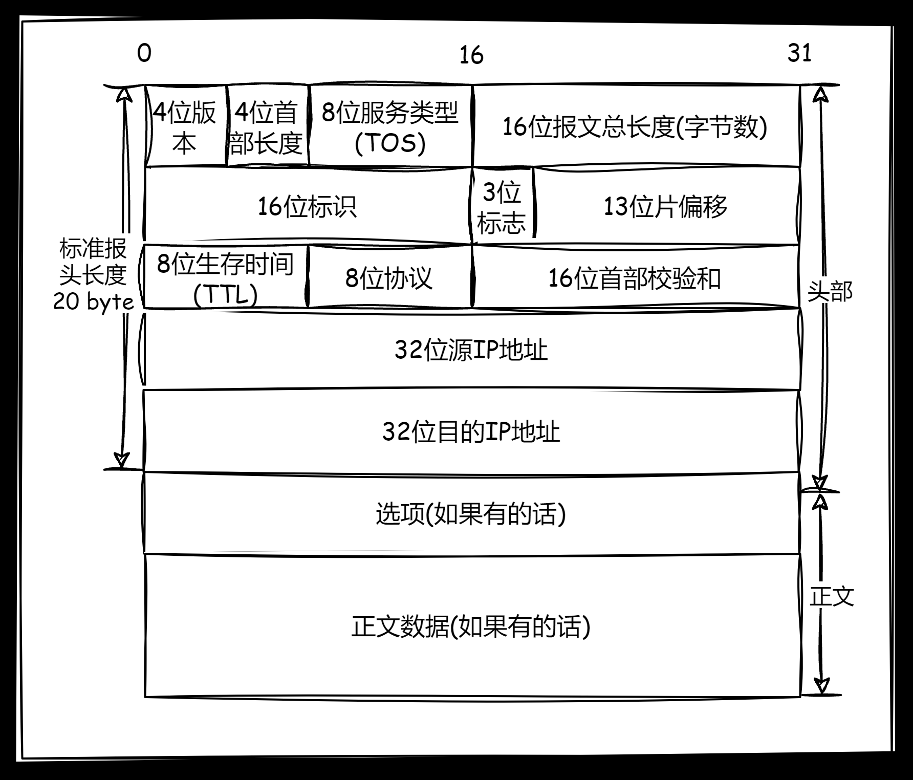
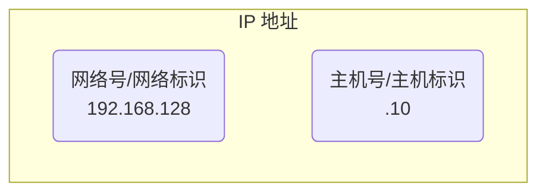
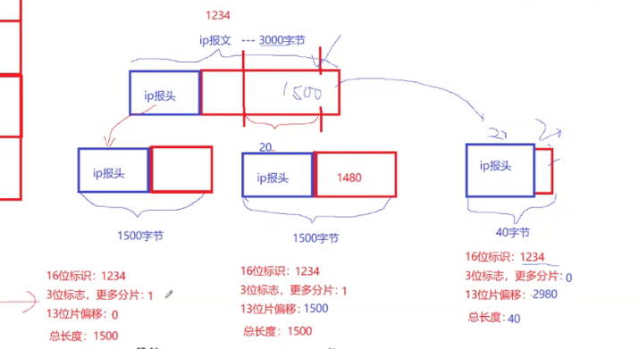

**叠甲：以下文章主要是依靠我的实际编码学习中总结出来的经验之谈，求逻辑自洽，不能百分百保证正确，有错误、未定义、不合适的内容请尽情指出！**

[TOC]

>   概要：...

>   资料：...

---

我们依旧需要明确网络层需要解决的问题，上图我们可以看到，真实的网络传输不是只在端和端之间发生的，中间还会经过各种网络设备，而不是简单的线性传输。

上图就是典型的图结构，必然会涉及到图算法（例如经典的最小路径选择等）。因此网络层目的为：**如何确定数据包从源主机到目标主机的路径，并确保数据包有按照正确的顺序到达目标的能力（但不一定做得到，只是有这个能力）？如何定位到一个主机？如何解决下一跳的问题？** 而这里需要注意，我只讲解最为常见的 `IP` 协议，这仅仅是网络层中最常用的协议之一。

>   补充：主机本身是配有 `IP` 地址但不做路由控制的设备，而路由器则是配有 `IP` 地址并且能进行路由控制的设备。而如果把主机和路由器合起来，我们就称为一个 **节点**。
>
>   并且一般来说，不同的主机和路由器可能处于一个局域网中，路由器也可以夹在局域网之间选择路径，因此上图是比较简略的。
>
>   那这些路由器是怎么来的呢？运营商和国家提供的...

>   吐槽：所谓的“有能力”只是代表高概率。

# 1.协议结构

-   `4` 位版本，填写的就是协议版本，如果是 `4` 代表 `ipv4` ，主要是为了向后兼容以及支持新的 `IP` 协议版本
-   `4` 位首部长度，也就是变长 `IP` 报头的总长度，`4` 位会不会有点少？其实不会，首部长度的基本单位是 `4` 字节，刚好就是整个报文的宽度，因此最低填 `20/4` 最高填 `60/4`。
-   `8` 位服务类型，用于指定报文的服务质量，包括优先级、延迟、吞吐量和可靠性，这可以用于网络拥塞时的包优先级处理。不过其中 `3` 位的优先权字段已经弃用，还包含 `4` 位的 `TOS` 字段（分别表示最小延时、最大吞吐、最高可靠、最小成本，四者互相冲突只能选择一个，类似 `telnet/ssh` 程序的最延迟比较重要，`ftp` 程序的最大吞吐量比较重要），`1` 位必须置为 `0` 的保留字段
-   `16` 位报文总长度，也就是一个 `IP` 报文的总长度，包含报头（有可能携带选项）和正文
-   `16` 位标识，后续讲到分片的时候补充...
-   `3` 位标志，用于控制和指示 `IP` 报文的分片，后续讲到分片的时候补充...
-   `13` 位片偏移，当 `IP` 数据报被分片时，此字段指示当前分片在原始数据报中的位置，后续讲到分片的时候补充...
-   `8` 位生存时间，也称为 `TTL(Time to Live)`，用于限制 `IP` 报文在网络中的生命周期，避免网络中的滞留 `IP` 报文影响网络环境（例如路由器的决策漏洞，导致报文一直处于环形网络中无法消散，最终报文挤压导致节点失效），而这里的生存策略实际上就是 `IP` 报文每经过一个路由器就对生存时间进行 `--`，直到 `IP` 报文生存时间归零，路由器直接丢弃 `IP` 报文
-   `8` 位协议，根据传输协议类型来填写对应的类型，如 `TCP` 是 `6`，`UDP` 是 `17`，根据上层传输协议的不同作处理
-   `16` 位首部校验和，用于检测比特位是否发生翻转
-   `32` 位源 `IP` 地址，发送方的 `IP` 地址
-   `32` 位目的 `IP` 地址，接收方的 `IP` 地址

>   补充：`IPv4` 是互联网上最常用的协议，它使用 `32` 位的地址来唯一标识网络上的设备。`IPv4` 地址通常用点分十进制表示，如 `192.168.1.1`，每个部分取值范围是 `0` 到 `255`。由于 `IPv4` 地址空间有限，约 `42` 亿个地址，随着互联网的发展，`IPv4` 地址资源已经接近耗尽，面临地址短缺的问题（但是“如耗”）。
>
>   而 `IPv6` 是 `IPv4` 的后继版本，旨在解决 `IPv4` 的地址耗尽问题。它采用 `128` 位地址，比 `IPv4` 的地址空间大得多。`IPv6` 地址通常使用冒号十六进制表示法，如 `2001:0db8:85a3:0000:0000:8a2e:0370:7334` 。`IPv6` 地址空间极大，约为 `3.4×10^38` 个地址，足够满足未来的互联网需求。`IPv6` 本身还提供了一些其他功能，如改进的安全性和配置选项。
>
>   但是由于底层技术的发展比较稳定，`ipv4` 又和 `ipv6` 不兼容，并且 `ipv4` 的紧缺也有对应的解决方案，导致现在（`2024-5-26`）使用 `ipv6` 的软件也不多（但是国内很多应用则兼有这种机制）。

这里提醒您一点，我们可以很容易发现 `TCP` 和 `IP` 协议结构确实很相似，这都是被设计好的，两种协议配合起来也比较合适。

# 2.封装分离

根据 `16` 位报文总长度和 `4` 位首部长度，就可以向下分离报头和正文。然后再根据上层的传输协议，决定填写 `8` 位协议。而向上封装给也和之前提到的协议类似，这里不再赘述...

# 3.报文管理

# 4.协议特点

## 4.1.网段划分

### 4.1.1.IP 地址的构成

首先，`ip` 地址分为两个部分组成，一是网络号，而是主机号。

同一网段的网络号相同，但是主机号必须不同。一个网段就相当于一个局域网，不同局域网通过路由器作为中间点进行关联。

路由器的作用不是作为传输数据的网桥设备，而是作为路由转发的路由设备，最主要的作用就是级联两个或以上的局域网。这就决定了一台最简单的路由器必须配备两个网卡，对应两个 `ip` 网址，搭配两个网络物理接口，在两个互联网内都作为一个主机存在。

像路由器这样特殊的网络设备，在最简单的网络中一般都是优先入网的，如果一个局域网只有一个路由器，那路由器的主机号很可能就是 `.1`。而其他的主机就是 `.1` 之后的顺序，例如 `.2、.3、.4` 等，只要保证入网的新主机的主机号和已接入局域网的其他主机都不同即可。

>   补充：不过我们也可以查看我们自己计算机的默认网关（一般就是路由器）的 `ip` 地址，使用 `[win+i]` 打开网络设置即可查看...里面会有一个 “`ipv4` 默认网关”的消息栏，后面就是可以直接访问路由器的 `ip` 地址。

路由器的物理作用就决定了路由具备构建子网的能力，因此如果把一台路由器接入网络中，以该路由器为起始，就可以组建局域网。因此在一台外来无网络的电脑连接路由器时，路由器就会动态管理和分配一个 `ip` 地址交给电脑，这样电脑就可以上网（实际上也是一些“光猫”的原理）。

>   补充：拥有一定计算能力，内部还具有分析和存储能力，这不就是一台小型计算机么，因此我们也确实可以把路由器作为一台计算机理解。
>
>   现在的路由器不仅仅是在网络层作转发，也可以把要转发的数据封装向上进行分析处理，然后再
>
>   这种管理肯定也是需要程序进行管理，因此路由器普遍会在内部实现应用层协议 `DHCP`，专门用于 `ip` 地址的分配和回收管理。
>
>   因此把路由器看作一个简单的计算机还是太粗浅了，应该把路由器看作一个实现了应用层协议的 `DHCP` 服务器！
>
>   因此有些路由器的背面就会有一个 `ip` 地址，使用浏览器登录这个 `ip` 地址就可以连接到路由器的登录网页，用户名和密码往往就在路由器标签处，进入后就可以对路由器进行配置，这些登录和配置都是应用层的开发（这很类似开发一个 `HTTP` 应用网页服务）。
>
>   因此把接入网络的路由器和某些应用服务器进行等价理解即可。
>
>   更高级的路由器，甚至把 `HTTP` 协议都实现了，内部还可能包含某些小型数据库，这种开发就很接近于嵌入式开发了，这些场景使用 `C/C++` 进行开发就非常方便。

### 4.1.2.IP 地址的分配

>   吐槽：所谓的资源，最简单和必要的条件就是有用且有限，`ip` 地址就是一种资源，称之为国家级资源也不为过，尤其是领土较多的国家。

全球的 `ipv4` 有 `2^32` 个，需要根据需求划分给不同的国家，因此必须对 `ip` 地址进行划分。一种最为早期的划分方法，就是利用固定的网络号比特位进行划分（下图从上到下被分为 `A、B、C、D...` 网络），然后不同组织使用主机号比特位枚举的方式来分配一个 `ip` 地址的所有主机号。

这种划分方案的原意是让大家合理申请地址类型，然后每种类型使用主机号组建 **一个** 子网，但是随着互联网的发展，这种方案的局限性也开始凸显出来，大部分机构更加愿意申请 `B` 类地址，导致 `B` 网络被申请过多（因为 `A` 类稀有，`C` 类太少了），而且一个 `B` 类地址很少真的构建出容纳 `16` 比特位的单独子网，因此最终绝对存在各种地址浪费的问题（本来就不算够用竟然还浪费！）。

>   吐槽：而且这种网络地址的申请，大部分都是运营商和国家一起协作的，个人和小组织基本很难申请到。

因此，在已有的 `ABCD` 划分基础上，基于子网掩码的 `CIDR` 技术可以制定处新的划分方案。子网掩码也是一个 `32` 位的正整数，比特位通常用一串 `0` 来结尾（暗示您通常以一串 `1` 作开头）。

而由于子网掩码有一串比特位是 `0`，就可以将 `ip` 地址和子网掩码 `&` 操作，结果得到的就是一串网络号。为什么这么做可以缓解 `ip` 地址不够用的问题呢？举个简单例子：

| 地址         | 二进制(32 位)                         | 十进制                          |
| ------------ | ------------------------------------ | ------------------------------- |
| B 类 IP 地址 | 10001100.11111100.00010100.0100 0100 | 140.252.020.068                 |
| 子网掩码     | 11111111.11111111.11111111.1111 0000 | 255.255.255.240                 |
| 网络号       | 10001100.11111100.00010100.0100 0000 | 140.252.020.064                 |
| 子网地址范围 | ...01000000~...01001111              | 140.252.020.064~140.252.020.079 |

可以看到如果使用了上表中的 `B` 类 `ip` 地址，可以使用子网掩码来构建子网，而不是直接使用 `ip` 的主机号构建子网。每个子网在拿到子网掩码后，分别和 `ip` 地址进行异或，穷尽尾部的比特位作为主机号，就可以在自己的子网内给不同的计算机分配 `ip` 地址。另外，`ip` 地址和子网掩码还有一种简洁的表达方式 `ip地址/子网掩码1的个数`，例如在上例子中可以表示位 `140.252.020.068/28`，这可以很方便展示出 `ip` 地址和子网的关系。

>   补充：因此使用子网掩码和任意子网中的 `ip` 地址，异或可得子网内所有计算机的共同网络号。

而这样使用子网掩码的规则，可以提高主机号比特位的利用率，构建更加复杂的子网拓扑结构。如果一开始一个子网内部入网的计算机比较少，就可以让掩码异或出的主机号少一些，等待未来需要入网更多的计算机时，动态修改子网掩码即可。

如果使用图形来理解子网掩码，其实就是把网络拓扑结构进行了调整：

>   补充：因此难怪有些软件依旧使用 `ipv4`，这种子网掩码机制使得 `ip` 地址可以由路由器动态调配，减少 `ip` 资源消耗。

### 4.1.3.IP 地址的分类

#### 4.1.3.1.特殊 IP 地址

而根据计算机被分配得到的 `ip` 地址，通常也会进行分类，在上述划分得到子网中，内部的 `ip` 地址中有几类比较特殊的：

-   若主机号为全 `0` 就得到网络号，代表整个子网
-   若主机号为全 `1` 就得到广播号，用于给链路中相互连接的所有主机发送数据包
-   若 `ip=127.*` 则用于本地换回，通常是 `127.0.0.1`

#### 4.1.3.2.公私 IP 地址

还有一种最为典型的分类方法就是 **公网 IP 地址** 和 **私网 ip 地址**，私网 `ip` 不能被直接访问，但是 `公网ip` 可以。理论上所有 `ip` 都可以作为 `私网ip` 来使用，但是 `RFC 1918` 规定能用于组建局域网的内部 `私网ip` 地址必须满足：

| 私网前缀(十进制) | 私网前缀(二进制)    | 网络号   | 地址总数          |
| ---------------- | ------------------- | -------- | ----------------- |
| 10.*             | 00001010.*          | 前 8 位  | 16,777,216 个地址 |
| 172.16.*         | 10101100.00010000.* | 前 12 位 | 1,048,576 个地址  |
| 192.168.*        | 11000000.10101000.* | 前 16 位 | 65,536 个地址     |

而不在这个区域范围内的 `ip` 地址都是 `公网ip`，您日常使用的 `ip` 地址基本都是 `私网ip`。那为什么需要区分公私网地址呢？和之前的 `ip` 地址分配又有什么关系？且看下图。

>   补充：`私网 ip/子网ip` 也叫 `LAN ip`...

某些权威组织对世界 `IP` 进行划分，先把 `ip` 地址划分为 `公网ip` 和 `私网ip`。权威机构使用 `公网ip` 分配全球互联网的中不同地区的运营商。每个得到 `公网ip` 的运营商路由器开始组建自己的局域网。

-   分配给运营商的 `公网ip` 对于广域网是不允许重复的
-   所有运行商路由器自己搭建的子网互不直接干涉，因此 `私网ip` 可以在不同子网中进行复用

运营商路由至少具有两个 `ip` 地址，一个是 `公网ip` 一个是 `私网ip`，`公网ip` 用于广域网中，`私有ip` 是组件子网时的第一个地址。而运营商路由器的子网内部，还可以把子网内的其他 `私网ip` 当作 `公网ip` 来理解，使用家庭路由器继续组建局域网。

**但是注意，这里有一些很严重的问题需要解决**：转发的过程中，如果目标地址在本局域网和其他局域网中刚好一样怎么办？报文发出去后，又该怎么返回呢？

实际上在报文转发过程中，如果发生了跨网络转发，报文的 `源ip` 在经过路由器时会被路由器替换为路由器自己的 `WAN地址`，一直交付到组建目标局域网的路由器中，而返回的时候逆转一下源地址和目标地址和根据路由器中存储的映射表即可，这种技术也被称为 **NAT 技术**。而如果向上交付时跨局域网转发也不一定就直接是交给最大的全球公网，可能是更大的子网。

因此为什么说普通人一般很难拿到 `公网ip` 呢，真正的公网 `ip` 一定是掌握在运营商手上了，而运营商自己组建的局域网，可以把 `私网ip` 伪造作 `公网ip` 给您（例如再您购买服务器的时候...），这算一种诈骗么？其实也不算hhhhh

那个人电脑怎么做到所谓的“公网访问”呢？要么自己申请到真正的 `公网ip` 组建局域网，要么需要拿到运营商给的所谓 `“公网ip”`。

>   补充：子网划分的理由主要有两个
>
>   -   提高查找效率，是丢弃大量查找对象的过程。
>   -   提高地址利用，避免地址资源出现浪费现象。

而由于运营商掌握着 `公网ip` 因此也会设置对应的防火墙策略和流量收费策略（所有的 `fq` 基本都是欺骗运营商的行为）。

## 4.2.数据分片

`13` 位片偏移呢？和下层链路层有关。由于物理特性的原因，一般无法转发太长太大的数据，这个上限大小一般是 `1500/MTU(最大传输单元)`。

如果网络层向下交付了 `2500` 字节的数据，因此就需要对数据做数据分片分别发送。

分片和组装的工作应该交给 `IP` 协议，不应该交给数据链路层（只有网络层才知道这么进行更好的分片，就行快递分包不应该交给快递公司来决定）。

实际上上层才是决定发多大数据的，但是下层又有发送大小限制，因此网络层两头都不好做，只能进行分片。

分片相当于对上层报文的数据进行了一定程度的污染，因此交付上层时就必须进行净化（多个分片的 `TCP` 报文的报头可能被误认为是一样的）。

对于 `TCP` 来说，`IP` 分片和组装的行为是不关心的，无感知的。

那怎么分片呢？`16` 位标识是 `ip` 报文的序号，`3` 位标识中一位保留，二位标识禁止分片（比如测试不同网络地层最大的分片大小，如果报文长度又超过 `MTU`，该 `IP` 报文就会被丢弃），三位标识更多分片，如果分片了其他分片是写 `1`，但是最后一个写 `0`，类似结束标志。

而偏移实际就是指针偏移量。

但是分片不是主流，在网络通信中可能不需要分片。

-   识别报文和报文的不同，网络层中数据不会被积压，在对方网络层中基本不会出现相同序号的报文。因此相同报文的分片这里的标识相同。
-   识别报文是否被分片，可以通过 `3` 位标志位中的更多分片位被置 `1` 就代表被分片，那最后一个分片怎么办？其 `13` 位片偏移一定不是 `0`，因此可以被区分
-   识别那些分片是开始、中间、结束，结合分片标志位和片偏移即可。
-   异常怎么处理？分片丢失怎么办？怎么保证收全了？前一个分片的偏移量加上自身大小等于下一个即可。排序偏移量，再扫描检测完就完成了组合工作。
-   因此每个分片都必须有 `ip` 报头，否则上述的排序和组合都不会存在。

值得注意的是 `ip` 报头本身也是数据，也会被 `MTU` 限制，因此整个报文也不能超过 `MTU`。

分块为什么不是主流？很简单提高了报文丢失的概率，因此一定是需要上层配合。

# 5.协议目的

---

>   结语：...

