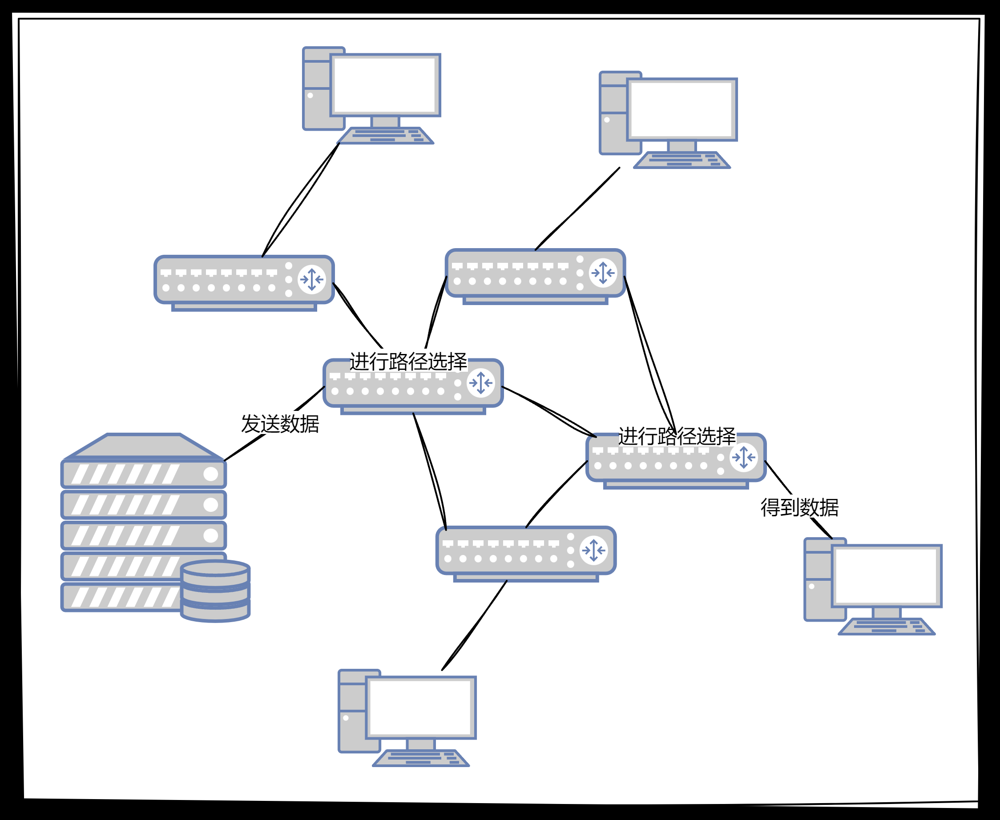
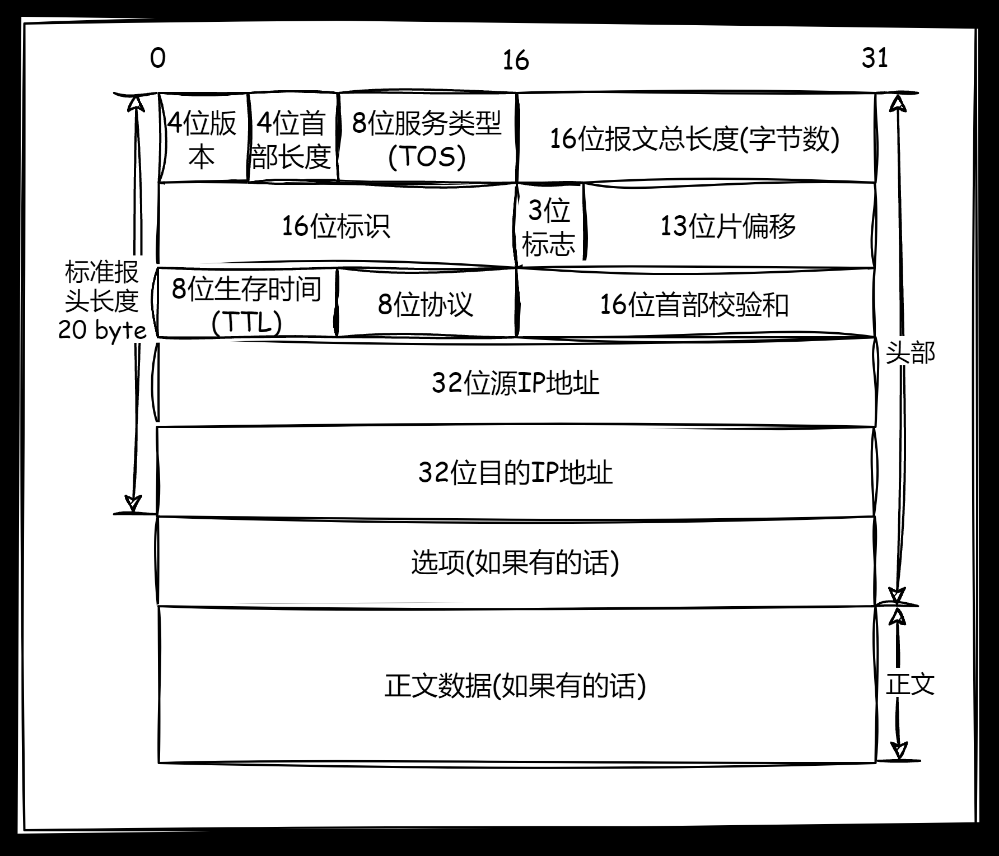
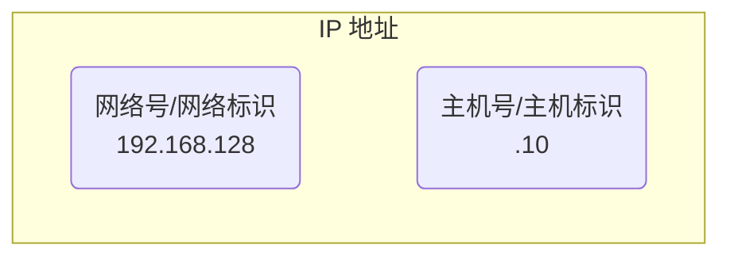
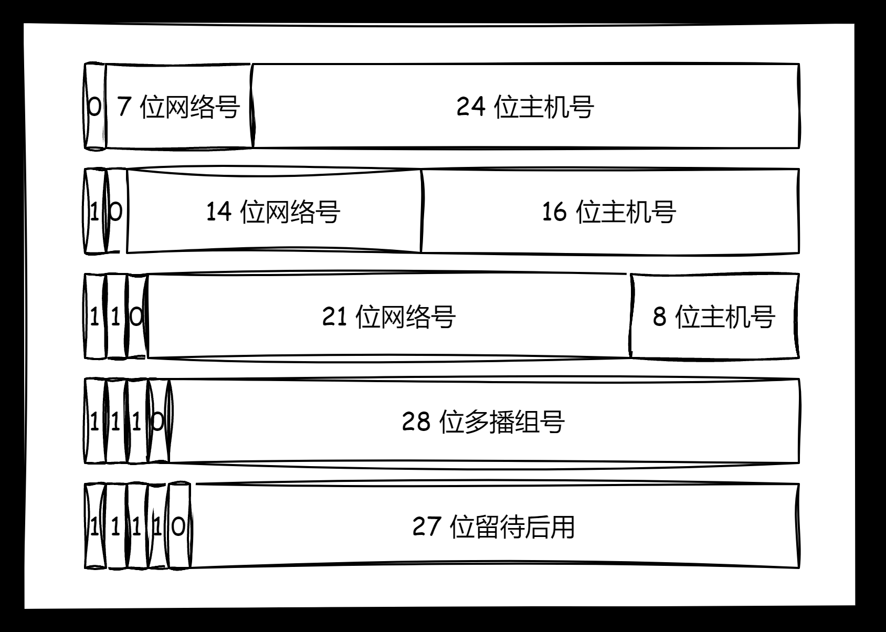
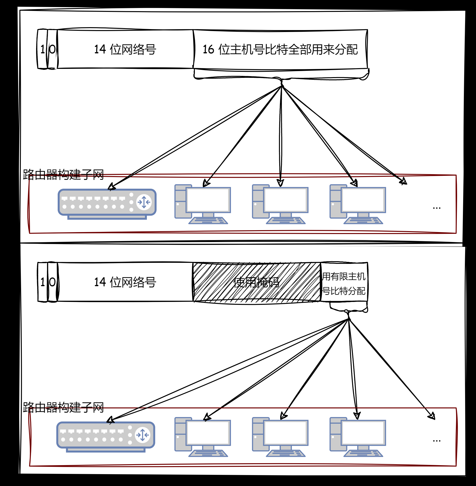
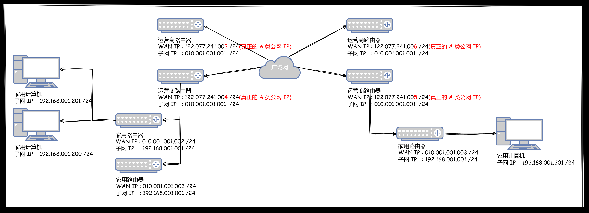
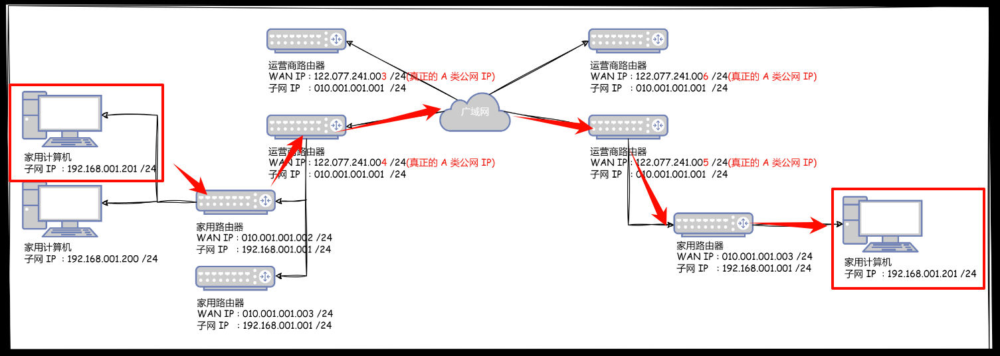
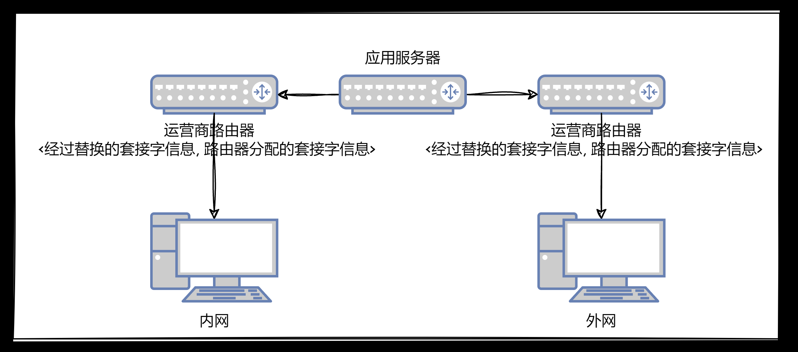
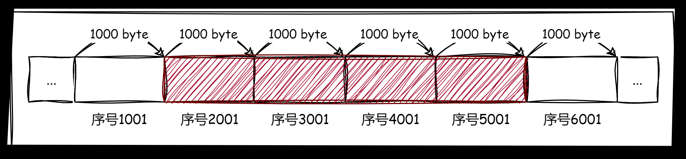
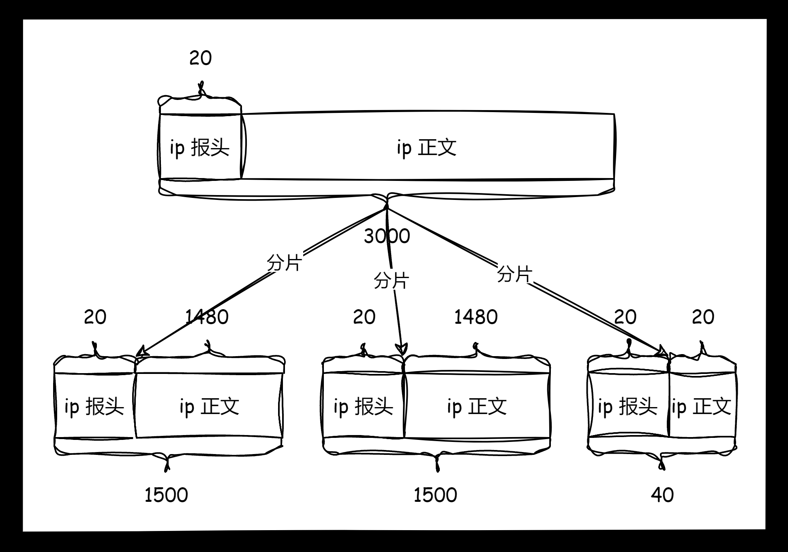

**叠甲：以下文章主要是依靠我的实际编码学习中总结出来的经验之谈，求逻辑自洽，不能百分百保证正确，有错误、未定义、不合适的内容请尽情指出！**

[TOC]

>   概要：...

>   资料：...

---



我们依旧需要明确网络层需要解决的问题，上图我们可以看到，真实的网络传输不是只在端和端之间发生的，中间还会经过各种网络设备，而不是简单的线性传输。

上图就是典型的图结构，必然会涉及到图算法（例如经典的最小路径选择等）。因此网络层目的为：**如何确定数据包从源主机到目标主机的路径，并确保数据包有到达目标的能力（但不一定做得到，只是有这个能力）？如何定位到一个主机？如何解决下一跳的问题？** 而这里需要注意，我只讲解最为常见的 `IP` 协议，这仅仅是网络层中最常用的协议之一。

>   补充：主机本身是配有 `IP` 地址但不做路由控制的设备，而路由器则是配有 `IP` 地址并且能进行路由控制的设备。而如果把主机和路由器合起来，我们就称为一个 **节点**。
>
>   并且一般来说，不同的主机和路由器可能处于一个局域网中，路由器也可以夹在局域网之间选择路径，因此上图是比较简略的。
>
>   那这些路由器是怎么来的呢？运营商和国家提供的...

>   吐槽：所谓的“有能力”只是代表高概率。

# 1.协议结构



-   `4` 位版本，填写的就是协议版本，如果是 `4` 代表 `ipv4` ，主要是为了向后兼容以及支持新的 `IP` 协议版本
-   `4` 位首部长度，也就是变长 `IP` 报头的总长度，`4` 位会不会有点少？其实不会，首部长度的基本单位是 `4` 字节，刚好就是整个报文的宽度，因此最低填 `20/4` 最高填 `60/4`。
-   `8` 位服务类型，用于指定报文的服务质量，包括优先级、延迟、吞吐量和可靠性，这可以用于网络拥塞时的包优先级处理。不过其中 `3` 位的优先权字段已经弃用，还包含 `4` 位的 `TOS` 字段（分别表示最小延时、最大吞吐、最高可靠、最小成本，四者互相冲突只能选择一个，类似 `telnet/ssh` 程序的最延迟比较重要，`ftp` 程序的最大吞吐量比较重要），`1` 位必须置为 `0` 的保留字段
-   `16` 位报文总长度，也就是一个 `IP` 报文的总长度，包含报头（有可能携带选项）和正文
-   `16` 位标识，后续讲到分片的时候补充...
-   `3` 位标志，用于控制和指示 `IP` 报文的分片，后续讲到分片的时候补充...
-   `13` 位片偏移，当 `IP` 数据报被分片时，此字段指示当前分片在原始数据报中的位置，后续讲到分片的时候补充...
-   `8` 位生存时间，也称为 `TTL(Time to Live)`，用于限制 `IP` 报文在网络中的生命周期，避免网络中的滞留 `IP` 报文影响网络环境（例如路由器的决策漏洞，导致报文一直处于环形网络中无法消散，最终报文挤压导致节点失效），而这里的生存策略实际上就是 `IP` 报文每经过一个路由器就对生存时间进行 `--`，直到 `IP` 报文生存时间归零，路由器直接丢弃 `IP` 报文
-   `8` 位协议，根据传输协议类型来填写对应的类型，如 `TCP` 是 `6`，`UDP` 是 `17`，根据上层传输协议的不同作处理
-   `16` 位首部校验和，用于检测比特位是否发生翻转
-   `32` 位源 `IP` 地址，发送方的 `IP` 地址
-   `32` 位目的 `IP` 地址，接收方的 `IP` 地址

>   补充：`IPv4` 是互联网上最常用的协议，它使用 `32` 位的地址来唯一标识网络上的设备。`IPv4` 地址通常用点分十进制表示，如 `192.168.1.1`，每个部分取值范围是 `0` 到 `255`。由于 `IPv4` 地址空间有限，约 `42` 亿个地址，随着互联网的发展，`IPv4` 地址资源已经接近耗尽，面临地址短缺的问题（但是“如耗”）。
>
>   而 `IPv6` 是 `IPv4` 的后继版本，旨在解决 `IPv4` 的地址耗尽问题。它采用 `128` 位地址，比 `IPv4` 的地址空间大得多。`IPv6` 地址通常使用冒号十六进制表示法，如 `2001:0db8:85a3:0000:0000:8a2e:0370:7334` 。`IPv6` 地址空间极大，约为 `3.4×10^38` 个地址，足够满足未来的互联网需求。`IPv6` 本身还提供了一些其他功能，如改进的安全性和配置选项。
>
>   但是由于底层技术的发展比较稳定，`ipv4` 又和 `ipv6` 不兼容，并且 `ipv4` 的紧缺也有对应的解决方案，导致现在（`2024-5-26`）使用 `ipv6` 的软件也不多（但是国内很多应用则兼有这种机制）。

这里提醒您一点，我们可以很容易发现 `TCP` 和 `IP` 协议结构确实很相似，这都是被设计好的，两种协议配合起来也比较合适。

# 2.封装分离

根据 `16` 位报文总长度和 `4` 位首部长度，就可以向下分离报头和正文。然后再根据上层的传输协议，决定填写 `8` 位协议。而向上封装给也和之前提到的协议类似，这里不再赘述...

# 3.报文管理


# 4.协议特点

## 4.1.网段划分

### 4.1.1.IP 地址的构成

首先，`ip` 地址分为两个部分组成，一是网络号，二是主机号。



同一网段的网络号相同，但是主机号必须不同。一个网段就相当于一个局域网，不同局域网通过路由器作为中间点进行关联。

路由器的作用不是作为传输数据的网桥设备，而是作为路由转发的路由设备，最主要的作用就是级联两个或以上的局域网。这就决定了一台最简单的路由器必须配备两个网卡，对应两个 `ip` 网址（在两个子网中都有一个地址定位），搭配两个网络物理接口，在两个互联网内都作为一个主机存在。

像路由器这样特殊的网络设备，在最简单的网络中一般都是优先入网的，如果一个局域网只有一个路由器，那路由器的主机号很可能就是 `.1`。而其他的主机就是 `.1` 之后的顺序，例如 `.2、.3、.4` 等，只要保证入网的新主机的主机号和已接入局域网的其他主机都不同即可。

>   补充：不过我们也可以查看我们自己计算机的默认网关（一般就是路由器）的 `ip` 地址，使用 `[win+i]` 打开网络设置即可查看...里面会有一个 “`ipv4` 默认网关”的消息栏，后面就是可以直接访问路由器的 `ip` 地址。

路由器的物理作用就决定了路由具备构建子网的能力，因此如果把一台路由器接入网络中，以该路由器为起始，就可以组建局域网。因此在一台外来无网络的电脑连接路由器时，路由器就会动态管理和分配一个 `ip` 地址交给电脑，这样电脑就可以上网（实际上也是一些“光猫”的原理）。

>   补充：拥有一定计算能力，内部还具有分析和存储能力，这不就是一台小型计算机么，因此我们也确实可以把路由器作为一台计算机理解。
>
>   现在的路由器不仅仅是在网络层作转发，也可以把要转发的数据封装向上进行分析处理，然后再进行管理。
>
>   这种管理肯定也是需要程序进行管理，因此路由器普遍会在内部实现应用层协议 `DHCP`，专门用于 `ip` 地址的分配和回收管理。
>
>   因此把路由器看作一个简单的计算机还是太粗浅了，应该把路由器看作一个实现了应用层协议的 `DHCP` 服务器！
>
>   因此有些路由器的背面就会有一个 `ip` 地址，使用浏览器登录这个 `ip` 地址就可以连接到路由器的登录网页，用户名和密码往往就在路由器标签处，进入后就可以对路由器进行配置，这些登录和配置都是应用层的开发（这很类似开发一个 `HTTP` 应用网页服务）。
>
>   因此把接入网络的路由器和某些应用服务器进行等价理解即可。
>
>   更高级的路由器，甚至把 `HTTP` 协议都实现了，内部还可能包含某些小型数据库，这种开发就很接近于嵌入式开发了，这些场景使用 `C/C++` 进行开发就非常方便。

### 4.1.2.IP 地址的分配

>   吐槽：所谓的资源，最简单和必要的条件就是有用且有限，`ip` 地址就是一种资源，称之为国家级资源也不为过，尤其是领土较多的国家。

全球的 `ipv4` 有 `2^32` 个，需要根据需求划分给不同的国家，因此必须对 `ip` 地址进行划分。一种最为早期的划分方法，就是利用固定的网络号比特位进行划分（下图从上到下被分为 `A、B、C、D...` 网络），然后不同组织使用主机号比特位枚举的方式来分配一个 `ip` 地址的所有主机号。



这种划分方案的原意是让大家合理申请地址类型，然后每种类型使用主机号组建 **一个** 子网，但是随着互联网的发展，这种方案的局限性也开始凸显出来，大部分机构更加愿意申请 `B` 类地址，导致 `B` 网络被申请过多（因为 `A` 类稀有，`C` 类太少了），而且一个 `B` 类地址很少真的构建出容纳 `16` 比特位的单独子网，因此最终绝对存在各种地址浪费的问题（本来就不算够用竟然还浪费！）。

>   吐槽：而且这种网络地址的申请，大部分都是运营商和国家一起协作的，个人和小组织基本很难申请到。

因此，在已有的 `ABCD` 划分基础上，基于子网掩码的 `CIDR` 技术可以制定处新的划分方案。子网掩码也是一个 `32` 位的正整数，比特位通常用一串 `0` 来结尾（暗示您通常以一串 `1` 作开头）。

而由于子网掩码有一串比特位是 `0`，就可以将 `ip` 地址和子网掩码 `&` 操作，结果得到的就是一串网络号。为什么这么做可以缓解 `ip` 地址不够用的问题呢？举个简单例子：

| 地址         | 二进制(32 位)                         | 十进制                          |
| ------------ | ------------------------------------ | ------------------------------- |
| B 类 IP 地址 | 10001100.11111100.00010100.0100 0100 | 140.252.020.068                 |
| 子网掩码     | 11111111.11111111.11111111.1111 0000 | 255.255.255.240                 |
| 网络号       | 10001100.11111100.00010100.0100 0000 | 140.252.020.064                 |
| 子网地址范围 | ...0100 0000~...0100 1111            | 140.252.020.064~140.252.020.079 |

可以看到如果使用了上表中的 `B` 类 `ip` 地址，可以使用子网掩码来构建子网，而不是直接使用 `ip` 的主机号构建子网。每个子网在拿到子网掩码后，分别和 `ip` 地址进行异或，穷尽尾部的比特位作为主机号，就可以在自己的子网内给不同的计算机分配 `ip` 地址。另外，`ip` 地址和子网掩码还有一种简洁的表达方式 `ip地址/子网掩码1的个数`，例如在上例子中可以表示位 `140.252.020.068/28`，这可以很方便展示出 `ip` 地址和子网的关系。

>   补充：因此使用子网掩码和任意子网中的 `ip` 地址，异或可得子网内所有计算机的共同网络号。

而这样使用子网掩码的规则，可以提高主机号比特位的利用率，构建更加复杂的子网拓扑结构。如果一开始一个子网内部入网的计算机比较少，就可以让掩码异或出的主机号少一些，等待未来需要入网更多的计算机时，动态修改子网掩码即可。

如果使用图形来理解子网掩码，其实就是把网络拓扑结构进行了调整：



>   补充：因此难怪有些软件依旧使用 `ipv4`，这种子网掩码机制使得 `ip` 地址可以由路由器动态调配，减少 `ip` 资源消耗。

### 4.1.3.IP 地址的分类

>   警告：下文提及的公网私网和父网子网的概念类似，而外网内网是指同一层网络中的不同局域网。

#### 4.1.3.1.特殊 IP 地址

而根据计算机被分配得到的 `ip` 地址，通常也会进行分类，在上述划分得到子网中，内部的 `ip` 地址中有几类比较特殊的：

-   若主机号为全 `0` 就得到网络号，代表整个子网
-   若主机号为全 `1` 就得到广播号，用于给链路中相互连接的所有主机发送数据包
-   若 `ip=127.*` 则用于本地换回，通常是 `127.0.0.1`

#### 4.1.3.2.公私 IP 地址

##### 4.1.3.2.1.公私地址划分规则

而实际上，使用 `CIDR` 技术中的子网也无法完全解决全世界的 `IP` 地址资源不够使用的问题，因为这种组建网络的方式，子网和父网使用的是同性质的地址，只不过子网能够改动的比特位较少而已。

而如果把父网和子网解耦，使用不同性质的地址，就会诞生公网和私网的概念。因此一种最为典型的地址分类方法就是 **公网 IP 地址** 和 **私网 ip 地址**，私网 `ip` 不能在公网中被直接访问，但是 `公网ip` 可以。

`RFC 1918` 规定能用于组建局域网的内部 `私网ip` 地址必须满足（理论上所有 `ip` 都可作为 `私网ip` 来使用）：

| 私网前缀(十进制) | 私网前缀(二进制)    | 网络号   | 地址总数          |
| ---------------- | ------------------- | -------- | ----------------- |
| 010.*            | 00001010.*          | 前 8 位  | 16,777,216 个地址 |
| 172.016.*        | 10101100.00010000.* | 前 12 位 | 1,048,576 个地址  |
| 192.168.*        | 11000000.10101000.* | 前 16 位 | 65,536 个地址     |

而不在这个区域范围内的 `ip` 地址都是 `公网ip`，您日常使用的 `ip` 地址基本都是 `私网ip`。那为什么需要区分公私网地址呢？和之前的 `ip` 地址分配又有什么关系？且看下图分析。

##### 4.1.3.2.2.私网地址组建子网



>   补充：`私网 IP/子网 IP` 也叫 `LAN IP`，并且上述的广域网内部也可能是一张巨大的公网...

某些权威组织对世界 `IP` 进行划分，先把 `ip` 地址划分为 `公网ip` 和 `私网ip`。权威机构使用 `公网ip` 分配全球互联网的中不同地区的运营商。每个得到 `公网ip` 的运营商路由器开始组建自己的局域网。

-   分配给运营商的 `公网ip` 对于广域网是不允许重复的
-   所有运行商路由器自己搭建的子网互不直接干涉，因此 `私网ip` 可以在不同子网中进行复用

到这里我们发现，父网和子网发生了解耦，各个子网能使用的 `私网ip` 对应的比特位就变多了，地址利用率更高了。如果一个国家得到了公网 `ip` 开始进行国家网络搭建，就会直接利用公网结合掩码的方式来组建各地的公网局域网。而一旦发现 `公网ip` 地址不够使用了，就可以让较低的子网使用 `私网ip` 进行局域网搭建。

对于普通的运营商路由而言，可能至少具有两个 `ip` 地址，一个是 `公网ip` 一个是 `私网ip`，`公网ip` 用于广域网中，`私有ip` 是组建子网时的第一个地址。

而运营商路由器的子网内部，还可以把子网内的其他 `私网ip` 当作 `公网ip` 来理解，使用家庭路由器继续使用 `私网ip` 组建局域网。路由器组建局域网的时候，还可以根据接入网主机的多少，动态决定私网地址的多少，分配给主机不同的 `私网ip` 地址以节省 `ip` 资源（这也是为什么 `ip` 地址如耗的其中一个主要原因，`公网ip` 不够用了就加上掩码，还不够用就使用 `私网ip` 加掩码...）。

>   补充：因此为什么说普通人一般很难拿到 `公网ip` 呢，真正的公网 `ip` 一定是掌握在运营商手上了，而运营商自己组建的局域网，可以把 `私网ip` 作为 `公网ip` 交给您（例如再您购买服务器的时候...），这算一种诈骗么？其实也不算...那个人电脑怎么做到所谓的“公网访问”呢？要么自己申请到真正的 `公网ip` 组建局域网，要么需要拿到运营商给的所谓 `“公网ip”` 在一个更大的局域网内通信，要么做到内网穿透。

##### 4.1.3.2.3.NAT 转化公私地址

实际上，报文在转发过程中，会先在本局域网中进行 `ip` 地址的比对，并且还会涉及到路由表的使用。**每个主机都存储了一个路由表/NAT 转化表，路由表通常可以使用指令 route 查询得到**。一般内部存储了目的网络地址 `Destination`（包含默认路由，即组建子网的路由器）、下一跳地址 `Gateway`、子网掩码 `Genmask`、标志位 `Flags`、发送接口 `Iface`等信息。

如果有报文需要发送出去，先拿报文中的 `目标ip` 和每个条目的子网掩码进行异或，查看得到结果是否和每个条目的 `Destination` 相同，不同则跳过，相同则选中该条目。然后开始查看该条目的 `Flags` 标志，`U` 标识表示该条目没有被禁用处于有效状态，`G` 标识标识该条目的下一跳地址是路由器需要进行跳转。

这里举个例子，在 `Linux` 下使用 `route` 指令查看路由表：

```shell
# 查看 Linux 下的路由表
$ route
Kernel IP routing table
Destination     Gateway     	Genmask         Flags 	Metric Ref    	Use Iface

192.168.10.0    *        		255.255.255.0 	U 		100    0 		0 	eth0
192.168.56.0    *        		255.255.255.0 	U   	100    0 		0 	eth1
127.0.0.0    	*        		255.0.0.0 		U 		100    0 		0 	lo
default         192.168.10.1    0.0.0.0         UG    	100    0 		0 	eth0
```

1.   第一个转发例子，如果要发送的报文中目的地址是 `192.168.56.3` 跟第一行的子网掩码做与运算得到 `192.168.56.0`，与第一行的目的网络地址不符，再跟第二行的子网掩码做与运算得到 `192.168.56.0`，正是第二行的目的地址，因此从 `eth1` 接口发送出去。由于 `192.168.56.0/24` 正是与 `eth1` 接口直接相连的网络，因此可以直接发到目的主机，不需要经路由器转发。然后开始在本局域网中进行广播，所有主机开始比对该报文的目的地址是否是自己，不是则丢弃，是则接受。
2.   第二个转发例子，如果要发送的数据包的目的地址是 `202.10.1.2` 依次和路由表前几项进行对比，发现都不匹配。按缺省路由条目，从 `eth0` 接口发出去，发往 `192.168.10.1` 路由器，由 `192.168.10.1` 内部的路由器根据它的路由表决定下一跳地址。此时就发生了跨网络转发，下层网络报文的 `源ip` 在经过路由器时会被路由器替换为路由器自己的 `WAN地址`，一直交付到组建目标局域网的路由器中，直到找到匹配的网络号子网为止。这种技术也被称为 **NAT 技术**，也就是私网地址和公网地址相互转化的技术。

>   补充：不过需要注意的是，为什么路由表处理默认地址和本地回环地址，还有那么多个目标地址呢？如果一个路由组建了一个局域网，而主机处于子网内部，那么主机就只有一个条目（除了默认地址和本地回环地址），如果报文中的 `目标ip` 和该条目不符合且不是本地换回，就会被推送到组建本局域网的路由器上。
>
>   但是现实中的主机往往不止是一个子网中的主机，可能处于多个路由器组建的局域网的交点，因此路由表就有可能会有许多的条目，因此该主机可以直接和多个子网中的主机进行直接传输，只有所有的子网的网络号和报文中的 `目标ip` 全都无法匹配时，才会被推送到默认路由中。而默认路由有可能是多个子网中的某一个组建子网的任意路由，具体可能依靠某些管理员设置和内部算法自动抉择。

路由的过程，其实是“逐跳(`hop by hop`)”的过程，`IP` 数据包到达路由器的时候。由于路由器也是服务器，因此也可能在路由内部协议栈里向上交付数据，查验数据包中的源 `ip` 和目的 `ip`，再根据内部的路由表，决定将报文重新封装为 `ip` 报文发送给同局域网主机或默认路由器。

>   补充：路由表可以由路由管理员手动进行维护（静态维护），也可以通过一些自动算法进行维护（动态维护），例如距离向量算法、`LS` 算法、`Dijkstra` 算法...

>   补充：子网划分的理由主要有两个
>
>   -   提高查找效率，是丢弃大量查找对象的过程。
>   -   提高地址利用，避免地址资源出现浪费现象。

>   补充：由于运营商掌握着 `公网ip`，因此也会设置对应的防火墙策略和流量收费策略，所以所有的 `fq魔法` 基本都是欺骗运营商的行为。

##### 4.1.3.2.4.NAT 技术一些问题

###### 4.1.3.2.4.1.端口冲突问题

首当其冲的问题就是，我们好像没有考虑端口号的问题，如果同一个局域网中的不同主机，各自使用其本地的端口号 `1025`，那向上转发经过同一个路由器时，发生了 `NAT` 技术转换，就会导致一个很尴尬的问题。

|                | 原始套接字                | NAT 后的套接字                                               |
| -------------- | ------------------------- | ------------------------------------------------------------ |
| **源套接字**   | 10.0.0.10:1025(私网 ip)   | <span style="color:#FF0000;">202.244.174.37</span>:1025(私网 ip) |
| **目的套接字** | 163.221.120.9:80(公网 ip) | 163.221.120.9:80(公网 ip)                                    |
|                |                           |                                                              |
| **源套接字**   | 10.0.0.11:1025(私网 ip)   | <span style="color:#FF0000;">202.244.174.37</span>:1025(私网 ip) |
| **目的套接字** | 163.221.120.9:80(公网 ip) | 163.221.120.9:80(公网 ip)                                    |

而如果报文需要从公网返回响应，如果直接使用上述路由表，就会产生错误。因为肯定是根据此时报文中的 `公网目的套接字` 结合路由表逆向查找 `私网目的套接字` 的。但是由于端口号相同和正向 `NAT` 技术替换的因素，导致前面的逆向映射过程失效，路由器不知道把数据交给 `10.0.0.10:1025` 还是 `10.0.0.11:1025`，出现了一个 `key(202.244.174.37:1025)` 对应两个 `value` 的情况。

因此为了解决这个问题，路由器在正向 `NAT` 进行建表时，不能简单粗暴进行地址替换，还需要考虑端口问题。解决方法也很简单，在替换地址后如果出现 `value` 重复的时候，就把原端口号替换为 `+1` 后的端口号，一直替换到不冲突为止，然后才建立新的键值对。这样就可以解决逆向 `NAT` 出现 `k-v` 值重复的问题，因此这种情况下产生的路由表几百个是很常见的。

>   补充：而上述建表的大小就是路由器的一个好坏评判指标，也就是路由器内部的内存大小...

>   警告：上述替换完后的键值关系条目也会被暂时缓存起来，留待后续逆向 `NAT` 使用，后面补充这点...

###### 4.1.3.2.4.2.地址冲突问题

那如果比对路由表的时候，不同私网局域网中的 `私网ip` 地址恰好相同怎么办？难道自己发给自己？又或者本私网内恰好有一个和对方私网中的完全相同的一个地址怎么办？这会不会最终造成报文无法上交给上层路由器而是直接误发给通局域网中的某个主机？

答案是不会的，为什么？我带您仔细分析一下。



首先，`A` 私网内的主机决定向 `B` 私网进行通信且不使用内网穿透技术，是无法直接被 `A` 私网得知 `B` 私网中的 `私网ip` 的，想要通信，必须借助拥有公网 `ip` 的服务器程序。此时我们会发现，填写的 `目的ip` 一定是 `公网ip` 而绝对不是 `私网ip`。因此只要不是在 `A` 私网中的局部通信，上述地址重复的问题就不存在（只有一种重复的情况，就是真的自己发给自己了）。

换句话来说，`私网ip` 在公网络中是不可见的，只能通过路由器进行替换。所以出现一个 `ip` 报文中 `源ip` 和 `目的ip` 处于不同私网且恰好相同地址的情况是不可能出现的！

>   注意：后面会讲到一个内网穿透技术的问题，可以实现两个私网进行通信而通信的 **过程中** 不依赖持有 `公网ip` 的服务器或路由器进行通信（但是通信准备阶段时需要），但是这个过程中其实也不是简单填写两个 `ip` 就行，也是会被逐步进行替换的...

能想到这种情况的原因是把 `ip` 报文的填写看得太过简单，直接把两个私网的源地址和目的地址填入 `ip` 报文中就了事了，没有意识到我们在网络编程中，一个客户端的请求报文中的 `目的ip` 只能是 `公网ip`，而不可能是 `私网ip`。两台主机是同时向服务器发送请求，并且服务器返回响应时才实现两者通信...

###### 4.1.3.2.4.3.逆向解析问题

但是问题是转回来时，怎么识别发给哪一台主机呢？局域网内，有多个主机都访问同一个外网服务器，那么对于服务器返回的数据中，`目的ip` 地址都是相同的，都是返回给路由器（因为以及被正向 `ANT` 替换了原报文中的地址）。那么 `NAT` 路由器如何判定将这个数据包转发给局域网中哪个主机的？

很简单，只需要把之前做过一次 `ANT` 解析后缓存的映射表逆向即可，由于我们之前建立映射条目的时候考虑了端口重复的问题，因此映射表中的每一项条目 `<first, second>` 中 `first` 和 `second` 是互为键值，直接逆转为 `<second, first>` 也是成立的，就可以逆向找到原本的 `ip` 报文中的原 `ip` 地址。

##### 4.1.3.2.5.代理服务器的原理

###### 4.1.3.2.5.1.正向反向代理服务器

**正向代理服务器**，如果一个局域网情况比较复杂，因此使用一个简单的路由器来做 `NAT` 会比较困难，因此有可能使用专门的服务区取代路由器做 `NAT` 代理服务。而这种比较强大的服务器可能不仅仅是做 `NAT` 的解析服务，由于是这个服务器作为路由器，还可以在内部做一些负载均衡和一些应用开发，例如用户认证。只有用户在内网中通过该认证，才可以通过代理服务器访问外网（这里的外网单纯指公网而已）。这种代理服务器就是正向代理服务器，可以认为内网向外网的方向就是正向。拦截的方向也可能是双向的，内网无法访问外部危险网站，外部陌生网站无法访问内网。

**反向代理服务器**，而处于外网的服务器内部也有自己的应用服务，内网的用户通过 `NAT` 正向代理服务器后，借助代理服务器的手对外网服务器进行统一的请求和响应桥梁。而如果正向代理服务器的请求过多，对于一台外网服务器压力较大，此时就可以在外网的服务器集群中设置一个反向代理服务器，管理服务器集群的工作分配问题。在正向代理服务器发送大量请求后，反向代理服务器接受这些大量的请求，然后均匀分配给服务集群中的每一台服务器，这样每一台应用服务器的工作压力就会减少，并且效率有效提高...

上述两种代理服务器，就是两种常见的代理服务器，通常可以使用 `Nginx` 等代理服务器软件来实现。

>   补充：某些加速器的原理就是正向代理服务器，在某个较大内网中设置正向代理服务器，由厂商自己的代理服务器来向远端的应用服务器进行请求响应转发，这样就会比较快一些，因为厂商自己申请的服务器可能经过审批可以合法访问外部应用服务器。

>   区分：`NAT` 工作在网络层的网络基础设备，主要解决的是 `IP` 地址不足的问题。而代理服务器贴近于具体应用，是工作在应用层的，主要是为了解决转发的问题。

###### 4.1.3.2.5.2.正向魔法网络服务器

而所谓的 `fq魔法` 的原理，我们需要先知道 `q` 在哪里。

1.   首先，客户端发起 `www.google.com` 的请求，中间一定会经过运营商的路由器，运营商虽然无法得知密文内容，但是可以得知请求的域名，因此对其进行拦截。所以所谓的 `q` 就在运营商的路由器内部，我们一定需要 `fq` 的话，就必须绕过运营商的服务器，或者骗过运营商。
2.   所以我们可以找一台国外的服务器，既可以访问外网，也可以被内网所访问的预备服务器。在这台服务器内部安装一个代理服务器软件做转发服务，而在客户端内部也安装一个客户端软件，类似抓包软件劫持客户端浏览器。会把原用户访问的 `url` 密文包装一下，变成访问预备服务器的 `http` 请求。此时可以安全通过运营商服务器不会受到拦截，而运营商路由器发送数据给代理服务器后，就会可以在代理服务器内部进行转发，访问外网的数据。
3.   外网返回响应的时候，就会把响应交给代理服务器，再由代理服务器变为密文，重新封装为 `http` 响应发回运营商路由器，运营商再发送给客户端中的抓包客户端，把内部密文进行解密和重新解析...

而运营商如果发现代理服务器有大量异常的请求或者其他异常，就会把这个代理服务器也设置为黑名单对象，此时也就是所谓的“节点失效”，需要“切换节点”。

因此 `fq魔法` 的原理就是正向代理服务器的原理...

###### 4.1.3.2.4.3.反向内网穿透服务器

如果内网从来没有访问过外网（这里的外网单纯指公网而已），那么外网能不能直接访问内网呢？理论上是不可以的，因为如果没有访问过外网，就会导致路由器中不会自动生成一个键值条目。而所谓的逆向 `NAT` 技术是基于正向 `NAT` 技术所建立的键值条目基础上的（该条目是动态的），因此外网就无法直接访问内网的设备。这对于 `NAT` 技术来说，其实不算是一种缺点，反而是一种优点，可以保护内网的网络不受未知外网的侵害。

但是确实存在一些 **内网穿透工具** 可以突破内网访问限制。虽然无法直接访问，但是可以做到间接访问。组建子网的路由器转发子网内部的请求到外网中的应用服务器，因此应用服务器肯定是知道路由器的 `WAN` 地址的和端口号的，因此这个应用服务器本身就被允许内网穿透。因此其他子网的主机想要访问内网，就可以通过应用服务器来达到目的。



内网主机给应用服务器发送请求，此时内网主机和应用服务器建立了转化映射表，并且应用服务器一定知道此时内网主机的出口路由器套接字，而应用服务器把这个信息包装为响应给外网的主机，这样外网主机就获取到了内网主机通过路由 `NAT` 转化后的套接字信息。

如法炮制的话，内外双端的主机可以互相知道对方的路由器套接字信息，因此内外网不再需要通过应用服务器，就可以通过两个运营商路由器进行通信。而这种应用服务器就是骗取到运营商路由器套接字信息的工作，就是内网穿透的工具，是一种反向代理服务器。

>   补充：内网穿透技术其实不怎么敏感，例如在某些客户端数量较为稳定的直播场景中，可以让应用服务器做一段时间的转发管理，让不同子网直接的主机可以通过直播进行通信。但如果应用服务器认为每次都需要把数据通过公网传递给自己再进行分发比较低效，就可以让两个子网内的主机互相知道对方路由器已经建立好的套接字信息，让两个子网直接进行内网穿透的通信，这样效率就会提高。

>   补充：如果较快判断一个代理服务器是正向代理还是反向代理？看组建子网的路由器在哪里就行，对于一个子网来说，还没有经过路由器就收集主机报文的就是正向代理服务器，经过路由器后才收集报文的就是反向代理服务器。

## 4.2.数据分片

```shell
# 查看数据帧的最大大小 
ifconfig | grep -n mtu
1:docker0: flags=4099<UP,BROADCAST,MULTICAST>  mtu 1500
9:eth0: flags=4163<UP,BROADCAST,RUNNING,MULTICAST>  mtu 1500
18:lo: flags=73<UP,LOOPBACK,RUNNING>  mtu 65536
```

由于物理特性的原因，一般无法转发太长太大的数据，这个上限大小一般是 `1500/MTU(最大传输单元)`，这是属于链路层的知识，但是上层传递的数据即便是传输层的报文正文进行了分割，数据也可能还是过多。因此上层决定发送数据大小，下层决定数据发送限制，网络层两头都不好做，只能进行数据分片。

而网络层为了让下层链路层可以正常发送数据，就会在发送端进行分片操作，在接收端进行组装操作。而这个过程只有网络层内部自行完成，上下层对此毫无感知。

但是这也意味着在网络中丢失数据的概率变大，导致整个报文必须重发而无法只重发丢失的片段。因为上下层是无法感知分片行为，只能整个报文进行重新发送（尤其是 `UDP` 协议的通信，会导致可靠性进一步降低）。因此分片相当于对上层报文的数据进行了一定程度的污染，因此接收端交付上层时就必须进行组装来进行净化（分片容易组装较难）。

因此我们需要认识到：分片并不是主流行为，在前面传输层的 `TCP` 协议中，您就可以认识到为什么需要滑动窗口进行分序号进行发送了。这就是为了尽可能保证网络层不发生分片，提高数据发送的可靠性。

如果链路层只保证传输 `1500` 字节，在完全不考虑选项字段的情况下，上层的 `ip` 报文整体最大长度就是 `1480`，而上层的 `tcp` 内的正文数据就不应该超过 `1460`，所以这也就是 `TCP` 传输报文的最大段尺寸，也叫 `MSS`。



但有时不可避免会发生分片问题，那具体怎么进行分片呢？

-   首先依靠 `IP` 协议结构中的 `16` 位标识，这个不是指分片的顺序，指是标识分片报文的唯一性。被分片的某个 `ip` 报文的 `ip` 报头的该标识处都是相同的数值。
-   而 `3` 位标识中一位做保留位，二位标识禁止分片（比如测试不同网络地层最大的分片大小，如果报文长度又超过 `MTU`，该 `IP` 报文就会被丢弃，该位默认关闭），三位标识更多分片，如果分片了其他分片就写 `1`，但如果是最后一个就写 `0`，类似所有分片的结束标志。
-   `13` 位片偏移则填入该分片报文相对于未被分片数据起始地址的偏移量，可以依靠这个偏移量把分片组装起来（不过这个偏移量还需要乘以 `8` 来得到真实的偏移量，因为 `13` 位的偏移量有点少，可能无法表示有 `16` 总长度报文的偏移量）。

>   注意：分片后的 `ip` 报文中需要包含 `ip` 报头，因此分片整体必须小于等于 `1500`。



>   注意：不过上述只是粗略进行分片，由于真实偏移量需要被 `除8` 处理，以此分片后的数据起始必须保证真实偏移量可以被 `8` 整除，最终导致一个报文可能无法分片到最大的 `1500`，可能需要从其他分片中拿过来部分数据，获取给予其他分片多余的数据...

但是有几个问题需要您考虑一下：

-   如何确定数据被分片了呢？查看 `3` 位标志即可，其中最后的一个标志是 `1`，就可以判断报文被分片了。而如果只有最后一个结尾报文被接受，那对端可以判断该报文要么是最后一个分片，要么就是一个单独的报文，这种情况下查看片偏移就可以（大于 `0` 就是结尾，等于 `0` 就是说明没有发生分片是单独的报文）。
-   怎么保证收集全了呢？检查前一个分片的偏移量加上分片报文数据的大小等于下一个分片报文中的片偏移，一直检查到末尾即可。并且我们可以确保收到第一个分片报文，第一个分片报文一定是片偏移为 `0`，三位标志最后一位为 `1`。
-   怎么正确进行组合呢？正确排序偏移量，再扫描检测完就完成了组合工作。

# 5.协议目的

从上面我们可以看出，网络层目的为：

1.   确定数据包从源主机到目标主机的路径，并确保数据包有到达目标的能力
2.   定位到一个主机，解决下一跳的问题

---

>   结语：...


