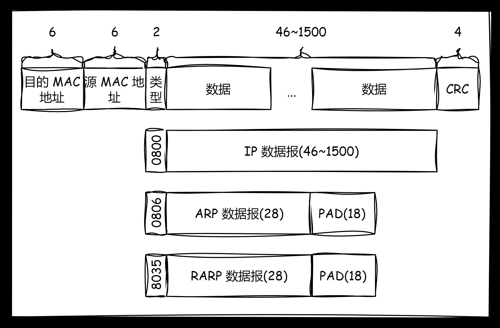
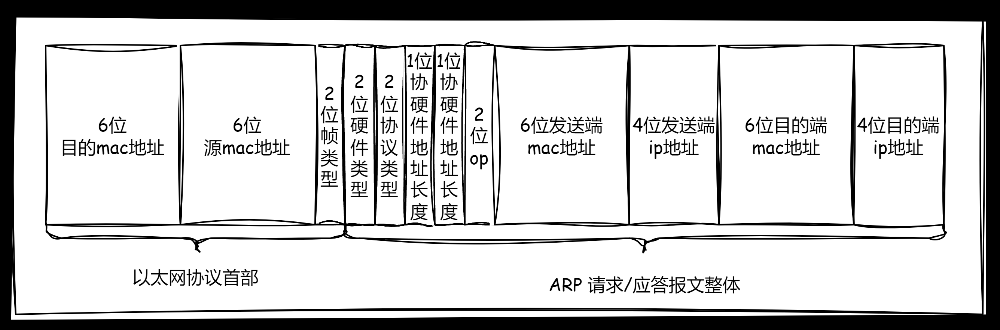
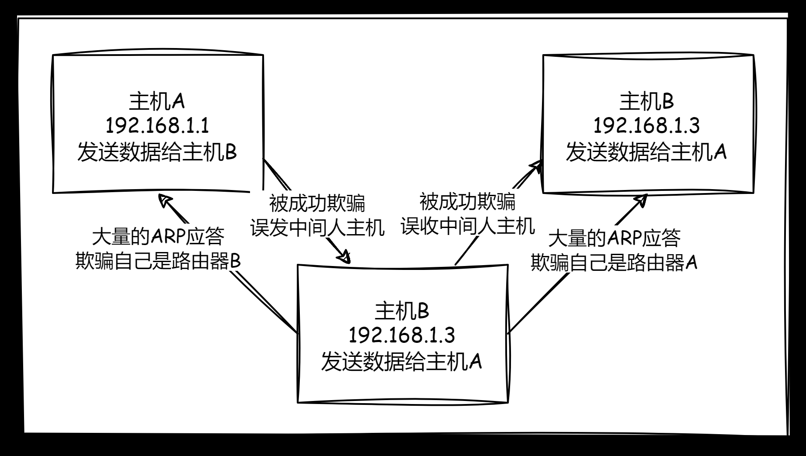

**叠甲：以下文章主要是依靠我的实际编码学习中总结出来的经验之谈，求逻辑自洽，不能百分百保证正确，有错误、未定义、不合适的内容请尽情指出！**

[TOC]

>   概要：...

>   资料：...

---

以太网实际上就是一种局域网技术，全称以太网协议。本身不是一种具体的网络，而是一种技术标准。除了以太网，还可以使用无线局域网（`Wi-Fi`）、令牌环（`Token Ring`）等技术来搭建局域网，实现设备之间的网络通信。

另外，由于十分接近网络的具体实现，以太网协议除了软件方面的规定（也就是帧格式），还制定了一些物理规定，例如必须使用双绞线（起始就是带有水晶头的电脑网线）来搭建局域网，传输速率规定分级为 `10M、100M、1000M` 等。

同样，您需要带着 **如何保证数据交付给下一个主机** 的目的去看待以太协议。

# 1.协议结构

以太网协议是一种链路层的协议，其对应的软件规定主要是对以太网的帧格式规定，帧格式如下：



这里的目的地址和源地址填写的是 `MAC` 地址（物理地址），用于识别数据链路层中相邻的节点，不使用 `ip` 的主要原因很可能是为了概念解耦。而类型（可填入 `0800\0806\8035` 类型）是由上层协议决定的，用于进行不同网络协议的交付。数据字段中主要填充 `IP` 报文，当然也可以是网络层的其他协议报文。

# 2.封装分离

其解包过程很简单，报头也是定长的，很容易分离和交付，同时还需要根据 `2` 字节类型来向上交付，也是类似进行指针移动填充数据来添加报头。

# 3.报文管理

待补充...

# 4.协议特点

## 4.1.局域网络的通信原理

### 4.1.1.通信原理

`mac` 地址是在网卡中独有的一串数字序列，每个网卡携带的 `mac` 地址是全球唯一的（但是不排除某些虚拟机可以虚拟一个虚拟 `mac` 地址）。使用 `ifconfig` 就可以看到使用 `:` 分割的 `mac` 地址，一般是一个网卡对应一个不变的 `mac` 地址。

`mac` 地址为路由转发提供依据，`ip` 地址只是标识源地址和目的地址，而 `mac` 是报文传输过程中上一站和下一站的地址。`mac` 地址会根据路由转发的变化而常常变化，但是 `ip` 地址保存不变，这两套地址本身并不冲突，甚至可以说因为两者是两个层中解耦开的概念，所以两者毫无关系。

我们先考虑在一个局域网中的通信，局域网中的一个计算机发送以太报文后，所有的计算机都会收到广播消息，但是只有对应 `mac` 地址的计算机会对报文进行接受（其他计算机都会解包报文进行，发现目的 `MAC` 地址和自己不符合就直接进行丢弃，上层感知不到就会认为计算机根本没有收到数据）。对应 `mac` 地址的计算机在收到报文后，解包以太报文后，根据 `IP` 头中的 `8` 位协议类型交给对应的 `TCP/UDP`，因此在一直向上解包直到应用层得到需要的数据即可。而如果这个过程逆向来看，就是一个返回消息的过程。

>   补充：但是有些网卡是可以通过设置“混杂模式”来获取所有的报文，对所有以太报文都不进行丢弃，这也是一些抓包工具的原理。

### 4.1.2.碰撞域

但上述的通信方案是带有漏洞的，网络中会有大量的数据在同时发送（相对于在喧嚣的人群中进行 `1` 对 `1` 交流），这个时候就会出现数据碰撞问题。首先我们把一个可能发送碰撞的局域网称为一个 **碰撞域**。

### 4.2.3.碰撞算法

那发送机器和接受机器怎么察觉到碰撞的诞生呢？并且如何避免更大的碰撞呢？这就需要谈到碰撞检测算法和碰撞避免算法。

一旦检测出碰撞，就会发送主机就会休眠一段时间，等待网络不再过堵再进行发送。而局域网实际上就是一份共享资源，因此这个过程看起来有点像加锁，因此避免碰撞的思路和锁的思路有些类似，这里的解决方案就是试探，碰撞了就再试直到成功。

>   吐槽：因此局域网如果太大，出现碰撞的概率就越大，从这里也可以看出运营商硬件的强大之处。

>   注意：关于碰撞检测算法和碰撞避免算法，您也可以前去了解一下，这里不展开细讲...

### 4.2.4.碰撞划分

另外，网络中还有一种叫做 **交换机** 的桥接设备，可以做到在同一个局域网中，只将数据包发送到通局域网内的目标设备，拦截下发送到其他地方的广播报文，因此可以减少网络流量，避免造成碰撞的垃圾数据在广大的网络中进行扩散。因此交换机的最大作用就在于划分碰撞域，减少碰撞的概率，避免网络拥塞产生的干扰。

>   注意：关于交换机，您也可以前去了解一下，这里不展开细讲...

### 4.2.5.碰撞洪泛

局域网数据帧发送的时候。越长越好还是越短越好？两者都不好，太长容易发生碰撞，太短传输效率变低。因此一般会规定一个数据长度最小是 `46` 字节，最大字节未 `1500` 字节，不够 `46` 字节也需要补充位。这个数据也就是 `mtu(最大传输单元)` 的范围，之前网络层的时候我有简单提及过，这也导致了上述数据如果需要避免过多的碰撞就需要对数据大小进行限定，出现 `TCP` 传输报文的 `mss(最大段尺寸)` 规定。

>   补充：不同主机设定的 `mss` 可能不太一样，因此早在三次握手中发送 `SYN(TCP连接类型报文)` 的时候，双方会得知各自的 `mss` 值，协商选择较小的作为最终 `mss` 的值，这个值最终会包含在 `tcp` 报文的选项中。

如果我们绕过数据链路层的碰撞避免算法，就会导致一台主机不会因为碰撞进入休眠，而是不断发送数据，这个时候就是为了碰而碰，就会导致“碰撞洪泛（`Collision Flooding`）”的攻击。

## 4.2.Mac 地址更替和 ARP 协议

### 4.2.1.ARP 协议结构

在网络转化过程中，`ip` 地址不变，`mac` 地址会发生变化么？会的，并且变化很快！但是下一跳的 `mac` 地址是怎么获取呢？这就有点小 `bug` 了，发送端的 `源mac` 地址还无所谓很容易获取，但是下一跳的 `目的mac` 地址怎么获取呢？如果没有 `目的mac` 地址就没有办法对以太报文进行封装。

首先每台网络设备都有自己的 `mac` 地址，一个报文到达某个硬件后，源 `mac` 地址会被替换为这个地址，但是目的 `mac` 地址怎么办呢？这就会涉及到 `ARP` 协议了。`ARP` 协议是在链路层之上的协议。我们虽然没有 `mac` 地址，但是有需要发送的目标 `ip` 地址。因此我们就需要在同一个网段中，通过目标 `ip` 解析出 `目标mac` 地址。而对应的解析协议就是 `ARP` 协议，也就是地址解析协议（局域网协议）。

只有通过 `ARP` 协议解析得到目的 `mac` 地址，才能成功封装以太报文。

>   补充：实际上这个协议可以算是一种子协议（以太网协议中有一个帧类型协议，就可以填入这种协议类型）。



上图就是以太报文中 `28` 字节的 `ARP` 请求/响应报文，因此 `ARP` 协议其实是链路层和网络层中间的一种协议。

-   `2` 位的硬件类型指链路层网络类型，以太网就是 `1`，也可能是其他值
-   `2` 位协议类型指要转化的地址类型，如果填入 `0x0800` 则表示要把 `ip` 地址转化为 `mac` 地址，也可能是其他值
-   `1` 位硬件地址长度对于以太网来说是 `6` 字节的 `mac` 地址长度
-   `1` 位协议地址长度对于 `ip` 地址来说是 `4` 字节的 `ip` 地址长度
-   `2` 位 `op` 字段若为 `1` 就是 `arp` 请求，为 `2` 代表 `arp` 应答。任何主机都可以发送 `arp` 请求，也可能接收到别人的 `arp` 请求，亦或者是别人的应答，因此可以使用 `op` 来进行请求和响应区别
-   剩下的地址都比较简单明了，这里不详说

### 4.2.2.ARP 解析过程

**对于请求**，发送端的 `源mac` 地址和发送端 `源ip` 地址对发送端来说很容易获取，并且也可以从上层知道 `目标ip` 地址，这三个地址都可以直接填入上述 `arp` 报文中的对应字段中。但是 `目标mac` 地址暂时无法得知，因此会被设置为全 `f`（也就是比特位全置为 `1`，这是相当于一个广播地址）。并且把 `op` 字段设置位 `1`，设置好两个长度和两个类型。然后开始进一步封装为以太报文，还记得以太报头中的帧类型么？除了填写 `0800` 的 `IP` 类型，还可以填写 `0806` 噢！代表以太报文的正文内容不是 `ip` 而是 `arp`。而以太报头中的 `源mac` 地址发送端也是只知道的，`目的mac` 地址也是填写全 `f`。到此就封装了一个以太报文，由于 `目的mac` 地址是广播地址，这就代表同局域网中的网络设备都会收到这个以太报文。

**对于响应**，收到广播的以太报文后，对应的网络设备先检查 `op` 字段，先各自在内部进行向上交付，查看 `op` 字段是否为 `arp` 请求，若是且 `arp` 请求中的 `目的端ip` 就是自己，则开始封装 `arp` 响应（不满足这两个条件就把报文在 `arp` 层就直接进行丢弃）。把自己的 `mac` 地址作为 `目的mac` 填充回 `arp` 报文中的 `6` 位 `目的端mac` 地址后，再做 `ip` 封装进行 `1对1` 应答来返回（因为此时的报文四个地址都是清晰明了的，可以直接发送给目标设备）。此时发送请求的主机收到 `arp` 响应后，先看 `op` 查看是否为响应，然后检查 `arp` 报文中的 `发送端ip` 地址和自己本机的 `ip` 地址是否相同，相同就收到该响应，此时就相对于获取到了 `目的端mac` 地址。

**缓存映射**，是不是每次发送都需要进行 `ARP` 解析呢？其实 `ARP` 解析成功后，会暂时将 `ip/mac` 的关系保存为一个缓存映射表（每次都保存最新的映射条目），以后请求相同的 `ip` 时就可以直接加载 `mac` 地址，这样就可以提高解析效率。不过这种存储是有时间限制的（不过缓存的时间其实也比较长，可以以小时为单位），其原因是再 `mac` 地址中，有些节点可能会下线，导致 `mac` 节点网络发生变动，此时可能需要重新解析 `ip/mac` 的关系，并且也有可能该主机下线后主动发送自己的 `mac` 地址暂时下线的报文，通知所有缓存该 `mac` 和对应 `ip` 条目的主机删除该条目。

上述过程就是较为完整的一次 `ARP` 解析 `目的端ip` 地址向 `目的端mac` 地址过程，多次解析后会对多条映射缓存。而这个过程不仅仅是在一个局域网中解析完成，还可以解析路由器的 `目的ip`，解析出其对应的 `mac` 地址，最终可以把数据发送给该路由器。而在路由器在转发给其他组建子网的路由器时，路由器之前也可能发生 `ARP` 解析，进而达到跨域解析的效果。

>   补充：上面报文图中，以太协议报头和 `arp` 中报文中的字段会重复冲突么？答案是不会，这是合理的行为。一方面是为了分层解耦，另一方面是因为以太协议报头中的地址主要是为了报文的传输发送，`arp` 报文中的地址主要是为了等待填充 `mac` 地址。两者的作用不同，重复也是没办法的事。

>   补充：如果想获取一下自己局域网络中的所有 `mac` 地址会怎么做？很简单，只需要 `ping` 所有的 `私网ip` 地址即可，`ping` 的时候其实就会自动执行 `ARP` 的过程。
>
>   ```shell
>   # 获取所有 mac 地址的 shell 脚本(bash)
>   cnt=1
>   while [ $cnt -le 254 ]; do 
>      ping -c 1 "您所在的网络号.$cnt" # 最后一个 cnt 其实是主机号
>      let cnt++
>   done
>   ```
>
>   而如果使用 `cmd`，可以使用下面的脚本。
>
>   ```shell
>   # 获取所有 mac 地址的 shell 脚本(cmd)
>   @echo off
>   setlocal enabledelayedexpansion
>   
>   set cnt=1
>   
>   :loop
>   ping -n 1 "您所在的网络号.%cnt%"
>   
>   set /a cnt+=1
>   goto loop
>   
>   endlocal
>   ```
>
>   然后在命令行中使用 `arp -a` 即可获取所有的 `mac` 地址。

>   补充：以太报头中还有一种类型是 `RARP` 协议，其实就是 `RAP` 的逆向过程，通过 `mac` 地址获取 `ip` 地址，不过这种类型的解析比较简单，有 `mac` 地址是很容易获取 `ip` 地址的，因为我们有之前做 `RAP` 解析的缓存表。

>   补充：一种称为中间人的方案
>
>   如何通过 `ARP` 攻击，让自己成为攻击人呢？如果主机 `C` 一直向主机 `B` 发送大量的 `ARP` 应答，又向主机 `A` 发送大量的 `ARP` 应答，最后中间人既做 `A` 又作 `B`。由于主机中的映射缓存只会存储最新的映射条目，因此就有可能被中间人所欺骗。
>
>   
>
>   因此可能会出现 `ARP` 中间人的两种攻击：
>
>   1.  **ARP 欺骗（ARP Spoofing）**：攻击者发送虚假的 `ARP` 响应，将受害者发送到目标主机的流量重定向到攻击者控制的设备上，导致用户数据发生窃取。
>   2.  **ARP 投毒（ARP Poisoning）**：攻击者发送虚假的 `ARP` 响应，将合法的 `ARP` 缓存条目替换为攻击者控制的设备的 `MAC` 地址，导致用户主机被迫下线。
>
>   当然在有 `https` 协议的帮助下数据还是不会被直接篡改和获取的，但是还是会影响到上网情况，导致主机被迫下线。**这里需要强调，不要使用这一项技术对应的工具做违法乱纪的事情！**
>

# 5.协议目的

以太协议依靠 `mac` 地址传递报文数据，其逐跳的目的就是为了保证数据交付给下一个主机。

>   警告：从这一层我们可以注意到 `IP` 是链路层以上的概念，端口号是传输层以上的概念（后面的层级完全不关心这个概念），`MAC` 是链路层的概念，造成这种现象的原因其实就是分层解耦，但是又有些概念不得不“藕断丝连”的结果。因此有些数据传输是不依赖端口号的，甚至连 `IP` 都不需要...

---

>   结语：
