**叠甲：以下文章主要是依靠我的实际编码学习中总结出来的经验之谈，求逻辑自洽，不能百分百保证正确，有错误、未定义、不合适的内容请尽情指出！**

[TOC]

>   概要：...

>   资料：...

---

以太网实际上就是一种局域网技术，全称以太网协议。本身不是一种具体的网络，而是一种技术标准。除了以太网，还可以使用无线局域网（`Wi-Fi`）、令牌环（`Token Ring`）等技术来搭建局域网，实现设备之间的网络通信。

另外，由于十分接近网络的具体实现，以太网协议除了软件方面的规定（也就是帧格式），还制定了一些物理规定，例如必须使用双绞线（起始就是带有水晶头的电脑网线）来搭建局域网，传输速率规定分级为 `10M、100M、1000M` 等。

# 1.协议结构

以太网协议是一种链路层的协议，其对应的软件规定主要是对以太网的帧格式规定，帧格式如下：


这里的目的地址和源地址填写的是 `MAC` 地址（物理地址），用于识别数据链路层中相邻的节点，不使用 `ip` 的主要原因很可能是为了概念解耦。而类型（可填入 `0800\0806\8035` 类型）是由上层协议决定的，用于进行不同网络协议的交付。数据字段中主要填充 `IP` 报文，当然也可以是网络层的其他协议报文。

# 2.封装分离

其解包过程很简单，报头也是定长的，很容易分离和交付，同时还需要根据 `2` 字节类型来向上交付，也是类似进行指针移动填充数据来添加报头。

# 3.报文管理

待补充...

# 4.协议特点

## 4.1.MAC 地址

`mac` 地址是在网卡中独有的一串数字序列，每个网卡携带的 `mac` 地址是全球唯一的（但是不排除某些虚拟机可以虚拟一个虚拟 `mac` 地址）。使用 `ifconfig` 就可以看到使用 `:` 分割的 `mac` 地址，一般是一个网卡对应一个不变的 `mac` 地址。

mac 地址为路由转发提供依据，ip 地址只是标识源地址和目的地址，而 mac 是报文传输过程中上一站和下一站的地址。mac 地址会根据路由转发的变化而常常变化，但是 ip 地址保存不变，这两套地址本身并不冲突，甚至可以说因为两者是两个层中解耦开的概念，所以两者毫无关系。

实际上一个局域网内的所有计算机都收到消息（广播），但是只有对应的计算机两者会相互对应（都会根据链路报文进行对不，源和目的 `MAC` 地址不符合就丢弃，符合就保留进行数据分离然后向上交付）。

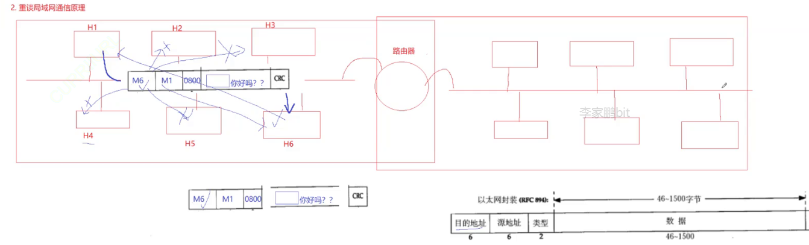

而路由器本身就有 `MAC` 地址，就可以在不同路由器之间进行跳转。

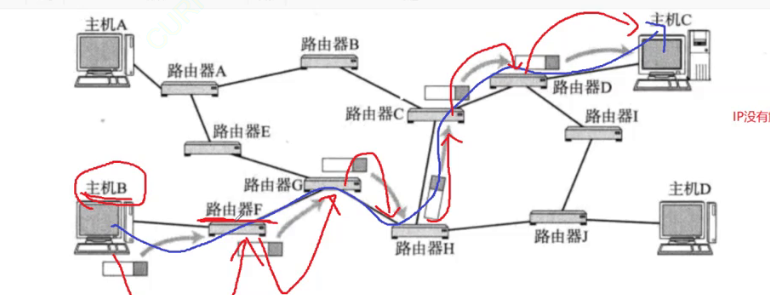

## 4.2.协议漏洞

但是这种方案是有点漏洞的，网络中会有大量的数据在发送（在喧嚣的人群中1对1交流），怎么保证我想发送数据的同时别人也想发呢？也就会出现数据碰撞问题。首先数据碰撞时，发送端是可以察觉到的。数据碰撞会导致数据无法使用，因此最好是避免碰撞，但是必须尝试碰撞才能知道是否碰撞，需要依赖碰撞算法，一定碰撞就会休息随机时间。

而且这个局域网实际上就是共享资源，因此这歌过程看起来有点像加锁，因此避免碰撞的思路和加锁解锁的思路有些类似，这里的解决方案就是试探，碰撞了就再试，直到成功（加锁失败就等待后重新加锁）。

因此局域网如果太大，出现碰撞的概率就越大（可以看到运营商的硬件强大之处）。

而交换机（桥接设备），只将数据包发送到目标设备，而不是广播到所有设备，因此可以减少网络流量，提高网络性能和效率（避免碰撞造成的垃圾数据扩散。并且数据帧如果发送到交换机的同一侧，就不需要再广播到另外一侧。因此交换机的最大作用就在于划分碰撞域）。

局域网数据帧发送的时候。越长越好还是越短越好？长的话就有可能会容易发生碰撞，如果太短了就会让传输效率变低。

因此一般会规定一个数据长度最小是 `46` 字节，最大字节未 `1500` 字节，不够 `46` 字节也需要补充位（也就是 `MTU` 的范围）。

如果我们绕过数据链路层的碰撞避免算法，就会导致一台主机不会因为碰撞进入休眠，而是不断发送数据，这个时候就是为了碰而碰，就会导致“碰撞洪泛（Collision Flooding）”的攻击。

在网络转化过程中，目的 `IP` 不变，`MAC` 帧报头会发生变化么？会的，并且变化很快！

但是下一跳的 `MAC` 地址怎么获取呢？这有点小 `BUG`，没有下一跳的 `MAC` 地址就没有办法进行封装。

每台计算机都有自己的 `MAC` 地址。

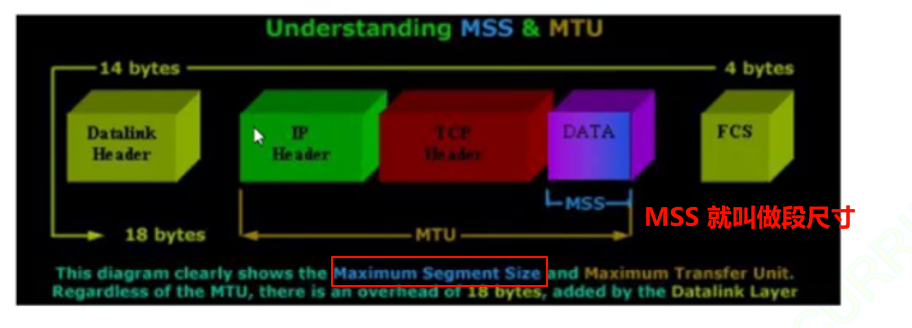

如果限定在 `TCP/IP`，则

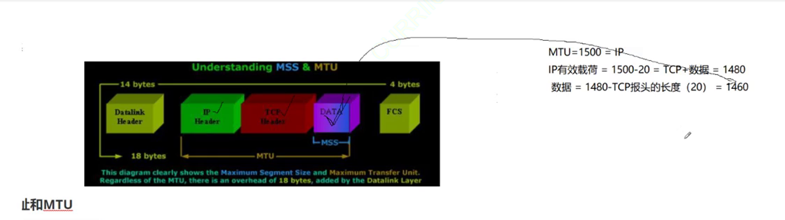

`MSS` 不能大于 `1460`，`Linux` 下可以使用 `ifconfig` 来查询。

早在发送 `SYN(TCP连接类型报文)` 的时候，双方会得知各自的 `MSS` 值，协商选择较小的作为最终 `MSS`，这个值包含在 `TCP` 的选项中。

`ARP` 协议是介于数据链路层和网络层的协议。我们虽然没有 `MAC` 地址，但是有需要发送的目标 `IP` 地址。因此我们就需要在同一个网段中，通过目标 `IP` 解析出 `MAC` 地址，这个东西就是 `ARP` 协议，也就是地址解析协议（局域网协议）。

实际上这个协议可以算是一种子协议（以太网协议中有一个帧类型协议，就可以填入这种协议类型）。

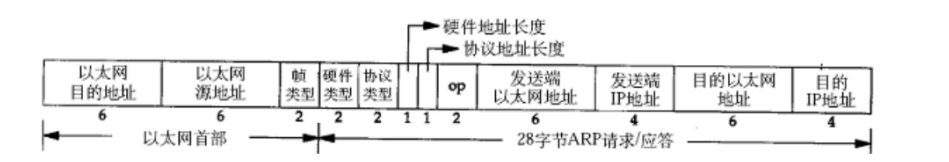

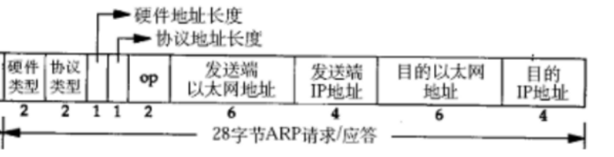

下面过程就是 `ARP` 过程：

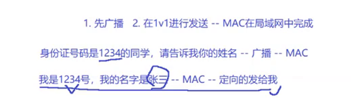

其中 `2` 字节的硬件类型指链路层网络类型（是以太网就是 `1`），协议类型指要转化的地址类型 `0x0800` 为 `IP` 地址，硬件地址长度对于以太网来说是 `6` 字节，协议地址长度对于 `IP` 地址来说为 `4` 字节。

`OP` 字段为 `1` 就是 `ARP` 请求，为 `2` 代表 `ARP` 应答。

发送端的以太地址（`MAC`地址）和发送端 `IP` 地址对发送端来说很容易获取，并且也直到目标 `IP` 地址，但是目标 `MAC` 地址暂时无法得知（会被设置为全 `f`）。任何主机都可以发送 `ARP` 请求，也有可能接收到别人的 `ARP` 请求，亦或者是别人的应答（因此可以使用 `OP` 来进行区别）。

然后通过广播来获取 `ARP` 应答（其他主机如果处理就是做向上交付，然后继续封装应答的操作，不处理就是向上交付后直接进行丢弃），`ARP` 应答就会把目的 `MAC` 填充回去做应答。

>   疑惑：arp 协议有上层么？还是为了确认 `MAC` 直接构造的？

对于主机收到 `ARP` 请求后，先看 `OP` 查看是否为请求，然后检查 `IP` 地址和自己本机的 `IP` 地址是否相同，相同就受到该请求，然后把自己的 `MAC` 地址填充进去，然后把 `OP` 修改为 `2` 为应答，然后继续进行广播。

然后发送端 `IP` 修改为自己的，将原本的发送端 `IP` 复制到目的 `IP`，然后把原来请求的 `MAC` 地址复制到 目的 `MAC` 地址即可。

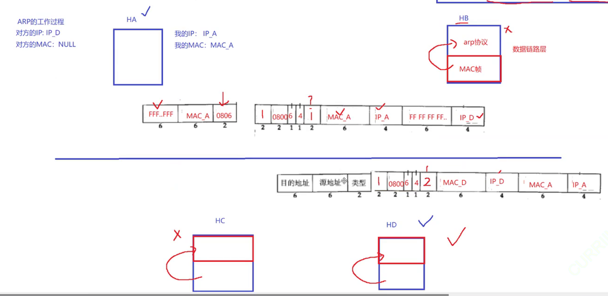

上面示意图中，`以太` 协议报头和 `ARP` 中会冲突么？答案是不过，这是合理的（为了解耦）。

但这次就算是广播，不对应的主机也不会做应答了，因为 `MAC` 帧的目的地址和源地址（MAC地址）字段都可以被其他主机直接感知到，无需处理直接丢弃即可。

因此上述两次丢弃的场景是不太一样的。

接下来这个时候主机立马就意识到这是给自己的，然后也是先查看 `op` 是请求还是应答，再得到目的 `MAC` 地址，最终 `MAC` 帧的数据链路层协议就可以拿到 `MAC` 地址。

那是不是每次都需要进行 `ARP` 呢？是不是只会在目标最终的子网中进行 `ARP`，其他地方会不会生 `ARP` 呢？

其实 `ARP` 请求成功后，会暂时将 `IP`、`MAC` 的关系保存下来，以后请求相同的 `IP` 时就可以直接加载 `MAC` 地址，不过是有时间限制（原因是 `MAC` 地址中，有些节点会下线，导致 `MAC` 节点网络发生变动）。

如果我想获取一下自己局域网络中的所有 `MAC` 地址会怎么做？

```shell
cnt=1; while [ $cnt -le 254 ]; do ping  "1.0.8.$ent"; let cnt++; done
```

如何通过 `ARP` 攻击，让自己成为攻击人呢？如果主机 `C` 一直向主机 `B` 发送大量的 `ARP` 应答，又向主机 `A` 发送大量的 `ARP` 应答，最好中间人既做 `A` 又作 `B`。

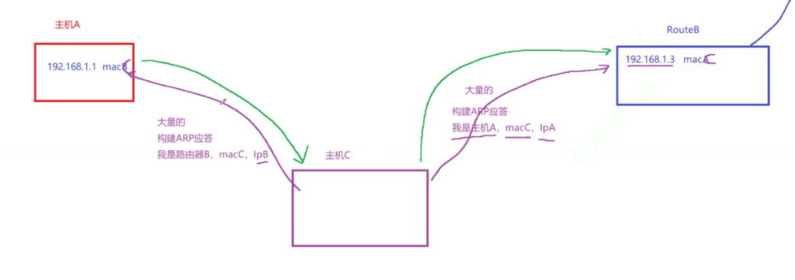

此时就可能发生篡改主机 `A` 的数据。

1.  ARP欺骗（ARP Spoofing）：攻击者发送虚假的ARP响应，将受害者发送到目标主机的流量重定向到攻击者控制的设备上。
2.  ARP投毒（ARP Poisoning）：攻击者发送虚假的ARP响应，将合法的ARP缓存条目替换为攻击者控制的设备的MAC地址。

当然在有 `https` 协议的帮助下还是不会被篡改的，但是会影响到上网情况。

其他

还有一点，路由器本身也有可能是另外一个子网中的主机，每个路由器本身有 `LAN ip` 和 `WAN ip`。


在路由器中，LAN IP（局域网IP）和WAN IP（广域网IP）分别代表不同的IP地址：

1.  LAN IP（局域网IP）：
    *   LAN IP是指路由器在局域网内部使用的IP地址。这个IP地址通常是私有IP地址，例如192.168.x.x、10.x.x.x或172.16.x.x范围内的地址。
    *   LAN IP地址是路由器分配给本地局域网内连接的设备的IP地址，用于在局域网内部进行通信和数据传输。
2.  WAN IP（广域网IP）：
    *   WAN IP是指路由器连接到互联网服务提供商（ISP）网络的外部IP地址。这个IP地址是在全球唯一的，是路由器与Internet上其他设备进行通信的地址。
    *   WAN IP地址通常是ISP分配给路由器的公共IP地址。它是路由器在互联网上识别和访问的地址，用于连接到Internet服务、访问Internet资源以及接收来自Internet的数据流量。

## 4.3.NAT 技术

的工作原理如下：

1.  内部设备（例如家庭或企业网络中的计算机、智能手机、平板电脑等）通常使用私有IP地址，例如在IPv4中使用的地址范围是10.x.x.x、192.168.x.x、172.16.x.x - 172.31.x.x。
2.  当内部设备要访问Internet上的资源时，它们的数据包首先发送到路由器或防火墙。
3.  路由器或防火墙上的NAT设备会将这些数据包的源IP地址和端口转换成路由器或防火墙的公共IP地址和端口，然后将它们发送到Internet上。
4.  当Internet上的响应数据包返回时，NAT设备将其目标IP地址和端口转换回原始内部设备的私有IP地址和端口，并将数据包发送到相应的内部设备。

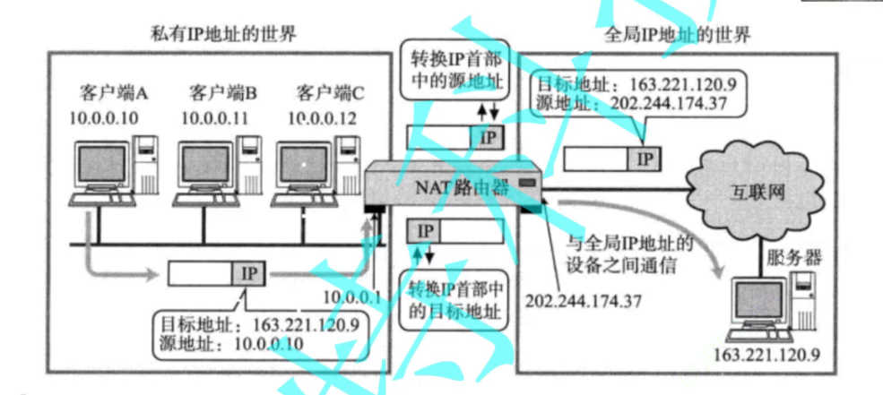

`NAT` 路由器将源地址从 10.0.0.10 替换成全局的IP 202.244.174.37（全局ip不一定是公网ip，可能是更大的子网私网ip）

`NAT` 路由器收到外部的数据时, 又会把目标IP从202.244.174.37替换回10.0.0.10;

在NAT路由器内部, 有一张自动生成的, 用于地址转换的表

当 10.0.0.10 第一次向 163.221.120.9 发送数据时就会生成表中的映射关系

因此就可以大大减少 `ip` 数量问题。

但是问题是转回来时，怎么识别发给哪一台主机呢？局域网内，有多个主机都访问同一个外网服务器，那么对于服务器返回的数据中，目的 `IP` 都是相同的。那么 `NAT` 路由器如何判定将这个数据包转发给哪个局域网的主机?

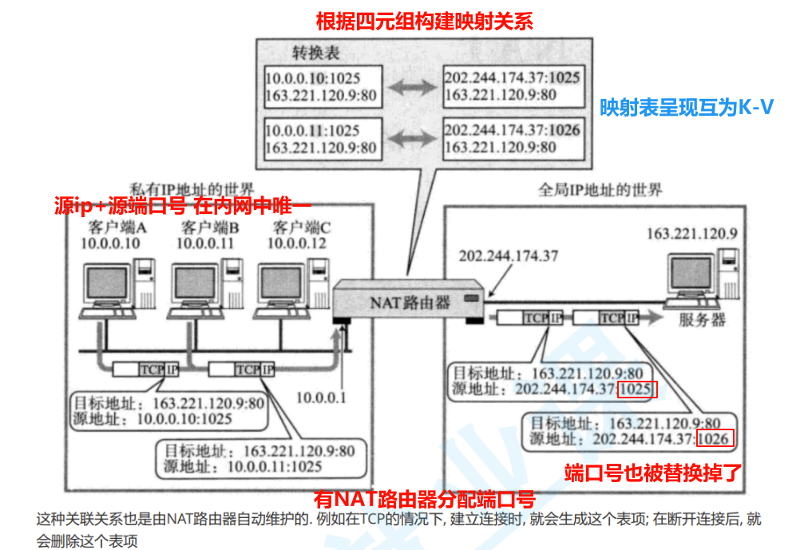

如果我重来没有访问过外网，那么外网能不能直接访问内网呢？理论上是不可以的，因此某些魔法的原理就可以做到基于 `NAT` 原理的外围访问内网的内网穿透，某些工具可以定期向某个服务器发送请求，然后使 `NAT` 建立映射关系条目，然后服务器就可以直接访问内网了。

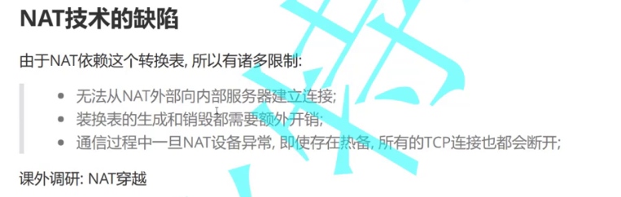

## 4.4.代理服务

代理服务器和 `NAT` 设备有点像，代理服务器往往具有 `NAT` 设备的功能。

校园网需要验证登录，浏览器弹出一个网站，输入账号和密码才允许上网和密码。

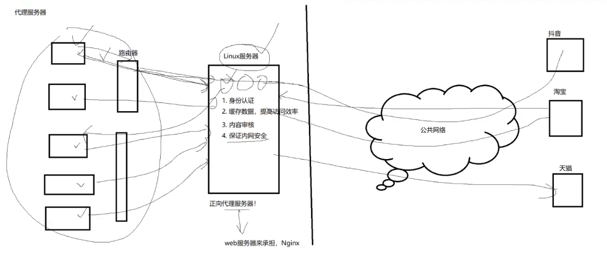

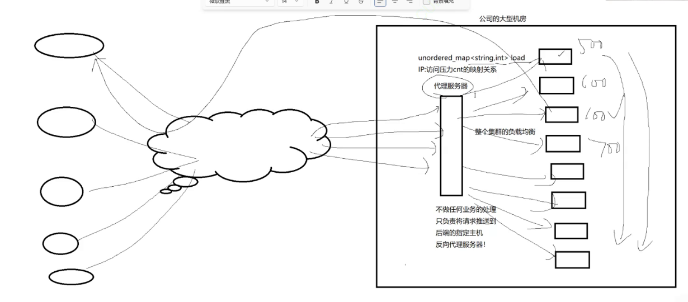

正向代理服务器和反向代理服务器是两种不同类型的代理服务器，它们的功能和工作方式有所不同：

1. **正向代理服务器（Forward Proxy）**：
    - 正向代理服务器代表客户端进行网络请求，并将请求转发给目标服务器。客户端向代理服务器发出请求，然后代理服务器将请求发送到Internet上的目标服务器，并将响应返回给客户端。
    - 正向代理服务器常用于隐藏客户端的真实IP地址、访问控制、缓存、安全过滤等用途。例如，访问受限制的网站、绕过防火墙、加速访问速度等。

2. **反向代理服务器（Reverse Proxy）**：
    - 反向代理服务器代表目标服务器接收并处理客户端的请求，然后将请求转发到一个或多个后端服务器，并将后端服务器的响应返回给客户端。客户端认为它们直接与反向代理服务器通信，而不是与实际的后端服务器通信。
    - 反向代理服务器通常用于负载均衡、缓存、SSL终端、安全控制、Web应用程序防火墙等用途。它可以隐藏后端服务器的真实IP地址，提供高可用性和性能优化，同时对外部网络提供一个单一的入口点。

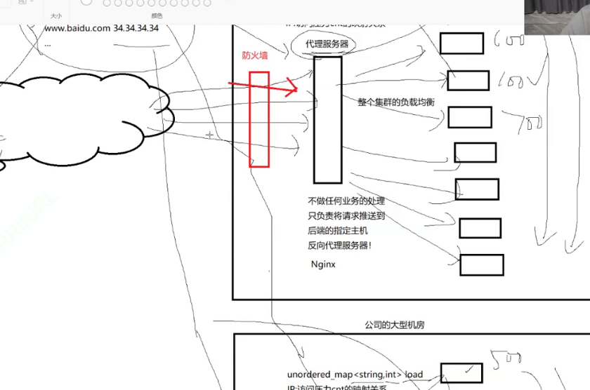

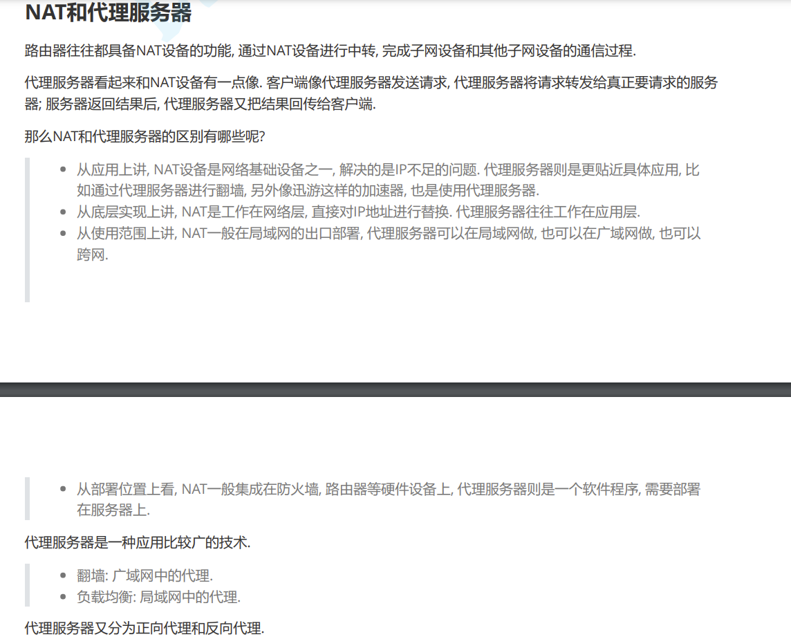

基于魔法阵理论的魔法实现。

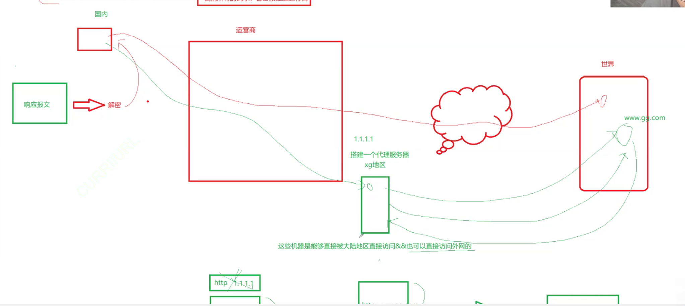

因此魔法属于正向代理（不是反向，反向不会响应接受，只做均衡，但是正向是请求和响应都要接手）。

# 5.协议目的

待补充...

---

>   结语：...
