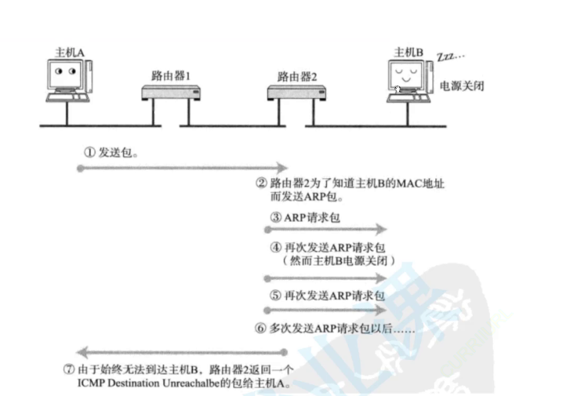
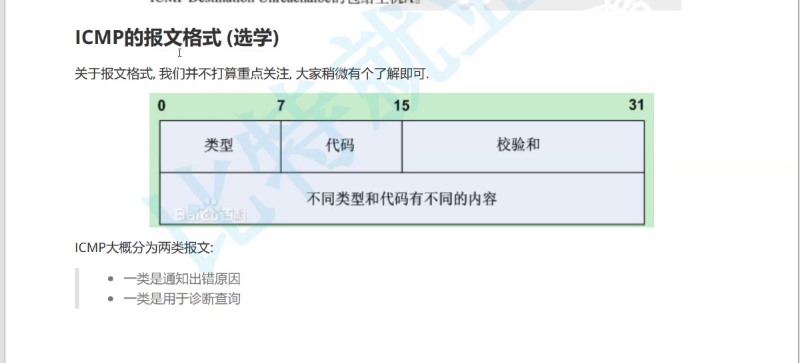
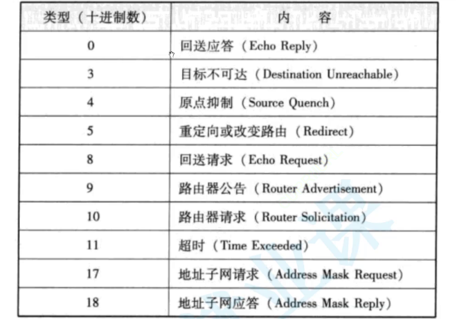

# 1.DNS 协议

`DNS` 是一套从域名映射到 `IP` 的系统，属于应用层协议。内部大多使用 `UDP` 协议，并且多用于浏览器的 `URL` 解析中。主要是方便人们使用容易记忆的域名来访问难以记忆的 `ip` 地址字符串。因此域名其实不是因为技术诞生的，只是为了方便不了解技术的人们使用。而一个完整域名一般可以切分为几类：

1.  **顶级域名(TLD)**：
    -   **通用顶级域名(gTLD)**，如 `.com`、`.net`、`.org` 等，可以被任何人注册使用
    -   **赞助顶级域名(sTLD)**，由某些组织或行业赞助，如 `.jobs`、`.travel`
    -   **国家代码顶级域名(ccTLD)**，由各个国家或地区管理，如 `.cn`（中国）、`.us`（美国）、`.uk`（英国）
    -   **新顶级域名(nTLD)**，随着互联网的发展，新引入的顶级域名，如 `.blog`、`.online`
    -   **保留域名**，根据 `DNS` 规范，某些域名被保留，不能被注册或使用，如 `.test`、`.example`
2.  **二级域名(SLD)**，这是位于顶级域名之下的域名，如在 `google.com` 中的 `google` 就是二级域名
3.  **子域名(Subdomain)**，位于二级域名之下，可以用于组织内部的不同部门或服务，如 `mail.google.com` 中的 `mail`

而域名解析就需要根域名服务器，只要这个服务器挂掉，所有的域名解析都会停止（但是能使用 `ip` 地址访问）。在 `Linux` 下也有域名解析的工具 `dig`，您可以稍微使用一下。

# 2.ICMP 协议

网络层中最主要的协议就是 `IP` 协议，但是在测试网络的时候，还可能会使用到 `ICMP` 和 `IGMP` 这两种网络层协议，我们重点讲解 `ICMP`。有可能组建局域网的管理员需要检查网络健康状态，就可能需要使用这种不以数据传输作为目的的协议。单纯发送 `IP` 报文时，如果对端主机掉线导致丢包，组建子网的路由器不会给发送方主机任何响应。因此这种情况下就很难检查网路的健康状态，一旦网络出现问题，只能得到丢包的粗浅结论（但是无法得知具体是哪一个设备丢包了）。

因此操作系统会提供特殊的套接字接口，允许绕过传输层，直接使用网络层的 `ICMP` 协议发送 `icmp` 报文，但是这种报文正文中放的就是 `ARP` 的报文。此时发送方发送 `icmp` 报文给路由器后，如果接收端出现丢包问题，路由器不会直接把 `icmp` 报文丢弃，而是会进行响应。响应中会携带网络传输出错的具体原因（设置在报头中），这样检查网络状态就会比较方便。

`ping` 命令经常用来检测网络状态，这个命令底层的实现逻辑就是一个应用层程序通过特殊的套接字接口直接绕到网络层使用 `ICMP` 协议的例子。而这种特殊套接字就是原始套接字，常用于编写一些常见的网络工具（我们之前用的大部分都是网络套接字）。而由于这一层没有端口号的概念，那么原始套接字的调用中也绝对不用用到端口号的设置...

>   补充：要实现这种机制，路由器本身也需要支持在网络层的 `ICMP` 协议的实现。

>   补充：`ICMP` 协议目前只支持 `ipv4`，想使用 `ipv6` 就只能使用 `ICMPv6` 协议。

# 3.待补充...

