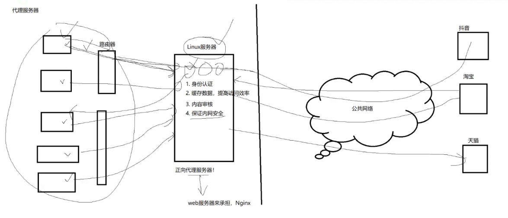
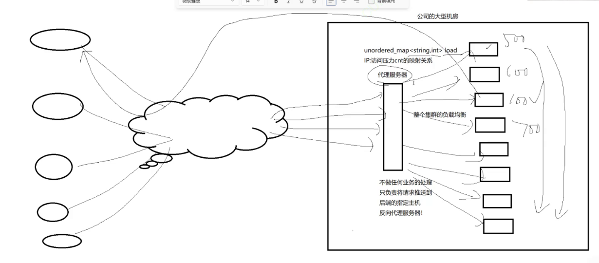
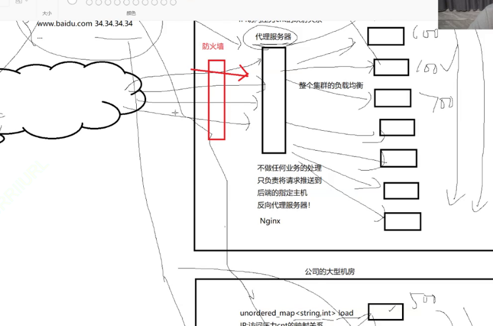
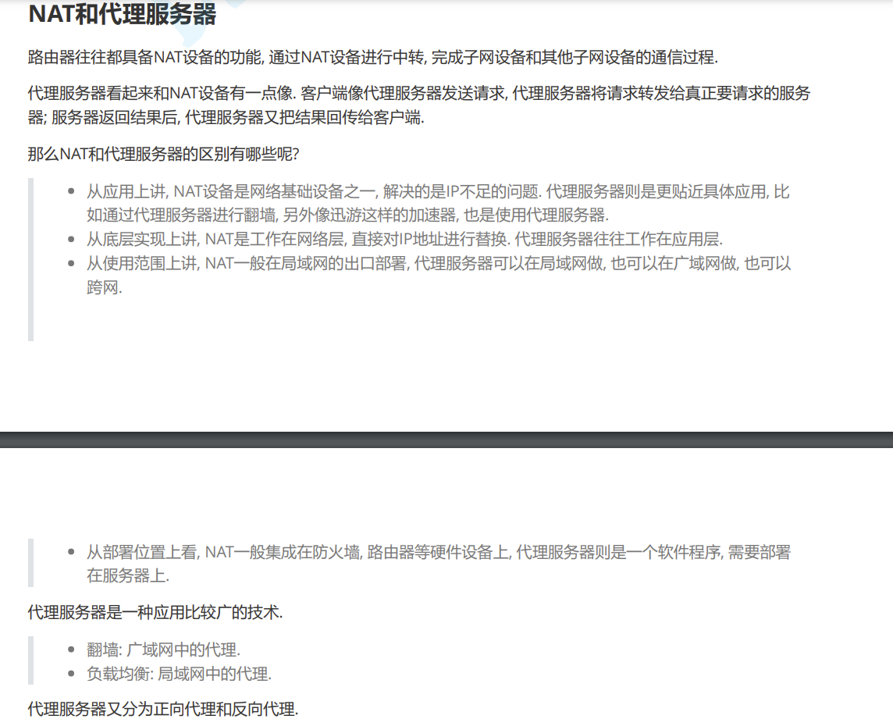
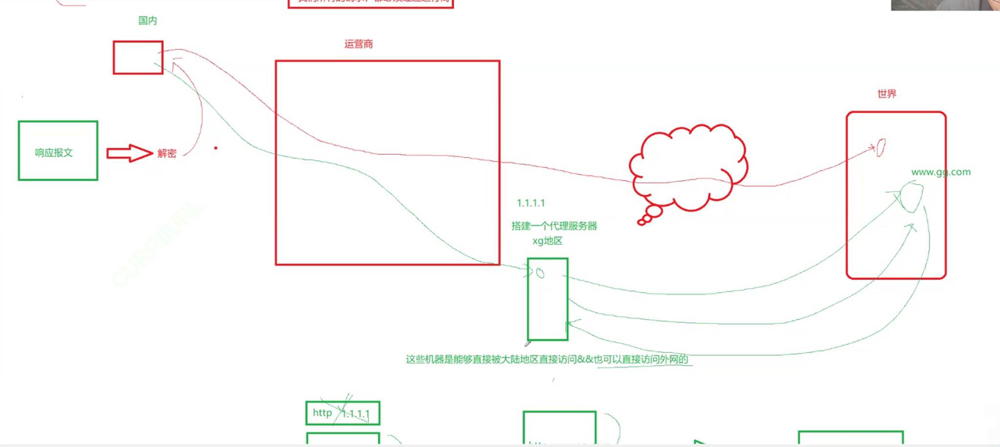

代理服务器和 `NAT` 设备有点像，代理服务器往往具有 `NAT` 设备的功能。

校园网需要验证登录，浏览器弹出一个网站，输入账号和密码才允许上网和密码。

正向代理服务器和反向代理服务器是两种不同类型的代理服务器，它们的功能和工作方式有所不同：

1. **正向代理服务器（Forward Proxy）**：
    - 正向代理服务器代表客户端进行网络请求，并将请求转发给目标服务器。客户端向代理服务器发出请求，然后代理服务器将请求发送到 Internet 上的目标服务器，并将响应返回给客户端。
    - 正向代理服务器常用于隐藏客户端的真实 IP 地址、访问控制、缓存、安全过滤等用途。例如，访问受限制的网站、绕过防火墙、加速访问速度等。

2. **反向代理服务器（Reverse Proxy）**：
    - 反向代理服务器代表目标服务器接收并处理客户端的请求，然后将请求转发到一个或多个后端服务器，并将后端服务器的响应返回给客户端。客户端认为它们直接与反向代理服务器通信，而不是与实际的后端服务器通信。
    - 反向代理服务器通常用于负载均衡、缓存、SSL 终端、安全控制、Web 应用程序防火墙等用途。它可以隐藏后端服务器的真实 IP 地址，提供高可用性和性能优化，同时对外部网络提供一个单一的入口点。

基于魔法阵理论的魔法实现。

因此魔法属于正向代理（不是反向，反向不会响应接受，只做均衡，但是正向是请求和响应都要接手）。