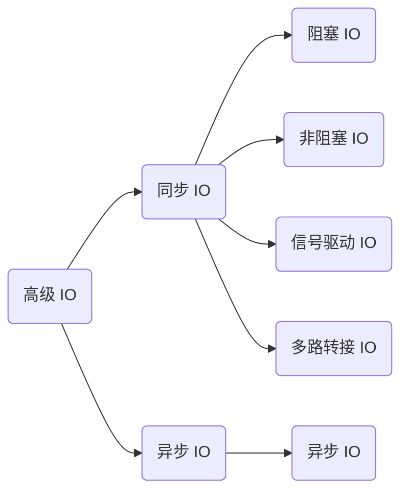
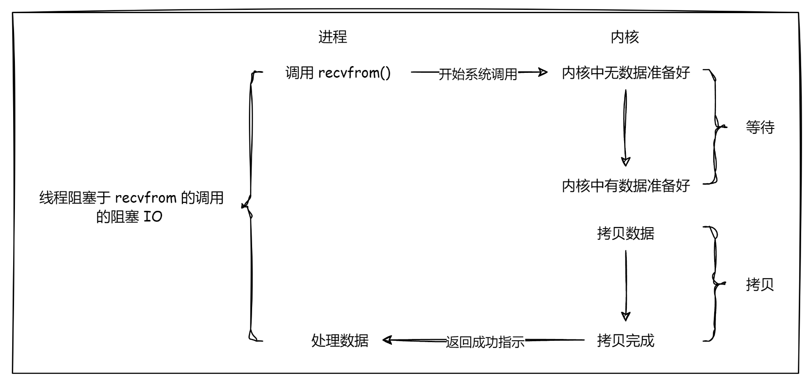
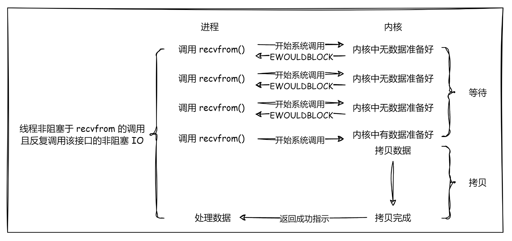
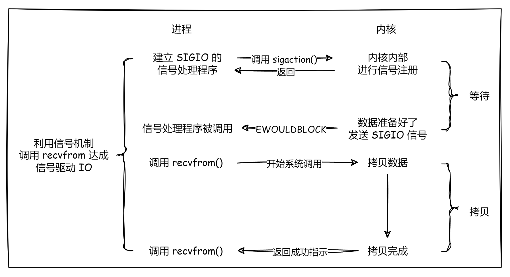
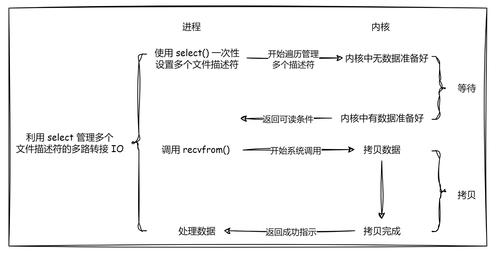
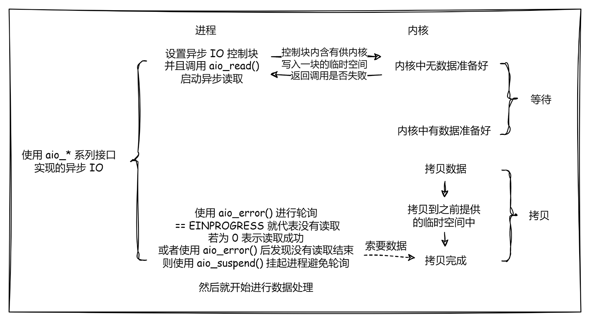
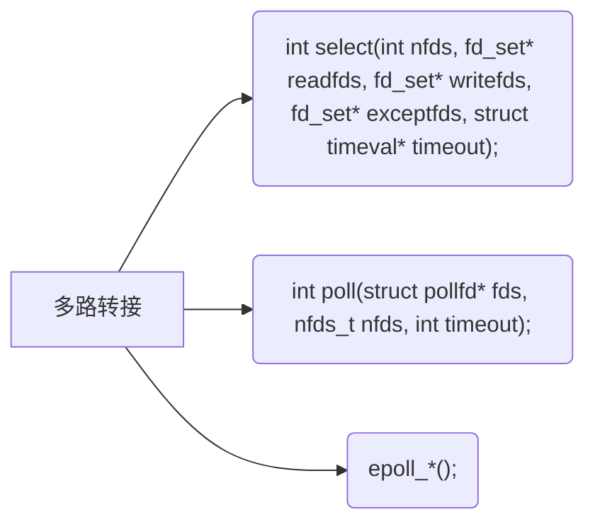
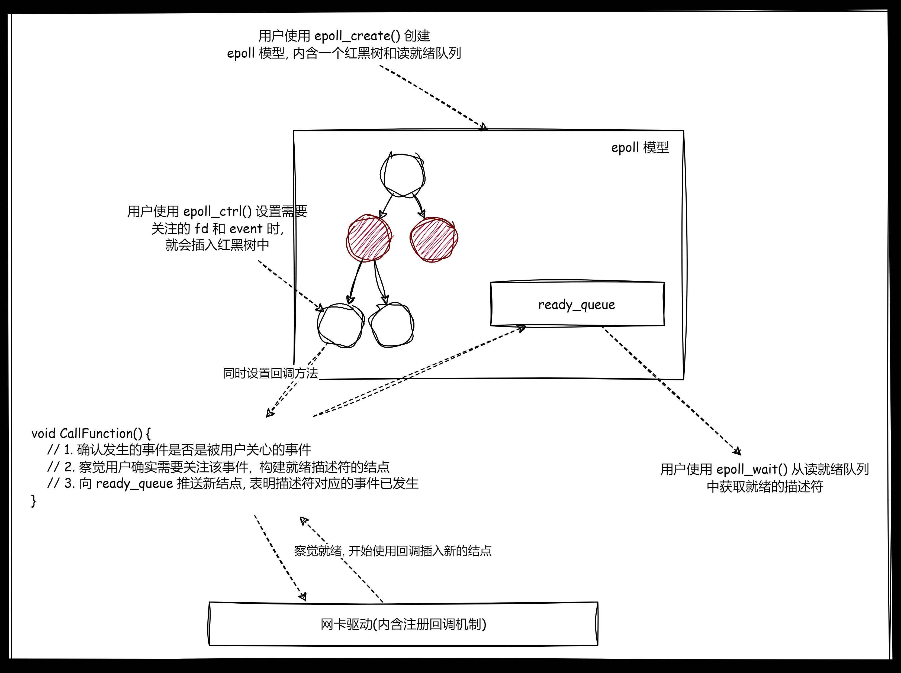

# 1.IO 概要

## 1.1.IO 低效原因

网络通信的一种常见理解角度就是 `IO`，您可能会经常听说 `IO` 低效的问题，但是 `IO` 为什么会低效？其本质是什么？

当使用 `read()/recv()` 的时候：

-   如果底层缓冲区中没有数据，就会进入阻塞
-   如果有数据就拷贝进缓冲区，就会停止阻塞

阻塞的原理就是让进程加入到阻塞队列里，而写入的接口也有类似的阻塞和拷贝的过程，因此 `IO = wait + copy`，`IO` 其实是阻塞加拷贝的过程。而如果把拷贝再细化一下，就是 `IO = wait + read/write`，所谓的读写接口实际上就是拷贝的过程。

而其实等待是指两件事情（专业术语为 **IO 类事件就绪**）：

-   等待写缓冲区有空间可以写入
-   等待都缓冲区有数据可以读取

因此完整写出来的话就是 $IO = wait + copy = 等写缓冲区有空间/等读缓冲区有数据 + 读取拷贝/写入拷贝$。

>   吐槽：有些人对 `IO` 的印象中，只停留在输入和输出上，容易忽略等待。

当进程需要读取一个文件然后修改时，不一定全部把磁盘中的文件，有可能只加载文件的属性（暂时不加载文件内容，避免内存浪费，并且也加快了读取速度）。后续需要修改时，进程就会陷入等待中，等待文件的内容被拷贝读取，然后再做修改。

因此越是高效的 `IO` 就是越少等待、越少拷贝。尤其是等待，大部分 `IO` 操作都在进行等待，效率当然不高。

## 1.2.IO 常见模型



我初学 `IO` 模型的时候，是依靠一个钓鱼故事来学习的。众所周知，钓鱼分为两步：(1)等 (2)钓，而如何判断一个人的钓鱼效率高呢？只要等的时间在等和钓的总时间中所占用的比率较低，就认为这个人钓鱼效率较高。

-   **阻塞式 IO**：一个人专心等待鱼上钩，花费大量时间在等待上，不被任何人打扰，直到亲自钓上鱼。
-   **非阻塞轮询式 IO**：一个人虽然有鱼竿，但是把鱼竿插在了地上，不用时刻关心是否上钩，但是隔一段时间看一下是否上钩，没有上钩就继续做其他事情，上钩就亲自钓走鱼。
-   **信号驱动 IO**：一个人虽然有鱼竿，但是把鱼竿插在了地上，同时在鱼竿上系了一个铃铛，只有在铃铛响时，才会前来把亲自把鱼钓走，剩余时间全部做自己的事情。
-   **多路复用 IO/多路转接 IO**：一个人非常有钱，买了多个鱼竿围着鱼塘插，甚至打了大量的鱼窝，鱼不断上钩，遍历每一根鱼竿，有鱼就把鱼钓走放桶里。而这个的家人想要吃鱼时，就无需钓鱼，直接在桶里拿取即可。
-   **异步 IO**：一个人是做生意的老板，偶然想吃野生的鱼，雇佣别人帮忙，给自己钓满一桶的鱼，等和钓交给别人人来解决，自己完全不参与整个钓鱼的过程，只有在最后鱼满时别人才通知老板把钓到的鱼全拿走。

欸那这里的鱼竿代表什么？其实就是文件描述符，而人就是对应的执行流（进程/线程）或者说接口...

>   补充：这里强调同步和异步的概念。
>
>   参与 `IO` 的过程就是同步 `IO`，而参与就是要么参与等待、要么参与拷贝、要么同时参与等待和参与拷贝。因此前面讲的前四种 `IO` 模型都是同步 `IO`。其中信号驱动中，信号的产生本身确实是异步的，但是一旦拷贝数据就会直接参与 `IO`，信号发送之后就是同步 `IO`。最后一种模型，由于没有等待也没有参与拷贝就是异步 `IO`。

我们再细化一下概念...我们假设 `IO` 操作由一个进程来进行。

### 1.2.1.阻塞 IO



在进行 `IO` 操作时，阻塞 `IO` 会导致调用线程被阻塞，直到 `IO` 操作完成。在此期间，线程将无法执行其他任务。只有当 `IO` 操作完成后，线程才会继续执行之后的工作。

>   补充：大部分的套接字默认的 `IO` 模式都是阻塞模式。

### 1.2.2.非阻塞 IO



非阻塞 `IO` 允许调用线程继续执行，即使 `IO` 操作没有立即完成。线程可以不断地轮询或询问 `IO` 操作是否完成，没有准备好就直接返回一个值而线程本身不会被阻塞。这样可以使得线程能够在等待 `IO` 完成的同时执行其他任务。

### 1.2.3.信号驱动 IO



信号驱动 `IO` 允许进程执行其他任务而不阻塞，直到 `IO` 操作完成。当 `IO` 操作完成时，操作系统会向进程发送信号来通知它。进程可以在信号到来时执行相应的处理。

>   补充：上述信号就是 `singleio` 信号。

### 1.2.4.多路转接 IO



多路转接 `IO` 允许一个线程同时监视多个 `IO` 操作的状态，并在其中任何一个 `IO` 操作就绪时，该线程可以随时执行 `IO` 操作，而不会进入阻塞。

这实际上是将所有的描述符的等待集结起来，和实际的拷贝进行解耦分离。同时避开了多执行流的调度消耗（因为多路转接全程只需使用一个执行流），通常使用 `select()`、`poll()`、`epoll()` 等系统调用来实现，也是我为您重点讲解的部分。

### 1.2.5.异步 IO



异步 `IO` 允许调用线程在进行 `IO` 操作的同时自己继续执行其他任务，而不必等待 `IO` 操作完成。当 `IO` 操作彻底完成时，操作系统会通知调用线程，然后才处理已完成的 `IO` 操作。异步 `IO` 的代码编写更加复杂，我最多简单提及一下，有机会再补充...

>   区分：异步 `IO` 和信号驱动 `IO` 的最大区别在于，信号驱动 `IO` 是告诉程序何时可以开始拷贝数据，而异步 `IO` 是内核在数据拷贝完成后通知程序可以取走。

# 2.IO 调用

非阻塞 `IO`、记录锁、系统 `V` 流机制、`I/O` 多路转接（也叫 `I/O` 多路复用）、`readv()`、`writev()`、存储映射 `IO`（`mmap`）等 `IO` 服务统称为高级 `IO`。我针对其中最为常用的几种 `IO` 服务底层的接口设计出不同的 `IO` 服务器软件。

这里我将使用系统调用教您编写五种 `IO` 模型，其中：

-   阻塞 `IO` 我们之前使用的很多，基本都是阻塞式的，所以不深入提及...
-   非阻塞 `IO` 我将采用 `fcntl()` 来编写，这个调用值得您细看
-   信号驱动 `IO` 实际上我不提您也知道怎么编写，只要您进程信号学得还算过关的话，因此这里不深入提及...
-   多路转接 `IO` 是最常用也较为复杂的一个模型，因此我会使用 `select()` 等接口来实现一个该模型，包括这个接口的升级版接口 `poll()` 和 `epoll()`，尤其重要的就是实现一个高可用、高性能的 `IO` 服务器程序
-   异步 `IO` 的编写实际上是最为困难的，但是我会稍微提及一下相关的代码编写

并且这里提前告诉您，最重要的是三个接口。



## 2.1.fcntl

如果我们单纯只是需要非阻塞打开一个文件的话，就需要在使用 `open()` 接口时设置 `flag` 的非阻塞选项即可，但是这里我们不使用这个（这种做法比较少见），而选择更加统一的方式，使用 `fcntl()`。

`fcntl` 函数是 `Unix` 和类 `Unix` 系统 `API` 的一部分，用于对文件描述符执行多种控制操作。`fcntl` 的行为由 `cmd` 参数确定，该参数指定要执行的特定功能。

```cpp
// fcntl()
#include <fcntl.h>
int fcntl(int fd, int cmd, ...);
// cmd 的取值有很多, 具体如下
// 1. 复制一个现有的描述符(F_DUPFD)
// 2. 获得/设置 文件描述符 标志(F_GETFD 和 F_SETFD)
// 3. 获得/设置 文件状态 标志(F_GETFL 和 F_SETFL)
// 4. 获得/设置异步 IO 所有权(F_GETOWN 和 F_SETOWN)
// 5. 获得/设置记录锁(F_GETLK 和 F_SETLK 和 F_SETLKW)
```

`fcntl` 函数的使用依赖于传递给 `cmd` 的参数，以及可能需要的其他参数，这些参数通常通过 `arg` 传递。每种 `cmd` 功能可能需要不同类型的 `arg` 参数，例如，对于 `F_DUPFD`，`arg` 通常是新文件描述符的起始值；而对于锁定操作，`arg` 可能是一个指向 `struct flock` 的指针，该结构包含了锁的信息。

这些选项的说明有些复杂，我们来稍微演示一下。

### 2.1.1.复制出新的描述符

```cpp
// 复制一个旧的描述符
#include <fcntl.h>
// ...
int new_fd = fcntl(old_fd, F_DUPFD, 5);
```

这个调用会创建一个新的文件描述符 `new_fd`，它是 `old_fd` 的副本。新文件描述符的值将从 `5` 开始搜寻可以用的描述符，最终 `new_fd` 的值必然 `>=5`。

### 2.1.2.关于描述符的标记

```cpp
// 获取描述符的状态标记
#include <fcntl.h>
#include <stdio.h>
#include <unistd.h>

int main() {
    int fd = open("example.txt", O_RDONLY);
    if (fd == -1) {
        perror("open");
        return 1;
    }

    // 获取文件描述符的标志
    int flags = fcntl(fd, F_GETFD);
    if (flags == -1) { // 接口调用出错
        perror("fcntl");
        close(fd);
        return 1;
    }

    // 检查 FD_CLOEXEC 是否设置
    if (flags & FD_CLOEXEC) { // 通过异或检测是否被设置
        printf("FD_CLOEXEC is set for fd %d.\n", fd);
    } else {
        printf("FD_CLOEXEC is not set for fd %d.\n", fd);
    }

    // 关闭文件描述符
    close(fd);
    return 0;
}
```

这个调用获取文件描述符 `fd` 的当前标记，并将其存储在变量 `flags` 中。然后检查 `FD_CLOEXEC` 标志是否被设置，并打印相应的信息。这个标记可以通过使用 `cmd = F_SETFD` 来设置。

```cpp
// 获得文件的状态标记 
#include <fcntl.h>
#include <unistd.h>
// ...
int flags = fcntl(fd, F_GETFL);
```

这个调用获取文件描述符 `fd` 的当前状态标志，并将其存储在变量 `flags` 中。状态标志可以是如 `O_NONBLOCK` 或 `O_ASYNC` 等，也和上述获取描述符标记类似，通过异或的方式获取。这个标记可以通过 `cmd = F_GETFL` 来设置。

### 2.1.3.设置描述符非阻塞

上面的选项和其他两个 `cmd` 选项我这里就不细致讲解了，不然有点偏离主题，我们先来看看怎么设置 `IO` 成非阻塞 `IO`，这才是我们所关心的。

```cpp
// 使用 fcntl() 达到非阻塞的目的
#include <iostream>
#include <unistd.h>
#include <fcntl.h>

// 设置非阻塞 IO
bool SetNonBlock(int fd)
{
    int fl = fcntl(fd, F_GETFL); // 获取文件的状态标志
    if (fl < 0)
        return false;
    
    fcntl(fd, F_SETFL, fl | O_NONBLOCK); // 设置非阻塞
    return true;
}

int main()
{
    SetNonBlock(0); // 把标志输入变成非阻塞, 原本标志输入是阻塞的, 用户不输入时程序就会因为输入接口陷入等待

    char buffer[1024] = { 0 };
    int count = 0;

    while (true)
    {
        ssize_t s = read(0, buffer, sizeof(buffer) - 1);
        // 凡是 C 语言涉及到字符串处理的只要有对应的缓冲区时可以不用 -1
        // C 会自动添加 '\0' 但是系统调用需要, 不已 '\0' 作为结尾
        // 但是由于我声明的 buffer 初始化为全 0 了, 这一行为就变得自动进行了

        // 如果读取成功就输出
        if (s > 0)
        {
            std::cout << "echo >:" << buffer << std::endl;
        }
        else if (s == 0) // 如果读取到结尾就退出, Linux 下模拟结尾的快捷键是 [ctrl+d]
        {
            std::cout << "read end~" << std::endl;
            break;
        }
        else // 如果读取失败或者没有读取到数据就打印出 "read error"
        {
            std::cout << "read error-" << count++ << std::endl;
            sleep(1);
        }
    }

    return 0;
}

```

我们看到，在上述代码中实现了非阻塞 `IO`，输出到屏幕上时是无需阻塞的。

但代码本身是有点小问题的，非阻塞的返回并不算一种读取错误，如果真的出现读取错误了，就会和非阻塞混淆在一起，这种情况怎么办呢？

可以使用 `<cerror>` 来中的 `errno` 变量来标识错误，读取出错时，就会被设置为 `errno=11`，也就是 `EWOULDBLOCK 或 EAGAIN(两者意义一样, 都是非阻塞 IO 操作无法完成的意思)`。

另外也有可能被设置为 `EINTR(代表系统调用中断)`，该错误就代表在 `IO` 过程被信号中断过，`IO` 操作时直接返回错误了，需要再尝试一次（不过这种概率比较小）。

>   补充：从这里我们也可以发现，为什么有些面向对象语言摈弃了返回错误码的形式，而转向使用异常的机制，因为无法使用一个返回值搞清楚出现的是哪一种误差。不过 `C` 语言有 `error` 这个全局变量机制，倒是能缓解一些，不过也没有异常机制来得好用...

因此我们最好修改一下代码。

```cpp
// 使用 fcntl() 达到非阻塞的目的, 正确区分错误和无数据读取两种情况
#include <iostream>
#include <unistd.h>
#include <fcntl.h>

// 设置非阻塞 IO
bool SetNonBlock(int fd)
{
    int fl = fcntl(fd, F_GETFL); // 获取文件的状态标志
    if (fl < 0)
        return false;

    fcntl(fd, F_SETFL, fl | O_NONBLOCK); // 设置非阻塞
    return true;
}

int main()
{
    SetNonBlock(0); // 把标志输入变成非阻塞, 原本标志输入是阻塞的, 用户不输入时程序就会因为输入接口陷入等待

    char buffer[1024] = { 0 };
    int count = 0;

    while (true)
    {
        ssize_t s = read(0, buffer, sizeof(buffer) - 1);
        // 凡是 C 语言涉及到字符串处理的只要有对应的缓冲区时可以不用 -1
        // C 会自动添加 '\0' 但是系统调用需要, 不已 '\0' 作为结尾
        // 但是由于我声明的 buffer 初始化为全 0 了, 这一行为就变得自动进行了

        // 如果读取成功就输出
        if (s > 0)
        {
            std::cout << "echo >:" << buffer << std::endl;
        }
        else if (s == 0) // 如果读取到结尾就退出, Linux 下模拟结尾的快捷键是 [ctrl+d]
        {
            std::cout << "read end~" << std::endl;
            break;
        }
        else // 如果读取失败或者没有读取到数据就检查 errno 来区分错误类型
        {
            if (errno == EWOULDBLOCK || errno == EAGAIN) {
                // 非阻塞 I/O 操作不能立即完成, 可以在这里处理或者简单地等待
                std::cout << "No data can be read" << std::endl;
            }
            if else (errno == EINTR)
            {
                std::cout << "IO Interrupter by signal, try again" << std::endl;
            }
            else
            {
                // 真正的读取错误, 打印错误信息并退出循环或进行错误处理
                perror("read error");
                break; // 或者其他错误处理代码
            }
            sleep(1); // 等待一段时间后重试
        }
    }

    return 0;
}

```

## 2.2.select

### 2.2.1.select 的相关接口

更加常用的较优 `IO` 模型是多路转接，早期的多路转接 `IO` 是使用 `select()` 来搭建的。

>   吐槽：虽然大部分都不会让您重新书写，有对应的库可以直接调用了，但是作为一名优质的 `C++` 程序员，您不能错过这里的学习...另外，如果您学过 `SQL` 语句，一定会好奇 `"select"` 这个名字。两者还确实有些相似，其实都是查询的过程，只不过后者是查询就绪的套接字。

```cpp
// select()
// (1)时间相关接口
#include <sys/time.h>
struct timeval {
    time_t tv_sec; // 时间戳秒
    suseconds_t tv_usec; // 微秒
};

int gettimeofday(
	struct timeval* tv, // 输出型参数, 返回系统特定时区的时间
    const struct timezone* tz // 为空默认为当前地区
); // 返回是否获取成功


// (2)描述符集相关接口
#include <sys/select.h>
struct fd_set {
	// ...
}; // 是文件描述集, 和信号集类似, 就是一个位图结构, 有大小限制

void FD_CLR(int fd, fd_set* set); // 在位图中清除描述符
int FD_ISSET(int fd, fd_set* set); // 在位图中查询是否存在对应的描述符
void FD_SET(int fd, fd_set* set); // 在位图中设置描述符
void FD_ZERO(fd_set* set); // 将整个位图所有位做置零操作


// (3)select() 的声明
int select(
	int nfds, // maxfd+1, 实际上就是设置 fds 数组个数
    fd_set* readfds, // 读取事件(输入输出型参数), 输出时代表可读数据
    fd_set* writefds, // 写入事件(输入输出型参数), 输出时代表可写数据
    fd_set* exceptfds, // 异常事件(输入输出型参数), 输出时代表有异常
    struct timeval* timeout // 阻塞模式/等待策略(输入输出型参数)
); // 返回就绪的描述符个数(数据就绪或空间就绪), 若为 0 代表超时, 若为负代表调用出错(例如已经关闭了还继续让调用为您等待的情况)
// 输入就是用户输入提醒系统需要关注的事件
// 输出就是系统输出提醒用户哪些事件已就绪
```

该接口的核心工作就是帮助用户一次等待多个文件标识符，哪些文件标识符对应的资源就绪了，就要通知用户对应就绪的标识符有哪些，然后用户调用 `IO` 接口进行数据读取。

我们先来使用一下系统调用中的时间接口。

```cpp
// 使用一下系统调用中的时间接口
#include <ctime>
#include <sys/time.h>
int main()
{
    std::cout << "time:" << (unsigned long)time(nullptr) << std::endl;
    
    struct timeval currtime = { 0, 0 };
    int n = gettimeofday(&currtime, nullptr); // 通过时间结构来获取当前地区的时间, currtime 中包含时间戳秒和时间戳微秒
    
    // 简单检查一下...
    assert(n == 0);
    (void)n;
    
    // 打印一下时间戳
    std::cout << "time:" <<  currtime.tv_sec << "-" << currtime.tv_usec << std::endl;
    
	return 0;
}
```

对应的到 `select()` 中的等待策略，就可以利用上述时间接口进行设置：

-   `timeout=nullptr`：阻塞式，描述符准备好才能返回
-   `timeout=(0, 0)`：非阻塞式，描述符没准备好也立刻返回，只遍历检查一次描述符
-   `timeout=(X, Y)`：在 `X’Y’’` 时间内阻塞，但时间到就立刻返回，此时没有文件描述符准备好。如果时间没到就返回，代表有描述符准备好，同时也会把剩余的时间设置进 `timeout` 中。

### 2.2.2.select 的编码运用

我们先来体验一下多路转接阻塞的感觉，您会发现等待的操作由 `select()` 一个接口来承担，尽管还是需要您调用读写接口进行 `IO` 但是 `select()` 可以保证在 `IO` 时不必过多等待，一点是处于资源就绪的情况（有空间可写、有数据可读）。

>   强调：这里强调一下，下面 `select_server{};` 类中不要使用 `vector<>`，而使用原生数组，到不是说不能这么做，只是我希望您使用原生数组体验到 `select` 服务器的某些缺点...

```makefile
# makefile
all: clean select_server

select_server: main.cpp
	g++ -o $@ $^ -std=c++11

clean:
	rm -rf select_server log_dir
```

```cpp
// log.hpp

/* 文件描述
Log log = Log(bool debugShow = true,    // 选择是否显示 DEBUG 等级的日志消息
    std::string writeMode = "SCREEN",   // 选择日志的打印方式
    std::string logFileName = "log"     // 选择日志的文件名称
);
log.WriteModeEnable();      // 中途可以修改日志的打印方式
log.LogMessage(DEBUG | NORMAL | WARNING | ERROR | FATAL, "%s %d", __FILE__, __LINE__));     // 打印日志
*/

#pragma once
#include <iostream>
#include <string>
#include <fstream>
#include <cstdio>
#include <cstdarg>
#include <ctime>
#include <pthread.h>
#include <unistd.h>
#include <sys/stat.h>
#include <sys/types.h>

// 日志级别
#define DEBUG 0 // 调试
#define NORMAL 1 // 正常（或者叫 INFO）
#define WARNING 2 // 警告
#define ERROR 3 // 错误
#define FATAL 4 // 致命

enum WriteMode
{
    SCREEN = 5,
    ONE_FILE,
    CLASS_FILE
};

const char* gLevelMap[] = {
    "DEBUG", // debug 模式
    "NORMAL", // 正常（或者叫 INFO）
    "WARNING", // 警告
    "ERROR", // 非致命错误
    "FATAL" // 严重错误
};

const std::string logdir = "log_dir";

// 日志功能主要有：日志等级、发送时间、日志内容、代码行数、运行用户
class Log
{
private:
    void __WriteLogToOneFile(std::string logFileName, const std::string& message)
    {
        std::ofstream out(logFileName, std::ios::app);
        if (!out.is_open())
            return;
        out << message;
        out.close();
    }
    void __WriteLogToClassFile(const int& level, const std::string& message)
    {
        std::string logFileName = "./";
        logFileName += logdir;
        logFileName += "/";
        logFileName += _logFileName;
        logFileName += "_";
        logFileName += gLevelMap[level];

        __WriteLogToOneFile(logFileName, message);
    }
    void _WriteLog(const int& level, const std::string& message)
    {
        switch (_writeMode)
        {
        case SCREEN: // 向屏幕输出
            std::cout << message;
            break;
        case ONE_FILE: // 向单个日志文件输出
            __WriteLogToOneFile("./" + logdir + "/" + _logFileName, message);
            break;
        case CLASS_FILE: // 向多个日志文件输出
            __WriteLogToClassFile(level, message);
            break;
        default:
            std::cout << "write mode error!!!" << std::endl;
            break;
        }
    }

public:
    // 构造函数，debugShow 为是否显示 debug 消息，writeMode 为日志打印模式，logFileName 为日志文件名
    Log(bool debugShow = true, const WriteMode& writeMode = SCREEN, std::string logFileName = "log")
        : _debugShow(debugShow), _writeMode(writeMode), _logFileName(logFileName)
    {
        mkdir(logdir.c_str(), 0775); // 创建目录
    }

    // 调整日志打印方式
    void WriteModeEnable(const WriteMode& mode)
    {
        _writeMode = mode;
    }

    // 拼接日志消息并且输出
    void LogMessage(const int& level, const char* format, ...)
    {
        // 1.若不是 debug 模式，且 level == DEBUG 则不做任何事情
        if (_debugShow == false && level == DEBUG)
            return;

        // 2.收集日志标准部分信息
        char stdBuffer[1024];
        time_t timestamp = time(nullptr); // 获得时间戳
        struct tm* local_time = localtime(&timestamp); // 将时间戳转换为本地时间

        snprintf(stdBuffer, sizeof stdBuffer, "[%s][pid:%s][%d-%d-%d %d:%d:%d]",
            gLevelMap[level],
            std::to_string(getpid()).c_str(),
            local_time->tm_year + 1900, local_time->tm_mon + 1, local_time->tm_mday,
            local_time->tm_hour, local_time->tm_min, local_time->tm_sec
        );

        // 3.收集日志自定义部分信息
        char logBuffer[1024];
        va_list args; // 声明可变参数列表，实际时一个 char* 类型
        va_start(args, format); // 初始化可变参数列表
        vsnprintf(logBuffer, sizeof logBuffer, format, args); // int vsnprintf(char *str, size_t size, const char *format, va_list ap); 是一个可变参数函数，将格式化后的字符串输出到缓冲区中。类似带 v 开头的可变参数函数有很多
        va_end(args); // 清理可变参数列表，类似 close() 和 delete

        // 4.拼接为一个完整的消息
        std::string message;
        message += "--> 标准日志:"; message += stdBuffer;
        message += "\t 用户日志:"; message += logBuffer;
        message += "\n";

        // 5.打印日志消息
        _WriteLog(level, message);
    }
    
private:
    bool _debugShow;
    WriteMode _writeMode;
    std::string _logFileName;
};
```

```cpp
// sock.hpp

/* 文件描述
主要是对套接字编程的常见接口做封装, 是一个关于套接字的工具包
*/

#pragma once
#include <memory>
#include <cstring>
#include <sys/types.h>
#include <sys/socket.h>
#include <netinet/in.h>
#include <arpa/inet.h>
#include "log.hpp"

class ThreadData
{
public:
    int _sock;
    std::string _ip;
    uint16_t _port;
};

class Sock
{
private:
    const static int g_backlog = 10; // 一般不会太大, 也不会太小

    
public:
    // 空的构造函数
    Sock() {}

    // 创建监听套接字
    static int _Socket()
    {
        int listenSock = socket(AF_INET, SOCK_STREAM, 0);
        if (listenSock < 0)
        {
            _log.LogMessage(FATAL, "socket() error %s %d", __FILE__, __LINE__);
            exit(1);
        }
        _log.LogMessage(NORMAL, "socket() success %s %d", __FILE__, __LINE__);
        return listenSock;
    }

    // 绑定监听套接字
    static void _Bind(int listenSock, uint16_t port, std::string ip = "127.0.0.1")
    {
        struct sockaddr_in local;
        memset(&local, 0, sizeof local);
        local.sin_family = AF_INET;
        local.sin_port = htons(port);
        inet_pton(AF_INET, ip.c_str(), &local.sin_addr);

        if (bind(listenSock, (struct sockaddr*)&local, sizeof(local)) < 0)
        {
            _log.LogMessage(FATAL, "bind() error %s %d", __FILE__, __LINE__);
            exit(2);
        }
        _log.LogMessage(NORMAL, "bind() success %s %d", __FILE__, __LINE__);
    }

    // 置套接字监听状态
    static void _Listen(int listenSock)
    {
        if (listen(listenSock, g_backlog) < 0)
        {
            _log.LogMessage(FATAL, "listen() error %s %d", __FILE__, __LINE__);
            exit(3);
        }
        _log.LogMessage(NORMAL, "listen() success %s %d", __FILE__, __LINE__);
    }

    // 服务端等待连接后, 返回服务套接字(参数还带有服务端的信息)
    static int _Accept(int listenSock, std::string* ip, uint16_t* port)
    {
        struct sockaddr_in src;
        socklen_t len = sizeof(src);

        int serviceSock = accept(listenSock, (struct sockaddr*)&src, &len);
        if (serviceSock < 0)
        {
            _log.LogMessage(FATAL, "accept() error %s %d", __FILE__, __LINE__);
            return -1;
        }
        _log.LogMessage(NORMAL, "accept() success %s %d", __FILE__, __LINE__);

        *port = ntohs(src.sin_port);
        *ip = inet_ntoa(src.sin_addr);

        return serviceSock;
    }

    // 客户端主动连接服务端
    static bool _Connect(int sock, const std::string& server_ip, const uint16_t& server_port)
    {
        struct sockaddr_in server;
        memset(&server, 0, sizeof(server));
        server.sin_family = AF_INET;
        server.sin_port = htons(server_port);
        server.sin_addr.s_addr = inet_addr(server_ip.c_str());

        if (connect(sock, (struct sockaddr*)&server, sizeof(server)) == 0)
        {
            _log.LogMessage(NORMAL, "accept() success %s %d", __FILE__, __LINE__);
            return true;
        }

        _log.LogMessage(FATAL, "connect() error %s %d", __FILE__, __LINE__);
        return false;
    }

private:
    static Log _log;
};
Log Sock::_log = Log();
```

```cpp
// select_server.hpp
#pragma once
#include <iostream>
#include <sys/select.h>
#include <cstdio>
#include "sock.hpp"
#include "log.hpp"

// select 只讲解读取, 写入和异常之后提到 epoll 时再说
class SelectServer
{
public:
    SelectServer(const uint16_t& port = 8080)
    	: _port(port) 
    {
        _listensock = Sock::_Socket();
        Sock::_Bind(_listensock, _port);
        Sock::_Listen(_listensock);
        _log.LogMessage(DEBUG, "create base socket success, %s %d", __FILE__, __LINE__);
    }

    ~SelectServer()
    {
        if (_listensock >= 0)
            close(_listensock);
    }

    void Start()
    {
        while (true)
        {
            // 设置 select() 的相关参数, 每次都需要设置, 因为 select() 的参数有输入输出型参数, 调用一次被返回后就需要重新设置

            // 初始描述符集合
            fd_set rfds;
            FD_ZERO(&rfds);
            
            // 因为我们把 _listensock 的获取服务连接也看做 IO, 如果没有获取到新链接, 也会导致阻塞(并且是一种读操作, 把连接好的连接读走)
            // 所以这里不能直接调用 _Accept(), 否则默认没有获取到新链接就进入阻塞,
            // 而我们设计的多路转接希望将所有需要等待的描述符交给 select() 统一处理
            // 因此不能有套接字脱离 select() 的管理进行独自阻塞
            // 否则就有可能出现一种情况, 连接上第一个客户端后, 又陷入了阻塞, 没办法检查第一个客户端的 IO 事件, 哪怕再次连接上了第二个客户端, 
            // int sock = Sock::_Accept(_listensock, ...); // 故这里不能直接进行连接

            FD_SET(_listensock, &rfds); // 把监听套接字设置进位图中
            struct timeval timeout = { 5, 0 }; // 等待策略是五秒内阻塞式等待

            int n = select(
                _listensock + 1, // 设置需要 select() 管理等待的描述符的总个数
                &rfds, nullptr, nullptr, // 设置读写异常集合
                &timeout); // 设置等待策略

            switch (n)
            {
                case 0: // 超时五秒, 没有描述符准备好
                    _log.LogMessage(DEBUG, "time out ..., %s %d", __FILE__, __LINE__);
                    break;
                case -1: // 等待失败, select() 的使用有问题
                    _log.LogMessage(WARNING, "select error, %s %d", __FILE__, __LINE__);
                    break;
                default: // select 等待成功, 有描述符准备好了, 这里就是 _listensock 准备好了, 可以开始进行连接做读写服务了
                    _log.LogMessage(DEBUG, "get a new link, %s %d", __FILE__, __LINE__);
                    // 等待后续继续编码...
                    break;
            }
        }
    }

private:
    uint16_t _port;
    int _listensock;
    Log _log;
};
```

```cpp
// main.cpp
#include <memory>
#include "select_server.hpp"

int main()
{
    std::unique_ptr<SelectServer> svr(new SelectServer());
    svr->Start();
    return 0;
}
```

>   补充：监听套接字主要任务是接受新的连接请求，`accept()` 函数从监听套接字中读取并返回一个新的已连接套接字，因此监听套接字本身就是一个用于读的事件。

>   补充：您还可以检测一些后续的参数是否为输入输出型参数，可以稍微打印一下...

接下来的编程，我们大多关注读事件而不关注写事件，原因是有大把的空间资源供描述符使用，我们暂时没有遇到因为大批量写入导致空间占满而进入写阻塞的情况。现在我们进一步编写 `select_server.hpp`，其他代码都不要动。把准备好的监听套接字拿走单独做处理，并且直到编写不下去为止。

```cpp
// select_server.hpp
#pragma once
#include <iostream>
#include <sys/select.h>
#include <cstdio>
#include "sock.hpp"
#include "log.hpp"

// select 只讲解读取, 写入和异常之后提到 epoll 时再说
class SelectServer
{
private:
    void HandlerEvent(const fd_set& rfds) // rfds 是一个集合, 内部可能有多个标识符, 但是这里我们确保只有一个监听套接字, 所以先这么写
    {
        if (FD_ISSET(_listensock, &rfds)) // 这个检测看起来有点脱裤子放屁, 不过请您往后看下去
        {
            // 成功走到这里就说明可以读取了, 已经获取了新连接
            std::string client_ip;
            uint16_t client_port;
            int sock = Sock::_Accept(_listensock, &client_ip, &client_port); // 这里会不会被阻塞呢? 不会, 因为 IO事件/IO资源 已就绪, 监听套接字可以被立刻读取得到服务套接字

            if (sock < 0)
            {
                _log.LogMessage(WARNING, "accept error, %s %d", __FILE__, __LINE__);
                return;
            }

            _log.LogMessage(DEBUG, "get a new link success, %d->[%s:%d], %s %d", sock, client_ip.c_str(), client_port, __FILE__, __LINE__);

            // TODO: read() and write()
        }
    }


public:
    SelectServer(const uint16_t& port = 8080)
    	: _port(port) 
    {
        _listensock = Sock::_Socket();
        Sock::_Bind(_listensock, _port);
        Sock::_Listen(_listensock);
        _log.LogMessage(DEBUG, "create base socket success, %s %d", __FILE__, __LINE__);
    }

    ~SelectServer()
    {
        if (_listensock >= 0)
            close(_listensock);
    }

    void Start()
    {
        while (true)
        {
            // 设置 select() 的相关参数, 每次都需要设置, 因为 select() 的参数有输入输出型参数, 调用一次被返回后就需要重新设置

            // 初始描述符集合
            fd_set rfds;
            FD_ZERO(&rfds);
            
            // 因为我们把 _listensock 的获取服务连接也看做 IO, 如果没有获取到新链接, 也会导致阻塞(并且是一种读操作, 把连接好的连接读走)
            // 所以这里不能直接调用 _Accept(), 否则默认没有获取到新链接就进入阻塞,
            // 而我们设计的多路转接希望将所有需要等待的描述符交给 select() 统一处理
            // 因此不能有套接字脱离 select() 的管理进行独自阻塞
            // 否则就有可能出现一种情况, 连接上第一个客户端后, 又陷入了阻塞, 没办法检查第一个客户端的 IO 事件, 哪怕再次连接上了第二个客户端, 
            // int sock = Sock::_Accept(_listensock, ...); // 故这里不能直接进行连接

            FD_SET(_listensock, &rfds); // 把监听套接字设置进位图中
            struct timeval timeout = { 5, 0 }; // 等待策略是五秒内阻塞式等待

            int n = select(
                _listensock + 1, // 设置需要 select() 管理等待的描述符的总个数
                &rfds, nullptr, nullptr, // 设置读写异常集合
                &timeout); // 设置等待策略

            switch (n)
            {
                case 0: // 超时五秒, 没有描述符准备好
                    _log.LogMessage(DEBUG, "time out ..., %s %d", __FILE__, __LINE__);
                    break;
                case -1: // 等待失败, select() 的使用有问题
                    _log.LogMessage(WARNING, "select error, %s %d", __FILE__, __LINE__);
                    break;
                default: // select 等待成功, 有描述符准备好了, 这里就是 _listensock 准备好了, 可以开始进行连接做读写服务了
                    _log.LogMessage(DEBUG, "Ready to get a new connection link, %s %d", __FILE__, __LINE__);
                    HandlerEvent(rfds); // 把就绪的描述符传递过去, 此时 rfds 内部存储的是读事件准备好的描述符
                    break;
            }
        }
    }

private:
    uint16_t _port;
    int _listensock;
    Log _log;
};
```

可以发现，在 `HandlerEvent()` 调用方法这里不能直接 `read()/write()`，尤其是读取，万一对端一直不发送数据过来就一直读取不了，服务端就会陷入阻塞（这是我们不能忍受的）。因此必须将新的文件描述符托管给 `select()`，让其检查其上是否有新的事件就绪。这样服务器就会即便真的进入阻塞，也仅仅是因为真的没有任何描述符可以使用，这就会将效率提到极致。

1.   由于文件描述符有可能会越来越大，因此这里就必须动态调用 `select()`

2.   并且 `select()` 使用的输入输出型参数，会导致曾被操作系统关注的描述符被修改，所以注定每一次调用时，都需要重新添加曾经关注的描述符

3.   最终导致我们至少要做到两点：

     (1)需要保存第三方数组，保存历史上所有的合法 `fd`，根据需求动态添加到位图中，这样才能填充 `select()` 的三个事件参数
     (2)遍历描述符数组，动态找出最大的 `max_fd`，这样才能填充 `select()` 的第一个参数

4.   我们并不清楚哪些申请到的描述符是读描述符还是写描述符？不同类型的描述符需要区分对待吧？


```cpp
// select_server.hpp
#pragma once
#include <iostream>
#include <sys/select.h>
#include <cstdio>
#include "sock.hpp"
#include "log.hpp"

#define BIT_NUM_OF_BYT 8 // 一个字节的大小
#define NUM_OF_FDS BIT_NUM_OF_BYT * sizeof(fd_set) // 位图对应的描述符总最大个数
#define FD_NONE -1 // 表示文件描述符不合法

// select 只讲解读取, 写入和异常之后提到 epoll 时再说
class SelectServer
{
private:
    // 每一个服务套接字的获取和读写操作
    void HandlerEvent(const fd_set& rfds) // rfds 是一个集合, 内部可能有多个标识符, 但是这里我们确保只有一个监听套接字, 所以先这么写
    {
        // 这个函数被调用, 就说明 rfds 集合中至少有一个标识符资源可以被使用了
        for (int i = 0; i < NUM_OF_FDS; i++) // 先遍历所有的合法描述符先, 查看是否有描述符已经在 rfds 中了
        {
            // 先排除不合法的描述符
            if (_fds[i] == FD_NONE)
            {
                continue;
            }

            // 判定一个合法描述符是否就绪
            if (FD_ISSET(_fds[i], &rfds))
            {
                // 走到这里的描述符合法且就绪, 但是不一定是需要 read 的描述符, 因此需要区分开做处理
                if (_fds[i] == _listensock)
                {
                    // 读事件就绪: 链接时间到来
                    _log.LogMessage(DEBUG, "get a new connection link, %s %d", __FILE__, __LINE__);
                    // _Accepter(); // 让其链接即可, 并且让新的合法标识符加入
                }
                else
                {
                    // 读事件就绪: INPUT 事件到来, 需要 recv() 或 read()
                    _log.LogMessage(DEBUG, "message in, get I/O event: %d, %s %d", _fds[i], __FILE__, __LINE__);
                    // _Recver(); // 进行读取
                }
            }
        }
    }
    
    // 测试描述符位图的具体内容
    void DebugPrint()
    {
        std::cout << "_fds: " << std::endl;
        for (const auto& fd : _fds)
        {
            if (fd != FD_NONE)
                std::cout << fd << " ";
        }
        std::cout << std::endl;
    }


public:
    SelectServer(const uint16_t& port = 8080)
    	: _port(port) 
    {
        _listensock = Sock::_Socket();
        Sock::_Bind(_listensock, _port);
        Sock::_Listen(_listensock);
        _log.LogMessage(DEBUG, "create base socket success, %s %d", __FILE__, __LINE__);

        // 初始化存储合法描述符的数组
        for (auto& fd : _fds)
            fd = FD_NONE;

        // 我们约定 _fds[0] = _listensock, 因为该套接字一般保持不变动
        _fds[0] = _listensock;
    }

    ~SelectServer()
    {
        if (_listensock >= 0)
            close(_listensock);
    }

    void Start()
    {
        while (true)
        {
            // 1.先打印出当前已有的所有合法描述符
            DebugPrint();

            // 2.设置 select() 的相关参数, 每次都需要设置, 因为 select() 的参数有输入输出型参数, 调用一次被返回后就需要重新设置
            fd_set rfds;
            FD_ZERO(&rfds);
            
            int maxFd = _listensock;
            for (auto& fd : _fds)
            {
                if (fd == FD_NONE)
                    continue;
                
                FD_SET(fd, &rfds);

                if (maxFd < fd)
                    maxFd = fd;
            }

            int n = select(
                maxFd + 1, // 设置需要 select() 管理等待的描述符的总个数
                &rfds, nullptr, nullptr, // 设置读写异常集合
                nullptr); // 设置等待策略为非阻塞

            // 3.根据 select() 一次遍历检查的返回值进行抉择
            switch (n)
            {
                case 0: // 超时五秒, 没有描述符准备好
                    _log.LogMessage(DEBUG, "time out ..., %s %d", __FILE__, __LINE__);
                    break;
                case -1: // 等待失败, select() 的使用有问题
                    _log.LogMessage(WARNING, "select error, %s %d", __FILE__, __LINE__);
                    break;
                default: // select() 等待成功, 有描述符准备好了, 这里就是 _listensock 准备好了, 可以开始进行连接做读写服务了
                    _log.LogMessage(DEBUG, "Ready to get a new connection link, %s %d", __FILE__, __LINE__);
                    HandlerEvent(rfds); // 把就绪的描述符传递过去
                    break;
            }
        }
    }

private:
    uint16_t _port;
    int _listensock;
    Log _log;
    int _fds[NUM_OF_FDS]; // 存储历史上所有合法的文件描述符的数组
};
```

上述代码完成了动态设置文件描述符，并且不再等待 `5s`，而是直接启动阻塞等待，一旦没有任何描述符准备好，就陷入阻塞状态。下面我们再来详细编写链接函数和读取函数，完善关于读取的多路转接代码。

```cpp
// select_server.hpp
#pragma once
#include <iostream>
#include <sys/select.h>
#include <cstdio>
#include "sock.hpp"
#include "log.hpp"

#define BIT_NUM_OF_BYT 8 // 一个字节的大小
#define NUM_OF_FDS BIT_NUM_OF_BYT * sizeof(fd_set) // 位图对应的描述符总最大个数
#define FD_NONE -1 // 表示文件描述符不合法

// select 只讲解读取, 写入和异常之后提到 epoll 时再说
class SelectServer
{
private:
    // 链接者
    void _Accepter()
    {
        // 现在就不用判断 _listensock 是否就绪了, 这个函数被调用就一定是有链接可以被获取了
        std::string client_ip;
        uint16_t client_port = 0;
        int sock = Sock::_Accept(_listensock, &client_ip, &client_port); // 这里会不会被阻塞呢? 不会, 因为 IO事件/IO资源 已就绪

        if (sock < 0)
        {
            _log.LogMessage(WARNING, "accept error, %s %d", __FILE__, __LINE__);
            return;
        }

        _log.LogMessage(DEBUG, "get a new link success, %d->[%s:%d], %s %d", sock, client_ip.c_str(), client_port, __FILE__, __LINE__);

        // 注意这里只能获取新链接, 而不能直接 read() and write(), 万一对方一直不发送数据过来就一直读取不了, 陷入阻塞
        // 因此将新的 sock 设置进合法描述符中, 等后续托管给 select(), 让其检查其上是否有新的数据就绪, 再进行阻塞

        int pos = 1; // 初始设置为 1, 因为我们约定第一个标识符是监听套接字
        for (; pos < NUM_OF_FDS; pos++) // 该循环的目的是一直走到可以被填充新描述符的 pos 索引
        {
            if (_fds[pos] == FD_NONE)
                break;
        }
        if (pos == NUM_OF_FDS) // 超出 _fds 数组的大小, 说明服务器的描述符资源已经不足, 直接不再获取新链接即可
        {
            _log.LogMessage(WARNING, "select server already full, close, %d, %s %d", sock, client_ip.c_str(), client_port, __FILE__, __LINE__);
            close(sock);
        }
        else
        {
            _fds[pos] = sock; // 把获取到的服务套接字添加进合法数组 _fds 内, 等到本调用结束后进入主循环, 再次被 seletc() 托管即可
        }
    }

    // 读取者
    void _Recver(int& serverFd)
    {
        // 现在就不用判断 serverFd 是否就绪了, 这个函数被调用就一定是有数据可以被获取了
        _log.LogMessage(DEBUG, "message in, get I/O event: %d, %s %d", serverFd, __FILE__, __LINE__);
        char buffer[1024] = { 0 };
        int n = recv(serverFd, buffer, sizeof(buffer) - 1, 0); // 这里一定不会被阻塞, select() 已经将事件检测完毕, 在合法的描述符种, 一定有资源可以被读取
        // 当然这里的读取是有点问题的, 因为 TCP 是面向字节流的, 无法保证数据完整, 必须配合应用层协议, 但是这里我们暂时不考虑这些, 相信您也有能力解决

        if (n > 0) // 正常读取
        {
            _log.LogMessage(DEBUG, "client-[%d] message >:%s, %s %d", serverFd, buffer, __FILE__, __LINE__);
        }
        else if (n == 0) // 对端关闭
        {
            _log.LogMessage(DEBUG, "client-[%d] quit, %s %d", serverFd, __FILE__, __LINE__);
            // (1)服务器也需要关闭该描述符资源
            close(serverFd);
            // (2)从合法描述符中去除, 后续 select() 就不会关注该描述符
            serverFd = FD_NONE; // 这里是引用传参, 所以 serverFd 是在被调用之前是 _fds[i] 可以被直接修改为非法描述符
        }
        else // 读取出错
        {
            _log.LogMessage(WARNING, "recv client-[%d] error, error text is %s, %s %d", serverFd, strerror(errno), __FILE__, __LINE__);
            // (1)服务器也需要关闭该描述符资源
            close(serverFd);
            // (2)从合法描述符中去除, 后续 select() 就不会关注该描述符
            serverFd = FD_NONE;
        }
    }
    
    // 每一个服务套接字的获取和读写操作
    void HandlerEvent(const fd_set& rfds) // rfds 是一个集合, 内部可能有多个标识符, 但是这里我们确保只有一个监听套接字, 所以先这么写
    {
        // 这个函数被调用, 就说明 rfds 集合中至少有一个标识符资源可以被使用了
        for (int i = 0; i < NUM_OF_FDS; i++) // 先遍历所有的合法描述符先, 查看是否有描述符已经在 rfds 中了
        {
            // 先排除不合法的描述符
            if (_fds[i] == FD_NONE)
            {
                continue;
            }

            // 判定一个合法描述符是否就绪
            if (FD_ISSET(_fds[i], &rfds))
            {
                // 走到这里的描述符合法且就绪, 但是不一定是需要 read 的描述符, 因此需要区分开做处理
                if (_fds[i] == _listensock)
                {
                    // 读事件就绪: 链接时间到来
                    _log.LogMessage(DEBUG, "get a new connection link, %s %d", __FILE__, __LINE__);
                    _Accepter(); // 让其链接即可, 并且让新的合法标识符加入
                }
                else
                {
                    // 读事件就绪: INPUT 事件到来, 需要 recv() 或 read()
                    _log.LogMessage(DEBUG, "message in, get I/O event: %d, %s %d", _fds[i], __FILE__, __LINE__);
                    _Recver(_fds[i]); // 进行读取
                }
            }
        }
    }
    
    // 测试描述符位图的具体内容
    void DebugPrint()
    {
        std::cout << "_fds: " << std::endl;
        for (const auto& fd : _fds)
        {
            if (fd != FD_NONE)
                std::cout << fd << " ";
        }
        std::cout << std::endl;
    }


public:
    SelectServer(const uint16_t& port = 8080)
    	: _port(port) 
    {
        _listensock = Sock::_Socket();
        Sock::_Bind(_listensock, _port);
        Sock::_Listen(_listensock);
        _log.LogMessage(DEBUG, "create base socket success, %s %d", __FILE__, __LINE__);

        // 初始化存储合法描述符的数组
        for (auto& fd : _fds)
            fd = FD_NONE;

        // 我们约定 _fds[0] = _listensock, 因为该套接字一般保持不变动
        _fds[0] = _listensock;
    }

    ~SelectServer()
    {
        if (_listensock >= 0)
            close(_listensock);
    }

    void Start()
    {
        while (true)
        {
            // 1.先打印出当前已有的所有合法描述符
            DebugPrint();

            // 2.设置 select() 的相关参数, 每次都需要设置, 因为 select() 的参数有输入输出型参数, 调用一次被返回后就需要重新设置
            fd_set rfds;
            FD_ZERO(&rfds);
            
            int maxFd = _listensock;
            for (auto& fd : _fds)
            {
                if (fd == FD_NONE)
                    continue;
                
                FD_SET(fd, &rfds);

                if (maxFd < fd)
                    maxFd = fd;
            }

            int n = select(
                maxFd + 1, // 设置需要 select() 管理等待的描述符的总个数
                &rfds, nullptr, nullptr, // 设置读写异常集合
                nullptr); // 设置等待策略为阻塞

            // 3.根据 select() 一次遍历检查的返回值进行抉择
            switch (n)
            {
                case 0: // 超时, 没有任何描述符准备好
                    _log.LogMessage(DEBUG, "time out ..., %s %d", __FILE__, __LINE__);
                    break;
                case -1: // 等待失败, select() 的使用有问题
                    _log.LogMessage(WARNING, "select error, %s %d", __FILE__, __LINE__);
                    break;
                default: // select() 等待成功, 有描述符准备好了, 这里就是 _listensock 准备好了, 可以开始进行连接做读写服务了
                    _log.LogMessage(DEBUG, "Ready to get a new connection link, %s %d", __FILE__, __LINE__);
                    HandlerEvent(rfds); // 把就绪的描述符传递过去
                    break;
            }
        }
    }

private:
    uint16_t _port;
    int _listensock;
    Log _log;
    int _fds[NUM_OF_FDS]; // 存储历史上所有合法的文件描述符的数组
};
```

>   总结：`select` 服务器编写总结如下：
>
>   1.   前提需要有一个第三方数组，在一个局部范围中保存所有合法 `fd`
>   2.   然后进入 `while` 循环，更新出最大值 `max_fd`，利用合法的描述符数组，将所有参数填入 `select()` 中
>   3.   经过一次 `select()` 调用后，根据返回结果判断 (1)超时，无描述符可用 (2)失败，调用本身有问题 (3)就绪，有描述符可用 三种情况处理
>   4.   在就绪有描述符可用中，遍历数组，找到合法且就绪的事件，完成其对应的 `IO` 动作
>   5.   跳转回第 `2` 步的 `while` 循环，继续循环下去动态调用 `select()`
>
>   `select` 服务器的效率丝毫不比以前多进程、多线程的代码差，多执行流的服务器依赖调度器调度，而 `select` 服务器则不会，并且本质上也是一个并发服务器。那为什么会说 `select` 服务器效率高呢？原因是因为把所有描述符的等待放在了一起，主要原因是解决了 `IO` 中的“等待”问题，单位时间内等所用的时间减少了。`select` 服务器一般应用在有大量链接，但是短时间内只有少量链接活跃，并且还需要节约资源的场景。
>
>   那有没有缺点呢？也有：
>
>   -   代码编写有些复杂，`select()` 接口的使用有些不方便
>   -   `select` 需要不断遍历第三方数组，也就是轮询检查资源就绪情况，其时间复杂度就是 $O(N)$（如果我们一开始使用 `vector` 可能有点看不出来，但是依旧是有这个问题的，这也是为什么我在代码中使用原生数组的原因）
>   -   每一次都需要对输入输出型参数做设置，因为有内核参与做修改，这很麻烦
>   -   由于管理描述符是否就绪时使用操作系统提供的位图类型，但也导致能同时管理的 `fd` 的个数是有上限的（只要是一个类型就很容易有上限），但是实际生产环境中这些 `fd` 远远不够用，一台服务器可以使用套接字数量远远超过我们在代码中定义的 `NUM_OF_FDS` 宏（您可以打印一下这个值的大小）
>   -   几乎每一个参数都是输入输出型参数，需要频繁从用户到内核，内核到用户的大量拷贝
>   -   还有一点问题，如果直接使用原生的数组，就有可能导致过程中合法描述符分布较为离散，导致遍历到就绪的描述符时间较长，但是这个就算是优化了也可能不太明显
>
>   另外，这里我还没考虑做写入的操作，如果真的需要考虑写入就需要多定义一个 `write_fds[]`，但是这个时候就会跟加麻烦和复杂。就实际编码而言，我的建议是把 `select()` 作为后续学习 `poll()、epoll()` 的桥梁，而不是用于实际编码中...

## 2.3.poll

### 2.3.1.poll 的相关接口

系统维护者在后续的发展中，做了优化的接口 `poll()`，解决了一些 `select()` 的问题，但是解决得不算多。

`poll()` 是什么接口呢？也是多路转接的一种方案，优化的也是等待的问题，也一样需要解决两个问题：

-   用户告诉内核哪些 `fd` 需要关注
-   内核告诉用户哪些 `fd` 已经就绪

```cpp
// pool()
#include <poll.h>
struct pollfd {
	int fd; // 文件描述符, 不会被（用户/内核）修改
    short events; // 请求关注事件, 操作系统只读不修改
    short revents; // 返回就绪事件, 用户直接拿就可以
};

int poll(
    struct pollfd* fds, // 标识符数组，这里就可以随时改变数组大小(但 select() 限定了只能是 fd_set 类型的位图，数量有限，只有 sizeof(fd_set)*8 个)
    nfds_t nfds, // 数组元素个数，可以随时改变
    int timeout // 和 select() 类似，但是只是输入型参数，0 则不阻塞，-1 为阻塞，非 0 为固定时间进行阻塞
); // 返回值大于零，就是就绪描述符的个数，等于零就是超时，小于零就是失败（例如传入了非法描述符）
```

而事件对应的关键字表如下，三个红色的就是最常用的，也对应 `select()` 的三个输入输出参数。

| 事件                                        | 描述                                                         | 是否可作为输入                         | 是否可作为输出                         |
| ------------------------------------------- | ------------------------------------------------------------ | -------------------------------------- | -------------------------------------- |
| <span style="color:#FF0000;">POLLIN</span>  | <span style="color:#FF0000;">数据（包括普通数据和优先数据）可读</span> | <span style="color:#FF0000;">是</span> | <span style="color:#FF0000;">是</span> |
| <span style="color:#FF0000;">POLLOUT</span> | <span style="color:#FF0000;">数据（包括普通数据和优先数据）可写</span> | <span style="color:#FF0000;">是</span> | <span style="color:#FF0000;">是</span> |
| <span style="color:#FF0000;">POLLERR</span> | <span style="color:#FF0000;">错误</span>                     | <span style="color:#FF0000;">否</span> | <span style="color:#FF0000;">是</span> |
| POLLRDNORM                                  | 普通数据可读                                                 | 是                                     | 是                                     |
| POLLRDBAND                                  | 优先级带数据可读（Linux不支持）                              | 是                                     | 是                                     |
| POLLPRI                                     | 高优先级数据可读，比如TCP带外数据                            | 是                                     | 是                                     |
| POLLWRNORM                                  | 普通数据可写                                                 | 是                                     | 是                                     |
| POLLWRBAND                                  | 优先级带数据可写                                             | 是                                     | 是                                     |
| POLLRDHUP                                   | TCP连接被对方关闭，或者对方关闭了写操作。它由GNU人支持       | 是                                     | 是                                     |
| POLLHUP                                     | 挂起。比如管道的写端被关闭后，读端描述符上将收到POLLHUP事件  | 否                                     | 是                                     |
| POLLNVAL                                    | 文件描述符没有打开                                           | 否                                     | 是                                     |

### 2.3.2.poll 的编码运用

我们可以简单使用一下这个 `poll()`，让某个描述符达到非阻塞 `IO` 的效果。

```cpp
// 使用 poll()
#include <poll.h>
#include <unistd.h>
#include <iostream>

int main()
{
    // 准备用户请求
    struct pollfd poll_fd;
    poll_fd.fd = 0; // 关心 0 号标识符
    poll_fd.events = POLLIN; // 读取事件, 当标准输入中有数据可读时, 程序将会触发可读事件
    pollfd fds[1] = { poll_fd }; // 将所有需要管理的描述符加入数组

    while (true)
    {
        int ret = poll(fds, 1, 1000); // 每次阻塞 1000 微秒
        if (ret < 0) // poll 失败
        {
            std::cout << "poll error" << std::endl;
            continue;
        }
        else if (ret == 0) // poll 超时
        {
            std::cout << "poll timeout" << std::endl;
            continue;
        }

        // 内核返回就绪标识符
        if (fds[0].revents == POLLIN) // 读事件
        {
            char buffer[1024] = { 0 };
            read(0, buffer, sizeof(buffer) - 1);
            std::cout << "stdio:" << buffer << std::endl;
        }
    }

    return 0;
}
```

不过这样使用还不够深刻，我们把之前的 `select` 服务器改成 `poll` 服务器。

```makefile
# makefile
all: clean select_server

select_server: main.cpp
	g++ -o $@ $^ -std=c++11

clean:
	rm -rf select_server log_dir
```

```cpp
// log.hpp

/* 文件描述
Log log = Log(bool debugShow = true,    // 选择是否显示 DEBUG 等级的日志消息
    std::string writeMode = "SCREEN",   // 选择日志的打印方式
    std::string logFileName = "log"     // 选择日志的文件名称
);
log.WriteModeEnable();      // 中途可以修改日志的打印方式
log.LogMessage(DEBUG | NORMAL | WARNING | ERROR | FATAL, "%s %d", __FILE__, __LINE__));     // 打印日志
*/

#pragma once
#include <iostream>
#include <string>
#include <fstream>
#include <cstdio>
#include <cstdarg>
#include <ctime>
#include <pthread.h>
#include <unistd.h>
#include <sys/stat.h>
#include <sys/types.h>

// 日志级别
#define DEBUG 0 // 调试
#define NORMAL 1 // 正常（或者叫 INFO）
#define WARNING 2 // 警告
#define ERROR 3 // 错误
#define FATAL 4 // 致命

enum WriteMode
{
    SCREEN = 5,
    ONE_FILE,
    CLASS_FILE
};

const char* gLevelMap[] = {
    "DEBUG", // debug 模式
    "NORMAL", // 正常（或者叫 INFO）
    "WARNING", // 警告
    "ERROR", // 非致命错误
    "FATAL" // 严重错误
};

const std::string logdir = "log_dir";

// 日志功能主要有：日志等级、发送时间、日志内容、代码行数、运行用户
class Log
{
private:
    void __WriteLogToOneFile(std::string logFileName, const std::string& message)
    {
        std::ofstream out(logFileName, std::ios::app);
        if (!out.is_open())
            return;
        out << message;
        out.close();
    }
    void __WriteLogToClassFile(const int& level, const std::string& message)
    {
        std::string logFileName = "./";
        logFileName += logdir;
        logFileName += "/";
        logFileName += _logFileName;
        logFileName += "_";
        logFileName += gLevelMap[level];

        __WriteLogToOneFile(logFileName, message);
    }
    void _WriteLog(const int& level, const std::string& message)
    {
        switch (_writeMode)
        {
        case SCREEN: // 向屏幕输出
            std::cout << message;
            break;
        case ONE_FILE: // 向单个日志文件输出
            __WriteLogToOneFile("./" + logdir + "/" + _logFileName, message);
            break;
        case CLASS_FILE: // 向多个日志文件输出
            __WriteLogToClassFile(level, message);
            break;
        default:
            std::cout << "write mode error!!!" << std::endl;
            break;
        }
    }

public:
    // 构造函数，debugShow 为是否显示 debug 消息，writeMode 为日志打印模式，logFileName 为日志文件名
    Log(bool debugShow = true, const WriteMode& writeMode = SCREEN, std::string logFileName = "log")
        : _debugShow(debugShow), _writeMode(writeMode), _logFileName(logFileName)
    {
        mkdir(logdir.c_str(), 0775); // 创建目录
    }

    // 调整日志打印方式
    void WriteModeEnable(const WriteMode& mode)
    {
        _writeMode = mode;
    }

    // 拼接日志消息并且输出
    void LogMessage(const int& level, const char* format, ...)
    {
        // 1.若不是 debug 模式，且 level == DEBUG 则不做任何事情
        if (_debugShow == false && level == DEBUG)
            return;

        // 2.收集日志标准部分信息
        char stdBuffer[1024];
        time_t timestamp = time(nullptr); // 获得时间戳
        struct tm* local_time = localtime(&timestamp); // 将时间戳转换为本地时间

        snprintf(stdBuffer, sizeof stdBuffer, "[%s][pid:%s][%d-%d-%d %d:%d:%d]",
            gLevelMap[level],
            std::to_string(getpid()).c_str(),
            local_time->tm_year + 1900, local_time->tm_mon + 1, local_time->tm_mday,
            local_time->tm_hour, local_time->tm_min, local_time->tm_sec
        );

        // 3.收集日志自定义部分信息
        char logBuffer[1024];
        va_list args; // 声明可变参数列表，实际时一个 char* 类型
        va_start(args, format); // 初始化可变参数列表
        vsnprintf(logBuffer, sizeof logBuffer, format, args); // int vsnprintf(char *str, size_t size, const char *format, va_list ap); 是一个可变参数函数，将格式化后的字符串输出到缓冲区中。类似带 v 开头的可变参数函数有很多
        va_end(args); // 清理可变参数列表，类似 close() 和 delete

        // 4.拼接为一个完整的消息
        std::string message;
        message += "--> 标准日志:"; message += stdBuffer;
        message += "\t 用户日志:"; message += logBuffer;
        message += "\n";

        // 5.打印日志消息
        _WriteLog(level, message);
    }
    
private:
    bool _debugShow;
    WriteMode _writeMode;
    std::string _logFileName;
};
```

```cpp
// sock.hpp

/* 文件描述
主要是对套接字编程的常见接口做封装, 是一个关于套接字的工具包
*/

#pragma once
#include <memory>
#include <cstring>
#include <sys/types.h>
#include <sys/socket.h>
#include <netinet/in.h>
#include <arpa/inet.h>
#include "log.hpp"

class ThreadData
{
public:
    int _sock;
    std::string _ip;
    uint16_t _port;
};

class Sock
{
private:
    const static int g_backlog = 10; // 一般不会太大, 也不会太小

    
public:
    // 空的构造函数
    Sock() {}

    // 创建监听套接字
    static int _Socket()
    {
        int listenSock = socket(AF_INET, SOCK_STREAM, 0);
        if (listenSock < 0)
        {
            _log.LogMessage(FATAL, "socket() error %s %d", __FILE__, __LINE__);
            exit(1);
        }
        _log.LogMessage(NORMAL, "socket() success %s %d", __FILE__, __LINE__);
        return listenSock;
    }

    // 绑定监听套接字
    static void _Bind(int listenSock, uint16_t port, std::string ip = "127.0.0.1")
    {
        struct sockaddr_in local;
        memset(&local, 0, sizeof local);
        local.sin_family = AF_INET;
        local.sin_port = htons(port);
        inet_pton(AF_INET, ip.c_str(), &local.sin_addr);

        if (bind(listenSock, (struct sockaddr*)&local, sizeof(local)) < 0)
        {
            _log.LogMessage(FATAL, "bind() error %s %d", __FILE__, __LINE__);
            exit(2);
        }
        _log.LogMessage(NORMAL, "bind() success %s %d", __FILE__, __LINE__);
    }

    // 置套接字监听状态
    static void _Listen(int listenSock)
    {
        if (listen(listenSock, g_backlog) < 0)
        {
            _log.LogMessage(FATAL, "listen() error %s %d", __FILE__, __LINE__);
            exit(3);
        }
        _log.LogMessage(NORMAL, "listen() success %s %d", __FILE__, __LINE__);
    }

    // 服务端等待连接后, 返回服务套接字(参数还带有服务端的信息)
    static int _Accept(int listenSock, std::string* ip, uint16_t* port)
    {
        struct sockaddr_in src;
        socklen_t len = sizeof(src);

        int serviceSock = accept(listenSock, (struct sockaddr*)&src, &len);
        if (serviceSock < 0)
        {
            _log.LogMessage(FATAL, "accept() error %s %d", __FILE__, __LINE__);
            return -1;
        }
        _log.LogMessage(NORMAL, "accept() success %s %d", __FILE__, __LINE__);

        *port = ntohs(src.sin_port);
        *ip = inet_ntoa(src.sin_addr);

        return serviceSock;
    }

    // 客户端主动连接服务端
    static bool _Connect(int sock, const std::string& server_ip, const uint16_t& server_port)
    {
        struct sockaddr_in server;
        memset(&server, 0, sizeof(server));
        server.sin_family = AF_INET;
        server.sin_port = htons(server_port);
        server.sin_addr.s_addr = inet_addr(server_ip.c_str());

        if (connect(sock, (struct sockaddr*)&server, sizeof(server)) == 0)
        {
            _log.LogMessage(NORMAL, "accept() success %s %d", __FILE__, __LINE__);
            return true;
        }

        _log.LogMessage(FATAL, "connect() error %s %d", __FILE__, __LINE__);
        return false;
    }

private:
    static Log _log;
};
Log Sock::_log = Log();
```

```cpp
// poll_server.hpp
#pragma once
#include <iostream>
#include <vector>
#include <string>
#include <poll.h>
#include <cstdio>
#include <cstring>
#include "sock.hpp"
#include "log.hpp"

#define FD_NONE -1

class PollServer
{
private:
    static const nfds_t g_num_of_fds = 100;

private:
    // 链接者
    void _Accepter()
    {
        // 现在就不用判断 _listensock 是否就绪了
        std::string client_ip;
        uint16_t client_port = 0;
        int sock = Sock::_Accept(_listensock, &client_ip, &client_port); //这里会不会被阻塞呢? 不会, 因为 IO事件/IO资源 已就绪

        if (sock < 0)
        {
            _log.LogMessage(WARNING, "accept error, %s %d", __FILE__, __LINE__);
            return;
        }
        _log.LogMessage(DEBUG, "get a new link success, %d->[%s:%d], %s %d", sock, client_ip.c_str(), client_port, __FILE__, __LINE__);

        int pos = 1; // 初始设置为 1, 因为我们约定第一个标识符是监听套接字
        for (; pos < _num_of_fds; pos++) // 该循环的目的是一直走到可以被填充新描述符的 pos 索引
        {
            if (_fds[pos].fd == FD_NONE)
                break;
        }
        if (pos == _num_of_fds) // 超出 _fds 数组的大小, 说明服务器的描述符资源已经不足
        {
            // TODO: 如果超出上限了, 这里可以进行自动扩容的操作
            _log.LogMessage(WARNING, "poll server already full, close, %d, %s %d", sock, client_ip.c_str(), client_port, __FILE__, __LINE__);
            close(sock);
        }
        else
        {
            _fds[pos].fd = sock; // 把获取到的服务套接字添加进合法描述符集合 _fds 内, 等到本调用结束后进入主循环, 再次被 poll() 托管即可
            _fds[pos].events = POLLIN; // 让操作系统也关注这个标识的读事件
        }
    }

    // 读取者
    void _Recver(int pos)
    {
        // 读事件就绪: INPUT 事件到来, 需要 recv() 或 read()
        _log.LogMessage(DEBUG, "message in, get I/O event: %d, %s %d", _fds[pos].fd, __FILE__, __LINE__);

        char buffer[1024] = { 0 };
        int n = recv(_fds[pos].fd, buffer, sizeof(buffer) - 1, 0); // 这里一定不会被阻塞, poll() 已经将事件检测完毕, 在合法的描述符种, 一定有资源可以被读取
        // 当然这里的读取是有点问题的, 因为 TCP 是面向字节流的, 无法保证数据完整, 必须配合应用层协议, 但是这里我们暂时不考虑这些, 相信您也有能力解决

        if (n > 0) // 正常读取
        {
            _log.LogMessage(DEBUG, "client-[%d] message >:%s, %s %d", _fds[pos].fd, buffer, __FILE__, __LINE__);
        }
        else if (n == 0) // 对端关闭
        {
            _log.LogMessage(DEBUG, "client-[%d] quit, %s %d", _fds[pos].fd, __FILE__, __LINE__);
            // (1)服务器也需要关闭该描述符资源
            close(_fds[pos].fd);
            // (2)从合法描述符中去除, 后续 poll() 就不会关注该描述符
            _fds[pos].fd = FD_NONE;
            _fds[pos].events = 0;
        }
        else // 读取出错
        {
            _log.LogMessage(WARNING, "recv client-[%d] error, error text is %s, %s %d", _fds[pos].fd, strerror(errno), __FILE__, __LINE__);
            // (1)服务器也需要关闭该描述符资源
            close(_fds[pos].fd);
            // (2)从合法描述符中去除, 后续 poll() 就不会关注该描述符
            _fds[pos].fd = FD_NONE;
            _fds[pos].events = 0;
        }
    }

    // 每一个服务套接字的获取和读写操作
    void _HandlerEvent()
    {
        // 这个函数被调用, 就说明至少有一个标识符资源可以被使用了
        for (int i = 0; i < _num_of_fds; i++)
        {
            // 先排除不合法的描述符
            if (_fds[i].fd == FD_NONE)
            {
                continue;
            }

            // 判定一个合法描述符是否就绪
            if (_fds[i].revents & POLLIN)
            {
                if (_fds[i].fd == _listensock)
                {
                    // 读事件就绪: 链接时间到来
                    _Accepter(); // 让其链接即可, 让新的合法标识符加入
                }
                else
                {
                    // 读事件就绪: INPUT 事件到来, 需要 recv() 或 read()
                    _Recver(i); // 进行读取
                }
            }
        }
    }

    // 测试描述符位图的具体内容
    void DebugPrint()
    {
        std::cout << "_fds[]: " << std::endl;
        for (int i = 0; i < _num_of_fds; i++)
        {
            if (_fds[i].fd != FD_NONE)
                std::cout << _fds[i].fd << " ";
        }
        std::cout << std::endl;
    }
    

public:
    PollServer(const uint16_t& port = 8080)
        : _port(port), _num_of_fds(g_num_of_fds), _timeout(-1) // 设置为阻塞式
    {
        _listensock = Sock::_Socket();
        Sock::_Bind(_listensock, _port);
        Sock::_Listen(_listensock);
        _log.LogMessage(DEBUG, "create base socket success, %s %d", __FILE__, __LINE__);

        // 初始化合法描述符集合中的元素
        _fds = new struct pollfd[_num_of_fds];
        for (int i = 0; i < _num_of_fds; i++)
        {
            _fds[i].fd = FD_NONE;
            _fds[i].events = 0;
            _fds[i].revents = 0;
        }

        // 默认第一个描述符为链接描述符
        _fds[0].fd = _listensock;
        _fds[0].events = POLLIN; // 关心读取事件
    }

    ~PollServer()
    {
        if (_listensock >= 0)
            close(_listensock);
        
        if (_fds)
            delete[] _fds;
    }

    void Start()
    {
        while (true)
        {
            DebugPrint();

            // 将当前集合内的描述符都添加到 poll() 的管理范畴中(需要填充的东西没那么频繁了, 因为使用的是指针)
            int n = poll(_fds, _num_of_fds, _timeout); // 遍历检测一次

            // 根据 poll() 的返回值做不同的反应
            switch (n)
            {
            case 0: // 超时(不过我没有设定超时机制, 只要没有标识符资源可用我就阻塞)
                _log.LogMessage(DEBUG, "time out ..., %s %d", __FILE__, __LINE__);
                break;
            case -1: // 等待失败
                _log.LogMessage(WARNING, "poll error, %s %d", __FILE__, __LINE__);
                break;
            default: // poll 等待成功, 有描述符资源可以使用了!
                _log.LogMessage(DEBUG, "get a new link, %s %d", __FILE__, __LINE__);
                _HandlerEvent();
                break;
            }
        }
    }


private:
    uint16_t _port;
    int _listensock;
    struct pollfd* _fds; // 合法描述符的信息集合
    nfds_t _num_of_fds; // 集合的大小, nfds_t 实际上就是一个整型
    int _timeout; // 把等待策略也设置在这里方便统一使用构造来初始化
    Log _log;
};
```

```cpp
// main.cpp
#include <memory>
#include "poll_server.hpp"

int main()
{
    std::unique_ptr<PollServer> svr(new PollServer());
    svr->Start();
    return 0;
}
```

>   总结：很明显，`select()` 和 `poll()` 都是遍历一次某个第三方数组，根据用户设置的描述符返回就绪的描述符，并且在使用过程中需要动态调用接口。
>
>   因此 `poll` 服务器和 `select` 服务器的编写过程是很相似的，优点也类似，也是适应少量活跃大量链接的应用场景，实际上我们没改什么代码结构就可以把 `select` 服务器改造为 `poll` 服务器。
>
>   但是代码编写过程相对简单，理论 `fd` 的管理上限取决于操作系统资源而不是受限于类型大小。并且输出输入参数做了较好的分离，同时还添加了更多的事件功能。无需再计算最大的描述符，只需要规定一个存储描述符的最大数组大小，减少无效的遍历，还解决了描述符分布分散的问题。在时间设置上直接是毫秒级别，也可以直接根据不同值简单设置不同的等待策略。
>
>   但是 `poll()` 也有缺点：
>
>   -   依旧需要遍历，这点和 `select` 服务器是一样，这是主要问题（我们内核需要检查每一个被设置的描述符是否准备就绪，这是内核主动做的，因此就注定需要遍历，哪怕更换容器也无法解决这个问题，还不如直接使用数组方便一点...）。
>   -   也是需要用户和内核交互，也有拷贝，但是这点还好，至少不会像 `select` 服务器那么频繁
>   -   `poll` 代码的编写如果对比后来者的 `epoll` 来说，实际上编写难度还是比较困难，尤其是涉及到写事件问题
>
>   那如果我们换个思路，让描述符准备好数据后自己通知内核，而不是内核主动去遍历呢？欸嘿，您如果可以想到这一点，那就非常厉害了，往下看下去把哈哈哈。

## 2.4.epoll

### 2.4.1.epoll 的相关接口

`epoll` 的 `e` 实际上就是 `enhance` 的意思。是官方为了处理大批量句柄（标定特点文件资源的数据对象，其实就是代指描述符这种资源“指针”）而优化过的 `poll`。但我们会发现 `epoll()` 的使用过程和 `poll()` 差别很大，甚至可以说是两个东西。本质是因为底层原理不一样，而且使用更简单，因此学习 `epoll` 的底层原理比 `epoll` 本身更为重要，而与之相关的接口如下。

```cpp
// epoll 桑格相关接口
#include <sys/epoll.h>

// 管理描述符的联合体
typedef union epoll_data {
    void        *ptr;
    int          fd;
    uint32_t     u32;
    uint64_t     u64;
} epoll_data_t;

// 管理描述符和事件的结构体
struct epoll_event {
    epoll_data_t data; // 一个联合体, 我们选择 fd 即可, 为什么联合体在代码中解释
    uint32_t     events; // 事件
};
// events 可设置为:
// EPOLLIN(可读事件)
// EPOLLOUT(可写事件)
// EPOLLERR(错误事件)
// EPOLLPRI(紧急数据可读)
// EPOLLHUP(文件描述符被挂断)
// EPOLLET(将 EPOLL 设置为边缘触发模式)
// EPOLLONESHOT(只监听一次事件, 监听完后就需要再次加入到 EPOLL 队列里)

// 创建 epoll 模型
int epoll_create (
    int size // 该参数几乎被废弃
); // 创建 epoll 模型同时返回一个可操作的文件描述符

// 对 epoll 模型进行操作
int epoll_ctl (
    int epfd, // 就是 epoll_create() 的返回值, 指向 epoll 模型
    int op, // 想对 epoll 模型做关于 fd 的相关操作 EPOLL_CTL_ADD、EPOLL_CTL_MOD、EPOLL_CTL_DEL 三种(增改删)
    int fd, // 特定描述符
    struct epoll_event* event // ?
); // 对特定描述符的关心

// 获取就绪描述符
int epoll_wait (
    int epfd, // 就是 epoll_create() 的返回值
    struct epoll_event* events, // 指向 epoll_event 数组(各元素内含就绪描述符信息)
    int maxevents, // events 数组的最大容量, 即最多能存储多少个事件, 如果一次没拿完下一次还可以再拿取
    int timeout // 超时时间, 和之前学的 poll() 用法类似
); // 返回就绪描述符的个数

// 销毁 epoll 模型直接用 close() 关闭 epoll_create() 返回的 epoll 描述符即可
```

这里我们暂时不理会接口的使用，先来提及 `epoll` 的原理。首先，无论是 `select()` 还是 `poll()` 都是需要用户自己维护第三方数组，因此就需要用户自己承担和数组相关的逻辑，并且一定是需要遍历的，因此两者的工作模式也类似，都需做到以下工作：

1.   用户告诉内核需要关心的描述符的哪些 `event`
2.   内核告诉用户描述符的 `event` 已经就绪的有哪些

假设是在网络通信中，操作系统是怎么知道网卡里有数据了呢？其实就是通过中断机制（常见的方法就是轮询机制和中断机制，不过中断机制会比较高效）来在告知资源就绪，根据不同的中断类型设定不同的中断方法。当操作系统收到中断信号后，就会立马把其他 `CPU` 的任务切换为中断方法。

因此我们会发现，实际上 `select()` 和 `poll()` 根本就不需要进行轮询，那为什么还是设计出轮询的方案呢？这是因为 `OS` 轮询的是多个 `struct file{};` 上是否有数据就绪，而不是针对网卡直接获取就绪，因此这种遍历方式是比较低下的。

那能不能在网卡有数据到来时，由操作系统通过中断方法进行回调通知呢？这是可以的，而如果需要避免轮询描述符是否就绪，就注定了要从中断底层开始设计 `epoll()`。



使用 `epoll` 相关接口时，底层的原理如下：

1.   `epoll_create()` 调用后，在操作系统内部会维护一颗描述符红黑树和就绪队列
2.   描述符红黑树中存储 `fd` 和 `struct rb_node { int fd; short event; /*...*/ };` 实例化对象两者作为一个 `k-v` 值，上层用户使用 `epoll_ctrl()` 往红黑树中添加节点，这颗红黑树就类似第三方数组。而由于红黑树的特性，描述符插入的时候就会自动进行排序。同时操作系统还会在底层驱动中注册回调方法 `void callFunction() { /*...*/ };`。
3.   就绪队列 `struct queue{ /*...*/ };` 遵守先进先出的规则，可以把每一个节点理解为 `struct ready_queue { int fd; short revents; /*...*/ };`。底层在有数据可读时就会根据中断向量表去自动调用回调函数。回调函数会根据已经发生的事件，查看红黑树中是否为用户关心的事件，若是则构建 `ready_node{ /*...*/ };` 实例对象，然后插入就绪队列中。
4.   这样就无需用户频繁遍历自己维护的数组，`fd` 准备好时直接使用 `epoll_wait()` 从队列中取走就行。而一旦描述符被关闭，因为红黑树的查询效率高，所以可以快速去除对应的描述符。这个获取过程检查是否就绪本身是 $O(1)$，但是获取到所有的就绪描述符是 $O(n)$

而如果我们把树根节点和队列队头进行封装，就会诞生新的数据类型，也就是一个 `epoll 模型` 类型，操作系统就可以对多个进程的 `eopll` 模型进行链表管理。

而进程在创建 `epoll` 模型时候，进程 `task_struct{};` 对象内部的文件描述符表 `struct file* fd_array{};` 对象中的某一个文件 `struct file{};` 对象中的某个指针遍历就指向进程自己的 `epoll` 模型，而描述符 `fd` 则是这个文件对象的下标。

这也解释了为什么 `epoll_create()` 返回值是一个文件描述符，并且所有相关接口都需要使用这个描述符的原理，因为需要在同一个进程内使用同一个模型。而有一句话可以解释为什么 `Linux` 要把 `epoll` 模型看作文件：`Linux` 下一切皆文件。

>   补充：操作系统把就绪资源 `push` 进就绪队列，用户从就绪队列中拿取资源，这个过程很熟悉吧？这不就是生产者消费者模型么？`epoll` 就一定需要保证就绪队列这个临界资源的安全性，因此 `epoll` 模型的内部也一定会有关于同步和互斥的相关代码。并且，如果底层没有就绪事件，上层用户就会陷入阻塞，因此就可以依靠 `timeout` 来控制是否阻塞的问题。

>   注意：`struct epoll_event* _revs;` 是在用户空间的堆空间中申请的资源，因此必须会把内核中的数据（就绪事件资源）拷贝到用户空间中，因此一些必要的拷贝开销还是有的，只不过对比其他接口要来的更少而已。

### 2.4.2.epoll 的编码运用

原理我们清楚了，我们来试试写写 `epoll` 服务器，也是只考虑读事件。

```makefile
# makefile
all: clean epoll_server

epoll_server: main.cpp
	g++ -o $@ $^ -std=c++11

clean:
	rm -rf epoll_server log_dir
```

```cpp
// log.hpp

/* 文件描述
Log log = Log(bool debugShow = true,    // 选择是否显示 DEBUG 等级的日志消息
    std::string writeMode = "SCREEN",   // 选择日志的打印方式
    std::string logFileName = "log"     // 选择日志的文件名称
);
log.WriteModeEnable();      // 中途可以修改日志的打印方式
log.LogMessage(DEBUG | NORMAL | WARNING | ERROR | FATAL, "%s %d", __FILE__, __LINE__));     // 打印日志
*/

#pragma once
#include <iostream>
#include <string>
#include <fstream>
#include <cstdio>
#include <cstdarg>
#include <ctime>
#include <pthread.h>
#include <unistd.h>
#include <sys/stat.h>
#include <sys/types.h>

// 日志级别
#define DEBUG 0 // 调试
#define NORMAL 1 // 正常（或者叫 INFO）
#define WARNING 2 // 警告
#define ERROR 3 // 错误
#define FATAL 4 // 致命

enum WriteMode
{
    SCREEN = 5,
    ONE_FILE,
    CLASS_FILE
};

const char* gLevelMap[] = {
    "DEBUG", // debug 模式
    "NORMAL", // 正常（或者叫 INFO）
    "WARNING", // 警告
    "ERROR", // 非致命错误
    "FATAL" // 严重错误
};

const std::string logdir = "log_dir";

// 日志功能主要有：日志等级、发送时间、日志内容、代码行数、运行用户
class Log
{
private:
    void __WriteLogToOneFile(std::string logFileName, const std::string& message)
    {
        std::ofstream out(logFileName, std::ios::app);
        if (!out.is_open())
            return;
        out << message;
        out.close();
    }
    void __WriteLogToClassFile(const int& level, const std::string& message)
    {
        std::string logFileName = "./";
        logFileName += logdir;
        logFileName += "/";
        logFileName += _logFileName;
        logFileName += "_";
        logFileName += gLevelMap[level];

        __WriteLogToOneFile(logFileName, message);
    }
    void _WriteLog(const int& level, const std::string& message)
    {
        switch (_writeMode)
        {
        case SCREEN: // 向屏幕输出
            std::cout << message;
            break;
        case ONE_FILE: // 向单个日志文件输出
            __WriteLogToOneFile("./" + logdir + "/" + _logFileName, message);
            break;
        case CLASS_FILE: // 向多个日志文件输出
            __WriteLogToClassFile(level, message);
            break;
        default:
            std::cout << "write mode error!!!" << std::endl;
            break;
        }
    }

public:
    // 构造函数，debugShow 为是否显示 debug 消息，writeMode 为日志打印模式，logFileName 为日志文件名
    Log(bool debugShow = true, const WriteMode& writeMode = SCREEN, std::string logFileName = "log")
        : _debugShow(debugShow), _writeMode(writeMode), _logFileName(logFileName)
    {
        mkdir(logdir.c_str(), 0775); // 创建目录
    }

    // 调整日志打印方式
    void WriteModeEnable(const WriteMode& mode)
    {
        _writeMode = mode;
    }

    // 拼接日志消息并且输出
    void LogMessage(const int& level, const char* format, ...)
    {
        // 1.若不是 debug 模式，且 level == DEBUG 则不做任何事情
        if (_debugShow == false && level == DEBUG)
            return;

        // 2.收集日志标准部分信息
        char stdBuffer[1024];
        time_t timestamp = time(nullptr); // 获得时间戳
        struct tm* local_time = localtime(&timestamp); // 将时间戳转换为本地时间

        snprintf(stdBuffer, sizeof stdBuffer, "[%s][pid:%s][%d-%d-%d %d:%d:%d]",
            gLevelMap[level],
            std::to_string(getpid()).c_str(),
            local_time->tm_year + 1900, local_time->tm_mon + 1, local_time->tm_mday,
            local_time->tm_hour, local_time->tm_min, local_time->tm_sec
        );

        // 3.收集日志自定义部分信息
        char logBuffer[1024];
        va_list args; // 声明可变参数列表，实际时一个 char* 类型
        va_start(args, format); // 初始化可变参数列表
        vsnprintf(logBuffer, sizeof logBuffer, format, args); // int vsnprintf(char *str, size_t size, const char *format, va_list ap); 是一个可变参数函数，将格式化后的字符串输出到缓冲区中。类似带 v 开头的可变参数函数有很多
        va_end(args); // 清理可变参数列表，类似 close() 和 delete

        // 4.拼接为一个完整的消息
        std::string message;
        message += "--> 标准日志:"; message += stdBuffer;
        message += "\t 用户日志:"; message += logBuffer;
        message += "\n";

        // 5.打印日志消息
        _WriteLog(level, message);
    }
    
private:
    bool _debugShow;
    WriteMode _writeMode;
    std::string _logFileName;
};
```

```cpp
// sock.hpp

/* 文件描述
主要是对套接字编程的常见接口做封装，是一个关于套接字的工具包
*/

#pragma once
#include <memory>
#include <cstring>
#include <sys/types.h>
#include <sys/socket.h>
#include <netinet/in.h>
#include <arpa/inet.h>
#include "log.hpp"

class ThreadData
{
public:
    int _sock;
    std::string _ip;
    uint16_t _port;
};

class Sock
{
private:
    const static int g_backlog = 10; //一般不会太大，也不会太小

public:
    //空的构造函数
    Sock() {}

    //创建监听套接字
    static int _Socket()
    {
        int listenSock = socket(AF_INET, SOCK_STREAM, 0);
        if (listenSock < 0)
        {
            _log.LogMessage(FATAL, "socket() error %s %d", __FILE__, __LINE__);
            exit(1);
        }
        _log.LogMessage(NORMAL, "socket() success %s %d", __FILE__, __LINE__);
        return listenSock;
    }

    //绑定监听套接字
    static void _Bind(int listenSock, uint16_t port, std::string ip = "127.0.0.1")
    {
        struct sockaddr_in local;
        memset(&local, 0, sizeof local);
        local.sin_family = AF_INET;
        local.sin_port = htons(port);
        inet_pton(AF_INET, ip.c_str(), &local.sin_addr);

        if (bind(listenSock, (struct sockaddr*)&local, sizeof(local)) < 0)
        {
            _log.LogMessage(FATAL, "bind() error %s %d", __FILE__, __LINE__);
            exit(2);
        }
        _log.LogMessage(NORMAL, "bind() success %s %d", __FILE__, __LINE__);
    }

    //置套接字监听状态
    static void _Listen(int listenSock)
    {
        if (listen(listenSock, g_backlog) < 0)
        {
            _log.LogMessage(FATAL, "listen() error %s %d", __FILE__, __LINE__);
            exit(3);
        }
        _log.LogMessage(NORMAL, "listen() success %s %d", __FILE__, __LINE__);
    }

    //服务端等待连接后，返回服务套接字（参数还带有服务端的信息）
    static int _Accept(int listenSock, std::string* ip, uint16_t* port)
    {
        struct sockaddr_in src;
        socklen_t len = sizeof(src);

        int serviceSock = accept(listenSock, (struct sockaddr*)&src, &len);
        if (serviceSock < 0)
        {
            _log.LogMessage(FATAL, "accept() error %s %d", __FILE__, __LINE__);
            return -1;
        }
        _log.LogMessage(NORMAL, "accept() success %s %d", __FILE__, __LINE__);

        *port = ntohs(src.sin_port);
        *ip = inet_ntoa(src.sin_addr);

        return serviceSock;
    }

    //客户端主动连接服务端
    static bool _Connect(int sock, const std::string& server_ip, const uint16_t& server_port)
    {
        struct sockaddr_in server;
        memset(&server, 0, sizeof(server));
        server.sin_family = AF_INET;
        server.sin_port = htons(server_port);
        server.sin_addr.s_addr = inet_addr(server_ip.c_str());

        if (connect(sock, (struct sockaddr*)&server, sizeof(server)) == 0)
        {
            _log.LogMessage(NORMAL, "accept() success %s %d", __FILE__, __LINE__);
            return true;
        }

        _log.LogMessage(FATAL, "connect() error %s %d", __FILE__, __LINE__);
        return false;
    }

private:
    static Log _log;
};
Log Sock::_log = Log();
```

```cpp
// epoll.hpp
#pragma once
#include <iostream>
#include <sys/epoll.h>

class Epoll
{
private:
    static const int g_size = 256;

public:
    static int CreateEpoll()
    {
        int epfd = epoll_create(g_size);
        if (epfd > 0)
            return epfd;
        return -1;
    }

    static bool CtrlEpoll(int epfd, int oper, int sock, uint32_t events)
    {
        struct epoll_event ev;
        ev.events = events;
        ev.data.fd = sock;
        int n = epoll_ctl(epfd, oper, sock, &ev);
        if (n == 0)
            return true;
        else
            return false;
    }

    static int WaitEpoll(int epfd, struct epoll_event revs[], int num, int timeout)
    {
        return epoll_wait(epfd, revs, num, timeout); //一次拿不完, 就会下一次再拿取
        //若有 n 个就绪, 会按照顺序将 n 个就绪描述符放入 revs 数组里, 因此遍历成本变低
    }
};

```

```cpp
// epoll_server.hpp
#pragma once
#include <iostream>
#include <vector>
#include <string>
#include <functional>
#include <cstdio>
#include <cstring>
#include <cstdlib>
#include <cassert>
#include "sock.hpp"
#include "epoll.hpp"
#include "log.hpp"

#define FD_NONE -1

class EpollServer
{
private:
    const int g_num_of_revs = 64;
    using func_t = std::function<void(std::string)>;
    
private:
    void ___Accepter(int listensock)
    {
        //现在就不用判断 _listensock 是否就绪了
        std::string client_ip;
        uint16_t client_port = 0;
        int sock = Sock::_Accept(_listensock, &client_ip, &client_port); //这里会不会被阻塞呢? 不会, 因为 IO事件/IO资源 已就绪

        if (sock < 0)
        {
            _log.LogMessage(WARNING, "accept error, %s %d", __FILE__, __LINE__);
            return;
        }

        _log.LogMessage(DEBUG, "get a new link success, %d->[%s:%d], %s %d", sock, client_ip.c_str(), client_port, __FILE__, __LINE__);

        //将新的套接字 insert 到红黑树中
        if (!Epoll::CtrlEpoll(_epfd, EPOLL_CTL_ADD, sock, EPOLLIN))
        {
            _log.LogMessage(DEBUG, "add new sock, %s %d", sock, client_ip.c_str(), client_port, __FILE__, __LINE__);
        }
    }

    void ___Recver(const int& sock)
    {
        _log.LogMessage(DEBUG, "message in, get I/O event: %d, %s %d", sock, __FILE__, __LINE__);

        char buffer[1024] = { 0 };
        int n = recv(sock, buffer, sizeof(buffer) - 1, 0); //这里一定不会被阻塞, select() 已经将事件检测完毕, 在合法的描述符种, 一定有资源可以被读取
        //当然这里的读取是有点问题的, 因为 TCP 是面向字节流的, 无法保证数据完整, 必须配合应用层协议, 但是这里我们暂时不考虑这些

        if (n > 0) //正常读取
        {
            _log.LogMessage(DEBUG, "client-[%d] message >:%s, %s %d", sock, buffer, __FILE__, __LINE__);
            _HandlerRequest(buffer); //进一步处理客户端要求的业务逻辑
        }
        else if (n == 0) //对端关闭
        {
            _log.LogMessage(NORMAL, "client-[%d] quit, me too... %s %d", sock, __FILE__, __LINE__);
            //(1)把描述符从红黑树种去除(因为 epoll 有“只能去除‘合法’的描述符”)
            bool res = Epoll::CtrlEpoll(_epfd, EPOLL_CTL_DEL, sock, 0);
            assert(res);
            //(2)服务器也需要关闭该描述符资源
            close(sock);
        }
        else //读取出错
        {
            _log.LogMessage(WARNING, "recv client-[%d] error, error text is %s, %s %d", sock, strerror(errno), __FILE__, __LINE__);
            //(1)把描述符从红黑树中去除(因为 epoll 有“只能去除‘合法’的描述符”)
            bool res = Epoll::CtrlEpoll(_epfd, EPOLL_CTL_DEL, sock, 0);
            assert(res);
            //(2)服务器也需要关闭该描述符资源
            close(sock);
        }
    }

    void __HanderEvents(int n)
    {
        assert(n > 0);
        for (int i = 0; i < n; i++)
        {
            uint32_t revents = _revs[i].events;
            int sock = _revs[i].data.fd;

            //读事件就绪
            if (revents & EPOLLIN)
            {
                if (sock == _listensock)
                {
                    ___Accepter(_listensock);
                }
                else
                {
                    ___Recver(sock);
                }
            }
        }
    }

    void _LoopOnce() //一次循环
    {
        int n = Epoll::WaitEpoll(_epfd, _revs, _num_of_revs, _timeout); //注意 _revs 是输出型参数
        switch (n)
        {
        case 0:
            _log.LogMessage(DEBUG, "timeout..., %s %d", __FILE__, __LINE__);
            break;
        case -1:
            _log.LogMessage(WARNING, "epoll wait error, %s %d", __FILE__, __LINE__);
            break;
        default:
            _log.LogMessage(DEBUG, "get a event, %s %d", __FILE__, __LINE__);
            __HanderEvents(n); //注意 _revs 是输出型参数, 也是类内成员, 因此只需要传递 n 即可
            break;
        }
    }

public:
    EpollServer(func_t handlerRequest, const uint16_t& port = 8080)
        : _port(port), _timeout(1000), _num_of_revs(g_num_of_revs), _HandlerRequest(handlerRequest)
    {
        _revs = new struct epoll_event[_num_of_revs]; //TODO: 可以设置为扩容机制

        _listensock = Sock::_Socket();
        Sock::_Bind(_listensock, _port);
        Sock::_Listen(_listensock);

        _epfd = Epoll::CreateEpoll();
        if (_epfd < 0)
        {
            _log.LogMessage(WARNING, "create epfd error, %s %d", __FILE__, __LINE__);
            exit(-1);
        }

        //可以预测到文件描述符打印出来的应该是 3 和 4
        _log.LogMessage(DEBUG, "create socket success, listensock=%d, epfd=%d, %s %d", _listensock, _epfd, __FILE__, __LINE__);

        //把 _listensock 添加进 epoll, 等待连接成功再调用 IO
        if (Epoll::CtrlEpoll(_epfd, EPOLL_CTL_ADD, _listensock, EPOLLIN))
        {
            //思考: 可不可以把 _epfd 自己也加入呢?
            _log.LogMessage(DEBUG, "CtrlEpoll() success, %s %d", __FILE__, __LINE__);
        }
        else
        {
            _log.LogMessage(WARNING, "CtrlEpoll() error, %s %d", __FILE__, __LINE__);
            exit(-1);
        }
    }

    ~EpollServer()
    {
        if (_listensock >= 0)
            close(_listensock);
        if (_epfd >= 0)
            close(_epfd);
        if (_revs)
            delete[] _revs;
    }

    void Start()
    {
        //多路转接编码原则: 在不清楚资源就绪时, 不要使用 IO 接口
        while (true)
        {
            _LoopOnce();
        }
    }

private:
    uint16_t _port;
    int _listensock;

    int _epfd;
    int _timeout;

    struct epoll_event* _revs; //就绪描述符资源
    int _num_of_revs; //其容量决定一次返回的描述符资源, 可以尝试扩容

    func_t _HandlerRequest;
    
    Log _log;
};
```

```cpp
// main.cpp
#include <memory>
#include <memory>
#include "epoll_server.hpp"

void Change(std::string request) //服务端可以保证是完整请求
{
    //业务请求, 这里只是简单的让客户端的请求打印即可
    std::cout << "处理业务:" << request << std::endl;
}

int main()
{
    std::unique_ptr<EpollServer> svr(new EpollServer(Change));
    svr->Start();
    return 0;
}
```

在我之前的代码编写，如果客户端只是连接上服务端，但是没有进行 `IO` 操作，服务端就会不断提醒资源已经准备就绪（这一点在 `select`、`poll`、`epoll` 服务器上都有体现）。因此，我需要为您引入两个工作模式的概念：

假设您是一位收音机 `DJ`，而您的工作是播放音乐给听众。每个听众都有一个收音机，必须确保每个收音机都能及时听到你播放的音乐。

1.  **水平触发（Level Triggered）**：而在水平触发模式下，您会持续不断地检查每个听众的收音机，确保他们正在听到您播放的音乐。如果有听众的收音机被关掉了或者信号变弱了，您就会立即通知他们调整频道，直到他们重新收听到音乐为止。
2.  **边缘触发（Edge Triggered）**：在边缘触发模式下，您只在听众收音机的频道发生变化时才通知他们，而不管他们是否真的听到了音乐。您只在开始播放新歌时通知所有收音机（“我更换频道了！”），无论他们是否已经调到了正确的频道。

所以，水平触发和边缘触发的区别在于：**水平触发则持续不断地检查状态，而边缘触发只在状态变化时通知**。在这个例子中，边缘触发模式可能更有效率，因为你只在音乐切换时通知听众，而不必频繁检查他们的收音机是否在收听。而水平触发模式则会持续地检查每个听众的收音机状态，可能会增加额外的开销。

>   吐槽：边缘这个词，我第一次见到是在我大学数电课堂中，有所谓“边缘触发器”的概念，印象最深的就是 `JK` 触发器，在脉冲发生变化时就会做出对应的比特位设置工作（当然绝对不是因为 `JK` 这个词才记下的...）

而 `select、poll、epoll` 相关接口默认是 `LT` 模式，而在一般请情况下，使用 `ET` 模式效率会高一些，因为无需重复通知资源就绪（但 `LT` 模式只要有就绪标识符就立刻操作，就可以和 `ET` 模式没有区别）。

再进行详细的对比：

-   **LT**：在水平模式下的描述符就绪时，可以不立即进行处理，或者处理一部分，如果只读了一部分的数据，缓冲区中还有数据，则第二次调用 `epoll_wait()` 仍会立刻通知（当然，这个通知体现在 `epoll_wait()` 返回值里仍有该读取到一半的描述符，也算是某种意义上的“通知”）。并且，该模式的代码编写起来较为容易。

-   **ET**：而边缘模式下的描述符就绪时，就必须立刻处理，虽然只读取了部分数据，但是第二次调用时，`epoll_wait()` 不会再返回该描述符，很多知名的服务器就会采用这种模式（例如 `Nginx`）。但是需要注意的是，该模式支持非阻塞读写，且代码编写的复杂程度较高。

    另外，`ET` 模式还会倒逼程序员将接受缓冲区的数据取走，这就意味着应用层的单位时间内，该模式工作的服务器可以引导传输层（例如 `TCP` 协议）给发送端回送一个更大的接受窗口，对端就可以使用更大的滑动窗口，一次发送更多的数据，进而提高 `IO` 吞吐（当然这点实际上 `LT` 模式也不差，只要设置的好也可以做到）。

>   补充：使用 `ET` 模式的 `epoll` 必须把文件描述符设置为非阻塞，这个不是接口上的要求，而是所谓“工程实践”的要求。
>
>   首先，我们要知道两个前提：
>
>   -   由于 `ET` 模式的特性，倒逼程序员必须把所有数据进行读取，否者有可能出现数据丢失的问题，因此程序员必须对就绪的描述符号进行循环读取
>   -   `read/recv` 的接口不一定保证把缓冲区的数据全部读取，有可能只读取部分的数据。
>
>   1.   情景一：
>        -   假设有场景，客户端向服务器请求，发送了 `10kb` 数据，服务端使用阻塞式的 `read`，而 `read` 不能保证把所有数据都读取出来，假设只读取了 `1kb`（因为有可能被信号打断），剩下的 `9kb` 数据就会呆在缓冲区中。
>        -   由于 `epoll` 是 `ET` 模式，并不会认为文件描述符有效（`epoll_wait()` 就不会返回），而假设客户端从此以后不再发送数据，剩下的数据就会被一直积压在缓冲区中，无法被服务器的上层读取。
>        -   并且客户端必须要求服务端所有数据（也就是 `10kb` 的数据是一个完整的请求）都读完，才发送下一次请求，这就会导致两端僵持住，谁也不让谁的现象（很像死锁）。
>   2.   情景二：
>        -   由于服务器不一定读取完毕，那怎么保证把数据全部读完呢？服务端只能一直循环读取，即使最后一次读取完毕，还需要进行下一次读取，否则服务器就无法确认是否读取完成。
>        -   但在多路转接的场景中，我们不敢让读取数据的服务器因为读取而导致阻塞。
>        -   因此就必须把 `ET` 模式下的服务器就必须设置为非阻塞的工作模式，此时就需要循环读取一直到出错即可（`EAGAIN`）。

接下来，我们直接来尝试编写一个 `ET` 模式的 `epoll` 服务器，有什么问题就解决什么问题，并且尽可能完善这个服务器代码（比如保证报文的完整性），且最好具备一定的可拓展性。

>   总结：`epoll` 系列接口为什么效率高呢？文件描述符的管理成本低，红黑树增删改效率高，无需用户多次遍历，只需要底层硬件触发中断机制即可，用户只需调用接口获取就绪描述符即可直接进行操作。

# 3.IO 服务

接下来，我们来尝试编写一个较为高性能的 `IO` 服务。

```makefile
# makefile

all: clean epoll_server

epoll_server: main.cpp
	g++ -o $@ $^ -std=c++11

.PHONT: clean
clean:
	rm -rf epoll_server log_dir
```

```cpp
//log.hpp

/* 文件描述
Log log = Log(bool debugShow = true,    //选择是否显示 DEBUG 等级的日志消息
    std::string writeMode = "SCREEN",   //选择日志的打印方式
    std::string logFileName = "log"     //选择日志的文件名称
);
log.WriteModeEnable();      //中途可以修改日志的打印方式
log.LogMessage(DEBUG, "%s %d", __FILE__, __LINE__));     //打印日志
log.LogMessage(NORMAL, "%s %d", __FILE__, __LINE__));     //打印日志
log.LogMessage(WARNING, "%s %d", __FILE__, __LINE__));     //打印日志
log.LogMessage(ERROR, "%s %d", __FILE__, __LINE__));     //打印日志
log.LogMessage(FATAL, "%s %d", __FILE__, __LINE__));     //打印日志
*/

#pragma once
#include <iostream>
#include <string>
#include <fstream>
#include <cstdio>
#include <cstdarg>
#include <ctime>
#include <pthread.h>
#include <unistd.h>
#include <sys/stat.h>
#include <sys/types.h>

namespace limou
{
    //日志级别
    #define DEBUG 0 //调试
    #define NORMAL 1 //正常（或者叫 INFO）
    #define WARNING 2 //警告
    #define ERROR 3 //错误
    #define FATAL 4 //致命

    enum WriteMode {
        SCREEN = 5,
        ONE_FILE,
        CLASS_FILE
    };

    const char* gLevelMap[] = {
        "DEBUG", //debug 模式
        "NORMAL", //正常（或者叫 INFO）
        "WARNING", //警告
        "ERROR", //非致命错误
        "FATAL" //严重错误
    };

    const std::string logdir = "log_dir";

    //本日志功能主要有: 日志等级、发送时间、日志内容
    class Log
    {
        //TODO: 可以尝试做一下显示代码行数、调用所处文件、运行用户
    private:
        void __WriteLogToOneFile(std::string logFileName, const std::string& message)
        {
            std::ofstream out(logFileName, std::ios::app);
            if (!out.is_open())
                return;
            out << message;
            out.close();
        }

        void __WriteLogToClassFile(const int& level, const std::string& message)
        {
            std::string logFileName = "./";
            logFileName += logdir;
            logFileName += "/";
            logFileName += _logFileName;
            logFileName += "_";
            logFileName += gLevelMap[level];

            __WriteLogToOneFile(logFileName, message);
        }

        void _WriteLog(const int& level, const std::string& message)
        {
            switch (_writeMode)
            {
            case SCREEN: //向屏幕输出
                std::cout << message;
                break;
            case ONE_FILE: //向单个日志文件输出
                __WriteLogToOneFile("./" + logdir + "/" + _logFileName, message);
                break;
            case CLASS_FILE: //向多个日志文件输出
                __WriteLogToClassFile(level, message);
                break;
            default:
                std::cout << "write mode error!!!" << std::endl;
                break;
            }
        }

    public:
        //构造函数, debugShow 为是否显示 debug 消息, writeMode 为日志打印模式, logFileName 为日志文件名
        Log(bool debugShow = true, const WriteMode& writeMode = SCREEN, std::string logFileName = "log")
            : _debugShow(debugShow), _writeMode(writeMode), _logFileName(logFileName)
        {
            mkdir(logdir.c_str(), 0775); //创建目录
        }

        //通过手动设置 mode = [SCREEN | ONE_FILE | CLASS_FILE] 来修改日志的输出模式
        void WriteModeEnable(const WriteMode& mode)
        {
            _writeMode = mode;
        }

        //设置日志等级 level = [DEBUG | NORMAL | WARNING | ERROR | FATAL], 并且拼接“标准日志+用户自定义日志”的日志消息, 然后根据工作模式来输出
        void LogMessage(const int& level, const char* format, ...)
        {
            //1.若不是 debug 模式，且 level == DEBUG 则不做任何事情
            if (_debugShow == false && level == DEBUG)
                return;

            //2.收集日志标准部分信息
            char stdBuffer[1024];
            time_t timestamp = time(nullptr); //获得时间戳
            struct tm* local_time = localtime(&timestamp); //将时间戳转换为本地时间

            snprintf(stdBuffer, sizeof stdBuffer, "[%s][pid:%s][%d-%d-%d %d:%d:%d]",
                gLevelMap[level],
                std::to_string(getpid()).c_str(),
                local_time->tm_year + 1900, local_time->tm_mon + 1, local_time->tm_mday,
                local_time->tm_hour, local_time->tm_min, local_time->tm_sec
            );

            //3.收集日志自定义部分信息
            char logBuffer[1024];
            va_list args; //声明可变参数列表, 实际时一个 char* 类型
            va_start(args, format); //初始化可变参数列表
            vsnprintf(logBuffer, sizeof logBuffer, format, args); //int vsnprintf(char *str, size_t size, const char *format, va_list ap); 是一个可变参数函数，将格式化后的字符串输出到缓冲区中。类似带 v 开头的可变参数函数有很多
            va_end(args); //清理可变参数列表, 类似 close() 和 delete

            //4.拼接为一个完整的消息
            std::string message;
            message += "--> 标准日志:"; message += stdBuffer;
            message += "\t 用户日志:"; message += logBuffer;
            message += "\n";

            //5.打印日志消息
            _WriteLog(level, message);
        }

    private:
        bool _debugShow;
        WriteMode _writeMode;
        std::string _logFileName;
    };
}
```

```cpp
//sock.hpp

/* 文件描述
主要是对套接字编程的常见接口做封装，是一个关于套接字的静态方法工具包
Sock::_Socket()
Sock::_Bind()
Sock::_Listen()
Sock::_Accept()
Sock::_Connect()
Sock::_SetNonBlock()
*/

#pragma once
#include <memory>
#include <cstring>
#include <sys/types.h>
#include <sys/socket.h>
#include <netinet/in.h>
#include <arpa/inet.h>
#include <fcntl.h>
#include "log.hpp"

namespace limou
{
    class Sock
    {
    private:
        const static int g_backlog; //10, 一般不会太大也不会太小

    public:
        //空的构造函数
        Sock() {}

        //创建监听套接字
        static int _Socket()
        {
            int listenSock = socket(AF_INET, SOCK_STREAM, 0);
            if (listenSock < 0)
            {
                _log.LogMessage(FATAL, "socket() error %s %d", __FILE__, __LINE__);
                exit(1);
            }
            _log.LogMessage(NORMAL, "socket() success %s %d", __FILE__, __LINE__);
            return listenSock;
        }

        //绑定监听套接字
        static void _Bind(int listenSock, uint16_t port, std::string ip = "127.0.0.1")
        {
            struct sockaddr_in local;
            memset(&local, 0, sizeof local);
            local.sin_family = AF_INET;
            local.sin_port = htons(port);
            inet_pton(AF_INET, ip.c_str(), &local.sin_addr);

            if (bind(listenSock, (struct sockaddr*)&local, sizeof(local)) < 0)
            {
                _log.LogMessage(FATAL, "bind() error %s %d", __FILE__, __LINE__);
                exit(2);
            }
            _log.LogMessage(NORMAL, "bind() success %s %d", __FILE__, __LINE__);
        }

        //置套接字监听状态
        static void _Listen(int listenSock)
        {
            if (listen(listenSock, g_backlog) < 0)
            {
                _log.LogMessage(FATAL, "listen() error %s %d", __FILE__, __LINE__);
                exit(3);
            }
            _log.LogMessage(NORMAL, "listen() success %s %d", __FILE__, __LINE__);
        }

        //服务端等待连接后, 返回服务套接字（参数还带有服务端的信息）
        static int _Accept(int listenSock, std::string* ip, uint16_t* port, int* accept_errno)
        {
            struct sockaddr_in src;
            socklen_t len = sizeof(src);
            *accept_errno = 0;
            int serviceSock = accept(listenSock, (struct sockaddr*)&src, &len);
            if (serviceSock < 0)
            {
                _log.LogMessage(FATAL, "accept() error %s %d", __FILE__, __LINE__);
                *accept_errno = errno; //把错误码设置为输出型参数
                return -1;
            }
            _log.LogMessage(NORMAL, "accept() success %s %d", __FILE__, __LINE__);

            *port = ntohs(src.sin_port);
            *ip = inet_ntoa(src.sin_addr);

            return serviceSock;
        }

        //客户端主动连接服务端
        static bool _Connect(int sock, const std::string& server_ip, const uint16_t& server_port)
        {
            struct sockaddr_in server;
            memset(&server, 0, sizeof(server));
            server.sin_family = AF_INET;
            server.sin_port = htons(server_port);
            server.sin_addr.s_addr = inet_addr(server_ip.c_str());

            if (connect(sock, (struct sockaddr*)&server, sizeof(server)) == 0)
            {
                _log.LogMessage(NORMAL, "accept() success %s %d", __FILE__, __LINE__);
                return true;
            }

            _log.LogMessage(FATAL, "connect() error %s %d", __FILE__, __LINE__);
            return false;
        }

        //设置套接字为非阻塞
        static bool _SetNonBlock(int sock)
        {
            int fl = fcntl(sock, F_GETFL);
            if (fl < 0)
                return false;
            fcntl(sock, F_SETFL, fl | O_NONBLOCK);
            return true;
        }

    private:
        static Log _log;
    };

    const int Sock::g_backlog = 10;
    Log Sock::_log = Log();
}
```

```cpp
//epoll.hpp

/* 文件描述
定义了关于 epoll 的初始化工作和操作接口的类, 默认 epoll 是 LT 模式, 需要使用 ET 模式则需要单独在每个事件中设置
limou::Epoll(timeout = g_timeout);      //可以为模型设置超时时间
limou::Epoll().AddSockToEpoll();        //添加需要关注对应事件的描述符
limou::Epoll().WaitEpoll();             //取得就绪关注对应事件的描述符的个数 n, 结合 revs 数组和 n 来获取对应的描述符和其事件情况
*/

#pragma once
#include <iostream>
#include <sys/epoll.h>

namespace limou
{
    /* Epoll 模型的相关操作 */
    class Epoll
    {
    private:
        static const int g_size; //256
        static const int g_timeout; //5000

    public:
        //创建 epoll 模型, 并且返回其 fd, 同时设置超时时间
        Epoll(int timeout = g_timeout)
            : _timeout(timeout)
        {
            _epfd = epoll_create(g_size);
            if (_epfd < 0)
                exit(-1);
        }

        //把套接字添加到 epoll 中, 关注其 events 事件
        bool AddSockToEpoll(int sock, uint32_t events)
        {
            struct epoll_event ev;
            ev.events = events;
            ev.data.fd = sock;
            int n = epoll_ctl(_epfd, EPOLL_CTL_ADD, sock, &ev);
            return n == 0;
        }

        //从 epoll 模型中获取就绪的套接字的个数 n, 根据 revs[0-n] 来获取对应的
        //(1)套接字 revs[i].fd
        //(2)事件 revs[i].events
        int WaitEpoll(struct epoll_event revs[], int num) //revs 是输出型参数
        {
            int n = epoll_wait(_epfd, revs, num, _timeout);
            return n; //返回就绪套接字的个数
        }

        bool CtrlEpoll(int sock, uint32_t events)
        {
            events |= EPOLLET; //自动加上 ET 工作模式

            struct epoll_event ev;
            ev.events = events; //需要添加的事件
            ev.data.fd = sock;

            int n = epoll_ctl(_epfd, EPOLL_CTL_MOD, sock, &ev);

            return n == 0;
        }

        bool DelFromEpoll(int sock)
        {
            int n = epoll_ctl(_epfd, EPOLL_CTL_DEL, sock, nullptr);
            return n == 0;
        }

    private:
        int _epfd; //epoll 模型返回的 fd
        int _timeout; //超时事件
    };
    
    const int Epoll::g_size = 256;
    const int Epoll::g_timeout = 5000;
}
```

```cpp
//protocol.hpp

/* 文件描述
主要是对协议的定制，该协议是自定义的，是对协议的模拟
其中约定就体现在：
(1) 结构化的数据
(2) 序列和反序列化的解析顺序
(3) 运算结果的状态码
(4) 报头的封装规定
*/

#pragma once
#include <iostream>
#include <string>
#include <vector>
#include <cstring>
#include <sys/types.h>
#include <sys/socket.h>
#include "log.hpp"

namespace limou
{
#define SPACE " "
#define SPACE_LEN strlen(SPACE) //这么做是为了可拓展
#define SEP "X"
#define SEP_LEN strlen(SEP) //这么做是为了可拓展

    //请求中有效载荷的“序列化”和“反序列化”（客户端序列化请求，服务端反序列化请求）
    class Request
    {
    public:
        Request() {}

        Request(int x, int y, char op): _x(x), _y(y), _op(op) {}

        //序列化为 "_x _op _y"
        std::string Serialize()
        {
            std::string str;
            str += std::to_string(_x);
            str += SPACE;
            str += _op;
            str += SPACE;
            str += std::to_string(_y);
            return str;
        }

        //反序列化为 { int _x; int _y; char _op; }
        bool Deserialize(const std::string& str)
        {
            std::size_t left = str.find(SPACE);
            if (left == std::string::npos)
                return false;

            std::size_t right = str.rfind(SPACE);
            if (right == std::string::npos)
                return false;

            _x = atoi(str.substr(0, left).c_str());
            _y = atoi(str.substr(right + SPACE_LEN).c_str());
            //_op = str[left + SPACE_LEN];
            if (left + SPACE_LEN > str.size())
            {
                return false;
            }
            else
            {
                _op = str[left + SPACE_LEN];
            }

            return true;
        }

    public:
        int _x; //操作数
        int _y; //操作数
        char _op; //操作符
    };

    //响应中有效载荷的“序列化”和“反序列化”（服务端序列化响应，客户端反序列化请求）
    class Response
    {
    public:
        Response() {}

        Response(int result, int code) : _result(result), _code(code) {}

        //序列化为 "_code _result"
        std::string Serialize()
        {
            std::string str;
            str += std::to_string(_code);
            str += SPACE;
            str += std::to_string(_result);
            return str;
        }

        //反序列化为 { int _result; int _code; }
        bool Deserialize(const std::string& str)
        {
            std::size_t pos = str.find(SPACE);
            if (pos == std::string::npos)
                return false;

            _code = atoi(str.substr(0, pos).c_str());
            _result = atoi(str.substr(pos + SPACE_LEN).c_str());
            
            return true;
        }

    public:
        int _result; //计算结果
        int _code; //计算状态码
    };

    //分割 buffer(100+99X200-34X...) 报文放入 out 列表中
    void SpliteMessage(std::string& buffer, std::vector<std::string>* out)
    {
        while (true)
        {
            auto pos = buffer.find(SEP);
            if (std::string::npos == pos) //直到找不到"X", 注意最后剩余的字符串会等下一次完整了再进行分割
            {
                break;
            }
            std::string message = buffer.substr(0, pos);
            buffer.erase(0, pos + SEP_LEN); //移走已经被读取的报文
            //TODO: 这里可以稍微提高一下效率
            out->push_back(message);
            std::cout << message << '\n';
            sleep(1);
        }
    }

    //添加不同报文之间的分隔符
    std::string Encode(const std::string& str)
    {
        return str + SEP;
    }
}
```

```cpp
//connection.hpp

/* 文件描述
内含对套接字封装的类, 可以做到:
(1)让描述符具有单独的输入输出缓冲区
(2)并且实例化对象可以通过调用 SetCallBack() 设置以及对应的读写异常回调
(3)让该对象通过 TcpServer* _tsvr 跳转回使用套接字的服务器对象上, 方便一些编码操作
*/

#pragma once
#include <functional>

namespace limou
{
    //TODO: 可以修改为现有的 HTTP 协议和 JSON 序列化, 而不必自定义

    //类声明
    class TcpServer;

    /* 为了能够正常工作, 常规的 sock 必须是有自己的发送/接受缓冲区的, 本类专门用来封装描述符 */
    class Connection
    {
    private:
        using func_t = std::function<void(Connection*)>;

    public:
        //封装套接字, 并且保存使用该对象的服务器对象指针信息
        Connection(const int& sock = -1, TcpServer* tsvr = nullptr) : _sock(sock), _tsvr(tsvr) {}

        //设置套接字的读写异常回调方法
        void SetCallBack(func_t recv_cb, func_t send_cb, func_t except_cb)
        {
            _recv_cb = recv_cb; //设置读回调
            _send_cb = send_cb; //设置写回调
            _except_cb = except_cb; //设置异常回调
        }

    public:
        //负责 IO 服务的文件描述符
        int _sock;

        //以下三个回调方法就是对 _sock 进行特定读写对应的方法
        func_t _recv_cb; //读回调
        func_t _send_cb; //写回调
        func_t _except_cb; //异常回调

        //发送/接受缓冲区(暂时无法处理二进制流, 先放着), 一般为了保证每一个套接字都完整读取，应对每一个套接字设置单独的缓冲区
        std::string _inbuffer;
        std::string _outbuffer;

        //设置对 TcpServer 的回指指针
        TcpServer* _tsvr;

        //拓展定制链接管理功能(获取时间戳)
        uint64_t _lastTimeStamp;
    };
}
```

```cpp
//tcp_server.hpp

/* 文件描述
使用多个模块构建的基于 ET-Epoll-Tcp 的高并发服务器
TcpServer svr(port);
svr.Dispather();
svr.EnableReadWrite();
*/

#pragma once
#include <string>
#include <functional>
#include <unordered_map>
#include <iostream>
#include <vector>
#include <cerrno>
#include <cassert>
#include <ctime>
#include "log.hpp"
#include "sock.hpp"
#include "connection.hpp"
#include "epoll.hpp"
#include "protocol.hpp"

namespace limou
{
    /* 描述 TcpServer 服务器的类 */
    //TODO: 可以把这个服务器对象设计为单例模式
    class TcpServer
    {
    private:
        using func_t = std::function<void(Connection*)>;
        using callback_t = std::function<void(Connection*, std::string& request)>;
        static const int g_port; //8080
        static const int g_num_of_revs; //128

    private:
        //再次封装 epoll 的 AddSockToEpoll() 方法, 专门针对任意的 sock 进行事件关注
        //(1)保证每一个套接字处于 ET 工作模式, 并且保证描述符处于非阻塞模式
        //(2)定制化该套接字的读写异常回调
        //(3)把描述符通过 AddSockToEpoll() 添加到 epoll 模型中
        //(4)封装的标识符通过 kv 树的方式交付给调用者, 调用者得到就绪描述符可根据 kv 关系调用对应的读写异常回调
        void _AddConnection(int sock, func_t recv_cb = nullptr, func_t send_cb = nullptr, func_t except_cb = nullptr)
        {
            //先直接设置套接字为非阻塞
            Sock::_SetNonBlock(sock);

            //封装套接字对象, 并且设置其对应的读写回调方法
            Connection* conn = new Connection(sock, this);
            conn->SetCallBack(recv_cb, send_cb, except_cb);
            //conn->_lastTimeStamp = time();

            //针对关注事件将描述符添加到 epoll 中, 然后通过 kv 树交付封装后的描述符给调用者
            //(1)添加 sock 到 epoll 中
            _poll.AddSockToEpoll(sock, EPOLLIN | EPOLLET); //任何多路转接的服务器一般默认打开对读事件的关系, 写入事件按需进行设置, 因为写事件通常很容易就绪(注意这里还设置成 ET 模式)
            //(2)添加封装的 sock 对象指针到 conns 集合中
            _conns[sock] = conn;
        }

        //检查描述符是否已经被添加进 epoll 并且添加进 kv 树中
        bool _IsConnectionExists(int sock)
        {
            auto iter = _conns.find(sock);
            if (iter == _conns.end())
            {
                return false;
            }
            else
            {
                return true;
            }
        }

        //读写异常回调设置
        //(1)正常服务标识符的读回调
        void __Recver(Connection* conn)
        {
            //conn->_lastTimeStamp = time(); //读一次就更新时间

            _log.LogMessage(DEBUG, "Recver exists, been called __Recver(), %s %d", __FILE__, __LINE__);

            bool err = false; //一个标志位, 防止最后调用报文分割的函数

            //由于是 ET 模式, 因此必须一次性读取完毕
            //TODO: 直接面向字节流读取, 暂时不用考虑协议的问题
            while (true)
            {
                char buffer[1024] = { 0 };
                ssize_t n = recv(conn->_sock, buffer, sizeof(buffer) - 1, 0); //此处的 flag=0 已经无效了, 不用管了

                if (n < 0)
                {
                    if (errno == EAGAIN || errno == EWOULDBLOCK) //代表不是出错, 只是没有新链接了
                    {
                        break;
                    }
                    else if (errno == EINTR) //被信号打断
                    {
                        continue; //继续读取
                    }
                    else
                    {
                        _log.LogMessage(ERROR, "recv error %s %d", __FILE__, __LINE__);
                        conn->_except_cb(conn); //交给异常回调即可, 所有的异常都可以统一被 __Excepter() 处理
                        err = true;//设置标志位
                        break;
                    }
                }
                else if (n == 0) //对端关闭
                {
                    _log.LogMessage(DEBUG, "client[%d] quit, server close, %s %d", conn->_sock, __FILE__, __LINE__);
                    conn->_except_cb(conn); //跳转异常来统一处理
                    err = true;
                    break;
                }
                else //不断读取
                {
                    buffer[n] = 0;
                    conn->_inbuffer += buffer; //由于不能保证一次读取就读取完整, 因此加入到描述符自己的缓冲区保存起来
                }
            } //end while

            _log.LogMessage(DEBUG, "conn->_inbuffer: %s, %s %d", conn->_inbuffer.c_str(), __FILE__, __LINE__);

            if (!err) //只要没出错
            {
                std::vector<std::string> messages;
                SpliteMessage(conn->_inbuffer, &messages); //注意这里 _inbuffer 会因为分割取走数据
                for (auto& msg : messages) //如果缺失报文那这里列表 messages 就为空
                {
                    //处理每一个完整的报文, 注意这里不要和服务端业务强耦合, 因此这里直接根据用户需求, 把完整报文按照服务端上层用户的要求进行回调即可
                    _cb(conn, msg); //TODO: 实际上也可以把许多的任务做任务队列, 进行多线程处理
                }
            }
        }

        //(2)正常服务标识符的写回调
        void __Sender(Connection* conn)
        {
            _log.LogMessage(DEBUG, "Sender exists, been called __Sender(), %s %d", __FILE__, __LINE__);
            while (true)
            {
                ssize_t n = send(conn->_sock, conn->_outbuffer.c_str(), conn->_outbuffer.size(), 0);
                if (n > 0)
                {
                    conn->_outbuffer.erase(0, n); //已经发送的就移除

                    if (conn->_outbuffer.empty()) //如果读取完了就退出
                        break;
                }
                else
                {
                    if (errno == EAGAIN || errno == EWOULDBLOCK) //发送缓冲区可能还有数据, 但是对面缓冲区满了, 过会再发
                    {
                        break;
                    }
                    else if (errno == EINTR) //信号中断的情况
                    {
                        continue;
                    }
                    else
                    {
                        _log.LogMessage(ERROR, "Sender error, %s %d", __FILE__, __LINE__);
                        conn->_except_cb(conn); //异常就另外处理就绪
                        break;
                    }
                }
            } //end while

            //发不发完是不确定的, 但是可以保证没有出错的话, 要么发完, 要么条件不满足, 下次发就行
            if (conn->_outbuffer.empty()) //如果发送完了
            {
                EnableReadWrite(conn, true, false); //把写关注关闭
            }
            else //如果还没发送完, 需要等待对端有空间被写, 就需要关注写事件
            {
                EnableReadWrite(conn, true, true); //把写关注打开
            }
        }

        //(3)正常服务标识符的异常回调
        void __Excepter(Connection* conn)
        {
            _log.LogMessage(DEBUG, "Excepter exists, been called __Excepter(), %s %d", __FILE__, __LINE__);
            if (!_IsConnectionExists(conn->_sock)) //不存在就不处理了
                return;
            
            //1.从 epoll 中移除
            bool res = _poll.DelFromEpoll(conn->_sock);
            assert(res);

            //2.从 unorder_map 中移除
            _conns.erase(conn->_sock);

            //3.关闭文件描述符
            close(conn->_sock);

            //4.delete conn
            delete conn;

            _log.LogMessage(DEBUG, "Recovery completed!!! %s %d", __FILE__, __LINE__);
        }

        //针对监听套接字读事件就绪的连接方法
        void _Accepter(Connection* conn)
        {
            while (true) //循环的目的是为了一次处理多个连接(不能保证只有一个), 直到读取出错, 而且就算出错也不会被阻塞
            {
                _log.LogMessage(DEBUG, "_Accepter()...", __FILE__, __LINE__);
                //监听套接字走到这里一定不会被阻塞
                std::string client_ip;
                uint16_t client_port;
                int accept_errno = 0;
                int sock = Sock::_Accept(conn->_sock, &client_ip, &client_port, &accept_errno);
                if (sock < 0)
                {
                    //获取服务套接字失败, 或者有可能是读取完所有连接
                    if (accept_errno == EAGAIN || accept_errno == EWOULDBLOCK) //代表不是出错, 只是没有新链接了
                    {
                        break;
                    }
                    else if (accept_errno == EINTR) //被信号中断, 重新链接
                    {
                        continue;
                    }
                    else
                    {
                        _log.LogMessage(WARNING, "accept error %s %d", __FILE__, __LINE__);
                        break;
                    }
                }
                else //sock >= 0
                {
                    //连接就绪了, 但是对应的读写不一定就绪, 应该继续托管给 epoll
                    _AddConnection(
                        sock,
                        std::bind(&TcpServer::__Recver, this, std::placeholders::_1),
                        std::bind(&TcpServer::__Sender, this, std::placeholders::_1),
                        std::bind(&TcpServer::__Excepter, this, std::placeholders::_1)
                    );
                    _log.LogMessage(DEBUG, "accept success %s %d, sock->[%d]", __FILE__, __LINE__, sock);
                }
            } //end while
        }

        //对就绪的描述符资源分类来执行其对应的读写回调(处理一次循环)
        void _LoopOnce()
        {
            //获取就绪的描述符资源个数
            int n = _poll.WaitEpoll(_revs, _num_of_revs);

            //遍历就绪的每一个描述符资源
            for (int i = 0; i < n; i++)
            {
                int sock = _revs[i].data.fd; //获取描述符
                uint32_t revents = _revs[i].events; //获取其返回的事件

                //补充: 处理的时候出现异常都交给读写事件来解决(内部会跳转到异常事件)
                if (revents & EPOLLERR)
                    revents |= (EPOLLIN | EPOLLOUT);
                if (revents & EPOLLHUP)
                    revents |= (EPOLLIN | EPOLLOUT);

                //校验出读事件的描述符准备就绪后
                if (revents & EPOLLIN)
                {
                    //_IsConnectionExists() 主要是为了避免因为一些读写异常出现的描述符提前从 kv 树中移除的情况, 或者 EPOLLERR 或 EPOLLHUP 的情况出现
                    if (_IsConnectionExists(sock) && _conns[sock]->_recv_cb != nullptr)
                    {
                        _conns[sock]->_recv_cb(_conns[sock]); //通过 kv 树调用描述符的读回调(例如在这里出现读异常, 提前关闭了该描述符, 并且从 kv 树中移除, 而如果该描述符之前判定还有写事件就绪, 就会导致后续的 if() {...} 错误执行)
                    }
                }

                //校验出写事件的描述符准备就绪后
                if (revents & EPOLLOUT)
                {
                    if (_IsConnectionExists(sock) && _conns[sock]->_send_cb != nullptr) //这里添加 _IsConnectionExists() 同样是为了健壮性考虑
                    {
                        _conns[sock]->_send_cb(_conns[sock]); //通过 kv 树调用描述符的写回调
                    }
                }
            }
        }

        //遍历所有的 _conns, 如果长时间没有活动, 就建立连接超时的逻辑
        void _ConnectAliveCheck()
        {
            //for (auto& iter : _conns)
            //{
            //    uint64_t currtime = time();
            //    uint64_t deadtime = currtime - iter->_lastTimeStamp;
            //    if(deadtime > ...) //超时管理
            //}
        }

    public:
        //创建监听套接字, 设置好服务器的 ip:port, 初始化 epoll 模型, 准备好就绪缓冲区
        TcpServer(const int& port = g_port)
            : _listensock(Sock::_Socket())
            , _port(port)
            , _poll(Epoll())
            , _num_of_revs(g_num_of_revs)
        {
            //准备好监听套接字
            Sock::_Bind(_listensock, _port);
            Sock::_Listen(_listensock);

            //封装监听描述符, 规定其读写异步事件(尤其是特殊的读事件), 并且添加到 epoll 中
            //注意这里的绑定会导致函数类型从 void ()(const TcpServer*, Connection*) 变为 void ()(Connection*) 
            _AddConnection(_listensock, std::bind(&TcpServer::_Accepter, this, std::placeholders::_1), nullptr, nullptr);

            //准备就绪缓冲区
            _revs = new struct epoll_event[_num_of_revs]; //TODO: 可进行扩容

        }

        //释放监听套接字资源和 epoll 模型资源
        ~TcpServer()
        {
            if (_listensock >= 0)
                close(_listensock);
            if (_revs)
                delete[] _revs;
        }

        //根据特定的事件进行派发, cb是对上层用户报文的回调方法
        void Dispather(callback_t cb)
        {
            _cb = cb;
            while (true)
            {
                //TODO: _ConnectAliveCheck(); //连接超时管理, 但是这种做法有点不太精确, 最好把 epoll 当作定时器来使用
                _LoopOnce();
            }
        }

        //读写使能接口
        void EnableReadWrite(Connection* conn, bool readable, bool writeable)
        {
            uint32_t events = (readable ? EPOLLIN : 0) | (writeable ? EPOLLOUT : 0);
            bool res = _poll.CtrlEpoll(conn->_sock, events);
            assert(res);
        }

    private:
        int _listensock;
        int _port;

        Epoll _poll;
        std::unordered_map<int, Connection*> _conns; //多个封装的连接就可以被一起在这里被管理(但是不一定是就绪的)
        struct epoll_event* _revs; //存储就绪描述符资源
        int _num_of_revs; //一次存储就绪描述符资源的大小

        callback_t _cb; //上层用户需要对报文的处理回调

        Log _log;
    };

    const int TcpServer::g_port = 8080; //定义静态成员变量 g_port
    const int TcpServer::g_num_of_revs = 128; //定义静态成员变量 g_num_of_revs
}
```

```cpp
//main.cpp

#include <memory>
#include "tcp_server.hpp"
#include "log.hpp"
#include "protocol.hpp"

static limou::Response CalculatorHelp(const limou::Request& req)
{
    limou::Response resp(0, 0);

    switch (req._op)
    {
    case '+':
        resp._result = req._x + req._y;
        break;

    case '-':
        resp._result = req._x - req._y;
        break;

    case '*':
        resp._result = req._x * req._y;
        break;

    case '/':
        if (req._y == 0)
            resp._code = 1;
        else
            resp._result = req._x / req._y;
        break;

    case '%':
        if (req._y == 0)
            resp._code = 2;
        else
            resp._result = req._x % req._y;
        break;

    default:
        resp._code = 3;
        break;
    }

    return resp;
}

void NetCal(limou::Connection* conn, std::string& request) //request 一定是完整的请求报文
{
    limou::Log log = limou::Log();
    log.LogMessage(DEBUG, "Processing business logic~~, %s %d", __FILE__, __LINE__);

    //反序列化
    limou::Request req;
    if (!req.Deserialize(request)) //反序列化失败
    {
        return; //相当于丢弃
    }

    //业务处理
    limou::Response resp = CalculatorHelp(req);

    //构建应答
    std::string sendstr = resp.Serialize(); //应答序列化
    sendstr = limou::Encode(sendstr); //添加分隔符

    //返回响应(上层用户不应该考虑怎么发送的问题)
    conn->_outbuffer += sendstr;

    //调用回指指针, 触发事件就绪, 否则一开始服务器没有关注写事件, 不会触发写回调
    conn->_tsvr->EnableReadWrite(conn, true, true);
}

int main(int argc, char const* argv[])
{
    std::unique_ptr<limou::TcpServer> svr(new limou::TcpServer());
    svr->Dispather(&NetCal); //上层用户指定对发送的完整报文的处理方法
    return 0;
}
```
