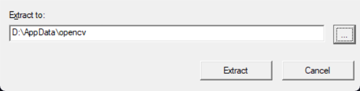
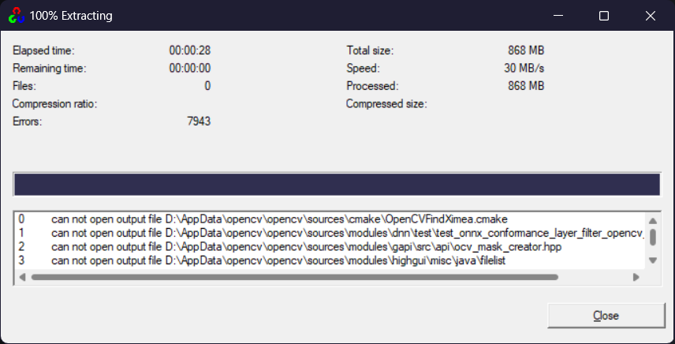
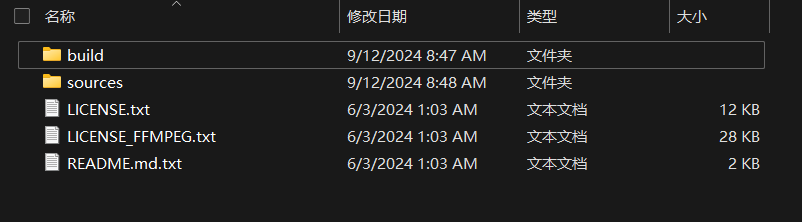
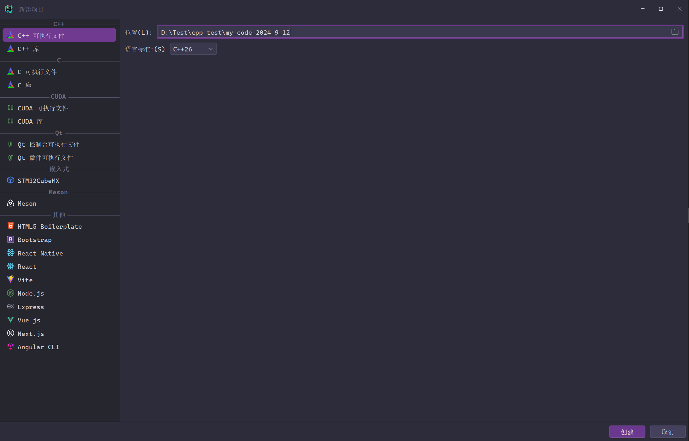
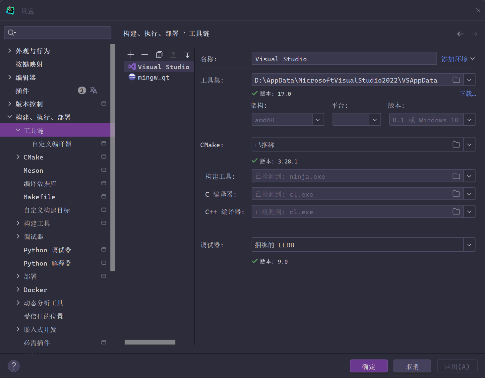

# 1.opencv 的安装

这里使用 `C/Cpp` 环境的 `OpenCV`，如果是 `Python` 您只需要使用 `python -m pip install opencv-python` 即可安装好 `opencv` 本身和相关依赖，但是 `C/Cpp` 的话可以考虑直接安装库文件而去除较久的编译环节，[详情请看 opencv 的安装文档](https://opencv.org/get-started/)。

>   注意：我是 `Windows` 环境，`Linux` 环境请自行研究。

# 

```python
# 第一段 opencv python 程序
import cv2 as cv
img = cv.imread("您本地上某张图片路径") # 从指定路径中读取图片, 图像会以数组的形式被读取

cv.imshow("Display window", img) # 在窗口中显示图像, 标题为 Display window 
k = cv.waitKey(0) # cv.waitKey(0) 是等待按键事件的函数, 参数 0 表示无限等待, 到用户按下键盘上的任意键, 按下键盘按键后, cv.waitKey() 将会返回该按键的 ASCII 值, 并将其存储在变量 k 中
```

`Cpp` 的话还需要做一些准备，首先下载好安装引导程序，运行起引导程序后，就会自动进行解压安装。







然后我在 `CLion` 中进行开发，如果您使用 `VSCode/VS2022` 等则需要自行配置，去其他地方查一下吧。



构建工具使用我本地的 `VS2022`，在 `Windows` 上我还是更加喜欢用 `cl`，我也推荐您使用 `cl`。




安装好后就可以开始查看文档了：

-   上面这段代码来

# 2.opencv 


