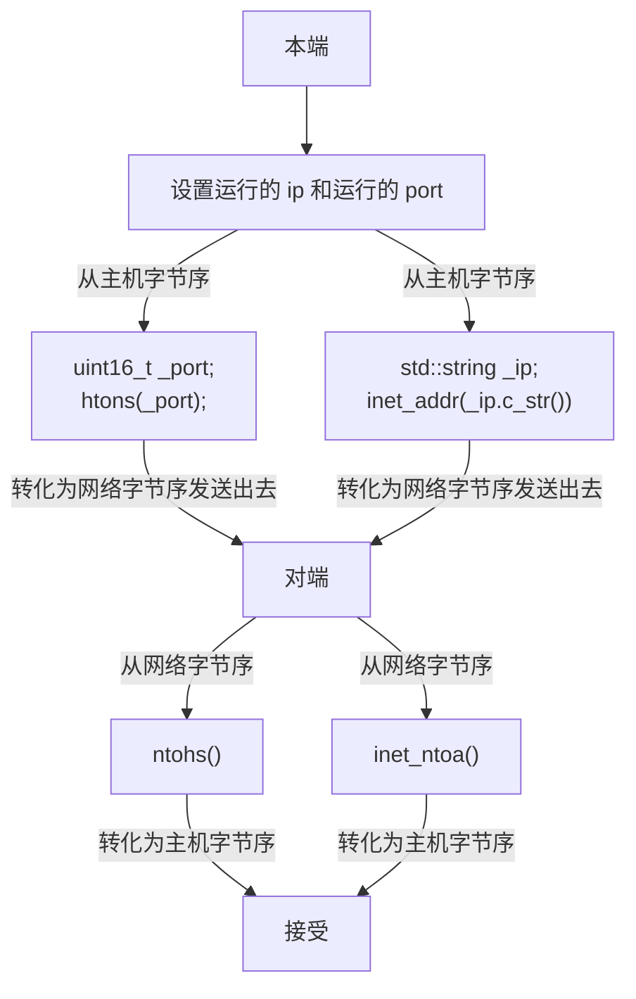
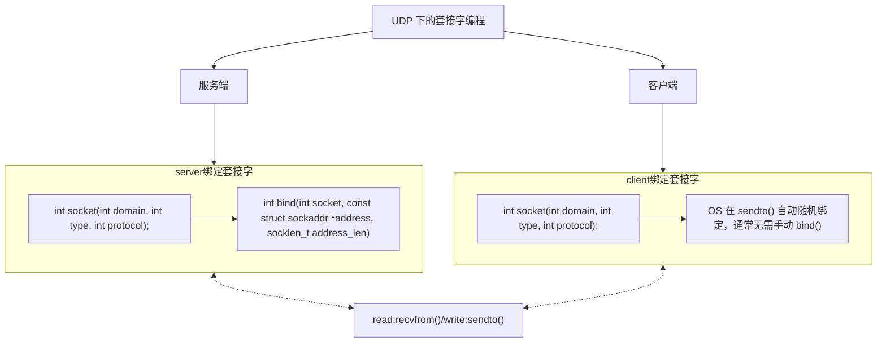
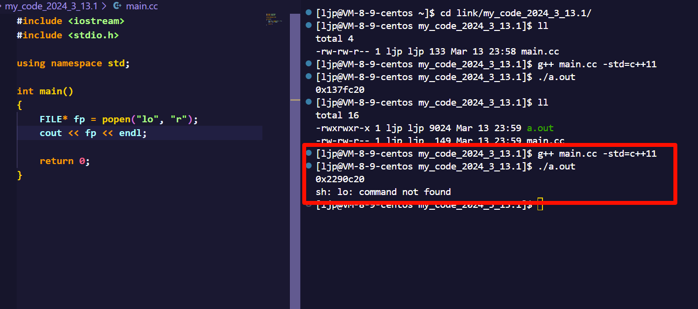
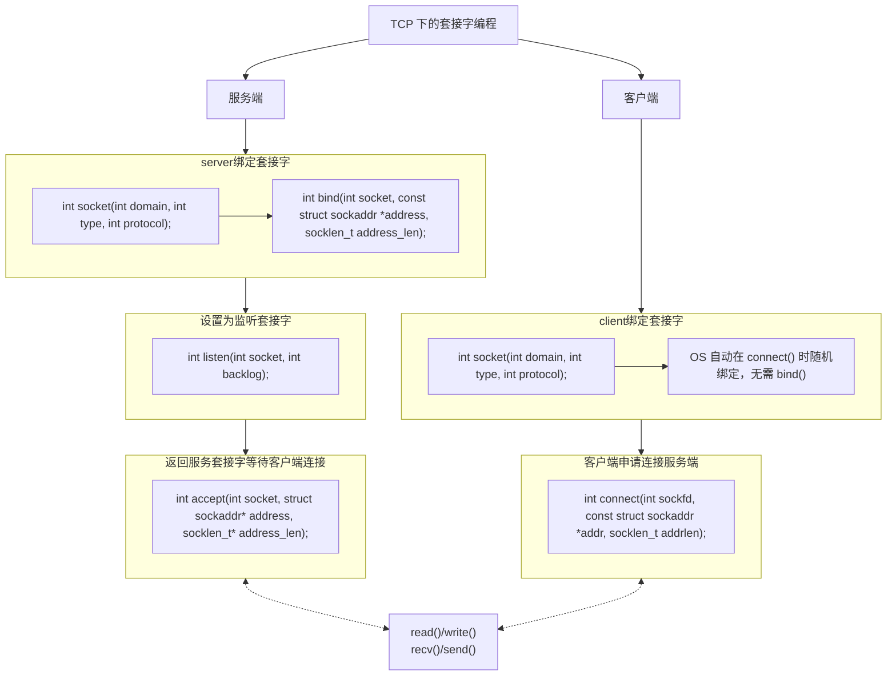

# 1.地址和端口

## 1.1.IP 地址

在传输层发送报文的时候会包含两个地址：

-   **源 IP 地址（Source IP Address）**：这是指发起通信的设备的 `IP` 地址。在网络通信中，每个主机设备都被分配一个唯一的 `IP` 地址，用于标识其在网络上的位置。

-   **目的 IP 地址（Destination IP Address）**：这是指接收通信的主机设备的 `IP` 地址，可以告诉网络中的路由器或交换机将数据包发送到哪个设备。

## 1.2.端口号

端口 **端口号（Port）** 是传输层协议（如 `TCP` 或 `UDP`）中的一个概念，用于标识网络中一个特定的进程或服务。它是一个 `16` 位的整数，取值范围是 `0-65535`。端口号告诉操作系统，对端主机接收到的数据包应该被交给哪个进程或服务处理。`IP` 地址和端口号的组合可以唯一标识网络上的某一台主机的某一个进程。

端口号和进程 `ID` 都是用来 **唯一标识** 一个进程的。

-   端口号是用于标识网络中不同服务或应用程序的
-   而进程 `ID` 是操作系统内部用于标识运行中的进程的。

>   注意：实际上端口号和进程 `ID` 很是相似（当然也有区别），主要时为了使网络和进程两个知识领域进行概念解耦...

一个进程可以同时绑定多个端口号，以便提供多个不同的服务，但是一个端口号不能被多个进程 `ID` 绑定。

如果你有一个使用 `IP` 地址和端口号的通信场景，比如 `QQ` 消息的发送，源 `IP` 地址是发送方的 `IP` 地址，目的 `IP` 地址是接收方的 `IP` 地址，而端口号则用于区分不同的服务或程序，确保消息到达对端中正确的应用程序或进程。

这样，用户主机和服务主机内的通信，也就是客户端进程和服务端进程之间的进程通信，这就是网络通信的本质。数据在主机间转发仅仅是基本的手段，更为重要的是将数据交给双方主机中对应的进程，也就是将进程和一台主机的特定端口号来关联。

>   补充：端口号有一些常见的分类。
>
>   1.  **系统端口（Well-known ports）**：这些端口号范围是从 `0` 到 `1023`，它们通常用于一些众所周知的网络服务，例如 `HTTP（80）、FTP（21）、SSH（22）、Telnet（23）、SMTP（25）` 等。这些端口号在系统级别被分配给特定的网络服务，因此一般情况下需要特权用户才能使用或绑定到这些端口上。
>   2.  **注册端口（Registered ports）**：这些端口号范围是从 `1024` 到 `49151`，它们用于向公众公布的网络服务。这些端口号通常被软件开发人员分配给自己的网络应用程序，用于在 `Internet` 上提供服务。尽管这些端口号是注册的，但并不保证某个特定端口号未被使用，因此在选择端口号时需要注意避免与其他已知的服务冲突。
>   3.  **动态/私有端口（Dynamic/Private ports）**：这些端口号范围是从 `49152` 到 `65535`，也称为临时端口或私有端口。它们通常由客户端程序动态分配，用于临时网络连接或通信。例如，当客户端通过 `TCP` 建立连接时，会动态地选择一个未被占用的端口号作为源端口，然后与服务器的目标端口进行通信（这点后面编写客户端代码时有提及）。

## 1.3.套接字

`IP地址 + 端口号` 就标识了全网内唯一的一个进程，两份这样的“数据对”：

-   套接字：`SRC_IP + SRC_PORT`
-   套接字：`DST_IP + DST_PORT`

两份套接字再进行关联就建立了客户端和服务端的连接，其后续相关的编程也就是 **套接字编程**。

而端口又涉及到 `TCP` 协议和 `UDP` 协议，这两种协议都可以在传输层被使用，可以被相互替换。

>   补充 `1`：云服务器的端口需要被开放，才能被别的服务器访问，这方面我写在另外一篇博文里...

>   补充 `2`：简单理解两个协议
>
>   **简单理解 UDP 协议**
>
>   -   **传输层协议**：该协议在传输层中被使用
>   -   **无连接**：不用在代码中刻意建立连接，是直接发送的（类似给某人写信）
>   -   **不可靠传输**：在网络不可靠的情况下，有可能出现丢包和乱序的问题（但在网络中依旧被采纳），使用于实时性要求较高的应用（不可靠是中性词，这也意味着 UDP 的实现比较简单）
>   -   **面向数据报**：以后补充...
>
>   **简单理解 TCP 协议**
>
>   -   **传输层协议**：该协议在传输层中被使用
>   -   **有连接**：需要在代码中建立连接（类似给某人打电话）
>   -   **可靠传输**：适用于需要可靠数据传输的应用，但可靠的编码代价有可能会让应用缺失实时性，并且更加复杂（因此可靠不一定是好事）
>   -   **面向字节流**：以后待补充...

>   补充 `3`：一般实时性不强的应用会优先使用 `TCP`，有些应用还支持用户自定义选择。

# 2.网络字节序

内存中的多字节数据相对于内存地址有大小端之分，磁盘文件中的多字节数据相对于文件中的偏移地址也有大端小端之分，而网络数据流同样也有大端小端之分。

发送主机通常将发送缓冲区中的数据按内存地址 **从低字节到高字节的顺序发出**，接收主机把从网络上接到的字节依次保存在接收缓冲区中，也是 **按内存地址从低到高的顺序保存**，因此网络数据流的地址应规定：

-   先发出的数据是低地址，后发出的数据是高地址
-   `TCP/IP` 协议规定, 网络数据流应采用大端字节序，即低地址放高位字节
-   不管主机是大端机还是小端机，都需要按照 `TCP/IP` 规定的网络字节序来发送/接收数据
-   如果当前发送主机为小端，就需要先将数据转成大端，否则忽略转化直接发送即可

为使网络程序具有可移植性, 使同样的 `C` 代码在大端和小端计算机上编译后都能正常运行, 可以调用以下库函数做网络字节序和主机字节序的转换。

涉及到主机序列和网络序列的相关函数有 `htons()、ntohs()、htonl()、ntohl()、inet_addr()、inet_ntoa()`。

```cpp
//htons()、ntohs()、htonl()、ntohl()、inet_addr()、inet_ntoa() 声明
uint16_t htons(uint16_t hostshort); //将 16 位主机字节序的 port 转换为网络字节序（用在端口号转化）
uint16_t ntohs(uint16_t netshort); //将 16 位网络字节序的 port 转换为主机字节序（用在端口号转化）

uint32_t htonl(uint32_t hostlong); //将 32 位主机字节序的 port 转换为网络字节序（用在端口号转化）
uint32_t ntohl(uint32_t netlong); //将 32 位网络字节序的 port 转换为主机字节序（用在端口号转化）

in_addr_t inet_addr(const char *ip); //将主机字节序 ip 转化为网络字节序
char *inet_ntoa(struct in_addr in); //将网络字节序的 ip 转化为主机字节序
```

>   补充：`h` 表示 `host`，而 `n` 表示 `network`。

在 `Linux` 下进行套接字编程时，通常只需要对 `IP` 地址和 `port` 进行字节序的转换，而不需要对发送的数据进行转换，因为套接字接口已经处理了发送数据的转换。

在本系列文章中，我们主要使用 `htons()` 和 `inet_addr()` 来对端口号和地址进行字节序转化。



# 3.套接字编程

## 3.1.套接字编程分类

`socket` 被翻译为“套接字”，实际上这个翻译还是很迷惑的，翻译成“插座/软件插座/软插座”会更好理解。

这套接口的标准是基于 `POSIX` 的，常见的 `socket` 编程分类主要有：

1.   **原始 socket(Raw Socket)**：通常指的是在网络层（`OSI` 模型的第三层）直接操作数据包的一种套接字。使用原始套接字，需要特殊的权限，程序可以发送和接收未封装的数据包，而不被协议栈处理，这使得程序可以更底层地控制网络数据的处理（但是这样的操作可能对网络和系统造成风险）。
2.   **域间 socket(Local Socket)**：常见于本地通信，和命名管道通信很是类似。通过文件系统中的特殊文件来实现通信，通常被用于实现进程间的 `IPC`（进程间通信）。在 `Unix/Linux` 系统中，这种套接字通常是基于文件系统中的文件路径进行通信的，比如基于文件名的命名套接字和抽象命名套接字。
3.   **网络 socket(Network Socket)**：通常用于描述一般的网络编程中的套接字。常见的网络 `socket` 包括 `TCP socket` 和 `UDP socket`，它们分别基于 `TCP` 和 `UDP` 传输协议，是应用层与传输层之间的接口。

上述三种应用场景，理论上应该是有三种接口，但是 `Linxu` 上统一使用同种接口（只是在传递参数的时候会根据结构体的不同进行区分），而我们重点学习最后一种网络套接字。

## 3.2.套接字编程接口

### 3.2.1.套接相关接口

```cpp
//套接字初始和绑定 API
#include <sys/types.h>
#include <sys/socket.h>

//1.创建 socket，成功的时候返回一个套接字描述符（类似文件描述符，由于 UDP 是面向数据报的，有专门的根据描述符来使用的读写接口。但是 TCP 中直接可以像文件一样使用，这是因为文件和 TCP 都是面向字节流的），失败返回负值并且设置 errno。值得注意的是，可以使用 close() 来关闭这个描述符
int socket (
    int domain, //设置协议家族/地址族/域
    int type, //设置通信类型
    int protocol //设置协议类别
);
//(1)domain(协议家族/地址族/域)：指明将来创建的套接字类型，常见类型如下：
    //a)AF_PACKET：
        //用于底层数据包操作，可以发送和接收原始数据帧。
        //通常需要特殊权限。
    //b)AF_UNIX 或 AF_LOCAL：
        //用于本地通信，套接字由文件系统路径标识。
        //在 Unix/Linux 系统中常用于进程间通信。
    //c)AF_INET（本系列文章多用这个）和 AF_INET6：
        //用于 IPv4/IPv6 网络通信。
        //常用于 TCP 和 UDP 套接字编程。
    //d)其他：AF_IPX、AF_NETLINK（用于 Linux 内核与用户空间之间的通信）AF_25、AF_AX25、AF_ATMPVC、AF_APPLETALK、AF_PACKET、AF_UNSPEC（未指定地址族，由系统自动选择合适的地址族）、AF_BLUETOOTH（用于蓝牙通信）。
//(2)type(通信类型)：
    //a)SOCK_DGRAM：UDP 是面向数据报的，无需建立连接，应该使用这个
    //b)SOCK_STREAM：TCP 是面向字节流的，需要建立连接，应该使用这个
    //c)其他：待补充...
//(3)protocol(协议类别)：基本上前面两个参数填好了这个就固定了，通常填 0 即可自动推导选择相应的协议
//在本系列文章里 socket(AF_INET, SOCK_DGRAM, 0); 或 socket(AF_INET, SOCK_STREAM, 0); 基本是固定写法

//2.绑定套接字，成功返回 0，失败返回负值并且设置 error
int bind (
    int socket, //填入获取到的套接字标识符
    const struct sockaddr *address, //强转后的套接字结构体
    socklen_t address_len //address 结构体的字节大小
);
//可以将用户指定的 ip 和 port 在内核中进行强关联，使用结构体 sockaddr_in 的时候还需要额外加多两个头文件 <netinet/in.h> <arpa/inet.h>，该结构体内需要设置好 sin_family 和 sin_port 和 sin_addr.s_addr，设置之前可以先使用 void bzero(void*s, size_t n) 把指定的空间进行清零（该库函数的头文件为 <strings.h>）
//(1)socket：直接填入之前获取到的套接字标识符
//(2)address：可以填上强转后的套接字结构体，例如 sockaddr_in{/*...*/};、sockaddr_in6{/*...*/};、sockaddr_un{/*...*/}; 内部包含 IP 和 PORT
//(3)address_len：传入的对象结构体的字节长度（sizeof）
```

`套接字 API` 是一层抽象的网络编程通用接口, 适用于各种底层网络协议。然而，各种网络协议的地址格式并不相同，其中参数 `const struct sockaddr* sockaddr` 的结构有如下三种选择：


1.  **`struct sockaddr`**：通用的抽象结构，最原始的结构
2.  **`struct sockaddr_un`**：是用于 `UNIX` 域套接字的结构体
3.  **`struct sockaddr_in`**：用于 `IPv4` 网络地址的结构体（我们重点学习这个）

上述结构体中，接口根据地址类型来判断是哪一种 `socket` 通信，使用接口的时候只需要进行强制类型转化即可。

>   吐槽：为什么不直接设计为 `const void* sockaddr` 呢？有一个可能的猜测是套接字接口设计之初并没有 `void*` 的语法，当然这只是猜测...

### 3.2.2.读写相关接口

读写相关的接口在 `UDP` 和 `TCP` 两种协议上有些许不同，并且 `TCP` 的读写步骤会较多。

```cpp
//UDP 的数据读写接口（由于 UDP 是面向数据报的，因此就需要特别于字节流的读写接口）
#include <sys/types.h>
#include <sys/socket.h>

//1.服务端读取客户端的数据，读取失败返回 -1
ssize_t recvfrom (
    int sockfd,
    void *buf, size_t len,
    int flags,
    struct sockaddr* src_addr,
    socklen_t* addrlen
);
//(1)sockfd：套接字标识符
//(2)buf、len：buf 指向用于读取的缓冲区，len 是该读取缓冲区的大小（读取缓冲区由程序员来设定）
//(3)flag：表示调用操作的可选标志，常用的标志有 MSG_CONFIRM、MSG_DONTWAIT、MSG_ERRQUEUE 等，不用设置为 0 即可
//(4)src_addr（输出型参数）：表示用于存储发送端地址信息的结构体 sockaddr 的指针，如果不需要知道发送端地址则可以传入 NULL
//(5)addrlen（输出型参数）：对于输入参数，表示指定 src_addr 缓冲区的长度，对于输出参数，表示返回 src_addr 结构体的实际长度
//最后两个参数会得到发送端的套接字信息，也相当于一种读取
    
//2.服务端写回客户端的数据
ssize_t sendto (
    int sockfd,
    const void* buf, size_t len,
    int flags, 
    const sockaddr* dest_addr,
    socklen_t addrlen
);
//(1)sockfd：套接字标识符
//(2)buf、len：buf 指向用于写回的缓冲区，len 是该写回缓冲区的大小（写回缓冲区由程序员来设定）
//(3)flag：表示调用操作的可选标志，常用的标志有 MSG_CONFIRM、MSG_DONTWAIT、MSG_ERRQUEUE 等，不用时设置为 0 即可
//(4)dest_addr（输入型参数）：表示用于存储写回端地址信息的结构体 sockaddr 的指针
//(5)addrlen（输入型参数）：对于输入参数，表示指定 dest_addr 缓冲区的长度，对于输出参数，表示返回 src_addr 结构体的实际长度
//最后两个参数会写回写回端的套接字信息，也相当于一种写回
```

```cpp
//TCP 的数据读写接口（由于 TCP 是面向数据流的，还需要更多的安全连接工作，再使用和文件 IO 一样的读写接口或者特用的读写接口）
//1.开始监听客户端的请求（实际上是设置套接字的状态）
int listen (
    int socket,
    int backlog
);
//(1)socket：是之前调用 socket() 函数返回的套接字描述符
//(2)backlog：参数 backlog 是指定连接队列的最大长度。连接队列用于存放尚未被 accept() 函数接受的连接请求。当有新的连接请求到达监听套接字时，如果连接队列已满，新的连接请求将被拒绝。但是以我们当前的知识储备还无法理解这个参数，先照着下面代码用就行


//2.服务端接收客户端的请求，该函数最重要的是返回值，会返回一个提供 IO 服务的套接字，失败返回 -1，并且设置 error
int accept (
    int socket,
    struct sockaddr* address,
    socklen_t* address_len
);
//(1)socket：是之前调用 socket() 函数返回的套接字描述符
//(2)address：当 accept() 函数成功接受了客户端的连接请求时，会将客户端的地址信息填充到这个结构体中
//(3)address_len：当 accept() 函数成功接受了客户端的连接请求时，会更新这个参数，返回客户端地址信息的实际长度


//3.客户端建立连接
int connect (
    int sockfd, 
    const struct sockaddr *addr,
    socklen_t addrlen
);
//(1)socket：客户端调用 connect() 函数时，需要将套接字描述符和服务端的地址信息传递给 connect() 函数，以便建立连接。
//(2)addr：结构体包含了服务端的 IP 地址和端口号等连接信息。
//(3)addrlen：在调用 connect() 函数之前，需要将这个参数设置为 addr 结构体的实际长度。

//4.读写接口
//和文件 IO 的读写接口一样，或者使用下面两个
//读接口
ssize_t recv(int sockfd, void *buf, size_t len, int flags);
//(1)sockfd 是套接字描述符，对于 TCP 套接字，它是由 socket 函数返回的套接字描述符。
//(2)buf 是接收数据的缓冲区的指针。
//(3)len 是要接收的最大字节数。
//(4)flags 是可选的标志参数，通常设置为 0。

//写接口
ssize_t send(int sockfd, const void *buf, size_t len, int flags);
//(1)sockfd 是套接字描述符，对于 TCP 套接字，它是由 socket 函数返回的套接字描述符。
//(2)buf 是要发送的数据的缓冲区的指针。
//(3)len 是要发送的字节数。
//(4)flags 是可选的标志参数，通常设置为 0。
```

## 3.3.套接字编程应用

### 3.3.1.UDP 套接字编程应用



#### 3.3.1.1.通信基本程序

##### 3.3.1.1.1.前要准备工作

使用上述 `API` 来做一个 `CV` 框架，并且先制作出 `makefile` 方便后续的自动化运行。然后拿出我们以前编写的日志头文件，方便我们打印日志消息。

```makefile
# makefile
.PHONY:all
all:udp_client udp_server

udp_client:udp_client.cpp
	g++ -o $@ $^ -std=c++11
udp_server:udp_server.cpp
	g++ -o $@ $^ -std=c++11	
	
.PHONY:clean
clean:
	rm -f udp_client udp_server
	rm -rf log_dir
```

```cpp
//log.hpp

/* 使用方法
Log log = Log(bool debugShow = true,    //选择是否显示 DEBUG 等级的日志消息
    std::string writeMode = "SCREEN",   //选择日志的打印方式
    std::string logFileName = "log"     //选择日志的文件名称
);
log.WriteModeEnable();      //中途可以修改日志的打印方式
log.LogMessage(DEBUG | NORMAL | WARNING | ERROR | FATAL, "%s %d", __FILE__, __LINE__));     //打印日志
*/

#pragma once

#include <iostream>
#include <string>
#include <fstream>

#include <cstdio>
#include <cstdarg>
#include <ctime>
#include <pthread.h>
#include <unistd.h>
#include <sys/stat.h>
#include <sys/types.h>

//日志级别
#define DEBUG 0 //调试
#define NORMAL 1 //正常（或者叫 INFO）
#define WARNING 2 //警告
#define ERROR 3 //错误
#define FATAL 4 //致命

enum WriteMode
{
    SCREEN = 5,
    ONE_FILE,
    CLASS_FILE
};

const char* gLevelMap[] = {
    "DEBUG", //debug 模式
    "NORMAL", //正常（或者叫 INFO）
    "WARNING", //警告
    "ERROR", //非致命错误
    "FATAL" //严重错误
};

const std::string logdir = "log_dir";

//日志功能主要有：日志等级、发送时间、日志内容、代码行数、运行用户
class Log
{
private:
    void __WriteLogToOneFile(std::string logFileName, const std::string& message)
    {
        std::ofstream out(logFileName, std::ios::app);
        if (!out.is_open())
            return;
        out << message;
        out.close();
    }
    void __WriteLogToClassFile(const int& level, const std::string& message)
    {
        std::string logFileName = "./";
        logFileName += logdir;
        logFileName += "/";
        logFileName += _logFileName;
        logFileName += "_";
        logFileName += gLevelMap[level];

        __WriteLogToOneFile(logFileName, message);
    }
    void _WriteLog(const int& level, const std::string& message)
    {
        switch (_writeMode)
        {
        case SCREEN: //向屏幕输出
            std::cout << message;
            break;
        case ONE_FILE: //向单个日志文件输出
            __WriteLogToOneFile("./" + logdir + "/" + _logFileName, message);
            break;
        case CLASS_FILE: //向多个日志文件输出
            __WriteLogToClassFile(level, message);
            break;
        default:
            std::cout << "write mode error!!!" << std::endl;
            break;
        }
    }

public:
    //构造函数，debugShow 为是否显示 debug 消息，writeMode 为日志打印模式，logFileName 为日志文件名
    Log(bool debugShow = true, const WriteMode& writeMode = SCREEN, std::string logFileName = "log")
        : _debugShow(debugShow), _writeMode(writeMode), _logFileName(logFileName)
    {
        mkdir(logdir.c_str(), 0775); //创建目录
    }

    //调整日志打印方式
    void WriteModeEnable(const WriteMode& mode)
    {
        _writeMode = mode;
    }

    //拼接日志消息并且输出
    void LogMessage(const int& level, const char* format, ...)
    {
        //1.若不是 debug 模式，且 level == DEBUG 则不做任何事情
        if (_debugShow == false && level == DEBUG)
            return;

        //2.收集日志标准部分信息
        char stdBuffer[1024];
        time_t timestamp = time(nullptr); //获得时间戳
        struct tm* local_time = localtime(&timestamp); //将时间戳转换为本地时间

        snprintf(stdBuffer, sizeof stdBuffer, "[%s][pid:%s][%d-%d-%d %d:%d:%d]",
            gLevelMap[level],
            std::to_string(getpid()).c_str(),
            local_time->tm_year + 1900, local_time->tm_mon + 1, local_time->tm_mday,
            local_time->tm_hour, local_time->tm_min, local_time->tm_sec
        );

        //3.收集日志自定义部分信息
        char logBuffer[1024];
        va_list args; //声明可变参数列表，实际时一个 char* 类型
        va_start(args, format); //初始化可变参数列表
        vsnprintf(logBuffer, sizeof logBuffer, format, args); //int vsnprintf(char *str, size_t size, const char *format, va_list ap); 是一个可变参数函数，将格式化后的字符串输出到缓冲区中。类似带 v 开头的可变参数函数有很多
        va_end(args); //清理可变参数列表，类似 close() 和 delete

        //4.拼接为一个完整的消息
        std::string message;
        message += "--> 标准日志:"; message += stdBuffer;
        message += "\t 用户日志:"; message += logBuffer;
        message += "\n";

        //5.打印日志消息
        _WriteLog(level, message);
    }
    
private:
    bool _debugShow;
    WriteMode _writeMode;
    std::string _logFileName;
};

```

##### 3.3.1.1.2.编写基础的服务端程序

然后先编写 `udp_server.hpp`，先把我们的基础服务器跑起来。

```cpp
//udp_server.hpp
#pragma once

#include <string>

#include <sys/types.h> //套接字编程的头文件
#include <sys/socket.h>

#include <netinet/in.h> //转化字节序的头文件
#include <arpa/inet.h>

#include <strings.h>

#include "log.hpp"

#define DEBUG_SHOW

class UdpServer
{
    //2.初始服务器自己的 ip 和 port
    public:UdpServer(uint16_t port, std::string ip = "")
        : _port(port), _ip(ip), _sock(-1)
    {
        //3.创建套接字
        if ((_sock = socket(AF_INET, SOCK_DGRAM, 0)) < 0)
        {
            LogMessage(FATAL, "%d %s %s %d", errno, strerror(errno), __FILE__, __LINE__);
            exit(10);
        }

        //4.绑定套接字
        struct sockaddr_in local;
        bzero(&local, sizeof(local)); //比特位置零
        local.sin_family = AF_INET; //设置协议家族/域
        local.sin_port = htons(_port); //设置 port（两字节），主机序列转为网络序列
        local.sin_addr.s_addr = inet_addr(_ip.c_str()); //设置 ip（四字节），内部做了两个步骤：(1)转化为四字节 (2)再转化为网络序列
        if (bind(_sock, (struct sockaddr*)&local, sizeof(local)) < 0)
        {
            LogMessage(FATAL, "%d %s %s %d", errno, strerror(errno), __FILE__, __LINE__);
            exit(20);
        }
        /* 注意，发送消息时，也需要把本地的 ip 和 port 发送对方 */

        //5.提示初始化成功
        LogMessage(NORMAL, "init udp server done ... %d %s %s %d", errno, strerror(errno), __FILE__, __LINE__);
    }

    public:void Start()
    {
        while (true);
    }

    public:~UdpServer()
    {}

private:
    //1.设置成员变量
    uint16_t _port; //port
    std::string _ip; //ip
    int _sock; //socket
};
```

```cpp
//udp_server.cpp
#include <iostream>
#include <memory>
#include <string>
#include <cstdlib>

#include "udp_server.hpp"

static void Usage(std::string proc)
{
    std::cout << "\nUsage: " << proc << " [ip] [port]\n" << std::endl;
}

int main(int argc, char* argv[]) //服务器启动指令 ./udp_server ip port
{
    //1.检查命令是否合法，否则打印使用手册
    if (argc != 3)
    {
        Usage(argv[0]);
        exit(10);
    }

    //2.分割出 IP 和 PORT 信息
    std::string ip = argv[1];
    uint16_t port = atoi(argv[2]);

    //3.使用智能指针托管服务端指针
    std::unique_ptr<UdpServer> svr(new UdpServer(port, ip));

    //4.启动服务端服务
    svr->Start();

    return 0;
}
```

```cpp
//udp_client.cpp
int main(int argc, char const *argv[])
{
    return 0;
}
```

`make` 编译通过后，使用 `./udp_server 0.0.0.0 8080` 即可运行服务端程序，并且可以使用 `netstat -anup` 检验服务端是否可以成功启动。

```shell
# 查看服务器运行情况
# (1)运行服务端程序
$ ./udp_server 0.0.0.0 8080
| 标准日志:[NORMAL][1710299783] | 自定义日志:init udp server done ... 0 Success udp_server.hpp 53 |

# (2)使用 netstat 查看服务端运行情况
$ netstat -anup # -a:所有 -n:尽可能显示数字信息 -u:udp -p:进程
(Not all processes could be identified, non-owned process info
 will not be shown, you would have to be root to see it all.)
Active Internet connections (servers and established)
Proto Recv-Q Send-Q Local Address           Foreign Address         State       PID/Program name    
udp        0      0 0.0.0.0:8080            0.0.0.0:*                           25163/./udp_server
```

可以注意到，现在的服务器是永远不会退出的（因为在 `Start()` 中使用了 `while(true);`），这种进程就是常驻进程，直到服务器宕机才终止。而这种程序也是最担心内存泄漏的，那些只需跑一次的程序哪怕真的内存泄漏了，通常也没有太多的影响。

前面我们只是完成了服务端和套接字的初始和绑定工作，接下来我们进一步编写服务端的读写服务（可能有代码被微调）。

```cpp
//udp_server.hpp
#pragma once

#include <string>
#include <iostream>
#include <cstring>


#include <sys/types.h>
#include <sys/socket.h>
#include <netinet/in.h>
#include <arpa/inet.h>
#include <strings.h>
#include <unistd.h>

#include "log.hpp"

#define DEBUG_SHOW

const int buffSize = 1024;

class UdpServer
{
    //2.初始服务器自己的 ip 和 port
public:
    UdpServer(uint16_t port, std::string ip)
        : _ip(ip), _port(port), _sock(-1)
    {
        //3.创建套接字
        if ( (_sock = socket(AF_INET, SOCK_DGRAM, 0)) < 0 )
        {
            _log.LogMessage(FATAL, "socket() error, %s %d", __FILE__, __LINE__);
            exit(10);
        }

        //4.绑定套接字
        struct sockaddr_in local;
        bzero(&local, sizeof(local)); //比特位置零
        local.sin_family = AF_INET; //设置协议家族/域
        local.sin_addr.s_addr = inet_addr(_ip.c_str()); //设置 ip（四字节），内部做了两个步骤：(1)转化为四字节 (2)再转化为网络序列
        local.sin_port = htons(_port); //设置 port（两字节），主机序列转为网络序列
        if ( bind(_sock, (struct sockaddr*)&local, sizeof(local)) < 0 )
        {
            _log.LogMessage(FATAL, "bind() error, %s %d", __FILE__, __LINE__);
            exit(20);
        }
        /* 注意，发送消息时，也需要把本地的 ip 和 port 发送对方 */

        //5.提示初始化成功
        _log.LogMessage(NORMAL, "UdpServer() success, %s %d", __FILE__, __LINE__);
    }

    void Start()
    {
        while (true)
        {
            //6.提前备好一个结构体，方便读取和写入接口临时使用
            struct sockaddr_in peer;
            bzero(&peer, sizeof(peer)); //比特位置零
            socklen_t peerLen = sizeof(peer); //输入输出型参数 (1)输入缓冲区大小 (2)输出实际读到的 peer 大小，最好写明一下返回的类型

            //7.读取数据
            char readBuff[buffSize] = { 0 }; //初始化为 0，后续就不用添加 '\0' 了
            if ( recvfrom( _sock, readBuff, sizeof(readBuff) - 1, 0, (struct sockaddr*)&peer, &peerLen) > 0 ) //读取成功
            {
                //读取到数据后把客户端发送的数据打印出来，包括客户端的 ip 和 port
                uint16_t cli_port = ntohs(peer.sin_port); //需要反序列
                std::string cli_ip = inet_ntoa(peer.sin_addr); //反序列后转化为点分十进制字符串（还有其他类似的接口）
                std::cout << "ip:[" << cli_ip << "] port:[" << cli_port << "]" << " sad:" << readBuff << std::endl;
                //LogMessage(NORMAL, "server read done ... %d %s %s %d", errno, strerror(errno), __FILE__, __LINE__);
            }
            else //读取失败
            {
                _log.LogMessage(FATAL, "recvfrom() error, %s %d", __FILE__, __LINE__);
                exit(30);
            }

            //8.分析数据
            //TODU...

            //9.写回数据
            //char writerBuff[buffSize] = "Ok~"; //初始化为 0，后续就不用添加 '\0' 了
            //if (sendto(_sock, writerBuff, strlen(writerBuff), 0, (struct sockaddr*)&peer, peerLen) > 0) //读取成功
            //{
            //    LogMessage(NORMAL, "server write done ... %d %s %s %d", errno, strerror(errno), __FILE__, __LINE__);
            //}
            //由于我们希望客户端之间可以通过服务端来通信，因此这里直接把服务端从客户端中读取的数据返回客户端即可，这也后续有多个客户端向服务端发送消息时，服务端返回的信息可以同步给每一个客户端
            if ( sendto(_sock, readBuff, strlen(readBuff), 0, (struct sockaddr*)&peer, peerLen) > 0 ) //写回成功，注意这里是 strlen()，只发送有效的数据，并且前面读取数据的时候也获取了客户端的套接字消息，可以直接在这里使用
            {
                _log.LogMessage(NORMAL, "server write done ...%s %d", __FILE__, __LINE__);
            }
            else //写回失败
            {
                _log.LogMessage(FATAL, "%s %d", __FILE__, __LINE__);
                exit(40);
            }
        }
    }

    ~UdpServer()
    {
        //10.关闭套接字
        if (_sock >= 0)
        {
            close(_sock); //关闭套接字描述符
            _log.LogMessage(NORMAL, "close udp server done ... %s %d", __FILE__, __LINE__);
        }
    }

private:
    //1.设置成员变量
    std::string _ip; //ip
    uint16_t _port; //port
    int _sock; //socket
    Log _log;
};
```

##### 3.3.1.1.3.编写基础的客户端程序

然后开始完善和编写客户端代码。

```cpp
//udp_client.cpp
#include <string>
#include <iostream>

#include <cerrno>
#include <cstring>
#include <cstdlib>

#include <sys/types.h>
#include <sys/socket.h>
#include <netinet/in.h>
#include <arpa/inet.h>
#include <strings.h>
#include <unistd.h>

#include "log.hpp"

const int readBuffSize = 1024;

static void Usage(std::string proc)
{
    std::cout << "\nUsage: " << proc << " [ip] [port]\n" << std::endl;
}

int main(int argc, char* argv[]) //./udp_client 127.0.0.1 8080
{
    Log log;

    //1.检查命令行输入
    if(argc != 3)
    {
        Usage(argv[0]);       
        exit(50);
    }

    //2.创建套接字
    int sock = socket(AF_INET, SOCK_DGRAM, 0);
    if ( sock < 0 ) //补充一个小知识点：也有人把 AF_INET 换成等价的 PF_INET
    {
        log.LogMessage(FATAL, "socket() error, %s %d", __FILE__, __LINE__);
        exit(60);
    }

    //3.绑定套接字
    //但是一般不需要程序员自己 bind，这是因为客户端是被客户端使用的，如果程序员自己 bind 了，
    //那么该客户端的一定是绑定了某个固定的 ip 和 port 万一在多个不关联的客户端同时启动的情况下，
    //就会出现 port 绑定失败的情况，进而导致客户端启动失败。
    //将 bind 操作交给操作系统来做，操作系统对于哪些 port 没有被占用的情况最清楚了。
    
    //4.存储需要访问服务端的 ip 和 port
    struct sockaddr_in server;
    bzero(&server, sizeof(server)); //比特位置零
    server.sin_family = AF_INET; //设置协议家族/域
    server.sin_addr.s_addr = inet_addr(argv[1]); //设置 ip（四字节），内部做了两个步骤：(1)转化为四字节 (2)再转化为网络序列
    server.sin_port = htons(atoi(argv[2])); //设置 port（两字节），主机序列转为网络序列

    while (true)
    {
        //5.向服务端发送消息 message
        std::string message;
        std::cout << "clien >: ";
        std::getline(std::cin, message); //用户输入想要发送的数据
        if ( message == "exit" ) 
            break;
        if ( sendto(sock, message.c_str(), message.size(), 0, (struct sockaddr*)&server, sizeof(server)) > 0 ) //写入成功
        {
            //LogMessage(NORMAL, "client write done ... %d %s %s %d", errno, strerror(errno), __FILE__, __LINE__);
        }
        else //写入失败
        {
            log.LogMessage(FATAL, "sendto() success, %s %d", __FILE__, __LINE__);
            exit(70);
        }

        //6.读取服务端返回的消息
        char readBuff[readBuffSize] = { 0 }; //第一次向服务器发送数据时，操作系统会在 sendto() 执行过程程中自动为服务端绑定

        struct sockaddr_in temp;
        bzero(&temp, sizeof(temp)); //比特位置零
        socklen_t len = sizeof(temp);
        if ( recvfrom(sock, readBuff, sizeof(readBuff) - 1, 0, (struct sockaddr*)&temp, &len) > 0 )
        {
            std::cout << "server echo >: " << readBuff << std::endl;
        }
    }

    //7.关闭套接字
    close(sock);
    log.LogMessage(NORMAL, "close udp client done ... %s %d", __FILE__, __LINE__);
    std::cout << "bye~" << std::endl;

    return 0;
}
```

使用本地 `ip = 127.0.0.1`（也叫“本地环回”，`CS` 模型只在本地协议栈中进行数据流行，不会把数据发送到网络中，只是把协议栈走一个回环，多用于本地测试）启动服务端和 `8080` 端口来启动服务端程序和用户端程序，启动结果如下：

```shell
# 服务端运行结果
$ make clean
rm -f udp_client udp_server
rm -rf log_dir

$ make
g++ -o udp_client udp_client.cpp -std=c++11
g++ -o udp_server udp_server.cpp -std=c++11

$ ./udp_server 127.0.0.1 8080
| 标准日志:[NORMAL][1710316375] | 自定义日志:init udp server done ... 0 Success udp_server.hpp 54 |
ip:[127.0.0.1] port:[43571] sad:Hello, I am Limou3434.
| 标准日志:[NORMAL][1710316409] | 自定义日志:server write done ... 0 Success udp_server.hpp 94 |
```

```shell
# 客户端运行结果
$ ./udp_client 127.0.0.1 8080
clien >: Hello, I am Limou3434.
server echo >: Hello, I am Limou3434.
```

可以看到通信成功，但是这里面是有很多的坑点和补充点的...

##### 3.3.1.1.4.更换服务端程序的 ip 地址为任意

`0.0.0.0` 代表所有可用网络接口，而 `127.0.0.1` 代表本地主机回环地址。

云服务器的服务端程序无法直接绑定某个特定的 `ip` 的（除了上述的两个 `ip`），主要原因是云服务器给的 `ip` 是虚拟后的 `ip`，而不是真实的 `ip` 地址。并且一般也不建议这么做，推荐直接使用 `0.0.0.0` 的方案（实际上也确实有一个关键字 `INADDR_ANY` 的值为 `0.0.0.0`。）

因此我们可以再修改一下，并且总结一下目前的代码。

```makefile
# makefile(通信基本程序)
.PHONY:all
all:udp_client udp_server

udp_client:udp_client.cpp
	g++ -o $@ $^ -std=c++11
udp_server:udp_server.cpp
	g++ -o $@ $^ -std=c++11	
	
.PHONY:clean
clean:
	rm -f udp_client udp_server
	rm -rf log_dir
```

```cpp
//log.hpp(通信基本程序)

/* 使用方法
Log log = Log(bool debugShow = true,    //选择是否显示 DEBUG 等级的日志消息
    std::string writeMode = "SCREEN",   //选择日志的打印方式
    std::string logFileName = "log"     //选择日志的文件名称
);
log.WriteModeEnable();      //中途可以修改日志的打印方式
log.LogMessage(DEBUG | NORMAL | WARNING | ERROR | FATAL, "%s %d", __FILE__, __LINE__));     //打印日志
*/

#pragma once

#include <iostream>
#include <string>
#include <fstream>

#include <cstdio>
#include <cstdarg>
#include <ctime>
#include <pthread.h>
#include <unistd.h>
#include <sys/stat.h>
#include <sys/types.h>

//日志级别
#define DEBUG 0 //调试
#define NORMAL 1 //正常（或者叫 INFO）
#define WARNING 2 //警告
#define ERROR 3 //错误
#define FATAL 4 //致命

enum WriteMode
{
    SCREEN = 5,
    ONE_FILE,
    CLASS_FILE
};

const char* gLevelMap[] = {
    "DEBUG", //debug 模式
    "NORMAL", //正常（或者叫 INFO）
    "WARNING", //警告
    "ERROR", //非致命错误
    "FATAL" //严重错误
};

const std::string logdir = "log_dir";

//日志功能主要有：日志等级、发送时间、日志内容、代码行数、运行用户
class Log
{
private:
    void __WriteLogToOneFile(std::string logFileName, const std::string& message)
    {
        std::ofstream out(logFileName, std::ios::app);
        if (!out.is_open())
            return;
        out << message;
        out.close();
    }
    void __WriteLogToClassFile(const int& level, const std::string& message)
    {
        std::string logFileName = "./";
        logFileName += logdir;
        logFileName += "/";
        logFileName += _logFileName;
        logFileName += "_";
        logFileName += gLevelMap[level];

        __WriteLogToOneFile(logFileName, message);
    }
    void _WriteLog(const int& level, const std::string& message)
    {
        switch (_writeMode)
        {
        case SCREEN: //向屏幕输出
            std::cout << message;
            break;
        case ONE_FILE: //向单个日志文件输出
            __WriteLogToOneFile("./" + logdir + "/" + _logFileName, message);
            break;
        case CLASS_FILE: //向多个日志文件输出
            __WriteLogToClassFile(level, message);
            break;
        default:
            std::cout << "write mode error!!!" << std::endl;
            break;
        }
    }

public:
    //构造函数，debugShow 为是否显示 debug 消息，writeMode 为日志打印模式，logFileName 为日志文件名
    Log(bool debugShow = true, const WriteMode& writeMode = SCREEN, std::string logFileName = "log")
        : _debugShow(debugShow), _writeMode(writeMode), _logFileName(logFileName)
    {
        mkdir(logdir.c_str(), 0775); //创建目录
    }

    //调整日志打印方式
    void WriteModeEnable(const WriteMode& mode)
    {
        _writeMode = mode;
    }

    //拼接日志消息并且输出
    void LogMessage(const int& level, const char* format, ...)
    {
        //1.若不是 debug 模式，且 level == DEBUG 则不做任何事情
        if (_debugShow == false && level == DEBUG)
            return;

        //2.收集日志标准部分信息
        char stdBuffer[1024];
        time_t timestamp = time(nullptr); //获得时间戳
        struct tm* local_time = localtime(&timestamp); //将时间戳转换为本地时间

        snprintf(stdBuffer, sizeof stdBuffer, "[%s][pid:%s][%d-%d-%d %d:%d:%d]",
            gLevelMap[level],
            std::to_string(getpid()).c_str(),
            local_time->tm_year + 1900, local_time->tm_mon + 1, local_time->tm_mday,
            local_time->tm_hour, local_time->tm_min, local_time->tm_sec
        );

        //3.收集日志自定义部分信息
        char logBuffer[1024];
        va_list args; //声明可变参数列表，实际时一个 char* 类型
        va_start(args, format); //初始化可变参数列表
        vsnprintf(logBuffer, sizeof logBuffer, format, args); //int vsnprintf(char *str, size_t size, const char *format, va_list ap); 是一个可变参数函数，将格式化后的字符串输出到缓冲区中。类似带 v 开头的可变参数函数有很多
        va_end(args); //清理可变参数列表，类似 close() 和 delete

        //4.拼接为一个完整的消息
        std::string message;
        message += "--> 标准日志:"; message += stdBuffer;
        message += "\t 用户日志:"; message += logBuffer;
        message += "\n";

        //5.打印日志消息
        _WriteLog(level, message);
    }
    
private:
    bool _debugShow;
    WriteMode _writeMode;
    std::string _logFileName;
};

```

```cpp
//udp_server.hpp(通信基本程序)
#pragma once

#include <string>
#include <iostream>
#include <cstring>
#include <sys/types.h>
#include <sys/socket.h>
#include <netinet/in.h>
#include <arpa/inet.h>
#include <strings.h>
#include <unistd.h>

#include "log.hpp"

#define DEBUG_SHOW

const int buffSize = 1024;

class UdpServer
{
    //2.初始服务器自己的 ip 和 port
public:
    UdpServer(uint16_t port, std::string ip)
        : _ip(ip), _port(port), _sock(-1)
    {
        //3.创建套接字
        if ( (_sock = socket(AF_INET, SOCK_DGRAM, 0)) < 0 )
        {
            _log.LogMessage(FATAL, "socket() error, %s %d", __FILE__, __LINE__);
            exit(10);
        }

        //4.绑定套接字
        struct sockaddr_in local;
        bzero(&local, sizeof(local)); //比特位置零
        local.sin_family = AF_INET; //设置协议家族/域
        local.sin_addr.s_addr = _ip.empty() ? INADDR_ANY : inet_addr(_ip.c_str()); //设置 ip（四字节），内部做了两个步骤：(1)转化为四字节 (2)再转化为网络序列
        local.sin_port = htons(_port); //设置 port（两字节），主机序列转为网络序列
        if ( bind(_sock, (struct sockaddr*)&local, sizeof(local)) < 0 )
        {
            _log.LogMessage(FATAL, "bind() error, %s %d", __FILE__, __LINE__);
            exit(20);
        }
        /* 注意，发送消息时，也需要把本地的 ip 和 port 发送对方 */

        //5.提示初始化成功
        _log.LogMessage(NORMAL, "UdpServer() success, %s %d", __FILE__, __LINE__);
    }

    void Start()
    {
        while (true)
        {
            //6.提前备好一个结构体，方便读取和写入接口临时使用
            struct sockaddr_in peer;
            bzero(&peer, sizeof(peer)); //比特位置零
            socklen_t peerLen = sizeof(peer); //输入输出型参数 (1)输入缓冲区大小 (2)输出实际读到的 peer 大小，最好写明一下返回的类型

            //7.读取数据
            char readBuff[buffSize] = { 0 }; //初始化为 0，后续就不用添加 '\0' 了
            if ( recvfrom( _sock, readBuff, sizeof(readBuff) - 1, 0, (struct sockaddr*)&peer, &peerLen) > 0 ) //读取成功
            {
                //读取到数据后把客户端发送的数据打印出来，包括客户端的 ip 和 port
                uint16_t cli_port = ntohs(peer.sin_port); //需要反序列
                std::string cli_ip = inet_ntoa(peer.sin_addr); //反序列后转化为点分十进制字符串（还有其他类似的接口）
                std::cout << "ip:[" << cli_ip << "] port:[" << cli_port << "]" << " sad:" << readBuff << std::endl;
                _log.LogMessage(NORMAL, "server read done ... %s %d", __FILE__, __LINE__);
            }
            else //读取失败
            {
                _log.LogMessage(FATAL, "recvfrom() error, %s %d", __FILE__, __LINE__);
                exit(30);
            }

            //8.分析数据
            //TODU...

            //9.写回数据
            //char writerBuff[buffSize] = "Ok~"; //初始化为 0，后续就不用添加 '\0' 了
            //if (sendto(_sock, writerBuff, strlen(writerBuff), 0, (struct sockaddr*)&peer, peerLen) > 0) //读取成功
            //{
            //    LogMessage(NORMAL, "server write done ... %s %d", __FILE__, __LINE__);
            //}
            //由于我们希望客户端之间可以通过服务端来通信，因此这里直接把服务端从客户端中读取的数据返回客户端即可，这也后续有多个客户端向服务端发送消息时，服务端返回的信息可以同步给每一个客户端
            if ( sendto(_sock, readBuff, strlen(readBuff), 0, (struct sockaddr*)&peer, peerLen) >= 0 ) //写回成功，注意这里是 strlen()，只发送有效的数据，并且前面读取数据的时候也获取了客户端的套接字消息，可以直接在这里使用
            {
                _log.LogMessage(NORMAL, "server write done ...%s %d", __FILE__, __LINE__);
            }
            else //写回失败
            {
                _log.LogMessage(FATAL, "%s %d", __FILE__, __LINE__);
                exit(40);
            }
        }
    }

    ~UdpServer()
    {
        //10.关闭套接字
        if (_sock >= 0)
        {
            close(_sock); //关闭套接字描述符
            _log.LogMessage(NORMAL, "close udp server done ... %s %d", __FILE__, __LINE__);
        }
    }

private:
    //1.设置成员变量
    std::string _ip;
    uint16_t _port;
    int _sock;
    Log _log;
};
```

```cpp
//udp_server.cpp(通信基本程序)
#include <iostream>
#include <memory>
#include <string>
#include <cstdlib>

#include "udp_server.hpp"

static void Usage(std::string proc)
{
    std::cout << "\nUsage: " << proc << " [ip(optional)] [port]\n" << std::endl;
}

int main(int argc, char* argv[]) //服务器启动指令 ./udp_server ip port
{
    //1.检查命令是否合法，否则打印使用手册
    uint16_t port;
    std::string ip;
    if (argc == 2)
    {
        //2.分割出 PORT 信息
        port = atoi(argv[1]);
    }
    else if (argc == 3)
    {
        //3.分割出 IP 和 PORT 信息
        ip = argv[1];
        port = atoi(argv[2]);
    }
    else
    {
        Usage(argv[0]);
        exit(-1);
    }

    //4.使用智能指针托管服务端指针
    std::unique_ptr<UdpServer> svr(new UdpServer(port, ip));

    //5.启动服务端服务
    svr->Start();

    return 0;
}
```

```cpp
//udp_client.cpp(通信基本程序)
#include <string>
#include <iostream>

#include <cerrno>
#include <cstring>
#include <cstdlib>

#include <sys/types.h>
#include <sys/socket.h>
#include <netinet/in.h>
#include <arpa/inet.h>
#include <strings.h>
#include <unistd.h>

#include "log.hpp"

const int readBuffSize = 1024;

static void Usage(std::string proc)
{
    std::cout << "\nUsage: " << proc << " [ip] [port]\n" << std::endl;
}

int main(int argc, char* argv[]) //./udp_client 127.0.0.1 8080
{
    Log log;

    //1.检查命令行输入
    if(argc != 3)
    {
        Usage(argv[0]);       
        exit(50);
    }

    //2.创建套接字
    int sock = socket(AF_INET, SOCK_DGRAM, 0);
    if ( sock < 0 ) //补充一个小知识点：也有人把 AF_INET 换成等价的 PF_INET
    {
        log.LogMessage(FATAL, "socket() error, %s %d", __FILE__, __LINE__);
        exit(60);
    }

    //3.绑定套接字
    //但是一般不需要程序员自己 bind，这是因为客户端是被客户端使用的，如果程序员自己 bind 了，
    //那么该客户端的一定是绑定了某个固定的 ip 和 port 万一在多个不关联的客户端同时启动的情况下，
    //就会出现 port 绑定失败的情况，进而导致客户端启动失败。
    //将 bind 操作交给操作系统来做，操作系统对于哪些 port 没有被占用的情况最清楚了。
    
    //4.存储需要访问服务端的 ip 和 port
    struct sockaddr_in server;
    bzero(&server, sizeof(server)); //比特位置零
    server.sin_family = AF_INET; //设置协议家族/域
    server.sin_addr.s_addr = inet_addr(argv[1]); //设置 ip（四字节），内部做了两个步骤：(1)转化为四字节 (2)再转化为网络序列
    server.sin_port = htons(atoi(argv[2])); //设置 port（两字节），主机序列转为网络序列

    while (true)
    {
        //5.向服务端发送消息 message
        std::string message;
        std::cout << "clien >: ";
        std::getline(std::cin, message); //用户输入想要发送的数据
        if ( message == "exit" ) 
            break;
        if ( sendto(sock, message.c_str(), message.size(), 0, (struct sockaddr*)&server, sizeof(server)) > 0 ) //写入成功
        {
            log.LogMessage(NORMAL, "client write done ... %s %d", __FILE__, __LINE__);
        }
        else //写入失败
        {
            log.LogMessage(FATAL, "sendto() success, %s %d", __FILE__, __LINE__);
            exit(70);
        }

        //6.读取服务端返回的消息
        char readBuff[readBuffSize] = { 0 }; //第一次向服务器发送数据时，操作系统会在 sendto() 执行过程程中自动为服务端绑定

        struct sockaddr_in temp;
        bzero(&temp, sizeof(temp)); //比特位置零
        socklen_t len = sizeof(temp);
        if ( recvfrom(sock, readBuff, sizeof(readBuff) - 1, 0, (struct sockaddr*)&temp, &len) > 0 )
        {
            std::cout << "server echo >: " << readBuff << std::endl;
        }
    }

    //7.关闭套接字
    close(sock);
    log.LogMessage(NORMAL, "close udp client done ... %s %d", __FILE__, __LINE__);
    std::cout << "bye~" << std::endl;

    return 0;
}
```

尝试运行一下，就可以看到客户端和服务端通信成功。接下来，我们在这份代码的基础上进行修改和微调，创造出更多常见的网络应用。

---

#### 3.3.1.2.远程操作程序

除了发送单纯的文本信息，还可以让服务器根据接受到的指令来执行其他的逻辑。

首先使用介绍 `popen()` 及其系列的方法，该函数原型如下：

```cpp
//popen() 及其方法
#include <stdio.h>
//该函数会通过建立管道和 fork() 出子进程，然后通过 exec 系列接口自动执行 command 命令（内部自动解析命令），失败返回 nullptr 但是这只是证明一个该函数创建管道失败，而不是执行命令失败
FILE* popen(const char* command, const char* type); //type 可以是 "r" 即只读模式
//返回 FILE* 指针，可以当作一个文件来读取任务执行的返回结果
```



>   补充：关于 `popen()` 的 `type` 的用起来确实奇怪，可以看看下面这个例子。
>
>   ```cpp
>   //popen() 的使用例子
>   #include <stdio.h>
>   #include <stdlib.h>
>   
>   int main()
>   {
>     FILE *pipe_fp;
>     char *command = "wc -l";  // 使用wc命令来统计输入的行数
>   
>     //使用 popen() 以写入模式打开管道
>     if ((pipe_fp = popen(command, "w")) == NULL)
>     {
>         perror("popen");
>         exit(EXIT_FAILURE);
>     }
>   
>     //向子进程写入数据
>     fprintf(pipe_fp, "Hello, world!\n");
>     fprintf(pipe_fp, "This is a test.\n");
>     fprintf(pipe_fp, "Goodbye.\n");
>   
>     //关闭管道
>     if (pclose(pipe_fp) == -1)
>     {
>         perror("pclose");
>         exit(EXIT_FAILURE);
>     }
>   
>     return 0;
>   }
>   ```
>
>   这个例子中的写入操作实际上是向子进程（即 `wc -l` 命令）提供输入数据。
>
>   在使用 `popen()` 打开一个管道时，管道中的进程会在读取到数据之前一直等待。这就解释了为什么在执行 `popen()` 后，`wc -l` 命令会等待三行输入。使用了 `fprintf()` 向管道写入了三行数据，然后关闭了管道。这三行数据会被传递给 `wc -l` 命令，但 `wc -l` 会等待更多的输入，直到管道被关闭。
>
>   当你关闭管道时，`wc -l` 命令才会停止等待，并开始计算输入的行数。因为 `popen()` 在 `pclose()` 被调用之前会一直等待子进程完成，所以当 `pclose()` 被调用时，`wc -l` 命令才会结束，返回统计结果。

如果您不用这个命令，也可以选择使用 `pipe()` 在执行 `fork()`，然后使用 `exec` 系列的系统调用进行替换即可（当然，这有点麻烦）。

我们再次修改一下服务端的代码：

```cpp
# makefile(远程操作程序)
.PHONY:all
all:udp_client udp_server

udp_client:udp_client.cpp
	g++ -o $@ $^ -std=c++11
udp_server:udp_server.cpp
	g++ -o $@ $^ -std=c++11	
	
.PHONY:clean
clean:
	rm -f udp_client udp_server
```

```cpp
//log.hpp(远程操作程序)
#pragma once

#include <iostream>
#include <string>

#include <cstdio>
#include <cstdarg>
#include <ctime>

//日志级别
#define DEBUG 0 //调式
#define NORMAL 1 //正常
#define WARNING 2 //警告
#define ERROR 3 //错误
#define FATAL 4 //致命

const char* gLevelMap[] = {
    "DEBUG", //debug 模式
    "NORMAL", //正常
    "WARNING", //警告
    "ERROR", //错误
    "FATAL" //严重错误
};

//日志功能主要有：日志等级+发送时间+日志内容/自定义日志内容+Other（代码行数+运行用户）
void LogMessage(int level, const char *format, ...)
{
#ifndef DEBUG_SHOW
    if (level == DEBUG) return;
#endif
    //日志标准部分 
    char stdBuffer[1024];
    time_t timestamp = time(nullptr); 
    snprintf(stdBuffer, sizeof stdBuffer, "[%s][%d]", gLevelMap[level], timestamp);

    //日志自定义部分
    char logBuffer[1024];
    va_list args; //声明可变参数列表
    va_start(args, format); //初始化可变参数列表
    vsnprintf(logBuffer, sizeof logBuffer, format, args); //int vsnprintf(char *str, size_t size, const char *format, va_list ap); 是一个可变参数函数，将格式化的字符串输出到缓冲区中
    va_end(args); //清理可变参数列表

    //标准+自定义部分直接显示到屏幕上（也可以选择重定向到日志文件里)
    printf("| 标准日志:%s | 自定义日志:%s |\n", stdBuffer, logBuffer);
}
```

```cpp
//udp_server.hpp(远程操作程序)
#pragma once

#include <string>
#include <iostream>

#include <cerrno>
#include <cstring>
#include <cstdlib>

#include <sys/types.h> //套接字编程的头文件
#include <sys/socket.h>

#include <netinet/in.h> //转化字节序的头文件
#include <arpa/inet.h>

#include <strings.h>

#include <unistd.h> //主要是文件 IO 接口的头文件

#include "log.hpp"

#define DEBUG_SHOW

const int buffSize = 1024;

class UdpServer
{
    //2.初始服务器自己的 ip 和 port
    public:UdpServer(std::string ip, uint16_t port) //我把 ip 和 port 修改了顺序
        : _ip(ip), _port(port), _sock(-1)
    {
        //3.创建套接字
        if ( (_sock = socket(AF_INET, SOCK_DGRAM, 0)) < 0 )
        {
            LogMessage(FATAL, "%d %s %s %d", errno, strerror(errno), __FILE__, __LINE__);
            exit(10);
        }

        //4.绑定套接字
        struct sockaddr_in local;
        bzero(&local, sizeof(local)); //比特位置零
        local.sin_family = AF_INET; //设置协议家族/域
        local.sin_addr.s_addr = _ip.empty() ? INADDR_ANY : inet_addr(_ip.c_str()); //设置 ip（四字节），内部做了两个步骤：(1)转化为四字节 (2)再转化为网络序列
        local.sin_port = htons(_port); //设置 port（两字节），主机序列转为网络序列
        if ( bind(_sock, (struct sockaddr*)&local, sizeof(local)) < 0 )
        {
            LogMessage(FATAL, "%d %s %s %d", errno, strerror(errno), __FILE__, __LINE__);
            exit(20);
        }
        /* 注意，发送消息时，也需要把本地的 ip 和 port 发送对方 */

        //5.提示初始化成功
        LogMessage(NORMAL, "init udp server done ... %d %s %s %d", errno, strerror(errno), __FILE__, __LINE__);
    }

    public:void Start()
    {
        while (true)
        {
            //6.提前备好一个结构体，方便读取和写入接口临时使用
            struct sockaddr_in peer;
            bzero(&peer, sizeof(peer)); //比特位置零
            socklen_t peerLen = sizeof(peer); //输入输出型参数 (1)输入缓冲区大小 (2)输出实际读到的 peer 大小，最好写明一下返回的类型

            //7.读取数据
            char readBuff[buffSize] = { 0 }; //初始化为 0，后续就不用添加 '\0' 了
            std::string cmd_echo; //用于存储指令执行的结果返回给用户
            if (recvfrom(_sock, readBuff, sizeof(readBuff) - 1, 0, (struct sockaddr*)&peer, &peerLen) > 0) //读取成功
            {
                //8.更换模块，可以远程执行命令
                if (strcmp(readBuff, "rm") == 0 || strcmp(readBuff, "rmdir") == 0) //危险的指令
                {
                    LogMessage(WARNING, "!!! The user executes dangerous instructions !!! %d %s %s %d", errno, strerror(errno), __FILE__, __LINE__);
                    cmd_echo = "refuse";
                }
                else //非危险指令
                {
                    FILE* fp = popen(readBuff, "r");

                    if (nullptr == fp) //管道创建出错
                    {
                        LogMessage(ERROR, "%s popen() error %d %s %s %d", readBuff, errno, strerror(errno), __FILE__, __LINE__);
                        exit(50);
                    }
                    else //管道创建无错
                    {
                        char result[256] = { 0 };
                        while (fgets(result, sizeof(result), fp) != nullptr)
                        {
                            cmd_echo += result;
                        }

                        if (cmd_echo.size() == 0) //有可能出现没有返回值，这里比较武断直接判断为非法指令（实际上有些不准确）
                            cmd_echo = "command not found";

                        fclose(fp); //关闭管道文件
                    }
                }
            }
            else //读取失败
            {
                LogMessage(FATAL, "%d %s %s %d", errno, strerror(errno), __FILE__, __LINE__);
                exit(30);
            }

            //9.写回数据
            if ( sendto(_sock, cmd_echo.c_str(), cmd_echo.size(), 0, (struct sockaddr*)&peer, peerLen) > 0 ) //写回成功，注意这里是 strlen()，只发送有效的数据，并且前面读取数据的时候也获取了客户端的套接字消息，可以直接在这里使用
            {
                LogMessage(NORMAL, "server write done ... %d %s %s %d", errno, strerror(errno), __FILE__, __LINE__);
            }
            else //写回失败
            {
                LogMessage(FATAL, "%d %s %s %d", errno, strerror(errno), __FILE__, __LINE__);
                exit(40);
            }
        }
    }

    public:~UdpServer()
    {
        //10.关闭套接字
        if (_sock >= 0)
        {
            close(_sock); //关闭套接字描述符
            LogMessage(NORMAL, "close udp server done ... %d %s %s %d", errno, strerror(errno), __FILE__, __LINE__);
        }
    }

private:
    //1.设置成员变量
    std::string _ip; //ip
    uint16_t _port; //port
    int _sock; //socket
};
```

```cpp
//udp_server.cpp(远程操作程序)
#include <iostream>
#include <memory>
#include <string>
#include <cstdlib>

#include "udp_server.hpp"

static void Usage(std::string proc)
{
    std::cout << "\nUsage: " << proc << " [ip(optional)] [port]\n" << std::endl;
}

int main(int argc, char* argv[]) //服务器启动指令 ./udp_server ip port
{
    //1.检查命令是否合法，否则打印使用手册
    uint16_t port;
    std::string ip;
    if (argc == 2)
    {
        //2.分割出 PORT 信息
        port = atoi(argv[1]);
    }
    else if (argc == 3)
    {
        //3.分割出 IP 和 PORT 信息
        ip = argv[1];
        port = atoi(argv[2]);
    }
    else
    {
        Usage(argv[0]);
        exit(-1);
    }

    //4.使用智能指针托管服务端指针
    std::unique_ptr<UdpServer> svr(new UdpServer(ip, port));

    //5.启动服务端服务
    svr->Start();

    return 0;
}
```

```cpp
//udp_client.cpp(网络通信程序)
#include <string>
#include <iostream>

#include <cerrno>
#include <cstring>
#include <cstdlib>

#include <sys/types.h> //套接字编程的头文件
#include <sys/socket.h>

#include <netinet/in.h> //转化字节序的头文件
#include <arpa/inet.h>

#include <strings.h>

#include <unistd.h> //主要是文件 IO 接口的头文件

#include "log.hpp"

const int readBuffSize = 1024;

static void Usage(std::string proc)
{
    std::cout << "\nUsage: " << proc << " [ip] [port]\n" << std::endl;
}

int main(int argc, char* argv[]) //./udp_client 127.0.0.1 8080
{
    //1.检查命令行输入
    if(argc != 3)
    {
        Usage(argv[0]);       
        exit(50);
    }

    //2.创建套接字
    int sock = socket(AF_INET, SOCK_DGRAM, 0);
    if ( sock < 0 ) //补充一个小知识点：也有人把 AF_INET 换成等价的 PF_INET
    {
        LogMessage(FATAL, "%d %s %s %d", errno, strerror(errno), __FILE__, __LINE__);
        exit(60);
    }

    //3.绑定套接字
    //但是一般不需要程序员自己 bind，这是因为客户端是被客户端使用的，如果程序员自己 bind 了，
    //那么该客户端的一定是绑定了某个固定的 ip 和 port 万一在多个不关联的客户端同时启动的情况下，
    //就会出现 port 绑定失败的情况，进而导致客户端启动失败。
    //将 bind 操作交给操作系统来做，操作系统对于哪些 port 没有被占用的情况最清楚了。
    
    //4.存储需要访问服务端的 ip 和 port
    struct sockaddr_in server;
    bzero(&server, sizeof(server)); //比特位置零
    server.sin_family = AF_INET; //设置协议家族/域
    server.sin_addr.s_addr = inet_addr(argv[1]); //设置 ip（四字节），内部做了两个步骤：(1)转化为四字节 (2)再转化为网络序列
    server.sin_port = htons(atoi(argv[2])); //设置 port（两字节），主机序列转为网络序列

    while (true)
    {
        //5.向服务端发送消息 message
        std::string message;
        std::cout << "clien >: ";
        std::getline(std::cin, message); //用户输入想要发送的数据
        if ( message == "exit" ) 
            break;
        if ( sendto(sock, message.c_str(), message.size(), 0, (struct sockaddr*)&server, sizeof(server)) >= 0 ) //写入成功
        {
            //LogMessage(NORMAL, "client write done ... %d %s %s %d", errno, strerror(errno), __FILE__, __LINE__);
        }
        else //写入失败
        {
            LogMessage(FATAL, "%d %s %s %d", errno, strerror(errno), __FILE__, __LINE__);
            exit(70);
        }

        //6.读取服务端返回的消息
        char readBuff[readBuffSize] = { 0 }; //第一次向服务器发送数据时，操作系统会在 sendto() 执行过程程中自动为服务端绑定

        //实际上我们已经有了服务端的 ip 和 port 的信息了，这里我只是为了占位和调用规范写的，在本项目中可以不怎么处理（有时候客户端可以是其他端的客户端）
        struct sockaddr_in temp;
        bzero(&temp, sizeof(temp)); //比特位置零
        socklen_t len = sizeof(temp);
        if ( recvfrom(sock, readBuff, sizeof(readBuff) - 1, 0, (struct sockaddr*)&temp, &len) >= 0 )
        {
            std::cout << "server echo >: " << readBuff << std::endl;
        }
        else //读取失败
        {
            LogMessage(FATAL, "%d %s %s %d", errno, strerror(errno), __FILE__, __LINE__);
            exit(80);
        }
    }

    //7.关闭套接字
    close(sock);
    LogMessage(NORMAL, "close udp client done ... %d %s %s %d", errno, strerror(errno), __FILE__, __LINE__);
    std::cout << "bye~" << std::endl;

    return 0;
}
```

这样就可以让客户端操控服务端，没错，如果您有机会给客户端做一个界面，那就是一个简易版的远端云服务器的操作端...

>   注意：当然我们目前的服务端还是不支持类似 `vim` 和 `top` 等指令，原因是这些指令都需要进行交互。

#### 3.3.1.3.群体聊天程序

我们稍微改一下 `udp_server.hpp` 即可，来尝试开发一个群聊系统（`BBS`）。

```cpp
//udp_server.hpp
#pragma once

#include <string>
#include <iostream>
#include <unordered_map>

#include <cerrno>
#include <cstring>
#include <cstdlib>

#include <sys/types.h> //套接字编程的头文件
#include <sys/socket.h>

#include <netinet/in.h> //转化字节序的头文件
#include <arpa/inet.h>

#include <strings.h>

#include <unistd.h> //主要是文件 IO 接口的头文件

#include "log.hpp"

#define DEBUG_SHOW

const int buffSize = 1024;

class UdpServer
{
    //2.初始服务器自己的 ip 和 port
    public:UdpServer(std::string ip, uint16_t port) //我把 ip 和 port 修改了顺序
        : _ip(ip), _port(port), _sock(-1)
    {
        //3.创建套接字
        if ( (_sock = socket(AF_INET, SOCK_DGRAM, 0)) < 0 )
        {
            LogMessage(FATAL, "%d %s %s %d", errno, strerror(errno), __FILE__, __LINE__);
            exit(10);
        }

        //4.绑定套接字
        struct sockaddr_in local;
        bzero(&local, sizeof(local)); //比特位置零
        local.sin_family = AF_INET; //设置协议家族/域
        local.sin_addr.s_addr = _ip.empty() ? INADDR_ANY : inet_addr(_ip.c_str()); //设置 ip（四字节），内部做了两个步骤：(1)转化为四字节 (2)再转化为网络序列
        local.sin_port = htons(_port); //设置 port（两字节），主机序列转为网络序列
        if ( bind(_sock, (struct sockaddr*)&local, sizeof(local)) < 0 )
        {
            LogMessage(FATAL, "%d %s %s %d", errno, strerror(errno), __FILE__, __LINE__);
            exit(20);
        }
        /* 注意，发送消息时，也需要把本地的 ip 和 port 发送对方 */

        //5.提示初始化成功
        LogMessage(NORMAL, "init udp server done ... %d %s %s %d", errno, strerror(errno), __FILE__, __LINE__);
    }

    public:void Start()
    {
        while (true)
        {
            //6.提前备好一个结构体，方便读取和写入接口临时使用
            struct sockaddr_in peer;
            bzero(&peer, sizeof(peer)); //比特位置零
            socklen_t peerLen = sizeof(peer); //输入输出型参数 (1)输入缓冲区大小 (2)输出实际读到的 peer 大小，最好写明一下返回的类型

            //7.读取数据
            char readBuff[buffSize] = { 0 }; //初始化为 0，后续就不用添加 '\0' 了
            uint16_t cli_port = 0;
            std::string cli_ip;
            if (recvfrom(_sock, readBuff, sizeof(readBuff) - 1, 0, (struct sockaddr*)&peer, &peerLen) > 0) //读取成功
            {
                //读取到数据后把客户端发送的数据打印出来，包括客户端的 ip 和 port
                cli_port = ntohs(peer.sin_port); //需要反序列
                cli_ip = inet_ntoa(peer.sin_addr); //反序列后转化为点分十进制字符串（还有其他类似的接口）
                std::cout << "ip:[" << cli_ip << "] port:[" << cli_port << "]" << " sad:" << readBuff << std::endl;
                //LogMessage(NORMAL, "server read done ... %d %s %s %d", errno, strerror(errno), __FILE__, __LINE__);
            }
            else //读取失败
            {
                LogMessage(FATAL, "%d %s %s %d", errno, strerror(errno), __FILE__, __LINE__);
                exit(30);
            }

            //8.分析数据（注意之前读取的时候就可以获取到客户端的 ip 和 port）
            char key[64]; //初始化为 0，后续就不用添加 '\0' 了
            snprintf(key, sizeof(key), "{%s-%u}", cli_ip.c_str(), cli_port);

            auto it = _users.find(key);
            if (it == _users.end()) //用户不存在用户列表中
            {
                LogMessage(NORMAL, "add new user %s, %d %s %s %d", key, errno, strerror(errno), __FILE__, __LINE__);
                _users[key] = peer;
            }

            //9.更换模块：改为群聊系统
            for (auto& iter : _users)
            {
                if ( sendto(_sock, readBuff, strlen(readBuff), 0, (struct sockaddr*)&(iter.second), peerLen) >= 0) //写回成功
                {
                    LogMessage(NORMAL, "push message to %s, server write done ... %d %s %s %d", iter.first.c_str(), errno, strerror(errno), __FILE__, __LINE__);
                }
                else //写回失败
                {
                    LogMessage(FATAL, "%d %s %s %d", errno, strerror(errno), __FILE__, __LINE__);
                    exit(40);
                }
            }
        }
    }

    public:~UdpServer()
    {
        //10.关闭套接字
        if (_sock >= 0)
        {
            close(_sock); //关闭套接字描述符
            LogMessage(NORMAL, "close udp server done ... %d %s %s %d", errno, strerror(errno), __FILE__, __LINE__);
        }
    }

private:
    //1.设置成员变量
    std::string _ip; //ip
    uint16_t _port; //port
    int _sock; //socket
    std::unordered_map<std::string, struct sockaddr_in> _users; //存储不同<客户端,套接字信息>
};
```

但这里有一个坑，由于 `UDP` 的读写接口中，如果客户端需要读取数据时必须处于运行状态，而不能进入阻塞，然而客户端的写入操作就有可能使得客户端陷入阻塞状态，因此必须要将读写操作分离，也就意味着我们必须写出多线程的代码。

我们引入之前封装的线程库再对客户端进行修改（要使用线程时，也需要修改一下）。

```makefile
# makefile(群体聊天程序)
.PHONY:all
all:udp_client udp_server

udp_client:udp_client.cpp
	g++ -o $@ $^ -std=c++11 -lpthread
udp_server:udp_server.cpp
	g++ -o $@ $^ -std=c++11 -lpthread
	
.PHONY:clean
clean:
	rm -f udp_client udp_server
```

```cpp
//log.hpp(群体聊天程序)
#pragma once

#include <iostream>
#include <string>

#include <cstdio>
#include <cstdarg>
#include <ctime>

//日志级别
#define DEBUG 0 //调式
#define NORMAL 1 //正常
#define WARNING 2 //警告
#define ERROR 3 //错误
#define FATAL 4 //致命

const char* gLevelMap[] = {
    "DEBUG", //debug 模式
    "NORMAL", //正常
    "WARNING", //警告
    "ERROR", //错误
    "FATAL" //严重错误
};

//日志功能主要有：日志等级+发送时间+日志内容/自定义日志内容+Other（代码行数+运行用户）
void LogMessage(int level, const char *format, ...)
{
#ifndef DEBUG_SHOW
    if (level == DEBUG) return;
#endif
    //日志标准部分 
    char stdBuffer[1024];
    time_t timestamp = time(nullptr); 
    snprintf(stdBuffer, sizeof stdBuffer, "[%s][%d]", gLevelMap[level], timestamp);

    //日志自定义部分
    char logBuffer[1024];
    va_list args; //声明可变参数列表
    va_start(args, format); //初始化可变参数列表
    vsnprintf(logBuffer, sizeof logBuffer, format, args); //int vsnprintf(char *str, size_t size, const char *format, va_list ap); 是一个可变参数函数，将格式化的字符串输出到缓冲区中
    va_end(args); //清理可变参数列表

    //标准+自定义部分直接显示到屏幕上（也可以选择重定向到日志文件里)
    printf("| 标准日志:%s | 自定义日志:%s |\n", stdBuffer, logBuffer);
}
```

```cpp
//thread.hpp(群体聊天程序)
#pragma once

#include <iostream>
#include <string>
#include <functional>
#include <pthread.h>

template<class T>
using func_t = std::function<void(T)>;

template<class T>
class Thread
{
    //初始对象
    public: Thread(const std::string& threadname, func_t<T> func, T data)
        :_tid(0), _threadname(threadname), _isrunning(false), _func(func), _data(data)
    {}

    //处理事务
    private: static void *ThreadRoutine(void *args) //去除方法的 this 参数
    {
        Thread *ts = static_cast<Thread*>(args);
        ts->_func(ts->_data);
        return nullptr;
    }

    //创建线程
    public: bool Start()
    {
        int n = pthread_create(
            &_tid, //存储线程 id
            nullptr, //获取线程属性（但是置空，我们暂时不需要）
            ThreadRoutine, //线程方法
            this //线程方法参数，就是获得一个 Thread 对象的指针
        );
        if(n == 0) 
        {
            _isrunning = true;
            return true;
        }
        else
        {
            return false;
        }
    }
    
    //释放线程
    public: bool Join()
    {
        if(!_isrunning)
            return true;
        
        int n = pthread_join(_tid, nullptr);
        if(n == 0)
        {
            _isrunning = false;
            return true;
        }
        
        return false;
    }
    
    //取得线程名字
    public: std::string ThreadName()
    {
        return _threadname;
    }
    
    //取得线程状态
    public: bool IsRunning()
    {
        return _isrunning;
    }
    
private:
    pthread_t _tid; //线程 id
    std::string _threadname; //线程名字
    bool _isrunning; //线程状态
    func_t<T> _func; //线程方法
    T _data; //线程数据
};
```

```cpp
//udp_server.hpp(群体聊天程序)
#pragma once

#include <string>
#include <iostream>
#include <unordered_map>

#include <cerrno>
#include <cstring>
#include <cstdlib>

#include <sys/types.h> //套接字编程的头文件
#include <sys/socket.h>

#include <netinet/in.h> //转化字节序的头文件
#include <arpa/inet.h>

#include <strings.h>

#include <unistd.h> //主要是文件 IO 接口的头文件

#include "log.hpp"

#define DEBUG_SHOW

const int buffSize = 1024;

class UdpServer
{
    //2.初始服务器自己的 ip 和 port
    public:UdpServer(std::string ip, uint16_t port) //我把 ip 和 port 修改了顺序
        : _ip(ip), _port(port), _sock(-1)
    {
        //3.创建套接字
        if ( (_sock = socket(AF_INET, SOCK_DGRAM, 0)) < 0 )
        {
            LogMessage(FATAL, "%d %s %s %d", errno, strerror(errno), __FILE__, __LINE__);
            exit(10);
        }

        //4.绑定套接字
        struct sockaddr_in local;
        bzero(&local, sizeof(local)); //比特位置零
        local.sin_family = AF_INET; //设置协议家族/域
        local.sin_addr.s_addr = _ip.empty() ? INADDR_ANY : inet_addr(_ip.c_str()); //设置 ip（四字节），内部做了两个步骤：(1)转化为四字节 (2)再转化为网络序列
        local.sin_port = htons(_port); //设置 port（两字节），主机序列转为网络序列
        if ( bind(_sock, (struct sockaddr*)&local, sizeof(local)) < 0 )
        {
            LogMessage(FATAL, "%d %s %s %d", errno, strerror(errno), __FILE__, __LINE__);
            exit(20);
        }
        /* 注意，发送消息时，也需要把本地的 ip 和 port 发送对方 */

        //5.提示初始化成功
        LogMessage(NORMAL, "init udp server done ... %d %s %s %d", errno, strerror(errno), __FILE__, __LINE__);
    }

    public:void Start()
    {
        while (true)
        {
            //6.提前备好一个结构体，方便读取和写入接口临时使用
            struct sockaddr_in peer;
            bzero(&peer, sizeof(peer)); //比特位置零
            socklen_t peerLen = sizeof(peer); //输入输出型参数 (1)输入缓冲区大小 (2)输出实际读到的 peer 大小，最好写明一下返回的类型

            //7.读取数据
            char readBuff[buffSize] = { 0 }; //初始化为 0，后续就不用添加 '\0' 了
            uint16_t cli_port = 0;
            std::string cli_ip;
            if (recvfrom(_sock, readBuff, sizeof(readBuff) - 1, 0, (struct sockaddr*)&peer, &peerLen) > 0) //读取成功
            {
                //读取到数据后把客户端发送的数据打印出来，包括客户端的 ip 和 port
                cli_port = ntohs(peer.sin_port); //需要反序列
                cli_ip = inet_ntoa(peer.sin_addr); //反序列后转化为点分十进制字符串（还有其他类似的接口）
                std::cout << "ip:[" << cli_ip << "] port:[" << cli_port << "]" << " sad:" << readBuff << std::endl;
                //LogMessage(NORMAL, "server read done ... %d %s %s %d", errno, strerror(errno), __FILE__, __LINE__);
            }
            else //读取失败
            {
                LogMessage(FATAL, "%d %s %s %d", errno, strerror(errno), __FILE__, __LINE__);
                exit(30);
            }

            //8.分析数据（注意之前读取的时候就可以获取到客户端的 ip 和 port）
            char key[64]; //初始化为 0，后续就不用添加 '\0' 了
            snprintf(key, sizeof(key), "{%s-%u}", cli_ip.c_str(), cli_port);

            auto it = _users.find(key);
            if (it == _users.end()) //用户不存在用户列表中
            {
                LogMessage(NORMAL, "add new user %s, %d %s %s %d", key, errno, strerror(errno), __FILE__, __LINE__);
                _users[key] = peer;
            }

            //9.更换模块：改为群聊系统
            for (auto& iter : _users)
            {
                std::string sendMessage = key;
                sendMessage += "# ";
                sendMessage += readBuff;
                if (sendto(_sock, sendMessage.c_str(), sendMessage.size(), 0, (struct sockaddr*)&(iter.second), peerLen) >= 0) //写回成功
                {
                    LogMessage(NORMAL, "push message to %s, server write done ... %d %s %s %d", iter.first.c_str(), errno, strerror(errno), __FILE__, __LINE__);
                }
                else //写回失败
                {
                    LogMessage(FATAL, "%d %s %s %d", errno, strerror(errno), __FILE__, __LINE__);
                    exit(40);
                }
            }
        }
    }

    public:~UdpServer()
    {
        //10.关闭套接字
        if (_sock >= 0)
        {
            close(_sock); //关闭套接字描述符
            LogMessage(NORMAL, "close udp server done ... %d %s %s %d", errno, strerror(errno), __FILE__, __LINE__);
        }
    }

private:
    //1.设置成员变量
    std::string _ip; //ip
    uint16_t _port; //port
    int _sock; //socket
    std::unordered_map<std::string, struct sockaddr_in> _users; //存储不同<客户端,套接字信息>
};
```

```cpp
//udp_server.cpp(群体聊天程序)
#include <iostream>
#include <memory>
#include <string>
#include <cstdlib>

#include "udp_server.hpp"

static void Usage(std::string proc)
{
    std::cout << "\nUsage: " << proc << " [ip(optional)] [port]\n" << std::endl;
}

int main(int argc, char* argv[]) //服务器启动指令 ./udp_server ip port
{
    //1.检查命令是否合法，否则打印使用手册
    uint16_t port;
    std::string ip;
    if (argc == 2)
    {
        //2.分割出 PORT 信息
        port = atoi(argv[1]);
    }
    else if (argc == 3)
    {
        //3.分割出 IP 和 PORT 信息
        ip = argv[1];
        port = atoi(argv[2]);
    }
    else
    {
        Usage(argv[0]);
        exit(-1);
    }

    //4.使用智能指针托管服务端指针
    std::unique_ptr<UdpServer> svr(new UdpServer(ip, port));

    //5.启动服务端服务
    svr->Start();

    return 0;
}
```

```cpp
//udp_client.cpp(群体聊天程序)
#include <string>
#include <iostream>
#include <memory>

#include <cerrno>
#include <cstring>
#include <cstdlib>

#include <sys/types.h> //套接字编程的头文件
#include <sys/socket.h>

#include <netinet/in.h> //转化字节序的头文件
#include <arpa/inet.h>

#include <strings.h>

#include <unistd.h> //主要是文件 IO 接口的头文件

#include <pthread.h> 

#include "log.hpp" //经过封装的日志头文件
#include "thread.hpp" //经过封装的线程头文件

const int readBuffSize = 1024;

std::string serverIp;
uint16_t serverPort = 0;

static void Usage(std::string proc)
{
    std::cout << "\nUsage: " << proc << " [ip] [port]\n" << std::endl;
}

static void UdpSend(int* psock)
{
    struct sockaddr_in server; //对应服务端套接字信息变量
    bzero(&server, sizeof(server)); //比特位置零
    server.sin_family = AF_INET; //设置协议家族/域
    server.sin_addr.s_addr = inet_addr(serverIp.c_str()); //设置 ip（四字节），内部做了两个步骤：(1)转化为四字节 (2)再转化为网络序列
    server.sin_port = htons(serverPort); //设置 port（两字节），主机序列转为网络序列

    while (true)
    {
        std::string message;
        std::cerr << "clien >: "; //这里只是利用 cerr 方便重定向而已
        std::getline(std::cin, message); //用户输入想要发送的数据
        if ( message == "exit" ) 
            break;
        if ( sendto(*psock, message.c_str(), message.size(), 0, (struct sockaddr*)&server, sizeof(server)) >= 0 ) //写入成功
        {
            //LogMessage(NORMAL, "client write done ... %d %s %s %d", errno, strerror(errno), __FILE__, __LINE__);
        }
        else //写入失败
        {
            LogMessage(FATAL, "%d %s %s %d", errno, strerror(errno), __FILE__, __LINE__);
            exit(70);
        }
    }
}

static void UdpRecv(int* psock)
{
    while (true)
    {
        char readBuff[readBuffSize] = { 0 }; //第一次向服务器发送数据时，操作系统会在 sendto() 执行过程程中自动为服务端绑定
    
        //实际上我们已经有了服务端的 ip 和 port 的信息了，这里我只是为了占位和调用规范写的，在本项目中可以不怎么处理（有时候客户端可以是其他端的客户端）
        struct sockaddr_in temp;
        bzero(&temp, sizeof(temp)); //比特位置零
        socklen_t len = sizeof(temp);
        if ( recvfrom(*psock, readBuff, sizeof(readBuff) - 1, 0, (struct sockaddr*)&temp, &len) >= 0 )
        {
            std::cout << "server echo >: " << readBuff << std::endl;
        }
        else //读取失败
        {
            LogMessage(FATAL, "%d %s %s %d", errno, strerror(errno), __FILE__, __LINE__);
            exit(80);
        }
    }
}

int main(int argc, char* argv[]) //./udp_client 127.0.0.1 8080
{
    //1.检查命令行输入
    if(argc != 3)
    {
        Usage(argv[0]);       
        exit(50);
    }

    //2.创建套接字
    int sock = socket(AF_INET, SOCK_DGRAM, 0); //套接字改为全局变量，方便多线程编写代码
    if ( sock < 0 ) //补充一个小知识点：也有人把 AF_INET 换成等价的 PF_INET
    {
        LogMessage(FATAL, "%d %s %s %d", errno, strerror(errno), __FILE__, __LINE__);
        exit(60);
    }

    //3.绑定套接字
    //但是一般不需要程序员自己 bind，这是因为客户端是被客户端使用的，如果程序员自己 bind 了，
    //那么该客户端的一定是绑定了某个固定的 ip 和 port 万一在多个不关联的客户端同时启动的情况下，
    //就会出现 port 绑定失败的情况，进而导致客户端启动失败。
    //将 bind 操作交给操作系统来做，操作系统对于哪些 port 没有被占用的情况最清楚了。
    
    //4.存储需要访问服务端的 ip 和 port
    serverIp = argv[1];
    serverPort = atoi(argv[2]);

    //5.创建写线程和读线程
    std::unique_ptr<Thread<int*>> sender(new Thread<int*>("client_send_thread", UdpSend, &sock));
    std::unique_ptr<Thread<int*>> recver(new Thread<int*>("client_recv_thread", UdpRecv, &sock));

    //6.向服务端发送消息
    sender->Start();

    //7.从服务端读取消息
    recver->Start();

    //8.销毁线程
    sender->Join();
    recver->Join();
    
    //9.关闭套接字
    close(sock);
    LogMessage(NORMAL, "close udp client done ... %d %s %s %d", errno, strerror(errno), __FILE__, __LINE__);
    std::cout << "bye~" << std::endl;

    return 0;
}
```

在运行代码的时候，聊天记录可能会有点混乱，可以借助一个管道文件，让客户端可以在一个客户端发送消息，在另外一个客户端实时显示消息（用 `cerr` 打印），也就是下面图片的效果（可能有点小）。


到这里可以注意到，无论读线程还是写线程，都是对同一个 `sock` 进行的，`sock` 可以看作一个文件，因此 `UDP` 本身就是全双工的，可以同时进行收发并且不受影响。

#### 3.3.1.4.Windows 下的客户端

我们的服务器部署/运行在 `linux` 下，但是怎么做到让 `Windows` 的客户端也能进行通信呢？实际上在 `Windows` 下关于 `UDP` 在这方面的接口是类似（甚至可以说是完全一样的，只是某些预先处理操作不太一样）。

```cpp
//udp_client.cc(Windows 也适用的客户端版本)
#pragma warning(disable:4996)
#include <WinSock2.h>
#include <iostream>
#include <string>

#pragma comment(lib,"ws2_32.lib") //这一句基本是 Windows 下套接字编程的固定用法，Windows 独有的

uint16_t serverport = 8080;
std::string serverip = "111.230.60.61";

int main()
{
	WSADATA WSAData;
	WORD sockVersion = MAKEWORD(2, 2); //设置库版本，Windows 独有的
	if (WSAStartup(sockVersion, &WSAData) != 0) //根据版本加载对应的库，Windows 独有的
		return 0;

	//初始套接字
	SOCKET clientSocket = socket(AF_INET, SOCK_DGRAM, 0);
	if (INVALID_SOCKET == clientSocket)
	{
		std::cout << "socket error!";
		return 0;
	}

	//设置套接字
	sockaddr_in dstAddr;
	dstAddr.sin_family = AF_INET;
	dstAddr.sin_port = htons(serverport);
	dstAddr.sin_addr.S_un.S_addr = inet_addr(serverip.c_str());

	while (true)
	{
		//向服务端发送
		std::string message;
		std::cout << "client >: ";
		std::getline(std::cin, message);
		if (message == "exit")
			break;
		if (sendto(clientSocket, message.c_str(), (int)message.size(), 0, (sockaddr*)&dstAddr, (int)sizeof(dstAddr)) >= 0)
		{
			//...
		}
		else
		{
			std::cout << "sendto() error!";
			exit(10);
		}

		//从服务端读取
		char buffer[1024] = { 0 };
		struct sockaddr_in temp;
		int len = sizeof(temp);
		if (recvfrom(clientSocket, buffer, sizeof buffer, 0, (sockaddr*)&temp, &len) >= 0)
		{
			std::cout << "server echo >: " << buffer << std::endl;
		}
		else
		{
			std::cout << "recvfrom() error!";
			exit(20);
		}
	}

	closesocket(clientSocket); //关闭文件描述符，windows 独有的
	WSACleanup(); //库的清理，windows 独有的

	return 0;
}
```

>   注意：如果发现无法向服务器传输数据，hen 可能是您云服务器的防火墙问题（防火墙可以让云服务器的某些端口对外进行开放）。

>   补充：您还可以结合我们之前写的生产者消费者模型，把服务端的读和写进行分离，一个线程从客户端接收到消息存储到 `std::queue<std::string> messageQueue;` 中，再由另外一个进程从队列中拿数据进行发送。不过这里我暂时不写，您有时间可以试一下，我将在后续的 `TCP` 编程中演示。

### 3.3.2.TCP 套接字编程应用



#### 3.3.2.1.通讯基本程序

`TCP` 的网络编程要比 `UDP` 的网络多一些前要步骤，并且可以直接使用文件 `IO` 接口进行通信，我们先来大概理一下调用框架和服务端的启动逻辑。

```makefile
# makefile
.PHONY:all
all:tcp_client tcp_server

tcp_client:tcp_client.cpp
	g++ -o $@ $^ -std=c++11 -lpthread
tcp_server:tcp_server.cpp
	g++ -o $@ $^ -std=c++11 -lpthread
	
.PHONY:clean
clean:
	rm -f tcp_client tcp_server
```

```cpp
//log.hpp
#pragma once

#include <iostream>
#include <string>

#include <cstdio>
#include <cstdarg>
#include <ctime>

//日志级别
#define DEBUG 0 //调式
#define NORMAL 1 //正常
#define WARNING 2 //警告
#define ERROR 3 //错误
#define FATAL 4 //致命

const char* gLevelMap[] = {
    "DEBUG", //debug 模式
    "NORMAL", //正常
    "WARNING", //警告
    "ERROR", //错误
    "FATAL" //严重错误
};

//日志功能主要有：日志等级+发送时间+日志内容/自定义日志内容+Other（代码行数+运行用户）
void LogMessage(int level, const char *format, ...)
{
#ifndef DEBUG_SHOW
    if (level == DEBUG) return;
#endif
    //日志标准部分 
    char stdBuffer[1024];
    time_t timestamp = time(nullptr); 
    snprintf(stdBuffer, sizeof stdBuffer, "[%s][%d]", gLevelMap[level], timestamp);

    //日志自定义部分
    char logBuffer[1024];
    va_list args; //声明可变参数列表
    va_start(args, format); //初始化可变参数列表
    vsnprintf(logBuffer, sizeof logBuffer, format, args); //int vsnprintf(char *str, size_t size, const char *format, va_list ap); 是一个可变参数函数，将格式化的字符串输出到缓冲区中
    va_end(args); //清理可变参数列表

    //标准+自定义部分直接显示到屏幕上（也可以选择重定向到日志文件里)
    printf("| 标准日志:%s | 自定义日志:%s |\n", stdBuffer, logBuffer);
}
```

```cpp
//thread.hpp
#pragma once

#include <iostream>
#include <string>
#include <functional>
#include <pthread.h>

template<class T>
using func_t = std::function<void(T)>;

template<class T>
class Thread
{
    //初始对象
    public: Thread(const std::string& threadname, func_t<T> func, T data)
        :_tid(0), _threadname(threadname), _isrunning(false), _func(func), _data(data)
    {}

    //处理事务
    private: static void *ThreadRoutine(void *args) //去除方法的 this 参数
    {
        Thread *ts = static_cast<Thread*>(args);
        ts->_func(ts->_data);
        return nullptr;
    }

    //创建线程
    public: bool Start()
    {
        int n = pthread_create(
            &_tid, //存储线程 id
            nullptr, //获取线程属性（但是置空，我们暂时不需要）
            ThreadRoutine, //线程方法
            this //线程方法参数，就是获得一个 Thread 对象的指针
        );
        if(n == 0) 
        {
            _isrunning = true;
            return true;
        }
        else
        {
            return false;
        }
    }
    
    //释放线程
    public: bool Join()
    {
        if(!_isrunning)
            return true;
        
        int n = pthread_join(_tid, nullptr);
        if(n == 0)
        {
            _isrunning = false;
            return true;
        }
        
        return false;
    }
    
    //取得线程名字
    public: std::string ThreadName()
    {
        return _threadname;
    }
    
    //取得线程状态
    public: bool IsRunning()
    {
        return _isrunning;
    }
    
private:
    pthread_t _tid; //线程 id
    std::string _threadname; //线程名字
    bool _isrunning; //线程状态
    func_t<T> _func; //线程方法
    T _data; //线程数据
};
```

```cpp
//tcp_server.hpp
#pragma once

#include <cerrno>
#include <cstring>

#include <sys/types.h> //套接字编程的头文件
#include <sys/socket.h>

#include <netinet/in.h> //转化字节序的头文件
#include <arpa/inet.h>

#include <unistd.h> //主要是文件 IO 接口的头文件

#include "log.hpp"

#define DEBUG_SHOW

const int buffSize = 1024;

const int g_backlog = 20; //一般不会太大，也不会太小

class TcpServer
{
    //2.初始服务器自己的 ip 和 port
    public:TcpServer(std::string ip, uint16_t port)
        : _ip(ip), _port(port), _sock(-1)
    {
        //3.创建套接字
        if ( (_sock = socket(AF_INET, SOCK_STREAM, 0)) < 0 ) //注意换成流式类型，而不是数据报类型
        {
            LogMessage(FATAL, "%d %s %s %d", errno, strerror(errno), __FILE__, __LINE__);
            exit(10);
        }
        LogMessage(NORMAL, "sock: %d, %d %s %s %d", _sock, errno, strerror(errno), __FILE__, __LINE__); //检验套接字是不是真的是一个文件描述符，若是理应返回 3

        //4.绑定套接字
        struct sockaddr_in local;
        bzero(&local, sizeof(local)); //比特位置零
        local.sin_family = AF_INET; //设置协议家族/域
        local.sin_addr.s_addr = _ip.empty() ? INADDR_ANY : inet_addr(_ip.c_str()); //设置 ip（四字节），内部做了两个步骤：(1)转化为四字节 (2)再转化为网络序列
        local.sin_port = htons(_port); //设置 port（两字节），主机序列转为网络序列
        if ( bind(_sock, (struct sockaddr*)&local, sizeof(local)) < 0 )
        {
            LogMessage(FATAL, "%d %s %s %d", errno, strerror(errno), __FILE__, __LINE__);
            exit(20);
        }

        /* 因为 TCP 是面向连接的，因此正确通信时需要建立连接，而这就注定一个服务端必须处于一个等待连接的状态 */
        //5.设置套接字为监听状态
        if (listen(_sock, g_backlog) < 0)
        {
            LogMessage(FATAL, "%d %s %s %d", errno, strerror(errno), __FILE__, __LINE__);
            exit(30);
        }

        //6.提示初始化成功
        LogMessage(NORMAL, "init tcp server done ... %d %s %s %d", errno, strerror(errno), __FILE__, __LINE__);
    }

    public:void Start()
    {
        while (true)
        {
            usleep(1000);
        }
    }

    public:~TcpServer()
    {
        
    }

private:
    //1.设置成员变量
    std::string _ip; //ip
    uint16_t _port; //port
    int _sock;
};

```

```cpp
//tcp_server.cpp
#include <iostream>
#include <memory>
#include <string>
#include <cstdlib>

#include "tcp_server.hpp"

static void Usage(std::string proc)
{
    std::cout << "\nUsage: " << proc << " [ip(optional)] [port]\n" << std::endl;
}

int main(int argc, char* argv[]) //服务器启动指令 ./udp_server ip port
{
    //1.检查命令是否合法，否则打印使用手册
    uint16_t port;
    std::string ip;
    if (argc == 2)
    {
        //2.分割出 PORT 信息
        port = atoi(argv[1]);
    }
    else if (argc == 3)
    {
        //3.分割出 IP 和 PORT 信息
        ip = argv[1];
        port = atoi(argv[2]);
    }
    else
    {
        Usage(argv[0]);
        exit(-1);
    }

    //4.使用智能指针托管服务端指针
    std::unique_ptr<TcpServer> svr(new TcpServer(ip, port));

    //5.启动服务端服务
    svr->Start();

    return 0;
}
```

```cpp
//tcp_client.cpp
#include "log.hpp"

int main(int argc, char* argv[]) //./udp_client 127.0.0.1 8080
{
    return 0;
}
```

这里关于 `PCB` 服务端的类内就可以看到进行了套接字监听状态的设置，并且启动服务端后可以打印出套接字的数值为 `3`，刚好就在其他标准文件的文件描述符之后，这也是在间接暗示您：套接字读写和可以和文件读写一样操作。

另外，之前查看 `UDP` 的连接状况是使用 `netstat -anup` 来查看，而 `TCP` 的连接状况是使用 `netstat -antp`。

我们如果多次启动上述进程，就会发现无法正常启动，这是因为 `_sock` 只能被绑定一次，只能有一个进程绑定一个端口号。

之前我们使用 `netstat -anup` 查看的是 `udp` 服务，而这次我们可以使用 `netstat -antp` 的 `tcp` 服务（`-l` 选项还可以限定处于监听状态的 `TCP` 进程）。

再做进一步的修改：

```makefile
# makefile(通讯基本程序)
.PHONY:all
all:tcp_client tcp_server

tcp_client:tcp_client.cpp
	g++ -o $@ $^ -std=c++11 -lpthread
tcp_server:tcp_server.cpp
	g++ -o $@ $^ -std=c++11 -lpthread
	
.PHONY:clean
clean:
	rm -f tcp_client tcp_server
```

```cpp
//log.hpp(通讯基本程序)
#pragma once

#include <iostream>
#include <string>

#include <cstdio>
#include <cstdarg>
#include <ctime>

//日志级别
#define DEBUG 0 //调式
#define NORMAL 1 //正常
#define WARNING 2 //警告
#define ERROR 3 //错误
#define FATAL 4 //致命

const char* gLevelMap[] = {
    "DEBUG", //debug 模式
    "NORMAL", //正常
    "WARNING", //警告
    "ERROR", //错误
    "FATAL" //严重错误
};

//日志功能主要有：日志等级+发送时间+日志内容/自定义日志内容+Other（代码行数+运行用户）
void LogMessage(int level, const char *format, ...)
{
#ifndef DEBUG_SHOW
    if (level == DEBUG) return;
#endif
    //日志标准部分 
    char stdBuffer[1024];
    time_t timestamp = time(nullptr); 
    snprintf(stdBuffer, sizeof stdBuffer, "[%s][%d]", gLevelMap[level], timestamp);

    //日志自定义部分
    char logBuffer[1024];
    va_list args; //声明可变参数列表
    va_start(args, format); //初始化可变参数列表
    vsnprintf(logBuffer, sizeof logBuffer, format, args); //int vsnprintf(char *str, size_t size, const char *format, va_list ap); 是一个可变参数函数，将格式化的字符串输出到缓冲区中
    va_end(args); //清理可变参数列表

    //标准+自定义部分直接显示到屏幕上（也可以选择重定向到日志文件里)
    printf("| 标准日志:%s | 自定义日志:%s |\n", stdBuffer, logBuffer);
}
```

```cpp
//thread.hpp(通讯基本程序)
#pragma once

#include <iostream>
#include <string>
#include <functional>
#include <pthread.h>

template<class T>
using func_t = std::function<void(T)>;

template<class T>
class Thread
{
    //初始对象
    public: Thread(const std::string& threadname, func_t<T> func, T data)
        :_tid(0), _threadname(threadname), _isrunning(false), _func(func), _data(data)
    {}

    //处理事务
    private: static void *ThreadRoutine(void *args) //去除方法的 this 参数
    {
        Thread *ts = static_cast<Thread*>(args);
        ts->_func(ts->_data);
        return nullptr;
    }

    //创建线程
    public: bool Start()
    {
        int n = pthread_create(
            &_tid, //存储线程 id
            nullptr, //获取线程属性（但是置空，我们暂时不需要）
            ThreadRoutine, //线程方法
            this //线程方法参数，就是获得一个 Thread 对象的指针
        );
        if(n == 0) 
        {
            _isrunning = true;
            return true;
        }
        else
        {
            return false;
        }
    }
    
    //释放线程
    public: bool Join()
    {
        if(!_isrunning)
            return true;
        
        int n = pthread_join(_tid, nullptr);
        if(n == 0)
        {
            _isrunning = false;
            return true;
        }
        
        return false;
    }
    
    //取得线程名字
    public: std::string ThreadName()
    {
        return _threadname;
    }
    
    //取得线程状态
    public: bool IsRunning()
    {
        return _isrunning;
    }
    
private:
    pthread_t _tid; //线程 id
    std::string _threadname; //线程名字
    bool _isrunning; //线程状态
    func_t<T> _func; //线程方法
    T _data; //线程数据
};
```

```cpp
//tcp_server.hpp(通讯基本程序)
#pragma once

#include <cerrno>
#include <cstring>

#include <sys/types.h> //套接字编程的头文件
#include <sys/socket.h>

#include <netinet/in.h> //转化字节序的头文件
#include <arpa/inet.h>

#include <unistd.h> //主要是文件 IO 接口的头文件

#include "log.hpp"

#define DEBUG_SHOW

const int buffSize = 1024;

const int g_backlog = 20; //一般不会太大，也不会太小

static void Service(const int& serviceSock, const std::string& client_ip, const uint16_t& client_port)
{
    while(true)
    {
        //直接套用文件 IO 的接口 read() 和 write()
        
        //从服务端读取数据
        char readBuffer[1024] = { 0 };
        ssize_t s = read(serviceSock, readBuffer, sizeof(readBuffer) - 1);
        if (s > 0)
        {
            std::cout << "[" << client_ip << ":" << client_port << "] echo " << readBuffer << std::endl;
        }
        else if (s == 0) //代表对端关闭了
        {
            LogMessage(NORMAL, "write close, me too! %d %s %s %d", errno, strerror(errno), __FILE__, __LINE__);
            break;
        }
        else 
        {
            LogMessage(FATAL, "read() error, %d %s %s %d", errno, strerror(errno), __FILE__, __LINE__);
            exit(40);
        }
        
        //写入数据到服务端
        write(serviceSock, readBuffer, strlen(readBuffer));
    }
}

class TcpServer
{
    //2.初始服务器自己的 ip 和 port
    public:TcpServer(std::string ip, uint16_t port)
        : _ip(ip), _port(port), _ListenSock(-1)
    {
        //3.创建套接字
        if ( (_ListenSock = socket(AF_INET, SOCK_STREAM, 0)) < 0 ) //注意换成流式类型，而不是数据报类型
        {
            LogMessage(FATAL, "%d %s %s %d", errno, strerror(errno), __FILE__, __LINE__);
            exit(10);
        }
        LogMessage(NORMAL, "sock: %d, %d %s %s %d", _ListenSock, errno, strerror(errno), __FILE__, __LINE__); //检验套接字是不是真的是一个文件描述符，若是理应返回 3

        //4.绑定套接字
        struct sockaddr_in local;
        bzero(&local, sizeof(local)); //比特位置零
        local.sin_family = AF_INET; //设置协议家族/域
        local.sin_addr.s_addr = _ip.empty() ? INADDR_ANY : inet_addr(_ip.c_str()); //设置 ip（四字节），内部做了两个步骤：(1)转化为四字节 (2)再转化为网络序列
        local.sin_port = htons(_port); //设置 port（两字节），主机序列转为网络序列
        if ( bind(_ListenSock, (struct sockaddr*)&local, sizeof(local)) < 0 )
        {
            LogMessage(FATAL, "%d %s %s %d", errno, strerror(errno), __FILE__, __LINE__);
            exit(20);
        }

        /* 因为 TCP 是面向连接的，因此正确通信时需要建立连接，而这就注定一个服务端必须处于一个等待连接的状态 */
        //5.设置套接字为监听状态
        if ( listen(_ListenSock, g_backlog) < 0 )
        {
            LogMessage(FATAL, "%d %s %s %d", errno, strerror(errno), __FILE__, __LINE__);
            exit(30);
        }

        //6.提示初始化成功
        LogMessage(NORMAL, "init tcp server done ... %d %s %s %d", errno, strerror(errno), __FILE__, __LINE__);
    }

    public:void Start()
    {
        while (true)
        {
            //7.获取和客户端的连接（如果没有任何一个客户端连接服务端，服务端就会陷入阻塞状态）
            struct sockaddr_in src;
            socklen_t len = sizeof(src);
            int serviceSock = accept(_ListenSock, (struct sockaddr*)&src, &len); //获取 IO 用的套接字
            /* _ListenSock vs serviceSock ? 注意这里的 _ListenSock 其实就是之前代码中的 _sork，不过我换了一个更加简介的名字 */
            /* 这两个套接字的区别就在于：_ListenSock 是提供揽客的揽客员，serviceSock 是提供服务的服务员 */
            /* _ListenSock 作用是获取新的连接，serviceSock 作用是提供 IO 服务，这点和 UDP 编程很不一样 */
            if (serviceSock < 0)
            {
                LogMessage(WARNING, "accept() fail... , %d %s %s %d", errno, strerror(errno), __FILE__, __LINE__);
                continue; //即使获取不到新的连接也不影响，重新循环即可
            }
            std::string client_ip = inet_ntoa(src.sin_addr);
            uint16_t client_port = ntohs(src.sin_port);
            LogMessage(NORMAL, "link success, the \"service sock\" is [%d], the \"client sock\" is [%s:%d], %d %s %s %d", serviceSock, client_ip.c_str(), client_port, errno, strerror(errno), __FILE__, __LINE__); //提示连接成功

            //8.开始进行通信服务
            //version 1 -- 单进程循环版本
            Service(serviceSock, client_ip, client_port);

            //9.关闭服务套接字
            close(serviceSock);
        }
    }

    public:~TcpServer()
    {
        if(_ListenSock < 0)
            close(_ListenSock);
    }

private:
    //1.设置成员变量
    std::string _ip; //ip
    uint16_t _port; //port
    int _ListenSock; //int _sock; //我们更愿意叫这个套接字为监听套接字，因此我们改一下名字
};
```

```cpp
//tcp_server.cpp(通讯基本程序)
#include <iostream>
#include <memory>
#include <string>
#include <cstdlib>

#include "tcp_server.hpp"

static void Usage(std::string proc)
{
    std::cout << "\nUsage: " << proc << " [ip(optional)] [port]\n" << std::endl;
}

int main(int argc, char* argv[]) //服务器启动指令 ./udp_server ip port
{
    //1.检查命令是否合法，否则打印使用手册
    uint16_t port;
    std::string ip;
    if (argc == 2)
    {
        //2.分割出 PORT 信息
        port = atoi(argv[1]);
    }
    else if (argc == 3)
    {
        //3.分割出 IP 和 PORT 信息
        ip = argv[1];
        port = atoi(argv[2]);
    }
    else
    {
        Usage(argv[0]);
        exit(-1);
    }

    //4.使用智能指针托管服务端指针
    std::unique_ptr<TcpServer> svr(new TcpServer(ip, port));

    //5.启动服务端服务
    svr->Start();

    return 0;
}
```

```cpp
//tcp_client.cpp(通讯基本程序)
#include "log.hpp"

int main(int argc, char* argv[]) //./udp_client 127.0.0.1 8080
{
    return 0;
}
```

这里我们先不写客户端，尝试使用一个快速启动客户端的工具 `telnet`（可能需要使用 `sudo yum install` 下载）。

>   补充：`Telnet` 是一种用于在网络上进行远程登录的协议，它允许用户通过网络连接到远程主机，并在远程主机上执行命令。`Telnet` 协议使用 `TCP` 协议作为传输层协议。
>
>   用户可以通过命令行界面（`CLI`）或者图形用户界面（`GUI`）的 `Telnet` 客户端连接到远程主机。一旦连接建立，用户就可以在远程主机上执行命令、浏览文件、编辑文本等操作，就好像他们直接坐在那台远程主机的控制台前一样。

```shell
# 使用 telnet
# 服务端程序使用 ./tcp_server 8080 启动之后，使用下述命令
$ telnet 127.0.0.1 8080
Trying 127.0.0.1...
Connected to 127.0.0.1.
Escape character is '^]'. # ^] 代表建立已和服务端链接
telnet> 
nihao # 输入后回车，就会再客户端里显示
```

使用 `[ctrl+]]` 再回车两下，此时就可以向服务端发送数据。如果想要退出就可以使用 `[ctrl+]]` 打开对话框，输入 `quit` 即可退出该工具。


但是这个服务端还有些问题，一次只能处理一个客户端（其他客户端只有等待当前链接的客户端断开链接即可），一旦有其他客户端想要进行连接和服务时，必须等待第一个客户端退出时，才能依次处理新的客户端。

最主要是因为调用函数 `Service()` 的内部实际是一个死循环的读写代码，由于 `TCP` 通信必须要进行连接。而代码流在调用 `Service()` 时，控制权从 `main()` 中交给了 `Service()`，导致其他客户端连接时必须等待第一个客户端退出时才能继续进行新的连接和通信。

因此我们就需要把 `main()` 中的循环代码修改为多进程版本的代码，让连接部分代码和服务部分代码由两个进程来执行。

#### 3.3.2.2.多进程死循环服务端

让我们尝试修改一下服务端的代码，使其支持多线程。

```makefile
# makefile(多进程死循环服务端)
.PHONY:all
all:tcp_client tcp_server

tcp_client:tcp_client.cpp
	g++ -o $@ $^ -std=c++11 -lpthread
tcp_server:tcp_server.cpp
	g++ -o $@ $^ -std=c++11 -lpthread
	
.PHONY:clean
clean:
	rm -f tcp_client tcp_server
```

```cpp
//log.hpp(多进程死循环服务端)
#pragma once

#include <iostream>
#include <string>

#include <cstdio>
#include <cstdarg>
#include <ctime>

//日志级别
#define DEBUG 0 //调式
#define NORMAL 1 //正常
#define WARNING 2 //警告
#define ERROR 3 //错误
#define FATAL 4 //致命

const char* gLevelMap[] = {
    "DEBUG", //debug 模式
    "NORMAL", //正常
    "WARNING", //警告
    "ERROR", //错误
    "FATAL" //严重错误
};

//日志功能主要有：日志等级+发送时间+日志内容/自定义日志内容+Other（代码行数+运行用户）
void LogMessage(int level, const char *format, ...)
{
#ifndef DEBUG_SHOW
    if (level == DEBUG) return;
#endif
    //日志标准部分 
    char stdBuffer[1024];
    time_t timestamp = time(nullptr); 
    snprintf(stdBuffer, sizeof stdBuffer, "[%s][%d]", gLevelMap[level], timestamp);

    //日志自定义部分
    char logBuffer[1024];
    va_list args; //声明可变参数列表
    va_start(args, format); //初始化可变参数列表
    vsnprintf(logBuffer, sizeof logBuffer, format, args); //int vsnprintf(char *str, size_t size, const char *format, va_list ap); 是一个可变参数函数，将格式化的字符串输出到缓冲区中
    va_end(args); //清理可变参数列表

    //标准+自定义部分直接显示到屏幕上（也可以选择重定向到日志文件里)
    printf("| 标准日志:%s | 自定义日志:%s |\n", stdBuffer, logBuffer);
}
```

```cpp
//thread.hpp(多进程死循环服务端)
#pragma once

#include <iostream>
#include <string>
#include <functional>
#include <pthread.h>

template<class T>
using func_t = std::function<void(T)>;

template<class T>
class Thread
{
    //初始对象
    public: Thread(const std::string& threadname, func_t<T> func, T data)
        :_tid(0), _threadname(threadname), _isrunning(false), _func(func), _data(data)
    {}

    //处理事务
    private: static void *ThreadRoutine(void *args) //去除方法的 this 参数
    {
        Thread *ts = static_cast<Thread*>(args);
        ts->_func(ts->_data);
        return nullptr;
    }

    //创建线程
    public: bool Start()
    {
        int n = pthread_create(
            &_tid, //存储线程 id
            nullptr, //获取线程属性（但是置空，我们暂时不需要）
            ThreadRoutine, //线程方法
            this //线程方法参数，就是获得一个 Thread 对象的指针
        );
        if(n == 0) 
        {
            _isrunning = true;
            return true;
        }
        else
        {
            return false;
        }
    }
    
    //释放线程
    public: bool Join()
    {
        if(!_isrunning)
            return true;
        
        int n = pthread_join(_tid, nullptr);
        if(n == 0)
        {
            _isrunning = false;
            return true;
        }
        
        return false;
    }
    
    //取得线程名字
    public: std::string ThreadName()
    {
        return _threadname;
    }
    
    //取得线程状态
    public: bool IsRunning()
    {
        return _isrunning;
    }
    
private:
    pthread_t _tid; //线程 id
    std::string _threadname; //线程名字
    bool _isrunning; //线程状态
    func_t<T> _func; //线程方法
    T _data; //线程数据
};
```

```cpp
//tcp_server.hpp(多进程死循环服务端)
#pragma once

#include <cerrno>
#include <cstring>
#include <cassert>

#include <sys/types.h> //套接字编程的头文件
#include <sys/socket.h>

#include <netinet/in.h> //转化字节序的头文件
#include <arpa/inet.h>

#include <unistd.h> //主要是文件 IO 接口的头文件
#include <signal.h>

#include "log.hpp"

#define DEBUG_SHOW

const int buffSize = 1024;

const int g_backlog = 20; //一般不会太大，也不会太小

static void Service(const int& serviceSock, const std::string& client_ip, const uint16_t& client_port)
{
    while(true)
    {
        //直接套用文件 IO 的接口 read() 和 write()
        
        //从服务端读取数据
        char readBuffer[1024] = { 0 };
        ssize_t s = read(serviceSock, readBuffer, sizeof(readBuffer) - 1);
        if (s > 0)
        {
            std::cout << "[" << client_ip << ":" << client_port << "] echo " << readBuffer << std::endl;
        }
        else if (s == 0) //代表对端关闭了
        {
            LogMessage(NORMAL, "write close, me too! %d %s %s %d", errno, strerror(errno), __FILE__, __LINE__);
            break;
        }
        else 
        {
            LogMessage(FATAL, "read() error, %d %s %s %d", errno, strerror(errno), __FILE__, __LINE__);
            exit(40);
        }
        
        //写入数据到服务端
        write(serviceSock, readBuffer, strlen(readBuffer));
    }
}

class TcpServer
{
    //2.初始服务器自己的 ip 和 port
    public:TcpServer(std::string ip, uint16_t port)
        : _ip(ip), _port(port), _ListenSock(-1)
    {
        //3.创建套接字
        if ( (_ListenSock = socket(AF_INET, SOCK_STREAM, 0)) < 0 ) //注意换成流式类型，而不是数据报类型
        {
            LogMessage(FATAL, "%d %s %s %d", errno, strerror(errno), __FILE__, __LINE__);
            exit(10);
        }
        LogMessage(NORMAL, "sock: %d, %d %s %s %d", _ListenSock, errno, strerror(errno), __FILE__, __LINE__); //检验套接字是不是真的是一个文件描述符，若是理应返回 3

        //4.绑定套接字
        struct sockaddr_in local;
        bzero(&local, sizeof(local)); //比特位置零
        local.sin_family = AF_INET; //设置协议家族/域
        local.sin_addr.s_addr = _ip.empty() ? INADDR_ANY : inet_addr(_ip.c_str()); //设置 ip（四字节），内部做了两个步骤：(1)转化为四字节 (2)再转化为网络序列
        local.sin_port = htons(_port); //设置 port（两字节），主机序列转为网络序列
        if ( bind(_ListenSock, (struct sockaddr*)&local, sizeof(local)) < 0 )
        {
            LogMessage(FATAL, "%d %s %s %d", errno, strerror(errno), __FILE__, __LINE__);
            exit(20);
        }

        /* 因为 TCP 是面向连接的，因此正确通信时需要建立连接，而这就注定一个服务端必须处于一个等待连接的状态 */
        //5.设置套接字为监听状态
        if (listen(_ListenSock, g_backlog) < 0)
        {
            LogMessage(FATAL, "%d %s %s %d", errno, strerror(errno), __FILE__, __LINE__);
            exit(30);
        }

        //6.提示初始化成功
        LogMessage(NORMAL, "init tcp server done ... %d %s %s %d", errno, strerror(errno), __FILE__, __LINE__);
    }

    public:void Start()
    {
        signal(SIGCHLD, SIG_IGN); //父进程由程序员主动设置忽略，因此子进程退出时会自动释放自己的僵尸状态
        
        while (true)
        {
            //7.获取和客户端的连接（如果没有任何一个客户端连接服务端，服务端就会陷入阻塞状态）
            struct sockaddr_in src;
            socklen_t len = sizeof(src);
            int serviceSock = accept(_ListenSock, (struct sockaddr*)&src, &len); //获取 IO 用的套接字
            /* _ListenSock vs serviceSock ? 注意这里的 _ListenSock 其实就是之前代码中的 _sork，不过我换了一个更加简介的名字 */
            /* 这两个套接字的区别就在于：_ListenSock 是提供揽客的揽客员，serviceSock 是提供服务的服务员 */
            /* _ListenSock 作用是获取新的连接，serviceSock 作用是提供 IO 服务，这点和 UDP 编程很不一样 */
            if (serviceSock < 0)
            {
                LogMessage(WARNING, "accept() fail... , %d %s %s %d", errno, strerror(errno), __FILE__, __LINE__);
                continue; //即使获取不到新的连接也不影响，重新循环即可
            }
            std::string client_ip = inet_ntoa(src.sin_addr);
            uint16_t client_port = ntohs(src.sin_port);
            LogMessage(NORMAL, "link success, the \"service sock\" is [%d], the \"client sock\" is [%s:%d], %d %s %s %d", serviceSock, client_ip.c_str(), client_port, errno, strerror(errno), __FILE__, __LINE__); //提示连接成功

            //8.开始进行通信服务
            //version 1 -- 单进程循环版本
            //Service(serviceSock, client_ip, client_port);
            
            //version 2 -- 多进程循环版本
            pid_t id = fork();
            assert(id != -1);
            if (id == 0) //子进程，也能看到文件描述符，因此也可以提供服务工作，让连接工作交给父进程
            {
                //但是子进程无需知道监听套接字，关闭即可，避免文件描述符资源越来越少
                close(_ListenSock);
            	Service(serviceSock, client_ip, client_port);
                exit(50);
            }

            //waitpid(); //这里我不设置非阻塞等待回收，也不设置子进程退出时信号的处理机制，我们使用信号忽略的方式，对应代码就在 Start() 方法的开头处

            //9.关闭服务套接字
            close(serviceSock);
        }
    }

    public:~TcpServer()
    {
        if(_ListenSock < 0)
            close(_ListenSock);
    }

private:
    //1.设置成员变量
    std::string _ip; //ip
    uint16_t _port; //port
    int _ListenSock; //int _sock; //我们更愿意叫这个套接字为监听套接字，因此我们改一下名字
};
```

```cpp
//tcp_server.cpp(多进程死循环服务端)
#include <iostream>
#include <memory>
#include <string>
#include <cstdlib>

#include "tcp_server.hpp"

static void Usage(std::string proc)
{
    std::cout << "\nUsage: " << proc << " [ip(optional)] [port]\n" << std::endl;
}

int main(int argc, char* argv[]) //服务器启动指令 ./udp_server ip port
{
    //1.检查命令是否合法，否则打印使用手册
    uint16_t port;
    std::string ip;
    if (argc == 2)
    {
        //2.分割出 PORT 信息
        port = atoi(argv[1]);
    }
    else if (argc == 3)
    {
        //3.分割出 IP 和 PORT 信息
        ip = argv[1];
        port = atoi(argv[2]);
    }
    else
    {
        Usage(argv[0]);
        exit(-1);
    }

    //4.使用智能指针托管服务端指针
    std::unique_ptr<TcpServer> svr(new TcpServer(ip, port));

    //5.启动服务端服务
    svr->Start();

    return 0;
}
```

```cpp
//tcp_client.cpp(多进程死循环服务端)
#include <string>
#include <iostream>
#include <cstdio>

#include <cerrno>
#include <cstring>
#include <cstdlib>

#include <sys/types.h> //套接字编程的头文件
#include <sys/socket.h>

#include <netinet/in.h> //转化字节序的头文件
#include <arpa/inet.h>

#include <strings.h>

#include <unistd.h> //主要是文件 IO 接口的头文件

#include "log.hpp" //经过封装的日志头文件

const int readBuffSize = 1024;

static void Usage(std::string proc)
{
    std::cout << "\nUsage: " << proc << " [ip] [port]\n" << std::endl;
}

int main(int argc, char* argv[]) //./udp_client 127.0.0.1 8080
{
    //1.检查命令行输入
    if(argc != 3)
    {
        Usage(argv[0]);       
        exit(60);
    }

    //2.创建套接字
    int sock = socket(AF_INET, SOCK_STREAM, 0);
    if ( sock < 0 ) //补充一个小知识点：也有人把 AF_INET 换成等价的 PF_INET
    {
        LogMessage(FATAL, "%d %s %s %d", errno, strerror(errno), __FILE__, __LINE__);
        exit(70);
    }

    //3.绑定套接字
    //但是一般不需要程序员自己 bind
    
    //4.存储需要访问服务端的 ip 和 port
    std::string serverIp = argv[1];
    uint16_t serverPort = atoi(argv[2]);
    struct sockaddr_in server;
    memset(&server, 0, sizeof(server));
    server.sin_family = AF_INET;
    server.sin_addr.s_addr = inet_addr(serverIp.c_str());
    server.sin_port = htons(serverPort);
    
    //5.连接服务端
    if ( connect(sock, (struct sockaddr*)&server, sizeof(server)) < 0 )
    {
        LogMessage(FATAL, "connect() error, %d %s %s %d", errno, strerror(errno), __FILE__, __LINE__);
        exit(80);
    }

    //6.向服务端发送数据
    while (true)
    {
        std::cout << "client >: ";
        std::string line;
        std::getline(std::cin, line);
        if (line == "exit")
            break;

        send(sock, line.c_str(), line.size(), 0); //向服务端发送数据
        
        char readBuffer[readBuffSize] = { 0 };
        ssize_t s = recv(sock, readBuffer, sizeof(readBuffer) - 1, 0);
        if (s > 0)
        {
            std::cout << "server echo:> " << readBuffer << std::endl;
        }
        else if (s == 0) //对端关闭连接
        {
            break;
        }
        else
        {
            LogMessage(FATAL, "recv() error, %d %s %s %d", errno, strerror(errno), __FILE__, __LINE__);
        }
    }

    //7.关闭套接字
    close(sock);
    LogMessage(NORMAL, "close udp client done ... %d %s %s %d", errno, strerror(errno), __FILE__, __LINE__);
    std::cout << "bye~" << std::endl;

    return 0;
}
```

再次启用多个 `telnet` 客户端，就会发现此时就允许多个客户端连接一个服务端了。

>   补充：查看当前可以打开的文件标识符的最大上限。
>
>   ```shell
>   # 查看系统能打开的文件描述符个数
>   $ ulimit
>   unlimited
>   [ljp@VM-8-9-centos ~]$ ulimit -a
>   core file size          (blocks, -c) 0
>   data seg size           (kbytes, -d) unlimited
>   scheduling priority             (-e) 0
>   file size               (blocks, -f) unlimited
>   pending signals                 (-i) 7902
>   max locked memory       (kbytes, -l) unlimited
>   max memory size         (kbytes, -m) unlimited
>   open files                      (-n) 100001 # 可以看到可以打开 100001 个文件标识符
>   pipe size            (512 bytes, -p) 8
>   POSIX message queues     (bytes, -q) 819200
>   real-time priority              (-r) 0
>   stack size              (kbytes, -s) 8192
>   cpu time               (seconds, -t) unlimited
>   max user processes              (-u) 7902
>   virtual memory          (kbytes, -v) unlimited
>   file locks                      (-x) unlimited
>   ```

而从代码上来说，`TCP` 所谓的面向连接，就是服务端需要 `listen()` 和不断的 `accept()`，而客户端则需要使用 `connect()` 进行连接。当然，这只是在代码上体现出来，相关的原理我们在后续会进行详细展开。

#### 3.3.2.3.孤儿进程自动回收服务端

我们还有一种既能防止代码阻塞，也能保证子进程被自动回收的方案。

```cpp
//tcp_server.hpp(孤儿进程自动回收服务端)
#pragma once

#include <cerrno>
#include <cstring>
#include <cassert>

#include <sys/types.h> //套接字编程的头文件
#include <sys/socket.h>

#include <netinet/in.h> //转化字节序的头文件
#include <arpa/inet.h>

#include <unistd.h> //主要是文件 IO 接口的头文件
#include <signal.h>

#include <sys/wait.h>

#include "log.hpp"

#define DEBUG_SHOW

const int buffSize = 1024;

const int g_backlog = 20; //一般不会太大，也不会太小

static void Service(const int& serviceSock, const std::string& client_ip, const uint16_t& client_port)
{
    while(true)
    {
        //直接套用文件 IO 的接口 read() 和 write()
        
        //从服务端读取数据
        char readBuffer[1024] = { 0 };
        ssize_t s = read(serviceSock, readBuffer, sizeof(readBuffer) - 1);
        if (s > 0)
        {
            std::cout << "[" << client_ip << ":" << client_port << "] echo " << readBuffer << std::endl;
        }
        else if (s == 0) //代表对端关闭了
        {
            LogMessage(NORMAL, "write close, me too! %d %s %s %d", errno, strerror(errno), __FILE__, __LINE__);
            break;
        }
        else 
        {
            LogMessage(FATAL, "read() error, %d %s %s %d", errno, strerror(errno), __FILE__, __LINE__);
            exit(60);
        }
        
        //写入数据到服务端
        write(serviceSock, readBuffer, strlen(readBuffer));
    }
}

class TcpServer
{
    //2.初始服务器自己的 ip 和 port
    public:TcpServer(std::string ip, uint16_t port)
        : _ip(ip), _port(port), _ListenSock(-1)
    {
        //3.创建套接字
        if ( (_ListenSock = socket(AF_INET, SOCK_STREAM, 0)) < 0 ) //注意换成流式类型，而不是数据报类型
        {
            LogMessage(FATAL, "%d %s %s %d", errno, strerror(errno), __FILE__, __LINE__);
            exit(10);
        }
        LogMessage(NORMAL, "sock: %d, %d %s %s %d", _ListenSock, errno, strerror(errno), __FILE__, __LINE__); //检验套接字是不是真的是一个文件描述符，若是理应返回 3

        //4.绑定套接字
        struct sockaddr_in local;
        bzero(&local, sizeof(local)); //比特位置零
        local.sin_family = AF_INET; //设置协议家族/域
        local.sin_addr.s_addr = _ip.empty() ? INADDR_ANY : inet_addr(_ip.c_str()); //设置 ip（四字节），内部做了两个步骤：(1)转化为四字节 (2)再转化为网络序列
        local.sin_port = htons(_port); //设置 port（两字节），主机序列转为网络序列
        if ( bind(_ListenSock, (struct sockaddr*)&local, sizeof(local)) < 0 )
        {
            LogMessage(FATAL, "%d %s %s %d", errno, strerror(errno), __FILE__, __LINE__);
            exit(20);
        }

        /* 因为 TCP 是面向连接的，因此正确通信时需要建立连接，而这就注定一个服务端必须处于一个等待连接的状态 */
        //5.设置套接字为监听状态
        if (listen(_ListenSock, g_backlog) < 0)
        {
            LogMessage(FATAL, "%d %s %s %d", errno, strerror(errno), __FILE__, __LINE__);
            exit(30);
        }

        //6.提示初始化成功
        LogMessage(NORMAL, "init tcp server done ... %d %s %s %d", errno, strerror(errno), __FILE__, __LINE__);
    }

    public:void Start()
    {
        //signal(SIGCHLD, SIG_IGN); //父进程由程序员主动设置忽略，因此子进程退出时会自动释放自己的僵尸状态
        
        while (true)
        {
            //7.获取和客户端的连接（如果没有任何一个客户端连接服务端，服务端就会陷入阻塞状态）
            struct sockaddr_in src;
            socklen_t len = sizeof(src);
            int serviceSock = accept(_ListenSock, (struct sockaddr*)&src, &len); //获取 IO 用的套接字
            /* _ListenSock vs serviceSock ? 注意这里的 _ListenSock 其实就是之前代码中的 _sork，不过我换了一个更加简介的名字 */
            /* 这两个套接字的区别就在于：_ListenSock 是提供揽客的揽客员，serviceSock 是提供服务的服务员 */
            /* _ListenSock 作用是获取新的连接，serviceSock 作用是提供 IO 服务，这点和 UDP 编程很不一样 */
            if (serviceSock < 0)
            {
                LogMessage(WARNING, "accept() fail... , %d %s %s %d", errno, strerror(errno), __FILE__, __LINE__);
                continue; //即使获取不到新的连接也不影响，重新循环即可
            }
            std::string client_ip = inet_ntoa(src.sin_addr);
            uint16_t client_port = ntohs(src.sin_port);
            LogMessage(NORMAL, "link success, the \"service sock\" is [%d], the \"client sock\" is [%s:%d], %d %s %s %d", serviceSock, client_ip.c_str(), client_port, errno, strerror(errno), __FILE__, __LINE__); //提示连接成功

            //8.开始进行通信服务
            //version 1 -- 单进程循环版本
            //Service(serviceSock, client_ip, client_port);
            
            //version 2 -- 多进程循环版本
            //pid_t id = fork();
            //assert(id != -1);
            //if (id == 0) //子进程，也能看到文件描述符，因此也可以提供服务工作，让连接工作交给父进程
            //{
            //    //但是子进程无需知道监听套接字，关闭即可，避免文件描述符资源越来越少
            //    close(_ListenSock);
            //	  Service(serviceSock, client_ip, client_port);
            //    exit(40);
            //}

            //version 3 -- 多进程循环版本（孙进程托管版本）
            pid_t id = fork();
            if (id == 0) //子进程
            {
                close(_ListenSock);
                if (fork() > 0) //子进程自己立刻退出
                    exit(40);

            	Service(serviceSock, client_ip, client_port); //孙进程被子进程抛弃，成为孤儿进程被操作系统托养，因此由操作系统决定释放（相当于自动释放）
                exit(50); //注意，这里孙进程执行完自己的任务后一定要退出，不然会出现意想不到的错误（例如在客户端使用 "exit" 退出时会导致父进程陷入死循环，这点您可以研究一下）
            }

            waitpid(id, nullptr, 0); //父进程阻塞等待回收子进程，由于子进程立刻退出，因此父进程可以立刻接收子进程再进行释放，而孙进程此时就在执行和服务端交互的任务
            
            //waitpid(); //这里我不设置非阻塞等待回收，也不设置子进程退出时信号的处理机制，我们使用信号忽略的方式，对应代码就在 Start() 方法的开头处

            //9.关闭服务套接字
            close(serviceSock);
        }
    }

    public:~TcpServer()
    {
        if(_ListenSock < 0)
            close(_ListenSock);
    }

private:
    //1.设置成员变量
    std::string _ip; //ip
    uint16_t _port; //port
    int _ListenSock; //int _sock; //我们更愿意叫这个套接字为监听套接字，因此我们改一下名字
};

```

上述代码只修改了服务端的代码（其他代码保持不变），这是利用操作系统托管孤儿进程的机制，算是一种取巧的方式。

#### 3.3.2.4.多线程服务端

而由于进程还是有些“重”，您还可以尝试修改为多线程的代码。

```cpp
//tcp_server.hpp(多线程服务端)
#pragma once

#include <cerrno>
#include <cstring>
#include <cassert>

#include <sys/types.h> //套接字编程的头文件
#include <sys/socket.h>

#include <netinet/in.h> //转化字节序的头文件
#include <arpa/inet.h>

#include <unistd.h> //主要是文件 IO 接口的头文件
#include <signal.h>
#include <pthread.h>

#include <sys/wait.h>

#include "log.hpp"

#define DEBUG_SHOW

const int buffSize = 1024;

const int g_backlog = 20; //一般不会太大，也不会太小

static void Service(int serviceSock, const std::string& client_ip, const uint16_t& client_port)
{
    while(true)
    {
        //直接套用文件 IO 的接口 read() 和 write()
        
        //从服务端读取数据
        char readBuffer[1024] = { 0 };
        ssize_t s = read(serviceSock, readBuffer, sizeof(readBuffer) - 1);
        if (s > 0)
        {
            std::cout << "[" << client_ip << ":" << client_port << "] echo " << readBuffer << std::endl;
        }
        else if (s == 0) //代表对端关闭了
        {
            LogMessage(NORMAL, "write close, me too! %d %s %s %d", errno, strerror(errno), __FILE__, __LINE__);
            break;
        }
        else 
        {
            LogMessage(FATAL, "read() error, %d %s %s %d", errno, strerror(errno), __FILE__, __LINE__);
            exit(60);
        }
        
        //写入数据到服务端
        write(serviceSock, readBuffer, strlen(readBuffer));
    }
}

class ThreadData
{
public:
    int _sock;
    std::string _ip;
    uint16_t _port;
};

class TcpServer
{
    private: static void* ThreadRoutine(void* args)
    {
        ThreadData* td = (ThreadData*)args;
        
        int serviceSock = td->_sock;
        std::string client_ip = td->_ip;
        int client_port = td->_port;
        Service(serviceSock, client_ip, client_port);

        delete td;
    }

    //2.初始服务器自己的 ip 和 port
    public:TcpServer(std::string ip, uint16_t port)
        : _ip(ip), _port(port), _ListenSock(-1)
    {
        //3.创建套接字
        if ( (_ListenSock = socket(AF_INET, SOCK_STREAM, 0)) < 0 ) //注意换成流式类型，而不是数据报类型
        {
            LogMessage(FATAL, "%d %s %s %d", errno, strerror(errno), __FILE__, __LINE__);
            exit(10);
        }
        LogMessage(NORMAL, "sock: %d, %d %s %s %d", _ListenSock, errno, strerror(errno), __FILE__, __LINE__); //检验套接字是不是真的是一个文件描述符，若是理应返回 3

        //4.绑定套接字
        struct sockaddr_in local;
        bzero(&local, sizeof(local)); //比特位置零
        local.sin_family = AF_INET; //设置协议家族/域
        local.sin_addr.s_addr = _ip.empty() ? INADDR_ANY : inet_addr(_ip.c_str()); //设置 ip（四字节），内部做了两个步骤：(1)转化为四字节 (2)再转化为网络序列
        local.sin_port = htons(_port); //设置 port（两字节），主机序列转为网络序列
        if ( bind(_ListenSock, (struct sockaddr*)&local, sizeof(local)) < 0 )
        {
            LogMessage(FATAL, "%d %s %s %d", errno, strerror(errno), __FILE__, __LINE__);
            exit(20);
        }

        /* 因为 TCP 是面向连接的，因此正确通信时需要建立连接，而这就注定一个服务端必须处于一个等待连接的状态 */
        //5.设置套接字为监听状态
        if (listen(_ListenSock, g_backlog) < 0)
        {
            LogMessage(FATAL, "%d %s %s %d", errno, strerror(errno), __FILE__, __LINE__);
            exit(30);
        }

        //6.提示初始化成功
        LogMessage(NORMAL, "init tcp server done ... %d %s %s %d", errno, strerror(errno), __FILE__, __LINE__);
    }

    public:void Start()
    {
        //signal(SIGCHLD, SIG_IGN); //父进程由程序员主动设置忽略，因此子进程退出时会自动释放自己的僵尸状态
        
        while (true)
        {
            //7.获取和客户端的连接（如果没有任何一个客户端连接服务端，服务端就会陷入阻塞状态）
            struct sockaddr_in src;
            socklen_t len = sizeof(src);
            int serviceSock = accept(_ListenSock, (struct sockaddr*)&src, &len); //获取 IO 用的套接字
            /* _ListenSock vs serviceSock ? 注意这里的 _ListenSock 其实就是之前代码中的 _sork，不过我换了一个更加简介的名字 */
            /* 这两个套接字的区别就在于：_ListenSock 是提供揽客的揽客员，serviceSock 是提供服务的服务员 */
            /* _ListenSock 作用是获取新的连接，serviceSock 作用是提供 IO 服务，这点和 UDP 编程很不一样 */
            if (serviceSock < 0)
            {
                LogMessage(WARNING, "accept() fail... , %d %s %s %d", errno, strerror(errno), __FILE__, __LINE__);
                continue; //即使获取不到新的连接也不影响，重新循环即可
            }
            std::string client_ip = inet_ntoa(src.sin_addr);
            uint16_t client_port = ntohs(src.sin_port);
            LogMessage(NORMAL, "link success, the \"service sock\" is [%d], the \"client sock\" is [%s:%d], %d %s %s %d", serviceSock, client_ip.c_str(), client_port, errno, strerror(errno), __FILE__, __LINE__); //提示连接成功

            //8.开始进行通信服务
            //version 1 -- 单进程循环版本
            //Service(serviceSock, client_ip, client_port);
            
            //version 2 -- 多进程循环版本
            //pid_t id = fork();
            //assert(id != -1);
            //if (id == 0) //子进程，也能看到文件描述符，因此也可以提供服务工作，让连接工作交给父进程
            //{
            //    //但是子进程无需知道监听套接字，关闭即可，避免文件描述符资源越来越少
            //    close(_ListenSock);
            //    Service(serviceSock, client_ip, client_port);
            //    exit(40);
            //}
            //waitpid(); //这里我不设置非阻塞等待回收，也不设置子进程退出时信号的处理机制，我们使用信号忽略的方式，对应代码就在 Start() 方法的开头处
            
            //version 3 -- 多进程循环版本（孙进程托管版本）
            //pid_t id = fork();
            //if (id == 0) //子进程
            //{
            //    close(_ListenSock);
            //    if (fork() > 0) //子进程自己立刻退出
            //        exit(40);

            //  Service(serviceSock, client_ip, client_port); //孙进程被子进程抛弃，成为孤儿进程被操作系统托养，因此由操作系统决定释放（相当于自动释放）
            //    exit(50); //注意，这里孙进程执行完自己的任务后一定要退出，不然会出现意想不到的错误（例如在客户端使用 "exit" 退出时会导致父进程陷入死循环，这点您可以研究一下）
            //}

            //waitpid(id, nullptr, 0); //父进程阻塞等待回收子进程，由于子进程立刻退出，因此父进程可以立刻接收子进程再进行释放，而孙进程此时就在执行和服务端交互的任务
            
            //version 4 -- 多线程版本
            pthread_t tid;
            ThreadData* td = new ThreadData(); //必须是指针，因为有可能在多线程的场景下 td 发生二义性
            td->_sock = serviceSock;
            td->_ip = client_ip;
            td->_port = client_port;
            pthread_create(&tid, nullptr, ThreadRoutine, td);

            //9.关闭服务套接字（多线程版本不能关闭，否则会导致服务端被异常关闭）
            //close(serviceSock);
        }
    }

    public:~TcpServer()
    {
        if(_ListenSock < 0)
            close(_ListenSock);
    }

private:
    //1.设置成员变量
    std::string _ip; //ip
    uint16_t _port; //port
    int _ListenSock; //int _sock; //我们更愿意叫这个套接字为监听套接字，因此我们改一下名字
};
```

同样，其他代码保持不变...

#### 3.3.2.5.加入线程池

可以把我们之前学的线程池封装到这里。

---

==备注：这里我把日志文件的逻辑修改了，封装为一个类了，因此上面的日志头文件需要等待复习时修改==

---

```makefile
# makefile(线程池版本的服务端)
.PHONY:all
all:tcp_client tcp_server

tcp_client:tcp_client.cpp
	g++ -o $@ $^ -std=c++11 -lpthread
tcp_server:tcp_server.cpp
	g++ -o $@ $^ -std=c++11 -lpthread
	
.PHONY:clean
clean:
	rm -f tcp_client tcp_server
```

```cpp
//log.hpp(线程池版本的服务端)

/* 使用方法
Log log = Log(bool debugShow = true,    //选择是否显示 DEBUG 等级的日志消息
    std::string writeMode = "SCREEN",   //选择日志的打印方式
    std::string logFileName = "log"     //选择日志的文件名称
);
log.WriteModeEnable();      //中途可以修改日志的打印方式
log.LogMessage(DEBUG | NORMAL | WARNING | ERROR | FATAL, "%s %d", __FILE__, __LINE__));     //打印日志
*/

#pragma once

#include <iostream>
#include <string>
#include <fstream>

#include <cstdio>
#include <cstdarg>
#include <ctime>
#include <pthread.h>
#include <unistd.h>
#include <sys/stat.h>
#include <sys/types.h>

//日志级别
#define DEBUG 0 //调试
#define NORMAL 1 //正常（或者叫 INFO）
#define WARNING 2 //警告
#define ERROR 3 //错误
#define FATAL 4 //致命

enum WriteMode
{
    SCREEN = 5,
    ONE_FILE,
    CLASS_FILE
};

const char* gLevelMap[] = {
    "DEBUG", //debug 模式
    "NORMAL", //正常（或者叫 INFO）
    "WARNING", //警告
    "ERROR", //非致命错误
    "FATAL" //严重错误
};

const std::string logdir = "log_dir";

//日志功能主要有：日志等级、发送时间、日志内容、代码行数、运行用户
class Log
{
private:
    void __WriteLogToOneFile(std::string logFileName, const std::string& message)
    {
        std::ofstream out(logFileName, std::ios::app);
        if (!out.is_open())
            return;
        out << message;
        out.close();
    }
    void __WriteLogToClassFile(const int& level, const std::string& message)
    {
        std::string logFileName = "./";
        logFileName += logdir;
        logFileName += "/";
        logFileName += _logFileName;
        logFileName += "_";
        logFileName += gLevelMap[level];

        __WriteLogToOneFile(logFileName, message);
    }
    void _WriteLog(const int& level, const std::string& message)
    {
        switch (_writeMode)
        {
        case SCREEN: //向屏幕输出
            std::cout << message;
            break;
        case ONE_FILE: //向单个日志文件输出
            __WriteLogToOneFile("./" + logdir + "/" + _logFileName, message);
            break;
        case CLASS_FILE: //向多个日志文件输出
            __WriteLogToClassFile(level, message);
            break;
        default:
            std::cout << "write mode error!!!" << std::endl;
            break;
        }
    }

public:
    //构造函数，debugShow 为是否显示 debug 消息，writeMode 为日志打印模式，logFileName 为日志文件名
    Log(bool debugShow = true, const WriteMode& writeMode = SCREEN, std::string logFileName = "log")
        : _debugShow(debugShow), _writeMode(writeMode), _logFileName(logFileName)
    {
        mkdir(logdir.c_str(), 0775); //创建目录
    }

    //调整日志打印方式
    void WriteModeEnable(const WriteMode& mode)
    {
        _writeMode = mode;
    }

    //拼接日志消息并且输出
    void LogMessage(const int& level, const char* format, ...)
    {
        //1.若不是 debug 模式，且 level == DEBUG 则不做任何事情
        if (_debugShow == false && level == DEBUG)
            return;

        //2.收集日志标准部分信息
        char stdBuffer[1024];
        time_t timestamp = time(nullptr); //获得时间戳
        struct tm* local_time = localtime(&timestamp); //将时间戳转换为本地时间

        snprintf(stdBuffer, sizeof stdBuffer, "[%s][pid:%s][%d-%d-%d %d:%d:%d]",
            gLevelMap[level],
            std::to_string(getpid()).c_str(),
            local_time->tm_year + 1900, local_time->tm_mon + 1, local_time->tm_mday,
            local_time->tm_hour, local_time->tm_min, local_time->tm_sec
        );

        //3.收集日志自定义部分信息
        char logBuffer[1024];
        va_list args; //声明可变参数列表，实际时一个 char* 类型
        va_start(args, format); //初始化可变参数列表
        vsnprintf(logBuffer, sizeof logBuffer, format, args); //int vsnprintf(char *str, size_t size, const char *format, va_list ap); 是一个可变参数函数，将格式化后的字符串输出到缓冲区中。类似带 v 开头的可变参数函数有很多
        va_end(args); //清理可变参数列表，类似 close() 和 delete

        //4.拼接为一个完整的消息
        std::string message;
        message += "--> 标准日志:"; message += stdBuffer;
        message += "\t 用户日志:"; message += logBuffer;
        message += "\n";

        //5.打印日志消息
        _WriteLog(level, message);
    }
    
private:
    bool _debugShow;
    WriteMode _writeMode;
    std::string _logFileName;
};

```

```cpp
//lock_guard.hpp(线程池版本的服务端)

/* 使用方法
LockGuard l = LockGuard(mutex);
*/

#pragma once
#include <iostream>
#include <pthread.h>

//封装锁
class Mutex
{
public:
   Mutex(pthread_mutex_t* mtx)
       : _pmtx(mtx)
   {}
   void Lock()
   {
       //std::cout << "智能加锁" << '\n';
       pthread_mutex_lock(_pmtx);
   }
   void UnLock()
   {
       //std::cout << "智能解锁" << '\n';
       pthread_mutex_unlock(_pmtx);
   }

private:
   pthread_mutex_t* _pmtx;
};

//智能锁（有点类似智能指针）
class LockGuard
{
public:
   LockGuard(pthread_mutex_t* mtx)
       : _mtx(mtx)
   {
       _mtx.Lock();
   }
   ~LockGuard()
   {
       _mtx.UnLock();
   }

private:
   Mutex _mtx;
};

```

```cpp
//thread.hpp(线程池版本的服务端)
/* 使用方式
Thread<回调参数类型> t("thread_name", 回调方法, 回调参数包);
t.Start(); //启动线程
t.Join(); //释放线程
t.IsRunning(); //线程运行状态
st.ThreadName(); //线程名
*/
#pragma once

#include <iostream>
#include <string>
#include <functional>
#include <pthread.h>

template<class T>
using thread_func_t = std::function<void(T&)>;

template<class T>
class Thread
{
private:
    //处理事务
    static void *ThreadRoutine(void *args) //去除方法的 this 参数
    {
        Thread *ts = static_cast<Thread *>(args);
        ts->_func(ts->_data);
        return nullptr;
    }
    
    //初始对象
public:
    Thread(const std::string& threadname, thread_func_t<T> func, T& data)
        :_tid(0), _threadname(threadname), _isrunning(false), _func(func), _data(data)
    {}

    //启动线程
    bool Start()
    {
        int n = pthread_create(
            &_tid, //存储线程 id
            nullptr, //获取线程属性（但是置空，我们暂时不需要）
            ThreadRoutine, //线程方法
            this //线程方法参数，就是获得一个 Thread 对象的指针
        );
        if(n == 0) 
        {
            _isrunning = true;
            return true;
        }
        else
        {
            return false;
        }
    }
    
    //释放线程
    bool Join()
    {
        if(!_isrunning)
            return true;
        
        int n = pthread_join(_tid, nullptr);
        if(n == 0)
        {
            _isrunning = false;
            return true;
        }
        
        return false;
    }
    
    //取得线程名字
	std::string ThreadName()
    {
        return _threadname;
    }
    
    //取得线程状态
	bool IsRunning()
    {
        return _isrunning;
    }
    
private:
    pthread_t _tid; //线程 id
    std::string _threadname; //线程名字
    bool _isrunning; //线程状态
    thread_func_t<T> _func; //线程方法
    T _data; //线程数据
};

```

```cpp
//task.hpp(线程池版本的服务端)

/* 使用方法
Task t = Task(操作数1, 操作数2, 操作符);
t.Run(); 或 仿函数 t(); 来调用执行任务，并且返回结果
t.Show(); 查看任务的具体内容
*/

#pragma once
#include <iostream>
#include <string>
#include <functional>

static const int gDefaultResult = 0;

class Task
{
private:
    using func_t = std::function<void(int, const std::string, uint16_t)>;
    
public:
    Task() {}

    Task(int sock, const std::string ip, uint16_t port, func_t func)
        : _sock(sock), _ip(ip), _port(port), _func(func) //在多线程的服务端这里，这里的任务内应该至少打包一个服务端的套接字
    {}

    void operator()()
    {
        _func(_sock, _ip, _port);
    }

private:
    int _sock;
    std::string _ip;
    uint16_t _port;
    func_t _func; //为 0 则为结果可信任，非 0 表示结果不可信
};

```

```cpp
//thread_pool.hpp(线程池版本的服务端)

/* 使用方法
ThreadPool<任务类型> tp = ThreadPool<任务类型>();
tp->Start();        //启动线程池，内部会创建多个线程等待处理任务
tp->Push(任务);     //推送任务
tp->Wait();         //手动释放线程池内的多线程
*/

#pragma once
#include <iostream>
#include <queue>
#include <vector>
#include <string>
#include <functional>
#include <unistd.h>
#include "log.hpp"
#include "thread.hpp"
#include "lock_guard.hpp"
#include "task.hpp"

static const int gDefaultNum = 10;

class PoolThreadData
{
public:
    PoolThreadData(std::string name)
        : _threadName(name)
    {}
public:
    std::string _threadName;
};

template<class T>
class ThreadPool
{
private:    
    //条件变量等待
    void ThreadWait()
    {
        pthread_cond_wait(&_cond, &_mutex);
    }

    //条件变量唤醒
    void ThreadWaitUp()
    {
        pthread_cond_signal(&_cond);
    }

    //检查是否需要调整线程池设置
    void CheckSelf()
    {
        //如果任务数量超过了任务最高水位线，并且线程数量小于线程最高水位线
        //_num_of_task > _task_high_water && _num_of_thread < _thread_high_water;
        //那就创建出更多的线程进行负载，并且更新线程数量
        
        //如果任务数量少过于任务最低水位线，并且线程数量大于或等于线程最高水位线
        //_num_of_task == _task_low_water && _num_of_thread >= _thread_high_water;
        //那就销毁掉部分的线程进行减负，并且更新线程数量
        
        ; //TODO：这一拓展也是留着，以后有机会实习
    }

    //线程回调方法
    void ThreadRun(PoolThreadData &td)
    {
        //在调用之前完全可以检查一下线程的负载，进而做出调整，这里我们暂时不做，留着以后有机会再进行拓展
        CheckSelf();

        while(true)
        {
            //取得任务（锁内）
            T t;
            {
                LockGuard lockguard(&_mutex);
                while(_q.empty()) //防止伪唤醒
                {
                    ThreadWait(); //任务队列为空则陷入等待
                }
                t = _q.front();
                _q.pop();
            }
            //执行任务（锁外）
            t();
            _log.LogMessage(DEBUG, "%s->ThreadRun() succeed in %s %d", td._threadName.c_str(), __FILE__, __LINE__);
        }
    }

    //构造函数，创建多个线程
    ThreadPool(int num_of_thread = gDefaultNum)
        : _num_of_thread(num_of_thread)
    {
        //初始化锁和条件变量
        pthread_mutex_init(&_mutex, nullptr);
        pthread_cond_init(&_cond, nullptr);
    
        //创建多个线程
        for (int i = 0; i < _num_of_thread; i++)
        {
            //线程名
            std::string tName = "thread_";
            tName += std::to_string(i);
            //调用参数包
            PoolThreadData td(tName);
            //依次创建多个线程
            //Thread<PoolThreadData> t(tName, std::bind(&ThreadPool<T>::ThreadRun, this, std::placeholders::_1), td); //bind() 可以把方法和参数绑定，调用的时候只需要传入占位符处的参数即可，对应的包装类类型也需要根据占位符改动
            //_threads.push_back(t);
            _threads.emplace_back(tName,
                std::bind(&ThreadPool<T>::ThreadRun, this, std::placeholders::_1),
                td
            ); //emplace_back() 采用了参数包（parameter pack）的方式，允许直接在容器末尾构造新元素，而无需提前创建临时对象或者拷贝对象，更加高效
            _log.LogMessage(DEBUG, "Thread()->emplace_back()->%s succeed in %s %d", tName.c_str(), __FILE__, __LINE__);
        }
    }

    //禁用拷贝构造和赋值重载
    ThreadPool(const ThreadPool<T>& tp) = delete;
    const ThreadPool<T>& operator=(const ThreadPool<T>& tp) = delete;

public:
    //获取单例指对象
    static ThreadPool<T>* GetInstance(int num_of_thread = gDefaultNum)
    {
        if (_instance == nullptr) //这里之所以再次检查一遍，是为了防止早有一个线程申请到锁资源后，单例对象不为空时，其他线程依旧在无脑申请锁资源尝试创建单例对象的情况（提高效率）
        {
            LockGuard lockGuard(&sig_lock); //加锁，防止多个线程同时运行时，抢夺锁成功的线程申请完单例对象后，其他因为抢夺不到锁资源的线程从阻塞状态恢复后，依旧往下走的情况（避免二义性）
            if (_instance == nullptr)
            {
                _instance = new ThreadPool(num_of_thread); //这里必须保证线程安全，不然在多个线程需要同时申请线程池的时候，会有可能发生多次单例的申请，多次重入这个 if 语句
                _log.LogMessage(DEBUG, "GetInstance() succeed in %s %d", __FILE__, __LINE__);
            }
        }

        return _instance;
    }

    //启动多个线程
    bool Start()
    {
        for (auto& thread : _threads)
        {
            thread.Start();
            _log.LogMessage(DEBUG, "Start()->%s succeed in %s %d", thread.ThreadName().c_str(), __FILE__, __LINE__);
        }
    }

    //插入任务到任务队列中
    void Push(const T& in)
    {
        //加锁向任务队列中插入任务，并且依次唤醒其他线程前来执行
        LockGuard lockguard(&_mutex);
        _q.push(in);
        ThreadWaitUp();
        _log.LogMessage(DEBUG, "Push() succeed in %s %d", __FILE__, __LINE__);
    }

    //线程池回收
    void Wait()
    {
        for(auto& thread : _threads)
        {
            thread.Join();
        }
    }

    //释放锁和条件变量
    ~ThreadPool()
    {
        pthread_mutex_destroy(&_mutex);
        pthread_cond_destroy(&_cond);
    }

private:
    std::queue<T> _q; //任务队列
    std::vector<Thread<PoolThreadData>> _threads; //线程列表
    
    int _num_of_thread; //线程数量
    int _num_of_task; //任务数量
    
    pthread_mutex_t _mutex; //互斥锁
    pthread_cond_t _cond; //条件变量

    int _thread_low_water; //最少的线程数，读取配置文件即可[拓展]
    int _thread_high_water; //最多的线程数，读取配置文件即可[拓展]
    
    int _task_low_water; //最少的任务数，读取配置文件即可[拓展]
    int _task_high_water; //最多的任务数，读取配置文件即可[拓展]

    static ThreadPool<T>* _instance; //单例指针
    static pthread_mutex_t sig_lock; //单例对象的互斥锁，避免多次申请单例对象

    static Log _log; //用于打印日志的日志对象（默认向屏幕输出日志，捕获 debug 级别的消息）
};

template<class T>
ThreadPool<T>* ThreadPool<T>::_instance = nullptr;

template<class T>
pthread_mutex_t ThreadPool<T>::sig_lock = PTHREAD_MUTEX_INITIALIZER;

template<class T>
Log ThreadPool<T>::_log = Log();

//TODO：这里再做一个拓展思路，假设让一个主进程管理多个子进程，每个子进程内部就可以管理各自的线程池，这将是个庞大线程池集群

```

```cpp
//tcp_server.hpp(线程池版本的服务端)
#pragma once

#include <memory>

#include <cerrno>
#include <cstring>
#include <cassert>

#include <sys/types.h> //套接字编程的头文件
#include <sys/socket.h>

#include <netinet/in.h> //转化字节序的头文件
#include <arpa/inet.h>

#include <unistd.h> //主要是文件 IO 接口的头文件
#include <signal.h>
#include <pthread.h>

#include <sys/wait.h>

#include "log.hpp"
#include "thread_pool.hpp"

#define DEBUG_SHOW

const int buffSize = 1024;

const int g_backlog = 20; //一般不会太大，也不会太小

static void Service(int serviceSock, const std::string& client_ip, const uint16_t& client_port)
{
    Log log = Log(); //用于打印日志的日志对象（默认向屏幕输出日志，捕获 debug 级别的消息）
    while (true)
    {
        //直接套用文件 IO 的接口 read() 和 write()
        
        //读取数据
        char readBuffer[1024] = { 0 };
        ssize_t s = read(serviceSock, readBuffer, sizeof(readBuffer) - 1);
        if (s > 0)
        {
            std::cout << "[" << client_ip << ":" << client_port << "] echo " << readBuffer << std::endl;
        }
        else if (s == 0) //代表对端关闭了
        {
            log.LogMessage(NORMAL, "write close, me too! %d %s %s %d", errno, strerror(errno), __FILE__, __LINE__);
            break;
        }
        else 
        {
            log.LogMessage(FATAL, "read() error, %d %s %s %d", errno, strerror(errno), __FILE__, __LINE__);
            exit(60);
        }
        
        //写入数据
        write(serviceSock, readBuffer, strlen(readBuffer));
        close(serviceSock);
    }       
}

class ThreadData
{
public:
    int _sock;
    std::string _ip;
    uint16_t _port;
};

class TcpServer
{
private:
    static void* ThreadRoutine(void* args)
    {
        ThreadData* td = (ThreadData*)args;
        
        int serviceSock = td->_sock;
        std::string client_ip = td->_ip;
        int client_port = td->_port;
        Service(serviceSock, client_ip, client_port);

        delete td;
    }

public:
    //2.初始服务器自己的 ip 和 port
    TcpServer(std::string ip, uint16_t port)
        : _ip(ip), _port(port), _ListenSock(-1), _thread_pool_ptr(ThreadPool<Task>::GetInstance()), _log(Log())
    {
        //3.创建套接字
        if ( (_ListenSock = socket(AF_INET, SOCK_STREAM, 0)) < 0 ) //注意换成流式类型，而不是数据报类型
        {
            _log.LogMessage(FATAL, "%d %s %s %d", errno, strerror(errno), __FILE__, __LINE__);
            exit(10);
        }
        _log.LogMessage(NORMAL, "sock: %d, %d %s %s %d", _ListenSock, errno, strerror(errno), __FILE__, __LINE__); //检验套接字是不是真的是一个文件描述符，若是理应返回 3

        //4.绑定套接字
        struct sockaddr_in local;
        bzero(&local, sizeof(local)); //比特位置零
        local.sin_family = AF_INET; //设置协议家族/域
        local.sin_addr.s_addr = _ip.empty() ? INADDR_ANY : inet_addr(_ip.c_str()); //设置 ip（四字节），内部做了两个步骤：(1)转化为四字节 (2)再转化为网络序列
        local.sin_port = htons(_port); //设置 port（两字节），主机序列转为网络序列
        if ( bind(_ListenSock, (struct sockaddr*)&local, sizeof(local)) < 0 )
        {
            _log.LogMessage(FATAL, "%d %s %s %d", errno, strerror(errno), __FILE__, __LINE__);
            exit(20);
        }

        /* 因为 TCP 是面向连接的，因此正确通信时需要建立连接，而这就注定一个服务端必须处于一个等待连接的状态 */
        //5.设置套接字为监听状态
        if (listen(_ListenSock, g_backlog) < 0)
        {
            _log.LogMessage(FATAL, "%d %s %s %d", errno, strerror(errno), __FILE__, __LINE__);
            exit(30);
        }

        //6.提示初始化成功
        _log.LogMessage(NORMAL, "init tcp server done ... %d %s %s %d", errno, strerror(errno), __FILE__, __LINE__);
    }

    void Start()
    {
        _thread_pool_ptr->Start(); //启动线程池

        //signal(SIGCHLD, SIG_IGN); //父进程由程序员主动设置忽略，因此子进程退出时会自动释放自己的僵尸状态
        
        while (true)
        {
            //7.获取和客户端的连接（如果没有任何一个客户端连接服务端，服务端就会陷入阻塞状态）
            struct sockaddr_in src;
            socklen_t len = sizeof(src);
            int serviceSock = accept(_ListenSock, (struct sockaddr*)&src, &len); //获取 IO 用的套接字
            /* _ListenSock vs serviceSock ? 注意这里的 _ListenSock 其实就是之前代码中的 _sork，不过我换了一个更加简介的名字 */
            /* 这两个套接字的区别就在于：_ListenSock 是提供揽客的揽客员，serviceSock 是提供服务的服务员 */
            /* _ListenSock 作用是获取新的连接，serviceSock 作用是提供 IO 服务，这点和 UDP 编程很不一样 */
            if (serviceSock < 0)
            {
                _log.LogMessage(WARNING, "accept() fail... , %d %s %s %d", errno, strerror(errno), __FILE__, __LINE__);
                continue; //即使获取不到新的连接也不影响，重新循环即可
            }
            std::string client_ip = inet_ntoa(src.sin_addr);
            uint16_t client_port = ntohs(src.sin_port);
            _log.LogMessage(NORMAL, "link success, the \"service sock\" is [%d], the \"client sock\" is [%s:%d], %d %s %s %d", serviceSock, client_ip.c_str(), client_port, errno, strerror(errno), __FILE__, __LINE__); //提示连接成功

            //8.开始进行通信服务

            //version 1 -- 单进程循环版本
            //Service(serviceSock, client_ip, client_port);
            
            //version 2 -- 多进程循环版本
            //pid_t id = fork();
            //assert(id != -1);
            //if (id == 0) //子进程，也能看到文件描述符，因此也可以提供服务工作，让连接工作交给父进程
            //{
            //    //但是子进程无需知道监听套接字，关闭即可，避免文件描述符资源越来越少
            //    close(_ListenSock);
            //	  Service(serviceSock, client_ip, client_port);
            //    exit(40);
            //}
            //waitpid(); //这里我不设置非阻塞等待回收，也不设置子进程退出时信号的处理机制，我们使用信号忽略的方式，对应代码就在 Start() 方法的开头处
            
            //version 3 -- 多进程循环版本（孙进程托管版本）
            //pid_t id = fork();
            //if (id == 0) //子进程
            //{
            //    close(_ListenSock);
            //    if (fork() > 0) //子进程自己立刻退出
            //        exit(40);
            //	  Service(serviceSock, client_ip, client_port); //孙进程被子进程抛弃，成为孤儿进程被操作系统托养，因此由操作系统决定释放（相当于自动释放）
            //    exit(50); //注意，这里孙进程执行完自己的任务后一定要退出，不然会出现意想不到的错误（例如在客户端使用 "exit" 退出时会导致父进程陷入死循环，这点您可以研究一下）
            //}
            //waitpid(id, nullptr, 0); //父进程阻塞等待回收子进程，由于子进程立刻退出，因此父进程可以立刻接收子进程再进行释放，而孙进程此时就在执行和服务端交互的任务
            //9.关闭服务套接字（多线程版本不能关闭，否则会导致服务端被异常关闭）
            //close(serviceSock);
            
            //version 4 -- 多线程版本
            //pthread_t tid;
            //ThreadData* td = new ThreadData(); //必须是指针，因为有可能在多线程的场景下 td 发生二义性
            //td->_sock = serviceSock;
            //td->_ip = client_ip;
            //td->_port = client_port;
            //pthread_create(&tid, nullptr, ThreadRoutine, td);
            
            //version 5 -- 线程池版本
            //构造函数已经获取到了 _thread_pool_ptr，并且在本函数的开头就进行了启动，下面直接使用即可
            //制作任务
            Task t(serviceSock, client_ip, client_port, Service);
            //插入任务
            _thread_pool_ptr->Push(t);
        }
    }

    ~TcpServer()
    {
        if(_ListenSock < 0)
            close(_ListenSock);
        _thread_pool_ptr->Wait();
    }

private:
    //1.设置成员变量
    std::string _ip; //ip
    uint16_t _port; //port
    int _ListenSock; //int _sock; //我们更愿意叫这个套接字为监听套接字，因此我们改一下名字
    std::unique_ptr<ThreadPool<Task>> _thread_pool_ptr;
    Log _log; //用于打印日志的日志对象（默认向屏幕输出日志，捕获 debug 级别的消息）
};


```

```cpp
//tcp_server.cpp(线程池版本的服务端)
#include <iostream>
#include <memory>
#include <string>
#include <cstdlib>

#include "tcp_server.hpp"

static void Usage(std::string proc)
{
    std::cout << "\nUsage: " << proc << " [ip(optional)] [port]\n" << std::endl;
}

int main(int argc, char* argv[]) //服务器启动指令 ./udp_server ip port
{
    //1.检查命令是否合法，否则打印使用手册
    uint16_t port;
    std::string ip;
    if (argc == 2)
    {
        //2.分割出 PORT 信息
        port = atoi(argv[1]);
    }
    else if (argc == 3)
    {
        //3.分割出 IP 和 PORT 信息
        ip = argv[1];
        port = atoi(argv[2]);
    }
    else
    {
        Usage(argv[0]);
        exit(-1);
    }

    //4.使用智能指针托管服务端指针
    std::unique_ptr<TcpServer> svr(new TcpServer(ip, port));

    //5.启动服务端服务
    svr->Start();

    return 0;
}

```

```cpp
//tcp_client.cpp(线程池版本的服务端)
#include <string>
#include <iostream>
#include <cstdio>

#include <cerrno>
#include <cstring>
#include <cstdlib>

#include <sys/types.h> //套接字编程的头文件
#include <sys/socket.h>

#include <netinet/in.h> //转化字节序的头文件
#include <arpa/inet.h>

#include <strings.h>

#include <unistd.h> //主要是文件 IO 接口的头文件

#include "log.hpp" //经过封装的日志头文件

const int readBuffSize = 1024;

static void Usage(std::string proc)
{
    std::cout << "\nUsage: " << proc << " [ip] [port]\n" << std::endl;
}

int main(int argc, char* argv[]) //./udp_client 127.0.0.1 8080
{
    Log log = Log(); //用于打印日志的日志对象（默认向屏幕输出日志，捕获 debug 级别的消息）

    //1.检查命令行输入
    if(argc != 3)
    {
        Usage(argv[0]);       
        exit(60);
    }

    //2.创建套接字
    int sock = socket(AF_INET, SOCK_STREAM, 0);
    if ( sock < 0 ) //补充一个小知识点：也有人把 AF_INET 换成等价的 PF_INET
    {
        log.LogMessage(FATAL, "%d %s %s %d", errno, strerror(errno), __FILE__, __LINE__);
        exit(70);
    }

    //3.绑定套接字
    //但是一般不需要程序员自己 bind
    
    //4.存储需要访问服务端的 ip 和 port
    std::string serverIp = argv[1];
    uint16_t serverPort = atoi(argv[2]);
    struct sockaddr_in server;
    memset(&server, 0, sizeof(server));
    server.sin_family = AF_INET;
    server.sin_addr.s_addr = inet_addr(serverIp.c_str());
    server.sin_port = htons(serverPort);
    
    //5.连接服务端
    if ( connect(sock, (struct sockaddr*)&server, sizeof(server)) < 0 )
    {
        log.LogMessage(FATAL, "connect() error, %d %s %s %d", errno, strerror(errno), __FILE__, __LINE__);
        exit(80);
    }

    //6.向服务端发送数据
    while (true)
    {
        std::cout << "client >: ";
        std::string line;
        std::getline(std::cin, line);
        if (line == "exit")
            break;

        send(sock, line.c_str(), line.size(), 0); //向服务端发送数据
        
        char readBuffer[readBuffSize] = { 0 };
        ssize_t s = recv(sock, readBuffer, sizeof(readBuffer) - 1, 0);
        if (s > 0)
        {
            std::cout << "server echo:> " << readBuffer << std::endl;
        }
        else if (s == 0) //对端关闭连接
        {
            break;
        }
        else
        {
            log.LogMessage(FATAL, "recv() error, %d %s %s %d", errno, strerror(errno), __FILE__, __LINE__);
        }
    }

    //7.关闭套接字
    close(sock);
    log.LogMessage(NORMAL, "close udp client done ... %d %s %s %d", errno, strerror(errno), __FILE__, __LINE__);
    std::cout << "bye~" << std::endl;

    return 0;
}

```

上述的线程池代码还有一些缺陷，只要客户端不退出，就会一直进行读写，让子线程成为一个长链接，这种情况一般是不常见的，后续我们将会改进个问题。

当然，线程池带来的上限也有好处，不会导致服务器压力过大导致问题。

>   补充：要修改也很容易，只需要把一直循环读写修改为发送一次消息就需要和服务端请求连接即可。

#### 3.3.2.7.加入一些实际项目

可以尝试把代码改成翻译软件、多人贪吃蛇、三子棋小游戏，甚至封装得好一些的话，联合 `UDP/TCP` 来开发一个小项目。

这里我修改为转化大小写的小项目，只需要修改上述的 `tcp_server.hpp` 和 `tcp_client.cpp` 即可。

```cpp
//tcp_server.hpp(孤儿进程自动回收服务端)
#pragma once

#include <memory>

#include <cerrno>
#include <cstring>
#include <cassert>
#include <ctype.h>

#include <sys/types.h> //套接字编程的头文件
#include <sys/socket.h>

#include <netinet/in.h> //转化字节序的头文件
#include <arpa/inet.h>

#include <unistd.h> //主要是文件 IO 接口的头文件
#include <signal.h>
#include <pthread.h>

#include <sys/wait.h>

#include "log.hpp"
#include "thread_pool.hpp"

#define DEBUG_SHOW

const int buffSize = 1024;

const int g_backlog = 20; //一般不会太大，也不会太小

static void Service(int serviceSock, const std::string& client_ip, const uint16_t& client_port)
{
    Log log = Log(); //用于打印日志的日志对象（默认向屏幕输出日志，捕获 debug 级别的消息）
        
    //读取数据
    char readBuffer[1024] = { 0 };
    ssize_t s = read(serviceSock, readBuffer, sizeof(readBuffer) - 1);
    if (s > 0)
    {
        std::cout << "[" << client_ip << ":" << client_port << "] echo " << readBuffer << std::endl;
    }
    else if (s == 0) //代表对端关闭了
    {
        log.LogMessage(NORMAL, "write close, me too! %d %s %s %d", errno, strerror(errno), __FILE__, __LINE__);
    }
    else 
    {
        log.LogMessage(FATAL, "read() error, %d %s %s %d", errno, strerror(errno), __FILE__, __LINE__);
        exit(60);
    }
        
    //写入数据
    for (int i = 0; readBuffer[i] != '\0'; i++)
    {
        if (islower(readBuffer[i])) 
            readBuffer[i] = toupper(readBuffer[i]);
    }
    write(serviceSock, readBuffer, strlen(readBuffer));
    close(serviceSock);
}

class ThreadData
{
public:
    int _sock;
    std::string _ip;
    uint16_t _port;
};

class TcpServer
{
private:
    static void* ThreadRoutine(void* args)
    {
        ThreadData* td = (ThreadData*)args;
        
        int serviceSock = td->_sock;
        std::string client_ip = td->_ip;
        int client_port = td->_port;
        Service(serviceSock, client_ip, client_port);

        delete td;
    }

public:
    //2.初始服务器自己的 ip 和 port
    TcpServer(std::string ip, uint16_t port)
        : _ip(ip), _port(port), _ListenSock(-1), _thread_pool_ptr(ThreadPool<Task>::GetInstance()), _log(Log())
    {
        //3.创建套接字
        if ( (_ListenSock = socket(AF_INET, SOCK_STREAM, 0)) < 0 ) //注意换成流式类型，而不是数据报类型
        {
            _log.LogMessage(FATAL, "%d %s %s %d", errno, strerror(errno), __FILE__, __LINE__);
            exit(10);
        }
        _log.LogMessage(NORMAL, "sock: %d, %d %s %s %d", _ListenSock, errno, strerror(errno), __FILE__, __LINE__); //检验套接字是不是真的是一个文件描述符，若是理应返回 3

        //4.绑定套接字
        struct sockaddr_in local;
        bzero(&local, sizeof(local)); //比特位置零
        local.sin_family = AF_INET; //设置协议家族/域
        local.sin_addr.s_addr = _ip.empty() ? INADDR_ANY : inet_addr(_ip.c_str()); //设置 ip（四字节），内部做了两个步骤：(1)转化为四字节 (2)再转化为网络序列
        local.sin_port = htons(_port); //设置 port（两字节），主机序列转为网络序列
        if ( bind(_ListenSock, (struct sockaddr*)&local, sizeof(local)) < 0 )
        {
            _log.LogMessage(FATAL, "%d %s %s %d", errno, strerror(errno), __FILE__, __LINE__);
            exit(20);
        }

        /* 因为 TCP 是面向连接的，因此正确通信时需要建立连接，而这就注定一个服务端必须处于一个等待连接的状态 */
        //5.设置套接字为监听状态
        if (listen(_ListenSock, g_backlog) < 0)
        {
            _log.LogMessage(FATAL, "%d %s %s %d", errno, strerror(errno), __FILE__, __LINE__);
            exit(30);
        }

        //6.提示初始化成功
        _log.LogMessage(NORMAL, "init tcp server done ... %d %s %s %d", errno, strerror(errno), __FILE__, __LINE__);
    }

    void Start()
    {
        _thread_pool_ptr->Start(); //启动线程池

        //signal(SIGCHLD, SIG_IGN); //父进程由程序员主动设置忽略，因此子进程退出时会自动释放自己的僵尸状态
        
        while (true)
        {
            //7.获取和客户端的连接（如果没有任何一个客户端连接服务端，服务端就会陷入阻塞状态）
            struct sockaddr_in src;
            socklen_t len = sizeof(src);
            int serviceSock = accept(_ListenSock, (struct sockaddr*)&src, &len); //获取 IO 用的套接字
            /* _ListenSock vs serviceSock ? 注意这里的 _ListenSock 其实就是之前代码中的 _sork，不过我换了一个更加简介的名字 */
            /* 这两个套接字的区别就在于：_ListenSock 是提供揽客的揽客员，serviceSock 是提供服务的服务员 */
            /* _ListenSock 作用是获取新的连接，serviceSock 作用是提供 IO 服务，这点和 UDP 编程很不一样 */
            if (serviceSock < 0)
            {
                _log.LogMessage(WARNING, "accept() fail... , %d %s %s %d", errno, strerror(errno), __FILE__, __LINE__);
                continue; //即使获取不到新的连接也不影响，重新循环即可
            }
            std::string client_ip = inet_ntoa(src.sin_addr);
            uint16_t client_port = ntohs(src.sin_port);
            _log.LogMessage(NORMAL, "link success, the \"service sock\" is [%d], the \"client sock\" is [%s:%d], %d %s %s %d", serviceSock, client_ip.c_str(), client_port, errno, strerror(errno), __FILE__, __LINE__); //提示连接成功

            //8.开始进行通信服务

            //version 1 -- 单进程循环版本
            //Service(serviceSock, client_ip, client_port);
            
            //version 2 -- 多进程循环版本
            //pid_t id = fork();
            //assert(id != -1);
            //if (id == 0) //子进程，也能看到文件描述符，因此也可以提供服务工作，让连接工作交给父进程
            //{
            //    //但是子进程无需知道监听套接字，关闭即可，避免文件描述符资源越来越少
            //    close(_ListenSock);
            //    Service(serviceSock, client_ip, client_port);
            //    exit(40);
            //}
            //waitpid(); //这里我不设置非阻塞等待回收，也不设置子进程退出时信号的处理机制，我们使用信号忽略的方式，对应代码就在 Start() 方法的开头处
            
            //version 3 -- 多进程循环版本（孙进程托管版本）
            //pid_t id = fork();
            //if (id == 0) //子进程
            //{
            //    close(_ListenSock);
            //    if (fork() > 0) //子进程自己立刻退出
            //        exit(40);
            //    Service(serviceSock, client_ip, client_port); //孙进程被子进程抛弃，成为孤儿进程被操作系统托养，因此由操作系统决定释放（相当于自动释放）
            //    exit(50); //注意，这里孙进程执行完自己的任务后一定要退出，不然会出现意想不到的错误（例如在客户端使用 "exit" 退出时会导致父进程陷入死循环，这点您可以研究一下）
            //}
            //waitpid(id, nullptr, 0); //父进程阻塞等待回收子进程，由于子进程立刻退出，因此父进程可以立刻接收子进程再进行释放，而孙进程此时就在执行和服务端交互的任务
            //9.关闭服务套接字（多线程版本不能关闭，否则会导致服务端被异常关闭）
            //close(serviceSock);
            
            //version 4 -- 多线程版本
            //pthread_t tid;
            //ThreadData* td = new ThreadData(); //必须是指针，因为有可能在多线程的场景下 td 发生二义性
            //td->_sock = serviceSock;
            //td->_ip = client_ip;
            //td->_port = client_port;
            //pthread_create(&tid, nullptr, ThreadRoutine, td);
            
            //version 5 -- 线程池版本
            //构造函数已经获取到了 _thread_pool_ptr，并且在本函数的开头就进行了启动，下面直接使用即可
            //制作任务
            Task t(serviceSock, client_ip, client_port, Service);
            //插入任务
            _thread_pool_ptr->Push(t);
        }
    }

    ~TcpServer()
    {
        if(_ListenSock < 0)
            close(_ListenSock);
        _thread_pool_ptr->Wait();
    }

private:
    //1.设置成员变量
    std::string _ip; //ip
    uint16_t _port; //port
    int _ListenSock; //int _sock; //我们更愿意叫这个套接字为监听套接字，因此我们改一下名字
    std::unique_ptr<ThreadPool<Task>> _thread_pool_ptr;
    Log _log; //用于打印日志的日志对象（默认向屏幕输出日志，捕获 debug 级别的消息）
};
```

```cpp
//tcp_client.cpp(多进程死循环服务端)
#include <string>
#include <iostream>
#include <cstdio>

#include <cerrno>
#include <cstring>
#include <cstdlib>

#include <sys/types.h> //套接字编程的头文件
#include <sys/socket.h>

#include <netinet/in.h> //转化字节序的头文件
#include <arpa/inet.h>

#include <strings.h>

#include <unistd.h> //主要是文件 IO 接口的头文件

#include "log.hpp" //经过封装的日志头文件

const int readBuffSize = 1024;

static void Usage(std::string proc)
{
    std::cout << "\nUsage: " << proc << " [ip] [port]\n" << std::endl;
}

int main(int argc, char* argv[]) //./udp_client 127.0.0.1 8080
{
    Log log = Log(); //用于打印日志的日志对象（默认向屏幕输出日志，捕获 debug 级别的消息）

    //1.检查命令行输入
    if(argc != 3)
    {
        Usage(argv[0]);       
        exit(60);
    }

    //2.创建套接字
    int sock = socket(AF_INET, SOCK_STREAM, 0);
    if ( sock < 0 ) //补充一个小知识点：也有人把 AF_INET 换成等价的 PF_INET
    {
        log.LogMessage(FATAL, "%d %s %s %d", errno, strerror(errno), __FILE__, __LINE__);
        exit(70);
    }

    //3.绑定套接字
    //但是一般不需要程序员自己 bind
    
    //4.存储需要访问服务端的 ip 和 port
    std::string serverIp = argv[1];
    uint16_t serverPort = atoi(argv[2]);
    struct sockaddr_in server;
    memset(&server, 0, sizeof(server));
    server.sin_family = AF_INET;
    server.sin_addr.s_addr = inet_addr(serverIp.c_str());
    server.sin_port = htons(serverPort);
    
    //5.连接服务端
    if ( connect(sock, (struct sockaddr*)&server, sizeof(server)) < 0 )
    {
        log.LogMessage(FATAL, "connect() error, %d %s %s %d", errno, strerror(errno), __FILE__, __LINE__);
        exit(80);
    }

    //6.向服务端发送数据
    std::cout << "client >: ";
    std::string line;
    std::getline(std::cin, line);
    if (line == "exit")
    {
        close(sock);
        log.LogMessage(NORMAL, "close udp client done ... %d %s %s %d", errno, strerror(errno), __FILE__, __LINE__);
        std::cout << "bye~" << std::endl;
        return 0;
    }

    send(sock, line.c_str(), line.size(), 0); //向服务端发送数据
        
    char readBuffer[readBuffSize] = { 0 };
    ssize_t s = recv(sock, readBuffer, sizeof(readBuffer) - 1, 0);
    if (s > 0)
    {
        std::cout << "server echo:> " << readBuffer << std::endl;
    }
    else if (s == 0) //对端关闭连接
    {
        
        close(sock);
        log.LogMessage(NORMAL, "close udp client done ... %d %s %s %d", errno, strerror(errno), __FILE__, __LINE__);
        std::cout << "bye~" << std::endl;
        return 0;
    }
    else
    {
        log.LogMessage(FATAL, "recv() error, %d %s %s %d", errno, strerror(errno), __FILE__, __LINE__);
    }

    //7.关闭套接字
    close(sock);
    log.LogMessage(NORMAL, "close udp client done ... %d %s %s %d", errno, strerror(errno), __FILE__, __LINE__);
    std::cout << "bye~" << std::endl;

    return 0;
}
```

# 4.协议间对比

实际上，我们上面学习的都是应用层偏上接口的应用，但是会涉及到传输层中 `TCP` 协议和` UDP` 协议的知识，两者具体的区别在代码中是可以看出来一些的。这里提前先简单归纳一下，知道一些实时即可，后面还会细化。

1.   `UDP` 是面向无链接和数据报的可靠性通信协议，出现数据丢包时不会重传数据包，但凭借现在的网络环境我们很难测试出来这一现象。其中无链接我们在代码中就可以看到（没有像 `TCP` 一样使用 `listen()` 和 `accept()` 接口），而数据报是指“发一条消息得到一条完整消息”。

2.   `TCP` 是面向有连接和字节流的不可靠通信协议，出现数据丢包时会重新传数据包。其中字节流是指“只有到读的时候才把数据一次读走”。

     在内部会自动进行“三次握手”来建立连接，这个过程是在调用 `connect()` 后，发起的，但是 `accept()` 本身不参与“三次握手”，该过程由操作系统来自动完成，只是“三次握手”结束后，`accept()` 才把建立好的连接从内核中返回到用户层中（也就是返回一个文件描述符 `fd`），而通过这个文件标识符就可以进行 `IO` 操作。

     而两个端都使用 `close(fd)` 断开连接时，而断开连接时就会释放连接资源，会导致“四次挥手”的行为，该行为需要双方共同协作，而不是仅一方主动。


