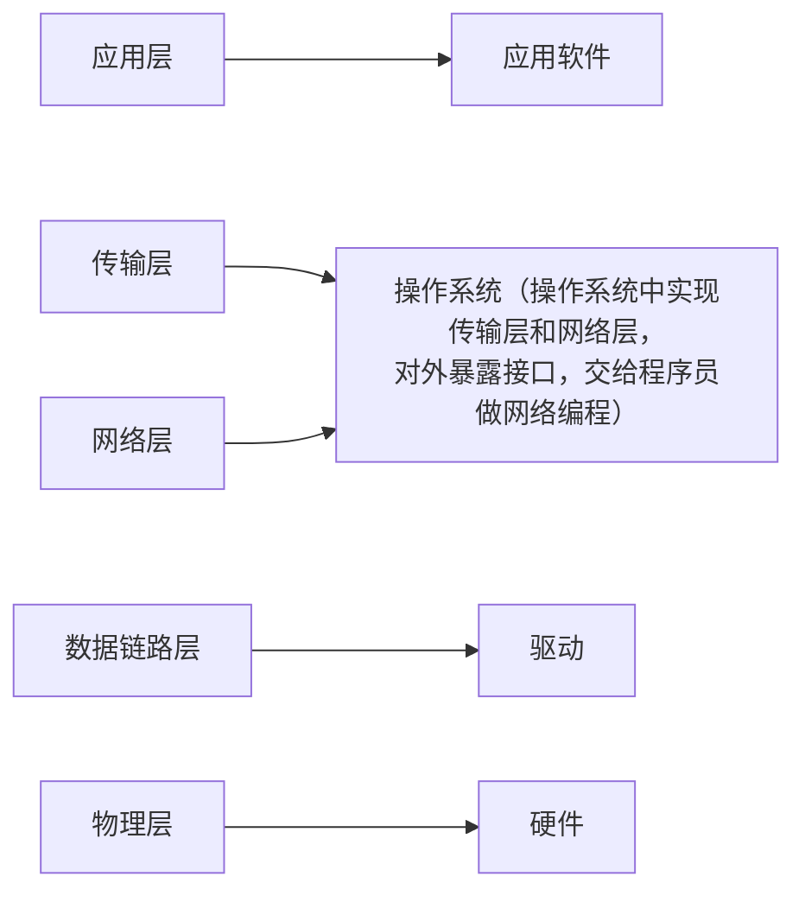

# 1.网络发展

下面就是简单提及一些概念而已，看看即可：

1.  **网络的层级结构**：网络可以分为局域网（小型局域网）、城域网和广域网，根据规模不同而定。
2.  **网络的发展历程**：随着时间的推移，网络从小范围的局域网发展成连接城市和城市的城域网，最终形成全球性的广域网，使得互联网成为全球性的现象。
3.  **网络的基础设施建设**：运营商（例如中国移动、中国联通、中国电信）在网络基础设施的建设中发挥关键作用，包括架设基站、路由器、交换机等硬件设备。这些设施的建设和维护为互联网的发展提供了基础。
4.  **通信企业的角色**：通信企业如华为在生产各种通信设备上起着关键作用，而运营商则通过购买这些设备进行基础设施建设，使得用户能够享受到互联网服务。
5.  **互联网公司的发展**：互联网公司通过提供各种服务（如社交、购物、直播等）利用已经建设好的基础设施来赚取收入。
6.  **投入产出比和商业模式**：通信基础设施的建设成本高，赚取回报周期长，相对于互联网公司提供的服务来说，投入产出比较低，因此大型企业通常不愿意涉足这个领域。
7.  **互联网公司与基础设施建设的差异**：互联网公司更愿意提供软件服务，追求更短的投资回报周期，而不愿意进行基础设施建设。
8.  **运营商的盈利模式**：运营商通过用户支付的电话费、流量费等方式获得收入，但在一些情况下可能存在费用较高、服务贵的问题。

# 2.网络协议

## 2.1.协议概念

协议在生活中是一种 **约定**，如同购房、购车或进入企业签订劳动合同一样，它是双方达成一致的一种约定。

协议的存在就是为了在网络通信中，让远距离的计算机能够更快速地进行通信。当网络通信距离变得很长时，数据的传输需要有类别和约定，以便双方能够快速理解和正确处理种类不同的数据。

计算机之间的传输媒介是光信号和电信号。通过“频率”和“强弱”来表示 `0` 和 `1` 这样的信息。要想传递各种不同的信息, 就需要约定好双方的数据格式（在软硬件上都要约定）。

软件上的协议一旦统一起来，就会变成通信行业的行业标准。

而在 `Linux` 内核中，进行协议管理说白了就是使用结构体，也就是先描述再组织。

## 2.2.协议分层

协议可以简单理解为软件，而软件可以分层，而分层实际上就是一种封装方法，因此协议在设计的时候也会被分层封装起来。

通常软件需要分层的原因：

1.   软件需要处理的场景较为复杂，必须分层处理
2.   可以对代码进行解耦，寻找问题可以从对应的层级中寻找，而不是对软件整体中寻找，排错和修改也更加容易（哪怕一个软件的某一次发生了严重 `bug`，也可以将整个层都替换掉）

>   补充：通信的复杂程度一般和距离成正相关。

那这些复杂的问题体现为什么呢？

通信范畴上体现为：

1.   数据丢包问题（传输层）：数据丢失怎么办？
2.   主机定位问题（网络层）：如何定位到一个主机？
3.   下一跳主机传递问题（数据链路层）：如果保证数据交付给下一个主机？

而具体的实现需要依赖硬件，因此需要再加一层硬件层。

而如果解决了上面，我们数据的传输是没问题了，但是取到数据需要得到应用吧？因此在应用范围上我们还要再加上一层应用层。

从下往上看，总结起来就是：

1.   数据处理问题（应用层）：数据如何处理？
2.   数据丢包问题（传输层）：数据丢失怎么办？
3.   主机定位问题（网络层）：如何定位到一个主机？
4.   下一跳主机传递问题（数据链路层）：如果保证数据交付给下一个主机？
5.   硬件实现问题（物理层）：在硬件上如何实现？

>   注意：由于我偏向软件方向，所以重点介绍协议中软件的部分（也就是上四层）...

上图就可以看出，网络编程在本质上也是系统编程（因为涉及到系统调用），也就是说，学习网络就必须要先把操作系统学好。

## 2.3.OSI 七层模型

`OSI` 是参考标准，而 `TCP/IP` 是具体实现。

## 2.4.TCP/IP 四层模型

# 3.网络传输

## 3.1.网络传输流程

## 3.2.数据包封装和分用

# 4.网络地址

## 4.1.IP 地址

## 4.2.MAC 地址

---

https://blog.csdn.net/superjunjin/article/details/7841099