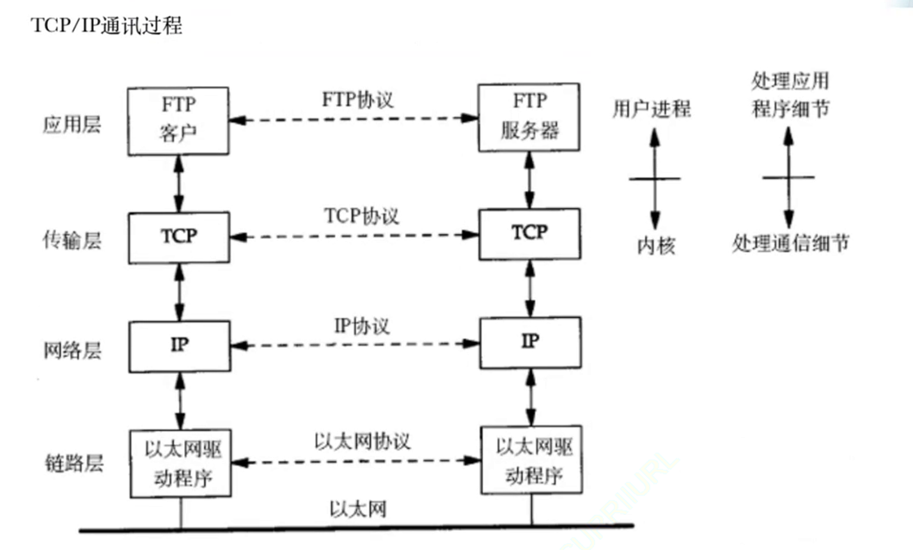

# 1.网络发展

下面就是简单提及一些概念而已，看看即可：

1.  **网络的层级结构**：网络可以分为局域网（小型局域网）、城域网和广域网，根据规模不同而定。
2.  **网络的发展历程**：随着时间的推移，网络从小范围的局域网发展成连接城市和城市的城域网，最终形成全球性的广域网，使得互联网成为全球性的现象。
3.  **网络的基础设施建设**：运营商（例如中国移动、中国联通、中国电信）在网络基础设施的建设中发挥关键作用，包括架设基站、路由器、交换机等硬件设备。这些设施的建设和维护为互联网的发展提供了基础。
4.  **通信企业的角色**：通信企业如华为在生产各种通信设备上起着关键作用，而运营商则通过购买这些设备进行基础设施建设，使得用户能够享受到互联网服务。
5.  **互联网公司的发展**：互联网公司通过提供各种服务（如社交、购物、直播等）利用已经建设好的基础设施来赚取收入。
6.  **投入产出比和商业模式**：通信基础设施的建设成本高，赚取回报周期长，相对于互联网公司提供的服务来说，投入产出比较低，因此大型企业通常不愿意涉足这个领域。
7.  **互联网公司与基础设施建设的差异**：互联网公司更愿意提供软件服务，追求更短的投资回报周期，而不愿意进行基础设施建设。
8.  **运营商的盈利模式**：运营商通过用户支付的电话费、流量费等方式获得收入，但在一些情况下可能存在费用较高、服务贵的问题。

# 2.网络协议

## 2.1.协议概念

协议在生活中是一种 **约定**，如同购房、购车或进入企业签订劳动合同一样，它是双方达成一致的一种约定。

协议的存在就是为了在网络通信中，让远距离的计算机能够更快速地进行通信。当网络通信距离变得很长时，数据的传输需要有类别和约定，以便双方能够快速理解和正确处理种类不同的数据。

计算机之间的传输媒介是光信号和电信号。通过“频率”和“强弱”来表示 `0` 和 `1` 这样的信息。要想传递各种不同的信息, 就需要约定好双方的数据格式（在软硬件上都要约定）。

软件上的协议一旦统一起来，就会变成通信行业的行业标准。

而在 `Linux` 内核中，进行协议管理说白了就是使用结构体，也就是先描述再组织。

## 2.2.协议分层

协议可以简单理解为软件，而软件可以分层，而分层实际上就是一种封装方法，因此协议在设计的时候也会被分层封装起来。

通常软件需要分层的原因：

1.   软件需要处理的场景较为复杂，必须分层处理
2.   可以对代码进行解耦，寻找问题可以从对应的层级中寻找，而不是对软件整体中寻找，排错和修改也更加容易（哪怕一个软件的某一次发生了严重 `bug`，也可以将整个层都替换掉）

>   补充：通信的复杂程度一般和距离成正相关。

那这些复杂的问题体现为什么呢？

通信范畴上体现为：

1.   数据丢包问题（传输层）：数据丢失怎么办？
2.   主机定位问题（网络层）：如何定位到一个主机？
3.   下一跳主机传递问题（数据链路层）：如果保证数据交付给下一个主机？

而具体的实现需要依赖硬件，因此需要再加一层硬件层。

而如果解决了上面，我们数据的传输是没问题了，但是取到数据需要得到应用吧？因此在应用范围上我们还要再加上一层应用层。

从下往上看，总结起来就是：

| 层级                             | 对应问题                       |
| -------------------------------- | ------------------------------ |
| 数据处理问题（应用层）           | 数据如何处理？                 |
| 数据丢包问题（传输层）           | 数据丢失怎么办？               |
| 主机定位问题（网络层）           | 如何定位到一个主机？           |
| 下一跳主机传递问题（数据链路层） | 如果保证数据交付给下一个主机？ |
| 硬件实现问题（物理层）           | 在硬件上如何实现？             |

>   注意：由于我偏向软件方向，所以重点介绍协议中软件的部分（也就是上四层）...

`Linux` 对传输层和网络层的支持就体现在对外暴露的接口上，网络编程在本质上也是系统编程（因为涉及到系统调用），也就是说，学习网络就必须要先把操作系统学好。

## 2.3.OSI 七层模型

`OSI` 实际是一个参考标准，而 `TCP/IP` 是其具体的实现。

`OSI`（`Open Systems Interconnection`）是一个国际标准化组织（`ISO`）制定的参考模型，用于描述计算机网络中不同层次之间的通信协议。该模型将网络通信划分为七个层次，每个层次负责不同的功能，从而实现了网络协议的分层设计，使得不同层次的协议能够独立开发和演化。

以下是 `OSI` 模型的七个层级：

| **层级**                          | **功能**                                                     |
| --------------------------------- | ------------------------------------------------------------ |
| **应用层（Application Layer）**   | 提供网络服务和应用程序的接口，包括网络管理、文件传输、电子邮件等。提供用户与网络之间的交互。 |
| **表示层（Presentation Layer）**  | 处理数据的格式，确保不同系统的数据能够正确解释。负责数据的加密、压缩和格式转换。 |
| **会话层（Session Layer）**       | 管理会话控制，建立、维护和终止通信会话，提供数据同步和恢复。 |
| **传输层（Transport Layer）**     | 提供端到端的通信服务，确保可靠的数据传输。主要协议有 `TCP`（`Transmission Control Protocol`）和 `UDP`（`User Datagram Protocol`）。 |
| **网络层（Network Layer）**       | 负责在不同的网络中传输数据，进行路径选择和逻辑寻址。主要协议有 `IP`（`Internet Protocol`）。 |
| **数据链路层（Data Link Layer）** | 提供点对点的数据传输，将比特流组织成帧，进行差错检测和纠正，以及进行流量控制。 |
| **物理层（Physical Layer）**      | 负责传输比特流，定义硬件设备和传输媒体的规范，如电缆、光纤、电压等。 |

每个层次都定义了一组规范和协议，层次之间通过明确定义的接口进行通信。这种分层设计使得网络的各个方面可以独立开发、测试和维护，提高了网络的可扩展性和可维护性。

上面定义的层级包含了我们之前讨论的五个层，并且更加细化，理论上所有的网络编程都需要包含上述层级，但是过于复杂和理论，因此被浓缩成了只有四层的 `TCP/IP` 模型，但在实践中，无处不体现 `OSI` 的七层结构...

`OSI` 七层结构将 **服务、接口、协议** 三个概念明确区分开来。

## 2.4.TCP/IP 五（或四）层模型

如果您是指能否逆向输出（反向打印）TCP/IP五层模型，理论上是可以的。以下是逆向输出的方式：

| 层级                              | 功能                                                         |
| --------------------------------- | ------------------------------------------------------------ |
| **应用层（Application Layer）**   | 提供网络服务和应用程序的接口，包括网络管理、文件传输、电子邮件等。是通信的最高层，直接与用户应用程序和网络通信服务接口。 |
| **传输层（Transport Layer）**     | 提供端到端的通信服务，确保可靠的数据传输。主要协议有 `TCP`（`Transmission Control Protocol`）和 `UDP`（`User Datagram Protocol`）。 |
| **网络层（Network Layer）**       | 负责在不同的网络中传输数据，进行路径选择和逻辑寻址。提供 `IP`（`Internet Protocol`）协议，用于在网络中唯一标识设备并进行数据包的路由。 |
| **数据链路层（Data Link Layer）** | 提供点对点的数据传输，将比特流组织成帧，并进行差错检测和纠正。定义了数据包的格式，以及在共享介质上的访问控制。 |
| **物理层（Physical Layer）**      | 定义了硬件设备和传输媒体的规范，负责传输比特流，包括电缆、光纤、无线电等。 |

>   补充：下述结论只是大概，而非绝对
>
>   -   对于一台主机，其操作系统内核实现了传输层到物理层的内容
>   -   对于路由器，实现了网络层到物理层的内容
>   -   对于交换机，实现了从数据链路层到物理层的内容
>   -   对于集线器，只实现了物理层的内容

# 3.网络传输

## 3.1.网络传输流程

我聚焦到四层（应用层、传输层、网络层、链路层）上，探究网络传输的流程。

逻辑上每一层互相通信，物理上必须向下再向左再上上通信。

每层都需要有自己的协议定制方案，都需要有自己的协议报头，从上到下交付数据要添加报头，从下到上递交数据要去掉报头。

快递的包装和贴上信息单可以很好来理解协议报头。在计算机网络中，数据的传输需要使用一定的协议来规定数据的格式和传输方式。协议报头就像是包裹的外包装，包含了一些元信息，告诉接收方如何正确地处理数据。

类比成快递包装和贴信息单的过程可以更好地理解：在快递中，我们需要在包裹上贴上收寄方的地址、电话等信息的快递单。类似地，协议报头包含了一些元信息，例如源地址、目标地址、数据类型等，以便接收方能够正确地处理数据，这些信息是给下一层看的。

而接收方除了接受自己想要的数据，也会检验和拆解去掉报头（相当于我们只要一个商品，但是对方给我们不仅仅是商品，还给了贴了快递单的包裹，我们需要检验这份快递单确认快递是否是自己得，然后再去除这个带有快递单的包裹）。

而如果无法正确识别协议报头，通信双方就无法达成共识。

而报头对应的信息就是有效载荷（也就是贴了快递单包裹内的货物），每一层都把报头和有效载荷进行分离，识别报头正确后，就将有效载荷交个上一层（也就是解包的过程）。

在网络这块，封装的本质就是添加报头，解包的过程就是去掉报头。

加报头和去报头的过程很类似入栈和出栈的过程...

这样就可以达到在逻辑理解上，在哪一层就用哪一层的逻辑。

## 3.2.数据包封装和分用

# 4.网络地址

## 4.1.IP 地址

## 4.2.MAC 地址

---

https://blog.csdn.net/superjunjin/article/details/7841099