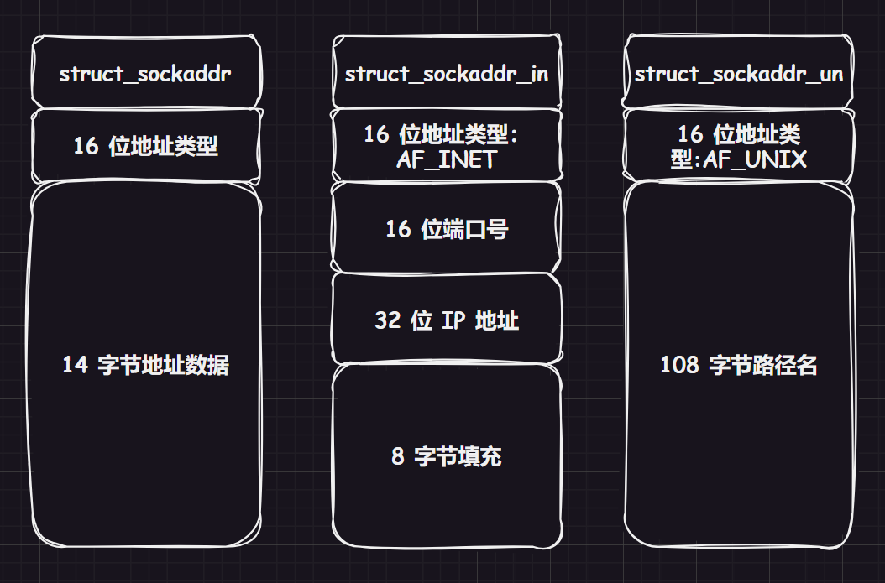

# 1.端口号

理解源 `IP` 地址和目的 `IP` 地址：

-   **源 IP 地址（Source IP Address）**：这是指发起通信的设备的 `IP` 地址。在网络通信中，每个设备都被分配一个唯一的 `IP` 地址，用于标识其在网络上的位置。

-   **目的 IP 地址（Destination IP Address）**：这是指接收通信的设备的 `IP` 地址。它告诉网络中的路由器或交换机将数据包发送到哪个设备。

**端口号（Port）** 是传输层协议（如 `TCP` 或 `UDP`）中的一个概念，用于标识一个特定的进程或服务。它是一个 `16` 位的整数，取值范围是 `0-65535`。端口号告诉操作系统，接收到的数据包应该被交给哪个进程或服务处理。`IP` 地址和端口号的组合可以唯一标识网络上的某一台主机的某一个进程。

端口号和进程 `ID` 都是用来 **唯一标识** 一个进程的。在网络通信中，端口号是用于标识不同服务或应用程序的，而进程 `ID` 是操作系统内部用于标识运行中的进程的。

但是端口号是在网络通信中使用的标识，而进程 `ID` 是操作系统内部使用的标识。一个进程可以同时绑定多个端口号，以便提供多个不同的服务，但是一个端口号不能被多个进程 `ID` 绑定。而取两种说法主要是为了将进程范畴和网络范畴进行解耦。

>   补充：如果你有一个使用 `IP` 地址和端口号的通信场景，比如 `QQ` 消息的发送，源 `IP` 地址是发送方的 `IP` 地址，目的 `IP` 地址是接收方的 `IP` 地址，而端口号则用于区分不同的服务或程序，确保消息到达正确的应用程序或进程。

这样，用户主机和服务主机内的通信，也就是客户端进程和服务端进程之间的进程通信，这就是网络通信的本质。数据在主机间转发仅仅是基本的手段，更为重要的是将数据交给双方主机中对应的进程，也就是将进程和一台主机的特定端口号来关联。

`IP地址 + 端口号` 就标识了全网内唯一的一个进程，两份这样的“数据对”：

-   套接字：`SRC_IP + SRC_PORT`
-   套接字：`DST_IP + DST_PORT`

两份套接字再进行关联就建立了客户端和服务端的连接，其后续的编程也就是 **套接字编程**。

而端口又涉及到 `TCP` 协议和 `UDP` 协议，这两种协议都在传输层被使用。

>   补充：云服务器的端口需要被开放，才能被别的服务器访问，这方面我写在另外一篇博文里...

## 1.1.简单理解 UDP 协议

**传输层协议**：该协议在传输层中被使用

**无连接**：不用在代码中刻意建立连接，是直接发送的（类似给某人写信）

**不可靠传输**：在网络不可靠的情况下，有可能出现丢包和乱序的问题（但在网络中依旧被采纳），使用于实时性要求较高的应用

**面向数据报**：待补充...

## 1.2.简单理解 TCP 协议

**传输层协议**：该协议在传输层中被使用

**有连接**：需要在代码中建立连接（类似给某人打电话）

**可靠传输**：适用于需要可靠数据传输的应用，但可靠的编码代价有可能会让应用缺失实时性，并且更加复杂

**面向字节流**：待补充...

>   补充：一般实时性不强的应用会优先使用 `TCP`，有些应用还支持用户自定义选择。

# 2.网络字节序

内存中的多字节数据相对于内存地址有大小端之分，磁盘文件中的多字节数据相对于文件中的偏移地址也有大端小端之分，而网络数据流同样也有大端小端之分。

发送主机通常将发送缓冲区中的数据按内存地址 **从低到高的顺序发出**，接收主机把从网络上接到的字节依次保存在接收缓冲区中，也是 **按内存地址从低到高的顺序保存**，因此网络数据流的地址应规定：

-   先发出的数据是低地址，后发出的数据是高地址
-   `TCP/IP` 协议规定, 网络数据流应采用大端字节序，即低地址高字节
-   不管主机是大端机还是小端机，都按照 `TCP/IP` 规定的网络字节序来发送/接收数据
-   如果当前发送主机为小端，就需要先将数据转成大端，否则忽略转化直接发送即可

为使网络程序具有可移植性, 使同样的 `C` 代码在大端和小端计算机上编译后都能正常运行, 可以调用以下库函数做网络字节序和主机字节序的转换。

1.  **`htons` 和 `ntohs`：**

    ```cpp
    //函数声明
    uint16_t htons(uint16_t hostshort); //将 16 位主机字节序的整数转换为网络字节序
    uint16_t ntohs(uint16_t netshort); //将 16 位网络字节序的整数转换为主机字节序
    ```

    都用于 `16` 位整数，两者是相互补充的关系。

2.  **`htonl` 和 `ntohl`：**

    ```cpp
    //函数声明
    uint32_t htonl(uint32_t hostlong);
    uint32_t ntohl(uint32_t netlong);
    ```
    
    与 `htons` 和 `ntohs` 类似，用于 `32` 位整数。

>   补充：`h` 表示 `host`，而 `n` 表示 `network`。

# 3.socket 编程

## 3.1.套接字编程分类

`socket` 被翻译为“套接字”，实际上这个翻译还是很迷惑的，翻译成“插座/软件插座/软插座”会更好理解。

这套接口的标准是基于 `POSIX` 的，常见的 `socket` 分类主要有：

1.   **域间 socket(Local Socket)：** 常见于本地通信，和命名管道通信很是类似。通过文件系统中的特殊文件来实现通信，通常被用于实现进程间的 `IPC`（进程间通信）。在 `Unix/Linux` 系统中，这种套接字通常是基于文件系统中的文件路径进行通信的，比如基于文件名的命名套接字和抽象命名套接字。
2.   **原始 socket(Raw Socket)：** 通常指的是在网络层（`OSI` 模型的第三层）直接操作数据包的一种套接字。使用原始套接字，需要特殊的权限，程序可以发送和接收未封装的数据包，而不被协议栈处理，这使得程序可以更底层地控制网络数据的处理（但是这样的操作可能对网络和系统造成风险）。
3.   **网络 socket(Network Socket)：** 通常用于描述一般的网络编程中的套接字。常见的网络 `socket` 包括 `TCP socket` 和 `UDP socket`，它们分别基于 `TCP` 和 `UDP` 传输协议，是应用层与传输层之间的接口。

上述三种应用场景，理论上应该是有三种接口，但是 `Linxu` 上统一使用同种接口，而我们重点学习网络套接字。

## 3.2.套接字编程接口

```cpp
//套接字编程常见 API
#include <sys/types.h>
#include <sys/socket.h>

//1.创建 socket，成功的时候返回一个套接字描述符（类似文件描述符，由于 UDP 是面向数据报的，有专门的根据描述符来使用的读写接口。但是 TCP 中直接可以像文件一样使用，这是因为文件和 TCP 都是面向字节流的），失败返回负值并且设置 errno
int socket (
    int domain,
    int type,
    int protocol
);
//(1)domain(地址族/域)：指明将来创建的套接字类型，常见类型如下：
    //a)AF_UNIX 或 AF_LOCAL：
        //用于本地通信，套接字由文件系统路径标识。
        //在 Unix/Linux 系统中常用于进程间通信。
    //b)AF_PACKET：
        //用于底层数据包操作，可以发送和接收原始数据帧。
        //通常需要特殊权限。
    //c)AF_INET（本系列多用这个）和 AF_INET6：
        //用于 IPv4/IPv6 网络通信。
        //常用于 TCP 和 UDP 套接字编程。
    //d)其他：AF_IPX、AF_NETLINK（用于 Linux 内核与用户空间之间的通信）AF_25、AF_AX25、AF_ATMPVC、AF_APPLETALK、AF_PACKET、AF_UNSPEC（未指定地址族，由系统自动选择合适的地址族）、AF_BLUETOOTH（用于蓝牙通信）。
//(2)type(通信类型)：
    //a)SOCK_DGRAM：UDP 是面向数据报的，无需建立连接，应该使用这个
    //b)SOCK_STREAM：TCP 是面向字节流的，需要建立连接，应该使用这个
    //c)其他：待补充...
//(3)protocol(协议类别)：基本上前面两个参数填好了这个就固定了，通常填 0 即可自动推导选择相应的协议

//2.绑定套接字，成功返回 0，失败返回负值并且设置 error
int bind (
    int socket,
    const struct sockaddr *address,
    socklen_t address_len
);
//可以将用户指定的 ip 和 port 在内核中进行强关联，使用结构体 sockaddr_in 的时候还需要额外加多两个头文件 <netinet/in.h> <arpa/inet.h>，该结构体需要设置好 sin_family 和 sin_port 和 sin_addr.s_addr，设置之前可以先使用 void bzero(void*s, size_t n) 把指定的空间进行清零（该库函数的头文件为 <strings.h>）
//(1)socket：直接填入之前获取到的套接字标识符
//(2)address：可以填上强转后的套接字结构体，例如 sockaddr_in{/*...*/};、sockaddr_in6{/*...*/};、sockaddr_un{/*...*/}; 内部包含 IP 和 PORT
//(3)address_len：传入的对象结构体的字节长度（sizeod）


//3.开始监听客户端的请求
int listen (
    int socket,
    int backlog
);
//(1)socket：是之前调用 socket() 函数返回的套接字描述符
//(2)backlog：参数 backlog 是指定连接队列的最大长度。连接队列用于存放尚未被 accept() 函数接受的连接请求。当有新的连接请求到达监听套接字时，如果连接队列已满，新的连接请求将被拒绝。


//4.服务端接收客户端的请求
int accept (
    int socket,
    struct sockaddr* address,
    socklen_t* address_len
);
//(1)socket：是之前调用 socket() 函数返回的套接字描述符
//(2)address：当 accept() 函数成功接受了客户端的连接请求时，会将客户端的地址信息填充到这个结构体中
//(3)address_len：当 accept() 函数成功接受了客户端的连接请求时，会更新这个参数，返回客户端地址信息的实际长度


//5.客户端建立连接
int connect (
    int sockfd, 
    const struct sockaddr *addr,
    socklen_t addrlen
);
//(1)socket：客户端调用 connect() 函数时，需要将套接字描述符和服务端的地址信息传递给 connect() 函数，以便建立连接。
//(2)addr：结构体包含了服务端的 IP 地址和端口号等连接信息。
//(3)addrlen：在调用 connect() 函数之前，需要将这个参数设置为 addr 结构体的实际长度。
```

`socket API` 是一层抽象的网络编程接口, 适用于各种底层网络协议, 如 `IPv4`、`IPv6`，以及后面要讲的 `UNIX Domain Socket`. 然而，各种网络协议的地址格式并不相同，其中参数 `sockaddr` 的结构有如下三种选择：



1.  **`struct sockaddr`**：通用的抽象结构
2.  **`struct sockaddr_in`**：用于 `IPv4` 网络地址的结构体
3.  **`struct sockaddr_un`**：是用于 `UNIX` 域套接字的结构体。

上述结构体中，接口根据地址类型来判断是哪一种 `socket` 通信，使用接口的时候只需要进行强制类型转化即可。

```cpp
//UDP 的读写接口
//该函数用于接受客户端的数据
ssize_t recvfrom(
    int sockfd, void *buf, size_t len,
    int flags,
    struct sockaddr* src_addr,
    socklen_t* addrlen
);
//1.sockfd：本程序申请到的套接字
//2.buf、len：buf 指向读取缓冲区，len 是读取缓冲区的大小
//3.flag：表示调用操作的可选标志，常用的标志有 MSG_CONFIRM、MSG_DONTWAIT、MSG_ERRQUEUE 等，不用设置为 0 即可
//4.src_addr（输出型参数）：表示用于存储发送端地址信息的结构体 sockaddr 的指针，如果不需要知道发送端地址则可以传入 NULL
//5.addrlen（输出型参数）：对于输入参数，表示指定 src_addr 缓冲区的长度，对于输出参数，表示返回 src_addr 结构体的实际长度
//最后两个参数会得到发送端的套接字
//读取失败返回 -1
    

//写回发送端
ssize_t sendto(
    int sockfd, const void* buf, size_t len,
    int flags, 
    const sockaddr* dest_addr,
    socklen_t addrlen
);
```

## 3.3.套接字编程应用

### 3.3.1.UDP 套接字编程应用

#### 3.3.1.1.数据通信程序

使用上述 `API` 来做一个 `CV` 框架，并且先制作出 `makefile` 和基于 `UDP` 大致的服务端程序。

```makefile
.PHONY:all
all:udp_client udp_server

udp_client:udq_client.cc
	g++ -o $@ $^ -std=c++11
udp_server:udq_server.cc
	g++ -o $@ $^ -std=c++11	
	
.PHONY:clean
clean:
	rm -f udp_client udp_server
```

```cpp
//udp_server.hpp
#pragma once

#include <string>

#include <cerrno>
#include <cstring>
#include <cstdlib>

#include <strings.h>
#include <sys/types.h>
#include <sys/socket.h>
#include <netinet/in.h>
#include <arpa/inet.h>
#include <unistd.h>

#include "log.hpp"

#define DEBUG_SHOW

const int readBuffSize = 1024;

class UdpServer
{
    public:
    /* 初始化服务断配置 */
    UdpServer(uint16_t port, std::string ip = "") //IP 地址假定为空
        : _port(port), _ip(ip), _sock(-1)
        {
            //下面开始我们的网络编程
            //1.创建套接字
            if ((_sock = socket(AF_INET, SOCK_DGRAM, 0)) < 0)
            {
                LogMessage(FATAL, "%d:%s", errno, strerror(errno));
                exit(20);
            }

            //2.绑定套接字
            struct sockaddr_in local;
            bzero(&local, sizeof(local));

            local.sin_port = htons(_port); //由于需要把本机的端口号发送给对方，因此需要转化字节序再填入端口号
            local.sin_addr.s_addr = inet_addr(_ip.c_str()); //填入反字节序的 ip 地址
            local.sin_family = AF_INET; //设置协议家族

            if (bind(_sock, (struct sockaddr*)&local, sizeof(local)) < 0)
            {
                LogMessage(FATAL, "%d:%s", errno, strerror(errno));
                exit(30);
            }

            LogMessage(NORMAL, "init udp server done ... %s", strerror(errno));
        }

    /*启动进程*/
    void Start()
    {
        //注意，只要主机不奔溃服务端不出错，服务端将永远不退出（对于系统来说，就是一个常驻进程）
        char readBuff[readBuffSize] = { 0 }; //初始化为 0，后续就不用添加 '\0' 了
        while (true)
        {
            //1.读取数据
            struct sockaddr_in peer; bzero(&peer, sizeof(peer)); //纯输出型参数
            socklen_t peerLen = sizeof(peer); //输入输出型参数，输入：缓冲区大小，输出：实际读到的 peer 大小

            ssize_t s = recvfrom(_sock, readBuff, sizeof(readBuff) - 1,
                                 0, (struct sockaddr*)&peer, & peerLen);

            if (s > 0)
            {
                //1.1.读取到的信息
                //1.2.指明是谁发送的信息
                uint16_t cli_port = ntohs(peer.sin_port); //需要反序列
                std::string cli_ip = inet_ntoa(peer.sin_addr); //反序列后转化为点分十进制字符串
                std::cout
                    << "port:[" << cli_port << "]"
                    << "ip:[" << cli_ip << "], sad:"
                    << readBuff << std::endl;
            }
            else
            {
                LogMessage(FATAL, "%d:%s", errno, strerror(errno));
                exit(40);
            }

            //2.分析数据

            //3.写回数据
            sendto(_sock, readBuff, strlen(readBuff),
                   0, (struct sockaddr*)&peer, peerLen);
        }
    }

    ~UdpServer()
    {
        if (_sock >= 0)
            close(_sock);
    }

    private:
    uint16_t _port; //端口号（一般是 16 位的整数）
    std::string _ip; //ip 地址
    int _sock; //套接字（当作文件描述符理解）
};
```

```cpp
//udp_server.cc
#include <iostream>
#include <memory>
#include <string>
#include <cstdlib>

#include "udp_server.hpp"

static void Usage(std::string proc)
{
    std::cout << "\nUsage: " << proc << "ip port\n" << std::endl;
}

int main(int argc, char* argv[]) //服务器启动指令 ./udp_server ip port
{
    if (argc != 3) //启动方法有误
    {
        Usage(argv[0]);
        exit(10);
    }

    std::string ip = argv[1]; //获取 ip 地址
    uint16_t port = atoi(argv[2]); //获取端口号

    std::unique_ptr<UdpServer> svr(new UdpServer(port, ip)); //使用智能指针托管指针（内含初始化）
    svr->Start();

    return 0;
}
```

可以使用 `netstat -anup` 检验服务端是否可以成功启动。

```shell
# 查看服务器运行情况
$ netstat -anup
(Not all processes could be identified, non-owned process info
 will not be shown, you would have to be root to see it all.)
Active Internet connections (servers and established)
Proto Recv-Q Send-Q Local Address           Foreign Address         State       PID/Program name    
udp        0      0 0.0.0.0:8080            0.0.0.0:*                           31747/./udp_server  
```

然后编写客户端代码和 `makefile`：

```cpp
//udp_client.cc
#include <iostream>
#include <string>

#include <cstring>

#include <unistd.h>
#include <sys/types.h>
#include <sys/socket.h>
#include <arpa/inet.h>

const int readBuffSize = 1024;

static void Usage(std::string proc)
{
    std::cout << "\nUsage: " << proc << "serverIp serverPort\n" << std::endl;
}

int main(int argc, char* argv[]) //./udp_client 127.0.0.1 8080
{
    //1.检查命令行输入
    if(argc != 3)
    {
        Usage(argv[0]);       
        exit(50);
    }

    //2.创建套接字
    int sock = socket(AF_INET, SOCK_DGRAM, 0);
    if (sock < 0)
    {
        std::cerr << "socket error" << std::endl;
        exit(60);
    }

    //3.绑定套接字
    //但是一般不需要程序员自己 bind，这是因为客户端是被客户端使用的，如果程序员自己 bind 了，那么该客户端的一定是绑定了某个固定的 ip 和 port
    //万一在多个不关联的客户端同时启动的情况下，就会出现 port 绑定失败的情况，进而导致客户端启动失败）
    //将 bind 操作交给操作系统来做，操作系统对于哪些 port 没有被占用的情况最清楚了
    
    //4.向服务端发送数据
    std::string message;

    struct sockaddr_in server;
    server.sin_family = AF_INET;
    server.sin_port = htons(atoi(argv[2]));
    server.sin_addr.s_addr = inet_addr(argv[1]);
    
    while(true)
    {
        char readBuff[readBuffSize] = { 0 };
        std::cout << "向服务器发送信号" << std::endl;
        std::getline(std::cin, message);
        if(strcmpc(message.c_str(), "exit") == 0) 
            break;

        sendto(sock, message.c_str(), message.size(), 0,
                (struct sockaddr*)&server, sizeof(server));
        //第一次向服务器发送数据时，操作系统会在 sendto() 执行过程程中自动为服务端绑定
    
        //5.读取服务端返回的数据
        struct sockaddr_in temp; //占位符
        socklen_t len = sizeof(temp);
        ssize_t s = recvfrom(sock, readBuff, sizeof(readBuff), 0,
                (struct sockaddr*)&temp, &len);
        if(s > 0)
        {
            std::cout << "server echo# " << readBuff << std::endl;
        }
    }

    close(sock);
    std::cout << "bye~" << std::endl;

    return 0;
}
```

```makefile
# makefile
.PHONY:all
all:udp_client udp_server

udp_client:udp_client.cc
	g++ -o $@ $^ -std=c++11

udp_server:udp_server.cc
	g++ -o $@ $^ -std=c++11

.PHONY:clean
clean:
	rm -f udp_client udp_server
```

使用本地 `ip`（也叫“本地环回”，`CS` 模型只在本地协议栈中进行数据流行，不会把数据发送到网络中，只是把协议栈走一个回环，多用于本地测试）启动服务端和 `8080` 端口来启动服务端程序和用户端程序，启动结果如下：

```shell
# 服务端进程接送信息
$ ./udp_server 127.0.0.1 8080
[NORMAL][1706856251] init udp server done ... Success
port:[47091]ip:[127.0.0.1], sad:hello, I am Limou3434.
```

```shell
# 用户端进程发送信息
$ ./udp_client 127.0.0.1 8080
向服务器发送信号
hello, I am Limou3434.
server echo# hello, I am Limou3434.
向服务器发送信号
...
```

可以看到通信成功，但是这里面是有很多的坑点和补充点的...

#### 3.3.1.2.单向聊天程序

云服务器无法绑定具体的公网 `IP` 地址，这些 `IP` 实际上是厂商提供的虚拟 `IP`，不是真实的物理 `IP`，而一般服务器也不推荐真的使用一个确定 `IP`，而是使用任意 `IP`（防止出现不同 `ip` 同端口的请求）。服务端绑定套接字时，将其绑定到 `INADDR_ANY(0)` 表示服务端愿意接受任何本地网络接口上的连接请求。

在服务端计算机上可能有多个网络接口，例如有线网卡、无线网卡等。通过将套接字绑定到 `INADDR_ANY`，服务端可以监听所有可用的网络接口上的连接，这意味着服务端将能够接受通过任何网络接口发送到本地计算机的连接请求。

因此我需要修改一下服务端的代码：

```cpp
//udp_server.hpp(修改 ip 地址绑定逻辑)
#pragma once

#include <string>

#include <cerrno>
#include <cstring>
#include <cstdlib>

#include <strings.h>
#include <sys/types.h>
#include <sys/socket.h>
#include <netinet/in.h>
#include <arpa/inet.h>
#include <unistd.h>

#include "log.hpp"

#define DEBUG_SHOW

const int readBuffSize = 1024;

class UdpServer
{
public:
    /* 初始化服务断配置 */
    UdpServer(uint16_t port, std::string ip = "") //IP 地址假定为空
        : _port(port), _ip(ip), _sock(-1)
    {
        //下面开始我们的网络编程
        //1.创建套接字
        if ((_sock = socket(AF_INET, SOCK_DGRAM, 0)) < 0)
        {
            LogMessage(FATAL, "%d:%s", errno, strerror(errno));
            exit(20);
        }

        //2.绑定套接字
        struct sockaddr_in local;
        bzero(&local, sizeof(local));

        local.sin_port = htons(_port); //由于需要把本机的端口号发送给对方，因此需要转化字节序再填入端口号
        local.sin_addr.s_addr = _ip.empty() ? INADDR_ANY : inet_addr(_ip.c_str()); //填入反字节序的 ip 地址（若为空则填入任意 IP 地址，可以让服务器从任意 IP 中获取数据，该关键字实际是 0）
        local.sin_family = AF_INET; //设置协议家族

        if (bind(_sock, (struct sockaddr*)&local, sizeof(local)) < 0)
        {
            LogMessage(FATAL, "%d:%s", errno, strerror(errno));
            exit(30);
        }

        LogMessage(NORMAL, "init udp server done ... %s", strerror(errno));
    }

    /*启动进程*/
    void Start()
    {
        //注意，只要主机不奔溃服务端不出错，服务端将永远不退出（对于系统来说，就是一个常驻进程）
        char readBuff[readBuffSize] = { 0 }; //初始化为 0，后续就不用添加 '\0' 了
        while (true)
        {
            //1.读取数据
            struct sockaddr_in peer; bzero(&peer, sizeof(peer)); //纯输出型参数
            socklen_t peerLen = sizeof(peer); //输入输出型参数，输入：缓冲区大小，输出：实际读到的 peer 大小

            ssize_t s = recvfrom(_sock, readBuff, sizeof(readBuff) - 1,
                0, (struct sockaddr*)&peer, &peerLen);

            if (s > 0)
            {
                //1.1.读取到的信息
                //1.2.指明是谁发送的信息
                uint16_t cli_port = ntohs(peer.sin_port); //需要反序列
                std::string cli_ip = inet_ntoa(peer.sin_addr); //反序列后转化为点分十进制字符串
                std::cout
                    << "port:[" << cli_port << "]"
                    << "ip:[" << cli_ip << "], sad:"
                    << readBuff << std::endl;
            }
            else
            {
                LogMessage(FATAL, "%d:%s", errno, strerror(errno));
                exit(40);
            }

            //2.分析数据

            //3.写回数据
            sendto(_sock, readBuff, strlen(readBuff),
                0, (struct sockaddr*)&peer, peerLen);
        }
    }

    ~UdpServer()
    {
        if (_sock >= 0)
            close(_sock);
    }

private:
    uint16_t _port; //端口号（一般是 16 位的整数）
    std::string _ip; //ip 地址
    int _sock; //套接字（当作文件描述符理解）
};
```

```cpp
//udp_server.cc(修改命令行参数分析逻辑)
#include <iostream>
#include <memory>
#include <string>
#include <cstdlib>

#include "udp_server.hpp"

static void Usage(std::string proc)
{
    std::cout << "\nUsage: " << proc << "[ip] port\n" << std::endl;
}

int main(int argc, char* argv[]) //服务器启动指令 ./udp_server ip port
{
    if (argc == 3)
    {
        std::string ip = argv[1]; //获取 ip 地址
        uint16_t port = atoi(argv[2]); //获取端口号
        std::unique_ptr<UdpServer> svr(new UdpServer(port, ip)); //使用智能指针托管指针（内含初始化）
        svr->Start();
    }
    else if (argc == 2)
    {
        uint16_t port = atoi(argv[1]); //获取端口号
        std::unique_ptr<UdpServer> svr(new UdpServer(port)); //使用智能指针托管指针（内含初始化）
        svr->Start();
    }
    else //启动方法有误
    {
        Usage(argv[0]);
        exit(10);
    }

    return 0;
}
```

这样，任何一台 `Linux` 的云服务器，都可以拿服务端服务器给予的公网 `IP` 和端口号来给其发送数据了，一个简易版的服务端到客户端的单向聊天软件就形成了...

#### 3.3.1.3.远程操作程序

除了发送单纯的文本信息，还可以让服务器根据接受到的指令来执行其他的逻辑，下面我们再次来改写代码。

首先使用介绍 `popen()` 及其系列的方法，该函数原型如下：

```cpp
//popen() 及其系列方法
#include <stdio.h>
FILE* popen(const char* command, const char* type);
//该函数会通过建立管道和 fork() 出子进程，然后通过 exec 系列接口自动执行 command 命令（内部自动解析命令）
//返回 FILE* 指针，可以读取任务执行的返回结果
```

我们再次修改一下服务端的代码：

```cpp
//udp_server.hpp(添加指令执行功能)
#pragma once

#include <string>

#include <cerrno>
#include <cstring>
#include <cstdlib>
#include <cstdio>

#include <strings.h>
#include <sys/types.h>
#include <sys/socket.h>
#include <netinet/in.h>
#include <arpa/inet.h>
#include <unistd.h>

#include "log.hpp"

#define DEBUG_SHOW

const int readBuffSize = 1024;

class UdpServer
{
public:
    /* 初始化服务断配置 */
    UdpServer(uint16_t port, std::string ip = "") //IP 地址假定为空
        : _port(port), _ip(ip), _sock(-1)
    {
        //下面开始我们的网络编程
        //1.创建套接字
        if ((_sock = socket(AF_INET, SOCK_DGRAM, 0)) < 0)
        {
            LogMessage(FATAL, "%d:%s", errno, strerror(errno));
            exit(20);
        }

        //2.绑定套接字
        struct sockaddr_in local;
        bzero(&local, sizeof(local));

        local.sin_port = htons(_port); //由于需要把本机的端口号发送给对方，因此需要转化字节序再填入端口号
        local.sin_addr.s_addr = _ip.empty() ? INADDR_ANY : inet_addr(_ip.c_str()); //填入反字节序的 ip 地址（若为空则填入任意 IP 地址，可以让服务器从任意 IP 中获取数据，该关键字实际是 0）
        local.sin_family = AF_INET; //设置协议家族

        if (bind(_sock, (struct sockaddr*)&local, sizeof(local)) < 0)
        {
            LogMessage(FATAL, "%d:%s", errno, strerror(errno));
            exit(30);
        }

        LogMessage(NORMAL, "init udp server done ... %s", strerror(errno));
    }

    /*启动进程*/
    void Start()
    {
        //注意，只要主机不奔溃服务端不出错，服务端将永远不退出（对于系统来说，就是一个常驻进程）
        while (true)
        {
            //1.读取数据
            char readBuff[readBuffSize] = { 0 }; //初始化为 0，后续就不用添加 '\0' 了
            
            struct sockaddr_in peer; bzero(&peer, sizeof(peer)); //纯输出型参数
            socklen_t peerLen = sizeof(peer); //输入输出型参数，输入：缓冲区大小，输出：实际读到的 peer 大小

            char result[1024] = { 0 }; //后续读取命令返回结果时要用的读取缓冲区
            std::string cmd_echo; //读取后的所有结果存储在 cmd_echo 中，然后发送回客户端
        
            ssize_t s = recvfrom(_sock, readBuff, sizeof(readBuff) - 1,
                0, (struct sockaddr*)&peer, &peerLen);

            if (s > 0)
            {
                //1.1.读取到的信息
                //1.2.指明是谁发送的信息
                uint16_t cli_port = ntohs(peer.sin_port); //需要反序列
                std::string cli_ip = inet_ntoa(peer.sin_addr); //反序列后转化为点分十进制字符串
                std::cout
                    << "port:[" << cli_port << "]"
                    << "ip:[" << cli_ip << "], sad:"
                    << readBuff << std::endl;
                
                //1.3.过滤命令
                if(strcasestr(readBuff, "rm") != nullptr
                        || strcasestr(readBuff, "rmdir") != nullptr)
                {
                    std::cout << "用户指令包含 rm 类的不安全指令" << std::endl;
                    std::string warn = "你想干嘛？！\n";
                    sendto(_sock, warn.c_str(), warn.size(),
                        0, (struct sockaddr*)&peer, peerLen);
                    continue;
                }
                
                //1.4.执行命令
                FILE* fp = popen(readBuff, "r");
                if(nullptr == fp)
                {
                    LogMessage(ERROR, "popen:%s:%d,%s", errno, strerror(errno), "非法命令");
                    continue;
                }

                //1.5.读取返回结果
                while(fgets(result, sizeof(result), fp) != nullptr)
                {
                    cmd_echo += result;
                }

                fclose(fp); //更严谨一些
            }
            else
            {
                LogMessage(FATAL, "%d:%s", errno, strerror(errno));
                exit(40);
            }

            //2.分析数据

            //3.写回数据
            sendto(_sock, cmd_echo.c_str(), cmd_echo.size(),
                0, (struct sockaddr*)&peer, peerLen);
        }
    }

    ~UdpServer()
    {
        if (_sock >= 0)
            close(_sock);
    }

private:
    uint16_t _port; //端口号（一般是 16 位的整数）
    std::string _ip; //ip 地址
    int _sock; //套接字（当作文件描述符理解）
};
```

```cpp
//udp_server.cc(添加指令执行功能)
#include <iostream>
#include <memory>
#include <string>
#include <cstdlib>

#include "udp_server.hpp"

static void Usage(std::string proc)
{
    std::cout << "\nUsage: " << proc << "[ip] port\n" << std::endl;
}

int main(int argc, char* argv[]) //服务器启动指令 ./udp_server ip port
{
    if (argc == 3)
    {
        std::string ip = argv[1]; //获取 ip 地址
        uint16_t port = atoi(argv[2]); //获取端口号
        std::unique_ptr<UdpServer> svr(new UdpServer(port, ip)); //使用智能指针托管指针（内含初始化）
        svr->Start();
    }
    else if (argc == 2)
    {
        uint16_t port = atoi(argv[1]); //获取端口号
        std::unique_ptr<UdpServer> svr(new UdpServer(port)); //使用智能指针托管指针（内含初始化）
        svr->Start();
    }
    else //启动方法有误
    {
        Usage(argv[0]);
        exit(10);
    }

    return 0;
}
```

这样就可以让客户端操控服务端，没错客户端这边就是一个简易版的云服务器操作端...

#### 3.3.1.4.群体聊天程序

首先，我们需要重新修改一下 `udp_server.cc` 的代码，这次我们让服务端再读取不同的客户端数据的同时，将每个用户的套接字信息保存起来，并且以广播的形式将所有聊天记录共享发送给所有客户端。

```cpp
//log.hpp(群聊服务器)
#pragma once
#include <iostream>
#include <string>

#include <cstdio>
#include <cstdarg>
#include <ctime>

//日志级别
#define DEBUG 0 //调式
#define NORMAL 1 //正常
#define WARNING 2 //警告
#define ERROR 3 //错误
#define FATAL 4 //致命

const char* gLevelMap[] = {
    "DEBUG", //debug 模式
    "NORMAL", //正常
    "WARNING", //警告
    "ERROR", //错误
    "FATAL" //严重错误
};

//日志功能主要有：日志等级+发送时间+日志内容/自定义日志内容+Other（代码行数+运行用户）
void LogMessage(int level, const char *format, ...)
{
#ifndef DEBUG_SHOW
    if (level == DEBUG) return;
#endif
    //日志标准部分 
    char stdBuffer[1024];
    time_t timestamp = time(nullptr); 
    snprintf(stdBuffer, sizeof stdBuffer, "[%s][%d]", gLevelMap[level], timestamp);

    //日志自定义部分
    char logBuffer[1024];

    va_list args; //声明可变参数列表
    va_start(args, format); //初始化可变参数列表
    vsnprintf(logBuffer, sizeof logBuffer, format, args); //int vsnprintf(char *str, size_t size, const char *format, va_list ap); 是一个可变参数函数，将格式化的字符串输出到缓冲区中
    va_end(args); //清理可变参数列表

    printf("%s %s\n", stdBuffer, logBuffer); //直接显示到屏幕上，可以重定向到日志文件里
}
```

```cpp
//udp_server.hpp(群聊服务器)
#pragma once

#include <string>
#include <unordered_map>

#include <cerrno>
#include <cstring>
#include <cstdlib>
#include <cstdio>

#include <strings.h>
#include <sys/types.h>
#include <sys/socket.h>
#include <netinet/in.h>
#include <arpa/inet.h>
#include <unistd.h>

#include "log.hpp"

#define DEBUG_SHOW

const int readBuffSize = 1024;

class UdpServer
{
public:
    /* 初始化服务断配置 */
    UdpServer(uint16_t port, std::string ip = "") //IP 地址假定为空
        : _port(port), _ip(ip), _sock(-1)
    {
        //下面开始我们的网络编程
        //1.创建套接字
        if ((_sock = socket(AF_INET, SOCK_DGRAM, 0)) < 0)
        {
            LogMessage(FATAL, "%d:%s", errno, strerror(errno));
            exit(20);
        }

        //2.绑定套接字
        struct sockaddr_in local; //ipv4
        bzero(&local, sizeof(local));

        local.sin_port = htons(_port); //由于需要把本机的端口号发送给对方，因此需要转化字节序再填入端口号
        local.sin_addr.s_addr = _ip.empty() ? INADDR_ANY : inet_addr(_ip.c_str()); //填入反字节序的 ip 地址（若为空则填入任意 IP 地址，可以让服务器从任意 IP 中获取数据，该关键字实际是 0）
        local.sin_family = AF_INET; //设置协议家族

        if (bind(_sock, (struct sockaddr*)&local, sizeof(local)) < 0)
        {
            LogMessage(FATAL, "%d:%s", errno, strerror(errno));
            exit(30);
        }

        LogMessage(NORMAL, "init udp server done ... %s", strerror(errno));
    }

    /*启动进程*/
    void Start()
    {
        //注意，只要主机不奔溃服务端不出错，服务端将永远不退出（对于系统来说，就是一个常驻进程）
        while (true)
        {
            //1.读取数据
            char readBuff[readBuffSize] = { 0 }; //初始化为 0，后续就不用添加 '\0' 了
            
            struct sockaddr_in peer; bzero(&peer, sizeof(peer)); //纯输出型参数
            socklen_t peerLen = sizeof(peer); //输入输出型参数，输入：缓冲区大小，输出：实际读到的 peer 大小

            char result[1024] = { 0 }; //后续读取命令返回结果时要用的读取缓冲区
            std::string cmd_echo; //读取后的所有结果存储在 cmd_echo 中，然后发送回客户端
        
            ssize_t s = recvfrom(_sock, readBuff, sizeof(readBuff) - 1, //读取数据
                0, (struct sockaddr*)&peer, &peerLen);

            char key[64] = { 0 };
            if (s > 0)
            {
                //1.1.读取到的信息
                //1.2.指明是谁发送的信息
                uint16_t cli_port = ntohs(peer.sin_port); //需要反序列
                std::string cli_ip = inet_ntoa(peer.sin_addr); //反序列后转化为点分十进制字符串

                snprintf(key, sizeof(key), "%s+%d", cli_ip.c_str(), cli_port);
                LogMessage(NORMAL, "key:%s", key); //输出接受到的用户端套接字信息
                auto it = _users.find(key);
                if (it == _users.end()) //对应用户端的 key-套接字 键值对
                {
                    LogMessage(NORMAL, "Add new user:%s", key);
                    _users.insert({ key, peer });
                }
            }
            else
            {
                LogMessage(FATAL, "%d:%s", errno, strerror(errno));
                exit(40);
            }

            //2.根据不同用户端，写回数据
            for (auto& iter : _users)
            {
                std::string sendMessage = key; //接受到的报文
                sendMessage += "# ";
                sendMessage += readBuff;
                LogMessage(NORMAL, "push message to %s", iter.first.c_str());
                sendto(_sock, sendMessage.c_str(), sendMessage.size(), 0, (struct sockaddr*)&iter.second, sizeof(iter.second));
            }
        }
    }

    ~UdpServer()
    {
        if (_sock >= 0)
            close(_sock);
    }

private:
    uint16_t _port; //端口号（一般是 16 位的整数）
    std::string _ip; //ip 地址
    int _sock; //套接字（当作文件描述符理解）
    std::unordered_map<std::string, struct sockaddr_in> _users; //存储不同客户端发送过来的套接字结构
};

```

```cpp
//udp_server.cc(群聊服务器)
#include <iostream>
#include <memory>
#include <string>
#include <cstdlib>

#include "udp_server.hpp"

static void Usage(std::string proc)
{
    std::cout << "\nUsage: " << proc << "[ip] port\n" << std::endl;
}

int main(int argc, char* argv[]) //服务器启动指令 ./udp_server ip port
{
    if (argc == 3)
    {
        std::string ip = argv[1]; //获取 ip 地址
        uint16_t port = atoi(argv[2]); //获取端口号
        std::unique_ptr<UdpServer> svr(new UdpServer(port, ip)); //使用智能指针托管指针（内含初始化）
        svr->Start();
    }
    else if (argc == 2)
    {
        uint16_t port = atoi(argv[1]); //获取端口号
        std::unique_ptr<UdpServer> svr(new UdpServer(port)); //使用智能指针托管指针（内含初始化）
        svr->Start();
    }
    else //启动方法有误
    {
        Usage(argv[0]);
        exit(10);
    }

    return 0;
}

```

但我们之前编写的客户端无法实时接受到服务端写回的数据，因为客户端需要进行 `IO` 阻塞，无法实时接受数据，所以我们还需要把客户端修改为多线程的代码。

首先引入封装的线程库，然后修改客户端代码。

```cpp
//thread.hpp(群聊服务器)
#pragma once
#include <iostream>
#include <string>
#include <functional>
#include <pthread.h>

struct ThreadData
{
    void* _args;
    std::string _name;
};

typedef void*(*func_t)(void*);

class Thread
{
    /*线程封装*/
public:
    Thread(int num, func_t callback, void* args)
        : _func(callback)
    {
        /*传递名称*/
        std::string name = "Thread-";
        name += std::to_string(num);
        _tdata._args = args;
        _tdata._name = name;
    }

    void Start()
    {
        /*线程启动*/
        pthread_create(&_tid, nullptr, _func, (void*)(&_tdata));
    }

    void Join()
    {
        /*线程等待*/
        pthread_join(_tid, nullptr);
    }

    std::string Name()
    {
        /*线程名字*/
        return _tdata._name;
    }

    ~Thread()
    {}
private:
    pthread_t _tid;
    ThreadData _tdata;
    func_t _func;
};
```

```cpp
//udp_client.cc(群聊服务器)
#include <iostream>
#include <string>
#include <memory>

#include <cstring>

#include <unistd.h>
#include <sys/types.h>
#include <sys/socket.h>
#include <arpa/inet.h>
#include <pthread.h>

#include "thread.hpp"

const int readBuffSize = 1024;

uint16_t serverPort = 0;
std::string serverIp;

//提示手册
static void Usage(std::string proc)
{
    std::cout << "\nUsage: " << proc << "serverIp serverPort\n" << std::endl;
}

//发送方
static void* UdpSRecv(void* args)
{
    int sock = *(int*)(((ThreadData*)args)->_args);
    std::string name = ((ThreadData*)args)->_name;


    //向目标服务器发送数据
    struct sockaddr_in server;
    memset(&server, 0, sizeof(server));
    server.sin_family = AF_INET;
    server.sin_port = htons(serverPort);
    server.sin_addr.s_addr = inet_addr(serverIp.c_str());

    while(true)
    {
        std::string message; //要发送端的消息
        std::cerr << "向服务器发送你的消息 #";
        std::getline(std::cin, message);

        sendto(sock, message.c_str(), message.size(), 0, (struct sockaddr*)&server, sizeof(server));
        //第一次向服务器发送数据时，操作系统会在 sendto() 执行过程程中自动为服务端绑定
    }

    return nullptr;
}

//读取方
static void* UdpSend(void* args)
{
    int sock = *(int*)(((ThreadData*)args)->_args);
    std::string name = ((ThreadData*)args)->_name;

    while(true)
    {
        char readBuff[readBuffSize] = { 0 };

        struct sockaddr_in temp; //占位符
        socklen_t len = sizeof(temp);
        ssize_t s = recvfrom(sock, readBuff, sizeof(readBuff), 0, (struct sockaddr*)&temp, &len);
        if(s > 0)
        {
            std::cout << readBuff << std::endl;
        }
    }
}

int main(int argc, char* argv[]) //./udp_client 127.0.0.1 8080
{
    //1.检查命令行输入
    if(argc != 3)
    {
        Usage(argv[0]);       
        exit(50);
    }

    //2.创建套接字
    int sock = socket(AF_INET, SOCK_DGRAM, 0);
    if (sock < 0)
    {
        std::cerr << "socket error" << std::endl;
        exit(60);
    }

    //3.绑定套接字
    //但是一般不需要程序员自己 bind，这是因为客户端是被客户端使用的，如果程序员自己 bind 了，那么该客户端的一定是绑定了某个固定的 ip 和 port
    //万一在多个不关联的客户端同时启动的情况下，就会出现 port 绑定失败的情况，进而导致客户端启动失败）
    //将 bind 操作交给操作系统来做，操作系统对于哪些 port 没有被占用的情况最清楚了
    
    //4.向服务端发送数据和读取数据
    serverPort = atoi(argv[2]);
    serverIp = argv[1];

    std::unique_ptr<Thread> sender(new Thread(1, UdpSend, (void*)&sock));
    std::unique_ptr<Thread> recver(new Thread(2, UdpSRecv, (void*)&sock));

    sender->Start();
    recver->Start();

    sender->Join();
    recver->Join();

    close(sock);
    std::cout << "bye~" << std::endl;

    return 0;
}

```

```makefile
# makefile(群聊服务器)
.PHONY:all
all:udp_client udp_server

udp_client:udp_client.cc
	g++ -o $@ $^ -std=c++11 -pthread

udp_server:udp_server.cc
	g++ -o $@ $^ -std=c++11 -pthread

.PHONY:clean
clean:
	rm -f udp_client udp_server
```

>   补充：通过上述的编码实践，我们可以发现，对服务器端进行读/写，用的是同一个 `sock`，而 `sock` 可以看做一个文件，这就代表 `UDP` 是全双工的，可以同时进行收发，不会出现干扰。

#### 3.3.1.5.Windows 下的客户端

我们的服务器部署/运行在 `linux` 下，但是怎么做到让 `Windows` 的用户端也能进行通信呢？实际上 `UDP` 在这方面的接口是类似（甚至可以说是完全一样的）

```cpp
//log.hpp(Windows 也适用的版本)
#pragma once
#include <iostream>
#include <string>

#include <cstdio>
#include <cstdarg>
#include <ctime>

//日志级别
#define DEBUG 0 //调式
#define NORMAL 1 //正常
#define WARNING 2 //警告
#define ERROR 3 //错误
#define FATAL 4 //致命

const char* gLevelMap[] = {
    "DEBUG", //debug 模式
    "NORMAL", //正常
    "WARNING", //警告
    "ERROR", //错误
    "FATAL" //严重错误
};

//日志功能主要有：日志等级+发送时间+日志内容/自定义日志内容+Other（代码行数+运行用户）
void LogMessage(int level, const char *format, ...)
{
#ifndef DEBUG_SHOW
    if (level == DEBUG) return;
#endif
    //日志标准部分 
    char stdBuffer[1024];
    time_t timestamp = time(nullptr); 
    snprintf(stdBuffer, sizeof stdBuffer, "[%s][%d]", gLevelMap[level], timestamp);

    //日志自定义部分
    char logBuffer[1024];

    va_list args; //声明可变参数列表
    va_start(args, format); //初始化可变参数列表
    vsnprintf(logBuffer, sizeof logBuffer, format, args); //int vsnprintf(char *str, size_t size, const char *format, va_list ap); 是一个可变参数函数，将格式化的字符串输出到缓冲区中
    va_end(args); //清理可变参数列表

    printf("%s %s\n", stdBuffer, logBuffer); //直接显示到屏幕上，可以重定向到日志文件里
}
```

```cpp
//thread.hpp(Windows 也适用的版本)
#pragma once
#include <iostream>
#include <string>
#include <functional>
#include <pthread.h>

struct ThreadData
{
    void* _args;
    std::string _name;
};

typedef void*(*func_t)(void*);

class Thread
{
    /*线程封装*/
public:
    Thread(int num, func_t callback, void* args)
        : _func(callback)
    {
        /*传递名称*/
        std::string name = "Thread-";
        name += std::to_string(num);
        _tdata._args = args;
        _tdata._name = name;
    }

    void Start()
    {
        /*线程启动*/
        pthread_create(&_tid, nullptr, _func, (void*)(&_tdata));
    }

    void Join()
    {
        /*线程等待*/
        pthread_join(_tid, nullptr);
    }

    std::string Name()
    {
        /*线程名字*/
        return _tdata._name;
    }

    ~Thread()
    {}
private:
    pthread_t _tid;
    ThreadData _tdata;
    func_t _func;
};
```

```cpp
//udp_server.hpp(Windows 也适用的版本)
#pragma once

#include <string>
#include <queue>
#include <unordered_map>

#include <cerrno>
#include <cstring>
#include <cstdlib>
#include <cstdio>

#include <strings.h>
#include <sys/types.h>
#include <sys/socket.h>
#include <netinet/in.h>
#include <arpa/inet.h>
#include <unistd.h>

#include "log.hpp"

#define DEBUG_SHOW

const int readBuffSize = 1024;

class UdpServer
{
public:
    /* 初始化服务断配置 */
    UdpServer(uint16_t port, std::string ip = "") //IP 地址假定为空
        : _port(port), _ip(ip), _sock(-1)
    {
        //下面开始我们的网络编程
        //1.创建套接字
        if ((_sock = socket(AF_INET, SOCK_DGRAM, 0)) < 0)
        {
            LogMessage(FATAL, "%d:%s|[%s][%d]", errno, strerror(errno), __FILE__, __LINE__);
            exit(20);
        }

        //2.绑定套接字
        struct sockaddr_in local; //ipv4
        bzero(&local, sizeof(local));

        local.sin_port = htons(_port); //由于需要把本机的端口号发送给对方，因此需要转化字节序再填入端口号
        local.sin_addr.s_addr = _ip.empty() ? INADDR_ANY : inet_addr(_ip.c_str()); //填入反字节序的 ip 地址（若为空则填入任意 IP 地址，可以让服务器从任意 IP 中获取数据，该关键字实际是 0）
        local.sin_family = AF_INET; //设置协议家族

        if (bind(_sock, (struct sockaddr*)&local, sizeof(local)) < 0)
        {
            LogMessage(FATAL, "%d:%s|[%s][%d]", errno, strerror(errno), __FILE__, __LINE__);
            exit(30);
        }

        LogMessage(NORMAL, "init udp server done ... %s|[%s][%d]", strerror(errno), __FILE__, __LINE__);
    }

    /*启动进程*/
    void Start()
    {
        //注意，只要主机不奔溃服务端不出错，服务端将永远不退出（对于系统来说，就是一个常驻进程）
        while (true)
        {
            //1.读取数据
            char readBuff[readBuffSize] = { 0 }; //初始化为 0，后续就不用添加 '\0' 了
            
            struct sockaddr_in peer; bzero(&peer, sizeof(peer)); //纯输出型参数
            socklen_t peerLen = sizeof(peer); //输入输出型参数，输入：缓冲区大小，输出：实际读到的 peer 大小

            char result[1024] = { 0 }; //后续读取命令返回结果时要用的读取缓冲区
            std::string cmd_echo; //读取后的所有结果存储在 cmd_echo 中，然后发送回客户端
        
            ssize_t s = recvfrom(_sock, readBuff, sizeof(readBuff) - 1, //读取数据
                0, (struct sockaddr*)&peer, &peerLen);

            char key[64] = { 0 };
            if (s > 0)
            {
                //1.1.读取到的信息
                //1.2.指明是谁发送的信息
                uint16_t cli_port = ntohs(peer.sin_port); //需要反序列
                std::string cli_ip = inet_ntoa(peer.sin_addr); //反序列后转化为点分十进制字符串

                snprintf(key, sizeof(key), "%s+%d", cli_ip.c_str(), cli_port);
                LogMessage(NORMAL, "key:%s|[%s][%d]", key, __FILE__, __LINE__); //输出接受到的用户端套接字信息
                auto it = _users.find(key);
                if (it == _users.end()) //对应用户端的 key-套接字 键值对
                {
                    LogMessage(NORMAL, "Add new user:%s|[%s][%d]", key, __FILE__, __LINE__);
                    _users.insert({ key, peer });
                }
            }
            else
            {
                LogMessage(FATAL, "%d:%s|[%s][%d]", errno, strerror(errno), __FILE__, __LINE__);
                exit(40);
            }

            //2.根据不同用户端，写回数据
            for (auto& iter : _users)
            {
                std::string sendMessage = key; //接受到的报文
                sendMessage += "# ";
                sendMessage += readBuff;
                LogMessage(NORMAL, "push message to %s|[%s][%d]", iter.first.c_str(), __FILE__, __LINE__);
                sendto(_sock, sendMessage.c_str(), sendMessage.size(), 0, (struct sockaddr*)&iter.second, sizeof(iter.second));
            }
        }
    }

    ~UdpServer()
    {
        if (_sock >= 0)
            close(_sock);
    }

private:
    uint16_t _port; //端口号（一般是 16 位的整数）
    std::string _ip; //ip 地址
    int _sock; //套接字（当作文件描述符理解）
    std::unordered_map<std::string, struct sockaddr_in> _users; //存储不同客户端发送过来的套接字结构
};

```

```cpp
//udp_server.cc(Windows 也适用的版本)
#include <iostream>
#include <memory>
#include <string>
#include <cstdlib>

#include "udp_server.hpp"

static void Usage(std::string proc)
{
    std::cout << "\nUsage: " << proc << "[ip] port\n" << std::endl;
}

int main(int argc, char* argv[]) //服务器启动指令 ./udp_server ip port
{
    if (argc == 3)
    {
        std::string ip = argv[1]; //获取 ip 地址
        uint16_t port = atoi(argv[2]); //获取端口号
        std::unique_ptr<UdpServer> svr(new UdpServer(port, ip)); //使用智能指针托管指针（内含初始化）
        svr->Start();
    }
    else if (argc == 2)
    {
        uint16_t port = atoi(argv[1]); //获取端口号
        std::unique_ptr<UdpServer> svr(new UdpServer(port)); //使用智能指针托管指针（内含初始化）
        svr->Start();
    }
    else //启动方法有误
    {
        Usage(argv[0]);
        exit(10);
    }

    return 0;
}

```

```cpp
//udp_client.cc(Windows 也适用的版本)
#pragma warning(disable:4996)
#include <WinSock2.h>
#include <iostream>
#include <string>

#pragma comment(lib,"ws2_32.lib") //这一句基本是 Windows 下套接字编程的固定用法，Windows 独有的

uint16_t serverport = 8080;
std::string serverip = "111.230.60.61";

int main()
{
	WSADATA WSAData;
	WORD sockVersion = MAKEWORD(2, 2); //设置库版本，Windows 独有的
	if (WSAStartup(sockVersion, &WSAData) != 0) //根据版本加载对应的库，Windows 独有的
		return 0;

	//开始套接字编程
	SOCKET clientSocket = socket(AF_INET, SOCK_DGRAM, 0);
	if (INVALID_SOCKET == clientSocket)
	{
		std::cout << "socket error!";
		return 0;
	}

	sockaddr_in dstAddr;
	dstAddr.sin_family = AF_INET;
	dstAddr.sin_port = htons(serverport);
	dstAddr.sin_addr.S_un.S_addr = inet_addr(serverip.c_str());

	while (true)
	{
		char buffer[1024] = { 0 };

		std::string message;
		std::cout << "请输入# ";
		std::getline(std::cin, message);
		sendto(clientSocket, message.c_str(), (int)message.size(), 0, (sockaddr*)&dstAddr, (int)sizeof(dstAddr));

		struct sockaddr_in temp;
		int len = sizeof(temp);
		if (recvfrom(clientSocket, buffer, sizeof buffer, 0, (sockaddr*)&temp, &len) > 0)
		{
			std::cout << "server echo# " << buffer << std::endl;
		}
	}
	
	closesocket(clientSocket); //关闭文件描述符，windows 独有的
	WSACleanup(); //库的清理，windows 独有的

	return 0;
}

```

>   注意：如果发现无法向服务器传输数据，有可能是您云服务器的防火墙问题（防火墙可以让云服务器的某些端口对外进行开放）。

### 3.3.2.TCP 套接字编程应用

#### 3.3.2.1.单进程死循环服务端

我们如果多次启动上述进程，就会发现无法正常启动，这是因为 `_sock` 只能被绑定一次，只能有一个进程绑定一个端口号。

之前我们使用 `netstat -anup` 查看的是 `udp` 服务，而这次我们可以使用 `netstat -antp` 的 `tcp` 服务（`-l` 选项还可以限定处于监听状态的 `TCP` 进程）。

```cpp
//log.hpp
#pragma once
#include <iostream>
#include <string>

#include <cstdio>
#include <cstdarg>
#include <ctime>

//日志级别
#define DEBUG 0 //调式
#define NORMAL 1 //正常
#define WARNING 2 //警告
#define ERROR 3 //错误
#define FATAL 4 //致命

const char* gLevelMap[] = {
    "DEBUG", //debug 模式
    "NORMAL", //正常
    "WARNING", //警告
    "ERROR", //错误
    "FATAL" //严重错误
};

//日志功能主要有：日志等级+发送时间+日志内容/自定义日志内容+Other（代码行数+运行用户）
void LogMessage(int level, const char *format, ...)
{
#ifndef DEBUG_SHOW
    if (level == DEBUG) return;
#endif
    //日志标准部分 
    char stdBuffer[1024];
    time_t timestamp = time(nullptr); 
    snprintf(stdBuffer, sizeof stdBuffer, "[%s][%d]", gLevelMap[level], timestamp);

    //日志自定义部分
    char logBuffer[1024];

    va_list args; //声明可变参数列表
    va_start(args, format); //初始化可变参数列表
    vsnprintf(logBuffer, sizeof logBuffer, format, args); //int vsnprintf(char *str, size_t size, const char *format, va_list ap); 是一个可变参数函数，将格式化的字符串输出到缓冲区中
    va_end(args); //清理可变参数列表

    printf("%s %s\n", stdBuffer, logBuffer); //直接显示到屏幕上，可以重定向到日志文件里
}
```

```cpp
//tcp_server.hpp
#pragma once
#include <iostream>
#include <string>

#include <cerrno>
#include <cstring>
#include <cstdio>

#include <sys/types.h>
#include <sys/socket.h>
#include <arpa/inet.h>
#include <netinet/in.h>
#include <unistd.h>

#include "log.hpp"

static void Service(int serviceSock, const std::string& client_ip, const uint16_t& client_port)
{
    //返回内容
    while (true)
    {
        //和文件一样读取
        char readBuff[1024] = { 0 };
        ssize_t s = read(serviceSock, readBuff, sizeof(readBuff) - 1);
        if (s > 0)
        {
            std::cout << "[client_ip:" << client_ip << "-client_port:" << client_port << "]#"
                << readBuff << std::endl;
        }
        else if (s == 0) //代表对端关闭链接
        {
            LogMessage(NORMAL, "%s-%d shutdown, me too!|[%s][%d]", client_ip.c_str(), client_port, __FILE__, __LINE__);
            break;
        }
        else //s < 0 读取失败
        {
            LogMessage(ERROR, "read() error|[%s][%d]", __FILE__, __LINE__);
            exit(-1);
        }

        //和文件一样写入
        write(serviceSock, readBuff, strlen(readBuff));
    }
}

class TcpServer
{
private:
    const static int gBackLog = 20; //这个全局静态变量用就行，以后解释

public:
    TcpServer(uint16_t port, std::string ip = "")
        : _port(port), _ip(ip)
    {
        //1.创建套接字
        _listenSock = socket(
            AF_INET, //套接字类型
            SOCK_STREAM, //通信类型（TCP），流式套接字和文件描述符的理解几乎一样
            0 //协议类别
        );
        if (_listenSock < 0) //套接字创建失败
        {
            LogMessage(FATAL, "socket() error, %d:%s|[%s][%d]", errno, strerror(errno), __FILE__, __LINE__);
            exit(-1);
        }
        LogMessage(NORMAL, "create sock value:%d", _listenSock); //这里输出 _listenSock 原因是检验其和文件描述符的相似性
            
        //2.绑定套接字
        struct sockaddr_in local; memset(&local, 0, sizeof(local));
        local.sin_family = AF_INET;
        local.sin_port = htons(_port);
        local.sin_addr.s_addr = _ip.empty() ? INADDR_ANY : inet_addr(_ip.c_str());
        if (bind(
            _listenSock, //获取到的套接字标识符
            (struct sockaddr*)&local, //套接字结构体
            sizeof(local) //传入的对象结构体的字节长度
        ) < 0)
        {
            LogMessage(FATAL, "bind() error, %d:%s|[%s][%d]", errno, strerror(errno), __FILE__, __LINE__);
            exit(-1);
        }

        //3.建立链接（TCP 是面向链接的，在建立链接之前，服务端需要进入一个等待状态，或者说设置为监听状态）
        if (listen(_listenSock, //套接字标识符
            gBackLog //一个全局变量，以后解释（不过一般不会太大或太小）
        ) < 0)
        {
            LogMessage(FATAL, "listen() error, %d:%s|[%s][%d]", errno, strerror(errno), __FILE__, __LINE__);
            exit(-1);
        }
        LogMessage(NORMAL, "init server success.");
    }

    void Start()
    {
        while (true)
        {
            //4.获取链接（UDP 则是直接发送和接收，无需链接）
            struct sockaddr_in src;
            socklen_t len = sizeof(src);
            int serviceSock = accept( //返回值也是一个套接字
                _listenSock, //已绑定的套接字
                (sockaddr*)&src, //输出型参数，返回客户端的相关套接字消息
                &len //输出型参数
            );
            //sock 获取到的套 接字和 _listenSock 有什么区别呢？
            //区别在于，参数里的 sock 是用来监听新连接的套接字（招客员）
            //而 accept() 返回的 sock 是用来与客户端进行通信的新套接字（服务员）
            //常见的做法是在 accept() 返回的新套接字上进行 IO 数据收发，而监听套接字仍然保持用于接受新连接
            //不过两者都可以作为文件标识符来理解
            if (serviceSock < 0) //获取底层链接失败（招客失败）
            {
                LogMessage(ERROR, "serviceSock() error, %d:%s|[%s][%d]", errno, strerror(errno), __FILE__, __LINE__);
                continue; //继续尝试获取底层链接
            }

            //5.获取链接
            uint16_t client_port = ntohs(src.sin_port);
            std::string client_ip = inet_ntoa(src.sin_addr);
            LogMessage(NORMAL, "link succer, serviceSock:%d, client ip:%s, client port:%d", serviceSock, client_ip.c_str(), client_port);

            //6.通信服务
            Service(serviceSock, client_ip, client_port); //单进程循环版本

            //7.关闭链接
            close(serviceSock);
        }
    }
    
    ~TcpServer()
    {

    }

private:
    uint16_t _port;
    std::string _ip;
    int _listenSock;
};
```

```cpp
//tcp_server.cc
#include "tcp_server.hpp"
#include <memory>

static void Usage(std::string proc)
{
    std::cout << "\nUsage:" << proc << " prot\n" << std::endl;
}

int main(int argc, char* argv[])
{
    if (argc != 2)
    {
        Usage(argv[0]);
    }

    uint16_t port = atoi(argv[1]);
    std::unique_ptr<TcpServer> svr(new TcpServer(port));
    svr->Start();

    return 0;
}
```

```cpp
//tcp_client.cc
#include <iostream>

int main()
{
    return 0;
}
```

```makefile
# makefile
.PHONY:all
all:tcp_client tcp_server

tcp_client:tcp_client.cc
	g++ -o $@ $^ -std=c++11

tcp_server:tcp_server.cc
	g++ -o $@ $^ -std=c++11

.PHONY:clean
clean:
	rm -f tcp_client tcp_server
```

这里我们使用一个快速启动客户端的工具 `telnet`（可能需要使用 `sudo yum install` 下载）。

>   补充：`Telnet` 是一种用于在网络上进行远程登录的协议，它允许用户通过网络连接到远程主机，并在远程主机上执行命令。`Telnet` 协议使用 `TCP` 协议作为传输层协议。
>
>   用户可以通过命令行界面（`CLI`）或者图形用户界面（`GUI`）的 `Telnet` 客户端连接到远程主机。一旦连接建立，用户就可以在远程主机上执行命令、浏览文件、编辑文本等操作，就好像他们直接坐在那台远程主机的控制台前一样。

```shell
# 使用 telnet
$ telnet 127.0.0.1 8080
Trying 127.0.0.1...
Connected to 127.0.0.1.
Escape character is '^]'. # ^] 代表建立已和服务端链接
telnet> 
nihao
```

使用 `[ctrl+]]` 再回车两下，此时就可以向服务端发送数据。如果想要退出就可以使用 `[ctrl+]]` 打开对话框，输入 `quit` 即可退出该工具。

但是这个服务端还有些问题，一次只能处理一个客户端（其他客户端只有等待当前链接的客户端断开链接即可），原因是 `TCP` 的读写特性和 `UDP` 有不同和调用函数 `Service_1()` 内部实际是一个死循环的读写代码，因此我们就需要改写为多进程版本的代码。

>   注意：`TCP` 的“面向链接”就体现在使用接口 `listen()` 和 `accept()` 上。

#### 3.3.2.2.多进程死循环服务端

让我们尝试修改一下服务器代码，并且新增加一个客户端代码。

```cpp
//log.hpp
#pragma once
#include <iostream>
#include <string>

#include <cstdio>
#include <cstdarg>
#include <ctime>

//日志级别
#define DEBUG 0 //调式
#define NORMAL 1 //正常
#define WARNING 2 //警告
#define ERROR 3 //错误
#define FATAL 4 //致命

const char* gLevelMap[] = {
    "DEBUG", //debug 模式
    "NORMAL", //正常
    "WARNING", //警告
    "ERROR", //错误
    "FATAL" //严重错误
};

//日志功能主要有：日志等级+发送时间+日志内容/自定义日志内容+Other（代码行数+运行用户）
void LogMessage(int level, const char *format, ...)
{
#ifndef DEBUG_SHOW
    if (level == DEBUG) return;
#endif
    //日志标准部分 
    char stdBuffer[1024];
    time_t timestamp = time(nullptr); 
    snprintf(stdBuffer, sizeof stdBuffer, "[%s][%d]", gLevelMap[level], timestamp);

    //日志自定义部分
    char logBuffer[1024];

    va_list args; //声明可变参数列表
    va_start(args, format); //初始化可变参数列表
    vsnprintf(logBuffer, sizeof logBuffer, format, args); //int vsnprintf(char *str, size_t size, const char *format, va_list ap); 是一个可变参数函数，将格式化的字符串输出到缓冲区中
    va_end(args); //清理可变参数列表

    printf("%s %s\n", stdBuffer, logBuffer); //直接显示到屏幕上，可以重定向到日志文件里
}
```

```cpp
//tcp_server.hpp
#pragma once
#include <iostream>
#include <string>

#include <cerrno>
#include <cstring>
#include <cstdio>
#include <cassert>

#include <sys/types.h>
#include <sys/socket.h>
#include <arpa/inet.h>
#include <netinet/in.h>
#include <unistd.h>
#include <signal.h>

#include "log.hpp"

static void Service(int serviceSock, const std::string& client_ip, const uint16_t& client_port)
{
    //返回内容
    while (true)
    {
        //和文件一样读取
        char readBuff[1024] = { 0 };
        ssize_t s = read(serviceSock, readBuff, sizeof(readBuff) - 1);
        if (s > 0)
        {
            std::cout << "[client_ip:" << client_ip << "-client_port:" << client_port << "]#"
                << readBuff << std::endl;
        }
        else if (s == 0) //代表对端关闭链接
        {
            LogMessage(NORMAL, "%s-%d shutdown, me too!|[%s][%d]", client_ip.c_str(), client_port, __FILE__, __LINE__);
            break;
        }
        else //s < 0 读取失败
        {
            LogMessage(ERROR, "read() error|[%s][%d]", __FILE__, __LINE__);
            exit(-1);
        }

        //和文件一样写入
        write(serviceSock, readBuff, strlen(readBuff));
    }
}

class TcpServer
{
private:
    const static int gBackLog = 20; //这个全局静态变量用就行，以后解释

public:
    TcpServer(uint16_t port, std::string ip = "")
        : _port(port), _ip(ip)
    {
        //1.创建套接字
        _listenSock = socket(
            AF_INET, //套接字类型
            SOCK_STREAM, //通信类型（TCP），流式套接字和文件描述符的理解几乎一样
            0 //协议类别
        );
        if (_listenSock < 0) //套接字创建失败
        {
            LogMessage(FATAL, "socket() error, %d:%s|[%s][%d]", errno, strerror(errno), __FILE__, __LINE__);
            exit(-1);
        }
        LogMessage(NORMAL, "create sock value:%d", _listenSock); //这里输出 _listenSock 原因是检验其和文件描述符的相似性
            
        //2.绑定套接字
        struct sockaddr_in local; memset(&local, 0, sizeof(local));
        local.sin_family = AF_INET;
        local.sin_port = htons(_port);
        local.sin_addr.s_addr = _ip.empty() ? INADDR_ANY : inet_addr(_ip.c_str());
        if (bind(
            _listenSock, //获取到的套接字标识符
            (struct sockaddr*)&local, //套接字结构体
            sizeof(local) //传入的对象结构体的字节长度
        ) < 0)
        {
            LogMessage(FATAL, "bind() error, %d:%s|[%s][%d]", errno, strerror(errno), __FILE__, __LINE__);
            exit(-1);
        }

        //3.建立链接（TCP 是面向链接的，在建立链接之前，服务端需要进入一个等待状态，或者说设置为监听状态）
        if (listen(_listenSock, //套接字标识符
            gBackLog //一个全局变量，以后解释（不过一般不会太大或太小）
        ) < 0)
        {
            LogMessage(FATAL, "listen() error, %d:%s|[%s][%d]", errno, strerror(errno), __FILE__, __LINE__);
            exit(-1);
        }
        LogMessage(NORMAL, "init server success.");
    }

    void Start()
    {
        signal(SIGCHLD, SIG_IGN); //主动忽略 SIGCHLD 信号，子进程退出不会产生僵尸进程

        while (true)
        {
            //4.获取链接（UDP 则是直接发送和接收，无需链接）
            struct sockaddr_in src;
            socklen_t len = sizeof(src);
            int serviceSock = accept( //返回值也是一个套接字
                _listenSock, //已绑定的套接字
                (sockaddr*)&src, //输出型参数，返回客户端的相关套接字消息
                &len //输出型参数
            );
            //sock 获取到的套 接字和 _listenSock 有什么区别呢？
            //区别在于，参数里的 sock 是用来监听新连接的套接字（招客员）
            //而 accept() 返回的 sock 是用来与客户端进行通信的新套接字（服务员）
            //常见的做法是在 accept() 返回的新套接字上进行 IO 数据收发，而监听套接字仍然保持用于接受新连接
            //不过两者都可以作为文件标识符来理解
            if (serviceSock < 0) //获取底层链接失败（招客失败）
            {
                LogMessage(ERROR, "serviceSock() error, %d:%s|[%s][%d]", errno, strerror(errno), __FILE__, __LINE__);
                continue; //继续尝试获取底层链接
            }

            //5.获取链接
            uint16_t client_port = ntohs(src.sin_port);
            std::string client_ip = inet_ntoa(src.sin_addr);
            LogMessage(NORMAL, "link succer, serviceSock:%d, client ip:%s, client port:%d", serviceSock, client_ip.c_str(), client_port);

            //6.通信服务
            //6.1.单进程死循环版本
            //Service(serviceSock, client_ip, client_port);

            //6.2.多进程死循环版本
            pid_t id = fork();
            assert(id != -1);
            if (id == 0)
            {
                //子进程
                close(_listenSock); //子进程只需要充当招客员即可，无需进行监听
                Service(serviceSock, client_ip, client_port); 
                exit(0); //退出，进入僵尸状态
            }

            //8.关闭链接
            close(serviceSock);
        }
    }
    
    ~TcpServer()
    {

    }

private:
    uint16_t _port;
    std::string _ip;
    int _listenSock;
};
```

```cpp
//tcp_server.cc
#include "tcp_server.hpp"
#include <memory>

static void Usage(std::string proc)
{
    std::cout << "\nUsage:" << proc << " prot\n" << std::endl;
}

int main(int argc, char* argv[])
{
    if (argc != 2)
    {
        Usage(argv[0]);
    }

    uint16_t port = atoi(argv[1]);
    std::unique_ptr<TcpServer> svr(new TcpServer(port));
    svr->Start();

    return 0;
}
```

```cpp
//tcp_client.cc
#include <iostream>
#include <string>

#include <cstdio>
#include <cstring>

#include <unistd.h>
#include <sys/socket.h>
#include <sys/types.h>
#include <arpa/inet.h>
#include <netinet/in.h>

static void Usage(std::string proc)
{
    std::cout << "\nUsage:" << proc << "serverIp serverProt\n" << std::endl;
}

int main(int argc, char* argv[])
{
    if (argc != 3)
    {
        Usage(argv[0]);
        exit(-1);
    }

    std::string serverIp = argv[1];
    uint16_t serverPort = atoi(argv[2]);

    int sock = socket(
        AF_INET, //协议家族
        SOCK_STREAM, //通信类别
        0 //协议类别
    );

    //无需 bind，让 OS 自己选择，在 connect() 链接服务器中会自动绑定
    struct sockaddr_in server;
    memset(&server, 0, sizeof(server));
    server.sin_family = AF_INET;
    server.sin_port = htons(serverPort);
    server.sin_addr.s_addr = inet_addr(serverIp.c_str());
    if (connect(sock, (struct sockaddr*)&server, sizeof(server)) < 0) //链接客户端
    {
        std::cerr << "connect error" << std::endl;
        exit(-1);
    }

    std::cout << "connect success" << std::endl;

    while (true)
    {
        std::string line;
        std::cout << "insert>:";
        std::getline(std::cin, line);
        send(sock, line.c_str(), line.size(), 0); //类似 write()，send() 专门给 TCP 来用，send_to() 专门给 UDP 来用，最后一个参数一般是 0

        char buffer[1024] = { 0 };
        ssize_t s = recv(sock, buffer, sizeof(buffer) - 1, 0); //类似 read()，读取服务器的返回值
        if (s > 0)
        {
            std::cout << "server 回显" << buffer << std::endl;
        }
        else //对端关闭链接或者读取失败
        {
            break;
        }
    }

    close(sock);

    return 0;
}
```

```makefile
# makefile
.PHONY:all
all:tcp_client tcp_server

tcp_client:tcp_client.cc
	g++ -o $@ $^ -std=c++11

tcp_server:tcp_server.cc
	g++ -o $@ $^ -std=c++11

.PHONY:clean
clean:
	rm -f tcp_client tcp_server
```

#### 3.3.2.3.孤儿进程自动回收服务端

我们还有一种既能防止代码阻塞，也能保证子进程被自动回收的方案。

```cpp
//log.hpp
#pragma once
#include <iostream>
#include <string>

#include <cstdio>
#include <cstdarg>
#include <ctime>

//日志级别
#define DEBUG 0 //调式
#define NORMAL 1 //正常
#define WARNING 2 //警告
#define ERROR 3 //错误
#define FATAL 4 //致命

const char* gLevelMap[] = {
    "DEBUG", //debug 模式
    "NORMAL", //正常
    "WARNING", //警告
    "ERROR", //错误
    "FATAL" //严重错误
};

//日志功能主要有：日志等级+发送时间+日志内容/自定义日志内容+Other（代码行数+运行用户）
void LogMessage(int level, const char *format, ...)
{
#ifndef DEBUG_SHOW
    if (level == DEBUG) return;
#endif
    //日志标准部分 
    char stdBuffer[1024];
    time_t timestamp = time(nullptr); 
    snprintf(stdBuffer, sizeof stdBuffer, "[%s][%d]", gLevelMap[level], timestamp);

    //日志自定义部分
    char logBuffer[1024];

    va_list args; //声明可变参数列表
    va_start(args, format); //初始化可变参数列表
    vsnprintf(logBuffer, sizeof logBuffer, format, args); //int vsnprintf(char *str, size_t size, const char *format, va_list ap); 是一个可变参数函数，将格式化的字符串输出到缓冲区中
    va_end(args); //清理可变参数列表

    printf("%s %s\n", stdBuffer, logBuffer); //直接显示到屏幕上，可以重定向到日志文件里
}
```

```cpp
//tcp_server.hpp
#pragma once
#include <iostream>
#include <string>

#include <cerrno>
#include <cstring>
#include <cstdio>
#include <cassert>

#include <sys/types.h>
#include <sys/socket.h>
#include <arpa/inet.h>
#include <netinet/in.h>
#include <unistd.h>
#include <signal.h>
#include <sys/wait.h>

#include "log.hpp"

static void Service(int serviceSock, const std::string& client_ip, const uint16_t& client_port)
{
    //返回内容
    while (true)
    {
        //和文件一样读取
        char readBuff[1024] = { 0 };
        ssize_t s = read(serviceSock, readBuff, sizeof(readBuff) - 1);
        if (s > 0)
        {
            std::cout << "[client_ip:" << client_ip << "-client_port:" << client_port << "]#"
                << readBuff << std::endl;
        }
        else if (s == 0) //代表对端关闭链接
        {
            LogMessage(NORMAL, "%s-%d shutdown, me too!|[%s][%d]", client_ip.c_str(), client_port, __FILE__, __LINE__);
            break;
        }
        else //s < 0 读取失败
        {
            LogMessage(ERROR, "read() error|[%s][%d]", __FILE__, __LINE__);
            exit(-1);
        }

        //和文件一样写入
        write(serviceSock, readBuff, strlen(readBuff));
    }
}

class TcpServer
{
private:
    const static int gBackLog = 20; //这个全局静态变量用就行，以后解释

public:
    TcpServer(uint16_t port, std::string ip = "")
        : _port(port), _ip(ip)
    {
        //1.创建套接字
        _listenSock = socket(
            AF_INET, //套接字类型
            SOCK_STREAM, //通信类型（TCP），流式套接字和文件描述符的理解几乎一样
            0 //协议类别
        );
        if (_listenSock < 0) //套接字创建失败
        {
            LogMessage(FATAL, "socket() error, %d:%s|[%s][%d]", errno, strerror(errno), __FILE__, __LINE__);
            exit(-1);
        }
        LogMessage(NORMAL, "create sock value:%d", _listenSock); //这里输出 _listenSock 原因是检验其和文件描述符的相似性
            
        //2.绑定套接字
        struct sockaddr_in local; memset(&local, 0, sizeof(local));
        local.sin_family = AF_INET;
        local.sin_port = htons(_port);
        local.sin_addr.s_addr = _ip.empty() ? INADDR_ANY : inet_addr(_ip.c_str());
        if (bind(
            _listenSock, //获取到的套接字标识符
            (struct sockaddr*)&local, //套接字结构体
            sizeof(local) //传入的对象结构体的字节长度
        ) < 0)
        {
            LogMessage(FATAL, "bind() error, %d:%s|[%s][%d]", errno, strerror(errno), __FILE__, __LINE__);
            exit(-1);
        }

        //3.建立链接（TCP 是面向链接的，在建立链接之前，服务端需要进入一个等待状态，或者说设置为监听状态）
        if (listen(_listenSock, //套接字标识符
            gBackLog //一个全局变量，以后解释（不过一般不会太大或太小）
        ) < 0)
        {
            LogMessage(FATAL, "listen() error, %d:%s|[%s][%d]", errno, strerror(errno), __FILE__, __LINE__);
            exit(-1);
        }
        LogMessage(NORMAL, "init server success.");
    }

    void Start()
    {
        //signal(SIGCHLD, SIG_IGN); //主动忽略 SIGCHLD 信号，子进程退出不会产生僵尸进程

        while (true)
        {
            //4.获取链接（UDP 则是直接发送和接收，无需链接）
            struct sockaddr_in src;
            socklen_t len = sizeof(src);
            int serviceSock = accept( //返回值也是一个套接字
                _listenSock, //已绑定的套接字
                (sockaddr*)&src, //输出型参数，返回客户端的相关套接字消息
                &len //输出型参数
            );
            //sock 获取到的套 接字和 _listenSock 有什么区别呢？
            //区别在于，参数里的 sock 是用来监听新连接的套接字（招客员）
            //而 accept() 返回的 sock 是用来与客户端进行通信的新套接字（服务员）
            //常见的做法是在 accept() 返回的新套接字上进行 IO 数据收发，而监听套接字仍然保持用于接受新连接
            //不过两者都可以作为文件标识符来理解
            if (serviceSock < 0) //获取底层链接失败（招客失败）
            {
                LogMessage(ERROR, "serviceSock() error, %d:%s|[%s][%d]", errno, strerror(errno), __FILE__, __LINE__);
                continue; //继续尝试获取底层链接
            }

            //5.获取链接
            uint16_t client_port = ntohs(src.sin_port);
            std::string client_ip = inet_ntoa(src.sin_addr);
            LogMessage(NORMAL, "link succer, serviceSock:%d, client ip:%s, client port:%d", serviceSock, client_ip.c_str(), client_port);

            //6.通信服务
            //6.1.单进程死循环版本
            //Service(serviceSock, client_ip, client_port);

            //6.2.多进程死循环版本
            //pid_t id = fork();
            //assert(id != -1);
            //if (id == 0)
            //{
            //    //子进程
            //    close(_listenSock); //子进程只需要充当招客员即可，无需进行监听
            //    Service(serviceSock, client_ip, client_port); 
            //    exit(0); //退出，进入僵尸状态
            //}
            //close(serviceSock);

            //6.3.多进程非阻塞版本
            pid_t id = fork();
            if (id == 0) //子进程
            {
                close(_listenSock);
                if (fork() > 0) //如果 fork() 的返回值大于 0，则为子进程本身，立马退出，但是如果是 0，则多创建了一个孙进程
                    exit(-1);
                Service(serviceSock, client_ip, client_port); //真正给用户提供服务的是孙进程（并且是孤儿进程，被操作系统领养，会被操作系统自动回收）

                exit(0); //孙进程执行完后退出，等待操作系统自动回收
            }
            waitpid(id, nullptr, 0); //由于子进程立即退出，这里就不会立刻陷入阻塞状态（而是先回收子进程）

            //7.关闭链接
            close(serviceSock);
        }
    }
    
    ~TcpServer()
    {

    }

private:
    uint16_t _port;
    std::string _ip;
    int _listenSock;
};
```

```cpp
//tcp_server.cc
#include "tcp_server.hpp"
#include <memory>

static void Usage(std::string proc)
{
    std::cout << "\nUsage:" << proc << " prot\n" << std::endl;
}

int main(int argc, char* argv[])
{
    if (argc != 2)
    {
        Usage(argv[0]);
    }

    uint16_t port = atoi(argv[1]);
    std::unique_ptr<TcpServer> svr(new TcpServer(port));
    svr->Start();

    return 0;
}
```

```cpp
//tcp_client.cc
#include <iostream>
#include <string>

#include <cstdio>
#include <cstring>

#include <unistd.h>
#include <sys/socket.h>
#include <sys/types.h>
#include <arpa/inet.h>
#include <netinet/in.h>

static void Usage(std::string proc)
{
    std::cout << "\nUsage:" << proc << "serverIp serverProt\n" << std::endl;
}

int main(int argc, char* argv[])
{
    if (argc != 3)
    {
        Usage(argv[0]);
        exit(-1);
    }

    std::string serverIp = argv[1];
    uint16_t serverPort = atoi(argv[2]);

    int sock = socket(
        AF_INET, //协议家族
        SOCK_STREAM, //通信类别
        0 //协议类别
    );

    //无需 bind，让 OS 自己选择，在 connect() 链接服务器中会自动绑定
    struct sockaddr_in server;
    memset(&server, 0, sizeof(server));
    server.sin_family = AF_INET;
    server.sin_port = htons(serverPort);
    server.sin_addr.s_addr = inet_addr(serverIp.c_str());
    if (connect(sock, (struct sockaddr*)&server, sizeof(server)) < 0) //链接客户端
    {
        std::cerr << "connect error" << std::endl;
        exit(-1);
    }

    std::cout << "connect success" << std::endl;

    while (true)
    {
        std::string line;
        std::cout << "insert>:";
        std::getline(std::cin, line);
        send(sock, line.c_str(), line.size(), 0); //类似 write()，send() 专门给 TCP 来用，send_to() 专门给 UDP 来用，最后一个参数一般是 0

        char buffer[1024] = { 0 };
        ssize_t s = recv(sock, buffer, sizeof(buffer) - 1, 0); //类似 read()，读取服务器的返回值
        if (s > 0)
        {
            std::cout << "server 回显" << buffer << std::endl;
        }
        else //对端关闭链接或者读取失败
        {
            break;
        }
    }

    close(sock);

    return 0;
}
```

```makefile
# makefile
.PHONY:all
all:tcp_client tcp_server

tcp_client:tcp_client.cc
	g++ -o $@ $^ -std=c++11

tcp_server:tcp_server.cc
	g++ -o $@ $^ -std=c++11

.PHONY:clean
clean:
	rm -f tcp_client tcp_server
```

#### 3.3.2.4.多线程服务端

```cpp
//log.hpp
#pragma once
#include <iostream>
#include <string>

#include <cstdio>
#include <cstdarg>
#include <ctime>

//日志级别
#define DEBUG 0 //调式
#define NORMAL 1 //正常
#define WARNING 2 //警告
#define ERROR 3 //错误
#define FATAL 4 //致命

const char* gLevelMap[] = {
    "DEBUG", //debug 模式
    "NORMAL", //正常
    "WARNING", //警告
    "ERROR", //错误
    "FATAL" //严重错误
};

//日志功能主要有：日志等级+发送时间+日志内容/自定义日志内容+Other（代码行数+运行用户）
void LogMessage(int level, const char *format, ...)
{
#ifndef DEBUG_SHOW
    if (level == DEBUG) return;
#endif
    //日志标准部分 
    char stdBuffer[1024];
    time_t timestamp = time(nullptr); 
    snprintf(stdBuffer, sizeof stdBuffer, "[%s][%d]", gLevelMap[level], timestamp);

    //日志自定义部分
    char logBuffer[1024];

    va_list args; //声明可变参数列表
    va_start(args, format); //初始化可变参数列表
    vsnprintf(logBuffer, sizeof logBuffer, format, args); //int vsnprintf(char *str, size_t size, const char *format, va_list ap); 是一个可变参数函数，将格式化的字符串输出到缓冲区中
    va_end(args); //清理可变参数列表

    printf("%s %s\n", stdBuffer, logBuffer); //直接显示到屏幕上，可以重定向到日志文件里
}
```

```cpp
//tcp_server.hpp
#pragma once
#include <iostream>
#include <string>

#include <cerrno>
#include <cstring>
#include <cstdio>
#include <cassert>

#include <sys/types.h>
#include <sys/socket.h>
#include <arpa/inet.h>
#include <netinet/in.h>
#include <unistd.h>
#include <signal.h>
#include <sys/wait.h>
#include <pthread.h>

#include "log.hpp"

static void Service(int serviceSock, const std::string& client_ip, const uint16_t& client_port)
{
    //返回内容
    while (true)
    {
        //和文件一样读取
        char readBuff[1024] = { 0 };
        ssize_t s = read(serviceSock, readBuff, sizeof(readBuff) - 1);
        if (s > 0)
        {
            std::cout << "[client_ip:" << client_ip << "-client_port:" << client_port << "]#"
                << readBuff << std::endl;
        }
        else if (s == 0) //代表对端关闭链接
        {
            LogMessage(NORMAL, "%s-%d shutdown, me too!|[%s][%d]", client_ip.c_str(), client_port, __FILE__, __LINE__);
            break;
        }
        else //s < 0 读取失败
        {
            LogMessage(ERROR, "read() error|[%s][%d]", __FILE__, __LINE__);
            exit(-1);
        }

        //和文件一样写入
        write(serviceSock, readBuff, strlen(readBuff));
    }
}

struct ThreadData
{
    int _sock;
    std::string _ip;
    uint16_t _port;
};

class TcpServer
{
private:
    const static int gBackLog = 20; //这个全局静态变量用就行，以后解释
    static void* ThreadRoutine(void* args)
    {
        pthread_detach(pthread_self()); //线程分离可以让新线程自己释放自己，不必让主线程使用 pthread_join() 等待
        ThreadData* td = static_cast<ThreadData*>(args);
        Service(td->_sock, td->_ip, td->_port);
        delete td;
        return nullptr;
    }

public:
    TcpServer(uint16_t port, std::string ip = "")
        : _port(port), _ip(ip)
    {
        //1.创建套接字
        _listenSock = socket(
            AF_INET, //套接字类型
            SOCK_STREAM, //通信类型（TCP），流式套接字和文件描述符的理解几乎一样
            0 //协议类别
        );
        if (_listenSock < 0) //套接字创建失败
        {
            LogMessage(FATAL, "socket() error, %d:%s|[%s][%d]", errno, strerror(errno), __FILE__, __LINE__);
            exit(-1);
        }
        LogMessage(NORMAL, "create sock value:%d", _listenSock); //这里输出 _listenSock 原因是检验其和文件描述符的相似性
            
        //2.绑定套接字
        struct sockaddr_in local; memset(&local, 0, sizeof(local));
        local.sin_family = AF_INET;
        local.sin_port = htons(_port);
        local.sin_addr.s_addr = _ip.empty() ? INADDR_ANY : inet_addr(_ip.c_str());
        if (bind(
            _listenSock, //获取到的套接字标识符
            (struct sockaddr*)&local, //套接字结构体
            sizeof(local) //传入的对象结构体的字节长度
        ) < 0)
        {
            LogMessage(FATAL, "bind() error, %d:%s|[%s][%d]", errno, strerror(errno), __FILE__, __LINE__);
            exit(-1);
        }

        //3.建立链接（TCP 是面向链接的，在建立链接之前，服务端需要进入一个等待状态，或者说设置为监听状态）
        if (listen(_listenSock, //套接字标识符
            gBackLog //一个全局变量，以后解释（不过一般不会太大或太小）
        ) < 0)
        {
            LogMessage(FATAL, "listen() error, %d:%s|[%s][%d]", errno, strerror(errno), __FILE__, __LINE__);
            exit(-1);
        }
        LogMessage(NORMAL, "init server success.");
    }

    void Start()
    {
        //signal(SIGCHLD, SIG_IGN); //主动忽略 SIGCHLD 信号，子进程退出不会产生僵尸进程

        while (true)
        {
            //4.获取链接（UDP 则是直接发送和接收，无需链接）
            struct sockaddr_in src;
            socklen_t len = sizeof(src);
            int serviceSock = accept( //返回值也是一个套接字
                _listenSock, //已绑定的套接字
                (sockaddr*)&src, //输出型参数，返回客户端的相关套接字消息
                &len //输出型参数
            );
            //sock 获取到的套 接字和 _listenSock 有什么区别呢？
            //区别在于，参数里的 sock 是用来监听新连接的套接字（招客员）
            //而 accept() 返回的 sock 是用来与客户端进行通信的新套接字（服务员）
            //常见的做法是在 accept() 返回的新套接字上进行 IO 数据收发，而监听套接字仍然保持用于接受新连接
            //不过两者都可以作为文件标识符来理解
            if (serviceSock < 0) //获取底层链接失败（招客失败）
            {
                LogMessage(ERROR, "serviceSock() error, %d:%s|[%s][%d]", errno, strerror(errno), __FILE__, __LINE__);
                continue; //继续尝试获取底层链接
            }

            //5.获取链接
            uint16_t client_port = ntohs(src.sin_port);
            std::string client_ip = inet_ntoa(src.sin_addr);
            LogMessage(NORMAL, "link succer, serviceSock:%d, client ip:%s, client port:%d", serviceSock, client_ip.c_str(), client_port);

            //6.通信服务
            //6.1.单进程死循环版本
            //Service(serviceSock, client_ip, client_port);

            //6.2.多进程死循环版本
            //pid_t id = fork();
            //assert(id != -1);
            //if (id == 0)
            //{
            //    //子进程
            //    close(_listenSock); //子进程只需要充当招客员即可，无需进行监听
            //    Service(serviceSock, client_ip, client_port); 
            //    exit(0); //退出，进入僵尸状态
            //}
            //close(serviceSock);

            //6.3.多进程非阻塞版本
            //pid_t id = fork();
            //if (id == 0) //子进程
            //{
            //    close(_listenSock);
            //    if (fork() > 0) //如果 fork() 的返回值大于 0，则为子进程本身，立马退出，但是如果是 0，则多创建了一个孙进程
            //        exit(-1);
            //    Service(serviceSock, client_ip, client_port); //真正给用户提供服务的是孙进程（并且是孤儿进程，被操作系统领养，会被操作系统自动回收）

            //    exit(0); //孙进程执行完后退出，等待操作系统自动回收
            //}
            //waitpid(id, nullptr, 0); //由于子进程立即退出，这里就不会立刻陷入阻塞状态（而是先回收子进程）

            //6.4.多线程版本
            struct ThreadData* td = new ThreadData(); //这里不直接使用一个对象而是使用指针的原因是：由于线程安全
            td->_sock = serviceSock;
            td->_ip = client_ip;
            td->_port = client_port;
            pthread_t tid;
            pthread_create(&tid, nullptr, ThreadRoutine, td);
            //不进行线程等待，而是线程分离 

            //7.关闭链接
            close(serviceSock);
        }
    }
    
    ~TcpServer()
    {

    }

private:
    uint16_t _port;
    std::string _ip;
    int _listenSock;
};
```

```cpp
//tcp_server.cc
#include "tcp_server.hpp"
#include <memory>

static void Usage(std::string proc)
{
    std::cout << "\nUsage:" << proc << " prot\n" << std::endl;
}

int main(int argc, char* argv[])
{
    if (argc != 2)
    {
        Usage(argv[0]);
    }

    uint16_t port = atoi(argv[1]);
    std::unique_ptr<TcpServer> svr(new TcpServer(port));
    svr->Start();

    return 0;
}
```

```cpp
//tcp_client.cc
#include <iostream>
#include <string>

#include <cstdio>
#include <cstring>

#include <unistd.h>
#include <sys/socket.h>
#include <sys/types.h>
#include <arpa/inet.h>
#include <netinet/in.h>

static void Usage(std::string proc)
{
    std::cout << "\nUsage:" << proc << "serverIp serverProt\n" << std::endl;
}

int main(int argc, char* argv[])
{
    if (argc != 3)
    {
        Usage(argv[0]);
        exit(-1);
    }

    std::string serverIp = argv[1];
    uint16_t serverPort = atoi(argv[2]);

    int sock = socket(
        AF_INET, //协议家族
        SOCK_STREAM, //通信类别
        0 //协议类别
    );

    //无需 bind，让 OS 自己选择，在 connect() 链接服务器中会自动绑定
    struct sockaddr_in server;
    memset(&server, 0, sizeof(server));
    server.sin_family = AF_INET;
    server.sin_port = htons(serverPort);
    server.sin_addr.s_addr = inet_addr(serverIp.c_str());
    if (connect(sock, (struct sockaddr*)&server, sizeof(server)) < 0) //链接客户端
    {
        std::cerr << "connect error" << std::endl;
        exit(-1);
    }

    std::cout << "connect success" << std::endl;

    while (true)
    {
        std::string line;
        std::cout << "insert>:";
        std::getline(std::cin, line);
        send(sock, line.c_str(), line.size(), 0); //类似 write()，send() 专门给 TCP 来用，send_to() 专门给 UDP 来用，最后一个参数一般是 0

        char buffer[1024] = { 0 };
        ssize_t s = recv(sock, buffer, sizeof(buffer) - 1, 0); //类似 read()，读取服务器的返回值
        if (s > 0)
        {
            std::cout << "server 回显" << buffer << std::endl;
        }
        else //对端关闭链接或者读取失败
        {
            break;
        }
    }

    close(sock);

    return 0;
}
```

```makefile
# makefile
.PHONY:all
all:tcp_client tcp_server

tcp_client:tcp_client.cc
	g++ -o $@ $^ -std=c++11

tcp_server:tcp_server.cc
	g++ -o $@ $^ -std=c++11

.PHONY:clean
clean:
	rm -f tcp_client tcp_server
```


文件夹名：`大驼峰`

文件名字：`小写+_`


