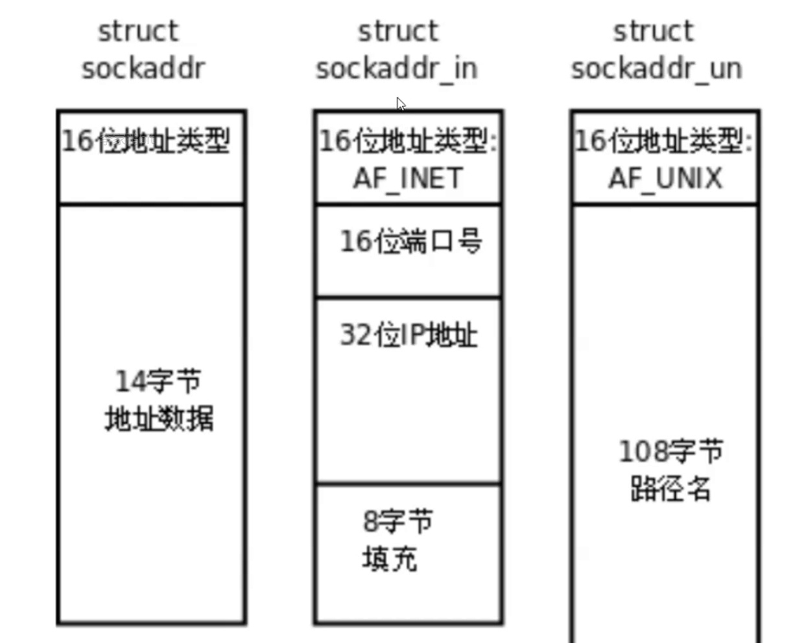

# 1.端口号

理解源 `IP` 地址和目的 `IP` 地址：

-   **源 IP 地址（Source IP Address）**：这是指发起通信的设备的 `IP` 地址。在网络通信中，每个设备都被分配一个唯一的 `IP` 地址，用于标识其在网络上的位置。

-   **目的 IP 地址（Destination IP Address）**：这是指接收通信的设备的 `IP` 地址。它告诉网络中的路由器或交换机将数据包发送到哪个设备。

**端口号（Port）** 是传输层协议（如 `TCP` 或 `UDP`）中的一个概念，用于标识一个特定的进程或服务。它是一个 `16` 位的整数，取值范围是 `0-65535`。端口号告诉操作系统，接收到的数据包应该被交给哪个进程或服务处理。`IP` 地址和端口号的组合可以唯一标识网络上的某一台主机的某一个进程。

端口号和进程 `ID` 都是用来 **唯一标识** 一个进程的。在网络通信中，端口号是用于标识不同服务或应用程序的，而进程 `ID` 是操作系统内部用于标识运行中的进程的。

但是端口号是在网络通信中使用的标识，而进程 `ID` 是操作系统内部使用的标识。一个进程可以同时绑定多个端口号，以便提供多个不同的服务，但是一个端口号不能被多个进程 `ID` 绑定。而取两种说法主要是为了将进程范畴和网络范畴进行解耦。

>   补充：如果你有一个使用 `IP` 地址和端口号的通信场景，比如 `QQ` 消息的发送，源 `IP` 地址是发送方的 `IP` 地址，目的 `IP` 地址是接收方的 `IP` 地址，而端口号则用于区分不同的服务或程序，确保消息到达正确的应用程序或进程。

这样，用户主机和服务主机内的通信，也就是客户端进程和服务端进程之间的进程通信，这就是网络通信的本质。数据在主机间转发仅仅是基本的手段，更为重要的是将数据交给双方主机中对应的进程，也就是将进程和一台主机的特定端口号来关联。

`IP地址 + 端口号` 就标识了全网内唯一的一个进程，两份这样的“数据对”：

-   套接字：`SRC_IP+SRC_PORT`
-   套接字：`DST_IP+ log.hpp (0)Searching DST_PORT`

两份套接字再进行关联就建立了客户端和服务端的连接，其后续的编程也就是 **套接字编程**。

而端口又涉及到 `TCP` 协议和 `UDP` 协议，这两种协议都在传输层被使用。

>   补充：云服务器的端口需要被开放，才能被别的服务器访问，这方面我写在另外一篇博文里...

## 1.1.简单理解 TCP 协议

**传输层协议**：该协议在传输层中被使用

**有连接**：需要在代码中建立连接（类似给某人打电话）

**可靠传输**：适用于需要可靠数据传输的应用，但可靠的编码代价有可能会让应用缺失实时性，并且更加复杂

**面向字节流**：待补充...

>   补充：一般实时性不强的应用会优先使用 `TCP`，有些应用还支持用户自定义选择。

## 1.2.简单理解 UDP 协议

**传输层协议**：该协议在传输层中被使用

**无连接**：不用在代码中刻意建立连接，是直接发送的（类似给某人写信）

**不可靠传输**：在网络不可靠的情况下，有可能出现丢包和乱序的问题（但在网络中依旧被采纳），使用于实时性要求较高的应用

**面向数据报**：待补充...

# 2.网络字节序

内存中的多字节数据相对于内存地址有大小端之分，磁盘文件中的多字节数据相对于文件中的偏 移地址也有大端小端之分，而网络数据流同样也有大端小端之分。

发送主机通常将发送缓冲区中的数据按内存地址 **从低到高的顺序发出**，接收主机把从网络上接到的字节依次保存在接收缓冲区中，也是 **按内存地址从低到高的顺序保存**，因此网络数据流的地址应规定：

-   先发出的数据是低地址，后发出的数据是高地址
-   `TCP/IP` 协议规定, 网络数据流应采用大端字节序，即低地址高字节
-   不管主机是大端机还是小端机，都按照 `TCP/IP` 规定的网络字节序来发送/接收数据
-   如果当前发送主机为小端，就需要先将数据转成大端，否则忽略转化直接发送即可

为使网络程序具有可移植性, 使同样的 `C` 代码在大端和小端计算机上编译后都能正常运行, 可以调用以下库函数做网络 字节序和主机字节序的转换。

1.  **`htons` 和 `ntohs`：**

    ```cpp
    //函数声明
    uint16_t htons(uint16_t hostshort);
    uint16_t ntohs(uint16_t netshort);
    ```

    将 `16` 位主机字节序的整数转换为网络字节序

    将 `16` 位网络字节序的整数转换为主机字节序

2.  **`htonl` 和 `ntohl`：**

    ```cpp
    //函数声明
    uint32_t htonl(uint32_t hostlong);
    uint32_t ntohl(uint32_t netlong);
    ```
    
    与 `htons` 和 `ntohs` 类似，用于 `32` 位整数。

>   补充：`h` 表示 `host`，而 `n` 表示 `network`。

# 3.socket 编程

## 3.1.套接字编程分类

`socket` 被翻译为“套接字”，实际上这个翻译还是很迷惑的，翻译成“插座/软件插座/软插座”会更好理解。

这套接口的标准是基于 `POSIX` 的，常见的 `socket` 分类主要有：

1.   **域间 socket：** 常见于本地通信，和命名管道通信很是类似。
2.   **原始 socket：** 通常指的是在网络层（`OSI` 模型的第三层）直接操作数据包的一种套接字。使用原始套接字，需要特殊的权限，程序可以发送和接收未封装的数据包，而不被协议栈处理，这使得程序可以更底层地控制网络数据的处理（但是这样的操作可能对网络和系统造成风险）。
3.   **网络 socket：** 通常用于描述一般的网络编程中的套接字。常见的网络 `socket` 包括 `TCP socket` 和 `UDP socket`，它们分别基于 `TCP` 和 `UDP` 传输协议，是应用层与传输层之间的接口。

上述三种应用场景，理论上应该是有三种接口，但是 `Linxu` 上统一使用同种接口，而我们重点学习网络套接字。

其中参数 `sockaddr` 结构如下：



根据地址类型判断是哪一种 `socket` 通信。

## 3.2.套接字数据结构

## 3.3.套接字编程应用

### 3.3.1.套接字编程常见 API

```cpp
//套接字编程常见 API
#include <sys/types.h>
#include <sys/socket.h>

//socket 编程 API
//创建 socket 文件描述符 (TCP/UDP, 客户端 + 服务器)
int socket(int domain,
           int type,
           int protocol);
//1.domain：套接字域，指明将来创建的套接字类型，常见类型如下（需要包含头文件 <arpa/inet.h>）：
	//(1)AF_UNIX、AF_LOCAL：本地通信
    //(2)AF_INET：网络通信(IPv4)，一般用这个
//2.type：通信类型，指明通信类型，文件和管道是流式类型，UDP 是面向数据报的，也就是无需建立连接，独立发送数据，一般填 SOCK_DGRAM 用户数据报
//3.protocol：协议类别，基本上前面两个参数填好了这个就固定了，填 0 即可

//成功的时候返回一个套接字（类似文件描述符），失败返回负值并且设置 errno

//绑定套接字 (TCP/UDP, 服务器)
int bind(int socket,
         const struct sockaddr *address,
         socklen_t address_len);
//可以将用户指定的 ip 和 port 在内核中进行强关联，使用结构体 sockaddr_in 的时候还需要额外加多两个头文件 <netinet/in.h> <arpa/inet.h>，该结构体需要设置好 sin_port=port 和 sin_addr.s_addr=ip，设置之前可以先使用 void bzero(void*s, size_t n) 把指定的空间进行清零（该库函数的头文件为 <strings.h>）
//1.socke：直接填入获取到的 port
//2.address：填入使用接口 inet_addr(const char* cp, struct in_addr* inp) 转化的 ip，该接口需要包含头文件 <sys/socket.h> <netinet/in.h> <arpa/inet.h>
//3.address_len：传入的对象结构体的字节长度（sizeod）

//成功返回 0，失败返回负值并且设置 error

//开始监听 socket (TCP, 服务器)
int listen(int socket,
           int backlog);

//接收请求 (TCP, 服务器)
int accept(int socket,
           struct sockaddr* address,
           socklen_t* address_len);

//建立连接 (TCP, 客户端)
int connect(int sockfd, 
            const struct sockaddr *addr,
            socklen_t addrlen);

ssize_t recvfrom(int sockfd, void *buf, size_t len,
                 int flags,
                 struct sockaddr* src_addr,
                 socklen_t* addrlen);
//该函数用于接受发送端的数据
//1.sockfd：本程序申请到的套接字
//2.buf、len：buf 指向读取缓冲区，len 是读取缓冲区的大小
//3.flag：表示调用操作的可选标志，常用的标志有 MSG_CONFIRM、MSG_DONTWAIT、MSG_ERRQUEUE 等，不用设置为 0 即可
//4.src_addr（输出型参数）：表示用于存储发送端地址信息的结构体 sockaddr 的指针，如果不需要知道发送端地址则可以传入 NULL
//5.addrlen（输出型参数）：对于输入参数，表示指定 src_addr 缓冲区的长度，对于输出参数，表示返回 src_addr 结构体的实际长度
    
//最后两个参数会得到发送端的套接字
//读取失败返回 -1
    
ssize_t sendto(int sockfd, const void* buf, size_t len,
               int flags, 
               const sockaddr* dest_addr,
               socklen_t addrlen);
//写回发送端
```

### 3.3.2.套接字编程下的 CV 模型

使用上述 `API` 来做一个 `CV` 框架，并且先制作出大致的服务端程序。

```cpp
//udp_server.hpp
#pragma once

#include <string>

#include <cerrno>
#include <cstring>
#include <cstdlib>

#include <strings.h>
#include <sys/types.h>
#include <sys/socket.h>
#include <netinet/in.h>
#include <arpa/inet.h>
#include <unistd.h>

#include "log.hpp"

#define DEBUG_SHOW

const int readBuffSize = 1024;

class UdpServer
{
    public:
    /* 初始化服务断配置 */
    UdpServer(uint16_t port, std::string ip = "") //IP 地址假定为空
        : _port(port), _ip(ip), _sock(-1)
        {
            //下面开始我们的网络编程
            //1.创建套接字
            if ((_sock = socket(AF_INET, SOCK_DGRAM, 0)) < 0)
            {
                LogMessage(FATAL, "%d:%s", errno, strerror(errno));
                exit(20);
            }

            //2.绑定套接字
            struct sockaddr_in local;
            bzero(&local, sizeof(local));

            local.sin_port = htons(_port); //由于需要把本机的端口号发送给对方，因此需要转化字节序再填入端口号
            local.sin_addr.s_addr = inet_addr(_ip.c_str()); //填入反字节序的 ip 地址
            local.sin_family = AF_INET; //设置协议家族

            if (bind(_sock, (struct sockaddr*)&local, sizeof(local)) < 0)
            {
                LogMessage(FATAL, "%d:%s", errno, strerror(errno));
                exit(30);
            }

            LogMessage(NORMAL, "init udp server done ... %s", strerror(errno));
        }

    /*启动进程*/
    void Start()
    {
        //注意，只要主机不奔溃服务端不出错，服务端将永远不退出（对于系统来说，就是一个常驻进程）
        char readBuff[readBuffSize] = { 0 }; //初始化为 0，后续就不用添加 '\0' 了
        while (true)
        {
            //1.读取数据
            struct sockaddr_in peer; bzero(&peer, sizeof(peer)); //纯输出型参数
            socklen_t peerLen = sizeof(peer); //输入输出型参数，输入：缓冲区大小，输出：实际读到的 peer 大小

            ssize_t s = recvfrom(_sock, readBuff, sizeof(readBuff) - 1,
                                 0, (struct sockaddr*)&peer, & peerLen);

            if (s > 0)
            {
                //1.1.读取到的信息
                //1.2.指明是谁发送的信息
                uint16_t cli_port = ntohs(peer.sin_port); //需要反序列
                std::string cli_ip = inet_ntoa(peer.sin_addr); //反序列后转化为点分十进制字符串
                std::cout
                    << "port:[" << cli_port << "]"
                    << "ip:[" << cli_ip << "], sad:"
                    << readBuff << std::endl;
            }
            else
            {
                LogMessage(FATAL, "%d:%s", errno, strerror(errno));
                exit(40);
            }

            //2.分析数据

            //3.写回数据
            sendto(_sock, readBuff, strlen(readBuff),
                   0, (struct sockaddr*)&peer, peerLen);
        }
    }

    ~UdpServer()
    {
        if (_sock >= 0)
            close(_sock);
    }

    private:
    uint16_t _port; //端口号（一般是 16 位的整数）
    std::string _ip; //ip 地址
    int _sock; //套接字（当作文件描述符理解）
};
```

```cpp
//udp_server.cc
#include <iostream>
#include <memory>
#include <string>
#include <cstdlib>

#include "udp_server.hpp"

static void Usage(std::string proc)
{
    std::cout << "\nUsage: " << proc << "ip port\n" << std::endl;
}

int main(int argc, char* argv[]) //服务器启动指令 ./udp_server ip port
{
    if (argc != 3) //启动方法有误
    {
        Usage(argv[0]);
        exit(10);
    }

    std::string ip = argv[1]; //获取 ip 地址
    uint16_t port = atoi(argv[2]); //获取端口号

    std::unique_ptr<UdpServer> svr(new UdpServer(port, ip)); //使用智能指针托管指针（内含初始化）
    svr->Start();

    return 0;
}
```

可以使用 `netstat -anup` 检验服务端是否可以成功启动。

```shell
# 查看服务器运行情况
$ netstat -anup
(Not all processes could be identified, non-owned process info
 will not be shown, you would have to be root to see it all.)
Active Internet connections (servers and established)
Proto Recv-Q Send-Q Local Address           Foreign Address         State       PID/Program name    
udp        0      0 0.0.0.0:8080            0.0.0.0:*                           31747/./udp_server  
```

然后编写客户端代码和 `makefile`：

```cpp
//udp_client.cc
#include <iostream>
#include <string>

#include <cstring>

#include <unistd.h>
#include <sys/types.h>
#include <sys/socket.h>
#include <arpa/inet.h>

const int readBuffSize = 1024;

static void Usage(std::string proc)
{
    std::cout << "\nUsage: " << proc << "serverIp serverPort\n" << std::endl;
}

int main(int argc, char* argv[]) //./udp_client 127.0.0.1 8080
{
    //1.检查命令行输入
    if(argc != 3)
    {
        Usage(argv[0]);       
        exit(50);
    }

    //2.创建套接字
    int sock = socket(AF_INET, SOCK_DGRAM, 0);
    if (sock < 0)
    {
        std::cerr << "socket error" << std::endl;
        exit(60);
    }

    //3.绑定套接字
    //但是一般不需要程序员自己 bind，这是因为客户端是被客户端使用的，如果程序员自己 bind 了，那么该客户端的一定是绑定了某个固定的 ip 和 port
    //万一在多个不关联的客户端同时启动的情况下，就会出现 port 绑定失败的情况，进而导致客户端启动失败）
    //将 bind 操作交给操作系统来做，操作系统对于哪些 port 没有被占用的情况最清楚了
    
    //4.向服务端发送数据
    std::string message;

    struct sockaddr_in server;
    server.sin_family = AF_INET;
    server.sin_port = htons(atoi(argv[2]));
    server.sin_addr.s_addr = inet_addr(argv[1]);
    
    while(true)
    {
        char readBuff[readBuffSize] = { 0 };
        std::cout << "向服务器发送信号" << std::endl;
        std::getline(std::cin, message);
        if(strcmpc(message.c_str(), "exit") == 0) 
            break;

        sendto(sock, message.c_str(), message.size(), 0,
                (struct sockaddr*)&server, sizeof(server));
        //第一次向服务器发送数据时，操作系统会在 sendto() 执行过程程中自动为服务端绑定
    
        //5.读取服务端返回的数据
        struct sockaddr_in temp; //占位符
        socklen_t len = sizeof(temp);
        ssize_t s = recvfrom(sock, readBuff, sizeof(readBuff), 0,
                (struct sockaddr*)&temp, &len);
        if(s > 0)
        {
            std::cout << "server echo# " << readBuff << std::endl;
        }
    }

    close(sock);
    std::cout << "bye~" << std::endl;

    return 0;
}
```

```makefile
# makefile
.PHONY:all
all:udp_client udp_server

udp_client:udp_client.cc
	g++ -o $@ $^ -std=c++11

udp_server:udp_server.cc
	g++ -o $@ $^ -std=c++11

.PHONY:clean
clean:
	rm -f udp_client udp_server
```

使用本地 `ip`（也叫“本地环回”，`CS` 模型只在本地协议栈中进行数据流行，不会把数据发送到网络中，只是把协议栈走一个回环，多用于本地测试）启动服务端和 `8080` 端口来启动服务端程序和用户端程序，启动结果如下：

```shell
# 服务端进程接送信息
$ ./udp_server 127.0.0.1 8080
[NORMAL][1706856251] init udp server done ... Success
port:[47091]ip:[127.0.0.1], sad:hello, I am Limou3434.
```

```shell
# 用户端进程发送信息
$ ./udp_client 127.0.0.1 8080
向服务器发送信号
hello, I am Limou3434.
server echo# hello, I am Limou3434.
向服务器发送信号
...
```

可以看到通信成功，但是这里面是有很多的坑点和补充点的...

云服务器无法绑定具体的公网 `IP` 地址，这些 `IP` 实际上是厂商提供的虚拟 `IP`，不是真实的物理 `IP`，而一般服务器也不推荐真的使用一个确定 `IP`，而是使用任意 `IP`。服务端绑定套接字时，将其绑定到 `INADDR_ANY(0)` 表示服务端愿意接受任何本地网络接口上的连接请求。

在服务端计算机上可能有多个网络接口，例如有线网卡、无线网卡等。通过将套接字绑定到 `INADDR_ANY`，服务端可以监听所有可用的网络接口上的连接，这意味着服务端将能够接受通过任何网络接口发送到本地计算机的连接请求。

因此我需要修改一下服务端的代码：

```cpp
//udp_server.hpp(修改 ip 地址绑定逻辑)
#pragma once

#include <string>

#include <cerrno>
#include <cstring>
#include <cstdlib>

#include <strings.h>
#include <sys/types.h>
#include <sys/socket.h>
#include <netinet/in.h>
#include <arpa/inet.h>
#include <unistd.h>

#include "log.hpp"

#define DEBUG_SHOW

const int readBuffSize = 1024;

class UdpServer
{
public:
    /* 初始化服务断配置 */
    UdpServer(uint16_t port, std::string ip = "") //IP 地址假定为空
        : _port(port), _ip(ip), _sock(-1)
    {
        //下面开始我们的网络编程
        //1.创建套接字
        if ((_sock = socket(AF_INET, SOCK_DGRAM, 0)) < 0)
        {
            LogMessage(FATAL, "%d:%s", errno, strerror(errno));
            exit(20);
        }

        //2.绑定套接字
        struct sockaddr_in local;
        bzero(&local, sizeof(local));

        local.sin_port = htons(_port); //由于需要把本机的端口号发送给对方，因此需要转化字节序再填入端口号
        local.sin_addr.s_addr = _ip.empty() ? INADDR_ANY : inet_addr(_ip.c_str()); //填入反字节序的 ip 地址（若为空则填入任意 IP 地址，可以让服务器从任意 IP 中获取数据，该关键字实际是 0）
        local.sin_family = AF_INET; //设置协议家族

        if (bind(_sock, (struct sockaddr*)&local, sizeof(local)) < 0)
        {
            LogMessage(FATAL, "%d:%s", errno, strerror(errno));
            exit(30);
        }

        LogMessage(NORMAL, "init udp server done ... %s", strerror(errno));
    }

    /*启动进程*/
    void Start()
    {
        //注意，只要主机不奔溃服务端不出错，服务端将永远不退出（对于系统来说，就是一个常驻进程）
        char readBuff[readBuffSize] = { 0 }; //初始化为 0，后续就不用添加 '\0' 了
        while (true)
        {
            //1.读取数据
            struct sockaddr_in peer; bzero(&peer, sizeof(peer)); //纯输出型参数
            socklen_t peerLen = sizeof(peer); //输入输出型参数，输入：缓冲区大小，输出：实际读到的 peer 大小

            ssize_t s = recvfrom(_sock, readBuff, sizeof(readBuff) - 1,
                0, (struct sockaddr*)&peer, &peerLen);

            if (s > 0)
            {
                //1.1.读取到的信息
                //1.2.指明是谁发送的信息
                uint16_t cli_port = ntohs(peer.sin_port); //需要反序列
                std::string cli_ip = inet_ntoa(peer.sin_addr); //反序列后转化为点分十进制字符串
                std::cout
                    << "port:[" << cli_port << "]"
                    << "ip:[" << cli_ip << "], sad:"
                    << readBuff << std::endl;
            }
            else
            {
                LogMessage(FATAL, "%d:%s", errno, strerror(errno));
                exit(40);
            }

            //2.分析数据

            //3.写回数据
            sendto(_sock, readBuff, strlen(readBuff),
                0, (struct sockaddr*)&peer, peerLen);
        }
    }

    ~UdpServer()
    {
        if (_sock >= 0)
            close(_sock);
    }

private:
    uint16_t _port; //端口号（一般是 16 位的整数）
    std::string _ip; //ip 地址
    int _sock; //套接字（当作文件描述符理解）
};
```

```cpp
//udp_server.cc(修改命令行参数分析逻辑)
#include <iostream>
#include <memory>
#include <string>
#include <cstdlib>

#include "udp_server.hpp"

static void Usage(std::string proc)
{
    std::cout << "\nUsage: " << proc << "[ip] port\n" << std::endl;
}

int main(int argc, char* argv[]) //服务器启动指令 ./udp_server ip port
{
    if (argc == 3)
    {
        std::string ip = argv[1]; //获取 ip 地址
        uint16_t port = atoi(argv[2]); //获取端口号
        std::unique_ptr<UdpServer> svr(new UdpServer(port, ip)); //使用智能指针托管指针（内含初始化）
        svr->Start();
    }
    else if (argc == 2)
    {
        uint16_t port = atoi(argv[1]); //获取端口号
        std::unique_ptr<UdpServer> svr(new UdpServer(port)); //使用智能指针托管指针（内含初始化）
        svr->Start();
    }
    else //启动方法有误
    {
        Usage(argv[0]);
        exit(10);
    }

    return 0;
}
```

这样，任何一台 `Linux` 的云服务器，都可以拿服务端服务器给予的公网 `IP` 和端口号来给其发送数据了，一个简易版的服务端到客户端的单向聊天软件就形成了...

除了发送单纯的文本信息，还可以让服务器根据接受到的指令来执行其他的逻辑，下面我们再次来改写代码。

首先使用介绍 `popen()` 及其系列的方法，该函数原型如下：

```cpp
//popen() 及其系列方法
#include <stdio.h>
FILE* popen(const char* command, const char* type);
//该函数会通过建立管道和 fork() 出子进程，然后通过 exec 系列接口自动执行 command 命令（内部自动解析命令）
//返回 FILE* 指针，可以读取任务执行的返回结果
```

我们再次修改一下服务端的代码：

```cpp
//udp_server.hpp(添加指令执行功能)
#pragma once

#include <string>

#include <cerrno>
#include <cstring>
#include <cstdlib>
#include <cstdio>

#include <strings.h>
#include <sys/types.h>
#include <sys/socket.h>
#include <netinet/in.h>
#include <arpa/inet.h>
#include <unistd.h>

#include "log.hpp"

#define DEBUG_SHOW

const int readBuffSize = 1024;

class UdpServer
{
public:
    /* 初始化服务断配置 */
    UdpServer(uint16_t port, std::string ip = "") //IP 地址假定为空
        : _port(port), _ip(ip), _sock(-1)
    {
        //下面开始我们的网络编程
        //1.创建套接字
        if ((_sock = socket(AF_INET, SOCK_DGRAM, 0)) < 0)
        {
            LogMessage(FATAL, "%d:%s", errno, strerror(errno));
            exit(20);
        }

        //2.绑定套接字
        struct sockaddr_in local;
        bzero(&local, sizeof(local));

        local.sin_port = htons(_port); //由于需要把本机的端口号发送给对方，因此需要转化字节序再填入端口号
        local.sin_addr.s_addr = _ip.empty() ? INADDR_ANY : inet_addr(_ip.c_str()); //填入反字节序的 ip 地址（若为空则填入任意 IP 地址，可以让服务器从任意 IP 中获取数据，该关键字实际是 0）
        local.sin_family = AF_INET; //设置协议家族

        if (bind(_sock, (struct sockaddr*)&local, sizeof(local)) < 0)
        {
            LogMessage(FATAL, "%d:%s", errno, strerror(errno));
            exit(30);
        }

        LogMessage(NORMAL, "init udp server done ... %s", strerror(errno));
    }

    /*启动进程*/
    void Start()
    {
        //注意，只要主机不奔溃服务端不出错，服务端将永远不退出（对于系统来说，就是一个常驻进程）
        while (true)
        {
            //1.读取数据
            char readBuff[readBuffSize] = { 0 }; //初始化为 0，后续就不用添加 '\0' 了
            
            struct sockaddr_in peer; bzero(&peer, sizeof(peer)); //纯输出型参数
            socklen_t peerLen = sizeof(peer); //输入输出型参数，输入：缓冲区大小，输出：实际读到的 peer 大小

            char result[1024] = { 0 }; //后续读取命令返回结果时要用的读取缓冲区
            std::string cmd_echo; //读取后的所有结果存储在 cmd_echo 中，然后发送回客户端
        
            ssize_t s = recvfrom(_sock, readBuff, sizeof(readBuff) - 1,
                0, (struct sockaddr*)&peer, &peerLen);

            if (s > 0)
            {
                //1.1.读取到的信息
                //1.2.指明是谁发送的信息
                uint16_t cli_port = ntohs(peer.sin_port); //需要反序列
                std::string cli_ip = inet_ntoa(peer.sin_addr); //反序列后转化为点分十进制字符串
                std::cout
                    << "port:[" << cli_port << "]"
                    << "ip:[" << cli_ip << "], sad:"
                    << readBuff << std::endl;
                
                //1.3.过滤命令
                if(strcasestr(readBuff, "rm") != nullptr
                        || strcasestr(readBuff, "rmdir") != nullptr)
                {
                    std::cout << "用户指令包含 rm 类的不安全指令" << std::endl;
                    std::string warn = "你想干嘛？！\n";
                    sendto(_sock, warn.c_str(), warn.size(),
                        0, (struct sockaddr*)&peer, peerLen);
                    continue;
                }
                
                //1.4.执行命令
                FILE* fp = popen(readBuff, "r");
                if(nullptr == fp)
                {
                    LogMessage(ERROR, "popen:%s:%d,%s", errno, strerror(errno), "非法命令");
                    continue;
                }

                //1.5.读取返回结果
                while(fgets(result, sizeof(result), fp) != nullptr)
                {
                    cmd_echo += result;
                }

                fclose(fp); //更严谨一些
            }
            else
            {
                LogMessage(FATAL, "%d:%s", errno, strerror(errno));
                exit(40);
            }

            //2.分析数据

            //3.写回数据
            sendto(_sock, cmd_echo.c_str(), cmd_echo.size(),
                0, (struct sockaddr*)&peer, peerLen);
        }
    }

    ~UdpServer()
    {
        if (_sock >= 0)
            close(_sock);
    }

private:
    uint16_t _port; //端口号（一般是 16 位的整数）
    std::string _ip; //ip 地址
    int _sock; //套接字（当作文件描述符理解）
};
```

```cpp
//udp_server.cc(添加指令执行功能)
#include <iostream>
#include <memory>
#include <string>
#include <cstdlib>

#include "udp_server.hpp"

static void Usage(std::string proc)
{
    std::cout << "\nUsage: " << proc << "[ip] port\n" << std::endl;
}

int main(int argc, char* argv[]) //服务器启动指令 ./udp_server ip port
{
    if (argc == 3)
    {
        std::string ip = argv[1]; //获取 ip 地址
        uint16_t port = atoi(argv[2]); //获取端口号
        std::unique_ptr<UdpServer> svr(new UdpServer(port, ip)); //使用智能指针托管指针（内含初始化）
        svr->Start();
    }
    else if (argc == 2)
    {
        uint16_t port = atoi(argv[1]); //获取端口号
        std::unique_ptr<UdpServer> svr(new UdpServer(port)); //使用智能指针托管指针（内含初始化）
        svr->Start();
    }
    else //启动方法有误
    {
        Usage(argv[0]);
        exit(10);
    }

    return 0;
}
```

这样就可以让客户端操控服务端，没错客户端这边就是一个简易版的云服务器操作端...

我们还可以再改一下：


上述代码将所有客户端的消息收集起来，再进行广播，您又可以实现一个简易版的群聊平台。


而如果我们让服务端作为中转站，存储来自不同客户端的文本信息，经过处理后再传递给别人，就实现了简易版的客户端到客户端间的双向聊天软件...


