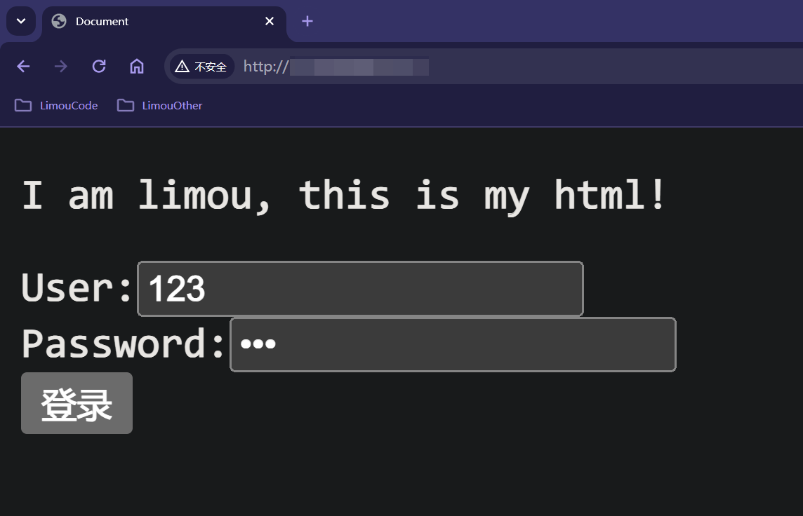

>   前要：程序员在网络程序上编写满足日常需求的网络程序基本都是在应用层编写的（包括我们之前编写的套接字编程）。
>
>   我们来理顺一下关于 `TCP` 通信发送的流程：
>
>   
>
>   一般都是客户端主动访问服务端，而不是服务端主动连接客户端，这种基于客户端的模式简称 `CS` 模型。
>
>   现在的主流网络下可靠传输和不可靠传输已经很难察觉到了。
>   
>    有无连接可以直接在代码中体现出来。
>    
>    `UDP` 读一次必须写一次，`TCP` 等到读取的时候一次性读取。
>   
>   本节我们要站在应用层上重新理解套接字编程。

# 1.自定协议和序列化

`HTTP(Hypertext Transfer Protocol)` 协议实际上就是应用层规定好的其中一种协议。

我们之前读写数据都是按照字符串的方式来发送和接收的，那如果是具有 `结构化的数据` 怎么办呢？

假设我们需要实现一个网络计算器，就需要先规定好两个结构体（其实从这就是制定协议的开始了）：

```cpp
//网络计算器
//服务端发送下面结构的实例化
typedef struct Request {
    int _a;
    int _b;
    char _op;
} Request;
Request reqt = { 10, 20, '+' };

//客户端发送下面结构的实例化
typedef struct Response {
    int _result;
    int _errodCode;
} Response;
Response reqe = { 30, 0 };
```

而更进一步，也可以认为协议定制的时候，需要用到的字段也是协议的一部分。

规定好协议后，如果客户端和服务端规定传输数据的规格直接进行传输确实可以（这也就是为什么读写接口不直接使用类型为 `char*` 的缓冲区而是使用 `void*` 的原因），但是这种做法拓展性很差，很容易失效。

而如果我们先使用结构来定义交互的信息，但按照某个规则转化为字符串，接受数据时把字符串转化为结构体。而这个过程，就是所谓 `序列化(多变一)` 和 `反序列化(一变多)` 的概念。

例如将 `102, 20, '+'` 转化为 `"10 20 +"`，通过网络把字节流直接传输到另外一段，这种做法相当于加了一层软件层，把应用和网络进行解耦。

>   注意：当然，这是一种理想情况。如果制定协议的双方已经明确了各种大小端和对齐规则，很可能真的就直接传递一个结构实例化对象（实际就是直接使用二进制传递），在另一端直接进行解析。但是，这种做法只适合较为底层的协议，这些协议封装的很好，几乎无需担心出错的问题。

还有一种可能，由于 `TCP` 传输的过程是基于字节流的，无法保证传输数据时的完整性（有可能多条数据混杂为一条数据，也有可能数据发送到一半还有部分未发送），因此我们也需要解决这个问题。

协议是一种约定，但是这种表述太抽象，具体到代码中就需要做到：


我们可以尝试实践一下，让抽象的概念化为具体的代码。

## 1.1.自定义协议，自定义序列化

```makefile
# makefile(自定义协议，并且自定义序列化)
.PHONY:all
all:cal_client cal_server

cal_client:cal_client.cpp
	g++ -o $@ $^ -std=c++11 -lpthread

cal_server:cal_server.cpp
	g++ -o $@ $^ -std=c++11 -lpthread

.PHONY:clean
clean:
	rm -rf cal_client cal_server log_dir
```

```cpp
//log.hpp(自定义协议，并且自定义序列化)

/* 文件描述
Log log = Log(bool debugShow = true,    //选择是否显示 DEBUG 等级的日志消息
    std::string writeMode = "SCREEN",   //选择日志的打印方式
    std::string logFileName = "log"     //选择日志的文件名称
);
log.WriteModeEnable();      //中途可以修改日志的打印方式
log.LogMessage(DEBUG | NORMAL | WARNING | ERROR | FATAL, "%s %d", __FILE__, __LINE__));     //打印日志
*/

#pragma once
#include <iostream>
#include <string>
#include <fstream>
#include <cstdio>
#include <cstdarg>
#include <ctime>
#include <pthread.h>
#include <unistd.h>
#include <sys/stat.h>
#include <sys/types.h>

//日志级别
#define DEBUG 0 //调试
#define NORMAL 1 //正常（或者叫 INFO）
#define WARNING 2 //警告
#define ERROR 3 //错误
#define FATAL 4 //致命

enum WriteMode
{
    SCREEN = 5,
    ONE_FILE,
    CLASS_FILE
};

const char* gLevelMap[] = {
    "DEBUG", //debug 模式
    "NORMAL", //正常（或者叫 INFO）
    "WARNING", //警告
    "ERROR", //非致命错误
    "FATAL" //严重错误
};

const std::string logdir = "log_dir";

//日志功能主要有：日志等级、发送时间、日志内容、代码行数、运行用户
class Log
{
private:
    void __WriteLogToOneFile(std::string logFileName, const std::string& message)
    {
        std::ofstream out(logFileName, std::ios::app);
        if (!out.is_open())
            return;
        out << message;
        out.close();
    }
    void __WriteLogToClassFile(const int& level, const std::string& message)
    {
        std::string logFileName = "./";
        logFileName += logdir;
        logFileName += "/";
        logFileName += _logFileName;
        logFileName += "_";
        logFileName += gLevelMap[level];

        __WriteLogToOneFile(logFileName, message);
    }
    void _WriteLog(const int& level, const std::string& message)
    {
        switch (_writeMode)
        {
        case SCREEN: //向屏幕输出
            std::cout << message;
            break;
        case ONE_FILE: //向单个日志文件输出
            __WriteLogToOneFile("./" + logdir + "/" + _logFileName, message);
            break;
        case CLASS_FILE: //向多个日志文件输出
            __WriteLogToClassFile(level, message);
            break;
        default:
            std::cout << "write mode error!!!" << std::endl;
            break;
        }
    }

public:
    //构造函数，debugShow 为是否显示 debug 消息，writeMode 为日志打印模式，logFileName 为日志文件名
    Log(bool debugShow = true, const WriteMode& writeMode = ONE_FILE, std::string logFileName = "log")
        : _debugShow(debugShow), _writeMode(writeMode), _logFileName(logFileName)
    {
        mkdir(logdir.c_str(), 0775); //创建目录
    }

    //调整日志打印方式
    void WriteModeEnable(const WriteMode& mode)
    {
        _writeMode = mode;
    }

    //拼接日志消息并且输出
    void LogMessage(const int& level, const char* format, ...)
    {
        //1.若不是 debug 模式，且 level == DEBUG 则不做任何事情
        if (_debugShow == false && level == DEBUG)
            return;

        //2.收集日志标准部分信息
        char stdBuffer[1024];
        time_t timestamp = time(nullptr); //获得时间戳
        struct tm* local_time = localtime(&timestamp); //将时间戳转换为本地时间

        snprintf(stdBuffer, sizeof stdBuffer, "[%s][pid:%s][%d-%d-%d %d:%d:%d]",
            gLevelMap[level],
            std::to_string(getpid()).c_str(),
            local_time->tm_year + 1900, local_time->tm_mon + 1, local_time->tm_mday,
            local_time->tm_hour, local_time->tm_min, local_time->tm_sec
        );

        //3.收集日志自定义部分信息
        char logBuffer[1024];
        va_list args; //声明可变参数列表，实际时一个 char* 类型
        va_start(args, format); //初始化可变参数列表
        vsnprintf(logBuffer, sizeof logBuffer, format, args); //int vsnprintf(char *str, size_t size, const char *format, va_list ap); 是一个可变参数函数，将格式化后的字符串输出到缓冲区中。类似带 v 开头的可变参数函数有很多
        va_end(args); //清理可变参数列表，类似 close() 和 delete

        //4.拼接为一个完整的消息
        std::string message;
        message += "--> 标准日志:"; message += stdBuffer;
        message += "\t 用户日志:"; message += logBuffer;
        message += "\n";

        //5.打印日志消息
        _WriteLog(level, message);
    }
    
private:
    bool _debugShow;
    WriteMode _writeMode;
    std::string _logFileName;
};

```

```cpp
//sock.hpp(自定义协议，并且自定义序列化)

/* 文件描述
主要是对套接字编程的常见接口做封装，是一个关于套接字的工具包
*/

#pragma once
#include <memory>
#include <cstring>
#include <sys/types.h>
#include <sys/socket.h>
#include <netinet/in.h>
#include <arpa/inet.h>
#include "log.hpp"

class ThreadData
{
public:
    int _sock;
    std::string _ip;
    uint16_t _port;
};

class Sock
{
private:
    const static int g_backlog = 20; //一般不会太大，也不会太小

public:
    //空的构造函数
    Sock() {}

    //创建监听套接字
    int _Socket()
    {
        int listenSock = socket(AF_INET, SOCK_STREAM, 0);
        if (listenSock < 0)
        {
            _log.LogMessage(FATAL, "socket() error %s %d", __FILE__, __LINE__);
            exit(1);
        }
        _log.LogMessage(NORMAL, "socket() success %s %d", __FILE__, __LINE__);
        return listenSock;
    }

    //绑定监听套接字
    void _Bind(int listenSock, uint16_t port, std::string ip = "0.0.0.0")
    {
        struct sockaddr_in local;
        memset(&local, 0, sizeof local);
        local.sin_family = AF_INET;
        local.sin_port = htons(port);
        inet_pton(AF_INET, ip.c_str(), &local.sin_addr);

        if (bind(listenSock, (struct sockaddr*)&local, sizeof(local)) < 0)
        {
            _log.LogMessage(FATAL, "bind() error %s %d", __FILE__, __LINE__);
            exit(2);
        }
        _log.LogMessage(NORMAL, "bind() success %s %d", __FILE__, __LINE__);
    }

    //置套接字监听状态
    void _Listen(int listenSock)
    {
        if (listen(listenSock, g_backlog) < 0)
        {
            _log.LogMessage(FATAL, "listen() error %s %d", __FILE__, __LINE__);
            exit(3);
        }
        _log.LogMessage(NORMAL, "listen() success %s %d", __FILE__, __LINE__);
    }

    //服务端等待连接后，返回服务套接字（参数还带有服务端的信息）
    int _Accept(int listenSock, std::string* ip, uint16_t* port)
    {
        struct sockaddr_in src;
        socklen_t len = sizeof(src);

        int serviceSock = accept(listenSock, (struct sockaddr*)&src, &len);
        if (serviceSock < 0)
        {
            _log.LogMessage(FATAL, "accept() error %s %d", __FILE__, __LINE__);
            return -1;
        }
        _log.LogMessage(NORMAL, "accept() success %s %d", __FILE__, __LINE__);

        *port = ntohs(src.sin_port);
        *ip = inet_ntoa(src.sin_addr);

        return serviceSock;
    }

    //客户端主动连接服务端
    bool _Connect(int sock, const std::string& server_ip, const uint16_t& server_port)
    {
        struct sockaddr_in server;
        memset(&server, 0, sizeof(server));
        server.sin_family = AF_INET;
        server.sin_port = htons(server_port);
        server.sin_addr.s_addr = inet_addr(server_ip.c_str());

        if (connect(sock, (struct sockaddr*)&server, sizeof(server)) == 0)
        {
            _log.LogMessage(NORMAL, "accept() success %s %d", __FILE__, __LINE__);
            return true;
        }

        _log.LogMessage(FATAL, "connect() error %s %d", __FILE__, __LINE__);
        return false;
    }

private:
    Log _log;
};
```

```cpp
//tcp_server.hpp(自定义协议，并且自定义序列化)

/* 文件描述
主要是对 sock.hpp 的使用，构建一个可用的 TCP 服务端
*/

#pragma once
#include <functional>
#include <vector>
#include <pthread.h>
#include "sock.hpp"
#include "log.hpp"

class TcpServer
{
private:
    class ThreadData
    {
    public:
        ThreadData(int serviceSock, TcpServer* server) : _serviceSock(serviceSock), _server(server) {}
        ~ThreadData() {}

    public:
        int _serviceSock;
        TcpServer* _server;
    };

    using func_t = std::function<void(int)>;

private:
    void __Excute(int serviceSock)
    {
        for (auto& func : _funcs)
        {
            func(serviceSock); //执行任务列表中的所有任务
        }
    }

    static void* _ThreadRoutine(void* args)
    {
        pthread_detach(pthread_self()); //线程分离
        ThreadData* td = static_cast<ThreadData*>(args); //解包参数
        td->_server->__Excute(td->_serviceSock); //执行所有绑定的方法
        close(td->_serviceSock);
        delete td;
        return nullptr;
    }

public:
    //利用套接字工具包初始化套接字
    TcpServer(const uint16_t& port, const std::string& ip = "0.0.0.0")
    {
        _listensock = _sock._Socket();
        _sock._Bind(_listensock, port, ip);
        _sock._Listen(_listensock);
    }

    //给服务器绑定的一些 void(int) 类型的服务（PS：请在服务器启动之前绑定，该方法没有保证线程安全）
    void BindService(func_t func)
    {
        _funcs.push_back(func);
    }

    //启动 tcp 服务器
    void Start()
    {
        while(true) //不断获取新的服务套接字
        {
            std::string client_ip;
            uint16_t client_port;
            int serviceSock = _sock._Accept(_listensock, &client_ip, &client_port);
            if (serviceSock == -1)
            {
                continue;
            }
            else
            {
                _log.LogMessage(NORMAL, "creat new link success, sock %d, %s %d", serviceSock, __FILE__, __LINE__);

                //创建子线程，让子线程完成任务，一个线程分配一个服务套接字做服务
                pthread_t tid;
                ThreadData* td = new ThreadData(serviceSock, this);
                pthread_create(&tid, nullptr, _ThreadRoutine, td); //注意子线程内部做了线程分离，也自己做了 td 制作的释放
            }
        }
    }

    ~TcpServer()
    {
        if (_listensock >= 0)
            close(_listensock);
    }

private:
    Sock _sock; //套接字工具包
    int _listensock; //监听套接字
    std::vector<func_t> _funcs; //任务列表
    Log _log; //日志对象
};
```

```cpp
//protocol.hpp(自定义协议，并且自定义序列化)

/* 文件描述
主要是对协议的定制，该协议是自定义的，是对协议的模拟
其中约定就体现在：
(1) 结构化的数据
(2) 序列和反序列化的解析顺序
(3) 运算结果的状态码
(4) 报头的封装规定
*/

#pragma once
#include <iostream>
#include <string>
#include <cstring>
#include <sys/types.h>
#include <sys/socket.h>
#include "log.hpp"

#define SPACE " "
#define SPACE_LEN strlen(SPACE) //这么做是为了可拓展
#define SEP "\r\n"
#define SEP_LEN strlen(SEP) //这么做是为了可拓展

//请求中有效载荷的“序列化”和“反序列化”（客户端序列化请求，服务端反序列化请求）
class Request
{
public:
    Request() {}
    Request(int x, int y, char op) : _x(x), _y(y), _op(op) {}

    //序列化为 "_x _op _y"
    std::string Serialize()
    {
        std::string str;
        str += std::to_string(_x);
        str += SPACE;
        str += _op;
        str += SPACE;
        str += std::to_string(_y);
        return str;
    }
    //反序列化为 { int _x; int _y; char _op; }
    bool Deserialize(const std::string& str)
    {
        std::size_t left = str.find(SPACE);
        if (left == std::string::npos)
            return false;

        std::size_t right = str.rfind(SPACE);
        if (right == std::string::npos)
            return false;

        _x = atoi(str.substr(0, left).c_str());
        _op = str[left + SPACE_LEN];
        _y = atoi(str.substr(right + SPACE_LEN).c_str());

        return true;
    }

public:
    int _x; //操作数
    int _y; //操作数
    char _op; //操作符
};

//响应中有效载荷的“序列化”和“反序列化”（服务端序列化响应，客户端反序列化请求）
class Response
{
public:
    Response() {}
    Response(int result, int code) : _result(result), _code(code) {}

    //序列化为 "_code _result"
    std::string Serialize()
    {
        std::string str;
        str += std::to_string(_code);
        str += SPACE;
        str += std::to_string(_result);
        return str;
    }
    //反序列化为 { int _result; int _code; }
    bool Deserialize(const std::string& str)
    {
        std::size_t pos = str.find(SPACE);
        if (pos == std::string::npos)
            return false;

        _code = atoi(str.substr(0, pos).c_str());
        _result = atoi(str.substr(pos + SPACE_LEN).c_str());
        return true;
    }

public:
    int _result; //计算结果
    int _code; //计算状态码
};


//读取数据报
bool Recv(int sock, std::string* out)
{
    Log log;

    char buffer[1024] = { 0 };
    ssize_t str = recv(sock, buffer, sizeof(buffer) - 1, 0);
    if (str > 0)
    {
        *out += buffer;
        return true;
    }
    else if (str == 0) //对端关闭了
    {
        log.LogMessage(WARNING, "clienr quit... %s %d", __FILE__, __LINE__);
        return false;
    }
    else
    {
        log.LogMessage(FATAL, "recv() error %s %d", __FILE__, __LINE__);
        return false;
    }
}

//发送数据报
void Send(int sock, const std::string str)
{
    send(sock, str.c_str(), str.size(), 0);
}


//提取完整有效载荷
std::string Decode(std::string& buffer)
{
    //length\r\n123 + 456\r\n

    //长度信息还没有读取完毕，返回空串继续读取，直到下次一次能遇到 '\r\n' 标识符
    std::size_t pos = buffer.find(SEP);
    if (pos == std::string::npos)
    {
        return "";
    }

    //走到这里说明一定可以获取到长度，若剩余的大小 surplus >= 报头的长度 length，说明足够返回至少一个完整数据报
    int length = atoi(buffer.substr(0, pos).c_str());
    int surplus = buffer.size() - pos - SEP_LEN - SEP_LEN; //除去标志符后剩余的字符长度
    if (surplus < length) //虽然获取到了长度信息，但是数据还不够凑成一个完整的数据报
    {
        return "";
    }
    else //surplus >= 报头的长度 length，则说明至少存在一个完整的数据报，可以进行提取并且返回
    {
        buffer.erase(0, pos + SEP_LEN); //移走前面的长度信息和标识符（虽然暴力，不过我们的重点不在效率）
        std::string data = buffer.substr(0, length); //拷贝需要的有效载荷信息
        buffer.erase(0, length + SEP_LEN); //移走已经被拷贝的数据和后面的标识符
        return data;
    }
    
}

//添加报头和标志符
std::string Encode(const std::string& str)
{
    std::string length = std::to_string(str.size());
    std::string new_package = length;
    new_package += SEP; //这个 SEP 标识符是为了分割长度信息和有效载荷，区别两者
    new_package += str;
    new_package += SEP; //这个 SEP 标识符更多是为了打印时方便一点
    return new_package;
}
```

```cpp
//daemon.hpp(自定义协议，并且自定义序列化)
#pragma once
#include <iostream>
#include <unistd.h>
#include <signal.h>
#include <signal.h>
#include <sys/types.h>
#include <sys/stat.h>
#include <fcntl.h>

//调用下述函数时，就会
void MyDaemon()
{
    //1.忽略信号，避免服务端因为某些原因挂掉
    signal(SIGPIPE, SIG_IGN); //防止运行过程中出现非法写入的问题（例如服务端写到一半时，客户端因为异常而被关闭），避免因为客户端出现问题，导致服务端跟着挂掉
    signal(SIGCHLD, SIG_IGN); //不向父进程提醒，因此不回收子进程

    //2.避免自己成为组长
    if (fork() > 0)
    {
        exit(0); //父进程直接正常终止
    }

    //下面是子进程的部分

    //3.调用 setsid()
    setsid(); //成为新的会话

    //4.标准输出、标准输入、标准错误的重定向（尤其是不能在屏幕上进行日志打印，一旦打印就有可能暂停和中止）
    int devNnll = open("/dev/null", O_RDONLY | O_WRONLY); //在 Linux 中基本都有 /dev/null，其特点就是写入任何数据都会清空，也无法读取任何数据（文件黑洞）
    if (devNnll > 0)
    {
        dup2(devNnll, 0); //oldfd 复制-> newfd
        dup2(devNnll, 1);
        dup2(devNnll, 2);
        close(devNnll);
    }
}
```

```cpp
//cal_server.cpp(自定义协议，并且自定义序列化)
#include <signal.h>
#include <cstdio>
#include "tcp_server.hpp"
#include "protocol.hpp"
#include "daemon.hpp"

//使用手册
static void Usage(std::string proc)
{
    std::cout << "\nUsage: " << proc << " [ip] [port]\n" << std::endl;
}

//线程的调用方法
static Response _CalculatorHelp(const Request& req)
{
    Response resp(0, 0);
    switch (req._op)
    {
    case '+':
        resp._result = req._x + req._y;
        break;

    case '-':
        resp._result = req._x - req._y;
        break;

    case '*':
        resp._result = req._x * req._y;
        break;

    case '/':
        if (req._y == 0)
            resp._code = 1;
        else
            resp._result = req._x / req._y;
        break;

    case '%':
        if (req._y == 0)
            resp._code = 2;
        else
            resp._result = req._x % req._y;
        break;

    default:
        resp._code = 3;
        break;
    }

    return resp;
}
void Calculator(int sock)
{
    std::string inbuffer;
    while (true)
    {
        //1.读取从客户端发送的、序列化后的请求
        bool result = Recv(sock, &inbuffer);
        if (!result) //通过这里的 if 语句也只能证明读取成功，不能保证数据的完整性
            break;

        std::cout << "inbuffer:" << inbuffer << std::endl; //[debug]

        //2.保证得到完整的响应数据
        std::string package = Decode(inbuffer); //(1)返回空的时候说明内部没有有效数据或者报文不完整
        if (package.empty())
        {
            continue; //继续循环读取，直到 package 不为空
        }
        else //(2)否者就是可以使用的，已经有完整的数据报了
        {
            std::cout << "Decode:inbuffer:" << inbuffer << std::endl; //[[debug]]
            std::cout << "package:" << package << std::endl; //[debug]

            //3.反序列化请求，拿数据去计算后返回给请求结构体对象
            Request req;
            req.Deserialize(package); 
            Response resp;
            resp = _CalculatorHelp(req); //将反序列化的结果拿去计算

            //4.序列化响应，并且加上报头发送给客户端
            std::string respString = resp.Serialize(); //把响应结果序列化
            std::cout << "respString:" << respString << std::endl; //[debug]

            respString = Encode(respString);
            std::cout << "Encode:respString:" << respString << std::endl; //[debug]

            Send(sock, respString); //写回响应结果
            //TODU：但是这个发送也有一些问题，这里暂时不提，后续讲多路转接的时候再来修改
        }
    }
}

int main(int argc, char* argv[]) //使用 ./cal_server 8080 来启动服务端
{
    if (argc != 2)
    {
        Usage(argv[0]);       
        exit(4);
    }

    MyDaemon(); //调用后，父进程的部分退出，内部创建的子进程变成守护进程，后续可以使用 ps -axj | grep cal_server 来查看（可以观察到 PPID:1 ，这说明守护进程就是一种孤儿进程）
    printf("dimou");
    //以下步骤都开始由子进程进行操作，注意日志消息需要写入到文件中，而不能直接输出（为方便修改，我直接把之前写的日志类构造函数中的 writeMode 默认为 ONE_FILE），并且需要把所有的标准 IO 输出都会被重定向到 /dev/null 中
    std::unique_ptr<TcpServer> server(new TcpServer(atoi(argv[1])));
    server->BindService(Calculator); //在任务列表中绑定一些任务
    server->Start(); //启动服务器

    return 0;
}
```

```cpp
//cal_client.cpp(自定义协议，并且自定义序列化)
#include <iostream>
#include <string>
#include <unistd.h>
#include "log.hpp"
#include "sock.hpp"
#include "protocol.hpp"

//使用手册
static void Usage(std::string proc)
{
    std::cout << "\nUsage: " << proc << " [ip] [port]\n" << std::endl;
}

int main(int argc, char const* argv[])
{
    if (argc != 3)
    {
        Usage(argv[0]);
        exit(5);
    }

    Log log = Log();
    Sock sock; //套接字工具包
    
    std::string server_ip = argv[1];
    uint16_t server_port = atoi(argv[2]);
    int sockfd = sock._Socket();
    sock._Connect(sockfd, server_ip, server_port); //连接服务端

    bool quit = false;
    while (!quit)
    {
        //1.获取需求
        std::cout << "Please Enter x, y, op: ";
        int x = 0;
        int y = 0;
        char op = 0;
        std::cin >> x >> y >> op;

        //2.制作请求并且进行序列化
        Request req(x, y, op);
        std::string result = req.Serialize();

        //3.添加报头和标志位再发送请求
        result = Encode(result);
        Send(sockfd, result);

        //4.读取响应并做处理
        while (true)
        {
            std::string buffer;
            bool res = Recv(sockfd, &buffer);
            if (!res) //通过这个 if 语句只能说明读取没有出错
            {
                quit = true;
                break;
            }

            std::string package = Decode(buffer); //尝试获取完整的数据包
            if (package.empty())
            {
                continue; //继续读取，直到读取到一个完整的数据包
            }

            //5.把完整的响应做反序列化
            Response resp;
            resp.Deserialize(package);

            //6.检测结果是否出现异常
            std::string err;
            switch (resp._code)
            {
            case 0:
                //让 err 继续保持空即可
                break;
            case 1:
                err = "/0 error";
                break;
            case 2:
                err = "%0 error";
                break;
            case 3:
                err = "other error";
                break;
            default:
                break;
            }

            if (err.empty()) //为空
            {
                std::cout << "code: " << resp._code << " - result:" << resp._result << '\n';
            }
            else
            {
                std::cerr << err << std::endl;
            }

            break;
        }
    }

    close(sockfd); //客户端结束后最好还是关闭套接字标识符
    return 0;
}

```

>   补充：由于 `TCP` 的面向字节流的，读取的时候如何保证 `inbuffer` 读取到的是一个完整的请求呢？万一 `inbuffer` 只传递了一部分的数据怎么办？如果把一部分的数据进行后续的序列化将会得到完全错误甚至崩溃的结果。实际上调用 `recv()/send()` 时，不是直接发送到网络中（更不是直接写到对方主机），而是拷贝读写缓冲区的过程，写端写入（拷贝）缓冲区后，通过网络发送，对端读取（拷贝）缓冲区后。
>
>   因此实际上这些 `IO` 函数（例如 `recv()/send()`）都是拷贝函数。
>
>   而中间网络发送的过程不归应用层来决定的，而是其他层来决定（例如传输控制层里规定的：什么时候发？发多少？出错了怎么办？）。您可以简单认为，所谓的面向字节流的初步理解，就是：发送的次数和接受的次数没有任何关系（取决于操作系统的决策，操作系统认为缓冲区攒够了一定长度就发送出去），我们无法保证每次发送都是一个完整的数据块。
>
>   因此还需要对协议进行进一步的定制，在我们上述的协议中，我们使用一个 `length` 来保证接受方知道数据的长度。
>
>   而使用 `\r\n` 作为特殊符则可以正确区分 `length` 是一个长度信息而不是内容。
>
>   其中就可以把 `length` 理解为协议报头，内容为有效载荷，整体就是一个协议的实例。

## 1.2.自定义协议，使用 JSON 序列化

可以使用 `JSON` 来帮助我们进行序列化和反序列化的工作，可以使用 `sudo yum install jsoncpp-devel` 下载关于 `JSON` 的第三方库。

>   注意：由于是第三方库，使用 `gcc` 时需要带上参数。

```makefile
# makefile(自定义协议，改为 JSON 序列化)
.PHONY:all
all:cal_client cal_server

cal_client:cal_client.cpp
	g++ -o $@ $^ -std=c++11 -lpthread -ljsoncpp

cal_server:cal_server.cpp
	g++ -o $@ $^ -std=c++11 -lpthread -ljsoncpp

.PHONY:clean
clean:
	rm -rf cal_client cal_server log_dir
```

```cpp
//protocol.hpp(自定义协议，改为 JSON 序列化)

/* 文件描述
主要是对协议的定制，该协议是自定义的，是对协议的模拟
其中约定就体现在：
(1) 结构化的数据
(2) 序列和反序列化的解析顺序
(3) 运算结果的状态码
(4) 报头的封装规定
*/

#pragma once
#include <iostream>
#include <string>
#include <cstring>
#include <sys/types.h>
#include <sys/socket.h>
#include <jsoncpp/json/json.h>
#include "log.hpp"

#define SPACE " "
#define SPACE_LEN strlen(SPACE) //这么做是为了可拓展
#define SEP "\r\n"
#define SEP_LEN strlen(SEP) //这么做是为了可拓展

//请求中有效载荷的“序列化”和“反序列化”（客户端序列化请求，服务端反序列化请求）
class Request
{
public:
    Request() {}
    Request(int x, int y, char op) : _x(x), _y(y), _op(op) {}

    //序列化为 JSON 字符串
    std::string Serialize()
    {
        Json::Value root;
        root["x"] = _x;
        root["y"] = _y;
        root["op"] = _op;
        Json::FastWriter fwriter;
        return fwriter.write(root);
    }
    //反序列化为 JSON 数据
    bool Deserialize(const std::string& str)
    {
        Json::Value root;
        Json::Reader reader;
        reader.parse(str, root); //第二个是输出型参数
        _x = root["x"].asInt();
        _y = root["y"].asInt();
        _op = root["op"].asInt();
    }

public:
    int _x; //操作数
    int _y; //操作数
    char _op; //操作符
};

//响应中有效载荷的“序列化”和“反序列化”（服务端序列化响应，客户端反序列化请求）
class Response
{
public:
    Response() {}
    Response(int result, int code) : _result(result), _code(code) {}

    //序列化为 JSON 字符串
    std::string Serialize()
    {
        Json::Value root;
        root["result"] = _result;
        root["code"] = _code;
        Json::FastWriter fwriter;
        return fwriter.write(root);
    }

    //反序列化为 JSON 数据
    bool Deserialize(const std::string& str)
    {
        Json::Value root;
        Json::Reader reader;
        reader.parse(str, root); //第二个是输出型参数
        _result = root["result"].asInt();
        _code = root["code"].asInt();
        return true;
    }

public:
    int _result; //计算结果
    int _code; //计算状态码
};


//读取数据报
bool Recv(int sock, std::string* out)
{
    Log log;

    char buffer[1024] = { 0 };
    ssize_t str = recv(sock, buffer, sizeof(buffer) - 1, 0);
    if (str > 0)
    {
        *out += buffer;
        return true;
    }
    else if (str == 0) //对端关闭了
    {
        log.LogMessage(WARNING, "clienr quit... %s %d", __FILE__, __LINE__);
        return false;
    }
    else
    {
        log.LogMessage(FATAL, "recv() error %s %d", __FILE__, __LINE__);
        return false;
    }
}

//发送数据报
void Send(int sock, const std::string str)
{
    send(sock, str.c_str(), str.size(), 0);
}


//提取完整有效载荷
std::string Decode(std::string& buffer)
{
    //length\r\n123 + 456\r\n

    //长度信息还没有读取完毕，返回空串继续读取，直到下次一次能遇到 '\r\n' 标识符
    std::size_t pos = buffer.find(SEP);
    if (pos == std::string::npos)
    {
        return "";
    }

    //走到这里说明一定可以获取到长度，若剩余的大小 surplus >= 报头的长度 length，说明足够返回至少一个完整数据报
    int length = atoi(buffer.substr(0, pos).c_str());
    int surplus = buffer.size() - pos - SEP_LEN - SEP_LEN; //除去标志符后剩余的字符长度
    if (surplus < length) //虽然获取到了长度信息，但是数据还不够凑成一个完整的数据报
    {
        return "";
    }
    else //surplus >= 报头的长度 length，则说明至少存在一个完整的数据报，可以进行提取并且返回
    {
        buffer.erase(0, pos + SEP_LEN); //移走前面的长度信息和标识符（虽然暴力，不过我们的重点不在效率）
        std::string data = buffer.substr(0, length); //拷贝需要的有效载荷信息
        buffer.erase(0, length + SEP_LEN); //移走已经被拷贝的数据和后面的标识符
        return data;
    }
    
}

//添加报头和标志符
std::string Encode(const std::string& str)
{
    std::string length = std::to_string(str.size());
    std::string new_package = length;
    new_package += SEP; //这个 SEP 标识符是为了分割长度信息和有效载荷，区别两者
    new_package += str;
    new_package += SEP; //这个 SEP 标识符更多是为了打印时方便一点
    return new_package;
}
```

而其他的代码不变即可，归功于我们的隔离，我们可以轻易修改序列化的方案

虽然我们完全可以自己继续完善我们自定义的协议，但是在应用层早就有更加统一的标准，这个标准协议之一就是 `HTTP` 协议。

>   注意：`JSON` 的作用主要有两个，一个是方便序列化和反序列化，另外一个是方便组织数据。

# 2.HTTP 协议的结构

所谓应用层，大部分的工作都和文本处理有关，如果我们学习 `HTTP` 就意味着一定有很多的文本分析和协议处理。

`HTTP` 协议本身具有四个特性：

-   较易用（格式简单，编写容易）
-   无链接（底层实现虽然可能是 `TCP` 这种由链接的，但是这不是 `HTTP` 这一层该关心的事情）
-   无状态（不会记录用户曾经访问的历史记录）
-   不安全（传输过程中没有涉及到加密，数据容易泄露）

## 2.1.URI 统一资源定位符

我们先来认识 `URI` 的结构和相关概念。


上述示例图就可以帮助您理解 `协议、域名(可以等价理解为IP地址)、端口、路径和文件、参数、锚` 等概念。

-   协议为 `http` 代表使用 `http` 协议
-   域名会被 `DNS` 做解析，最终变成 `IP` 地址，这个工作由浏览器完成。还可以被继续细分为 `登录信息@服务器地址`
-   而服务端开发的端口号一般对于客户端程序都是已知的，因此很多情况下都可以默认不写，因此重要的端口号通常都不会随意修改
-   资源路径（或叫 `Web` 根目录）一般代表资源请求时在服务器上的路径，而该路径不是一定在服务器的根目录开始，由服务器决定根的位置
-   而后面的参数和锚就可以向服务器传递参数或者对网页中的内容进行定位，一般通过前端页面表单或者客户端发送

>   补充：如果 `URI` 中涉及到保留的特殊字符，则需要写成对于的特殊字符代码（`urlencode/urldecode` 操作），这个过程通常由客户端完成。服务器收到时再进行转回（将字符的编码转为 `16` 进制，从左到右取 `4` 位（不足按 `4` 位处理），每两位刚好一字节，前面加上 `%`，编码为 `%XY` 格式，这里给出一些在线工具）。

只要设置的好，就可以使用浏览器来进一步访问一个服务器上的资源（例如 `.html` 文件，也就是一个网站页面文件），因此资源在没有被获取之前，一定都在服务器上。

必须通过服务器来申请，而对于 `Linux` 来说，所谓资源也可以理解为文件，服务端进程先把资源加载到自己的上下文中，在通过一系列的套接字编程发送给客户端进程中（发送文件就相当于先在服务端读取文件的文本内容，然后发送响应给客户端）。

而 `URI` 也就叫 **统一资源定位符**，通过这种方式找到资源的网络，就被称为 **万维网**。

>   补充：关于 `URI` 更加详细的知识可以看 [MDN 的文章](https://developer.mozilla.org/zh-CN/docs/Web/HTTP/Basics_of_HTTP/Identifying_resources_on_the_Web)，上面的 `URL` 图解就是来源于这里。

那 `URL` 和 `HTTP` 协议有什么关系呢？请往下看...

## 2.2.HTTP 的报文基本结构

而 `http` 协议是应用层的协议，底层通常采用 `TCP` 通信，在通信之前就以及做好三次握手和四次挥手。

另外，我后续讲解的协议版本主要是 `HTTP1.0(多条链接多条请求, 短链接)`，现在常用的版本是 `HTTP/1.1(一条链接多条请求, 长链接)` 和 `HTTP/2.0`。

### 2.2.1.请求报文格式

`http` 协议是基于行的文本协议，可以把整个请求文本看作如下结构：

| 行       | 内容                                                         |
| -------- | ------------------------------------------------------------ |
| 请求行   | `请求方法` `请求url` `协议版本\r\n`                          |
| 请求头部 | 多个 `"key": value\r\n` 行构成（内部还可能包含本次请求的属性，可以接受的编码格式、客户端信息、长链接还是短链接、正文长度...） |
| 空行     | `\r\n`                                                       |
| 请求正文 | 可以省略，之后提及                                           |

这里有个细节，`HTTP` 协议的序列化和反序列也是依靠 `\r\n`，本身没有依靠类似 `JSON` 等第三方库。

-   请求报头

    (1)请求方法：请求方法对于浏览器客户端来说，通常默认填写为 `GET`，请求 `url` 填写而我们之前说的 `url`（内部包含表单参数），协议版本可以由浏览器进行填充

    (2)请求头部：我后面进行补充

    (3)空行：仅仅是为了分割 `http` 报头部分和 `http` 正文部分

-   请求正文

    这里先暂时略过，您大概知道请求也可以填充请求正文的部分向服务端发送数据就行，并且关于请求正文的长度在请求头部中有设置（虽然 `http` 的序列化和反序列化没有使用 `JSON`，但是 `JSON` 还有一个优点就是方便组织数据，因此我们可以把序列化后的 `JSON` 数据作为请求正文传递给服务端）

>   补充：我们还可以把这个结构看作线性结构，将所有行拼接为一行来看，转化为一串字符串后就会发送给服务端。

### 2.2.2.响应报文格式

| 行       | 内容                                               |
| -------- | -------------------------------------------------- |
| 状态行   | `协议版本` `状态码` `状态码描述\r\n`               |
| 响应头部 | 多个 `"key": value\r\n` 行构成                     |
| 空行     | `\r\n`                                             |
| 响应正文 | 可以省略，之后提及（也就是平时在网页上看到的资源） |

-   响应报头

    (1)状态行：服务器根据客户端的请求做分析后，得到相应的结果和状态码，其中状态码就会在这里被设置，状态码描述也在这里设置，而协议版本哪怕是不填充，有些较为现代的浏览器也可以进行自动填充

    (2)响应头部：我后面进行补充

    (3)空行：仅仅是为了分割 `http` 报头部分和 `http` 正文部分

-   请求正文

    这里先暂时略过，您大概知道请求也可以填充请求正文的部分向客户端发送数据就行，并且关于响应正文的长度在响应头部中有设置（如果客户端发送的是 `JSON` 数据，这里也可以选择使用 `JSON` 来组织好分析结果再作为响应正文发送给客户端）

>   补充：我们也可以把这个结构看作线性结构，将所有行拼接为一行来看，转化为一串字符串后就会发送给客户端。

>   补充：为什么请求和响应需要有重复的协议版本信息呢？这是在做版本交互，可以让特定版本的（比如较低版本协议的客户端）客户端看到该看到的信息，而不会出现不兼容的问题。

## 2.3.查看 HTTP 结构信息

而在使用关于 `http` 的相关系统调用之前，我们先来查看一下 `http` 的报头信息我们是否能够接受得到。

```makefile
# makefile
http_server:http_server.cpp
	g++ -o $@ $^ -std=c++11 -lpthread

.PHONY:clean
clean:
	rm -rf http_server
```

```cpp
//log.hpp

/* 文件描述
Log log = Log(bool debugShow = true,    //选择是否显示 DEBUG 等级的日志消息
    std::string writeMode = "SCREEN",   //选择日志的打印方式
    std::string logFileName = "log"     //选择日志的文件名称
);
log.WriteModeEnable();      //中途可以修改日志的打印方式
log.LogMessage(DEBUG | NORMAL | WARNING | ERROR | FATAL, "%s %d", __FILE__, __LINE__));     //打印日志
*/

#pragma once
#include <iostream>
#include <string>
#include <fstream>
#include <cstdio>
#include <cstdarg>
#include <ctime>
#include <pthread.h>
#include <unistd.h>
#include <sys/stat.h>
#include <sys/types.h>

//日志级别
#define DEBUG 0 //调试
#define NORMAL 1 //正常（或者叫 INFO）
#define WARNING 2 //警告
#define ERROR 3 //错误
#define FATAL 4 //致命

enum WriteMode
{
    SCREEN = 5,
    ONE_FILE,
    CLASS_FILE
};

const char* gLevelMap[] = {
    "DEBUG", //debug 模式
    "NORMAL", //正常（或者叫 INFO）
    "WARNING", //警告
    "ERROR", //非致命错误
    "FATAL" //严重错误
};

const std::string logdir = "log_dir";

//日志功能主要有：日志等级、发送时间、日志内容、代码行数、运行用户
class Log
{
private:
    void __WriteLogToOneFile(std::string logFileName, const std::string& message)
    {
        std::ofstream out(logFileName, std::ios::app);
        if (!out.is_open())
            return;
        out << message;
        out.close();
    }
    void __WriteLogToClassFile(const int& level, const std::string& message)
    {
        std::string logFileName = "./";
        logFileName += logdir;
        logFileName += "/";
        logFileName += _logFileName;
        logFileName += "_";
        logFileName += gLevelMap[level];

        __WriteLogToOneFile(logFileName, message);
    }
    void _WriteLog(const int& level, const std::string& message)
    {
        switch (_writeMode)
        {
        case SCREEN: //向屏幕输出
            std::cout << message;
            break;
        case ONE_FILE: //向单个日志文件输出
            __WriteLogToOneFile("./" + logdir + "/" + _logFileName, message);
            break;
        case CLASS_FILE: //向多个日志文件输出
            __WriteLogToClassFile(level, message);
            break;
        default:
            std::cout << "write mode error!!!" << std::endl;
            break;
        }
    }

public:
    //构造函数，debugShow 为是否显示 debug 消息，writeMode 为日志打印模式，logFileName 为日志文件名
    Log(bool debugShow = true, const WriteMode& writeMode = SCREEN, std::string logFileName = "log")
        : _debugShow(debugShow), _writeMode(writeMode), _logFileName(logFileName)
    {
        mkdir(logdir.c_str(), 0775); //创建目录
    }

    //调整日志打印方式
    void WriteModeEnable(const WriteMode& mode)
    {
        _writeMode = mode;
    }

    //拼接日志消息并且输出
    void LogMessage(const int& level, const char* format, ...)
    {
        //1.若不是 debug 模式，且 level == DEBUG 则不做任何事情
        if (_debugShow == false && level == DEBUG)
            return;

        //2.收集日志标准部分信息
        char stdBuffer[1024];
        time_t timestamp = time(nullptr); //获得时间戳
        struct tm* local_time = localtime(&timestamp); //将时间戳转换为本地时间

        snprintf(stdBuffer, sizeof stdBuffer, "[%s][pid:%s][%d-%d-%d %d:%d:%d]",
            gLevelMap[level],
            std::to_string(getpid()).c_str(),
            local_time->tm_year + 1900, local_time->tm_mon + 1, local_time->tm_mday,
            local_time->tm_hour, local_time->tm_min, local_time->tm_sec
        );

        //3.收集日志自定义部分信息
        char logBuffer[1024];
        va_list args; //声明可变参数列表，实际时一个 char* 类型
        va_start(args, format); //初始化可变参数列表
        vsnprintf(logBuffer, sizeof logBuffer, format, args); //int vsnprintf(char *str, size_t size, const char *format, va_list ap); 是一个可变参数函数，将格式化后的字符串输出到缓冲区中。类似带 v 开头的可变参数函数有很多
        va_end(args); //清理可变参数列表，类似 close() 和 delete

        //4.拼接为一个完整的消息
        std::string message;
        message += "--> 标准日志:"; message += stdBuffer;
        message += "\t 用户日志:"; message += logBuffer;
        message += "\n";

        //5.打印日志消息
        _WriteLog(level, message);
    }
    
private:
    bool _debugShow;
    WriteMode _writeMode;
    std::string _logFileName;
};

```

```cpp
//sock.hpp

/* 文件描述
主要是对套接字编程的常见接口做封装，是一个关于套接字的工具包
*/

#pragma once
#include <memory>
#include <cstring>
#include <sys/types.h>
#include <sys/socket.h>
#include <netinet/in.h>
#include <arpa/inet.h>
#include "log.hpp"

class ThreadData
{
public:
    int _sock;
    std::string _ip;
    uint16_t _port;
};

class Sock
{
private:
    const static int g_backlog = 20; //一般不会太大，也不会太小

public:
    //空的构造函数
    Sock() {}

    //创建监听套接字
    int _Socket()
    {
        int listenSock = socket(AF_INET, SOCK_STREAM, 0);
        if (listenSock < 0)
        {
            _log.LogMessage(FATAL, "socket() error %s %d", __FILE__, __LINE__);
            exit(1);
        }
        _log.LogMessage(NORMAL, "socket() success %s %d", __FILE__, __LINE__);
        return listenSock;
    }

    //绑定监听套接字
    void _Bind(int listenSock, uint16_t port, std::string ip = "0.0.0.0")
    {
        struct sockaddr_in local;
        memset(&local, 0, sizeof local);
        local.sin_family = AF_INET;
        local.sin_port = htons(port);
        inet_pton(AF_INET, ip.c_str(), &local.sin_addr);

        if (bind(listenSock, (struct sockaddr*)&local, sizeof(local)) < 0)
        {
            _log.LogMessage(FATAL, "bind() error %s %d", __FILE__, __LINE__);
            exit(2);
        }
        _log.LogMessage(NORMAL, "bind() success %s %d", __FILE__, __LINE__);
    }

    //置套接字监听状态
    void _Listen(int listenSock)
    {
        if (listen(listenSock, g_backlog) < 0)
        {
            _log.LogMessage(FATAL, "listen() error %s %d", __FILE__, __LINE__);
            exit(3);
        }
        _log.LogMessage(NORMAL, "listen() success %s %d", __FILE__, __LINE__);
    }

    //服务端等待连接后，返回服务套接字（参数还带有服务端的信息）
    int _Accept(int listenSock, std::string* ip, uint16_t* port)
    {
        struct sockaddr_in src;
        socklen_t len = sizeof(src);

        int serviceSock = accept(listenSock, (struct sockaddr*)&src, &len);
        if (serviceSock < 0)
        {
            _log.LogMessage(FATAL, "accept() error %s %d", __FILE__, __LINE__);
            return -1;
        }
        _log.LogMessage(NORMAL, "accept() success %s %d", __FILE__, __LINE__);

        *port = ntohs(src.sin_port);
        *ip = inet_ntoa(src.sin_addr);

        return serviceSock;
    }

    //客户端主动连接服务端
    bool _Connect(int sock, const std::string& server_ip, const uint16_t& server_port)
    {
        struct sockaddr_in server;
        memset(&server, 0, sizeof(server));
        server.sin_family = AF_INET;
        server.sin_port = htons(server_port);
        server.sin_addr.s_addr = inet_addr(server_ip.c_str());

        if (connect(sock, (struct sockaddr*)&server, sizeof(server)) == 0)
        {
            _log.LogMessage(NORMAL, "accept() success %s %d", __FILE__, __LINE__);
            return true;
        }

        _log.LogMessage(FATAL, "connect() error %s %d", __FILE__, __LINE__);
        return false;
    }

private:
    Log _log;
};
```

```cpp
//usage.hpp

/* 文件描述
存放用户的说明手册
*/

#pragma once

#include <iostream>
#include <string>

static void Usage(std::string proc)
{
    std::cout << "\nUsage: " << proc << " [ip] [port]\n" << std::endl;
}
```

```cpp
//http_server.hpp

/* 文件描述
使用 sock.hpp 工具包进一步封装的 HTTP 服务端
*/

#pragma once
#include <signal.h>
#include <functional>
#include "sock.hpp"
#include "log.hpp"

class HttpServer
{
private:
    using func_t = std::function<void(int)>;

public:
    HttpServer(const uint16_t& port, func_t func)
        : _port(port), _func(func)
    {
        _listenSock = _sock._Socket();
        _sock._Bind(_listenSock, _port);
        _sock._Listen(_listenSock);
    }

    void Start()
    {
        signal(SIGCHLD, SIG_IGN);
        while (true)
        {
            std::string client_ip;
            uint16_t client_port = 0;
            int serviceSock = _sock._Accept(_listenSock, &client_ip, &client_port);
            if (fork() == 0)
            {
                close(_listenSock);
                _func(serviceSock);
                exit(0);
            }
            close(serviceSock);
        }
    }

    ~HttpServer()
    {
        if (_listenSock >= 0)
            close(_listenSock);
    }

private:
    int _listenSock;
    uint16_t _port;
    Sock _sock;
    func_t _func;
};
```

```cpp
//http_server.cpp
#include <iostream>
#include <memory>
#include <cassert>
#include "http_server.hpp"
#include "usage.hpp"

void HandlerHttpRequest(int sockfd)
{
    char buffer[1024] = { 0 };
    ssize_t s = recv(sockfd, buffer, sizeof(buffer) - 1, 0);
    if (s > 0)
    {
        buffer[s] = 0
        std::cout << buffer << "---------------\n" << std::endl;
    }
}

int main(int argc, char const* argv[])
{
    if (argc != 2)
    {
        Usage(argv[0]);
        exit(-1);
    }

    std::unique_ptr<HttpServer> hs(new HttpServer(atoi(argv[1]), HandlerHttpRequest));
    hs->Start();
    
    return 0;
}
```

运行起来后使用浏览器来访问。

```shell
# 运行程序
./http_server 8081
--> 标准日志:[NORMAL][pid:23542][2024-3-30 20:3:55]	 用户日志:accept() success sock.hpp 86
--> 标准日志:[NORMAL][pid:23542][2024-3-30 20:3:55]	 用户日志:accept() success sock.hpp 86
...
```


```shell
# 运行结果
GET / HTTP/1.1 # 请求行：请求方法 Web根目录 协议版本，下面都是请求报头
Host: ip:port # 本次请求的目标 ip 和 port，这里我抹去了我的 ip:port，您这里显示的就是一串具体数字
Connection: keep-alive # 代表支持长链接
Cache-Control: max-age=0 # 资源的缓存时间
Upgrade-Insecure-Requests: 1 # 升级不安全请求
User-Agent: Mozilla/5.0 (Windows NT 10.0; Win64; x64) AppleWebKit/537.36 (KHTML, like Gecko) Chrome/123.0.0.0 Safari/537.36 # 发起请求的客户端信息
Accept: text/html,application/xhtml+xml,application/xml;q=0.9,image/avif,image/webp,image/apng,*/*;q=0.8,application/signed-exchange;v=b3;q=0.7 # 本次请求可以接受的一些资源文件格式
Accept-Encoding: gzip, deflate # 支持的压缩
Accept-Language: zh-CN,zh;q=0.9,en;q=0.8,en-US;q=0.7 # 支持的语言
# 这里有一段空行，别忘记了
---------------
```

那服务端怎么返回给浏览器数据呢？我们可以尝试在 `HandlerHttpRequest()` 中直接向客户端写回一个 `html` 标签（这些知识就属于 `Web` 三大件的知识了，您可以前去 `MDN` 网站了解一下，或者看我的三篇关于 [HTML、CSS、JS 的基础文章](../Web_Design_Note)）。

```cpp
//修改 HandlerHttpRequest()
void HandlerHttpRequest(int sockfd)
{
    //1.读取请求
    char buffer[1024] = { 0 };
    ssize_t s = recv(sockfd, buffer, sizeof(buffer) - 1, 0);
    if (s > 0)
    {
        buffer[s] = 0;
        std::cout << buffer << "---------------\n" << std::endl;
    }

    //2.返回响应
    std::string httpResponse = "HTTP/1.1 200 OK\r\n"; //状态行
    httpResponse += "\r\n"; //暂时不写响应报头，直接添加空行（现代的浏览器大部分都可以补充上报头的属性，依旧可以进行自定义识别）
    httpResponse += "<p>I am limou.</p>";
    send(sockfd, httpResponse.c_str(), httpResponse.size(), 0);
}
```

其他的不用改动，直接在浏览器上使用对应的 `url` 进行访问即可。


如果单纯使用 `ip:port` 访问服务器，就是使用了网页上的根目录路径。

这里我主要是想带您查看和使用 `HTTP` 协议的请求报文和响应报文，接下来我会让您的服务器向客户端发送服务端上存储的某些文件。

## 2.4.使用 HTTP 返回资源

有了现有的 `HTTP` 格式，我们还可以做一些简单粗暴的应用，而不满足返回一串字符串，可以试着返回一些 `html` 代码。

```makefile
# makefile
http_server:http_server.cpp
	g++ -o $@ $^ -std=c++11 -lpthread

.PHONY:clean
clean:
	rm -rf http_server log_dir 
```

```cpp
//log.hpp

/* 文件描述
Log log = Log(bool debugShow = true,    //选择是否显示 DEBUG 等级的日志消息
    std::string writeMode = "SCREEN",   //选择日志的打印方式
    std::string logFileName = "log"     //选择日志的文件名称
);
log.WriteModeEnable();      //中途可以修改日志的打印方式
log.LogMessage(DEBUG | NORMAL | WARNING | ERROR | FATAL, "%s %d", __FILE__, __LINE__));     //打印日志
*/

#pragma once
#include <iostream>
#include <string>
#include <fstream>
#include <cstdio>
#include <cstdarg>
#include <ctime>
#include <pthread.h>
#include <unistd.h>
#include <sys/stat.h>
#include <sys/types.h>

//日志级别
#define DEBUG 0 //调试
#define NORMAL 1 //正常（或者叫 INFO）
#define WARNING 2 //警告
#define ERROR 3 //错误
#define FATAL 4 //致命

enum WriteMode
{
    SCREEN = 5,
    ONE_FILE,
    CLASS_FILE
};

const char* gLevelMap[] = {
    "DEBUG", //debug 模式
    "NORMAL", //正常（或者叫 INFO）
    "WARNING", //警告
    "ERROR", //非致命错误
    "FATAL" //严重错误
};

const std::string logdir = "log_dir";

//日志功能主要有：日志等级、发送时间、日志内容、代码行数、运行用户
class Log
{
private:
    void __WriteLogToOneFile(std::string logFileName, const std::string& message)
    {
        std::ofstream out(logFileName, std::ios::app);
        if (!out.is_open())
            return;
        out << message;
        out.close();
    }
    void __WriteLogToClassFile(const int& level, const std::string& message)
    {
        std::string logFileName = "./";
        logFileName += logdir;
        logFileName += "/";
        logFileName += _logFileName;
        logFileName += "_";
        logFileName += gLevelMap[level];

        __WriteLogToOneFile(logFileName, message);
    }
    void _WriteLog(const int& level, const std::string& message)
    {
        switch (_writeMode)
        {
        case SCREEN: //向屏幕输出
            std::cout << message;
            break;
        case ONE_FILE: //向单个日志文件输出
            __WriteLogToOneFile("./" + logdir + "/" + _logFileName, message);
            break;
        case CLASS_FILE: //向多个日志文件输出
            __WriteLogToClassFile(level, message);
            break;
        default:
            std::cout << "write mode error!!!" << std::endl;
            break;
        }
    }

public:
    //构造函数，debugShow 为是否显示 debug 消息，writeMode 为日志打印模式，logFileName 为日志文件名
    Log(bool debugShow = true, const WriteMode& writeMode = SCREEN, std::string logFileName = "log")
        : _debugShow(debugShow), _writeMode(writeMode), _logFileName(logFileName)
    {
        mkdir(logdir.c_str(), 0775); //创建目录
    }

    //调整日志打印方式
    void WriteModeEnable(const WriteMode& mode)
    {
        _writeMode = mode;
    }

    //拼接日志消息并且输出
    void LogMessage(const int& level, const char* format, ...)
    {
        //1.若不是 debug 模式，且 level == DEBUG 则不做任何事情
        if (_debugShow == false && level == DEBUG)
            return;

        //2.收集日志标准部分信息
        char stdBuffer[1024];
        time_t timestamp = time(nullptr); //获得时间戳
        struct tm* local_time = localtime(&timestamp); //将时间戳转换为本地时间

        snprintf(stdBuffer, sizeof stdBuffer, "[%s][pid:%s][%d-%d-%d %d:%d:%d]",
            gLevelMap[level],
            std::to_string(getpid()).c_str(),
            local_time->tm_year + 1900, local_time->tm_mon + 1, local_time->tm_mday,
            local_time->tm_hour, local_time->tm_min, local_time->tm_sec
        );

        //3.收集日志自定义部分信息
        char logBuffer[1024];
        va_list args; //声明可变参数列表，实际时一个 char* 类型
        va_start(args, format); //初始化可变参数列表
        vsnprintf(logBuffer, sizeof logBuffer, format, args); //int vsnprintf(char *str, size_t size, const char *format, va_list ap); 是一个可变参数函数，将格式化后的字符串输出到缓冲区中。类似带 v 开头的可变参数函数有很多
        va_end(args); //清理可变参数列表，类似 close() 和 delete

        //4.拼接为一个完整的消息
        std::string message;
        message += "--> 标准日志:"; message += stdBuffer;
        message += "\t 用户日志:"; message += logBuffer;
        message += "\n";

        //5.打印日志消息
        _WriteLog(level, message);
    }
    
private:
    bool _debugShow;
    WriteMode _writeMode;
    std::string _logFileName;
};
```

```cpp
//sock.hpp

/* 文件描述
主要是对套接字编程的常见接口做封装，是一个关于套接字的工具包
*/

#pragma once
#include <memory>
#include <cstring>
#include <sys/types.h>
#include <sys/socket.h>
#include <netinet/in.h>
#include <arpa/inet.h>
#include "log.hpp"

class ThreadData
{
public:
    int _sock;
    std::string _ip;
    uint16_t _port;
};

class Sock
{
private:
    const static int g_backlog = 20; //一般不会太大，也不会太小

public:
    //空的构造函数
    Sock() {}

    //创建监听套接字
    int _Socket()
    {
        int listenSock = socket(AF_INET, SOCK_STREAM, 0);
        if (listenSock < 0)
        {
            _log.LogMessage(FATAL, "socket() error %s %d", __FILE__, __LINE__);
            exit(1);
        }
        _log.LogMessage(NORMAL, "socket() success %s %d", __FILE__, __LINE__);
        return listenSock;
    }

    //绑定监听套接字
    void _Bind(int listenSock, uint16_t port, std::string ip = "0.0.0.0")
    {
        struct sockaddr_in local;
        memset(&local, 0, sizeof local);
        local.sin_family = AF_INET;
        local.sin_port = htons(port);
        inet_pton(AF_INET, ip.c_str(), &local.sin_addr);

        if (bind(listenSock, (struct sockaddr*)&local, sizeof(local)) < 0)
        {
            _log.LogMessage(FATAL, "bind() error %s %d", __FILE__, __LINE__);
            exit(2);
        }
        _log.LogMessage(NORMAL, "bind() success %s %d", __FILE__, __LINE__);
    }

    //置套接字监听状态
    void _Listen(int listenSock)
    {
        if (listen(listenSock, g_backlog) < 0)
        {
            _log.LogMessage(FATAL, "listen() error %s %d", __FILE__, __LINE__);
            exit(3);
        }
        _log.LogMessage(NORMAL, "listen() success %s %d", __FILE__, __LINE__);
    }

    //服务端等待连接后，返回服务套接字（参数还带有服务端的信息）
    int _Accept(int listenSock, std::string* ip, uint16_t* port)
    {
        struct sockaddr_in src;
        socklen_t len = sizeof(src);

        int serviceSock = accept(listenSock, (struct sockaddr*)&src, &len);
        if (serviceSock < 0)
        {
            _log.LogMessage(FATAL, "accept() error %s %d", __FILE__, __LINE__);
            return -1;
        }
        _log.LogMessage(NORMAL, "accept() success %s %d", __FILE__, __LINE__);

        *port = ntohs(src.sin_port);
        *ip = inet_ntoa(src.sin_addr);

        return serviceSock;
    }

    //客户端主动连接服务端
    bool _Connect(int sock, const std::string& server_ip, const uint16_t& server_port)
    {
        struct sockaddr_in server;
        memset(&server, 0, sizeof(server));
        server.sin_family = AF_INET;
        server.sin_port = htons(server_port);
        server.sin_addr.s_addr = inet_addr(server_ip.c_str());

        if (connect(sock, (struct sockaddr*)&server, sizeof(server)) == 0)
        {
            _log.LogMessage(NORMAL, "accept() success %s %d", __FILE__, __LINE__);
            return true;
        }

        _log.LogMessage(FATAL, "connect() error %s %d", __FILE__, __LINE__);
        return false;
    }

private:
    Log _log;
};
```

```cpp
/* 文件描述
存放用户的说明手册
*/

#pragma once

#include <iostream>
#include <string>

static void Usage(std::string proc)
{
    std::cout << "\nUsage: " << proc << " [ip] [port]\n" << std::endl;
}
```

```cpp
//util.hpp

/* 文件描述
是一个针对字符串处理的工具包
*/

#include <iostream>
#include <string>
#include <vector>

class Util
{
public:
    //根据 sep 剪切 str 内容为行存储到 *out 中
    static void _CutString(const std::string& str, const std::string& sep, std::vector<std::string>* out)
    {
        std::size_t start = 0;
        while (start < str.size())
        {
            auto pos = str.find(sep, start);
            if (pos == std::string::npos)
            {
                break;
            }
            std::string sub = str.substr(start, pos - start);
            out->push_back(sub);
            start += sub.size();
            start += sep.size();
        }
        if (start < str.size())
            out->push_back(str.substr(start));
    }
};
```

```cpp
//http_server.hpp

/* 文件描述
使用 sock.hpp 工具包进一步封装的 HTTP 服务端
*/

#pragma once
#include <signal.h>
#include <functional>
#include "sock.hpp"
#include "log.hpp"

class HttpServer
{
private:
    using func_t = std::function<void(int)>;

public:
    HttpServer(const uint16_t& port, func_t func)
        : _port(port), _func(func)
    {
        _listenSock = _sock._Socket();
        _sock._Bind(_listenSock, _port);
        _sock._Listen(_listenSock);
    }

    void Start()
    {
        signal(SIGCHLD, SIG_IGN);
        while (true)
        {
            std::string client_ip;
            uint16_t client_port = 0;
            int serviceSock = _sock._Accept(_listenSock, &client_ip, &client_port);
            if (fork() == 0)
            {
                close(_listenSock);
                _func(serviceSock);
                exit(0);
            }
            close(serviceSock);
        }
    }

    ~HttpServer()
    {
        if (_listenSock >= 0)
            close(_listenSock);
    }

private:
    int _listenSock;
    uint16_t _port;
    Sock _sock;
    func_t _func;
};
```

```cpp
//http_server.cpp

#include <iostream>
#include <vector>
#include <memory>
#include <fstream>
#include <cassert>
#include "http_server.hpp"
#include "usage.hpp"
#include "util.hpp"

#define ROOT "./wwwroot"
#define HOMW_PAGE "index.html"

void HandlerHttpRequest(int sockfd)
{
    //1.读取请求
    char buffer[1024] = { 0 };
    ssize_t s = recv(sockfd, buffer, sizeof(buffer) - 1, 0);

    //2.分割请求信息
    std::vector<std::string> vline;
    Util::_CutString(buffer, "\n", &vline);

    for (auto& it : vline)
        std::cout << "---" << it << std::endl;

    std::vector<std::string> vblock;
    Util::_CutString(vline[0], " ", &vblock);

    //3.获取资源
    std::string target = ROOT; //"./wwwroot"
    std::string file = vblock[1];

    if (file == "/")
        file = "/index.html";

    target += file; //"./wwwroot/index.html"
    
    std::cout << "***" << target << "***" << "\n\n";

    std::string content;
    std::ifstream in(target);
    if (in.is_open())
    {
        std::string line;
        while (std::getline(in, line))
        {
            content += line;
        }
    }
    in.close();

    //2.返回响应
    std::string httpResponse;
    if (content.empty())
    {
        httpResponse = "HTTP/1.1 404 NOT FOUND\r\n"; //状态行
    }
    else
    {
        httpResponse = "HTTP/1.1 200 OK\r\n"; //状态行
    }
    httpResponse += "\r\n"; //暂时不写响应报头，直接添加空行（现代的浏览器大部分都可以补充上报头的属性，依旧可以进行自定义识别）
    httpResponse += content; //暂时不写响应报头，直接添加空行（现代的浏览器大部分都可以补充上报头的属性，依旧可以进行自定义识别）
    send(sockfd, httpResponse.c_str(), httpResponse.size(), 0);
}

int main(int argc, char const* argv[])
{
    if (argc != 2)
    {
        Usage(argv[0]);
        exit(-1);
    }

    std::unique_ptr<HttpServer> hs(new HttpServer(atoi(argv[1]), HandlerHttpRequest));
    hs->Start();
    
    return 0;
}
```

```html
<!-- wwwroot/index.html -->
<!DOCTYPE html>
<html lang="en">
<head>
    <meta charset="UTF-8">
    <meta name="viewport" content="width=device-width, initial-scale=1.0">
    <title>Document</title>
</head>
<body>
    <p>I am limou, this is my html!</p>
</body>
</html>
```


上面看到的只是浏览器给响应做好渲染后的最终结果，如果我们希望看到更加原生的 `http` 响应报文怎么办呢？可以使用 `Postman、Fiddler` 这些软件工具来抓取响应报文，也就是所谓的抓包工具。能够拦截浏览器，先进行抓包获取原生的响应报文（也可以在浏览器发送请求之前先拦截下请求报文，然后再发送给服务端），然后再让浏览器进行进一步的渲染，<span style="text-emphasis:filled red;">待补充...</span>

或者更原生一点就使用 `telnet` 工具直接发送原生的请求得到原生的响应，<span style="text-emphasis:filled red;">待补充...</span>


>   注意：中间那一串是您的服务器公网地址和开放的端口号组合，即 `id:port`，并且您还需要值得注意的是，这里的网路根路径不一定是 `Linux` 的根路径，可以由服务端代码自己定义（也叫定义路由，而浏览器请求的目录一般也叫做根路由）。

>   补充：虽然比较原生，但是您到这里已经具备制作网站和软件的基本能力了，学完网络之后，您将会进入一个“海绵吸收期”，这段时间您学习很多的东西都会很快，这在有 `AI` 的时代更是如此，您差不多是一名准程序员了！

# 3.HTTP 协议的方法

日常客户端使用服务器一般就是两种：

-   从服务器拿取资源，一般使用 `GET` 方法
-   向服务端发送数据，一般使用 `POST` 方法

资源一般都是客户端可以感受到的图片、视频、网页等，但是上面这种说法不太严谨，也不够直观，后面我会细细讲解两者的区别。

>   补充：实际上服务端和客户端两者之间的交互就是一种进程通信，只不过是通过网络，导致需要更加详细严密的协议来保证传输。

## 3.1.GET 方法

我们可以先试着使用这个方法，使用 `telnet` 来获取百度首页的网页资源。

### 3.1.1.使用 telnet 客户端

还可以使用 `telnet` 客户端，显式的通过  `GET` 方法获取资源。

```shell
# 使用 telnet 客户端
$ telnet www.baidu.com 80
Trying 183.2.172.185...
Connected to www.baidu.com.
Escape character is '^]'.
^]
telnet> 
GET / HTTP/1.1 # 方法 + 路由 + 协议版本

HTTP/1.1 200 OK
Accept-Ranges: bytes
Cache-Control: no-cache
Connection: keep-alive
Content-Length: 9508
Content-Type: text/html
Date: Mon, 01 Apr 2024 02:29:04 GMT
P3p: CP=" OTI DSP COR IVA OUR IND COM "
P3p: CP=" OTI DSP COR IVA OUR IND COM "
Pragma: no-cache
Server: BWS/1.1
Set-Cookie: BAIDUID=AC1F454F02ADF312E8B1746A81CB4569:FG=1; expires=Thu, 31-Dec-37 23:55:55 GMT; max-age=2147483647; path=/; domain=.baidu.com
Set-Cookie: BIDUPSID=AC1F454F02ADF312E8B1746A81CB4569; expires=Thu, 31-Dec-37 23:55:55 GMT; max-age=2147483647; path=/; domain=.baidu.com
Set-Cookie: PSTM=1711938544; expires=Thu, 31-Dec-37 23:55:55 GMT; max-age=2147483647; path=/; domain=.baidu.com
Set-Cookie: BAIDUID=AC1F454F02ADF312DA82A0D20DE67052:FG=1; max-age=31536000; expires=Tue, 01-Apr-25 02:29:04 GMT; domain=.baidu.com; path=/; version=1; comment=bd
Traceid: 1711938544153071309810394761683123290134
Vary: Accept-Encoding
X-Ua-Compatible: IE=Edge,chrome=1
X-Xss-Protection: 1;mode=block

<!DOCTYPE html><html><head><meta http-equiv="Content-Type" content="text/html; charset=UTF-8"><meta http-equiv="X-UA-Compatible" content="IE=edge,chrome=1"><meta content="always" name="referrer"><meta name="description" content="全球领先的中文搜索引擎、致力于让网民更便捷地获取信息，找到所求。百度超过千亿的中文网页数据库，可以瞬间找到相关的搜索结果。"><link rel="shortcut icon" href="//www.baidu.com/favicon.ico" type="image/x-icon"><link rel="search" type="application/opensearchdescription+xml" href="//www.baidu.com/content-search.xml" title="百度搜索"><title>百度一下，你就知道</title><style type="text/css">body{margin:0;padding:0;text-align:center;background:#fff;height:100%}html{overflow-y:auto;color:#000;overflow:-moz-scrollbars;height:100%}body,input{font-size:12px;font-family:"PingFang SC",Arial,"Microsoft YaHei",sans-serif}a{text-decoration:none}a:hover{text-decoration:underline}img{border:0;-ms-interpolation-mode:bicubic}input{font-size:100%;border:0}body,form{position:relative;z-index:0}#wrapper{height:100%}#head_wrapper.s-ps-islite{padding-bottom:370px}#head_wrapper.s-ps-islite .s_form{position:relative;z-index:1}#head_wrapper.s-ps-islite .fm{position:absolute;bottom:0}#head_wrapper.s-ps-islite .s-p-top{position:absolute;bottom:40px;width:100%;height:181px}#head_wrapper.s-ps-islite #s_lg_img{position:static;margin:33px auto 0 auto;left:50%}#form{z-index:1}.s_form_wrapper{height:100%}#lh{margin:16px 0 5px;word-spacing:3px}.c-font-normal{font:13px/23px Arial,sans-serif}.c-color-t{color:#222}.c-btn,.c-btn:visited{color:#333!important}.c-btn{display:inline-block;overflow:hidden;font-family:inherit;font-weight:400;text-align:center;vertical-align:middle;outline:0;border:0;height:30px;width:80px;line-height:30px;font-size:13px;border-radius:6px;padding:0;background-color:#f5f5f6;cursor:pointer}.c-btn:hover{background-color:#315efb;color:#fff!important}a.c-btn{text-decoration:none}.c-btn-mini{height:24px;width:48px;line-height:24px}.c-btn-primary,.c-btn-primary:visited{color:#fff!important}.c-btn-primary{background-color:#4e6ef2}.c-btn-primary:hover{background-color:#315efb}a:active{color:#f60}#wrapper{position:relative;min-height:100%}#head{padding-bottom:100px;text-align:center}#wrapper{min-width:1250px;height:100%;min-height:600px}#head{position:relative;padding-bottom:0;height:100%;min-height:600px}.s_form_wrapper{height:100%}.quickdelete-wrap{position:relative}.tools{position:absolute;right:-75px}.s-isindex-wrap{position:relative}#head_wrapper.head_wrapper{width:auto}#head_wrapper{position:relative;height:40%;min-height:314px;max-height:510px;width:1000px;margin:0 auto}#head_wrapper .s-p-top{height:60%;min-height:185px;max-height:310px;position:relative;z-index:0;text-align:center}#head_wrapper input{outline:0;-webkit-appearance:none}#head_wrapper .s_btn_wr,#head_wrapper .s_ipt_wr{display:inline-block;zoom:1;background:0 0;vertical-align:top}#head_wrapper .s_ipt_wr{position:relative;width:546px}#head_wrapper .s_btn_wr{width:108px;height:44px;position:relative;z-index:2}#head_wrapper .s_ipt_wr:hover #kw{border-color:#a7aab5}#head_wrapper #kw{width:512px;height:16px;padding:12px 16px;font-size:16px;margin:0;vertical-align:top;outline:0;box-shadow:none;border-radius:10px 0 0 10px;border:2px solid #c4c7ce;background:#fff;color:#222;overflow:hidden;box-sizing:content-box}#head_wrapper #kw:focus{border-color:#4e6ef2!important;opacity:1}#head_wrapper .s_form{width:654px;height:100%;margin:0 auto;text-align:left;z-index:100}#head_wrapper .s_btn{cursor:pointer;width:108px;height:44px;line-height:45px;padding:0;background:0 0;background-color:#4e6ef2;border-radius:0 10px 10px 0;font-size:17px;color:#fff;box-shadow:none;font-weight:400;border:none;outline:0}#head_wrapper .s_btn:hover{background-color:#4662d9}#head_wrapper .s_btn:active{background-color:#4662d9}#head_wrapper .quickdelete-wrap{position:relative}#s_top_wrap{position:absolute;z-index:99;min-width:1000px;width:100%}.s-top-left{position:absolute;left:0;top:0;z-index:100;height:60px;padding-left:24px}.s-top-left .mnav{margin-right:31px;margin-top:19px;display:inline-block;position:relative}.s-top-left .mnav:hover .s-bri,.s-top-left a:hover{color:#315efb;text-decoration:none}.s-top-left .s-top-more-btn{padding-bottom:19px}.s-top-left .s-top-more-btn:hover .s-top-more{display:block}.s-top-right{position:absolute;right:0;top:0;z-index:100;height:60px;padding-right:24px}.s-top-right .s-top-right-text{margin-left:32px;margin-top:19px;display:inline-block;position:relative;vertical-align:top;cursor:pointer}.s-top-right .s-top-right-text:hover{color:#315efb}.s-top-right .s-top-login-btn{display:inline-block;margin-top:18px;margin-left:32px;font-size:13px}.s-top-right a:hover{text-decoration:none}#bottom_layer{width:100%;position:fixed;z-index:302;bottom:0;left:0;height:39px;padding-top:1px;overflow:hidden;zoom:1;margin:0;line-height:39px;background:#fff}#bottom_layer .lh{display:inline;margin-right:20px}#bottom_layer .lh:last-child{margin-left:-2px;margin-right:0}#bottom_layer .lh.activity{font-weight:700;text-decoration:underline}#bottom_layer a{font-size:12px;text-decoration:none}#bottom_layer .text-color{color:#bbb}#bottom_layer a:hover{color:#222}#bottom_layer .s-bottom-layer-content{text-align:center}</style></head><body><div id="wrapper" class="wrapper_new"><div id="head"><div id="s-top-left" class="s-top-left s-isindex-wrap"><a href="//news.baidu.com/" target="_blank" class="mnav c-font-normal c-color-t">新闻</a><a href="//www.hao123.com/" target="_blank" class="mnav c-font-normal c-color-t">hao123</a><a href="//map.baidu.com/" target="_blank" class="mnav c-font-normal c-color-t">地图</a><a href="//live.baidu.com/" target="_blank" class="mnav c-font-normal c-color-t">直播</a><a href="//haokan.baidu.com/?sfrom=baidu-top" target="_blank" class="mnav c-font-normal c-color-t">视频</a><a href="//tieba.baidu.com/" target="_blank" class="mnav c-font-normal c-color-t">贴吧</a><a href="//xueshu.baidu.com/" target="_blank" class="mnav c-font-normal c-color-t">学术</a><div class="mnav s-top-more-btn"><a href="//www.baidu.com/more/" name="tj_briicon" class="s-bri c-font-normal c-color-t" target="_blank">更多</a></div></div><div id="u1" class="s-top-right s-isindex-wrap"><a class="s-top-login-btn c-btn c-btn-primary c-btn-mini lb" style="position:relative;overflow:visible" name="tj_login" href="//www.baidu.com/bdorz/login.gif?login&amp;tpl=mn&amp;u=http%3A%2F%2Fwww.baidu.com%2f%3fbdorz_come%3d1">登录</a></div><div id="head_wrapper" class="head_wrapper s-isindex-wrap s-ps-islite"><div class="s_form"><div class="s_form_wrapper"><div id="lg" class="s-p-top"><map name="mp"><area style="outline:0" hidefocus="true" shape="rect" coords="0,0,270,129" href="//www.baidu.com/s?wd=%E7%99%BE%E5%BA%A6%E7%83%AD%E6%90%9C&amp;sa=ire_dl_gh_logo_texing&amp;rsv_dl=igh_logo_pcs" target="_blank" title="点击一下，了解更多"></map></div><a href="//www.baidu.com/" id="result_logo"></a><form id="form" name="f" action="//www.baidu.com/s" class="fm"><input type="hidden" name="ie" value="utf-8"> <input type="hidden" name="f" value="8"> <input type="hidden" name="rsv_bp" value="1"> <input type="hidden" name="rsv_idx" value="1"> <input type="hidden" name="ch" value=""> <input type="hidden" name="tn" value="baidu"> <input type="hidden" name="bar" value=""> <span class="s_ipt_wr quickdelete-wrap"><input id="kw" name="wd" class="s_ipt" value="" maxlength="255" autocomplete="off"> </span><span class="s_btn_wr"><input type="submit" id="su" value="百度一下" class="bg s_btn"> </span><input type="hidden" name="rn" value=""> <input type="hidden" name="fenlei" value="256"> <input type="hidden" name="oq" value=""> <input type="hidden" name="rsv_pq" value="b9ff093e0000e419"> <input type="hidden" name="rsv_t" value="3635FYbdbC8tlWmudZmYaUnaucNe+RzTzNEGqg/JuniQU10WL5mtMQehIrU"> <input type="hidden" name="rqlang" value="cn"> <input type="hidden" name="rsv_enter" value="1"> <input type="hidden" name="rsv_dl" value="ib"></form></div></div></div><div id="bottom_layer" class="s-bottom-layer s-isindex-wrap"><div class="s-bottom-layer-content"><p class="lh"><a class="text-color" href="//home.baidu.com/" target="_blank">关于百度</a></p><p class="lh"><a class="text-color" href="//ir.baidu.com/" target="_blank">About Baidu</a></p><p class="lh"><a class="text-color" href="//www.baidu.com/duty" target="_blank">使用百度前必读</a></p><p class="lh"><a class="text-color" href="//help.baidu.com/" target="_blank">帮助中心</a></p><p class="lh"><a class="text-color" href="//www.beian.gov.cn/portal/registerSystemInfo?recordcode=11000002000001" target="_blank">京公网安备11000002000001号</a></p><p class="lh"><a class="text-color" href="//beian.miit.gov.cn/" target="_blank">京ICP证030173号</a></p><p class="lh"><span id="year" class="text-color"></span></p><p class="lh"><span class="text-color">互联网药品信息服务资格证书 (京)-经营性-2017-0020</span></p><p class="lh"><a class="text-color" href="//www.baidu.com/licence/" target="_blank">信息网络传播视听节目许可证 0110516</a></p></div></div></div></div><script type="text/javascript">var date=new Date,year=date.getFullYear();document.getElementById("year").innerText="©"+year+" Baidu "</script></body></html>
```

### 3.1.2.使用 from 标签

如果您曾经学 `html` 的 `<from>` 时，无法深刻理解它的属性，那在现在这个属性无法困住您。

```html
<!-- index.html -->
<!DOCTYPE html>
<html lang="en">
<head>
    <meta charset="UTF-8">
    <meta name="viewport" content="width=device-width, initial-scale=1.0">
    <title>Document</title>
</head>
<body>
    <p>I am limou, this is my html!</p>
    <form action="/a/b/c/d" method="GET">
        User:<input type="text" name="user"><br>
        Password:<input type="text" name="pwd"><br> <!-- 不过这里的类型最好是 password，可以把密码字符以小圆点的方式展现 -->
        <input type="submit" value="登录"><br> <!-- submit 会使得表单数据添加到 URL 中, 导致被提交, 但是 button 不会 -->
        <!-- 其中 name 就是提交表单数据时 URL 地址栏中的关键字 -->
    </form>
</body>
</html>
```

这个标签就可以通过一个按钮把表单资源提交到服务器中，而实际上表单中的数据最终会被转化为一个 `HTTP` 请求。

如果前面的代码保持不变，我们尝试在浏览器再次访问这个页面。


输入账号和密码后，直接点击登录，查看 `URL` 地址栏的变化。


填好 `action(或者叫路由)` 资源路径可以让服务器返回的这个页面被用户提交表单时：

1.   按 `当前浏览器的URL + action + 表单参数` 组合为一个完整的字符串
2.   上述字符串被填入浏览器的 `URL` 地址栏
3.   然后通过 `http` 协议将上述字符串包装为一个 `http` 请求
4.   通过套接字等读写接口结合序列化请求发给服务端
5.   服务端对请求进行反序列化，进一步解析这个请求，进行相应的处理
6.   服务端解析成功，通过套接字编程返回序列化响应
7.   客户端（浏览器）反序列化响应，通过内置的渲染器，把字符渲染为页面

>   补充：一般这个 `action` 前端页面都填写的是 `#`，常见的做法是让 `JS` 代码拦截表单的提交，然后绑定按钮事件，由 `JS` 代码来提交表单和发送请求（例如 `ajax()` 请求）。
>
>   经过上述的学习，您应该就能理解如何进行前后端分离了。
>
>   1.   后端程序员需要对浏览器的 `URL` 地址栏中的路由和表单参数做对应的方法编写，最后形成路由接口。
>   2.   将接口提供给前端程序员，前端程序员需要拿一些功能时，通过 `<form action="...">` 的方式或者 `JS` 的方式通过 `IP:PORT/路由` 的方式获取响应资源，编写对应的前端代码。 

### 3.1.3.使用 URL 路径

之前我们直接输入 `URL` 时，浏览器默认是以 `GET` 方法获取资源的，这点您知道即可。

## 3.2.POST 方法

实际上 `POST` 方法就比 `GET` 少了一个东西，就是不会携带表单参数。

我们在 `wwwroot/` 下新建立一个网页 `blog.html`，然后把 `index.html` 内表单的提交方法改为 `POST`，把 `action` 修改为 `/blog.html`。

```html
<!-- index.html -->
<!DOCTYPE html>
<html lang="en">
<head>
    <meta charset="UTF-8">
    <meta name="viewport" content="width=device-width, initial-scale=1.0">
    <title>Document</title>
</head>
<body>
    <p>I am limou, this is my html!</p>
    <form action="/blog.html" method="POST">
        User:<input type="text" name="user"><br>
        Password:<input type="password" name="pwd"><br>
        <input type="submit" value="登录"><br> <!-- submit 会使得表单数据添加到 URL 中, 导致被提交, 但是 button 不会 -->
        <!-- 其中 name 就是提交表单数据时 URL 地址栏中的关键字 -->
    </form>
</body>
</html>
```

```html
<!-- blog.html -->
<!DOCTYPE html>
<html lang="en">
<head>
    <meta charset="UTF-8">
    <meta name="viewport" content="width=device-width, initial-scale=1.0">
    <title>My Blog</title>
</head>
<body>
    This is my blog!
</body>
</html>
```

其他代码依旧不变，运行服务端然后在浏览器中进行访问和登录。



输入账户和密码，直接点击登录，观察 `URL` 地址栏的变化和页面的渲染。


这就实现了页面跳转，并且可以看到，表单参数没有和原来的 `URL` 进行拼接，不会回显在这个地址栏中（会比 `GET` 更加私密，但私密不代表安全，在网络传输中依旧是明文密码，只有经过加密才是比较安全的）。

>   吐槽：与其说 `POST` 和 `GET` 方法是一对反义词，不如说 `POST` 是 `GET` 的加强私密版。
>
>   -   两者都可以获取资源
>   -   前者在 `URL` 中直接通过正文来作为参数，其他参数包含在 `http` 请求中（这点可以查看服务端对于 `http` 请求的读取结果来验证），无需我们自己对整个字符串做处理也能通过 `http` 来获取其他参数
>   -   后者在 `URL` 中正文作为参数的同时，还会传入其他参数，这些其他参数不会包含在 `http` 请求中（这点可以查看服务端对于 `http` 请求的读取结果来验证），这点就比较麻烦，需要我们自己解析字符串获取其他参数
>   -   对于需要频繁检索或获取数据的情况，建议使用 `GET` 方式
>   -   对于需要向服务器发送大量数据或进行修改操作的情况，建议使用 `POST` 方式。
>   -   上述提到的其他参数，实际上就是一个 `http` 请求结构中的请求正文部分

## 3.3.其他方法

最后，给您补充一些其他常见的 `HTTP` 方法。

`HTTP1.0` 定义了三种请求方法：`GET、POST、HEAD`

`HTTP1.1` 新增了六种请求方法：`OPTIONS、PUT、PATCH、DELETE、TRACE、CONNECT`

| 序号 | 方法    | 描述                                                         |
| :--- | :------ | :----------------------------------------------------------- |
| 1    | GET     | 请求指定的页面信息，并返回实体主体。                         |
| 2    | HEAD    | 类似于 `GET` 请求，只不过返回的响应中没有具体的内容，用于获取报头 |
| 3    | POST    | 向指定资源提交数据进行处理请求（例如提交表单或者上传文件），数据被包含在请求体中，`POST` 请求可能会导致新的资源的建立和/或已有资源的修改。 |
| 4    | PUT     | 从客户端向服务器传送的数据取代指定的文档的内容。             |
| 5    | DELETE  | 请求服务器删除指定的页面。                                   |
| 6    | CONNECT | `HTTP/1.1` 协议中预留给能够将连接改为管道方式的代理服务器。  |
| 7    | OPTIONS | 允许客户端查看服务器的性能。                                 |
| 8    | TRACE   | 回显服务器收到的请求，主要用于测试或诊断。                   |
| 9    | PATCH   | 是对 `PUT` 方法的补充，用来对已知资源进行局部更新 。         |

# 4.HTTP  协议的状态

`HTTP` 状态就是请求的状态，由三个十进制数字组成，第一个十进制数字定义了状态码的类型。响应分为五类：`信息响应(100–199)、成功响应(200–299)、重定向(300–399)、客户端错误(400–499)、服务器错误(500–599)`，一般被包含在 `HTTP` 响应中：

| 分类 | 分类描述                                                     |
| :--- | :----------------------------------------------------------- |
| 1**  | 信息响应，服务器收到请求，需要请求者继续执行操作。           |
| 2**  | 成功响应，操作被成功接收并处理。                             |
| 3**  | 重定向，需要进一步的操作以完成请求（比如登录时发送的页面跳转）。 |
| 4**  | 客户端错误，请求包含语法错误或无法完成请求。                 |
| 5**  | 服务器错误，服务器在处理请求的过程中发生了错误。             |

在我们之前网络版本计算器中，计算结束后的返回响应中还包含一个“状态”，用来判断计算结果是否可行，就相当于这里提到的 `HTTP` 状态码。

>   吐槽：这里给一段精辟的吐槽
>
>   

>   补充：更加详细的状态码信息可以去看[这个链接](https://developer.mozilla.org/zh-CN/docs/Web/HTTP/Status)。

一般状态码有对应的官方状态描述，但是由于一些历史原因，有一些状态码和状态描述有很多混乱对应的现象，这点不奇怪。

>   吐槽：由于历史和商业竞争（毕竟网页之类的客户端距离用户最近，并且也最容易用明显的方式查看出来，竞争最激烈），对于前端程序员来说，这些混乱简直就是灾难，现代的前端程序员往往最头疼的就是设备适配问题，再加上状态码的混乱，前端技术的高速迭代，总会出现各种奇奇怪怪的问题，前端编程在这里难度不亚于某些后端代码的编写。

永久重定向典型的就是 `301`，临时重定向典型的就是 `302` 和 `307` 状态（临时换址和永久换址，影响用户的后续解释）。具体来说，就是客户端向服务端发起 `http` 请求，服务端再返回 `http` 响应的同时，除了在响应内部加上状态码，还需要告知新的地址（通常在请求报头中的 `Location` 属性中），客户端接收到新的地址后，重新根据这个地址向服务端发送 `http` 请求，这次服务端返回的 `http` 响应就可以返回对应的资源。

我们来用代码演示一下，这里我只需要修改两个文件 `http_server.cpp` 和 `index.html` 即可。

```cpp
//http_server.cpp
#include <iostream>
#include <vector>
#include <memory>
#include <fstream>
#include <cassert>
#include "http_server.hpp"
#include "usage.hpp"
#include "util.hpp"

#define ROOT "./wwwroot"
#define HOMW_PAGE "index.html"

void HandlerHttpRequest(int sockfd)
{
    //1.读取请求
    char buffer[1024] = { 0 };
    ssize_t s = recv(sockfd, buffer, sizeof(buffer) - 1, 0);

    //2.分割请求信息
    std::vector<std::string> vline;
    Util::_CutString(buffer, "\n", &vline);

    for (auto& it : vline)
        std::cout << "---" << it << std::endl;

    std::vector<std::string> vblock;
    Util::_CutString(vline[0], " ", &vblock);

    //3.获取资源
    std::string target = ROOT; //"./wwwroot"
    std::string file = vblock[1];

    if (file == "/")
        file = "/index.html";

    target += file; //"./wwwroot/index.html"
    
    std::cout << "***" << target << "***" << "\n\n";

    std::string content;
    std::ifstream in(target);
    if (in.is_open())
    {
        std::string line;
        while (std::getline(in, line))
        {
            content += line;
        }
    }
    in.close();

    //2.返回响应
    std::string httpResponse;
    if (content.empty()) //资源不存在的话
    {
        httpResponse = "HTTP/1.1 302 FOUND\r\n"; //状态行
        httpResponse += "Location: https://blog.csdn.net/m0_73168361?spm=1000.2115.3001.5343"; //重定向到我的 CSDN 博客
    }
    else
    {
        httpResponse = "HTTP/1.1 200 OK\r\n"; //状态行
    }
    httpResponse += "\r\n"; //暂时不写响应报头，直接添加空行（现代的浏览器大部分都可以补充上报头的属性，依旧可以进行自定义识别）
    httpResponse += content; //暂时不写响应报头，直接添加空行（现代的浏览器大部分都可以补充上报头的属性，依旧可以进行自定义识别）
    send(sockfd, httpResponse.c_str(), httpResponse.size(), 0);
}

int main(int argc, char const* argv[])
{
    if (argc != 2)
    {
        Usage(argv[0]);
        exit(-1);
    }

    std::unique_ptr<HttpServer> hs(new HttpServer(atoi(argv[1]), HandlerHttpRequest));
    hs->Start();
    
    return 0;
}
```

```html
<!-- index.html -->
<!DOCTYPE html>
<html lang="en">
<head>
    <meta charset="UTF-8">
    <meta name="viewport" content="width=device-width, initial-scale=1.0">
    <title>Document</title>
</head>
<body>
    <p>I am limou, this is my html!</p>
    <form action="/error.html" method="POST">
        User:<input type="text" name="user"><br>
        Password:<input type="password" name="pwd"><br>
        <input type="submit" value="登录"><br> <!-- submit 会使得表单数据添加到 URL 中, 导致被提交, 但是 button 不会 -->
        <!-- 其中 name 就是提交表单数据时 URL 地址栏中的关键字 -->
    </form>
</body>
</html>
```

点击登录时，由于找不到对应的资源，就会发生重定向，最终到我在 `CSDN` 上的一个博客网页。

利用这个重定向的特点，就可以在站内编写不同错误码对应的错误页面，一旦资源不存在，就可以跳转到这些错误页面（因此会有人对这些错误页面进行自定义，更加符合调试需求和个性化需求）。

>   注意：您可能察觉到了，无论错误码是什么，只要我们填写了 `Location` 属性，就可以进行网页跳转，这些都需要程序员自己决定，最好是遵循官方规则，避免造成混乱。
>
>   

# 5.HTTP 协议的头部

以下是常见的协议头部，通常以 `K-V` 的键值对形式出现在报头的请求和响应头部中。有些只有请求报头有，有些只有响应报头有，有些两者都有：

-   **Content-Type**：响应正文的类型，有很多种，常见的就是 `.html、.css、.js、.png...`
-   **Content-Length**：响应正文的长度，注意是正文自己的字节长度
-   **Host**：客户端告知服务器，所请求的资源在哪个数据的端口上
-   **User-Agent**：声明用户的操作系统和浏览器版本信息
-   **referer**：当前页面从哪一个网页转过来的
-   **Location**：搭配 `xx` 状态码使用，告诉客户端接下来要去哪里访问
-   **Cookie**：用于在客户端存储少量信息，通常用来实现会话的功能

## 5.1.cookie 的意义

`HTTP` 协议的无状态会有一个问题，如果一些网站需要登录信息，在跳转的时候就会丢弃登录信息，这就会比较扯。因此实际上网站是被浏览器记录下一些状态信息的。

但是 `HTTP` 协议本身是无状态的，把这些状态记录交给了浏览器，`HTTP` 本身只是一个超文本传输协议（“超”在不仅仅可以传输文本文件，还可以时其他图片、视频等文件）

`HTTP` 请求和响应各有属性 `Cookie` 和 `Set-Cookie`。

而保存这些 `cookie` 私密信息的就是 `Cookie` 文件，有可能设置为磁盘文件或者内存文件。

但如果 `cookie` 文件将所有私密数据都存储本地文件，则一旦个人计算机被黑客入侵，就会全部被泄露（这非常不安全）。

因此现在主流的 `cookie` 文件虽然依旧保留，但是在服务端接受到一个用户登录的信息后，使用算法来形成一个唯一 `ID` 给这些私密信息文件命名。然后把该 `ID` 返回给用户，保存在 `cookie` 文件里。

后续客户端使用 `cookie` 文件中 `ID` 交给服务端即可。

但是 `cookie` 有没有可能被盗取呢？是的，还是有可能，拿这和没有 `cookie` 有什么区别呢？最大的区别就在于：

-   即便黑客可以拿到你的 `cookie` 信息进行登录，他也看不到很多具体的私密信息。
-   此时用户的数据安全由客户转移到软件开发者（回比小白用用户更加安全，例如识别出 `ip` 地址的异常切换）
-   `cookie` 还可以设置超时时间，避免 `cookie` 长期有效让黑客有足够的时间欺骗服务器关于 `ip` 地址的转化（不让服务器检测到 `ip` 转移的不合理之处）

我们添加更多 `http_server.cpp` 中关于 `http` 响应报头的具体内容。

```cpp
//http_server.cpp
#include <iostream>
#include <vector>
#include <memory>
#include <fstream>
#include <cassert>
#include "http_server.hpp"
#include "usage.hpp"
#include "util.hpp"

#define ROOT "./wwwroot"
#define HOMW_PAGE "index.html"

void HandlerHttpRequest(int sockfd)
{
    //1.读取请求
    char buffer[1024] = { 0 };
    ssize_t s = recv(sockfd, buffer, sizeof(buffer) - 1, 0);

    //2.分割请求信息
    std::vector<std::string> vline;
    Util::_CutString(buffer, "\n", &vline);

    for (auto& it : vline)
        std::cout << "---" << it << std::endl;

    std::vector<std::string> vblock;
    Util::_CutString(vline[0], " ", &vblock);

    //3.获取资源
    std::string target = ROOT; //"./wwwroot"
    std::string file = vblock[1];

    if (file == "/")
        file = "/index.html";

    target += file; //"./wwwroot/index.html"
    
    std::cout << "***" << target << "***" << "\n\n";

    std::string content;
    std::ifstream in(target);
    if (in.is_open())
    {
        std::string line;
        while (std::getline(in, line))
        {
            content += line;
        }
    }
    in.close();

    //2.返回响应
    std::string httpResponse;
    if (content.empty()) //资源不存在的话
    {
        httpResponse = "HTTP/1.1 302 FOUND\r\n"; //状态行
        httpResponse += "Location: https://blog.csdn.net/m0_73168361?spm=1000.2115.3001.5343"; //重定向到我的 CSDN 博客
    }
    else
    {
        httpResponse = "HTTP/1.1 200 OK\r\n"; //状态行
        httpResponse += "Content-Type: text/html\r\n"; //状态行(支持文本和html)
        httpResponse += "Content-Length: " + std::to_string(content.size()) + "\r\n"; //状态行(添加正文长度)
        httpResponse += "Set-Cookie: This is a cookie.\r\n"; //状态行(设置 cookie)
    }
    httpResponse += "\r\n"; //暂时不写响应报头，直接添加空行（现代的浏览器大部分都可以补充上报头的属性，依旧可以进行自定义识别）
    httpResponse += content; //暂时不写响应报头，直接添加空行（现代的浏览器大部分都可以补充上报头的属性，依旧可以进行自定义识别）
    send(sockfd, httpResponse.c_str(), httpResponse.size(), 0);
}

int main(int argc, char const* argv[])
{
    if (argc != 2)
    {
        Usage(argv[0]);
        exit(-1);
    }

    std::unique_ptr<HttpServer> hs(new HttpServer(atoi(argv[1]), HandlerHttpRequest));
    hs->Start();
    
    return 0;
}
```


也可以使用 `JS` 代码来查看。


这样我们就可以给客户端返回一个 `cookie`，但是我们还远远做不到会话管理，因为相关 `cookie` 的维护工作还有很多，涉及加密、保存用户数据、密码或 `cookie` 认证方式。

## 5.2.长链接和短链接

一张完整的网页，会有非常多的资源构成的。而我们之前写的都是短链接，我们处理一个 `HTTP` 请求就直接关闭了服务套接字，一旦资源是较多，就会不断创建套接字（多个短链接对应多个 `HTTP`），因此最好是一个套接字处理（一个长连接对应多个 `HTTP`）。

>   补充：这里还需要补充两个好用的工具，一个接口测试工具 `Postman`，另外一个是抓包工具 `Fiddler`，待补充...

# 6.HTTP 协议的缺陷

## 6.1.HTTP 和 HTTPS 区别

`HTTP` 本身是不安全的，哪怕使用 `POST` 提交数据也是一样的，这点可以使用抓包工具来体现。

我们用 `POST` 来提交一下表单试一试，看看抓包工具能否抓取到账户和密码。


果然，抓取到了明文密码，这也就是很多的 `http` 前缀开头的网站都会被浏览器标注不安全警告的原因。


`fiddler` 会劫持客户的浏览器的请求，由 `fiddler` 发送请求，再由 `fiddler` 接受响应，这也就是为什么它可以进行抓包的原因。

因此之后就出现了 `HTTPS` 协议，会比 `HTTP` 协议更加安全，`HTTPS` 协议就是在 `HTTP` 的协议上增加了一个 `TLS/SSL` 加密层（相当于一个软件层）。

## 6.2.加密和解密

-   加密就是把明文经过算法生成密文
-   解密就是把密文经过算法还原明文
-   在加密和解密的过程中会需要辅助用的密钥
-   密文通过密钥得到明文

加密的意义何在呢？这里举一个例子，就是早些时候的 `运营商劫持` 现象。

1.   网络传输的过程中，任何数据包都会中途经过运营商的网络设备（路由器、交换机等），运营商的网络设备可以解析出传输的数据内容然后进行篡改。
2.   在下载某一些软件的时候，就是发送一个 `HTTP` 请求给服务器，服务区返回的 `HTTP` 响应可能被运营商劫持（或者干脆被黑客劫持），最终被篡改内容发送给用户。
3.   最终出现“明明我点击下载这个软件，却下载了各种‘全家桶’”的现象。

因此不要简单认为客户端请求和服务端响应之间是空白的，会经过一系列中间节点/中间设备，每一个节点都有可能出现问题，这就是所谓的 **中间人攻击(大部分的网络攻击)**，因此互联网明文传输是非常危险的事情。

>   补充：一些手机带有热点功能，实际上就是把手机作为了路由器，其他手机连上这个台手机后发送的所有 `HTTP` 请求都会转到这台开了热点的手机里进行发送，因此如果不加密，理论上手机也是可以进行数据抓包的（包括那些公共热点）。

而加密的方式也有很多：

-   对称加密：通过同一个密钥，把“明文”加密为“密文”，并且也能把“密文”加密为“明文”。并且算法一般公开、速度快、计算量少、效率高，常见的有 `DES、3DES、AES、TDEA、TDEA、Blowfish、RC2`。

    >   补充：最简单的对称加密就是异或。
    >
    >   如果设置密钥 `key=8888`，则明文 `a=1234` 经过 `a^key=b=9834` 得到密文 `b`，只有接受对方拿到 `key` 后再次进行 `b^key=1234` 才可以重新拿到明文 `a`。

-   非对称加密：需要用两个密钥（公钥和私钥，两者必须是配对的）分别进行加密和解密，而两个密钥是相对概念，把公开的密钥作为公钥，非公开的作为密钥，相当于一把锁（公钥）和一把钥匙（私钥）。并且算法强度和复杂性很高、加密速度较慢、安全性更好，常见的有 `RSA、DSA、ECDSA`。

## 6.3.数据摘要/数据指纹

谈及加密还需要涉及到数据摘要（数据指纹），其基本的原理就是利用单向散列函数对信息进行运算，生成一串固定长度的数字摘要。数据摘要本身不是加密机制（因为没有解密机制，不过也可以粗糙理解为一种加密），只是为了检查数据有没有发生改动、确保数据和摘要的唯一性。并且数据摘要有一种特点，任意的文本经过 `hash` 后形成的摘要都是不一样的，而最常见的散列算法就是 `MD5`。

>   补充：百度网盘在上传文件之前，可能先回对文件做数据摘要，先传输到百度的服务器，查看是否有重复的文件，如果有就把该文件共享给您，然后直接拉满进度条，最后实现“秒传”，因此一个网盘用户基数越多，上传效率就有可能越高。
>
>   感兴趣的话您可以去看看差评君关于网盘的运营流程，以及百度网盘做的一系列工作。

## 6.4.数据签名

而摘要经过加密就会得到数字签名。

## 6.5.HTTPS 的加密方式

1.   对称加密：客户端加密形成密文，发送密文请求，服务端解密，得到明文请求，返回密文响应。但是密钥有可能被攻破，并且让网络中的两者同时拥有一份共同的密钥并且不泄露基本不可能（密钥不能直接传输出去，并且一个客户端对应一个密钥，密钥还不能被客户端固定化，无法预制，还需要维护每个客户端和密钥的关系因果悖论）

2.   非对称加密：服务器先把公钥以明文发送给客户端，保证所有客户端都可以拿到这个公钥（此时也包括黑客），而服务器留有一份私钥。客户端使用公钥进行加密，密文被传输到网络上，即便是黑客也暂时没有办法对这个密文解密，只有拥有私钥的服务器才可以进行解密。

     但是这依旧有问题，服务端怎么发送数据给客户端呢？客户端也拥有一个私钥？这就又回到刚开始的问题了，私钥怎么分配给用户？

     如果私钥和公钥互换身份，那上一次的公钥就是这一次的私钥。

     因此这种加密只能单向保证。

     并且还有一个问题，中间人如果保存了服务端公钥，劫持了服务端公钥，然后生成自己的公钥发送给用户，最后用户用中间人公钥加密，再次被中间人用私钥加密，最后中间人自己用之前保存的服务端公钥加密发送给服务器，依旧会出现问题。

3.   非对称加密\*2：保证两个方向都可以加密，中间人的确是获取不到了，但是效率有点低，但是还是有安全问题。

4.   非对称加密+对称加密：服务端具有非对称公钥 `S` 和私钥 `S'`，服务器在客户端发起请求时把公钥给回客户端。客户端在本地生成对称密钥 `X`，然后把对称密钥 `X` 通过 `S` 加密发送给服务器，服务端再使用 `S'` 得到对称密钥 `X`。此时双方就得到了对称密钥 `X`，以后就直接使用 `X` 进行加密和解密即可（前一个阶段就是密钥协商阶段，后一个阶段就时数据通信阶段）。整个过程时安全的，传输数据是高效的。

     而如果 `MITM` 攻击在一开始握手协商的时候进行攻击会怎么样？假设中间人在第四种场景中，服务端提前准备好非对称公钥 `S` 和私钥 `S'`，而中间人也准备好非对称公钥 `M` 和 `M'`，然后服务器把公钥 `S` 交给了客户端，这个信息可能被中间人劫持，然后把公钥 `S` 保存，并且先替换为自己的公钥 `M`。然后把 `M` 推送给客户端，客户端在本地生成对称密钥 `X`，通过 `M` 经过加密发送给服务器，但是中间人先一步进行劫持，用自己的 `M'` 来获取客户端的密钥 `X`，再通过之前保存的 `S` 公钥加密发送给服务端，服务端也可以对这个数据进行解密。

     现在，客户端、中间人、服务端都知道这把对称密钥 `X`，所谓的加密就是幌子。

5.   非对称加密+对称加密+证书认证：根据上述规律。只要已经交互了密钥，中间人就来晚了，但是如果中间人提前到达，就可以进行篡改。而中间人的攻击实际上来自两方面，中间人可以篡改数据和服务端无法得知公钥是不是服务器的公钥。

     因此就有了 `CA` 认证以及证书的相关概念，为了进一步解决上述问题，在服务端使用 `HTTPS` 之前，需要先向 `CA` 机构申领一份数字证书，内部包含证书申请者信息，公钥信息。服务器把证书传输给客户端，客户端从证书里读取公钥就行（公钥的可信度来源于对权威机构的信赖，类似国家政府颁发的身份证），证书可以对公钥进行溯源（申请证书时，需要公钥和私钥对、确认申请信息、生成请求文件 `.csr`）。

     因此中间人无法给出一个和证书对应的同一份公钥，只要客户端根据证书就可以确定这个公钥是否合法安全。

     >   补充：因此网络上也有人专门做这种申请证书的流程。使用 `certmgr.msc` 可以查看本地的证书。
     >
     >   这里还有一个 [.CSR 在线生成网站](https://myssl.com/csr_create.html)，生成好就直接向 `CA` 进行申请即可。

     那 `CA` 如何签发证书呢？首先需要理解数字签名（基于非对称加密算法），首先有一份数据然后进行散列值，最后散列值用签名者的私钥进行加密，形成一份数据签名。然后把签名和数据放在一起形成一份认证（携带签名的数据）。

     那如何检验证书呢？如果有人对明文数据做篡改就会被发现，对篡改的明文数据重做一次流程生成散列值，然后签名在通过签名者的公钥来解密签名，查验两个哈希值是否相等即可。

     哪怕是数据和签名都被修改都不行...中间人的公钥无法给别人。

     `CA` 怎么颁发证书呢？`CA` 机构也有自己的非对称密钥，公钥 `A` 和 私钥 `A'`，假设现在用户需要申请，先发送明文信息给 `CA` 机构，然后机构用自己的私钥 `A'` 生成数据签名，把明文数据和数据签名合起来颁发给用户作为证书。

     用户得到了证书，然后客户端拿到了证书（进行证书认证），从证书里提取公钥，然后自己生成一个对称密钥 `X`，通过公钥加密发送给服务端，服务端通过自己的密钥解密得到客户端的对称密钥 `X`。此时双方就具有了这个 `X`，可以进行长久的加密和解密通信。而中间人没有私钥，无法制作假证书（那中间人只能申请一个真证书再来进行掉包，技术上当然可以，问题中间人自己的信息被泄露了，例如域名等，客户端依旧可以识别到认证错误）。

     但是为什么需要对数字签名做 `CA` 的加密呢？

那如何成为中间人呢？`ARP` 欺骗、`ICMP` 攻击、假 `wifi`、钓鱼网站、恶意的运营商...

>   补充：上述需要重新看一下...写一个最终版本，待补充...

而 `HTTP` 主要依靠三组密钥，待补充...

但是申请证书的工作很多情况下程序员都遇不到（面试或许会遇到）。

`DNS` 技术是域名到 `IP` 映射的技术，是应用层的技术。

使用 `ping` 可以获取 `ip`，然后使用 `telnet 157.148.69.80 80` 后 `GET / HTTP/1.1` 来获取百度首页。

访问域名的时候，浏览器先进行域名解析服务，然后再去访问对应的 `ip` 地址。

还涉及到 `DNS` 根域名服务器。

域名解析做的事情简单，但是很重要。

为什么有时候 `qq` 微信正常登录但是网页打不开（可能直接 `ip`）。

是不是在域名呢？有可能浏览器内置的 `DNS` 服务挂掉了。

`Linux` 下还存在 `/etc/hosts`。

面试问题：`URL` 发生的事情。

另外关于域名的分类...


应用层（cal的计算规定和http协议）和表示层（固有格式len\r\nx op y\r\n, 转化就是添加报头和解包和序列化和反序列化）和会话层（套接字的链接和断开管理）的体现，待补充。

# 7.HTTP 协议的应用

我们也可以使用 `HTTP` 格式的请求和响应，<span style="text-emphasis:filled red;">待补充...</span>最好也稍微封装一下...
