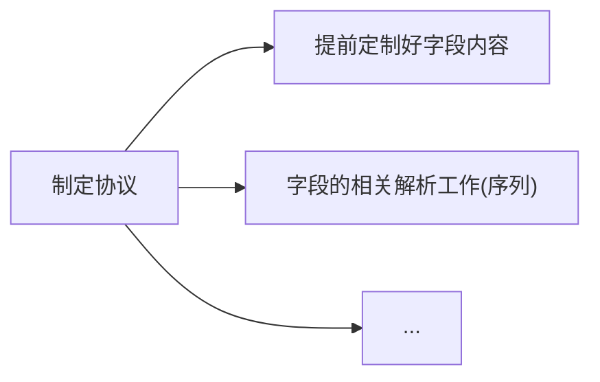

>   前要：程序员在网络程序上编写满足日常需求的网络程序基本都是在应用层编写的（包括我们之前编写的套接字编程）。
>
>   我们来理顺一下关于 `TCP` 通信发送的流程：
>
>   
>
>   一般都是客户端主动访问服务端，而不是服务端主动连接客户端，这种基于客户端的模式简称 `CS` 模型。
>
>   现在的主流网络下可靠传输和不可靠传输已经很难察觉到了。
>   
>    有无连接可以直接在代码中体现出来。
>    
>    `UDP` 读一次必须写一次，`TCP` 等到读取的时候一次性读取。
>   
>   本节我们要站在应用层上重新理解套接字编程。

# 1.协议和 HTTP 协议

`HTTP(Hypertext Transfer Protocol)` 协议实际上就是应用层规定好的其中一种协议。

我们之前读写数据都是按照字符串的方式来发送和接收的，那如果是具有 `结构化的数据` 怎么办呢？

假设我们需要实现一个网络计算器，就需要先规定好两个结构体（其实从这就是制定协议的开始了）：

```cpp
//网络计算器
//服务端发送下面结构的实例化
typedef struct Request {
    int _a;
    int _b;
    char _op;
} Request;
Request reqt = { 10, 20, '+' };

//客户端发送下面结构的实例化
typedef struct Response {
    int _result;
    int _errodCode;
} Response;
Response reqe = { 30, 0 };
```

而更进一步，也可以认为协议定制的时候，需要用到的字段也是协议的一部分。

规定好协议后，如果客户端和服务端规定传输数据的规格直接进行传输确实可以（这也就是为什么读写接口不直接使用类型为 `char*` 的缓冲区而是使用 `void*` 的原因），但是这种做法拓展性很差，很容易失效。

而如果我们先使用结构来定义交互的信息，但按照某个规则转化为字符串，接受数据时把字符串转化为结构体。而这个过程，就是所谓 `序列化(多变一)` 和 `反序列化(一变多)` 的概念。

例如将 `102, 20, '+'` 转化为 `"10 20 +"`，通过网络把字节流直接传输到另外一段，这种做法相当于加了一层软件层，把应用和网络进行解耦。

>   注意：当然，这是一种理想情况。如果制定协议的双方已经明确了各种大小端和对齐规则，很可能真的就直接传递一个结构实例化对象（实际就是直接使用二进制传递），在另一端直接进行解析。但是，这种做法只适合较为底层的协议，这些协议封装的很好，几乎无需担心出错的问题。

协议是一种约定，但是这种表述太抽象，具体到代码中：




我们可以尝试实践一下，让抽象的概念化为具体的代码。

```cpp

```

>   补充：由于 `TCP` 的面向字节流的，读取的时候如何保证 `inbuffer` 读取到的是一个完整的请求呢？万一 `inbuffer` 只传递了一部分的数据怎么办？如果把一部分的数据进行后续的序列化将会得到完全错误甚至崩溃的结果。实际上调用 `recv()/send()` 时，不是直接发送到网络中（更不是直接写到对方主机），而是拷贝读写缓冲区的过程，写端写入（拷贝）缓冲区后，通过网络发送，对端读取（拷贝）缓冲区后。
>
>   因此实际上这些 `IO` 函数（例如 `recv()/send()`）都是拷贝函数。
>
>   而中间网络发送的过程不归应用层来决定的，而是其他层来决定（例如传输控制层里规定的：什么时候发？发多少？出错了怎么办？）。您可以简单认为，所谓的面向字节流的初步理解，就是：发送的次数和接受的次数没有任何关系（取决于操作系统的决策，操作系统认为缓冲区攒够了一定长度就发送出去），我们无法保证每次发送都是一个完整的数据块。
>
>   因此还需要对协议进行进一步的定制，在我们上述的协议中，我们使用一个 `length` 来保证接受方知道数据的长度。
>
>   而使用 `\r\n` 作为特殊符则可以正确区分 `length` 是一个长度信息而不是内容。
>
>   其中就可以把 `length` 理解为协议报头，内容为有效载荷，整体就是一个协议的实例。

>   补充：守护进程的相关概念
>
>   如果您看过我之前的博文，您就会发现我貌似可以避开了关于守护进程的知识，只是因为 `Linux` 系列的文章不涉及网络服务，而一旦设计网络知识，就必须了解守护进程的概念。
>
>   首先我们来理解一些概念：
>
>   -   实际上一个进程除了 `pid、ppid` 还有一个组 `ID`也就是 `PGID`，组长一般是第一个被分配 `pid` 进程（`bash` 自成一组）
>
>   -   进程还有一个 `SID` 叫做会话 `ID`，任何一次登录的用户，需要有多个进程（组）来给该用户提供服务，以及用户自己启动的进程或服务，都属于同一个 `SID`
>
>   -   同时用管道启动多个进程，则这些进程都是兄弟进程，父进程都是 `bash`，可以通过管道来通信
>
>   -   和终端相关联的进程就是前台进程，简单说就是能从终端正常获取输入并且正常输出的进程（`bash` 本身就是一种前台进程），如果一个进程被 `bash` 运行起来后，无法继续和 `bash` 进行交互，则说明前台进程从 `bash` 切换到了该进程
>
>   -   `Windows` 下实际上也有登录和退出登录的概念，那就是“注销”而非“关机”选项，一旦注销
>
>   ```mermaid
>   flowchart TD
>   
>   subgraph "process_group_1"
>       A("bash + terminal")
>   end
>   
>   subgraph "process_group_2"
>       B("process_1")
>       C("process_2")
>       D("process_3")
>   end
>   
>   subgraph "process_group_..."
>   	E("...")
>   end
>   
>   F("session")
>   F --> process_group_1 & process_group_2 & process_group_...
>   ```
>
>   如果用户退出登录了，理论上上述会话内的进程和服务都需要被释放（大部分需要，不同版本的退出处理机制不一样）。
>
>   因此我们必须想办法让一个服务进程在用户退出登录时不会被释放

虽然我们完全可以自己制作协议，但是在应用层早就有更加统一的标准，这个标准协议之一就有 `HTTP` 协议。

# 2.HTTP 协议格式


# HTTP 方法


# HTTP 状态码


# HTTP 服务器


