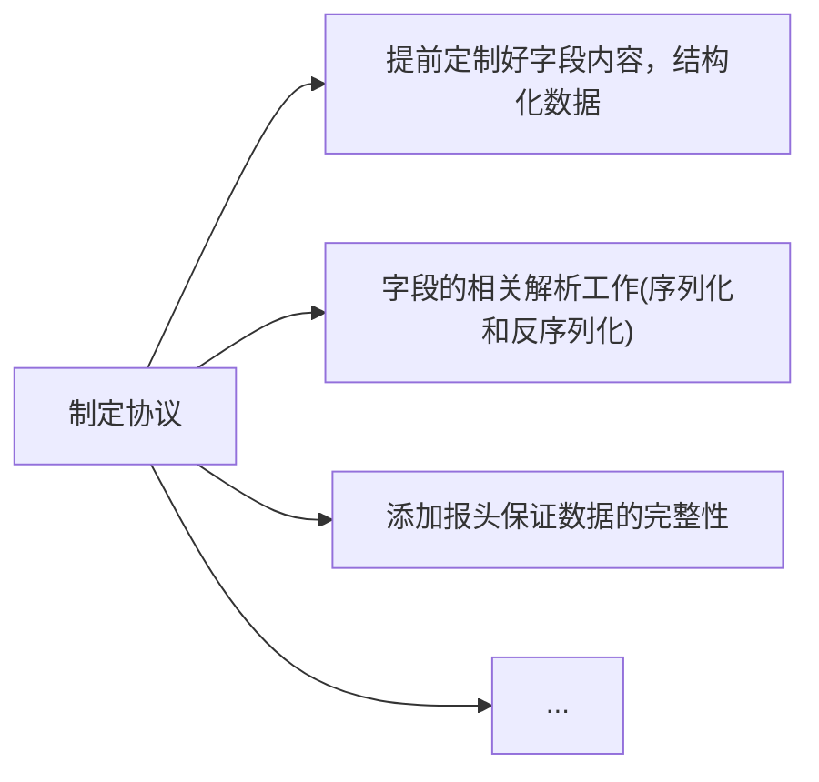

>   前要：程序员在网络程序上编写满足日常需求的网络程序基本都是在应用层编写的（包括我们之前编写的套接字编程）。
>
>   我们来理顺一下关于 `TCP` 通信发送的流程：
>
>   
>
>   一般都是客户端主动访问服务端，而不是服务端主动连接客户端，这种基于客户端的模式简称 `CS` 模型。
>
>   现在的主流网络下可靠传输和不可靠传输已经很难察觉到了。
>   
>    有无连接可以直接在代码中体现出来。
>    
>    `UDP` 读一次必须写一次，`TCP` 等到读取的时候一次性读取。
>   
>   本节我们要站在应用层上重新理解套接字编程。

# 1.协议和 HTTP 协议

`HTTP(Hypertext Transfer Protocol)` 协议实际上就是应用层规定好的其中一种协议。

我们之前读写数据都是按照字符串的方式来发送和接收的，那如果是具有 `结构化的数据` 怎么办呢？

假设我们需要实现一个网络计算器，就需要先规定好两个结构体（其实从这就是制定协议的开始了）：

```cpp
//网络计算器
//服务端发送下面结构的实例化
typedef struct Request {
    int _a;
    int _b;
    char _op;
} Request;
Request reqt = { 10, 20, '+' };

//客户端发送下面结构的实例化
typedef struct Response {
    int _result;
    int _errodCode;
} Response;
Response reqe = { 30, 0 };
```

而更进一步，也可以认为协议定制的时候，需要用到的字段也是协议的一部分。

规定好协议后，如果客户端和服务端规定传输数据的规格直接进行传输确实可以（这也就是为什么读写接口不直接使用类型为 `char*` 的缓冲区而是使用 `void*` 的原因），但是这种做法拓展性很差，很容易失效。

而如果我们先使用结构来定义交互的信息，但按照某个规则转化为字符串，接受数据时把字符串转化为结构体。而这个过程，就是所谓 `序列化(多变一)` 和 `反序列化(一变多)` 的概念。

例如将 `102, 20, '+'` 转化为 `"10 20 +"`，通过网络把字节流直接传输到另外一段，这种做法相当于加了一层软件层，把应用和网络进行解耦。

>   注意：当然，这是一种理想情况。如果制定协议的双方已经明确了各种大小端和对齐规则，很可能真的就直接传递一个结构实例化对象（实际就是直接使用二进制传递），在另一端直接进行解析。但是，这种做法只适合较为底层的协议，这些协议封装的很好，几乎无需担心出错的问题。

还有一种可能，由于 `TCP` 传输的过程是基于字节流的，无法保证传输数据时的完整性（有可能多条数据混杂为一条数据，也有可能数据发送到一半还有部分未发送），因此我们也需要解决这个问题。

协议是一种约定，但是这种表述太抽象，具体到代码中就需要做到：



我们可以尝试实践一下，让抽象的概念化为具体的代码。

## 1.1.自定义协议，自定义序列化

```makefile
# makefile(自定义协议，并且自定义序列化)
.PHONY:all
all:cal_client cal_server

cal_client:cal_client.cpp
	g++ -o $@ $^ -std=c++11 -lpthread

cal_server:cal_server.cpp
	g++ -o $@ $^ -std=c++11 -lpthread

.PHONY:clean
clean:
	rm -rf cal_client cal_server log_dir
```

```cpp
//log.hpp(自定义协议，并且自定义序列化)

/* 文件描述
Log log = Log(bool debugShow = true,    //选择是否显示 DEBUG 等级的日志消息
    std::string writeMode = "SCREEN",   //选择日志的打印方式
    std::string logFileName = "log"     //选择日志的文件名称
);
log.WriteModeEnable();      //中途可以修改日志的打印方式
log.LogMessage(DEBUG | NORMAL | WARNING | ERROR | FATAL, "%s %d", __FILE__, __LINE__));     //打印日志
*/

#pragma once
#include <iostream>
#include <string>
#include <fstream>
#include <cstdio>
#include <cstdarg>
#include <ctime>
#include <pthread.h>
#include <unistd.h>
#include <sys/stat.h>
#include <sys/types.h>

//日志级别
#define DEBUG 0 //调试
#define NORMAL 1 //正常（或者叫 INFO）
#define WARNING 2 //警告
#define ERROR 3 //错误
#define FATAL 4 //致命

enum WriteMode
{
    SCREEN = 5,
    ONE_FILE,
    CLASS_FILE
};

const char* gLevelMap[] = {
    "DEBUG", //debug 模式
    "NORMAL", //正常（或者叫 INFO）
    "WARNING", //警告
    "ERROR", //非致命错误
    "FATAL" //严重错误
};

const std::string logdir = "log_dir";

//日志功能主要有：日志等级、发送时间、日志内容、代码行数、运行用户
class Log
{
private:
    void __WriteLogToOneFile(std::string logFileName, const std::string& message)
    {
        std::ofstream out(logFileName, std::ios::app);
        if (!out.is_open())
            return;
        out << message;
        out.close();
    }
    void __WriteLogToClassFile(const int& level, const std::string& message)
    {
        std::string logFileName = "./";
        logFileName += logdir;
        logFileName += "/";
        logFileName += _logFileName;
        logFileName += "_";
        logFileName += gLevelMap[level];

        __WriteLogToOneFile(logFileName, message);
    }
    void _WriteLog(const int& level, const std::string& message)
    {
        switch (_writeMode)
        {
        case SCREEN: //向屏幕输出
            std::cout << message;
            break;
        case ONE_FILE: //向单个日志文件输出
            __WriteLogToOneFile("./" + logdir + "/" + _logFileName, message);
            break;
        case CLASS_FILE: //向多个日志文件输出
            __WriteLogToClassFile(level, message);
            break;
        default:
            std::cout << "write mode error!!!" << std::endl;
            break;
        }
    }

public:
    //构造函数，debugShow 为是否显示 debug 消息，writeMode 为日志打印模式，logFileName 为日志文件名
    Log(bool debugShow = true, const WriteMode& writeMode = ONE_FILE, std::string logFileName = "log")
        : _debugShow(debugShow), _writeMode(writeMode), _logFileName(logFileName)
    {
        mkdir(logdir.c_str(), 0775); //创建目录
    }

    //调整日志打印方式
    void WriteModeEnable(const WriteMode& mode)
    {
        _writeMode = mode;
    }

    //拼接日志消息并且输出
    void LogMessage(const int& level, const char* format, ...)
    {
        //1.若不是 debug 模式，且 level == DEBUG 则不做任何事情
        if (_debugShow == false && level == DEBUG)
            return;

        //2.收集日志标准部分信息
        char stdBuffer[1024];
        time_t timestamp = time(nullptr); //获得时间戳
        struct tm* local_time = localtime(&timestamp); //将时间戳转换为本地时间

        snprintf(stdBuffer, sizeof stdBuffer, "[%s][pid:%s][%d-%d-%d %d:%d:%d]",
            gLevelMap[level],
            std::to_string(getpid()).c_str(),
            local_time->tm_year + 1900, local_time->tm_mon + 1, local_time->tm_mday,
            local_time->tm_hour, local_time->tm_min, local_time->tm_sec
        );

        //3.收集日志自定义部分信息
        char logBuffer[1024];
        va_list args; //声明可变参数列表，实际时一个 char* 类型
        va_start(args, format); //初始化可变参数列表
        vsnprintf(logBuffer, sizeof logBuffer, format, args); //int vsnprintf(char *str, size_t size, const char *format, va_list ap); 是一个可变参数函数，将格式化后的字符串输出到缓冲区中。类似带 v 开头的可变参数函数有很多
        va_end(args); //清理可变参数列表，类似 close() 和 delete

        //4.拼接为一个完整的消息
        std::string message;
        message += "--> 标准日志:"; message += stdBuffer;
        message += "\t 用户日志:"; message += logBuffer;
        message += "\n";

        //5.打印日志消息
        _WriteLog(level, message);
    }
    
private:
    bool _debugShow;
    WriteMode _writeMode;
    std::string _logFileName;
};

```

```cpp
//sock.hpp(自定义协议，并且自定义序列化)

/* 文件描述
主要是对套接字编程的常见接口做封装，是一个关于套接字的工具包
*/

#pragma once
#include <memory>
#include <cstring>
#include <sys/types.h>
#include <sys/socket.h>
#include <netinet/in.h>
#include <arpa/inet.h>
#include "log.hpp"

class ThreadData
{
public:
    int _sock;
    std::string _ip;
    uint16_t _port;
};

class Sock
{
private:
    const static int g_backlog = 20; //一般不会太大，也不会太小

public:
    //空的构造函数
    Sock() {}

    //创建监听套接字
    int _Socket()
    {
        int listenSock = socket(AF_INET, SOCK_STREAM, 0);
        if (listenSock < 0)
        {
            _log.LogMessage(FATAL, "socket() error %s %d", __FILE__, __LINE__);
            exit(1);
        }
        _log.LogMessage(NORMAL, "socket() success %s %d", __FILE__, __LINE__);
        return listenSock;
    }

    //绑定监听套接字
    void _Bind(int listenSock, uint16_t port, std::string ip = "0.0.0.0")
    {
        struct sockaddr_in local;
        memset(&local, 0, sizeof local);
        local.sin_family = AF_INET;
        local.sin_port = htons(port);
        inet_pton(AF_INET, ip.c_str(), &local.sin_addr);

        if (bind(listenSock, (struct sockaddr*)&local, sizeof(local)) < 0)
        {
            _log.LogMessage(FATAL, "bind() error %s %d", __FILE__, __LINE__);
            exit(2);
        }
        _log.LogMessage(NORMAL, "bind() success %s %d", __FILE__, __LINE__);
    }

    //置套接字监听状态
    void _Listen(int listenSock)
    {
        if (listen(listenSock, g_backlog) < 0)
        {
            _log.LogMessage(FATAL, "listen() error %s %d", __FILE__, __LINE__);
            exit(3);
        }
        _log.LogMessage(NORMAL, "listen() success %s %d", __FILE__, __LINE__);
    }

    //服务端等待连接后，返回服务套接字（参数还带有服务端的信息）
    int _Accept(int listenSock, std::string* ip, uint16_t* port)
    {
        struct sockaddr_in src;
        socklen_t len = sizeof(src);

        int serviceSock = accept(listenSock, (struct sockaddr*)&src, &len);
        if (serviceSock < 0)
        {
            _log.LogMessage(FATAL, "accept() error %s %d", __FILE__, __LINE__);
            return -1;
        }
        _log.LogMessage(NORMAL, "accept() success %s %d", __FILE__, __LINE__);

        *port = ntohs(src.sin_port);
        *ip = inet_ntoa(src.sin_addr);

        return serviceSock;
    }

    //客户端主动连接服务端
    bool _Connect(int sock, const std::string& server_ip, const uint16_t& server_port)
    {
        struct sockaddr_in server;
        memset(&server, 0, sizeof(server));
        server.sin_family = AF_INET;
        server.sin_port = htons(server_port);
        server.sin_addr.s_addr = inet_addr(server_ip.c_str());

        if (connect(sock, (struct sockaddr*)&server, sizeof(server)) == 0)
        {
            _log.LogMessage(NORMAL, "accept() success %s %d", __FILE__, __LINE__);
            return true;
        }

        _log.LogMessage(FATAL, "connect() error %s %d", __FILE__, __LINE__);
        return false;
    }

private:
    Log _log;
};
```

```cpp
//tcp_server.hpp(自定义协议，并且自定义序列化)

/* 文件描述
主要是对 sock.hpp 的使用，构建一个可用的 TCP 服务端
*/

#pragma once
#include <functional>
#include <vector>
#include <pthread.h>
#include "sock.hpp"
#include "log.hpp"

class TcpServer
{
private:
    class ThreadData
    {
    public:
        ThreadData(int serviceSock, TcpServer* server) : _serviceSock(serviceSock), _server(server) {}
        ~ThreadData() {}

    public:
        int _serviceSock;
        TcpServer* _server;
    };

    using func_t = std::function<void(int)>;

private:
    void __Excute(int serviceSock)
    {
        for (auto& func : _funcs)
        {
            func(serviceSock); //执行任务列表中的所有任务
        }
    }

    static void* _ThreadRoutine(void* args)
    {
        pthread_detach(pthread_self()); //线程分离
        ThreadData* td = static_cast<ThreadData*>(args); //解包参数
        td->_server->__Excute(td->_serviceSock); //执行所有绑定的方法
        close(td->_serviceSock);
        delete td;
        return nullptr;
    }

public:
    //利用套接字工具包初始化套接字
    TcpServer(const uint16_t& port, const std::string& ip = "0.0.0.0")
    {
        _listensock = _sock._Socket();
        _sock._Bind(_listensock, port, ip);
        _sock._Listen(_listensock);
    }

    //给服务器绑定的一些 void(int) 类型的服务（PS：请在服务器启动之前绑定，该方法没有保证线程安全）
    void BindService(func_t func)
    {
        _funcs.push_back(func);
    }

    //启动 tcp 服务器
    void Start()
    {
        while(true) //不断获取新的服务套接字
        {
            std::string client_ip;
            uint16_t client_port;
            int serviceSock = _sock._Accept(_listensock, &client_ip, &client_port);
            if (serviceSock == -1)
            {
                continue;
            }
            else
            {
                _log.LogMessage(NORMAL, "creat new link success, sock %d, %s %d", serviceSock, __FILE__, __LINE__);

                //创建子线程，让子线程完成任务，一个线程分配一个服务套接字做服务
                pthread_t tid;
                ThreadData* td = new ThreadData(serviceSock, this);
                pthread_create(&tid, nullptr, _ThreadRoutine, td); //注意子线程内部做了线程分离，也自己做了 td 制作的释放
            }
        }
    }

    ~TcpServer()
    {
        if (_listensock >= 0)
            close(_listensock);
    }

private:
    Sock _sock; //套接字工具包
    int _listensock; //监听套接字
    std::vector<func_t> _funcs; //任务列表
    Log _log; //日志对象
};
```

```cpp
//protocol.hpp(自定义协议，并且自定义序列化)

/* 文件描述
主要是对协议的定制，该协议是自定义的，是对协议的模拟
其中约定就体现在：
(1) 结构化的数据
(2) 序列和反序列化的解析顺序
(3) 运算结果的状态码
(4) 报头的封装规定
*/

#pragma once
#include <iostream>
#include <string>
#include <cstring>
#include <sys/types.h>
#include <sys/socket.h>
#include "log.hpp"

#define SPACE " "
#define SPACE_LEN strlen(SPACE) //这么做是为了可拓展
#define SEP "\r\n"
#define SEP_LEN strlen(SEP) //这么做是为了可拓展

//请求中有效载荷的“序列化”和“反序列化”（客户端序列化请求，服务端反序列化请求）
class Request
{
public:
    Request() {}
    Request(int x, int y, char op) : _x(x), _y(y), _op(op) {}

    //序列化为 "_x _op _y"
    std::string Serialize()
    {
        std::string str;
        str += std::to_string(_x);
        str += SPACE;
        str += _op;
        str += SPACE;
        str += std::to_string(_y);
        return str;
    }
    //反序列化为 { int _x; int _y; char _op; }
    bool Deserialize(const std::string& str)
    {
        std::size_t left = str.find(SPACE);
        if (left == std::string::npos)
            return false;

        std::size_t right = str.rfind(SPACE);
        if (right == std::string::npos)
            return false;

        _x = atoi(str.substr(0, left).c_str());
        _op = str[left + SPACE_LEN];
        _y = atoi(str.substr(right + SPACE_LEN).c_str());

        return true;
    }

public:
    int _x; //操作数
    int _y; //操作数
    char _op; //操作符
};

//响应中有效载荷的“序列化”和“反序列化”（服务端序列化响应，客户端反序列化请求）
class Response
{
public:
    Response() {}
    Response(int result, int code) : _result(result), _code(code) {}

    //序列化为 "_code _result"
    std::string Serialize()
    {
        std::string str;
        str += std::to_string(_code);
        str += SPACE;
        str += std::to_string(_result);
        return str;
    }
    //反序列化为 { int _result; int _code; }
    bool Deserialize(const std::string& str)
    {
        std::size_t pos = str.find(SPACE);
        if (pos == std::string::npos)
            return false;

        _code = atoi(str.substr(0, pos).c_str());
        _result = atoi(str.substr(pos + SPACE_LEN).c_str());
        return true;
    }

public:
    int _result; //计算结果
    int _code; //计算状态码
};


//读取数据报
bool Recv(int sock, std::string* out)
{
    Log log;

    char buffer[1024] = { 0 };
    ssize_t str = recv(sock, buffer, sizeof(buffer) - 1, 0);
    if (str > 0)
    {
        *out += buffer;
        return true;
    }
    else if (str == 0) //对端关闭了
    {
        log.LogMessage(WARNING, "clienr quit... %s %d", __FILE__, __LINE__);
        return false;
    }
    else
    {
        log.LogMessage(FATAL, "recv() error %s %d", __FILE__, __LINE__);
        return false;
    }
}

//发送数据报
void Send(int sock, const std::string str)
{
    send(sock, str.c_str(), str.size(), 0);
}


//提取完整有效载荷
std::string Decode(std::string& buffer)
{
    //length\r\n123 + 456\r\n

    //长度信息还没有读取完毕，返回空串继续读取，直到下次一次能遇到 '\r\n' 标识符
    std::size_t pos = buffer.find(SEP);
    if (pos == std::string::npos)
    {
        return "";
    }

    //走到这里说明一定可以获取到长度，若剩余的大小 surplus >= 报头的长度 length，说明足够返回至少一个完整数据报
    int length = atoi(buffer.substr(0, pos).c_str());
    int surplus = buffer.size() - pos - SEP_LEN - SEP_LEN; //除去标志符后剩余的字符长度
    if (surplus < length) //虽然获取到了长度信息，但是数据还不够凑成一个完整的数据报
    {
        return "";
    }
    else //surplus >= 报头的长度 length，则说明至少存在一个完整的数据报，可以进行提取并且返回
    {
        buffer.erase(0, pos + SEP_LEN); //移走前面的长度信息和标识符（虽然暴力，不过我们的重点不在效率）
        std::string data = buffer.substr(0, length); //拷贝需要的有效载荷信息
        buffer.erase(0, length + SEP_LEN); //移走已经被拷贝的数据和后面的标识符
        return data;
    }
    
}

//添加报头和标志符
std::string Encode(const std::string& str)
{
    std::string length = std::to_string(str.size());
    std::string new_package = length;
    new_package += SEP; //这个 SEP 标识符是为了分割长度信息和有效载荷，区别两者
    new_package += str;
    new_package += SEP; //这个 SEP 标识符更多是为了打印时方便一点
    return new_package;
}
```

```cpp
//daemon.hpp(自定义协议，并且自定义序列化)
#pragma once
#include <iostream>
#include <unistd.h>
#include <signal.h>
#include <signal.h>
#include <sys/types.h>
#include <sys/stat.h>
#include <fcntl.h>

//调用下述函数时，就会
void MyDaemon()
{
    //1.忽略信号，避免服务端因为某些原因挂掉
    signal(SIGPIPE, SIG_IGN); //防止运行过程中出现非法写入的问题（例如服务端写到一半时，客户端因为异常而被关闭），避免因为客户端出现问题，导致服务端跟着挂掉
    signal(SIGCHLD, SIG_IGN); //不向父进程提醒，因此不回收子进程

    //2.避免自己成为组长
    if (fork() > 0)
    {
        exit(0); //父进程直接正常终止
    }

    //下面是子进程的部分

    //3.调用 setsid()
    setsid(); //成为新的会话

    //4.标准输出、标准输入、标准错误的重定向（尤其是不能在屏幕上进行日志打印，一旦打印就有可能暂停和中止）
    int devNnll = open("/dev/null", O_RDONLY | O_WRONLY); //在 Linux 中基本都有 /dev/null，其特点就是写入任何数据都会清空，也无法读取任何数据（文件黑洞）
    if (devNnll > 0)
    {
        dup2(devNnll, 0); //oldfd 复制-> newfd
        dup2(devNnll, 1);
        dup2(devNnll, 2);
        close(devNnll);
    }
}
```

```cpp
//cal_server.cpp(自定义协议，并且自定义序列化)
#include <signal.h>
#include <cstdio>
#include "tcp_server.hpp"
#include "protocol.hpp"
#include "daemon.hpp"

//使用手册
static void Usage(std::string proc)
{
    std::cout << "\nUsage: " << proc << " [ip] [port]\n" << std::endl;
}

//线程的调用方法
static Response _CalculatorHelp(const Request& req)
{
    Response resp(0, 0);
    switch (req._op)
    {
    case '+':
        resp._result = req._x + req._y;
        break;

    case '-':
        resp._result = req._x - req._y;
        break;

    case '*':
        resp._result = req._x * req._y;
        break;

    case '/':
        if (req._y == 0)
            resp._code = 1;
        else
            resp._result = req._x / req._y;
        break;

    case '%':
        if (req._y == 0)
            resp._code = 2;
        else
            resp._result = req._x % req._y;
        break;

    default:
        resp._code = 3;
        break;
    }

    return resp;
}
void Calculator(int sock)
{
    std::string inbuffer;
    while (true)
    {
        //1.读取从客户端发送的、序列化后的请求
        bool result = Recv(sock, &inbuffer);
        if (!result) //通过这里的 if 语句也只能证明读取成功，不能保证数据的完整性
            break;

        std::cout << "inbuffer:" << inbuffer << std::endl; //[debug]

        //2.保证得到完整的响应数据
        std::string package = Decode(inbuffer); //(1)返回空的时候说明内部没有有效数据或者报文不完整
        if (package.empty())
        {
            continue; //继续循环读取，直到 package 不为空
        }
        else //(2)否者就是可以使用的，已经有完整的数据报了
        {
            std::cout << "Decode:inbuffer:" << inbuffer << std::endl; //[[debug]]
            std::cout << "package:" << package << std::endl; //[debug]

            //3.反序列化请求，拿数据去计算后返回给请求结构体对象
            Request req;
            req.Deserialize(package); 
            Response resp;
            resp = _CalculatorHelp(req); //将反序列化的结果拿去计算

            //4.序列化响应，并且加上报头发送给客户端
            std::string respString = resp.Serialize(); //把响应结果序列化
            std::cout << "respString:" << respString << std::endl; //[debug]

            respString = Encode(respString);
            std::cout << "Encode:respString:" << respString << std::endl; //[debug]

            Send(sock, respString); //写回响应结果
            //TODU：但是这个发送也有一些问题，这里暂时不提，后续讲多路转接的时候再来修改
        }
    }
}

int main(int argc, char* argv[]) //使用 ./cal_server 8080 来启动服务端
{
    if (argc != 2)
    {
        Usage(argv[0]);       
        exit(4);
    }

    MyDaemon(); //调用后，父进程的部分退出，内部创建的子进程变成守护进程，后续可以使用 ps -axj | grep cal_server 来查看（可以观察到 PPID:1 ，这说明守护进程就是一种孤儿进程）
    printf("dimou");
    //以下步骤都开始由子进程进行操作，注意日志消息需要写入到文件中，而不能直接输出（为方便修改，我直接把之前写的日志类构造函数中的 writeMode 默认为 ONE_FILE），并且需要把所有的标准 IO 输出都会被重定向到 /dev/null 中
    std::unique_ptr<TcpServer> server(new TcpServer(atoi(argv[1])));
    server->BindService(Calculator); //在任务列表中绑定一些任务
    server->Start(); //启动服务器

    return 0;
}
```

```cpp
//cal_client.cpp(自定义协议，并且自定义序列化)
#include <iostream>
#include <string>
#include <unistd.h>
#include "log.hpp"
#include "sock.hpp"
#include "protocol.hpp"

//使用手册
static void Usage(std::string proc)
{
    std::cout << "\nUsage: " << proc << " [ip] [port]\n" << std::endl;
}

int main(int argc, char const* argv[])
{
    if (argc != 3)
    {
        Usage(argv[0]);
        exit(5);
    }

    Log log = Log();
    Sock sock; //套接字工具包
    
    std::string server_ip = argv[1];
    uint16_t server_port = atoi(argv[2]);
    int sockfd = sock._Socket();
    sock._Connect(sockfd, server_ip, server_port); //连接服务端

    bool quit = false;
    while (!quit)
    {
        //1.获取需求
        std::cout << "Please Enter x, y, op: ";
        int x = 0;
        int y = 0;
        char op = 0;
        std::cin >> x >> y >> op;

        //2.制作请求并且进行序列化
        Request req(x, y, op);
        std::string result = req.Serialize();

        //3.添加报头和标志位再发送请求
        result = Encode(result);
        Send(sockfd, result);

        //4.读取响应并做处理
        while (true)
        {
            std::string buffer;
            bool res = Recv(sockfd, &buffer);
            if (!res) //通过这个 if 语句只能说明读取没有出错
            {
                quit = true;
                break;
            }

            std::string package = Decode(buffer); //尝试获取完整的数据包
            if (package.empty())
            {
                continue; //继续读取，直到读取到一个完整的数据包
            }

            //5.把完整的响应做反序列化
            Response resp;
            resp.Deserialize(package);

            //6.检测结果是否出现异常
            std::string err;
            switch (resp._code)
            {
            case 0:
                //让 err 继续保持空即可
                break;
            case 1:
                err = "/0 error";
                break;
            case 2:
                err = "%0 error";
                break;
            case 3:
                err = "other error";
                break;
            default:
                break;
            }

            if (err.empty()) //为空
            {
                std::cout << "code: " << resp._code << " - result:" << resp._result << '\n';
            }
            else
            {
                std::cerr << err << std::endl;
            }

            break;
        }
    }

    close(sockfd); //客户端结束后最好还是关闭套接字标识符
    return 0;
}

```

>   补充：由于 `TCP` 的面向字节流的，读取的时候如何保证 `inbuffer` 读取到的是一个完整的请求呢？万一 `inbuffer` 只传递了一部分的数据怎么办？如果把一部分的数据进行后续的序列化将会得到完全错误甚至崩溃的结果。实际上调用 `recv()/send()` 时，不是直接发送到网络中（更不是直接写到对方主机），而是拷贝读写缓冲区的过程，写端写入（拷贝）缓冲区后，通过网络发送，对端读取（拷贝）缓冲区后。
>
>   因此实际上这些 `IO` 函数（例如 `recv()/send()`）都是拷贝函数。
>
>   而中间网络发送的过程不归应用层来决定的，而是其他层来决定（例如传输控制层里规定的：什么时候发？发多少？出错了怎么办？）。您可以简单认为，所谓的面向字节流的初步理解，就是：发送的次数和接受的次数没有任何关系（取决于操作系统的决策，操作系统认为缓冲区攒够了一定长度就发送出去），我们无法保证每次发送都是一个完整的数据块。
>
>   因此还需要对协议进行进一步的定制，在我们上述的协议中，我们使用一个 `length` 来保证接受方知道数据的长度。
>
>   而使用 `\r\n` 作为特殊符则可以正确区分 `length` 是一个长度信息而不是内容。
>
>   其中就可以把 `length` 理解为协议报头，内容为有效载荷，整体就是一个协议的实例。

## 1.2.自定义协议，使用 JSON 序列化

可以使用 `JSON` 来帮助我们进行序列化和反序列化的工作，可以使用 `sudo yum install jsoncpp-devel` 下载关于 `JSON` 的第三方库。

>   注意：由于是第三方库，使用 `gcc` 时需要带上参数。

```makefile
# makefile(自定义协议，改为 JSON 序列化)
.PHONY:all
all:cal_client cal_server

cal_client:cal_client.cpp
	g++ -o $@ $^ -std=c++11 -lpthread -ljsoncpp

cal_server:cal_server.cpp
	g++ -o $@ $^ -std=c++11 -lpthread -ljsoncpp

.PHONY:clean
clean:
	rm -rf cal_client cal_server log_dir
```

```cpp
//protocol.hpp(自定义协议，改为 JSON 序列化)

/* 文件描述
主要是对协议的定制，该协议是自定义的，是对协议的模拟
其中约定就体现在：
(1) 结构化的数据
(2) 序列和反序列化的解析顺序
(3) 运算结果的状态码
(4) 报头的封装规定
*/

#pragma once
#include <iostream>
#include <string>
#include <cstring>
#include <sys/types.h>
#include <sys/socket.h>
#include <jsoncpp/json/json.h>
#include "log.hpp"

#define SPACE " "
#define SPACE_LEN strlen(SPACE) //这么做是为了可拓展
#define SEP "\r\n"
#define SEP_LEN strlen(SEP) //这么做是为了可拓展

//请求中有效载荷的“序列化”和“反序列化”（客户端序列化请求，服务端反序列化请求）
class Request
{
public:
    Request() {}
    Request(int x, int y, char op) : _x(x), _y(y), _op(op) {}

    //序列化为 JSON 字符串
    std::string Serialize()
    {
        Json::Value root;
        root["x"] = _x;
        root["y"] = _y;
        root["op"] = _op;
        Json::FastWriter fwriter;
        return fwriter.write(root);
    }
    //反序列化为 JSON 数据
    bool Deserialize(const std::string& str)
    {
        Json::Value root;
        Json::Reader reader;
        reader.parse(str, root); //第二个是输出型参数
        _x = root["x"].asInt();
        _y = root["y"].asInt();
        _op = root["op"].asInt();
    }

public:
    int _x; //操作数
    int _y; //操作数
    char _op; //操作符
};

//响应中有效载荷的“序列化”和“反序列化”（服务端序列化响应，客户端反序列化请求）
class Response
{
public:
    Response() {}
    Response(int result, int code) : _result(result), _code(code) {}

    //序列化为 JSON 字符串
    std::string Serialize()
    {
        Json::Value root;
        root["result"] = _result;
        root["code"] = _code;
        Json::FastWriter fwriter;
        return fwriter.write(root);
    }

    //反序列化为 JSON 数据
    bool Deserialize(const std::string& str)
    {
        Json::Value root;
        Json::Reader reader;
        reader.parse(str, root); //第二个是输出型参数
        _result = root["result"].asInt();
        _code = root["code"].asInt();
        return true;
    }

public:
    int _result; //计算结果
    int _code; //计算状态码
};


//读取数据报
bool Recv(int sock, std::string* out)
{
    Log log;

    char buffer[1024] = { 0 };
    ssize_t str = recv(sock, buffer, sizeof(buffer) - 1, 0);
    if (str > 0)
    {
        *out += buffer;
        return true;
    }
    else if (str == 0) //对端关闭了
    {
        log.LogMessage(WARNING, "clienr quit... %s %d", __FILE__, __LINE__);
        return false;
    }
    else
    {
        log.LogMessage(FATAL, "recv() error %s %d", __FILE__, __LINE__);
        return false;
    }
}

//发送数据报
void Send(int sock, const std::string str)
{
    send(sock, str.c_str(), str.size(), 0);
}


//提取完整有效载荷
std::string Decode(std::string& buffer)
{
    //length\r\n123 + 456\r\n

    //长度信息还没有读取完毕，返回空串继续读取，直到下次一次能遇到 '\r\n' 标识符
    std::size_t pos = buffer.find(SEP);
    if (pos == std::string::npos)
    {
        return "";
    }

    //走到这里说明一定可以获取到长度，若剩余的大小 surplus >= 报头的长度 length，说明足够返回至少一个完整数据报
    int length = atoi(buffer.substr(0, pos).c_str());
    int surplus = buffer.size() - pos - SEP_LEN - SEP_LEN; //除去标志符后剩余的字符长度
    if (surplus < length) //虽然获取到了长度信息，但是数据还不够凑成一个完整的数据报
    {
        return "";
    }
    else //surplus >= 报头的长度 length，则说明至少存在一个完整的数据报，可以进行提取并且返回
    {
        buffer.erase(0, pos + SEP_LEN); //移走前面的长度信息和标识符（虽然暴力，不过我们的重点不在效率）
        std::string data = buffer.substr(0, length); //拷贝需要的有效载荷信息
        buffer.erase(0, length + SEP_LEN); //移走已经被拷贝的数据和后面的标识符
        return data;
    }
    
}

//添加报头和标志符
std::string Encode(const std::string& str)
{
    std::string length = std::to_string(str.size());
    std::string new_package = length;
    new_package += SEP; //这个 SEP 标识符是为了分割长度信息和有效载荷，区别两者
    new_package += str;
    new_package += SEP; //这个 SEP 标识符更多是为了打印时方便一点
    return new_package;
}
```

而其他的代码不变即可，归功于我们的隔离，我们可以轻易修改序列化的方案

虽然我们完全可以自己继续完善我们自定义的协议，但是在应用层早就有更加统一的标准，这个标准协议之一就是 `HTTP` 协议。

# 2.HTTP 协议格式

所谓应用层，大部分的工作都是和文本处理有关，基本都是在进行协议解析，如果我们学习 `HTTP` 就意味着一点有很多的文本分析和协议处理。

## 2.1.统一资源定位符 URI

我们先来认识 `URI` 的结构和相关概念。


上述示例图就可以帮助您理解 `协议、域名(可以等价理解为IP地址)、端口、路径和文件、参数、锚` 等概念。

其中域名可以被解析，最终变成 `IP` 地址，这个工作由浏览器完成。还可以被继续细分为 `登录信息@服务器地址`

而服务端开发的端口号一般对于所有客户端程序都是知道，因此很多情况下都可以默认不写。

而文件和路径不是一定在根目录开始的。

而后面的参数和锚就可以向服务器传递参数或者对网页中的内容进行定位。

如果 `URI` 中涉及到保留的特殊字符，则需要写成对于的特殊字符代码，服务器收到时再进行返回（将字符的编码转为 `16` 进制，从左到右取 `4` 位（不足按 `4` 位处理），每两位做一位，前面加上 `%`，编码为 `%XY` 格式，这里给出一些在线工具）。

只要设置的好，就可以使用浏览器来进一步访问一个服务器上的资源（例如 `.html` 文件，也就是一个网站页面文件），因此资源在没有被获取之前，一定都在服务器上，或者必须通过服务器来申请（而对于 `Linux` 来说，这些资源也可以理解为文件，服务端进程先把资源加载到自己的上下文中，在通过一系列的套接字编程发送给客户端进程中）。

因此 `URI` 也就叫 **统一资源定位符**，而通过这种方式找到资源的网络，就被称为 **万维网**。

>   补充：关于 `URI` 更加详细的知识可以看 [MDN 的文章](https://developer.mozilla.org/zh-CN/docs/Web/HTTP/Basics_of_HTTP/Identifying_resources_on_the_Web)。

## 3.HTTP 结构

而 `http` 协议是应用层的协议，底层采用 `TCP` 通信，在通信之前就以及做好三次握手和四次挥手。

## 3.1.请求报文格式

`http` 协议是基于行的文本协议，可以把整个请求文本看作如下结构：

| 行       | 内容                                                         |
| -------- | ------------------------------------------------------------ |
| 请求行   | `请求方法` `请求uri` `请求协议版本\r\n`                      |
| 请求报头 | 多个 `"key": value\r\n` 行构成（内部还可能包含本次请求的属性，期望接受的编码格式、客户端信息、长链接还是短链接、正文长度...） |
| 空行     | `\r\n`                                                       |
| 请求正文 | 可以省略，之后提及                                           |

我们还可以把这个结构看作线性结构，将所有行拼接为一行来看。

## 3.2.响应报文格式

| 行       | 内容                                               |
| -------- | -------------------------------------------------- |
| 状态行   | `请求协议版本` `状态码` `状态码描述\r\n`           |
| 响应报头 | 多个 `"key": value\r\n` 行构成                     |
| 空行     | `\r\n`                                             |
| 响应正文 | 可以省略，之后提及（也就是平时在网页上看到的资源） |

我们也可以把这个结构看作线性结构，将所有行拼接为一行来看。

使用 `\r\n` 就可以区分报头和报文，报文长度就在报头的属性中。

# 3.HTTP 方法

而在使用关于 `http` 的系统调用之前，我们先来查看一下 `http` 的报头信息我们是否能够接受得到。

```makefile
# makefile
http_server:http_server.cpp
	g++ -o $@ $^ -std=c++11 -lpthread -ljsoncpp

.PHONY:clean
clean:
	rm -rf http_server
```

```cpp
//log.hpp

/* 文件描述
Log log = Log(bool debugShow = true,    //选择是否显示 DEBUG 等级的日志消息
    std::string writeMode = "SCREEN",   //选择日志的打印方式
    std::string logFileName = "log"     //选择日志的文件名称
);
log.WriteModeEnable();      //中途可以修改日志的打印方式
log.LogMessage(DEBUG | NORMAL | WARNING | ERROR | FATAL, "%s %d", __FILE__, __LINE__));     //打印日志
*/

#pragma once
#include <iostream>
#include <string>
#include <fstream>
#include <cstdio>
#include <cstdarg>
#include <ctime>
#include <pthread.h>
#include <unistd.h>
#include <sys/stat.h>
#include <sys/types.h>

//日志级别
#define DEBUG 0 //调试
#define NORMAL 1 //正常（或者叫 INFO）
#define WARNING 2 //警告
#define ERROR 3 //错误
#define FATAL 4 //致命

enum WriteMode
{
    SCREEN = 5,
    ONE_FILE,
    CLASS_FILE
};

const char* gLevelMap[] = {
    "DEBUG", //debug 模式
    "NORMAL", //正常（或者叫 INFO）
    "WARNING", //警告
    "ERROR", //非致命错误
    "FATAL" //严重错误
};

const std::string logdir = "log_dir";

//日志功能主要有：日志等级、发送时间、日志内容、代码行数、运行用户
class Log
{
private:
    void __WriteLogToOneFile(std::string logFileName, const std::string& message)
    {
        std::ofstream out(logFileName, std::ios::app);
        if (!out.is_open())
            return;
        out << message;
        out.close();
    }
    void __WriteLogToClassFile(const int& level, const std::string& message)
    {
        std::string logFileName = "./";
        logFileName += logdir;
        logFileName += "/";
        logFileName += _logFileName;
        logFileName += "_";
        logFileName += gLevelMap[level];

        __WriteLogToOneFile(logFileName, message);
    }
    void _WriteLog(const int& level, const std::string& message)
    {
        switch (_writeMode)
        {
        case SCREEN: //向屏幕输出
            std::cout << message;
            break;
        case ONE_FILE: //向单个日志文件输出
            __WriteLogToOneFile("./" + logdir + "/" + _logFileName, message);
            break;
        case CLASS_FILE: //向多个日志文件输出
            __WriteLogToClassFile(level, message);
            break;
        default:
            std::cout << "write mode error!!!" << std::endl;
            break;
        }
    }

public:
    //构造函数，debugShow 为是否显示 debug 消息，writeMode 为日志打印模式，logFileName 为日志文件名
    Log(bool debugShow = true, const WriteMode& writeMode = SCREEN, std::string logFileName = "log")
        : _debugShow(debugShow), _writeMode(writeMode), _logFileName(logFileName)
    {
        mkdir(logdir.c_str(), 0775); //创建目录
    }

    //调整日志打印方式
    void WriteModeEnable(const WriteMode& mode)
    {
        _writeMode = mode;
    }

    //拼接日志消息并且输出
    void LogMessage(const int& level, const char* format, ...)
    {
        //1.若不是 debug 模式，且 level == DEBUG 则不做任何事情
        if (_debugShow == false && level == DEBUG)
            return;

        //2.收集日志标准部分信息
        char stdBuffer[1024];
        time_t timestamp = time(nullptr); //获得时间戳
        struct tm* local_time = localtime(&timestamp); //将时间戳转换为本地时间

        snprintf(stdBuffer, sizeof stdBuffer, "[%s][pid:%s][%d-%d-%d %d:%d:%d]",
            gLevelMap[level],
            std::to_string(getpid()).c_str(),
            local_time->tm_year + 1900, local_time->tm_mon + 1, local_time->tm_mday,
            local_time->tm_hour, local_time->tm_min, local_time->tm_sec
        );

        //3.收集日志自定义部分信息
        char logBuffer[1024];
        va_list args; //声明可变参数列表，实际时一个 char* 类型
        va_start(args, format); //初始化可变参数列表
        vsnprintf(logBuffer, sizeof logBuffer, format, args); //int vsnprintf(char *str, size_t size, const char *format, va_list ap); 是一个可变参数函数，将格式化后的字符串输出到缓冲区中。类似带 v 开头的可变参数函数有很多
        va_end(args); //清理可变参数列表，类似 close() 和 delete

        //4.拼接为一个完整的消息
        std::string message;
        message += "--> 标准日志:"; message += stdBuffer;
        message += "\t 用户日志:"; message += logBuffer;
        message += "\n";

        //5.打印日志消息
        _WriteLog(level, message);
    }
    
private:
    bool _debugShow;
    WriteMode _writeMode;
    std::string _logFileName;
};

```

```cpp
//sock.hpp

/* 文件描述
主要是对套接字编程的常见接口做封装，是一个关于套接字的工具包
*/

#pragma once
#include <memory>
#include <cstring>
#include <sys/types.h>
#include <sys/socket.h>
#include <netinet/in.h>
#include <arpa/inet.h>
#include "log.hpp"

class ThreadData
{
public:
    int _sock;
    std::string _ip;
    uint16_t _port;
};

class Sock
{
private:
    const static int g_backlog = 20; //一般不会太大，也不会太小

public:
    //空的构造函数
    Sock() {}

    //创建监听套接字
    int _Socket()
    {
        int listenSock = socket(AF_INET, SOCK_STREAM, 0);
        if (listenSock < 0)
        {
            _log.LogMessage(FATAL, "socket() error %s %d", __FILE__, __LINE__);
            exit(1);
        }
        _log.LogMessage(NORMAL, "socket() success %s %d", __FILE__, __LINE__);
        return listenSock;
    }

    //绑定监听套接字
    void _Bind(int listenSock, uint16_t port, std::string ip = "0.0.0.0")
    {
        struct sockaddr_in local;
        memset(&local, 0, sizeof local);
        local.sin_family = AF_INET;
        local.sin_port = htons(port);
        inet_pton(AF_INET, ip.c_str(), &local.sin_addr);

        if (bind(listenSock, (struct sockaddr*)&local, sizeof(local)) < 0)
        {
            _log.LogMessage(FATAL, "bind() error %s %d", __FILE__, __LINE__);
            exit(2);
        }
        _log.LogMessage(NORMAL, "bind() success %s %d", __FILE__, __LINE__);
    }

    //置套接字监听状态
    void _Listen(int listenSock)
    {
        if (listen(listenSock, g_backlog) < 0)
        {
            _log.LogMessage(FATAL, "listen() error %s %d", __FILE__, __LINE__);
            exit(3);
        }
        _log.LogMessage(NORMAL, "listen() success %s %d", __FILE__, __LINE__);
    }

    //服务端等待连接后，返回服务套接字（参数还带有服务端的信息）
    int _Accept(int listenSock, std::string* ip, uint16_t* port)
    {
        struct sockaddr_in src;
        socklen_t len = sizeof(src);

        int serviceSock = accept(listenSock, (struct sockaddr*)&src, &len);
        if (serviceSock < 0)
        {
            _log.LogMessage(FATAL, "accept() error %s %d", __FILE__, __LINE__);
            return -1;
        }
        _log.LogMessage(NORMAL, "accept() success %s %d", __FILE__, __LINE__);

        *port = ntohs(src.sin_port);
        *ip = inet_ntoa(src.sin_addr);

        return serviceSock;
    }

    //客户端主动连接服务端
    bool _Connect(int sock, const std::string& server_ip, const uint16_t& server_port)
    {
        struct sockaddr_in server;
        memset(&server, 0, sizeof(server));
        server.sin_family = AF_INET;
        server.sin_port = htons(server_port);
        server.sin_addr.s_addr = inet_addr(server_ip.c_str());

        if (connect(sock, (struct sockaddr*)&server, sizeof(server)) == 0)
        {
            _log.LogMessage(NORMAL, "accept() success %s %d", __FILE__, __LINE__);
            return true;
        }

        _log.LogMessage(FATAL, "connect() error %s %d", __FILE__, __LINE__);
        return false;
    }

private:
    Log _log;
};
```

```cpp
//usage.hpp
#pragma once

#include <iostream>
#include <string>

static void Usage(std::string proc)
{
    std::cout << "\nUsage: " << proc << " [ip] [port]\n" << std::endl;
}
```

```cpp
//http_server.hpp
#pragma once
#include <signal.h>
#include <functional>
#include "sock.hpp"
#include "log.hpp"

class HttpServer
{
private:
    using func_t = std::function<void(int)>;

public:
    HttpServer(const uint16_t& port, func_t func)
        : _port(port), _func(func)
    {
        _listenSock = _sock._Socket();
        _sock._Bind(_listenSock, _port);
        _sock._Listen(_listenSock);
    }

    void Start()
    {
        signal(SIGCHLD, SIG_IGN);
        while (true)
        {
            std::string client_ip;
            uint16_t client_port = 0;
            int serviceSock = _sock._Accept(_listenSock, &client_ip, &client_port);
            if (fork() == 0)
            {
                close(_listenSock);
                _func(serviceSock);
                exit(0);
            }
            close(serviceSock);
        }
    }

    ~HttpServer()
    {
        if (_listenSock >= 0)
            close(_listenSock);
    }

private:
    int _listenSock;
    uint16_t _port;
    Sock _sock;
    func_t _func;
};
```

```cpp
//http_server.cpp
#include <iostream>
#include <memory>
#include <cassert>
#include "http_server.hpp"
#include "usage.hpp"

void HandlerHttpRequest(int sockfd)
{
    char buffer[1024] = { 0 };
    ssize_t s = recv(sockfd, buffer, sizeof(buffer) - 1, 0);
    if (s > 0)
    {
        buffer[s] = 0
        std::cout << buffer << "---------------\n" << std::endl;
    }
}

int main(int argc, char const* argv[])
{
    if (argc != 2)
    {
        Usage(argv[0]);
        exit(-1);
    }

    std::unique_ptr<HttpServer> hs(new HttpServer(atoi(argv[1]), HandlerHttpRequest));
    hs->Start();
    
    return 0;
}
```

运行起来后使用浏览器来访问。

```shell
# 运行程序
./http_server 8081
--> 标准日志:[NORMAL][pid:23542][2024-3-30 20:3:55]	 用户日志:accept() success sock.hpp 86
--> 标准日志:[NORMAL][pid:23542][2024-3-30 20:3:55]	 用户日志:accept() success sock.hpp 86
...
```


```shell
# 运行结果
GET / HTTP/1.1 # 请求行：请求方法 Web根目录 协议版本，下面都是请求报头
Host: ip:port # 本次请求的目标 ip 和 port
Connection: keep-alive # 代表支持长链接
Cache-Control: max-age=0 # 资源的缓存时间
Upgrade-Insecure-Requests: 1 # 升级不安全请求
User-Agent: Mozilla/5.0 (Windows NT 10.0; Win64; x64) AppleWebKit/537.36 (KHTML, like Gecko) Chrome/123.0.0.0 Safari/537.36 # 发起请求的客户端信息
Accept: text/html,application/xhtml+xml,application/xml;q=0.9,image/avif,image/webp,image/apng,*/*;q=0.8,application/signed-exchange;v=b3;q=0.7 # 本次请求可以接受的一些资源文件格式
Accept-Encoding: gzip, deflate # 支持的压缩
Accept-Language: zh-CN,zh;q=0.9,en;q=0.8,en-US;q=0.7 # 支持的语言
# 这里有一段空行，别忘记了
---------------
```

那服务端怎么返回给浏览器数据呢？我们可以尝试在 `HandlerHttpRequest()` 中直接向客户端写回一个 `html` 标签（这些知识就属于 `Web` 三大件的知识了，您可以前去 `MDN` 网站了解一下，或者看我的三篇关于 [HTML、CSS、JS 的基础文章](../Web_Design_Note)）。

```cpp
//修改 HandlerHttpRequest()
void HandlerHttpRequest(int sockfd)
{
    //1.读取请求
    char buffer[1024] = { 0 };
    ssize_t s = recv(sockfd, buffer, sizeof(buffer) - 1, 0);
    if (s > 0)
    {
        buffer[s] = 0;
        std::cout << buffer << "---------------\n" << std::endl;
    }

    //2.返回响应
    std::string httpResponse = "HTTP/1.1 200 OK\r\n"; //状态行
    httpResponse += "\r\n"; //暂时不写响应报头，直接添加空行（现代的浏览器大部分都可以补充上报头的属性，依旧可以进行自定义识别）
    httpResponse += "<p>I am limou.</p>"; //暂时不写响应报头，直接添加空行（现代的浏览器大部分都可以补充上报头的属性，依旧可以进行自定义识别）
    send(sockfd, httpResponse.c_str(), httpResponse.size(), 0);
}
```

其他的不用改动，直接在浏览器上使用对应的 `url` 进行访问即可。


如果单纯使用 `ip:port` 访问服务器，就是使用了根目录路径

那么怎么使用 `http` 呢？`Linux` 内有对应的接口。

# HTTP 状态码


# HTTP 服务器


