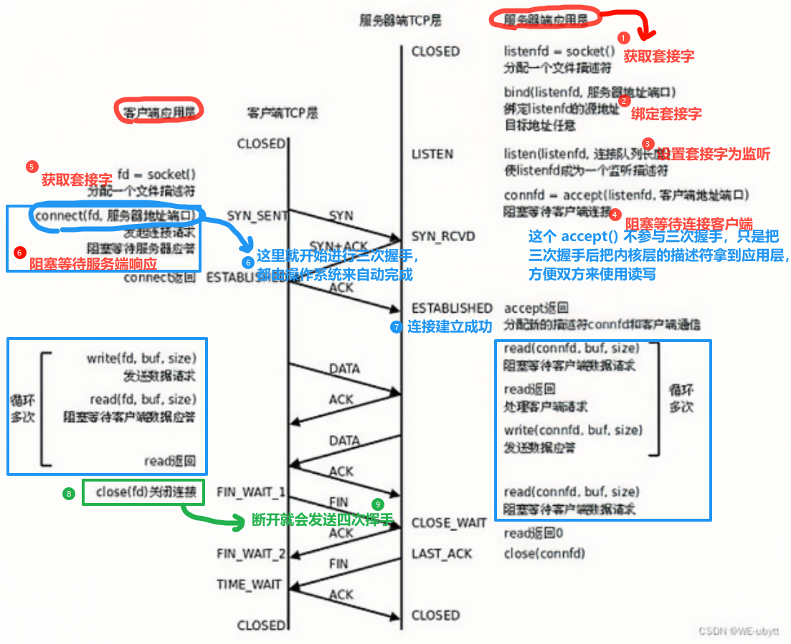

>   前要：程序员在网络程序上编写满足日常需求的网络程序基本都是在应用层编写的（包括我们之前编写的套接字编程）。
>
>   我们来理顺一下关于 `TCP` 通信发送的流程：
>
>   
>
>   一般都是客户端主动访问服务端，而不是服务端主动连接客户端，这种基于客户端的模式简称 `CS` 模型。
>
>   现在的主流网络下可靠传输和不可靠传输已经很难察觉到了。
>   
>    有无连接可以直接在代码中体现出来。
>    
>    `UDP` 读一次必须写一次，`TCP` 等到读取的时候一次性读取。
>   
>   本节我们要站在应用层上重新理解套接字编程。

# 1.HTTP 协议

`HTTP(Hypertext Transfer Protocol)` 协议实际上就是应用层规定好的其中一种协议。

我们之前读写数据都是按照字符串的方式来发送和接收的，那如果是具有 `结构化的数据` 怎么办呢？

假设我们需要实现一个网络计算器，就需要先规定好两个结构体（其实从这就是制定协议的开始了）：

```cpp
//网络计算器
//服务端发送下面结构的实例化
typedef struct Request {
    int _a;
    int _b;
    char _op;
} Request;
Request reqt = { 10, 20, '+' };

//客户端发送下面结构的实例化
typedef struct Response {
    int _result;
    int _errodCode;
} Response;
Response reqe = { 30, 0 };
```

而更进一步，也可以认为协议定制的时候，需要用到的字段也是协议的一部分。

规定好协议后，如果客户端和服务端规定传输数据的规格直接进行传输确实可以（这也就是为什么读写接口不直接使用类型为 `char*` 的缓冲区而是使用 `void*` 的原因），但是这种做法拓展性很差，很容易失效。

而如果我们先使用结构来定义交互的信息，但按照某个规则转化为字符串，接受数据时把字符串转化为结构体。而这个过程，就是所谓 `序列化(多变一)` 和 `反序列化(一变多)` 的概念。

例如将 `102, 20, '+'` 转化为 `"10 20 +"`，通过网络把字节流直接传输到另外一段，这种做法相当于加了一层软件层，把应用和网络进行解耦。

>   注意：当然，这是一种理想情况。如果制定协议的双方已经明确了各种大小端和对齐规则，很可能真的就直接传递一个结构实例化对象（实际就是直接使用二进制传递），在另一端直接进行解析。但是，这种做法只适合较为底层的协议，这些协议封装的很好，几乎无需担心出错的问题。

协议是一种约定，但是这种表述太抽象，具体到代码中：


我们可以尝试实践一下，让抽象的概念化为具体的代码。

```cpp
```

虽然我们完全可以自己制作协议，但是在应用层早就有更加统一的标准，这个标准协议之一就有 `HTTP` 协议。

# 1.HTTP 协议格式


# HTTP 方法


# HTTP 状态码


# HTTP 服务器


