>   资料：...

>   概要：...
>

# 1.端口号的基础

虽然我们前面的网络编程中，有用过端口号，但是实际上，应用层协议中的请求行中的端口号主要不是给自己使用的，而是传递给下层的传输层。因此再 `UDP/TCP` 的报头中会出现端口号的相关字段，我之后和您细谈...

不过这里我们还需要稍微补充一下端口号的一些其他基础知识，实际上有一些端口号的作用已经被默认规定好了，程序员在请求一些 `IT` 公司提供的网络 `API` 时，也大概能猜出该公司提供域名的不同端口对应的作用，大致如下：

1.  **系统端口(Well-Known Ports)**：`0` 到 `1023`，这些端口号通常用于一些常见的服务
    
    | 服务   | 端口号 |
    |--------|-------|
    | SSH    | 22    |
    | HTTP   | 80    |
    | HTTPS  | 443   |
    | ftp    | 21    |
    | Telnet | 23    |
    | SMTP   | 25    |
    | POP3   | 110   |
    | IMAP   | 143   |
    | DNS    | 53    |
    | SMB    | 445   |
    | NFS    | 204   |

2.  **注册端口(Registered Ports)**：`1024` 到 `49151`，这些端口号用于用户定义的服务或应用程序，需要经过 `IANA` 注册。
3.  **动态端口/私有端口(Dynamic Ports/Private Ports)**：`49152` 到 `65535`，这些端口号用于客户端和服务端之间的动态分配，通常不固定于特定的应用程序或服务。

>   补充：可以使用 `cat /etc/services` 查看这些端口号。

# 2.传输层两协议

从应用层往下开始的传输层会更加原生，应用层的用户直接使用接口完成对应的服务（主要的工作就是字符传输），而传输层上下都有协议，因此必须解决两个问题：(1)如何向上分离 (2)如何向下交付。

另外，也不要忘记我们传输层的目标：**提供端到端的通信服务，确保一定一定程度上可靠的数据传输，并且解决核心三个问题，要发多少、什么时候发、丢失了怎么办**。

## 2.1.UDP 协议

### 2.1.1.协议结构

`udp` 协议结构如下。

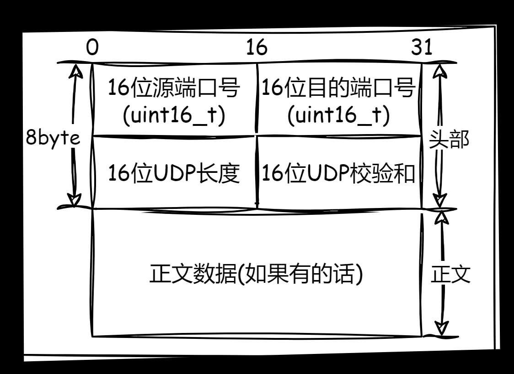

-   `16` 位源端口号和 `16` 位目的端口号比较容易理解，就是填写应用层中涉及到了服务端和用户端的端口号，正好就是 `uint16_t` 类型
-   `16` 位 `udp` 长度的就是描述整个 `udp` 报文的长度，注意不是正文数据的长度，单位是字节
-   `16` 位 `udp` 校验和主要时检查比特位是否被翻转的问题，检查数据是否在传输过程中发生错乱
-   正文数据就是应用层传递过来的应用层报文，例如 `http/https` 报文

我们先来理解 `udp` 报文的封装和分离过程。

```cpp
// 头部和正文的封装过程(32 位下)
// -- server 端 --
// 头部结构
struct UdpHdr {
	uint16_t _srcPort;  
	uint16_t _dstPort;  
	uint16_t _udpLen;  
	uint16_t _udpCheck;  
};

// 正文结构
struct UdpCon {
    // 一系列数据, 其实就是应用层报文
    type _data;
};

// UDP 结构
struct Udp {
    UdpHdr hdr; // 头部 
    UdpCon con; // 正文
};

Udp aUdp = {
    { _srcPort=..., _dstPort=..., _conLen=..., _udpCheck=... },
    { _data = "..." }
};
```

`udp` 报文包装好后向下交付协议栈，直到发送给对端，对端接受到后，进行如下的解析工作。

```cpp
// 头部和正文的分离过程(32 位下)
// -- client 端 --
Udp* newUdp = &aUdp; // 接受到 aUdp 后如下步骤进行解析

uint16_t len = newUdp._udpLen; // 先获取整个 udp 报文的长度

UdpCon newCon = *((char*)newUdp + sizeof(uint16_t) * 4); // sizeof(uint16_t) * 4 刚好是 8 byte, 此时 newUdp 指针根据 char* 类型跳过 8 个字节时, 正好指向正文内容的开头

read(newCon, len - sizeof(uint16_t) * 4); // 这个 read() 只是伪代码, 需要传递指向正文开始的指针和正文的总字节长度, 然后在内部进行读取, 就可以读取到所有的正文信息
```

此时通过 `read()` 就得到了对端应用层的数据，然后交付给本段的上层应用层进行业务处理。

>   注意：所有的协议封装和分离过程都和上述过程类似，包括之前我们使用 `http` 开发中对 `http` 做解析的工作，因此后续的相关解析工作我一句带过，不再细讲...

`udp` 固定头部长度为 `8 byte`，因此可以读取到的 `udp` 报文 `< 8 byte` 时，就可以检查出 `udp` 读取不全，此时就会直接丢弃（具体要看实现）。

而如果读取到了 `>= 8 byte` 的头部数据后，就可以读取内部的 `udp` 报文长度，进而得到一整个报文该有的长度 `len`。此时就可以检测 `udp` 报文是否完整。如果此时和读取到的实际报文长度 `< len`，就可以发现 `udp` 报文是不完整的，进而采取直接丢弃的策略。

因此我们可以说 `udp` 报文是面向整个数据报的，每次传输都可以保证是一个完整的数据报，因此对应上层的套接字编程就会非常的简单。

不过，如果从更加具体实现的角度来看，大量的报文就需要被管理，而管理就需要先做描述，这就会涉及到 `sk_buff` 结构体，我们简单演示一下一些字段。

```cpp
// 报文管理
struct skb_buff {
    char* data; // 指向大缓冲区中的某个地址 addr
    char* tail; // 指向大缓冲区中的某个地址 addr
    struct sk_buff* next;
}
```

把数据拷贝到缓冲区中，`tail` 指针根据数据的字节数进行挪动，此时正文数据就被保存在缓冲区中。而需要添加报头时，做 `data` 指针的减操作，把填充好的头部填充进此时的 `data` 指针，就是对正文的 `udp` 封装，和我们上述的过程虽然有些差异，但是原理类似的（具体要看操作系统的实现）。

不过这样就可以保存这一个报文进行管理，然后使用 `next` 做链表，此时就转化为对链表的管理（增删查改）。另外，只要双端支持一样的网络协议栈，分离其实也是移动指针...

而这里报文管理的规定，其实也体现了协议的约定在这里。

>   补充：我们可以简单看一下 `Linux` 源代码中的 `struct udphdr{/*...*/}` 和 `struct skb_buff{/*...*/}`。
>
>   ```cpp
>   // struct udphdr
>   struct udphdr {
>   	// ...
>   	__be16	source;
>   	__be16	dest;
>   	__be16	len;
>   	__sum16	check;
>   	// ...
>   };
>   ```
>
>   ```cpp
>   // struct skb_buff
>   struct skb_buff {
>   	// ...
>   	/* These elements must be at the end, see alloc_skb() for details.  */
>   	sk_buff_data_t		tail;
>   	sk_buff_data_t		end;
>   	unsigned char		*head,
>   				*data;
>   	unsigned int		truesize;
>   	refcount_t		users;
>   	// ...
>   }
>   ```

### 2.1.2.协议特点

`UDP` 的不可靠首先体现在，即便 `UDP` 的数据包丢弃了、校验失败了也不关心、不重传，但是优点在于 **基于 UDP 机制的代码维护必然简单、开发效率高**。

而由于结构的特点，`udp` 不会对正文进行拆分，怎么发就必须怎么收（本端调用一次 `sendto()` 发送数据，对端就必须也只调用一次 `recvfrom()` 接受全部数据，一旦检测到报文数据缺少，就直接丢弃读取到的残缺数据，不会多次调用 `recvfrom()`），也就是所谓的面向数据报。

另外 `UDP` 其实不太需要发送缓冲区（这是相对 `TCP` 来说，这是因为 `udp` 报文发送一次就是完整的数据，无需像 `tcp` 一样在发送缓冲区中进行积攒后，再发送出去，这些后面讲解 `tcp` 的时候我会进行详细展开）。调用 `sendto()` 的时候会直接交给内核，直接通过协议栈，然后通过网路发送出去。

不过 `UDP` 在对端具有接受缓冲区（也就是 `skb_buff` 组成的链表队列），因为对端可能会一次接受到很多的 `udp` 报文，最好聚集缓冲起来统一管理。

总结起来的话，`udp` 的不可靠缺点体现在三点：

1.   **如果 udp 报文丢弃了、校验失败了，发送端不关心、不重传**
2.   **如果接受缓冲区不保证收到的 udp 报文的顺序和发送 udp 报文的数据一致，有可能导致乱序（这需要程序员自己进行维护）**
3.   **如果接受缓冲区满了，就会导致后来 udp 报文直接被接受端丢弃，导致数据丢失**

另外还有一个缺点 **udp 报文能存储的正文的较小，这是由于内部结构和字段限制的原因，只能发送 64 K 大小的数据（包含整个报文），如果实在超过大小，就需要程序员自己对数据进行切分（可以使用 sendto() 的返回值来进行判断）**。

再补充 `UDP` 的一个特点，**UDP 的通信过程是全双工的，只要互相不影响接受缓冲区就行**。

而到此，`UDP` 协议实现了传输层的目标：提供端到端的通信服务，确保一定程度上可靠的数据传输（尽管不多，在接受缓冲区有一些体现），也解决了发多少（固定了报文最大长度）、什么时候发（封装好就立刻发）、丢失了怎么办（直接不关系）的问题

>   补充：基于 `UDP` 协议的应用层协议有很多，以下是其中一些常见的：
>
>   -   **NFS(Network File System)**：是一种网络分布式文件系统
>   -   **TFTP(Trivial File Transfer Protocol)**：`TFTP` 是一个简单的文件传输协议，通常用于在局域网内传输小文件
>   -   **DHCP(Dynamic Host Configuration Protocol)**：`DHCP` 协议用于动态分配 `IP` 地址和其他网络配置参数
>   -   **BOOTP(Bootstrap Protocol)**：是另一个基于 `UDP` 的应用层协议，它用于在网络启动过程中为计算机分配 `IP` 地址和其他配置信息
>   -   **DNS(Domain Name System)**：`DNS` 协议用于域名解析，将域名映射到 `IP` 地址
>   -   **SNMP(Simple Network Management Protocol)**：`SNMP` 协议用于网络设备的监控和管理

## 2.2.TCP 协议

### 2.2.1.协议结构

`TCP` 协议结构如下。

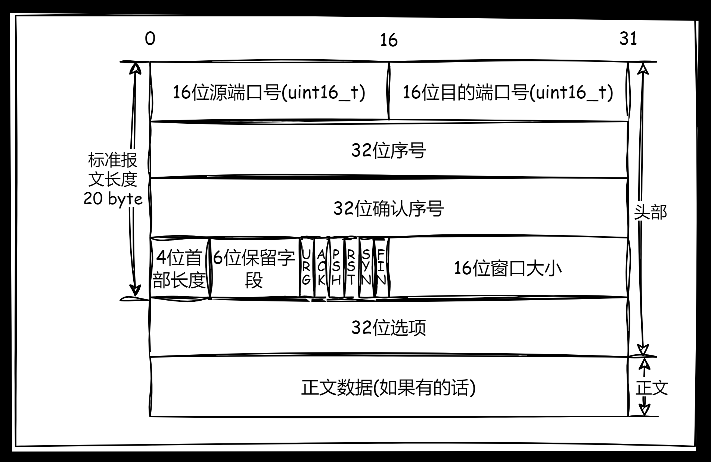

-   `16` 位源端口号和 `16` 位目的端口号比较容易理解，就是填写应用层中涉及到了服务端和用户端的端口号，正好就是 `uint16_t` 类型，和 `UDP` 结构内的字段是一样的
-   `32` 位序号和 `32` 位确认序号需要很长的解释，后面展开
-   `4` 位首部长度需要较长的解释，后面展开
-   `6` 位保留字段留做拓展使用，本文不深入这个内容
-   `6` 位标志位，分别对应 `tcp` 报文的六种不同类型，需要较长的解释，后面展开
-   `16` 位窗口大小，是为了平衡两端的传输压力的字段，需要较长的解释，后面展开
-   `32` 位选项，和首部长度有关，需要较长的解释，后面展开
-   剩下的部分全是正文数据，能存储很大的数据，就是应用层传递过来的应用层报文，例如 `http/https` 报文

>   吐槽：从结构上 `TCP` 就比 `UDP` 要复杂许多了，具象化就对应到比 `UDP` 更为复杂的代码维护...

首先整个 `tcp` 报头是变长的，变长的数据在选项里。`tcp` 报头的长度由 `4` 位首部长度来决定，范围为 `[0, 15]`，其单位是 `4` 个字节，也就是说首部的大小在 `[0*4=0, 15*4=60]` 字节范围内。而由于标准报头的长度就先占用了 `20` 个字节，选项最多就占用 `40` 个字节，对应的范围就是 `[20=5*4, 60=15*4]` 字节。因此，首部内填写的数值就是 $[5, 15]==[(0101)_2, (1111)_2]$。

>   注意：这里一定要注意 `UDP` 是记录整个 `udp` 报文的长度，但是 `TCP` 的首部长度只计算了变长报头的长度，而不是整个 `tcp` 报文长度。

而报头的分离，需要先提取`tcp` 报文的前 `20` 个字节，进一步获取到首部长度值 `*4-20` 查看是否得到 `0`，是 `0` 就 `done`，否则就读取到了选项的长度，直接根据长度读取完毕选项里的数据即可。自此就分离了整个报头，剩下的就是报文数据。

另外，在内核中也可能找到对应的 `tcp` 报头数据结构。

```cpp
// struct tcphdr
struct tcphdr {
    //...
	__be16	source;
	__be16	dest;
	__be32	seq;
	__be32	ack_seq;
#if defined(__LITTLE_ENDIAN_BITFIELD)
	__u16	res1:4,
		doff:4,
		fin:1,
		syn:1,
		rst:1,
		psh:1,
		ack:1,
		urg:1,
		ece:1,
		cwr:1;
#elif defined(__BIG_ENDIAN_BITFIELD)
	__u16	doff:4,
		res1:4,
		cwr:1,
    //...
}
```

### 2.2.2.协议特点

那么 `TCP` 的可靠性怎么理解？不可靠的原因是什么？两台计算机之间的中间设备过多、距离过长，导致数据丢包。

网络中不存在百分百可靠（最新数据的发送无法保证可靠性 ），但是在局部可以做到，只要旧发送消息可以接受到匹配的回应就可以保证百分百可靠（回答了就可以保证对方一定接受到了）。

#### 2.2.2.1.确认应答机制

而这个确认应答的机制由序号和确认序号来完成。

客户端可能向服务端发送多个报文，就有发送顺序的问题，发送的顺序不一定是接受的顺序，但是客户端如何确定哪一个应答对应哪一个请求呢？

每一个报文一定是携带了完整的报头。

而这个 `TCP` 报文的发送会携带序号，填充 `32` 位序号，发送回来的时候在确认序号中 `+1`，这样请求和应答就需要一一对应。确认序号对应的数字，表示之前收到的报文已经全部收到了，下次发送就应该从此时的序列号开始发送。允许部分确认丢失，或者不给应答。

为什么搞两个序号呢？是因为 `TCP` 是全双工的，服务端有可能既想给对方确认，又想给对方发消息（发回消息本身就是一种应答）。

而乱序问题也不用担心，`TCP` 的每次发送，都会携带序号，只需要进行排序就行，就可以保证按需到达。

序号的可靠性保证作用有两个：一个是确认应答，一个是按序到达。

保留 `6` 位留作扩充准备，暂时不提。

`16` 位窗口大小呢？`TCP` 是存在接受缓冲区和发送缓冲区的。

`TCP` 叫做传输控制协议，就是因为在进行 `IO` 操纵的时候就是当初拷贝到缓冲区，然后 `TCP` 协议自行进行控制的。

这样就有两对接受和发送缓冲区，此时就可以支持全双工通信的原因。

但是发送方如果过快就会导致接收方丢包，过慢就会导致效率问题。那如何控制这个速度呢？很显然这个速度把控不能由发送方来决定，而是应该等待接收方的应答，同步接受能力。那接受能力怎么判定呢？接受缓冲区中剩余空间的大小即可控制速度（流量控制）。

`16` 位窗口大小就是接受缓冲区剩余的大小。

每次应答都一定会接受到报头，报头内的 `16` 位就是填自己的剩余缓冲区大小，再发回给对方。通信过程中就会不断进行滑动窗口大小的交换。

校验位就是拿来判断是否丢弃的问题（校验失败就丢弃）。

`6` 个标志位（也有可能是 `8` 位），一个标志位表示某种含义。常规报文、建立连接报文、断开连接报文、确认报文...不同报文对应的处理方式是不一样的。因此该标记为就是用来区分报文的类型，用来做不同的处理动作。

各个标记位也有自己的含义：

-   SYN：为连接连接报文
-   FIN：为断开连接报文
-   ACK：为应答报文，大部分设置为 `1`
-   URC、PSH、RST：待补充...

`TCP` 建立和断开连接的过程，什么是连接？怎么理解三次握手和四次挥手？

客户端发起向服务端的连接请求，大量的客户端连接就需要被服务器管理起来，因此建立连接成功的时候，就是在内核中创建对应的数据结构对象，然后再使用某种数据结构进行管理（转化为对连接的增删查改），因此维护链接就是有成本的。

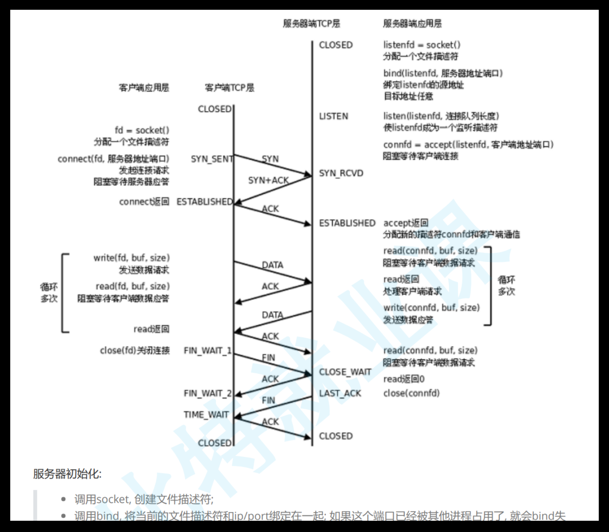

那三次握手是什么？发送的时候就是发送 `TCP` 报文（包含报头和报文），类型是 `SYN`，而服务端就必须返回一个 `TCP` 报文（包含报头和报文），类型是 `SYN+ACK`，客户端再发送 `ACK` 类型的 `TCP` 报文（很多教程和示例图只发送了类型并且没有点明，实际上应该是整个报文被发送出去）。

客户端刚发送时就会处于 `SYN_SEND` 状态，服务端收到这个请求并且返回应答时就会处于 `SYN_RECV` 状态，而如果客户端接收到了服务端的应答并且将报文发出，就会处于 `ESTABUSHED` 状态，而服务端接受到该报文也会处于 `ESTABUSHED` 状态。

图示为斜线表示时间延迟的问题。那三次握手是不是一定需要成功？不是，只需要较大概率成功就行（特别是最后一次，不一定保证能成功）。

另外对于各方而言，都需要进行 `3` 次“发/送”操作。

那最后一次怎么办呢？而且为什么需要 `3` 次呢？

`1` 次怎么样？如果客户端发送大量的 `SYN` 类型的 `TCP` 报文，那服务端只要收到一次就建立连接的话，很快就会把服务端资源吃完（也就是 `SYN` 洪水），只要客户端够多，哪怕客户端挂掉了，服务端也需要维护大量的连接，当然也并不是全部都是这个原因。

`2` 次握手呢？只要服务端返回 `ACK` 就建立连接的话，服务端无法保证自己返回的 `ACK` 被客户端接受到，而如果客户端不理会这个 `ACK`，甚至是直接丢弃，也会导致服务端的连接被挂满（只要客户端的连接数量够多）。

那为什么 `3` 次可以呢？因为服务端有连接时，客户端也会被迫保证有连接，此时双方都需要维护连接资源，就可以一定程度避免普通机器吃服务端资源连接的可能性（一般单机比服务端的资源要少，再还没有吃完服务端之前自己就先挂了），当然这只是避免单机的情况，但总比前面的好一些。

这些设置虽然不能很好避免各种攻击手段，三次握手只是顺带有这些功能罢了（最多就防止小白用户）。

三次握手的更深层意义呢？验证全双工，保证客户端和服务端两端都可以“发/收”，验证某一端可以进行全双工。

那四次呢？最后一次一定是 `server` 发起的，如果这一次发起对于客户端来说是丢弃的，服务端不知道，认为自己连接建立好了，偶数次握手，连接成本都在服务端。

客户端有可能在第三次建立连接的后续就把数据发送，如果 `ACK` 丢失，一旦服务器还没有收到 `ACK` 先收到后续的数据就会被服务端检测到连接异常，服务器此时就会发送带有 `RST(连接重置)` 的响应，此时客户端接收到就会关闭连接，重新发起三次握手（但是这种第一次就连接不上的情况较少，更多是未来通信中，服务端认为连接出现问题，但是客户端不知道，就会让客户端重置）。

`PSH` 类型报文就会让服务端滑动窗口发送为 `0` 后，督促服务端赶紧把数据向上交付给上层（后面提怎么交付）。

如果 `TCP` 报文需要插队发送呢？就需要 `URG(紧急标志位)` 配合 `16` 位紧急指针（指向有效载荷的紧急数据，实际是偏移量），然后把紧急数据提前交付（紧急数据只有一个字节）。

紧急数据的目的是什么呢？服务器被卡住了，客户端可以用紧急数据询问服务端的机器状态，而服务器也可以通过紧急数据来返回告知机器状态。

那如何理解四次挥手呢？假设客户端发送断开连接的请求 `FIN`，进入 `FIN_WAIT_1` 状态，服务端收到然后就会返回 `ACK`，进入 `CLOSE_WAIT` 状态，客户端接收到后，就会进入 `FIN_WAIT_2`，服务端立刻进入 `LAST_ACK` 状态

服务端也进行 `FIN` 后，客户端收到进入 `TIME_WAIT` 状态然后发送 `ACK`，服务端接受到后就进入 `CLOSED`。

有没有一种可能 `ACK` 和 `FIN` 被同时设置呢？可以四次挥手在特定场景下也有可能变 `4` 次。

`4` 次挥手也一定成功么？不一定...

如果发现服务器具有大量的 `CLOSE_WAIT` 说明什么？说明应用层有 `bug`，忘记关闭 `sockfd` 套接字。

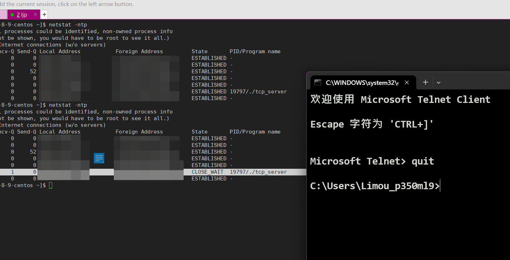

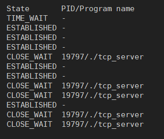

客户端多次关闭后如上。

如果服务端先关闭了也会陷入 `TIME_WAIT`（时间和系统和用户设置有关），反映到上层就是无法绑定套接字（这个状态时已经结束了四次挥手了）。

这里还可以考虑 `setsockopt()` 地址复用，让服务端在 `TIME_WAIT` 期间也可以进行重启。

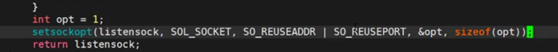

维持这个状态的原因是，有可能网络中滞留一些数据，让处于该状态的一端将剩下的历史数据在 `2MLS` 时间的网络中消散（方便第二次连接时导致旧数据残留...）。

```shell
# 查询 TIME_WAIT 的大小
$ cat /proc/sys/net/ipv4/tcp_fin_timeout
60
```

还有一个可能就是如果一端直接进入 `CLOSED`，万一 `ACK` 丢失，就会导致另外一端无法重传 `FIN`，进而超时


**确认应答 `ACK` 机制**，为了保证可靠性，发送数据时对方必须进行应答。当收到 `ACK` 应答后对方是一定收到的，历史数据确保了两个方向的可靠性。

并且每个数据段（`TCP` 报文）都会携带序号。

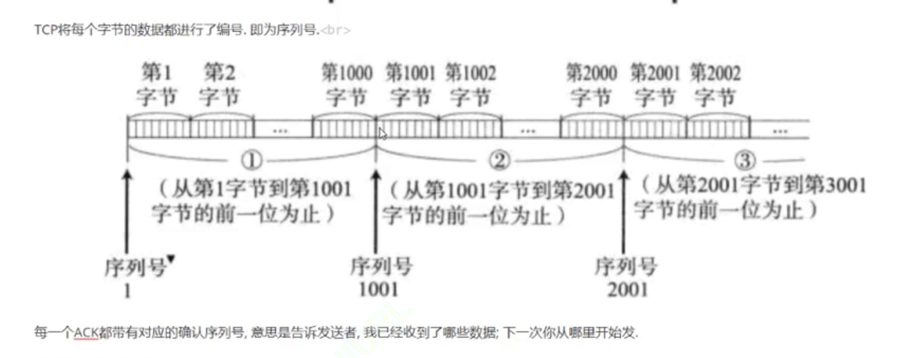

可以把发送缓冲区理解为 `char` 数组，因此每个字节的数据就具有了序号（下标），所以发送数据的时候就有编号（最后一位作为序号发送）。应答加 `1` 就是往后读。

这种用字节流保存的数据就是面向字节流的。

#### 2.2.2.2.超时重传机制

如果数据发生了丢包（或者应答发生了丢包），一端没有接受到应答，就会经过特点的时间间隔（超时时间）进行重传。

但是有一个问题，如果是 `ACK` 丢失了，那另外一端不就收到两份同样的数据了？

如果总是丢 `ACK` ，超时重传机制就会导致数据冗余数据，但是另外一端是可以通过序号来去重的，这点不用担心。

那超时具体应该设置时间为多少？过多喝过少都不行，而且网络环境还随时间和地点不同，因此就必须是动态调整的时间。

`Linux` 内核中（`BSD Unix、Windows` 而是如此）超时以 `500ms` 为一个单位进行控制，每次判定超时重发的时间都是 `500ms` 的整数倍。如果重发一次后仍然得不到应答，则会等待 `2*500ms` 在进行重传，以此类推，直达累积到一定的重传次数，`TCP` 就会认为网络或者对端主机出现异常，强制关闭连接。

#### 2.2.2.3.连接管理机制

就是握手和挥手的状态变化过程。

#### 2.2.2.4.滑动窗口机制

**三大机制：流量控制、拥塞控制、滑动窗口。**

接收端处理数据的速度是有限的，如果发送端发的太快，导致接收端的缓冲区被打满, 这个时候如果发送端继续发送，就会造成丢包，继而引起丢包重传等等一系列连锁反应。

因此 `TCP` 支持根据接收端的处理能力, 来决定发送端的发送速度，这个机制就叫做 `流量控制(Flow Control)`。

接收端将自己可以接收的缓冲区大小放入 `TCP` 首部中的“窗口大小”字段, 通过 `ACK` 端通知发送端。

窗口大小字段越大, 说明网络的吞吐量越高。接收端一旦发现自己的缓冲区快满了, 就会将窗口大小设置成一个更小的值通知给发送端。

发送端接受到这个窗口之后, 就会减慢自己的发送速度。如果接收端缓冲区满了, 就会将窗口置为 `0`。这时发送方不再发送数据, 但是需要定期发送一个窗口探测数据段，使接收端把窗口大小告诉发送端。

接收端如何把窗口大小告诉发送端呢? 回忆我们的 `TCP` 首部中, 有一个 `16` 位窗口字段, 就是存放了窗口大小信息。

#### 2.2.2.5.流量控制机制

那么问题来了，`16` 位数字最大表示 `65535`, 那么 `TCP` 窗口最大就是 `65535` 字节么? 实际上, `TCP` 首部 `40` 字节选项中还包含了一个窗口扩大因子 `M`，实际窗口大小是窗口字段的值左移 `M` 位（但是处理调整这个因子，还有可能需要调整链段的读写缓冲区）。

另外，流量控制也是两个方向的流量控制。

第一次发送数据不等于第一次做数据交换，早在三次握手的时候就交换重要的报文（尽管没有有效数据载荷，但是报头交换了）。

而窗口探测实际上就是空有效载荷和 `TCP` 报文。

实际工作中，对端还有可能发送窗口更新通知，因此窗口探测和窗口更新通知可能会同时进行使用。

滑动窗口实际上就是 `TCP` 为效率做出的努力。应答策略中，每一个发送的数据段，都要给一个 `ACK` 确认应答。收到 `ACK` 后再发送下一个数据段。

但是这样做性能较差，尤其是数据往返的时间较长的时候。既然这样一发一收的方式性能较低，那么我们一次发送多条数据，就可以大大的提高性能。

窗口大小实际上就是发送数据的最大值。将多个段的等待时间重叠在一起了。

窗口大小指的是无需等待确认应答而可以继续发送数据的最大值 `4000` 个字节，四个
段。发送前四个段的时候，不需要等待任何 `ACK`，直接发送即可。

收到第一个 `ACK` 后，滑动窗口向后移动，继续发送第五个段的数据，依次类推。

操作系统内核为了维护这个滑动窗口，需要开辟发送缓冲区来记录当前还有哪些数据没有应答，只有确认应答过的数据, 才能从缓冲区删掉。

窗口越大，则网络的吞吐率就越高。

滑动窗口既想给对方推送数据，又想保证对方有能力接受数据。

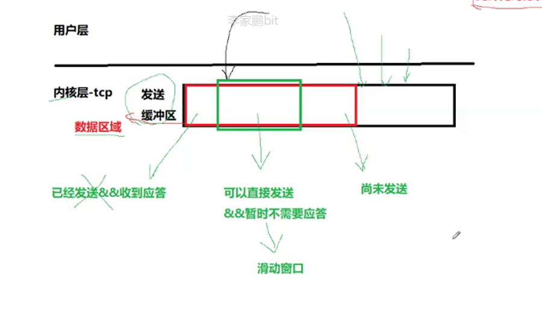

那么如果出现了丢包, 如何进行重传? 这里分两种情况讨论。

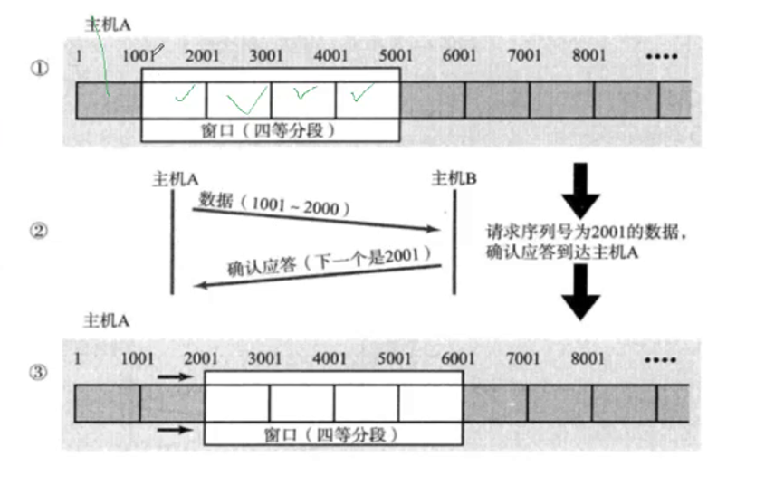

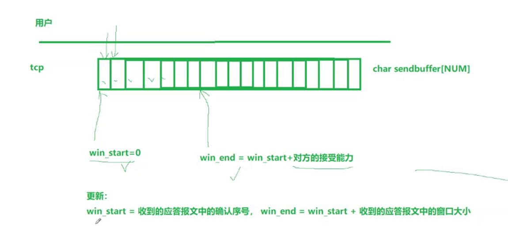

情况一：数据包已经抵达，`ACK` 被丢了。这种情况下，部分 `ACK` 丢了并不要紧, 因为可以通过后续的 `ACK` 进行确认
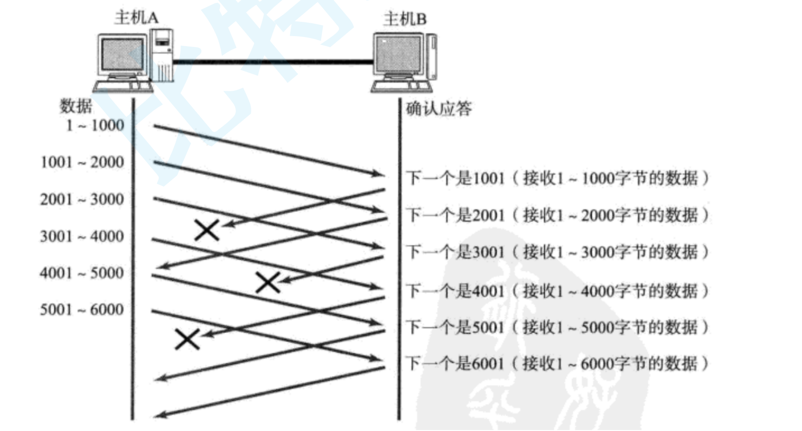

情况二：数据包就直接丢了。当某一段报文段丢失之后，发送端会一直收到 `1001` 这样的 `ACK`，就像是在提醒发送端“我想要的是 `1001` 一样”。
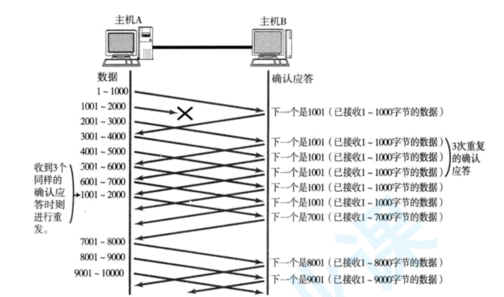

如果发送端主机连续三次收到了同样一个 `1001` 这样的应答, 就会将对应的数据 `1001-2000` 重新发送。

这个时候接收端收到了 `1001` 之后, 再次返回的 `ACK` 就是 `7001` 了（因为 `2001~7000`）接收端其实之前就已
经收到了, 被放到了接收端操作系统内核的接收缓冲区中（能直接回应 `7001` 说明历史的数据也被获取到了）。


并且，这种滑动窗口机制的发送缓冲区是环形的，不可能出现越界的问题。

这种机制被称为“高速重发控制”（也叫“快重传”机制）。

那为什么还需要超时重传呢？因为快重传是有条件的（必须受到三个连续的）。

如果最多发送两个 `TCP` 报文，那么最多收到两次 `ACK`，如果第一次的数据就丢失了，后续没有其他数据报文了，导致无法三次，最后无法快重传（并且也有可能导致三次应答中有些应答丢失），两者是互补的。

#### 2.2.2.6.拥塞控制机制

但是作为服务器，还不仅仅是端对端的事情。还关于网络的问题。

需要关注网络的监控状态，如果出现大量丢包，真的需要重传么？如果网络状态极其糟糕，就不是两端的问题，这个就是网络阻塞的现象，此时继续重传更会阻塞网络。

这种现象更常见出现在局域网中。

因此 `TCP` 引入了慢启动机制，先发少量数据摸摸网络情况。

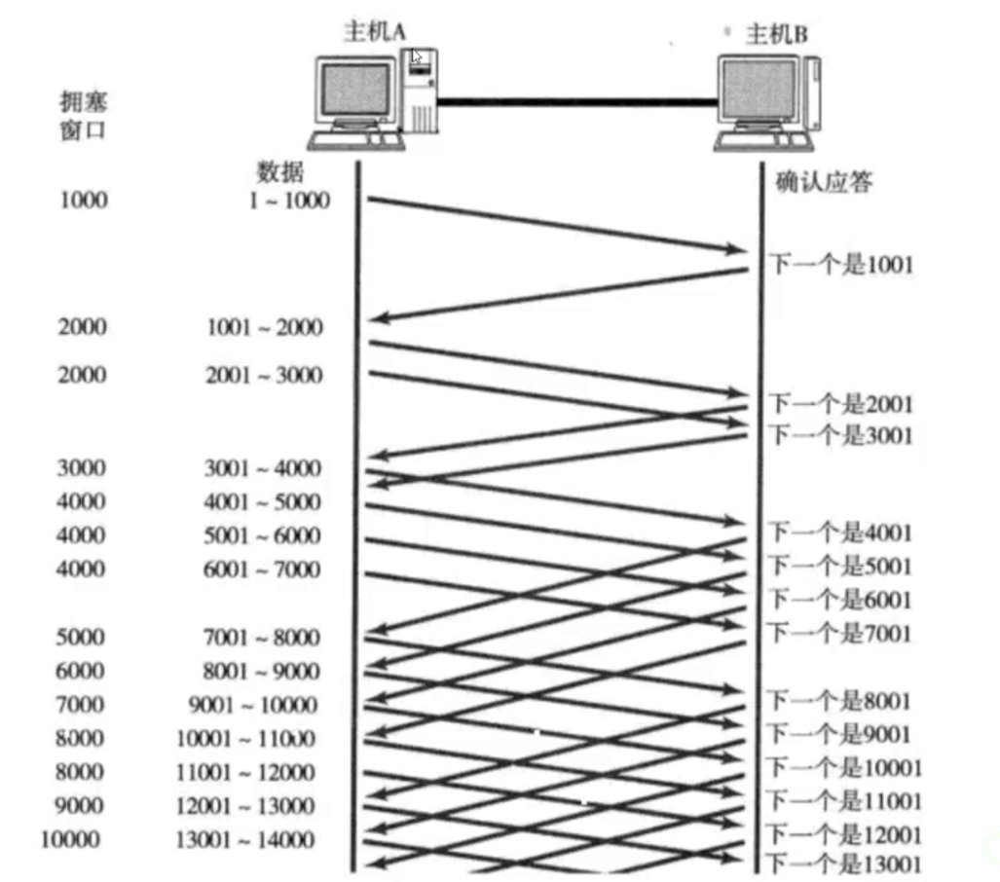

还有一个拥塞窗口的概念，单台主机一次向网络中发送大量数据时，就会引发网络拥塞的上限值。

因此实际上窗口大小应该是 `min(拥塞程度, 对端接受能力) = min(拥塞窗口数字, 反馈滑动窗口大小)`。

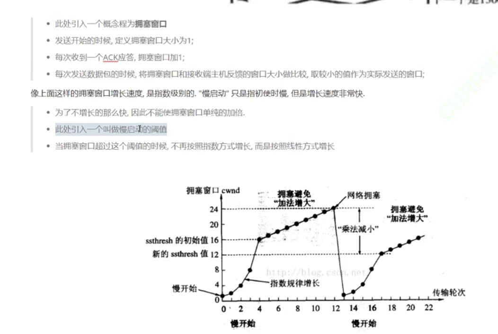

前期慢后期快的指数增长很符合试探和尽快恢复正常的网络通信。

如果网络一直不拥塞，理论上拥塞窗口会一直线性增长。

尽快传输给对方又避免网络压力过大的方案。

某些角度上，`TCP` 不一定比 `UDP` 慢，`TCP` 也对速率经过优化。

#### 2.2.2.7.延迟应答机制

怎么保证对方同步给自己更大的接受能力呢？如果对端收到数据后立刻应答，那么窗口可能比较小（这是肯定的，因为本次发送了很多数据过去）。

这个时候等待上层取走缓冲区后再应答，就可以提高吞吐量，进而提高传输效率（因为实际上对端读取缓冲区的速度有可能很快）。

-   每隔 `N` 个包应答一次
-   超过最大延迟时间就应答一次

#### 2.2.2.8.捎带应答机制

不需要严格一发一收，可以把应答和其他数据合起来发送，也就是“捎带”。

面向字节流，缓冲区不一定会一次写一次读，会因为各种机制的原因影响。没有边界和区分度，因此就需要应用层自主选择协议，`TCP` 只需要关注高效、可靠传递（文件流的流也是类似的理解）。

## 2.3.粘包问题

由于 `TCP` 不关心字节流数据的格式，就有可能出现多个报文多读或少读的问题，我们之前就使用 `http` 来解决这个问题。 

因此就需要明确报文之间的边界（自描述字段和分隔符），来解决完整报文的问题（因此我们之前写得关于 `TCP` 的代码，只要不携带 `HTTP` 或者自定义协议的，都是不严谨的代码，但凡出现大量数据发送的场景，就有可能出现不完整的情况）。

## 2.4.异常情况

当进程终止时，就会释放文件描述符，关闭就是在进行四次挥手，不影响底层连接的正常释放。

机器重启的情况也和上面类似，但是机器断电或者网线断开呢？一旦接收端有写入操作，接收端发现连接不存在，无法正常四次挥手。对端会认为连接存在，但是 `TCP` 内置有保洁定时器，会定期询问对方是否存在，不存在就把连接关闭。如果还没触发保洁定时器，本端恢复了服务，就会收到对端莫名的回应，因此本端就会要求对端重新连接，也就是 `ACK+RESET`。

 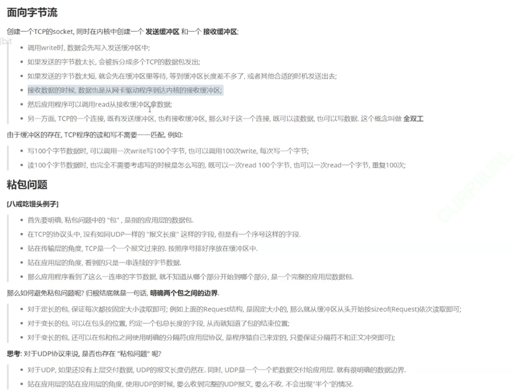

`QQ` 为了节省资源，会短暂下线 `QQ` 用户，等到用户需要使用时才重新连接。

`accpet()` 要不要传输三次握手的过程呢？实际上是不需要的（可以使用 `netstart` 验证），这个函数本身在做的事情就是从底层直接获取已经建立好的连接。如果不调用 `accept()` 也会连接成功，如果上层来不及调用 `accept()`，并且对端还来了大量的连接，难道所有连接都应该连接上么？肯定不行，但这就涉及到 `listen()` 的第二个参数了。

第二个参数可以让这些连接处于有限的个数，超过就不会自动进行三次握手，并且也可以把某些长连接转化为短链接。让访问同一台主机的同一个端口的众多客户端能够排队起来（类似吃饭外面做的座位）。

一旦设置了队列长度，但是又都是长连接，就会导致其他新的连接处于 `SYN_RCVD(同步收到)` 状态，只有其他连接关闭时才能继续进行三次握手。

因此自动完成连接的就叫做全连接队列，而其他处于 `SYN_SENT`。而半连接的请求就处于 `SYN_SENT` 和 `SYN_RECV` 状态，其生命周期断，上层长时间没有获取该连接，则会被释放，体现为上层连接失败。

>   这里写笔记的时候，UDP 和 TCP 的结构都先提及一下，然后发送流程给出图示，然后给出解释和特点。

# 3.传输协议对比

...

在应用层时解决数据使用的问题，下三层解决网络通信的细节，传输层保证将数据可靠得从 `A` 到 `B` 进行传送。

而网络层需要解决的就是提供将数据从 `A` 送到 `B` 能力（有能力并不一定能做到，而是有较大概率做到，做提供能力的工作，不保证可靠性，让传输层来做到），我们细讲的就是 `IP` 协议。


在 `TCP/IP` 协议中，用 `源IP + 源PORT + 目的IP + 目的PORT + 协议号` 五元组就可以确定两进程之间的通信（可以使用 `netstat` 来查看），下面是 `netstat` 命令的常用参数（有些需要 `sudo`）为 `nltp/nlup`：

1.  `-n`：拒接显示别名的进程，则使用数字格式显示地址和端口号，而不进行 `DNS` 解析
2.  `-l`：仅显示正在侦听的端口
3.  `-t`：显示 `TCP` 连接
4.  `-u`：显示 `UDP` 连接
5.  `-p`：显示建立相关链接的程序名
6.  `-a`：显示所有连接和侦听端口（不加这个参数的话，默认不显示 `LISTEN` 相关）

另外还有一个指令 `pidof 服务名称` 得到对应 `pid`，再利用管道结合 `xargs kill -9` 即可杀死该命令（`xargs` 可以将标志输入转化为命令行参数交给命令行，类似还有 `ls | xargs touch` 来更新所有文件的改动时间）。
