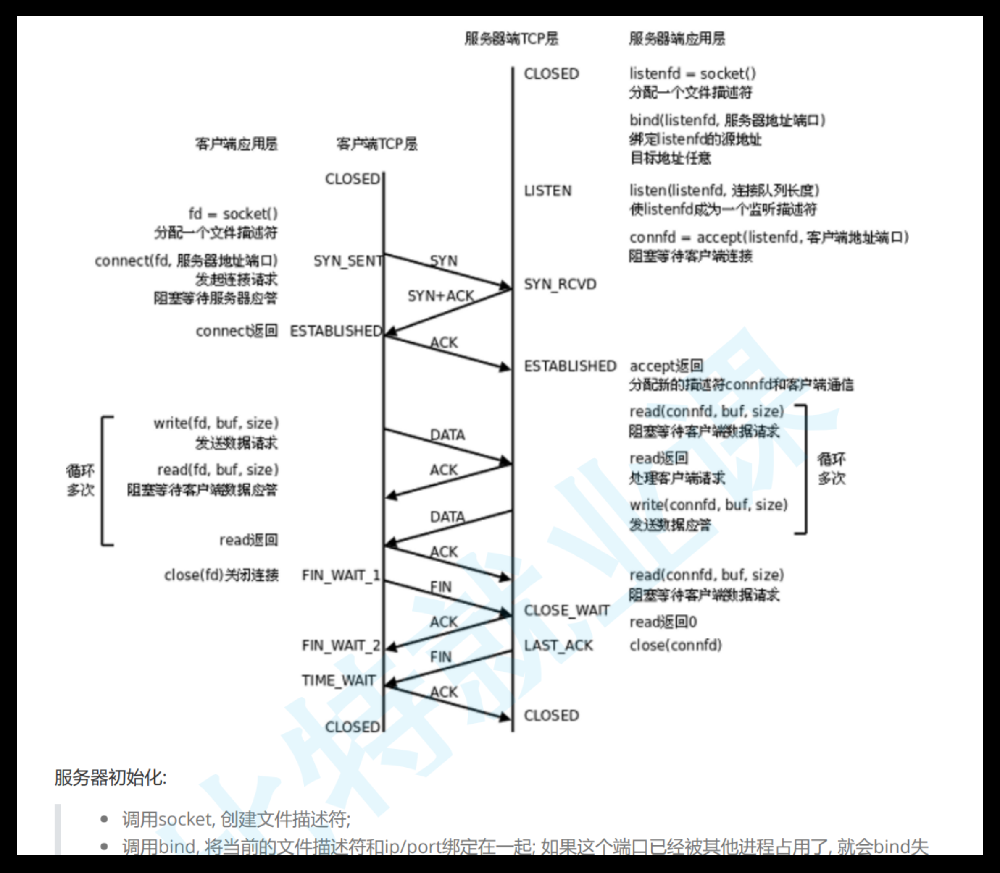
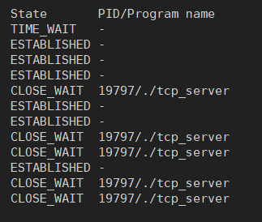
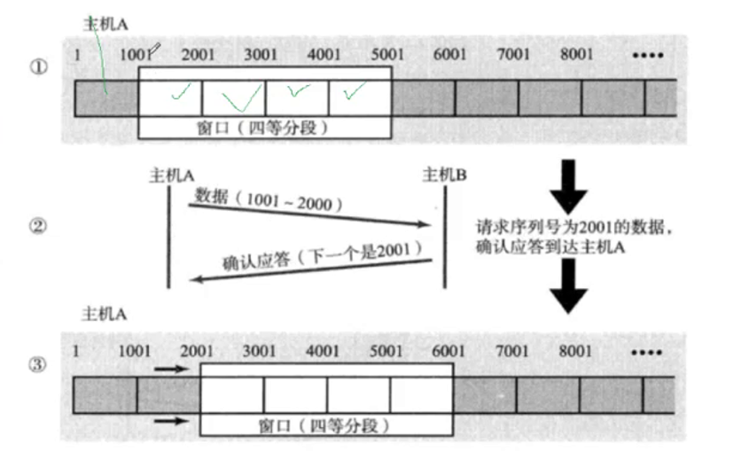
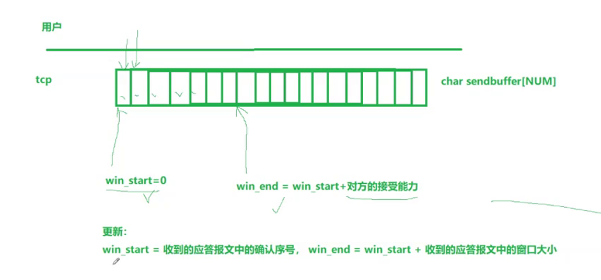
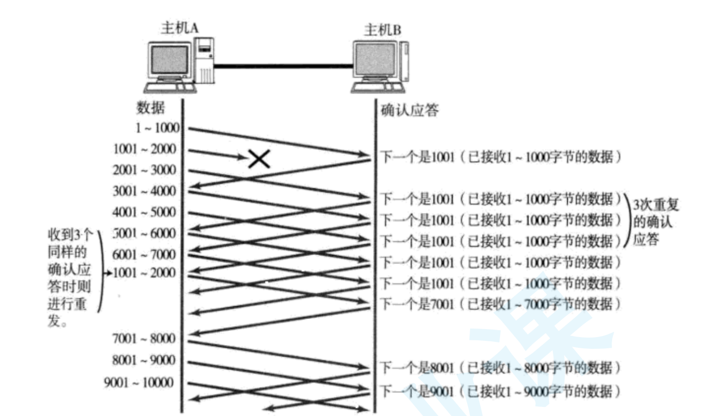
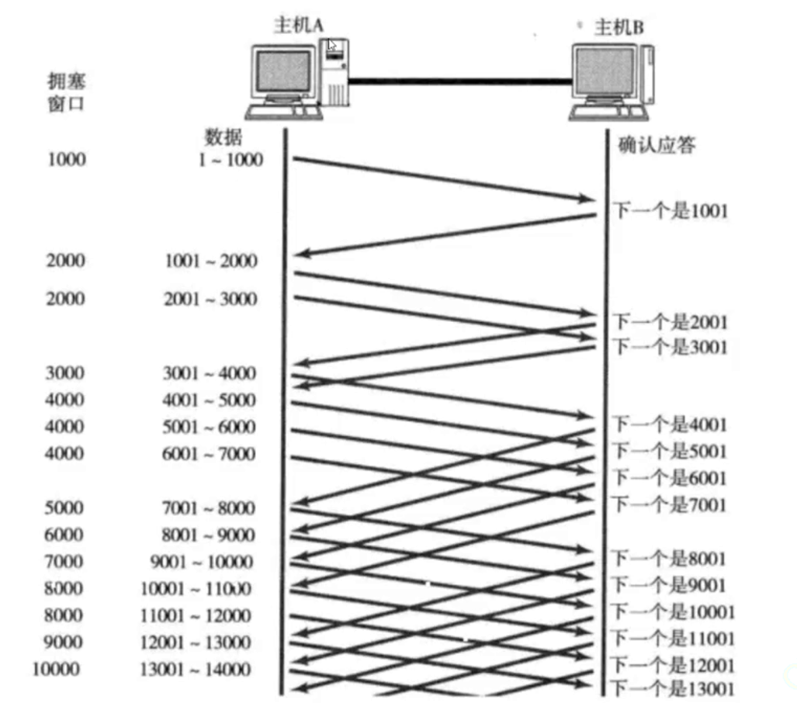
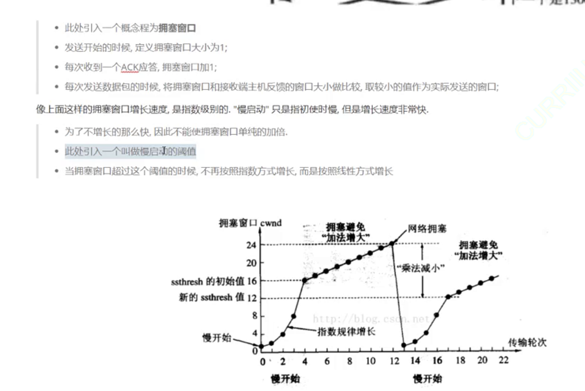

>   前要：在 `TCP/IP` 协议中，用 `源IP + 源PORT + 目的IP + 目的PORT + 协议号` 五元组就可以确定两进程之间的通信（可以使用 `netstat -nltp` 来查看），下面是 `netstat` 命令的常用参数（有些需要 `sudo`）为 `nltp/nlup`：
>
>   1.  `-n`：拒接显示别名的进程，则使用数字格式显示地址和端口号，而不进行 `DNS` 解析
>   2.  `-l`：仅显示正在侦听的端口
>   3.  `-t`：显示 `TCP` 连接
>   4.  `-u`：显示 `UDP` 连接
>   5.  `-p`：显示建立相关链接的程序名
>   6.  `-a`：显示所有连接和侦听端口（不加这个参数的话，默认不显示 `LISTEN` 相关）
>
>   另外还有一个指令 `pidof 服务名称` 得到对应 `pid`，再利用管道结合 `xargs kill -9` 即可杀死该命令（`xargs` 可以将标志输入转化为命令行参数交给命令行，类似还有 `ls | xargs touch` 来更新所有文件的改动时间）。

# 1.细谈端口号

1.  **系统端口（Well-Known Ports）**：`0` 到 `1023`，这些端口号通常用于一些常见的服务，比如：
    *   SSH: 22 端口
    *   HTTP: 80 端口
    *   HTTPS: 443 端口
    *   ftp: 21 端口
    *   Telnet: 23 端口
    *   SMTP: 25 端口
    *   POP3: 110 端口
    *   IMAP: 143 端口
    *   DNS: 53 端口
    *   SMB: 445 端口
    *   NFS: 204 端口
2.  **注册端口（Registered Ports）**：`1024` 到 `49151`，这些端口号用于用户定义的服务或应用程序，需要经过 `IANA` 注册。
3.  **动态和/或私有端口（Dynamic and/or Private Ports）**：`49152` 到 `65535`，这些端口号用于客户端和服务端之间的动态分配，通常不固定于特定的应用程序或服务。

>   补充：可以使用 `cat /etc/services` 查看这些端口号。

# 2.传输层两大协议

从应用层往下开始的传输层会更加原生，应用层的用户直接使用接口完成对应的服务（例如字符传输），而传输层上下都有协议，因此必须解决两个问题：

-   如何分离
-   如何交付

## 2.1.UDP 协议

### 2.1.1.报头属性


上层传递要作为自己的有效载荷，传递给下层要加上报头。而下层传递要作为自己的报文，传递给上层要去除报头。

`UDP(User Datagram Protocol)` 的报头就是固定长度的 `8` 字节信息，如果采用固定的报头，可以方便后续把报头和有效载荷分离，进而提取报头的有效属性（这里也就是为什么 `uint_16`）。而长度的设定就可以让 `UDP` 具有将一个报文完整读取，也就是 `UDP` 是面向数据报的。

报头、报文究竟是什么？

```cpp
//报头
struct udp_hdr
{
	uint32_t src_port:16;  
	uint32_t dst_port:16;  
	uint32_t udp_len:16;  
	uint32_t udp_check:16;  
};
```

操作系统在内核层时，创建一个内存空间存储 `udp_hdr` 的实例化对象，而添加报头实际上就是把报头实例化对象拷贝到报文中，这就是封装报头，整体作为 `UDP` 报文，假设这个整体依靠一个 `void* start` 来指向。而报头解析实际上就是强制类型转化 `(struct udp_hdr*)start->...`，只要拿到报头指针，根据固定的字节长度，就可以移动指针到报文部分，而报头内又有报文长度信息，就可以截取到整个报头，从内核拷贝给用户就可以进行交付。

### 2.1.2.协议特点

大量的报文就需要被管理，就会提到 `skb`，这个我暂时不考虑。

>   注意：位段这种东西可移植性可能不太友好，上述只是简单原理阐述，内核实现的实际情况会可能会非常复杂。

`UDP` 的不可靠（不是缺点）在于，如果 `UDP` 的数据包丢弃了、校验失败了也不关心、不重传，但是代码维护必然简单、开发效率高。并且不会对报文拆分，怎么发就必须怎么收，也就是面向数据报。

如何理解 `sendto/recvfrom/write/read/recv/send` 等 `IO` 接口呢？实际上不是直接在网络中读写，这些函数实际是拷贝函数，是数据的搬运工（通过缓冲区，如果有的话）。至于什么时候发、发多少、出错了怎么办...就是传输层（或者说内核）所关心的。

但是 `UDP` 不太需要发送缓冲区，调用 `sendto()` 的时候会直接交给内核，在往下层通过网路发送出去。但是 `UDP` 具有接受缓冲区，但是这个缓冲区不保证收到的 `UDP` 报文的顺序和发送 `UDP` 报文的数据一致，有可能导致乱序，这也是一种不可靠性。

全双工只要互相不影响接受缓冲区就行。

`UDP` 的大小其实有点小，`UDP` 长度限制的原因。

基于 `UDP` 协议的应用层协议有很多：

基于 `UDP` 协议的应用层协议有很多，以下是其中一些常见的：

-   **NFS(Network File System)**：是一种网络分布式文件系统
-   **TFTP(Trivial File Transfer Protocol)**：`TFTP` 是一个简单的文件传输协议，通常用于在局域网内传输小文件
-   **DHCP(Dynamic Host Configuration Protocol)**：`DHCP` 协议用于动态分配 `IP` 地址和其他网络配置参数
-   **BOOTP(Bootstrap Protocol)**：是另一个基于 `UDP` 的应用层协议。它用于在网络启动过程中为计算机分配 IP 地址和其他配置信息
-   **DNS(Domain Name System)**：`DNS` 协议用于域名解析，将域名映射到 `IP` 地址
-   **SNMP(Simple Network Management Protocol)**：`SNMP` 协议用于网络设备的监控和管理

## 2.2.TCP 协议

### 2.2.1.报头属性

`TCP(Transmission Control Protocol)` 结构如下。


如何分离、如何交付？`TCP` 报头是变长的，变长的数据在选项里，由 `4` 位首部长度来决定，但是有单位，是 `4` 字节，也就是 `4*15=60` 字节，也就是 `[20, 60]` 个字节，因此首部范围就是 `[5, 15]==[0101, 1111]`。

提取 `20` 字节，进一步获取首部长度 `*4-20` 查看是否得到 `0`，是 `0` 就 `done`，否则就是选项的长度，读取选项的字节数据即可，自此读完了整个报头，剩下的就是报文数据。

这就是解包的过程，而封装的过程和之前的类似。并且 `TCP` 没有关于报文长度的大小，只有报文长度的大小，这是因为面向字节流的特性原因（保证数据完整性需要应用层来保证）。

而报头实际上就是一个数据结构。

那么 `TCP` 的可靠性怎么理解？不可靠的原因是什么？两台计算机之间的中间设备过多、距离过长，导致数据丢包。

网络中不存在百分百可靠（最新数据的发送无法保证可靠性 ），但是在局部可以做到，只要旧发送消息可以接受到匹配的回应就可以保证百分百可靠（回答了就可以保证对方一定接受到了）。

而这个确认应答的机制由序号和确认序号来完成。

客户端可能向服务端发送多个报文，就有发送顺序的问题，发送的顺序不一定是接受的顺序，但是客户端如何确定哪一个应答对应哪一个请求呢？

每一个报文一定是携带了完整的报头。

而这个 `TCP` 报文的发送会携带序号，填充 `32` 位序号，发送回来的时候在确认序号中 `+1`，这样请求和应答就需要一一对应。确认序号对应的数字，表示之前收到的报文已经全部收到了，下次发送就应该从此时的序列号开始发送。允许部分确认丢失，或者不给应答。

为什么搞两个序号呢？是因为 `TCP` 是全双工的，服务端有可能既想给对方确认，又想给对方发消息（发回消息本身就是一种应答）。

而乱序问题也不用担心，`TCP` 的每次发送，都会携带序号，只需要进行排序就行，就可以保证按需到达。

序号的可靠性保证作用有两个：一个是确认应答，一个是按序到达。

保留 `6` 位留作扩充准备，暂时不提。

`16` 位窗口大小呢？`TCP` 是存在接受缓冲区和发送缓冲区的。

`TCP` 叫做传输控制协议，就是因为在进行 `IO` 操纵的时候就是当初拷贝到缓冲区，然后 `TCP` 协议自行进行控制的。

这样就有两对接受和发送缓冲区，此时就可以支持全双工通信的原因。

但是发送方如果过快就会导致接收方丢包，过慢就会导致效率问题。那如何控制这个速度呢？很显然这个速度把控不能由发送方来决定，而是应该等待接收方的应答，同步接受能力。那接受能力怎么判定呢？接受缓冲区中剩余空间的大小即可控制速度（流量控制）。

`16` 位窗口大小就是接受缓冲区剩余的大小。

每次应答都一定会接受到报头，报头内的 `16` 位就是填自己的剩余缓冲区大小，再发回给对方。通信过程中就会不断进行滑动窗口大小的交换。

校验位就是拿来判断是否丢弃的问题（校验失败就丢弃）。

`6` 个标志位（也有可能是 `8` 位），一个标志位表示某种含义。常规报文、建立连接报文、断开连接报文、确认报文...不同报文对应的处理方式是不一样的。因此该标记为就是用来区分报文的类型，用来做不同的处理动作。

各个标记位也有自己的含义：

-   SYN：为连接连接报文
-   FIN：为断开连接报文
-   ACK：为应答报文，大部分设置为 `1`
-   URC、PSH、RST：待补充...

`TCP` 建立和断开连接的过程，什么是连接？怎么理解三次握手和四次挥手？

客户端发起向服务端的连接请求，大量的客户端连接就需要被服务器管理起来，因此建立连接成功的时候，就是在内核中创建对应的数据结构对象，然后再使用某种数据结构进行管理（转化为对连接的增删查改），因此维护链接就是有成本的。



那三次握手是什么？发送的时候就是发送 `TCP` 报文（包含报头和报文），类型是 `SYN`，而服务端就必须返回一个 `TCP` 报文（包含报头和报文），类型是 `SYN+ACK`，客户端再发送 `ACK` 类型的 `TCP` 报文（很多教程和示例图只发送了类型并且没有点明，实际上应该是整个报文被发送出去）。

客户端刚发送时就会处于 `SYN_SEND` 状态，服务端收到这个请求并且返回应答时就会处于 `SYN_RECV` 状态，而如果客户端接收到了服务端的应答并且将报文发出，就会处于 `ESTABUSHED` 状态，而服务端接受到该报文也会处于 `ESTABUSHED` 状态。

图示为斜线表示时间延迟的问题。那三次握手是不是一定需要成功？不是，只需要较大概率成功就行（特别是最后一次，不一定保证能成功）。

另外对于各方而言，都需要进行 `3` 次“发/送”操作。

那最后一次怎么办呢？而且为什么需要 `3` 次呢？

`1` 次怎么样？如果客户端发送大量的 `SYN` 类型的 `TCP` 报文，那服务端只要收到一次就建立连接的话，很快就会把服务端资源吃完（也就是 `SYN` 洪水），只要客户端够多，哪怕客户端挂掉了，服务端也需要维护大量的连接，当然也并不是全部都是这个原因。

`2` 次握手呢？只要服务端返回 `ACK` 就建立连接的话，服务端无法保证自己返回的 `ACK` 被客户端接受到，而如果客户端不理会这个 `ACK`，甚至是直接丢弃，也会导致服务端的连接被挂满（只要客户端的连接数量够多）。

那为什么 `3` 次可以呢？因为服务端有连接时，客户端也会被迫保证有连接，此时双方都需要维护连接资源，就可以一定程度避免普通机器吃服务端资源连接的可能性（一般单机比服务端的资源要少，再还没有吃完服务端之前自己就先挂了），当然这只是避免单机的情况，但总比前面的好一些。

这些设置虽然不能很好避免各种攻击手段，三次握手只是顺带有这些功能罢了（最多就防止小白用户）。

三次握手的更深层意义呢？验证全双工，保证客户端和服务端两端都可以“发/收”，验证某一端可以进行全双工。

那四次呢？最后一次一定是 `server` 发起的，如果这一次发起对于客户端来说是丢弃的，服务端不知道，认为自己连接建立好了，偶数次握手，连接成本都在服务端。

客户端有可能在第三次建立连接的后续就把数据发送，如果 `ACK` 丢失，一旦服务器还没有收到 `ACK` 先收到后续的数据就会被服务端检测到连接异常，服务器此时就会发送带有 `RST(连接重置)` 的响应，此时客户端接收到就会关闭连接，重新发起三次握手（但是这种第一次就连接不上的情况较少，更多是未来通信中，服务端认为连接出现问题，但是客户端不知道，就会让客户端重置）。

`PSH` 类型报文就会让服务端滑动窗口发送为 `0` 后，督促服务端赶紧把数据向上交付给上层（后面提怎么交付）。

如果 `TCP` 报文需要插队发送呢？就需要 `URG(紧急标志位)` 配合 `16` 位紧急指针（指向有效载荷的紧急数据，实际是偏移量），然后把紧急数据提前交付（紧急数据只有一个字节）。

紧急数据的目的是什么呢？服务器被卡住了，客户端可以用紧急数据询问服务端的机器状态，而服务器也可以通过紧急数据来返回告知机器状态。

那如何理解四次挥手呢？假设客户端发送断开连接的请求 `FIN`，进入 `FIN_WAIT_1` 状态，服务端收到然后就会返回 `ACK`，进入 `CLOSE_WAIT` 状态，客户端接收到后，就会进入 `FIN_WAIT_2`，服务端立刻进入 `LAST_ACK` 状态

服务端也进行 `FIN` 后，客户端收到进入 `TIME_WAIT` 状态然后发送 `ACK`，服务端接受到后就进入 `CLOSED`。

有没有一种可能 `ACK` 和 `FIN` 被同时设置呢？可以四次挥手在特定场景下也有可能变 `4` 次。

`4` 次挥手也一定成功么？不一定...

如果发现服务器具有大量的 `CLOSE_WAIT` 说明什么？说明应用层有 `bug`，忘记关闭 `sockfd` 套接字。




客户端多次关闭后如上。

如果服务端先关闭了也会陷入 `TIME_WAIT`（时间和系统和用户设置有关），反映到上层就是无法绑定套接字（这个状态时已经结束了四次挥手了）。

这里还可以考虑 `setsockopt()` 地址复用，让服务端在 `TIME_WAIT` 期间也可以进行重启。


维持这个状态的原因是，有可能网络中滞留一些数据，让处于该状态的一端将剩下的历史数据在 `2MLS` 时间的网络中消散（方便第二次连接时导致旧数据残留...）。

```shell
# 查询 TIME_WAIT 的大小
$ cat /proc/sys/net/ipv4/tcp_fin_timeout
60
```

还有一个可能就是如果一端直接进入 `CLOSED`，万一 `ACK` 丢失，就会导致另外一端无法重传 `FIN`，进而超时

### 2.2.2.协议特点

可靠

**确认应答 `ACK` 机制**，为了保证可靠性，发送数据时对方必须进行应答。当收到 `ACK` 应答后对方是一定收到的，历史数据确保了两个方向的可靠性。

并且每个数据段（`TCP` 报文）都会携带序号。


可以把发送缓冲区理解为 `char` 数组，因此每个字节的数据就具有了序号（下标），所以发送数据的时候就有编号（最后一位作为序号发送）。应答加 `1` 就是往后读。

这种用字节流保存的数据就是面向字节流的。

**超时重传机制**，如果数据发生了丢包（或者应答发生了丢包），一端没有接受到应答，就会经过特点的时间间隔（超时时间）进行重传。

但是有一个问题，如果是 `ACK` 丢失了，那另外一端不就收到两份同样的数据了？

如果总是丢 `ACK` ，超时重传机制就会导致数据冗余数据，但是另外一端是可以通过序号来去重的，这点不用担心。

那超时具体应该设置时间为多少？过多喝过少都不行，而且网络环境还随时间和地点不同，因此就必须是动态调整的时间。

`Linux` 内核中（`BSD Unix、Windows` 而是如此）超时以 `500ms` 为一个单位进行控制，每次判定超时重发的时间都是 `500ms` 的整数倍。如果重发一次后仍然得不到应答，则会等待 `2*500ms` 在进行重传，以此类推，直达累积到一定的重传次数，`TCP` 就会认为网络或者对端主机出现异常，强制关闭连接。

**连接管理机制**，就是握手和挥手的状态变化过程。

**三大机制：流量控制、拥塞控制、滑动窗口。**

接收端处理数据的速度是有限的，如果发送端发的太快，导致接收端的缓冲区被打满, 这个时候如果发送端继续发送，就会造成丢包，继而引起丢包重传等等一系列连锁反应。

因此 `TCP` 支持根据接收端的处理能力, 来决定发送端的发送速度，这个机制就叫做 `流量控制(Flow Control)`。

接收端将自己可以接收的缓冲区大小放入 `TCP` 首部中的“窗口大小”字段, 通过 `ACK` 端通知发送端。

窗口大小字段越大, 说明网络的吞吐量越高。接收端一旦发现自己的缓冲区快满了, 就会将窗口大小设置成一个更小的值通知给发送端。

发送端接受到这个窗口之后, 就会减慢自己的发送速度。如果接收端缓冲区满了, 就会将窗口置为 `0`。这时发送方不再发送数据, 但是需要定期发送一个窗口探测数据段，使接收端把窗口大小告诉发送端。

接收端如何把窗口大小告诉发送端呢? 回忆我们的 `TCP` 首部中, 有一个 `16` 位窗口字段, 就是存放了窗口大小信息。

那么问题来了，`16` 位数字最大表示 `65535`, 那么 `TCP` 窗口最大就是 `65535` 字节么? 实际上, `TCP` 首部 `40` 字节选项中还包含了一个窗口扩大因子 `M`，实际窗口大小是窗口字段的值左移 `M` 位（但是处理调整这个因子，还有可能需要调整链段的读写缓冲区）。

另外，流量控制也是两个方向的流量控制。

第一次发送数据不等于第一次做数据交换，早在三次握手的时候就交换重要的报文（尽管没有有效数据载荷，但是报头交换了）。

而窗口探测实际上就是空有效载荷和 `TCP` 报文。

实际工作中，对端还有可能发送窗口更新通知，因此窗口探测和窗口更新通知可能会同时进行使用。

滑动窗口实际上就是 `TCP` 为效率做出的努力。应答策略中，每一个发送的数据段，都要给一个 `ACK` 确认应答。收到 `ACK` 后再发送下一个数据段。

但是这样做性能较差，尤其是数据往返的时间较长的时候。既然这样一发一收的方式性能较低，那么我们一次发送多条数据，就可以大大的提高性能。

窗口大小实际上就是发送数据的最大值。将多个段的等待时间重叠在一起了。

窗口大小指的是无需等待确认应答而可以继续发送数据的最大值 `4000` 个字节，四个
段。发送前四个段的时候，不需要等待任何`ACK`，直接发送即可。

收到第一个 `ACK` 后，滑动窗口向后移动，继续发送第五个段的数据，依次类推。

操作系统内核为了维护这个滑动窗口，需要开辟发送缓冲区来记录当前还有哪些数据没有应答，只有确认应答过的数据, 才能从缓冲区删掉。

窗口越大，则网络的吞吐率就越高。

滑动窗口既想给对方推送数据，又想保证对方有能力接受数据。


那么如果出现了丢包, 如何进行重传? 这里分两种情况讨论。





情况一：数据包已经抵达，`ACK` 被丢了。这种情况下，部分 `ACK` 丢了并不要紧, 因为可以通过后续的 `ACK` 进行确认


情况二：数据包就直接丢了。当某一段报文段丢失之后，发送端会一直收到 `1001` 这样的 `ACK`，就像是在提醒发送端“我想要的是 `1001` 一样”。


如果发送端主机连续三次收到了同样一个 `1001` 这样的应答, 就会将对应的数据 `1001-2000` 重新发送。

这个时候接收端收到了 `1001` 之后, 再次返回的 `ACK` 就是 `7001` 了（因为 `2001~7000`）接收端其实之前就已
经收到了, 被放到了接收端操作系统内核的接收缓冲区中（能直接回应 `7001` 说明历史的数据也被获取到了）。


并且，这种滑动窗口机制的发送缓冲区是环形的，不可能出现越界的问题。

这种机制被称为“高速重发控制”（也叫“快重传”机制）。

那为什么还需要超时重传呢？因为快重传是有条件的（必须受到三个连续的）。

如果最多发送两个 `TCP` 报文，那么最多收到两次 `ACK`，如果第一次的数据就丢失了，后续没有其他数据报文了，导致无法三次，最后无法快重传（并且也有可能导致三次应答中有些应答丢失），两者是互补的。

**拥塞控制**，但是作为服务器，还不仅仅是端对端的事情。还关于网络的问题。

需要关注网络的监控状态，如果出现大量丢包，真的需要重传么？如果网络状态极其糟糕，就不是两端的问题，这个就是网络阻塞的现象，此时继续重传更会阻塞网络。

这种现象更常见出现在局域网中。

因此 `TCP` 引入了慢启动机制，先发少量数据摸摸网络情况。



还有一个拥塞窗口的概念，单台主机一次向网络中发送大量数据时，就会引发网络拥塞的上限值。

因此实际上窗口大小应该是 `min(拥塞程度, 对端接受能力) = min(拥塞窗口数字, 反馈滑动窗口大小)`。



前期慢后期快的指数增长很符合试探和尽快恢复正常的网络通信。

如果网络一直不拥塞，理论上拥塞窗口会一直线性增长。

尽快传输给对方又避免网络压力过大的方案。

某些角度上，`TCP` 不一定比 `UDP` 慢，`TCP` 也对速率经过优化。

**延迟应答**，怎么保证对方同步给自己更大的接受能力呢？如果对端收到数据后立刻应答，那么窗口可能比较小（这是肯定的，因为本次发送了很多数据过去）。

这个时候等待上层取走缓冲区后再应答，就可以提高吞吐量，进而提高传输效率（因为实际上对端读取缓冲区的速度有可能很快）。

-   每隔 `N` 个包应答一次
-   超过最大延迟时间就应答一次

**捎带应答**，不需要严格一发一收，可以把应答和其他数据合起来发送，也就是“捎带”。


>   这里写笔记的时候，UDP 和 TCP 的结构都先提及一下，然后发送流程给出图示，然后给出解释和特点。

