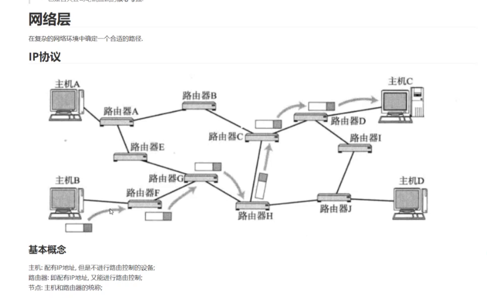
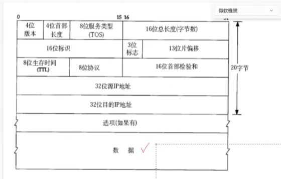
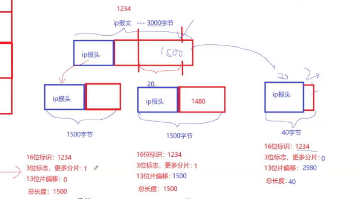
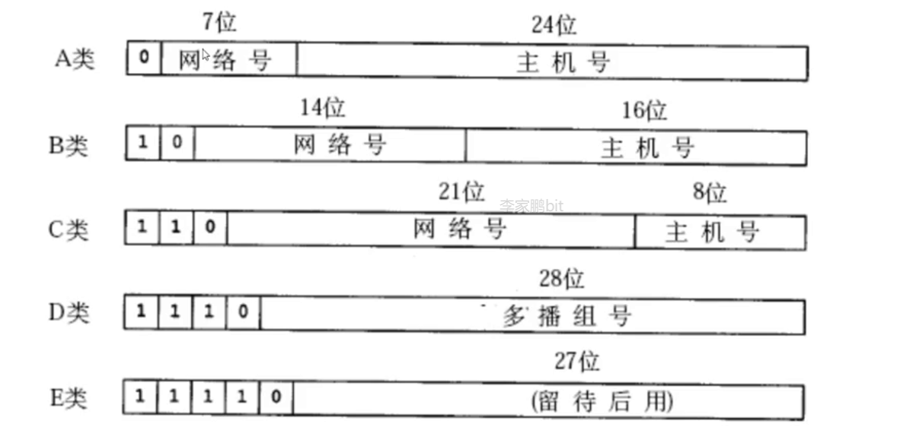
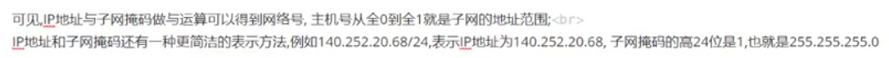
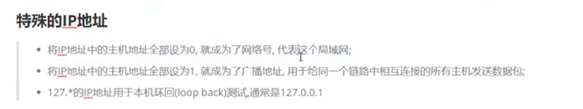
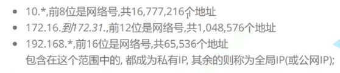

网络层我们只提及 `IP` 协议。

主机可以配有 `IP` 地址，路由器可以被称为主机，但是不仅具有 `IP`，又可以进行路由控制。

节点就是主机和路由器的统称。

# IP 协议格式

数据就是 `tcp` 的数据段，如何封装和解包的问题和之前的差不多。前 `20` 个字节也是固定的，`4` 位首部长度，减去 `20` 字节就是选项字节（定长报头+自描述）。

`8` 位协议可以用来标识 `UDP` 或者 `TCP`，用来辅助向上交付。

`4` 位版本填写的就是 `ipv4`（这是什么东西？和 `ipv6` 有什么区别？`ipv4` 就是用 `4` 字节来表示 `ip` 地址）。

IPv4是互联网上最常用的协议，它使用32位地址来唯一标识网络上的设备。IPv4地址通常用点分十进制表示，如192.168.1.1，每个部分取值范围是0到255。由于IPv4地址空间有限，约42亿个地址，随着互联网的发展，IPv4地址资源已经耗尽（但是“如耗”），并且面临着地址短缺的问题。

IPv6是IPv4的后继版本，旨在解决IPv4的地址耗尽问题。它采用128位地址，比IPv4的地址空间大得多。IPv6地址通常使用冒号十六进制表示法，如2001:0db8:85a3:0000:0000:8a2e:0370:7334。IPv6地址空间极大，约为3.4 × 10^38个地址，足够满足未来的互联网需求。IPv6还提供了一些其他功能，如改进的安全性和配置选项。

>   吐槽：底层技术的发展比较稳定，`ipv4` 和 `ipv6` 不兼容。

首部长度用 `4` 个比特位表示会不会有点少？其实不会，首部长度的基本单位是 `4` 字节，刚好就是整个报文的宽度，因此最低填 `20/4` 最高填 `60/4`。

`8` 位的服务类型：

保留位做保留，暂不使用。

`10` 位总长度包含整个 `IP` 报文，因此 `有效载荷=16位总长度-4位首部长度*4`。

`8` 位生存时间（`TTL`），为了防止网络中环路、黑洞的存在，因此就需要设置生存时间，让其消散。没经过一个节点就会做 `--`，就会被视为丢弃。

`16` 位首部校验和如果没有通过就会被丢弃。

接下来的两个 `IP` 就比较简单理解了，`IP` 就是用在网络层、`port` 就用在传输层。`IP` 报文本身就决定了自己该从一台主机往哪一台主机。

另外我们会发现，`TCP` 报头和 `IP` 报头结构上有点像。

`16` 标识和 `3` 位标识，`13` 位片偏移呢？和下层链路层有关。由于物理特性的原因，一般无法转发太长太大的数据，这个上限大小一般是 `1500/MTU(最大传输单元)`。

如果网络层向下交付了 `2500` 字节的数据，因此就需要对数据做数据分片分别发送。

分片和组装的工作应该交给 `IP` 协议，不应该交给数据链路层（只有网络层才知道这么进行更好的分片，就行快递分包不应该交给快递公司来决定）。

实际上上层才是决定发多大数据的，但是下层又有发送大小限制，因此网络层两头都不好做，只能进行分片。

分片相当于对上层报文的数据进行了一定程度的污染，因此交付上层时就必须进行净化（多个分片的 `TCP` 报文的报头可能被误认为是一样的）。

对于 `TCP` 来说，`IP` 分片和组装的行为是不关心的，无感知的。

那怎么分片呢？`16` 位标识是 `ip` 报文的序号，`3` 位标识中一位保留，二位标识禁止分片（比如测试不同网络地层最大的分片大小，如果报文长度又超过 `MTU`，该 `IP` 报文就会被丢弃），三位标识更多分片，如果分片了其他分片是写 `1`，但是最后一个写 `0`，类似结束标志。

而偏移实际就是指针偏移量。

但是分片不是主流，在网络通信中可能不需要分片。

-   识别报文和报文的不同，网络层中数据不会被积压，在对方网络层中基本不会出现相同序号的报文。因此相同报文的分片这里的标识相同。
-   识别报文是否被分片，可以通过 `3` 位标志位中的更多分片位被置 `1` 就代表被分片，那最后一个分片怎么办？其 `13` 位片偏移一定不是 `0`，因此可以被区分
-   识别那些分片是开始、中间、结束，结合分片标志位和片偏移即可。
-   异常怎么处理？分片丢失怎么办？怎么保证收全了？前一个分片的偏移量加上自身大小等于下一个即可。排序偏移量，再扫描检测完就完成了组合工作。
-   因此每个分片都必须有 `ip` 报头，否则上述的排序和组合都不会存在。

值得注意的是 `ip` 报头本身也是数据，也会被 `MTU` 限制，因此整个报文也不能超过 `MTU`。

分块为什么不是主流？很简单提高了报文丢失的概率，因此一定是需要上层配合。

从路面开始，如何看待全球 `ip` 地址？`ipv4` 有 `2^32` 划分给不同的国家，前 `8` 位标识国家。

`ip` 地址本身也是一种国家资源，谁评估？谁划分？谁假设？和国家与各国的运营商来决定。

`ip` 地址会进行网段划分，划分为 `网络号+主机号`，网络号就是标识不同区域使用的，主机号，根据不同层来划分不同的网络号。

同一个局域网内网络标识都是一样的，而主机标识一定是不一样的。

先根据网络号在路由表转发过程中，不断变长，但是范围不断收敛。

网络距离变长时，可靠性、效率、定位就是显著的首要问题。

有一种 `DHCP` 技术，可以自动为子网内分配 `IP` 地址，功能强大。

那子网怎么划分呢？早期是做了简单的划分，但是太过于简单，这种划分方法是不够的。

新的划分方案是基于子网掩码的 `CIDR` 技术。引入额外的子网掩码来区分网络号和主机号。

子网掩码也是一个 `32` 位的正整数，通常用一串 `0` 来结尾。

将 `ip` 地址和子网掩码 `&` 操作，得到的就是网络号。

举个例子：

`IP` 地址的数量还是有些限制，还有其他的做法：

-   动态分配 `IP` 地址，转手给其他设备（提高使用率）、
-   `NAT` 技术
-   `ipv6` 直接扩容，但是推广较难

公网 `ip` 和私网 `ip` 的理解。

`ip` 还被划分为公网 `ip` 和私网 `ip`，理论上所有 `ip` 都可以作为私网 `ip` 来使用，但是 `RFC 1918` 规定嫩用于组建局域网的私有 `ip` 地址必须满足：

