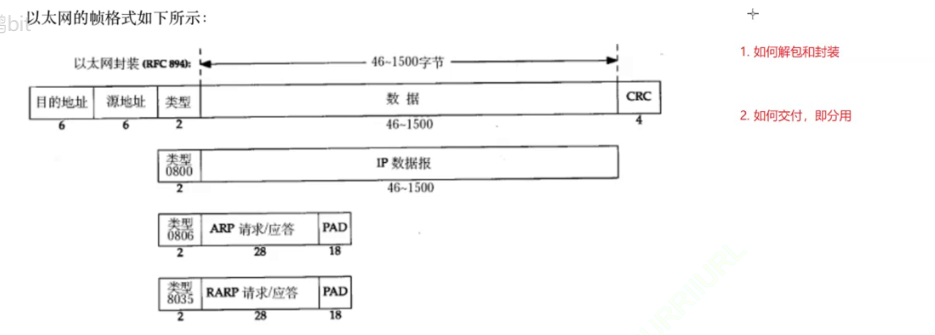
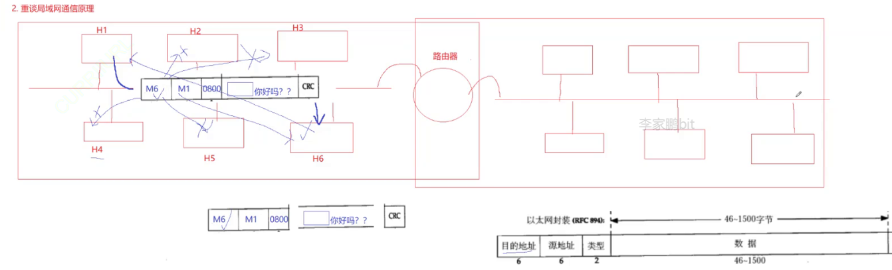
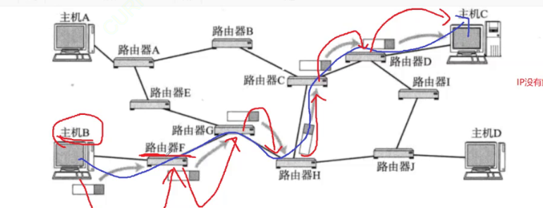
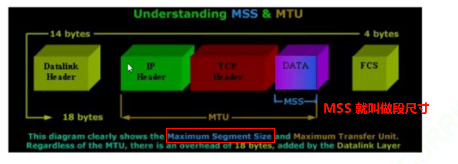
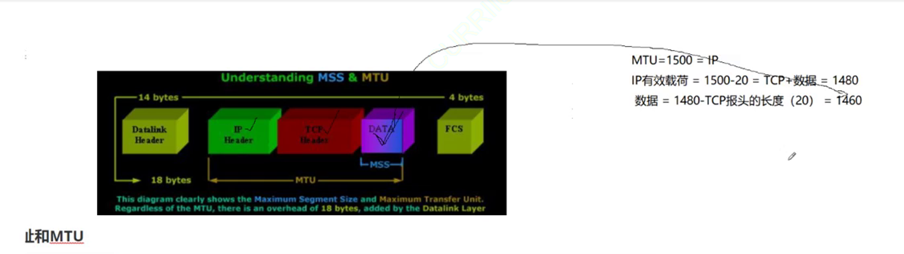
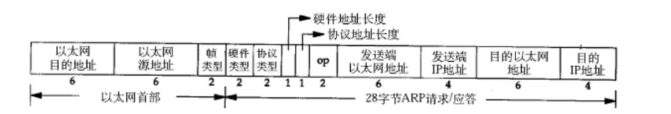
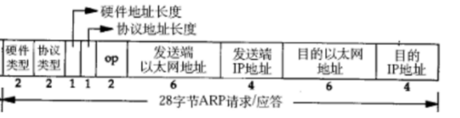
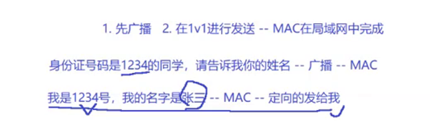
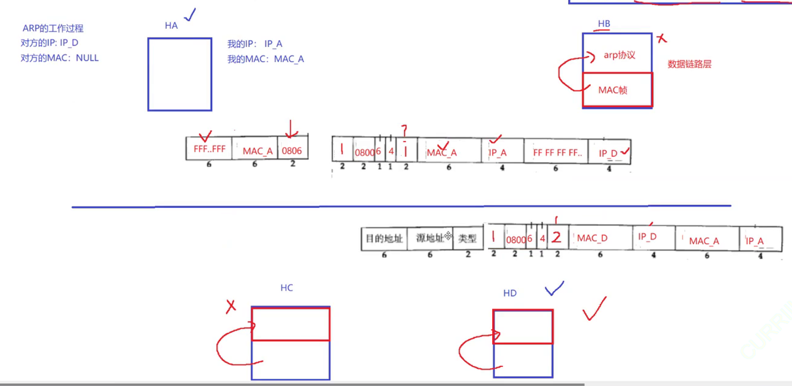

上网要先做什么？需要运营商在附近有网络覆盖，联系运营商，工作人员上门，调制解调器（猫）。

早些时候物理学家假象光的介质为以太，结果最后发现不存在。

局域网的起名和这有些巧合，因此以太网实际上就是一种局域网技术。除了以太网，局域网还可以使用无线局域网（`Wi-Fi`）、令牌环（`Token Ring`）等技术来实现设备之间的通信。

以太网协议就是一种数据链路层的协议。

以太网的帧格式如下：

这里的目的地址和源地址填写的是 `MAC` 地址（物理地址），用于识别数据链路层中相邻的节点，不使用 `IP` 的主要原因很可能是解耦。数据填充 `IP` 报文。

其解包过程很简单，报头也是定长的，很容易分离和交付，需要根据 `2` 字节类型来向上交付，有 `0800\0806\8035` 等类型。

**局域网原理**，实际上一个局域网内的所有计算机都收到消息（广播），但是只有对应的计算机两者会相互对应（都会根据链路报文进行对不，源和目的 `MAC` 地址不符合就丢弃，符合就保留进行数据分离然后向上交付）。

而路由器本身就有 `MAC` 地址，就可以在不同路由器之间进行跳转。

但是这种方案是有点漏洞的，网络中会有大量的数据在发送（在喧嚣的人群中1对1交流），怎么保证我想发送数据的同时别人也想发呢？也就会出现数据碰撞问题。首先数据碰撞时，发送端是可以察觉到的。数据碰撞会导致数据无法使用，因此最好是避免碰撞，但是必须尝试碰撞才能知道是否碰撞，需要依赖碰撞算法，一定碰撞就会休息随机时间。

而且这个局域网实际上就是共享资源，因此这歌过程看起来有点像加锁，因此避免碰撞的思路和加锁解锁的思路有些类似，这里的解决方案就是试探，碰撞了就再试，直到成功（加锁失败就等待后重新加锁）。

因此局域网如果太大，出现碰撞的概率就越大（可以看到运营商的硬件强大之处）。

而交换机（桥接设备），只将数据包发送到目标设备，而不是广播到所有设备，因此可以减少网络流量，提高网络性能和效率（避免碰撞造成的垃圾数据扩散。并且数据帧如果发送到交换机的同一侧，就不需要再广播到另外一侧。因此交换机的最大作用就在于划分碰撞域）。

局域网数据帧发送的时候。越长越好还是越短越好？长的话就有可能会容易发生碰撞，如果太短了就会让传输效率变低。

因此一般会规定一个数据长度最小是 `46` 字节，最大字节未 `1500` 字节，不够 `46` 字节也需要补充位（也就是 `MTU` 的范围）。

如果我们绕过数据链路层的碰撞避免算法，就会导致一台主机不会因为碰撞进入休眠，而是不断发送数据，这个时候就是为了碰而碰，就会导致“碰撞洪泛（Collision Flooding）”的攻击。

在网络转化过程中，目的 `IP` 不变，`MAC` 帧报头会发生变化么？会的，并且变化很快！

但是下一跳的 `MAC` 地址怎么获取呢？这有点小 `BUG`，没有下一跳的 `MAC` 地址就没有办法进行封装。

每台计算机都有自己的 `MAC` 地址。

如果限定在 `TCP/IP`，则

`MSS` 不能大于 `1460`，`Linux` 下可以使用 `ifconfig` 来查询。

早在发送 `SYN(TCP连接类型报文)` 的时候，双方会得知各自的 `MSS` 值，协商选择较小的作为最终 `MSS`，这个值包含在 `TCP` 的选项中。

`ARP` 协议是介于数据链路层和网络层的协议。我们虽然没有 `MAC` 地址，但是有需要发送的目标 `IP` 地址。因此我们就需要在同一个网段中，通过目标 `IP` 解析出 `MAC` 地址，这个东西就是 `ARP` 协议，也就是地址解析协议（局域网协议）。

实际上这个协议可以算是一种子协议（以太网协议中有一个帧类型协议，就可以填入这种协议类型）。

下面过程就是 `ARP` 过程：

其中 `2` 字节的硬件类型指链路层网络类型（是以太网就是 `1`），协议类型指要转化的地址类型 `0x0800` 为 `IP` 地址，硬件地址长度对于以太网来说是 `6` 字节，协议地址长度对于 `IP` 地址来说为 `4` 字节。

`OP` 字段为 `1` 就是 `ARP` 请求，为 `2` 代表 `ARP` 应答。

发送端的以太地址（`MAC`地址）和发送端 `IP` 地址对发送端来说很容易获取，并且也直到目标 `IP` 地址，但是目标 `MAC` 地址暂时无法得知（会被设置为全 `f`）。任何主机都可以发送 `ARP` 请求，也有可能接收到别人的 `ARP` 请求，亦或者是别人的应答（因此可以使用 `OP` 来进行区别）。

然后通过广播来获取 `ARP` 应答（其他主机如果处理就是做向上交付，然后继续封装应答的操作，不处理就是向上交付后直接进行丢弃），`ARP` 应答就会把目的 `MAC` 填充回去做应答。

>   疑惑：arp 协议有上层么？还是为了确认 `MAC` 直接构造的？

对于主机收到 `ARP` 请求后，先看 `OP` 查看是否为请求，然后检查 `IP` 地址和自己本机的 `IP` 地址是否相同，相同就受到该请求，然后把自己的 `MAC` 地址填充进去，然后把 `OP` 修改为 `2` 为应答，然后继续进行广播。

然后发送端 `IP` 修改为自己的，将原本的发送端 `IP` 复制到目的 `IP`，然后把原来请求的 `MAC` 地址复制到 目的 `MAC` 地址即可。

上面示意图中，`以太` 协议报头和 `ARP` 中会冲突么？答案是不过，这是合理的（为了解耦）。

但这次就算是广播，不对应的主机也不会做应答了，因为 `MAC` 帧的目的地址和源地址（MAC地址）字段都可以被其他主机直接感知到，无需处理直接丢弃即可。

因此上述两次丢弃的场景是不太一样的。

接下来这个时候主机立马就意识到这是给自己的，然后也是先查看 `op` 是请求还是应答，再得到目的 `MAC` 地址，最终 `MAC` 帧的数据链路层协议就可以拿到 `MAC` 地址。

那是不是每次都需要进行 `ARP` 呢？是不是只会在目标最终的子网中进行 `ARP`，其他地方会不会生 `ARP` 呢？

如何通过 `ARP` 攻击，让自己成为攻击人呢？

