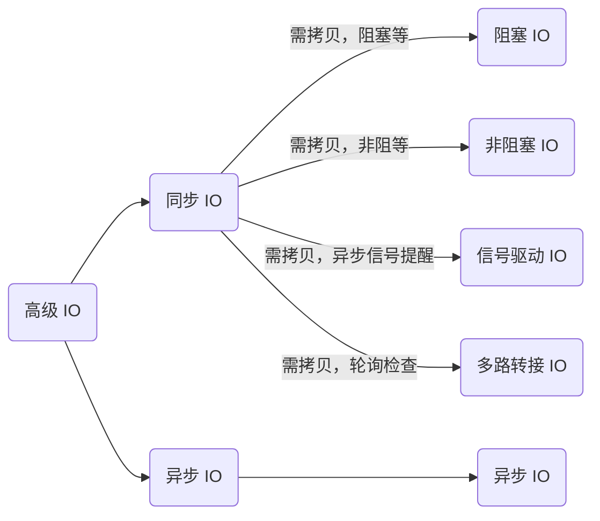
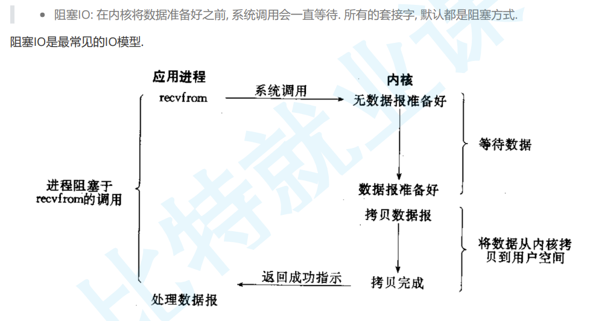
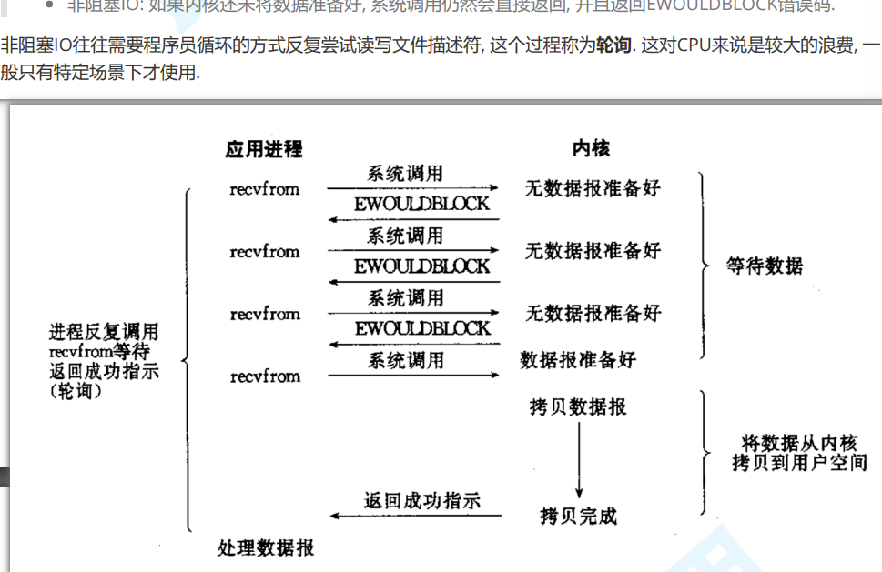
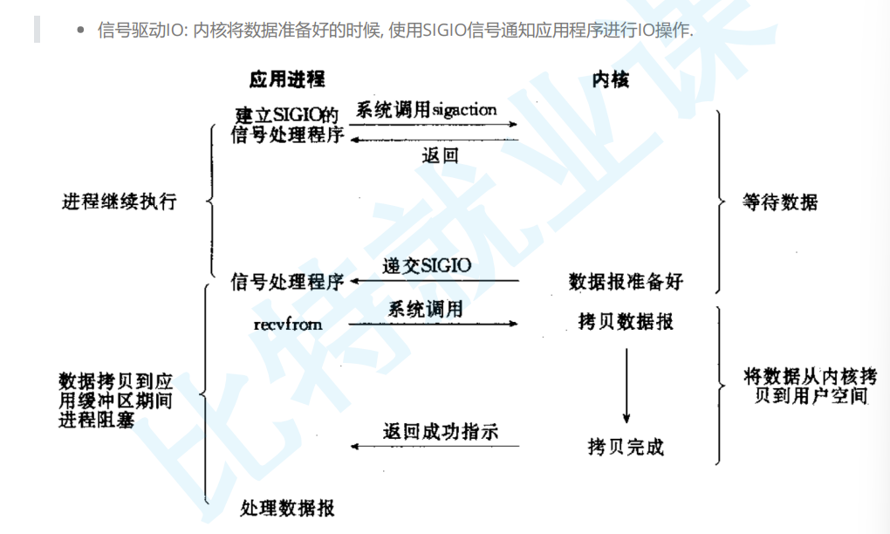
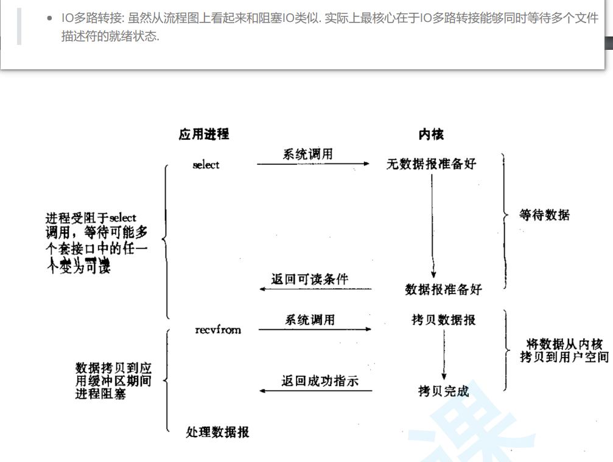
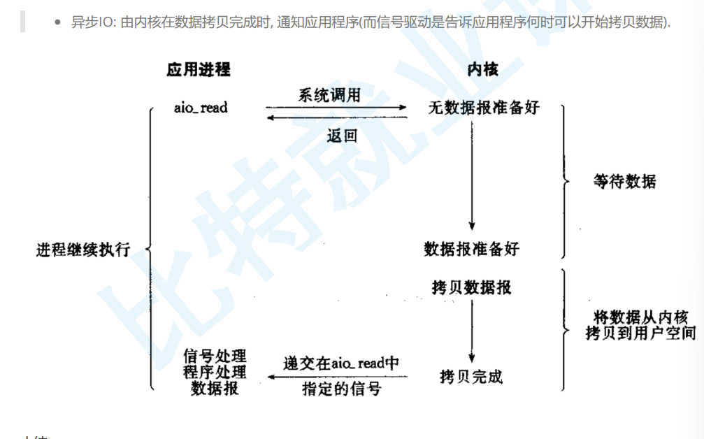
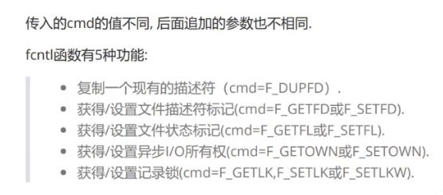

# 1.IO 模型

网络通信的深层就是 `IO`，但是 `IO` 为什么低效？

当 `read/recv` 的时候，如果底层缓冲区没有数据，那么就会进入阻塞，而如果有数据就会进行拷贝，阻塞的原理就是让进程加入到阻塞队列里，因此 `IO=wait+copy`。

当进程需要读取一个文件然后修改时，不一定全部把磁盘中的文件，有可能只加载文件的属性（暂时不加载文件内容，避免内存浪费），然后需要修改时，进程就会陷入等待中，等待文件的内容被拷贝读取，然后再做修改。

因此越是高效的 `IO` 就是越少等待、越少拷贝。尤其是等待，大部分 `IO` 操作都在进行等待，效率当然不高。


参与 `IO` 的过程就是同步 `IO`，而参与就是要么参与等待、要么参与直接拷贝、要么同时参与等待和直接拷贝。

前面讲的前四种都是同步 `IO`，其中信号驱动中，信号的产生确实是异步的，但是一旦数据就会参与 `IO`，信号发送之后就是同步 `IO`。

最后一种就是异步 `IO`，没等待也没直接拷贝就是异步 `IO`。

而其实等待是指两件事情（专业术语为 **IO 类事件就绪**）：

-   等待写缓冲区有空间可以写入
-   等待都缓冲区有数据可以读取


>   补充：等待一般都涉及到等待队列（资源队列）。

>	疑惑：为什么不跟主流概念？

## 1.1.阻塞 I/O（Blocking I/O）

在进行 I/O 操作时，阻塞 I/O 会导致调用线程被阻塞，直到 I/O 操作完成。在此期间，线程将无法执行其他任务。只有当 I/O 操作完成后，线程才会继续执行。



## 1.2.非阻塞 I/O（Non-blocking I/O）

非阻塞 I/O 允许调用线程继续执行，即使 I/O 操作没有立即完成。线程可以不断地轮询或询问 I/O 操作是否完成，而不会被阻塞。这样可以使得线程能够在等待 I/O 完成的同时执行其他任务。



## 1.3.信号驱动 I/O（Signal-driven I/O）

信号驱动 I/O 允许进程执行其他任务而不阻塞，直到 I/O 操作完成。当 I/O 操作完成时，操作系统会向进程发送信号来通知它。进程可以在信号到来时执行相应的处理。



## 1.4.多路转接 I/O（Multiplexing I/O）

多路转接 I/O 允许一个线程同时监视多个 I/O 操作的状态，并在其中任何一个 I/O 操作就绪时立即执行。它通常使用 select()、poll()或 epoll()等系统调用来实现。




>   补充：上述信号就是 `singleio` 信号。

## 1.5.异步 I/O（Asynchronous I/O）

异步 I/O 允许调用线程在进行 I/O 操作的同时继续执行其他任务，而不必等待 I/O 操作完成。当 I/O 操作完成时，操作系统会通知调用线程，然后线程可以处理已完成的 I/O 操作。



# 2.高级 IO

非阻塞 `IO`、纪录锁、系统 `V` 流机制、`I/O` 多路转接（也叫 `I/O` 多路复用）、`readv()`、`writev()`、存储映射 `IO`（`mmap`）统称为高级 `IO`。

## 2.1.fcntl()

如果我们需要非阻塞打开文件的话，就需要使用 `open()` 打开的时候就可以值得非阻塞选项，但是这里我们不使用这个，而选择更加统一的方式，使用 `int fcntl(int fd, int cmd, ...);` 



```cpp
//使用 fcntl()
#include <iostream>
#include <unistd.h>
#include <fcntl.h>

bool SetNonBlock(int fd)
{
    int fl = fcntl(fd, F_GETFL); //获取文件的读写标志位
    if (fl < 0)
        return false;
    fcntl(fd, F_SETFL, fl | O_NONBLOCK); //设置非阻塞
    return true;
}

int main()
{
    SetNonBlock(0);

    char buffer[1024] = { 0 };

    while (true)
    {
        ssize_t s = read(0, buffer, sizeof(buffer) - 1);
        if (s > 0)
        {
            std::cout << "echo >:" << buffer << std::endl;
        }
        else
        {
            std::cout << "read error" << std::endl;
        }
    }

    return 0;
}
```

但是如果真的出错了怎么办？只能使用 `<cerror>` 来中的 `errno` 变量来标识错误，不然分不清是出错还是没有可读取的数据，会被设置为 `errno=11`，也就是 `EWOULDBLOCK 或 EAGAIN`。而 `EINTR` 就代表 `IO` 过程被信号中断，需要再尝试一次。

>   补充：对了上述代码中，实际上 `std::cout` 也是阻塞的，只不过读取速度比较快。

## 2.2.select()

更加常用的教优 `IO` 模型是多路转接（虽然大部分都不会让您重新书写，以及有对应的库可以直接调用了）。

```cpp
//select()
#include <sys/time.h>
struct timeval {
    time_t tv_sec; //时间戳秒
    suseconds_t tv_usec; //微秒
};

int gettimeofday(
	struct timeval* tv, //输出型参数，返回系统特定时区的时间
    const struct timezone* tz //为空默认当前地区
); //返回是否获取


struct fd_set {
	//...
}; //是文件描述集，和信号集类似，就是一个位图结构

void FD_CLR(int fd, fd_set* set); //在位图中清除描述符
int FD_ISSET(int fd, fd_set* set); //在位图中查询是否存在对应的描述符
void FD_SET(int fd, fd_set* set); //在位图中设置描述符
void FD_ZERO(fd_set* set); //将整个位图所有位做置零


#include <sys/select.h>
int select(
	int nfds, //maxfd+1，实际上就是 fds 数组个数
    fd_set* readfds, //读取事件（输入输出型参数）
    fd_set* writefds, //写入事件（输入输出型参数）
    fd_set* exceptfds, //异常事件（输入输出型参数）
    struct timeval* timeout //阻塞模式
); //返回就绪的描述符个数（数据就绪、空间就绪）
//输入就是用户输入提醒系统需要关注的事件
//输出就是系统输出提醒用户哪些事件已就绪
```

该接口的核心工作就是帮助用户一次等待多个文件标识符，哪些文件标识符对应的资源就绪了，就要通知用户对应就绪的标识符有哪些，然后用户调用 `IO` 接口进行数据读取。

我们先来使用一下系统调用中的时间接口。

```cpp
//使用一下系统调用中的时间接口
#include <ctime>
#include <sys/time.h>
int main()
{
    std::cout << "time:" << (unsigned long)time(nullptr) << std::endl;
    
    struct timeval currtime = { 0, 0 };
    int n = gettimeofday(&currtime, nullptr);
    assert(n == 0);
    (void)n;
    std::cout << "time:" <<  currtime.tv_sec << "-" << currtime.tv_usec << std::endl;
    
	return 0;
}
```

并且 `select()` 的等待策略也可以被选择：

-   `timeout=nullptr`：阻塞式，准备好就返回
-   `timeout=(0, 0)`：非阻塞式，没准备好也返回
-   `timeout=(X, Y)`：`X’Y’’` 时间内阻塞，但时间到就返回

我们先来体验一下非阻塞的感觉。

```makefile
# makefile
all: clean select_server

select_server: main.cpp
	g++ -o $@ $^ -std=c++11

clean:
	rm -rf select_server log_dir
```

```cpp
//log.hpp

/* 文件描述
Log log = Log(bool debugShow = true,    //选择是否显示 DEBUG 等级的日志消息
    std::string writeMode = "SCREEN",   //选择日志的打印方式
    std::string logFileName = "log"     //选择日志的文件名称
);
log.WriteModeEnable();      //中途可以修改日志的打印方式
log.LogMessage(DEBUG | NORMAL | WARNING | ERROR | FATAL, "%s %d", __FILE__, __LINE__));     //打印日志
*/

#pragma once
#include <iostream>
#include <string>
#include <fstream>
#include <cstdio>
#include <cstdarg>
#include <ctime>
#include <pthread.h>
#include <unistd.h>
#include <sys/stat.h>
#include <sys/types.h>

//日志级别
#define DEBUG 0 //调试
#define NORMAL 1 //正常（或者叫 INFO）
#define WARNING 2 //警告
#define ERROR 3 //错误
#define FATAL 4 //致命

enum WriteMode
{
    SCREEN = 5,
    ONE_FILE,
    CLASS_FILE
};

const char* gLevelMap[] = {
    "DEBUG", //debug 模式
    "NORMAL", //正常（或者叫 INFO）
    "WARNING", //警告
    "ERROR", //非致命错误
    "FATAL" //严重错误
};

const std::string logdir = "log_dir";

//日志功能主要有：日志等级、发送时间、日志内容、代码行数、运行用户
class Log
{
private:
    void __WriteLogToOneFile(std::string logFileName, const std::string& message)
    {
        std::ofstream out(logFileName, std::ios::app);
        if (!out.is_open())
            return;
        out << message;
        out.close();
    }
    void __WriteLogToClassFile(const int& level, const std::string& message)
    {
        std::string logFileName = "./";
        logFileName += logdir;
        logFileName += "/";
        logFileName += _logFileName;
        logFileName += "_";
        logFileName += gLevelMap[level];

        __WriteLogToOneFile(logFileName, message);
    }
    void _WriteLog(const int& level, const std::string& message)
    {
        switch (_writeMode)
        {
        case SCREEN: //向屏幕输出
            std::cout << message;
            break;
        case ONE_FILE: //向单个日志文件输出
            __WriteLogToOneFile("./" + logdir + "/" + _logFileName, message);
            break;
        case CLASS_FILE: //向多个日志文件输出
            __WriteLogToClassFile(level, message);
            break;
        default:
            std::cout << "write mode error!!!" << std::endl;
            break;
        }
    }

public:
    //构造函数，debugShow 为是否显示 debug 消息，writeMode 为日志打印模式，logFileName 为日志文件名
    Log(bool debugShow = true, const WriteMode& writeMode = SCREEN, std::string logFileName = "log")
        : _debugShow(debugShow), _writeMode(writeMode), _logFileName(logFileName)
    {
        mkdir(logdir.c_str(), 0775); //创建目录
    }

    //调整日志打印方式
    void WriteModeEnable(const WriteMode& mode)
    {
        _writeMode = mode;
    }

    //拼接日志消息并且输出
    void LogMessage(const int& level, const char* format, ...)
    {
        //1.若不是 debug 模式，且 level == DEBUG 则不做任何事情
        if (_debugShow == false && level == DEBUG)
            return;

        //2.收集日志标准部分信息
        char stdBuffer[1024];
        time_t timestamp = time(nullptr); //获得时间戳
        struct tm* local_time = localtime(&timestamp); //将时间戳转换为本地时间

        snprintf(stdBuffer, sizeof stdBuffer, "[%s][pid:%s][%d-%d-%d %d:%d:%d]",
            gLevelMap[level],
            std::to_string(getpid()).c_str(),
            local_time->tm_year + 1900, local_time->tm_mon + 1, local_time->tm_mday,
            local_time->tm_hour, local_time->tm_min, local_time->tm_sec
        );

        //3.收集日志自定义部分信息
        char logBuffer[1024];
        va_list args; //声明可变参数列表，实际时一个 char* 类型
        va_start(args, format); //初始化可变参数列表
        vsnprintf(logBuffer, sizeof logBuffer, format, args); //int vsnprintf(char *str, size_t size, const char *format, va_list ap); 是一个可变参数函数，将格式化后的字符串输出到缓冲区中。类似带 v 开头的可变参数函数有很多
        va_end(args); //清理可变参数列表，类似 close() 和 delete

        //4.拼接为一个完整的消息
        std::string message;
        message += "--> 标准日志:"; message += stdBuffer;
        message += "\t 用户日志:"; message += logBuffer;
        message += "\n";

        //5.打印日志消息
        _WriteLog(level, message);
    }
    
private:
    bool _debugShow;
    WriteMode _writeMode;
    std::string _logFileName;
};
```

```cpp
//sock.hpp

/* 文件描述
主要是对套接字编程的常见接口做封装，是一个关于套接字的工具包
*/

#pragma once
#include <memory>
#include <cstring>
#include <sys/types.h>
#include <sys/socket.h>
#include <netinet/in.h>
#include <arpa/inet.h>
#include "log.hpp"

class ThreadData
{
public:
    int _sock;
    std::string _ip;
    uint16_t _port;
};

class Sock
{
private:
    const static int g_backlog = 10; //一般不会太大，也不会太小

public:
    //空的构造函数
    Sock() {}

    //创建监听套接字
    static int _Socket()
    {
        int listenSock = socket(AF_INET, SOCK_STREAM, 0);
        if (listenSock < 0)
        {
            _log.LogMessage(FATAL, "socket() error %s %d", __FILE__, __LINE__);
            exit(1);
        }
        _log.LogMessage(NORMAL, "socket() success %s %d", __FILE__, __LINE__);
        return listenSock;
    }

    //绑定监听套接字
    static void _Bind(int listenSock, uint16_t port, std::string ip = "127.0.0.1")
    {
        struct sockaddr_in local;
        memset(&local, 0, sizeof local);
        local.sin_family = AF_INET;
        local.sin_port = htons(port);
        inet_pton(AF_INET, ip.c_str(), &local.sin_addr);

        if (bind(listenSock, (struct sockaddr*)&local, sizeof(local)) < 0)
        {
            _log.LogMessage(FATAL, "bind() error %s %d", __FILE__, __LINE__);
            exit(2);
        }
        _log.LogMessage(NORMAL, "bind() success %s %d", __FILE__, __LINE__);
    }

    //置套接字监听状态
    static void _Listen(int listenSock)
    {
        if (listen(listenSock, g_backlog) < 0)
        {
            _log.LogMessage(FATAL, "listen() error %s %d", __FILE__, __LINE__);
            exit(3);
        }
        _log.LogMessage(NORMAL, "listen() success %s %d", __FILE__, __LINE__);
    }

    //服务端等待连接后，返回服务套接字（参数还带有服务端的信息）
    static int _Accept(int listenSock, std::string* ip, uint16_t* port)
    {
        struct sockaddr_in src;
        socklen_t len = sizeof(src);

        int serviceSock = accept(listenSock, (struct sockaddr*)&src, &len);
        if (serviceSock < 0)
        {
            _log.LogMessage(FATAL, "accept() error %s %d", __FILE__, __LINE__);
            return -1;
        }
        _log.LogMessage(NORMAL, "accept() success %s %d", __FILE__, __LINE__);

        *port = ntohs(src.sin_port);
        *ip = inet_ntoa(src.sin_addr);

        return serviceSock;
    }

    //客户端主动连接服务端
    static bool _Connect(int sock, const std::string& server_ip, const uint16_t& server_port)
    {
        struct sockaddr_in server;
        memset(&server, 0, sizeof(server));
        server.sin_family = AF_INET;
        server.sin_port = htons(server_port);
        server.sin_addr.s_addr = inet_addr(server_ip.c_str());

        if (connect(sock, (struct sockaddr*)&server, sizeof(server)) == 0)
        {
            _log.LogMessage(NORMAL, "accept() success %s %d", __FILE__, __LINE__);
            return true;
        }

        _log.LogMessage(FATAL, "connect() error %s %d", __FILE__, __LINE__);
        return false;
    }

private:
    static Log _log;
};
Log Sock::_log = Log();
```

```cpp
//select_server.hpp
#pragma once
#include <iostream>
#include <sys/select.h>
#include <cstdio>
#include "sock.hpp"
#include "log.hpp"

//select 只讲解读取，写入和异常之后提到 epoll 时再说
class SelectServer
{
public:
    SelectServer(const uint16_t &port = 8080)
    	: _port(port) 
    {
        _listensock = Sock::_Socket();
        Sock::_Bind(_listensock, _port);
        Sock::_Listen(_listensock);
        _log.LogMessage(DEBUG, "create base socket success, %s %d", __FILE__, __LINE__);
    }

    ~SelectServer()
    {
        if (_listensock >= 0)
            close(_listensock);
    }

    void Start()
    {
        fd_set rfds;
        FD_ZERO(&rfds);

        while (true)
        {
            //把 _listensock 的获取也看做 IO, 而如果没有获取到新链接, 也会导致阻塞
            //int sock = Sock::_Accept(_listensock, ...); //因此不能直接调用 _Accept(), 否则默认没有获取到新链接就进入阻塞
            FD_SET(_listensock, &rfds);
            struct timeval timeout = { 5, 0 }; //每次都有需要设置, 因为是输入输出型参数
            int n = select(_listensock + 1, &rfds, nullptr, nullptr, &timeout);
            switch (n)
            {
                case 0: //超时
                    _log.LogMessage(DEBUG, "time out ..., %s %d", __FILE__, __LINE__);
                    break;
                case -1: //等待失败
                    _log.LogMessage(WARNING, "select error, %s %d", __FILE__, __LINE__);
                    break;
                default: //select 等待成功
                    
                    break;
            }
        }
    }

private:
    uint16_t _port;
    int _listensock;
    Log _log;
};
```

```cpp
//main.cpp
#include <memory>
#include "select_server.hpp"

int main()
{
    std::unique_ptr<SelectServer> svr(new SelectServer());
    svr->Start();
    return 0;
}
```

现在我们再试试改成非阻塞，然后进一步编写 `select_server`。


```makefile
# makefile
all: clean select_server

select_server: main.cpp
	g++ -o $@ $^ -std=c++11

clean:
	rm -rf select_server log_dir
```

```cpp
//log.hpp

/* 文件描述
Log log = Log(bool debugShow = true,    //选择是否显示 DEBUG 等级的日志消息
    std::string writeMode = "SCREEN",   //选择日志的打印方式
    std::string logFileName = "log"     //选择日志的文件名称
);
log.WriteModeEnable();      //中途可以修改日志的打印方式
log.LogMessage(DEBUG | NORMAL | WARNING | ERROR | FATAL, "%s %d", __FILE__, __LINE__));     //打印日志
*/

#pragma once
#include <iostream>
#include <string>
#include <fstream>
#include <cstdio>
#include <cstdarg>
#include <ctime>
#include <pthread.h>
#include <unistd.h>
#include <sys/stat.h>
#include <sys/types.h>

//日志级别
#define DEBUG 0 //调试
#define NORMAL 1 //正常（或者叫 INFO）
#define WARNING 2 //警告
#define ERROR 3 //错误
#define FATAL 4 //致命

enum WriteMode
{
    SCREEN = 5,
    ONE_FILE,
    CLASS_FILE
};

const char* gLevelMap[] = {
    "DEBUG", //debug 模式
    "NORMAL", //正常（或者叫 INFO）
    "WARNING", //警告
    "ERROR", //非致命错误
    "FATAL" //严重错误
};

const std::string logdir = "log_dir";

//日志功能主要有：日志等级、发送时间、日志内容、代码行数、运行用户
class Log
{
private:
    void __WriteLogToOneFile(std::string logFileName, const std::string& message)
    {
        std::ofstream out(logFileName, std::ios::app);
        if (!out.is_open())
            return;
        out << message;
        out.close();
    }
    void __WriteLogToClassFile(const int& level, const std::string& message)
    {
        std::string logFileName = "./";
        logFileName += logdir;
        logFileName += "/";
        logFileName += _logFileName;
        logFileName += "_";
        logFileName += gLevelMap[level];

        __WriteLogToOneFile(logFileName, message);
    }
    void _WriteLog(const int& level, const std::string& message)
    {
        switch (_writeMode)
        {
        case SCREEN: //向屏幕输出
            std::cout << message;
            break;
        case ONE_FILE: //向单个日志文件输出
            __WriteLogToOneFile("./" + logdir + "/" + _logFileName, message);
            break;
        case CLASS_FILE: //向多个日志文件输出
            __WriteLogToClassFile(level, message);
            break;
        default:
            std::cout << "write mode error!!!" << std::endl;
            break;
        }
    }

public:
    //构造函数，debugShow 为是否显示 debug 消息，writeMode 为日志打印模式，logFileName 为日志文件名
    Log(bool debugShow = true, const WriteMode& writeMode = SCREEN, std::string logFileName = "log")
        : _debugShow(debugShow), _writeMode(writeMode), _logFileName(logFileName)
    {
        mkdir(logdir.c_str(), 0775); //创建目录
    }

    //调整日志打印方式
    void WriteModeEnable(const WriteMode& mode)
    {
        _writeMode = mode;
    }

    //拼接日志消息并且输出
    void LogMessage(const int& level, const char* format, ...)
    {
        //1.若不是 debug 模式，且 level == DEBUG 则不做任何事情
        if (_debugShow == false && level == DEBUG)
            return;

        //2.收集日志标准部分信息
        char stdBuffer[1024];
        time_t timestamp = time(nullptr); //获得时间戳
        struct tm* local_time = localtime(&timestamp); //将时间戳转换为本地时间

        snprintf(stdBuffer, sizeof stdBuffer, "[%s][pid:%s][%d-%d-%d %d:%d:%d]",
            gLevelMap[level],
            std::to_string(getpid()).c_str(),
            local_time->tm_year + 1900, local_time->tm_mon + 1, local_time->tm_mday,
            local_time->tm_hour, local_time->tm_min, local_time->tm_sec
        );

        //3.收集日志自定义部分信息
        char logBuffer[1024];
        va_list args; //声明可变参数列表，实际时一个 char* 类型
        va_start(args, format); //初始化可变参数列表
        vsnprintf(logBuffer, sizeof logBuffer, format, args); //int vsnprintf(char *str, size_t size, const char *format, va_list ap); 是一个可变参数函数，将格式化后的字符串输出到缓冲区中。类似带 v 开头的可变参数函数有很多
        va_end(args); //清理可变参数列表，类似 close() 和 delete

        //4.拼接为一个完整的消息
        std::string message;
        message += "--> 标准日志:"; message += stdBuffer;
        message += "\t 用户日志:"; message += logBuffer;
        message += "\n";

        //5.打印日志消息
        _WriteLog(level, message);
    }
    
private:
    bool _debugShow;
    WriteMode _writeMode;
    std::string _logFileName;
};
```

```cpp
//sock.hpp

/* 文件描述
主要是对套接字编程的常见接口做封装，是一个关于套接字的工具包
*/

#pragma once
#include <memory>
#include <cstring>
#include <sys/types.h>
#include <sys/socket.h>
#include <netinet/in.h>
#include <arpa/inet.h>
#include "log.hpp"

class ThreadData
{
public:
    int _sock;
    std::string _ip;
    uint16_t _port;
};

class Sock
{
private:
    const static int g_backlog = 10; //一般不会太大，也不会太小

public:
    //空的构造函数
    Sock() {}

    //创建监听套接字
    static int _Socket()
    {
        int listenSock = socket(AF_INET, SOCK_STREAM, 0);
        if (listenSock < 0)
        {
            _log.LogMessage(FATAL, "socket() error %s %d", __FILE__, __LINE__);
            exit(1);
        }
        _log.LogMessage(NORMAL, "socket() success %s %d", __FILE__, __LINE__);
        return listenSock;
    }

    //绑定监听套接字
    static void _Bind(int listenSock, uint16_t port, std::string ip = "127.0.0.1")
    {
        struct sockaddr_in local;
        memset(&local, 0, sizeof local);
        local.sin_family = AF_INET;
        local.sin_port = htons(port);
        inet_pton(AF_INET, ip.c_str(), &local.sin_addr);

        if (bind(listenSock, (struct sockaddr*)&local, sizeof(local)) < 0)
        {
            _log.LogMessage(FATAL, "bind() error %s %d", __FILE__, __LINE__);
            exit(2);
        }
        _log.LogMessage(NORMAL, "bind() success %s %d", __FILE__, __LINE__);
    }

    //置套接字监听状态
    static void _Listen(int listenSock)
    {
        if (listen(listenSock, g_backlog) < 0)
        {
            _log.LogMessage(FATAL, "listen() error %s %d", __FILE__, __LINE__);
            exit(3);
        }
        _log.LogMessage(NORMAL, "listen() success %s %d", __FILE__, __LINE__);
    }

    //服务端等待连接后，返回服务套接字（参数还带有服务端的信息）
    static int _Accept(int listenSock, std::string* ip, uint16_t* port)
    {
        struct sockaddr_in src;
        socklen_t len = sizeof(src);

        int serviceSock = accept(listenSock, (struct sockaddr*)&src, &len);
        if (serviceSock < 0)
        {
            _log.LogMessage(FATAL, "accept() error %s %d", __FILE__, __LINE__);
            return -1;
        }
        _log.LogMessage(NORMAL, "accept() success %s %d", __FILE__, __LINE__);

        *port = ntohs(src.sin_port);
        *ip = inet_ntoa(src.sin_addr);

        return serviceSock;
    }

    //客户端主动连接服务端
    static bool _Connect(int sock, const std::string& server_ip, const uint16_t& server_port)
    {
        struct sockaddr_in server;
        memset(&server, 0, sizeof(server));
        server.sin_family = AF_INET;
        server.sin_port = htons(server_port);
        server.sin_addr.s_addr = inet_addr(server_ip.c_str());

        if (connect(sock, (struct sockaddr*)&server, sizeof(server)) == 0)
        {
            _log.LogMessage(NORMAL, "accept() success %s %d", __FILE__, __LINE__);
            return true;
        }

        _log.LogMessage(FATAL, "connect() error %s %d", __FILE__, __LINE__);
        return false;
    }

private:
    static Log _log;
};
Log Sock::_log = Log();
```

```cpp
//select_server.hpp
#pragma once
#include <iostream>
#include <string>
#include <sys/select.h>
#include <cstdio>
#include "sock.hpp"
#include "log.hpp"

//select 只讲解读取，写入和异常之后提到 epoll 时再说
class SelectServer
{
private:
    void HandlerEvent(const fd_set& rfds) //rfds 是一个集合, 内部可能有多个标识符, 但是这里我们确保只有一个, 所以先这么写
    {
        if (FD_ISSET(_listensock, &rfds))
        {
            //成功走到这里就说明可以读取了, 已经获取了新连接
            std::string client_ip;
            uint16_t client_port;
            int sock = Sock::_Accept(_listensock, &client_ip, &client_port); //这里会不会被阻塞呢? 不会, 因为 IO事件/IO资源 已就绪

            if (sock < 0)
            {
                _log.LogMessage(WARNING, "accept error, %s %d", __FILE__, __LINE__);
                return;
            }

            _log.LogMessage(DEBUG, "get a new link success, %d->[%s:%d], %s %d", sock, client_ip.c_str(), client_port, __FILE__, __LINE__);

            //TODO: read() and write()
        }
    }

public:
    SelectServer(const uint16_t &port = 8080)
    	: _port(port) 
    {
        _listensock = Sock::_Socket();
        Sock::_Bind(_listensock, _port);
        Sock::_Listen(_listensock);
        _log.LogMessage(DEBUG, "create base socket success, %s %d", __FILE__, __LINE__);
    }

    ~SelectServer()
    {
        if (_listensock >= 0)
            close(_listensock);
    }

    void Start()
    {
        fd_set rfds;
        FD_ZERO(&rfds);

        while (true)
        {
            //把 _listensock 的获取也看做 IO, 而如果没有获取到新链接, 也会导致阻塞
            //int sock = Sock::_Accept(_listensock, ...); //因此不能直接调用 _Accept(), 否则默认没有获取到新链接就进入阻塞
            FD_SET(_listensock, &rfds);
            //struct timeval timeout = { 5, 0 }; //每次都有需要设置, 因为是输入输出型参数
            //int n = select(_listensock + 1, &rfds, nullptr, nullptr, &timeout);
            int n = select(_listensock + 1, &rfds, nullptr, nullptr, nullptr);
            switch (n)
            {
                case 0: //超时
                    _log.LogMessage(DEBUG, "time out ..., %s %d", __FILE__, __LINE__);
                    break;
                case -1: //等待失败
                    _log.LogMessage(WARNING, "select error, %s %d", __FILE__, __LINE__);
                    break;
                default: //select 等待成功
                    _log.LogMessage(DEBUG, "get a new link, %s %d", __FILE__, __LINE__);
                    //必须把准备好的链接取走, 不让就会陷入死循环
                    HandlerEvent(rfds); //把就绪的描述符传递过去
                    break;
            }
        }
    }

private:
    uint16_t _port;
    int _listensock;
    Log _log;
};
```

```cpp
//main.cpp
#include <memory>
#include "select_server.hpp"

int main()
{
    std::unique_ptr<SelectServer> svr(new SelectServer());
    svr->Start();
    return 0;
}
```

然后，我们一步步完善 `select_server.hpp`，直到编写不下去为止。

```cpp
//select_server.hpp
#pragma once
#include <vector>
#include <iostream>
#include <string>
#include <sys/select.h>
#include <cstdio>
#include "sock.hpp"
#include "log.hpp"

//select 只讲解读取，写入和异常之后提到 epoll 时再说
class SelectServer
{
private:
    void HandlerEvent(const fd_set& rfds) //rfds 是一个集合, 内部可能有多个标识符, 但是这里我们确保只有一个, 所以先这么写
    {
        if (FD_ISSET(_listensock, &rfds))
        {
            //成功走到这里就说明可以读取了, 已经获取了新连接
            std::string client_ip;
            uint16_t client_port;
            int sock = Sock::_Accept(_listensock, &client_ip, &client_port); //这里会不会被阻塞呢? 不会, 因为 IO事件/IO资源 已就绪

            if (sock < 0)
            {
                _log.LogMessage(WARNING, "accept error, %s %d", __FILE__, __LINE__);
                return;
            }

            _log.LogMessage(DEBUG, "get a new link success, %d->[%s:%d], %s %d", sock, client_ip.c_str(), client_port, __FILE__, __LINE__);

            //注意这里不能直接 read() and write(), 万一对方一直不发送数据过来就一直读取不了, 陷入阻塞
            //因此将新的 sock 托管给 select(), 让其检查其上是否有新的数据就绪, 在进行阻塞
            //由于文件描述符有可能会越来越大, 因此这里就必须动态调用 select()
            //并且 select() 的使用会导致曾经被操作系统关注的描述符, 因此就注定每一次调用时, 都有可能需要重新添加曾经关注的描述符
            //最终导致可能需要:
            //(1)需要单独保存一个第三方数组, 保存历史上所有的合法 fd, 根据需求动态添加到位图中
            //(2)遍历描述符数组, 动态找出最大的 max_fd

        }
    }

public:
    SelectServer(const uint16_t &port = 8080)
        :  _port(port) 
    {
        _listensock = Sock::_Socket();
        Sock::_Bind(_listensock, _port);
        Sock::_Listen(_listensock);
        _log.LogMessage(DEBUG, "create base socket success, %s %d", __FILE__, __LINE__);
    }

    ~SelectServer()
    {
        if (_listensock >= 0)
            close(_listensock);
    }

    void Start()
    {
        fd_set rfds;
        FD_ZERO(&rfds);

        while (true)
        {
            //把 _listensock 的获取也看做 IO, 而如果没有获取到新链接, 也会导致阻塞
            //int sock = Sock::_Accept(_listensock, ...); //因此不能直接调用 _Accept(), 否则默认没有获取到新链接就进入阻塞
            FD_SET(_listensock, &rfds);
            //struct timeval timeout = { 5, 0 }; //每次都有需要设置, 因为是输入输出型参数
            //int n = select(_listensock + 1, &rfds, nullptr, nullptr, &timeout);
            int n = select(_listensock + 1, &rfds, nullptr, nullptr, nullptr);
            switch (n)
            {
                case 0: //超时
                    _log.LogMessage(DEBUG, "time out ..., %s %d", __FILE__, __LINE__);
                    break;
                case -1: //等待失败
                    _log.LogMessage(WARNING, "select error, %s %d", __FILE__, __LINE__);
                    break;
                default: //select 等待成功
                    _log.LogMessage(DEBUG, "get a new link, %s %d", __FILE__, __LINE__);
                    //必须把准备好的链接取走, 不让就会陷入死循环
                    HandlerEvent(rfds); //把就绪的描述符传递过去
                    break;
            }
        }
    }

private:
    uint16_t _port;
    int _listensock;
    Log _log;
};
```

可以发现，在 `HandlerEvent()` 调用方法这里不能直接 `read()/write()`，万一对端一直不发送数据过来就一直读取不了，服务端就会陷入阻塞（这是我们不能忍受的）。因此必须将新的服务 `sock` 托管给 `select()`，让其检查其上是否有新的数据就绪，这样服务器就会即便真的阻塞时，也仅仅是因为真的没有任何描述符可以使用（将效率提到了最高）。

1.   由于文件描述符有可能会越来越大，因此这里就必须动态调用 `select()`

2.   并且 `select()` 的使用会导致曾经被操作系统关注的描述符，因此就注定每一次调用时，都有可能需要重新添加曾经关注的描述符

3.   最终导致我们至少要做到两点：

     (1)需要单独保存一个第三方数组，保存历史上所有的合法 `fd`，根据需求动态添加到位图中
     (2)遍历描述符数组，动态找出最大的 `max_fd`

```cpp
//select_server.hpp
#pragma once
#include <vector>
#include <iostream>
#include <string>
#include <sys/select.h>
#include <cstdio>
#include "sock.hpp"
#include "log.hpp"

#define BIT_NUM_OF_BYT 8
#define NUM_OF_FDS BIT_NUM_OF_BYT * sizeof(fd_set)
#define FD_NONE -1
//select 只讲解读取，写入和异常之后提到 epoll 时再说
class SelectServer
{
private:
    void HandlerEvent(const fd_set& rfds) //rfds 是一个集合, 内部可能有多个标识符, 但是这里我们确保只有一个, 所以先这么写
    {
        if (FD_ISSET(_listensock, &rfds))
        {
            //成功走到这里就说明可以读取了, 已经获取了新连接
            std::string client_ip;
            uint16_t client_port;
            int sock = Sock::_Accept(_listensock, &client_ip, &client_port); //这里会不会被阻塞呢? 不会, 因为 IO事件/IO资源 已就绪

            if (sock < 0)
            {
                _log.LogMessage(WARNING, "accept error, %s %d", __FILE__, __LINE__);
                return;
            }

            _log.LogMessage(DEBUG, "get a new link success, %d->[%s:%d], %s %d", sock, client_ip.c_str(), client_port, __FILE__, __LINE__);

            //注意这里不能直接 read() and write(), 万一对方一直不发送数据过来就一直读取不了, 陷入阻塞
            //因此将新的 sock 托管给 select(), 让其检查其上是否有新的数据就绪, 在进行阻塞
            //由于文件描述符有可能会越来越大, 因此这里就必须动态调用 select()
            //并且 select() 的使用会导致曾经被操作系统关注的描述符, 因此就注定每一次调用时, 都有可能需要重新添加曾经关注的描述符
            //最终导致可能需要:
            //(1)需要单独保存一个第三方数组, 保存历史上所有的合法 fd, 根据需求动态添加到位图中
            //(2)遍历描述符数组, 动态找出最大的 max_fd

            int pos = 0;
            for (pos = 0; pos < NUM_OF_FDS; pos++)
            {
                if (_fds[pos] == FD_NONE)
                    break;
            }
            if (pos == NUM_OF_FDS) //服务器的描述符资源不足
            {
                _log.LogMessage(WARNING, "select server already full, close, %d, %s %d", sock, client_ip.c_str(), client_port, __FILE__, __LINE__);
                close(sock);
            }
            else
            {
                _fds[pos] = sock; //添加后, 等到本调用结束后进入主循环, 再次使用 seletc() 即可
            }
        }
    }

public:
    SelectServer(const uint16_t &port = 8080)
        :  _port(port) 
    {
        _listensock = Sock::_Socket();
        Sock::_Bind(_listensock, _port);
        Sock::_Listen(_listensock);
        _log.LogMessage(DEBUG, "create base socket success, %s %d", __FILE__, __LINE__);
        for (auto& fd : _fds)
            fd = FD_NONE;

        //我约定: _fds[0] = _listensock, 因为改套接字一般不变动
        _fds[0] = _listensock;
    }

    ~SelectServer()
    {
        if (_listensock >= 0)
            close(_listensock);
    }

    void Start()
    {
        while (true)
        {
            //把 _listensock 的获取也看做 IO, 而如果没有获取到新链接, 也会导致阻塞
            //int sock = Sock::_Accept(_listensock, ...); //因此不能直接调用 _Accept(), 否则默认没有获取到新链接就进入阻塞
            //FD_SET(_listensock, &rfds);
            //struct timeval timeout = { 5, 0 }; //每次都有需要设置, 因为是输入输出型参数
            //int n = select(_listensock + 1, &rfds, nullptr, nullptr, &timeout);
            //int n = select(_listensock + 1, &rfds, nullptr, nullptr, nullptr);
            DebugPrint();
            
            fd_set rfds;
            FD_ZERO(&rfds);
            int maxFd = _listensock;
            for (auto& fd : _fds)
            {
                if (fd == FD_NONE)
                    continue;
                
                FD_SET(fd, &rfds);

                if (maxFd < fd)
                    maxFd = fd;
            }

            int n = select(maxFd + 1, &rfds, nullptr, nullptr, nullptr);

            switch (n)
            {
                case 0: //超时
                    _log.LogMessage(DEBUG, "time out ..., %s %d", __FILE__, __LINE__);
                    break;
                case -1: //等待失败
                    _log.LogMessage(WARNING, "select error, %s %d", __FILE__, __LINE__);
                    break;
                default: //select 等待成功
                    _log.LogMessage(DEBUG, "get a new link, %s %d", __FILE__, __LINE__);
                    //必须把准备好的链接取走, 不让就会陷入死循环
                    HandlerEvent(rfds); //把就绪的描述符传递过去
                    break;
            }
        }
    }

    void DebugPrint()
    {
        std::cout << "_fds: " << std::endl;
        for (const auto& fd : _fds)
        {
            if (fd != FD_NONE)
                std::cout << fd << " ";
        }
        std::cout << std::endl;
    }

private:
    uint16_t _port;
    int _listensock;
    Log _log;
    int _fds[NUM_OF_FDS];
};
```

但是这里这么写是有两点问题的：

-   我们并不清楚哪些申请到的服务标识符是读描述符还是写描述符？
-   如果有大量的链接同时就绪，凭什么只处理一个描述符呢？其他描述符也需要处理把？

```cpp
//select_server.hpp
#pragma once
#include <vector>
#include <iostream>
#include <string>
#include <sys/select.h>
#include <cstdio>
#include "sock.hpp"
#include "log.hpp"

#define BIT_NUM_OF_BYT 8
#define NUM_OF_FDS BIT_NUM_OF_BYT * sizeof(fd_set)
#define FD_NONE -1

//select 暂时只讲解读取事件，写入和异常之后提到 epoll 时再说
class SelectServer
{
private:
    void __Accepter()
    {
        //现在就不用判断 _listensock 是否就绪了
        std::string client_ip;
        uint16_t client_port = 0;
        int sock = Sock::_Accept(_listensock, &client_ip, &client_port); //这里会不会被阻塞呢? 不会, 因为 IO事件/IO资源 已就绪

        if (sock < 0)
        {
            _log.LogMessage(WARNING, "accept error, %s %d", __FILE__, __LINE__);
            return;
        }

        _log.LogMessage(DEBUG, "get a new link success, %d->[%s:%d], %s %d", sock, client_ip.c_str(), client_port, __FILE__, __LINE__);

        //注意这里不能直接 read() and write(), 万一对方一直不发送数据过来就一直读取不了, 陷入阻塞
        //因此将新的 sock 托管给 select(), 让其检查其上是否有新的数据就绪, 再进行阻塞

        int pos = 1; //初始设置为 1, 因为我们约定第一个标识符是监听套接字
        for (; pos < NUM_OF_FDS; pos++) //该循环的目的是一直走到可以被填充新描述符的 pos 索引
        {
            if (_fds[pos] == FD_NONE)
                break;
        }
        if (pos == NUM_OF_FDS) //超出 _fds 数组的大小, 说明服务器的描述符资源已经不足
        {
            _log.LogMessage(WARNING, "select server already full, close, %d, %s %d", sock, client_ip.c_str(), client_port, __FILE__, __LINE__);
            close(sock);
        }
        else
        {
            _fds[pos] = sock; //把获取到的服务套接字添加进合法数组 _fds 内, 等到本调用结束后进入主循环, 再次被 seletc() 托管即可
        }
    }

    void _HandlerEvent(const fd_set& rfds) //rfds 是一个集合, 内部可能有多个、多种标识符
    {
        //这个函数被调用, 就说明至少有一个标识符资源可以被使用了
        //先提取出需要 link 和 read 的描述符
        for (int i = 0; i < NUM_OF_FDS; i++)
        {
            //先排除不合法的描述符
            if (_fds[i] == FD_NONE)
            {
                continue;
            }

            //判定一个合法描述符是否就绪
            if (FD_ISSET(_fds[i], &rfds))
            {
                //走到这里的描述符合法且就绪, 但是不一定是需要 read 的描述符, 因此需要区分开做处理
                if (_fds[i] == _listensock)
                {
                    //读事件就绪: 链接时间到来
                    __Accepter(); //让其链接即可, 让新的合法标识符加入
                }
                else
                {
                    //读事件就绪: INPUT 事件到来, 需要 recv() 或 read()
                    _log.LogMessage(DEBUG, "message in, get I/O event: %d, %s %d", _fds[i], __FILE__, __LINE__);
                }
            }
        }
    }

public:
    SelectServer(const uint16_t &port = 8080)
        : _port(port) 
    {
        _listensock = Sock::_Socket();
        Sock::_Bind(_listensock, _port);
        Sock::_Listen(_listensock);
        _log.LogMessage(DEBUG, "create base socket success, %s %d", __FILE__, __LINE__);
        for (auto& fd : _fds)
            fd = FD_NONE;

        //我约定: _fds[0] = _listensock, 因为改套接字一般不变动
        _fds[0] = _listensock;
    }

    ~SelectServer()
    {
        if (_listensock >= 0)
            close(_listensock);
    }

    void Start()
    {
        while (true)
        {
            DebugPrint(); //打印所有合法的描述符(注意这些描述符不一定是就绪的)

            //初始化需要被 select() 管理的描述符集合
            fd_set rfds;
            FD_ZERO(&rfds);
            int maxFd = _listensock;

            //将当前所有的合法描述符添加到需要被 seletc() 管理的集合中
            for (int i = 0; i < NUM_OF_FDS; i++)
            {
                if (_fds[i] == FD_NONE)
                    continue;

                FD_SET(_fds[i], &rfds);

                if (maxFd < _fds[i])
                    maxFd = _fds[i];
            }

            //将当前集合内的描述符都添加到 select() 的管理范畴中
            int n = select(maxFd + 1, &rfds, nullptr, nullptr, nullptr);

            //根据 select() 的返回值做不同的反应
            switch (n)
            {
            case 0: //超时(不过我暂时没有设定超时机制, 只要没有标识符资源可用我就阻塞)
                _log.LogMessage(DEBUG, "time out ..., %s %d", __FILE__, __LINE__);
                break;
            case -1: //等待失败
                _log.LogMessage(WARNING, "select error, %s %d", __FILE__, __LINE__);
                break;
            default: //select 等待成功, 有描述符资源可以使用了!
                _log.LogMessage(DEBUG, "get a new link, %s %d", __FILE__, __LINE__);
                //必须把准备好的链接取走, 不让就会陷入死循环
                _HandlerEvent(rfds); //把就绪的描述符传递过去
                break;
            }
        }
    }

    void DebugPrint()
    {
        std::cout << "_fds[]: " << std::endl;
        for (const auto& fd : _fds)
        {
            if (fd != FD_NONE)
                std::cout << fd << " ";
        }
        std::cout << std::endl;
    }

private:
    uint16_t _port;
    int _listensock;
    Log _log;
    int _fds[NUM_OF_FDS]; //合法数组, 内部存储所有被申请到的套接字
};
```

然后再设置读取客户端的代码（并且做一定的封装），然后使用 `telnet 127.0.0.1 8080` 做测试。

```cpp
//select_server.hpp
#pragma once
#include <vector>
#include <iostream>
#include <string>
#include <sys/select.h>
#include <cstdio>
#include <cstring>
#include "sock.hpp"
#include "log.hpp"

#define BIT_NUM_OF_BYT 8
#define NUM_OF_FDS BIT_NUM_OF_BYT * sizeof(fd_set)
#define FD_NONE -1

//select 暂时只讲解读取事件，写入和异常之后提到 epoll 时再说
class SelectServer
{
private:
    void __Accepter()
    {
        //现在就不用判断 _listensock 是否就绪了
        std::string client_ip;
        uint16_t client_port = 0;
        int sock = Sock::_Accept(_listensock, &client_ip, &client_port); //这里会不会被阻塞呢? 不会, 因为 IO事件/IO资源 已就绪

        if (sock < 0)
        {
            _log.LogMessage(WARNING, "accept error, %s %d", __FILE__, __LINE__);
            return;
        }

        _log.LogMessage(DEBUG, "get a new link success, %d->[%s:%d], %s %d", sock, client_ip.c_str(), client_port, __FILE__, __LINE__);

        //注意这里不能直接 read() and write(), 万一对方一直不发送数据过来就一直读取不了, 陷入阻塞
        //因此将新的 sock 托管给 select(), 让其检查其上是否有新的数据就绪, 再进行阻塞

        int pos = 1; //初始设置为 1, 因为我们约定第一个标识符是监听套接字
        for (; pos < NUM_OF_FDS; pos++) //该循环的目的是一直走到可以被填充新描述符的 pos 索引
        {
            if (_fds[pos] == FD_NONE)
                break;
        }
        if (pos == NUM_OF_FDS) //超出 _fds 数组的大小, 说明服务器的描述符资源已经不足
        {
            _log.LogMessage(WARNING, "select server already full, close, %d, %s %d", sock, client_ip.c_str(), client_port, __FILE__, __LINE__);
            close(sock);
        }
        else
        {
            _fds[pos] = sock; //把获取到的服务套接字添加进合法数组 _fds 内, 等到本调用结束后进入主循环, 再次被 seletc() 托管即可
        }
    }

    void __Recver(int& a_fd)
    {
        //读事件就绪: INPUT 事件到来, 需要 recv() 或 read()
        _log.LogMessage(DEBUG, "message in, get I/O event: %d, %s %d", a_fd, __FILE__, __LINE__);
        char buffer[1024] = { 0 };
        int n = recv(a_fd, buffer, sizeof(buffer) - 1, 0); //这里一定不会被阻塞, select() 已经将事件检测完毕, 在合法的描述符种, 一定有资源可以被读取
        //当然这里的读取是有点问题的, 因为 TCP 是面向字节流的, 无法保证数据完整, 必须配合应用层协议, 但是这里我们暂时不考虑这些

        if (n > 0) //正常读取
        {
            _log.LogMessage(DEBUG, "client-[%d] message >:%s, %s %d", a_fd, buffer, __FILE__, __LINE__);
        }
        else if (n == 0) //对端关闭
        {
            _log.LogMessage(DEBUG, "client-[%d] quit, %s %d", a_fd, __FILE__, __LINE__);
            //(1)服务器也需要关闭该描述符资源
            close(a_fd);
            //(2)从合法描述符种去除, 后续 select() 就不会关注该描述符
            a_fd = FD_NONE;
        }
        else //读取出错
        {
            _log.LogMessage(WARNING, "recv client-[%d] error, error text is %s, %s %d", a_fd, strerror(errno), __FILE__, __LINE__);
            //(1)服务器也需要关闭该描述符资源
            close(a_fd);
            //(2)从合法描述符种去除, 后续 select() 就不会关注该描述符
            a_fd = FD_NONE;
        }
    }

    void _HandlerEvent(const fd_set& rfds) //rfds 是一个集合, 内部可能有多个、多种标识符
    {
        //这个函数被调用, 就说明至少有一个标识符资源可以被使用了
        //先提取出需要 link 和 read 的描述符
        for (int i = 0; i < NUM_OF_FDS; i++)
        {
            //先排除不合法的描述符
            if (_fds[i] == FD_NONE)
            {
                continue;
            }

            //判定一个合法描述符是否就绪
            if (FD_ISSET(_fds[i], &rfds))
            {
                //走到这里的描述符合法且就绪, 但是不一定是需要 read 的描述符, 因此需要区分开做处理
                if (_fds[i] == _listensock)
                {
                    //读事件就绪: 链接时间到来
                    __Accepter(); //让其链接即可, 让新的合法标识符加入
                }
                else
                {
                    __Recver(_fds[i]);
                }
            }
        }
    }

public:
    SelectServer(const uint16_t& port = 8080)
        : _port(port)
    {
        _listensock = Sock::_Socket();
        Sock::_Bind(_listensock, _port);
        Sock::_Listen(_listensock);
        _log.LogMessage(DEBUG, "create base socket success, %s %d", __FILE__, __LINE__);
        for (auto& fd : _fds)
            fd = FD_NONE;

        //我约定: _fds[0] = _listensock, 因为改套接字一般不变动
        _fds[0] = _listensock;
    }

    ~SelectServer()
    {
        if (_listensock >= 0)
            close(_listensock);
    }

    void Start()
    {
        while (true)
        {
            DebugPrint(); //打印所有合法的描述符(注意这些描述符不一定是就绪的)

            //初始化需要被 select() 管理的描述符集合
            fd_set rfds;
            FD_ZERO(&rfds);
            int maxFd = _listensock;

            //将当前所有的合法描述符添加到需要被 seletc() 管理的集合中
            for (int i = 0; i < NUM_OF_FDS; i++)
            {
                if (_fds[i] == FD_NONE)
                    continue;

                FD_SET(_fds[i], &rfds);

                if (maxFd < _fds[i])
                    maxFd = _fds[i];
            }

            //将当前集合内的描述符都添加到 select() 的管理范畴中
            int n = select(maxFd + 1, &rfds, nullptr, nullptr, nullptr);

            //根据 select() 的返回值做不同的反应
            switch (n)
            {
            case 0: //超时(不过我暂时没有设定超时机制, 只要没有标识符资源可用我就阻塞)
                _log.LogMessage(DEBUG, "time out ..., %s %d", __FILE__, __LINE__);
                break;
            case -1: //等待失败
                _log.LogMessage(WARNING, "select error, %s %d", __FILE__, __LINE__);
                break;
            default: //select 等待成功, 有描述符资源可以使用了!
                _log.LogMessage(DEBUG, "get a new link, %s %d", __FILE__, __LINE__);
                //必须把准备好的链接取走, 不让就会陷入死循环
                _HandlerEvent(rfds); //把就绪的描述符传递过去
                break;
            }
        }
    }

    void DebugPrint()
    {
        std::cout << "_fds[]: " << std::endl;
        for (const auto& fd : _fds)
        {
            if (fd != FD_NONE)
                std::cout << fd << " ";
        }
        std::cout << std::endl;
    }

private:
    uint16_t _port;
    int _listensock;
    Log _log;
    int _fds[NUM_OF_FDS]; //合法数组, 内部存储所有被申请到的套接字
};
```

`select` 服务器编写总结如下：

1.   前提，需要有一个第三方数组，保存所有合法 `fd`
2.   然后进入 `while` 循环
3.   遍历数组，更新出最大值 `max_fd`
4.   遍历数组，调用 `seletc()` 添加合法事件，然其检测就绪事件
5.   遍历数组，找到合法事件，完成对应动作
6.   跳转回第 `2` 步的 `while` 循环，继续循环下去

>   补充：`select` 服务器的效率丝毫不比以前多进程、多线程的代码差，多执行流的服务器依赖调度器调度，而 `select` 服务器则则不会，并且本质上也是一个并发服务器。

但是这里我还没开始做写入的操作，如果真的需要考虑写入就需要多定义一个 `write_fds[]`，然后，这个时候就会很麻烦和复杂。

为什么会说 `select` 服务器效率高呢？原因是因为把所有描述符的等放在了一起，主要原因是解决了 `IO` 中的“等”问题，单位时间内等所用的时间减少了。一般应用在有大量链接，但是短时间内只有少量链接时活跃的，并且还节约资源。

那有没有缺点呢？也有：

-   代码编写有些复杂，接口使用有些不方便
-   `select` 需要不断遍历第三方数组（如果使用 `vector` 可能有点看不出来，但是依旧是有这个问题的），也就是轮询检查资源就绪情况，其时间复杂度就是 $O(N)$
-   每一次都需要对输入输出型参数做设置，因为有内核参与做修改
-   能同时管理的 `fd` 的个数是有上限的，但是实际生产环境中这些 `fd` 远远不够用
-   几乎每一个参数都是输入输出型参数，需要频繁从用户到内核，内核到用户的大量拷贝
-   还有一点问题，如果直接原生的数组，就有可能导致过程中合法描述符分布较为离散，但是这个优化可能不明显

## 2.3.poll()

系统维护者在后续的发展中，做了更加优化的 `poll()`，解决了一些 `select()` 的问题。

## 2.4.epoll()

