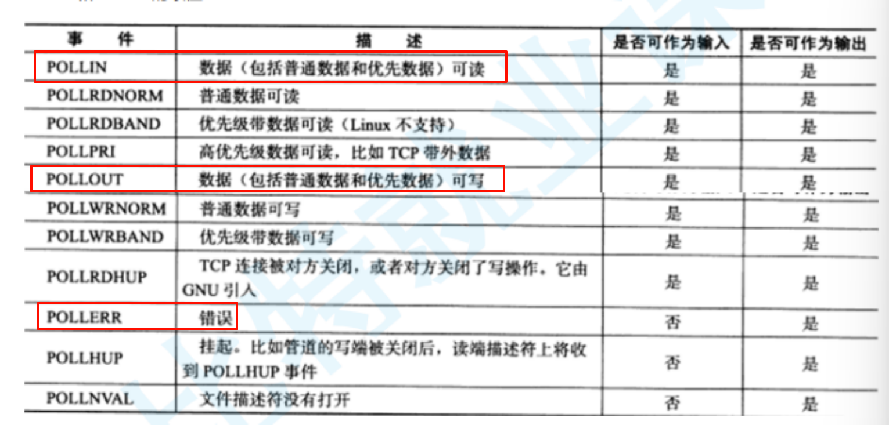
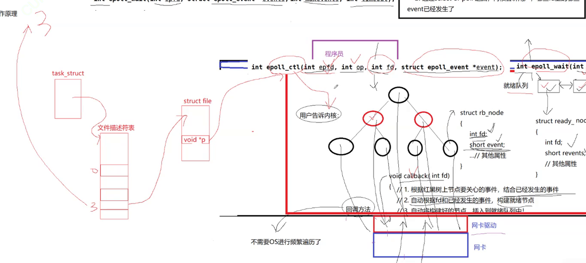

# 1.IO 模型

网络通信的深层就是 `IO`，但是 `IO` 为什么低效？

当 `read/recv` 的时候，如果底层缓冲区没有数据，那么就会进入阻塞，而如果有数据就会进行拷贝，阻塞的原理就是让进程加入到阻塞队列里，因此 `IO=wait+copy`。

当进程需要读取一个文件然后修改时，不一定全部把磁盘中的文件，有可能只加载文件的属性（暂时不加载文件内容，避免内存浪费），然后需要修改时，进程就会陷入等待中，等待文件的内容被拷贝读取，然后再做修改。

因此越是高效的 `IO` 就是越少等待、越少拷贝。尤其是等待，大部分 `IO` 操作都在进行等待，效率当然不高。


参与 `IO` 的过程就是同步 `IO`，而参与就是要么参与等待、要么参与直接拷贝、要么同时参与等待和直接拷贝。

前面讲的前四种都是同步 `IO`，其中信号驱动中，信号的产生确实是异步的，但是一旦数据就会参与 `IO`，信号发送之后就是同步 `IO`。

最后一种就是异步 `IO`，没等待也没直接拷贝就是异步 `IO`。

而其实等待是指两件事情（专业术语为 **IO 类事件就绪**）：

-   等待写缓冲区有空间可以写入
-   等待都缓冲区有数据可以读取


>   补充：等待一般都涉及到等待队列（资源队列）。

>	疑惑：为什么不跟主流概念？

## 1.1.阻塞 I/O（Blocking I/O）

在进行 I/O 操作时，阻塞 I/O 会导致调用线程被阻塞，直到 I/O 操作完成。在此期间，线程将无法执行其他任务。只有当 I/O 操作完成后，线程才会继续执行。


## 1.2.非阻塞 I/O（Non-blocking I/O）

非阻塞 I/O 允许调用线程继续执行，即使 I/O 操作没有立即完成。线程可以不断地轮询或询问 I/O 操作是否完成，而不会被阻塞。这样可以使得线程能够在等待 I/O 完成的同时执行其他任务。


## 1.3.信号驱动 I/O（Signal-driven I/O）

信号驱动 I/O 允许进程执行其他任务而不阻塞，直到 I/O 操作完成。当 I/O 操作完成时，操作系统会向进程发送信号来通知它。进程可以在信号到来时执行相应的处理。


## 1.4.多路转接 I/O（Multiplexing I/O）

多路转接 `I/O` 允许一个线程同时监视多个 I/O 操作的状态，并在其中任何一个 I/O 操作就绪时立即执行。它通常使用 `select()`、`poll()`、`epoll()` 等系统调用来实现。


>   补充：上述信号就是 `singleio` 信号。

## 1.5.异步 I/O（Asynchronous I/O）

异步 I/O 允许调用线程在进行 I/O 操作的同时继续执行其他任务，而不必等待 I/O 操作完成。当 I/O 操作完成时，操作系统会通知调用线程，然后线程可以处理已完成的 I/O 操作。


# 2.高级 IO

非阻塞 `IO`、纪录锁、系统 `V` 流机制、`I/O` 多路转接（也叫 `I/O` 多路复用）、`readv()`、`writev()`、存储映射 `IO`（`mmap`）统称为高级 `IO`。

## 2.1.fcntl

如果我们单纯只是需要非阻塞打开一个文件的话，就需要使用 `open()` 打开的时候就可以值得非阻塞选项，但是这里我们不使用这个，而选择更加统一的方式，使用 `fcntl()` 即可。

```cpp
//fcntl()
int fcntl(int fd, int cmd, ...);
```


```cpp
//使用 fcntl()
#include <iostream>
#include <unistd.h>
#include <fcntl.h>

bool SetNonBlock(int fd)
{
    int fl = fcntl(fd, F_GETFL); //获取文件的读写标志位
    if (fl < 0)
        return false;
    fcntl(fd, F_SETFL, fl | O_NONBLOCK); //设置非阻塞
    return true;
}

int main()
{
    SetNonBlock(0);

    char buffer[1024] = { 0 };

    while (true)
    {
        ssize_t s = read(0, buffer, sizeof(buffer) - 1);
        if (s > 0)
        {
            std::cout << "echo >:" << buffer << std::endl;
        }
        else
        {
            std::cout << "read error" << std::endl;
        }
    }

    return 0;
}
```

但是如果真的出错了怎么办？只能使用 `<cerror>` 来中的 `errno` 变量来标识错误，不然分不清是出错还是没有可读取的数据，会被设置为 `errno=11`，也就是 `EWOULDBLOCK 或 EAGAIN(两者意义一样)`。而 `EINTR` 就代表 `IO` 过程被信号中断，需要再尝试一次（概率较小）。

>   补充：对了上述代码中，实际上 `std::cout` 也是被默认设置为阻塞的，只不过一直有数据读取。

## 2.2.select

更加常用的教优 `IO` 模型是多路转接（虽然大部分都不会让您重新书写，以及有对应的库可以直接调用了）。

```cpp
//select()
#include <sys/time.h>
struct timeval {
    time_t tv_sec; //时间戳秒
    suseconds_t tv_usec; //微秒
};

int gettimeofday(
	struct timeval* tv, //输出型参数，返回系统特定时区的时间
    const struct timezone* tz //为空默认当前地区
); //返回是否获取


struct fd_set {
	//...
}; //是文件描述集，和信号集类似，就是一个位图结构，有大小限制

void FD_CLR(int fd, fd_set* set); //在位图中清除描述符
int FD_ISSET(int fd, fd_set* set); //在位图中查询是否存在对应的描述符
void FD_SET(int fd, fd_set* set); //在位图中设置描述符
void FD_ZERO(fd_set* set); //将整个位图所有位做置零


#include <sys/select.h>
int select(
	int nfds, //maxfd+1，实际上就是 fds 数组个数
    fd_set* readfds, //读取事件（输入输出型参数）
    fd_set* writefds, //写入事件（输入输出型参数）
    fd_set* exceptfds, //异常事件（输入输出型参数）
    struct timeval* timeout //阻塞模式
); //返回就绪的描述符个数（数据就绪、空间就绪）
//输入就是用户输入提醒系统需要关注的事件
//输出就是系统输出提醒用户哪些事件已就绪
```

该接口的核心工作就是帮助用户一次等待多个文件标识符，哪些文件标识符对应的资源就绪了，就要通知用户对应就绪的标识符有哪些，然后用户调用 `IO` 接口进行数据读取。

我们先来使用一下系统调用中的时间接口。

```cpp
//使用一下系统调用中的时间接口
#include <ctime>
#include <sys/time.h>
int main()
{
    std::cout << "time:" << (unsigned long)time(nullptr) << std::endl;
    
    struct timeval currtime = { 0, 0 };
    int n = gettimeofday(&currtime, nullptr);
    assert(n == 0);
    (void)n;
    std::cout << "time:" <<  currtime.tv_sec << "-" << currtime.tv_usec << std::endl;
    
	return 0;
}
```

并且 `select()` 的等待策略也可以被选择：

-   `timeout=nullptr`：阻塞式，准备好就返回
-   `timeout=(0, 0)`：非阻塞式，没准备好也返回
-   `timeout=(X, Y)`：`X’Y’’` 时间内阻塞，但时间到就返回

我们先来体验一下非阻塞的感觉。

```makefile
# makefile
all: clean select_server

select_server: main.cpp
	g++ -o $@ $^ -std=c++11

clean:
	rm -rf select_server log_dir
```

```cpp
//log.hpp

/* 文件描述
Log log = Log(bool debugShow = true,    //选择是否显示 DEBUG 等级的日志消息
    std::string writeMode = "SCREEN",   //选择日志的打印方式
    std::string logFileName = "log"     //选择日志的文件名称
);
log.WriteModeEnable();      //中途可以修改日志的打印方式
log.LogMessage(DEBUG | NORMAL | WARNING | ERROR | FATAL, "%s %d", __FILE__, __LINE__));     //打印日志
*/

#pragma once
#include <iostream>
#include <string>
#include <fstream>
#include <cstdio>
#include <cstdarg>
#include <ctime>
#include <pthread.h>
#include <unistd.h>
#include <sys/stat.h>
#include <sys/types.h>

//日志级别
#define DEBUG 0 //调试
#define NORMAL 1 //正常（或者叫 INFO）
#define WARNING 2 //警告
#define ERROR 3 //错误
#define FATAL 4 //致命

enum WriteMode
{
    SCREEN = 5,
    ONE_FILE,
    CLASS_FILE
};

const char* gLevelMap[] = {
    "DEBUG", //debug 模式
    "NORMAL", //正常（或者叫 INFO）
    "WARNING", //警告
    "ERROR", //非致命错误
    "FATAL" //严重错误
};

const std::string logdir = "log_dir";

//日志功能主要有：日志等级、发送时间、日志内容、代码行数、运行用户
class Log
{
private:
    void __WriteLogToOneFile(std::string logFileName, const std::string& message)
    {
        std::ofstream out(logFileName, std::ios::app);
        if (!out.is_open())
            return;
        out << message;
        out.close();
    }
    void __WriteLogToClassFile(const int& level, const std::string& message)
    {
        std::string logFileName = "./";
        logFileName += logdir;
        logFileName += "/";
        logFileName += _logFileName;
        logFileName += "_";
        logFileName += gLevelMap[level];

        __WriteLogToOneFile(logFileName, message);
    }
    void _WriteLog(const int& level, const std::string& message)
    {
        switch (_writeMode)
        {
        case SCREEN: //向屏幕输出
            std::cout << message;
            break;
        case ONE_FILE: //向单个日志文件输出
            __WriteLogToOneFile("./" + logdir + "/" + _logFileName, message);
            break;
        case CLASS_FILE: //向多个日志文件输出
            __WriteLogToClassFile(level, message);
            break;
        default:
            std::cout << "write mode error!!!" << std::endl;
            break;
        }
    }

public:
    //构造函数，debugShow 为是否显示 debug 消息，writeMode 为日志打印模式，logFileName 为日志文件名
    Log(bool debugShow = true, const WriteMode& writeMode = SCREEN, std::string logFileName = "log")
        : _debugShow(debugShow), _writeMode(writeMode), _logFileName(logFileName)
    {
        mkdir(logdir.c_str(), 0775); //创建目录
    }

    //调整日志打印方式
    void WriteModeEnable(const WriteMode& mode)
    {
        _writeMode = mode;
    }

    //拼接日志消息并且输出
    void LogMessage(const int& level, const char* format, ...)
    {
        //1.若不是 debug 模式，且 level == DEBUG 则不做任何事情
        if (_debugShow == false && level == DEBUG)
            return;

        //2.收集日志标准部分信息
        char stdBuffer[1024];
        time_t timestamp = time(nullptr); //获得时间戳
        struct tm* local_time = localtime(&timestamp); //将时间戳转换为本地时间

        snprintf(stdBuffer, sizeof stdBuffer, "[%s][pid:%s][%d-%d-%d %d:%d:%d]",
            gLevelMap[level],
            std::to_string(getpid()).c_str(),
            local_time->tm_year + 1900, local_time->tm_mon + 1, local_time->tm_mday,
            local_time->tm_hour, local_time->tm_min, local_time->tm_sec
        );

        //3.收集日志自定义部分信息
        char logBuffer[1024];
        va_list args; //声明可变参数列表，实际时一个 char* 类型
        va_start(args, format); //初始化可变参数列表
        vsnprintf(logBuffer, sizeof logBuffer, format, args); //int vsnprintf(char *str, size_t size, const char *format, va_list ap); 是一个可变参数函数，将格式化后的字符串输出到缓冲区中。类似带 v 开头的可变参数函数有很多
        va_end(args); //清理可变参数列表，类似 close() 和 delete

        //4.拼接为一个完整的消息
        std::string message;
        message += "--> 标准日志:"; message += stdBuffer;
        message += "\t 用户日志:"; message += logBuffer;
        message += "\n";

        //5.打印日志消息
        _WriteLog(level, message);
    }
    
private:
    bool _debugShow;
    WriteMode _writeMode;
    std::string _logFileName;
};
```

```cpp
//sock.hpp

/* 文件描述
主要是对套接字编程的常见接口做封装，是一个关于套接字的工具包
*/

#pragma once
#include <memory>
#include <cstring>
#include <sys/types.h>
#include <sys/socket.h>
#include <netinet/in.h>
#include <arpa/inet.h>
#include "log.hpp"

class ThreadData
{
public:
    int _sock;
    std::string _ip;
    uint16_t _port;
};

class Sock
{
private:
    const static int g_backlog = 10; //一般不会太大，也不会太小

public:
    //空的构造函数
    Sock() {}

    //创建监听套接字
    static int _Socket()
    {
        int listenSock = socket(AF_INET, SOCK_STREAM, 0);
        if (listenSock < 0)
        {
            _log.LogMessage(FATAL, "socket() error %s %d", __FILE__, __LINE__);
            exit(1);
        }
        _log.LogMessage(NORMAL, "socket() success %s %d", __FILE__, __LINE__);
        return listenSock;
    }

    //绑定监听套接字
    static void _Bind(int listenSock, uint16_t port, std::string ip = "127.0.0.1")
    {
        struct sockaddr_in local;
        memset(&local, 0, sizeof local);
        local.sin_family = AF_INET;
        local.sin_port = htons(port);
        inet_pton(AF_INET, ip.c_str(), &local.sin_addr);

        if (bind(listenSock, (struct sockaddr*)&local, sizeof(local)) < 0)
        {
            _log.LogMessage(FATAL, "bind() error %s %d", __FILE__, __LINE__);
            exit(2);
        }
        _log.LogMessage(NORMAL, "bind() success %s %d", __FILE__, __LINE__);
    }

    //置套接字监听状态
    static void _Listen(int listenSock)
    {
        if (listen(listenSock, g_backlog) < 0)
        {
            _log.LogMessage(FATAL, "listen() error %s %d", __FILE__, __LINE__);
            exit(3);
        }
        _log.LogMessage(NORMAL, "listen() success %s %d", __FILE__, __LINE__);
    }

    //服务端等待连接后，返回服务套接字（参数还带有服务端的信息）
    static int _Accept(int listenSock, std::string* ip, uint16_t* port)
    {
        struct sockaddr_in src;
        socklen_t len = sizeof(src);

        int serviceSock = accept(listenSock, (struct sockaddr*)&src, &len);
        if (serviceSock < 0)
        {
            _log.LogMessage(FATAL, "accept() error %s %d", __FILE__, __LINE__);
            return -1;
        }
        _log.LogMessage(NORMAL, "accept() success %s %d", __FILE__, __LINE__);

        *port = ntohs(src.sin_port);
        *ip = inet_ntoa(src.sin_addr);

        return serviceSock;
    }

    //客户端主动连接服务端
    static bool _Connect(int sock, const std::string& server_ip, const uint16_t& server_port)
    {
        struct sockaddr_in server;
        memset(&server, 0, sizeof(server));
        server.sin_family = AF_INET;
        server.sin_port = htons(server_port);
        server.sin_addr.s_addr = inet_addr(server_ip.c_str());

        if (connect(sock, (struct sockaddr*)&server, sizeof(server)) == 0)
        {
            _log.LogMessage(NORMAL, "accept() success %s %d", __FILE__, __LINE__);
            return true;
        }

        _log.LogMessage(FATAL, "connect() error %s %d", __FILE__, __LINE__);
        return false;
    }

private:
    static Log _log;
};
Log Sock::_log = Log();
```

```cpp
//select_server.hpp
#pragma once
#include <iostream>
#include <sys/select.h>
#include <cstdio>
#include "sock.hpp"
#include "log.hpp"

//select 只讲解读取，写入和异常之后提到 epoll 时再说
class SelectServer
{
public:
    SelectServer(const uint16_t &port = 8080)
    	: _port(port) 
    {
        _listensock = Sock::_Socket();
        Sock::_Bind(_listensock, _port);
        Sock::_Listen(_listensock);
        _log.LogMessage(DEBUG, "create base socket success, %s %d", __FILE__, __LINE__);
    }

    ~SelectServer()
    {
        if (_listensock >= 0)
            close(_listensock);
    }

    void Start()
    {
        fd_set rfds;
        FD_ZERO(&rfds);

        while (true)
        {
            //把 _listensock 的获取也看做 IO, 而如果没有获取到新链接, 也会导致阻塞
            //int sock = Sock::_Accept(_listensock, ...); //因此不能直接调用 _Accept(), 否则默认没有获取到新链接就进入阻塞
            FD_SET(_listensock, &rfds);
            struct timeval timeout = { 5, 0 }; //每次都有需要设置, 因为是输入输出型参数
            int n = select(_listensock + 1, &rfds, nullptr, nullptr, &timeout);
            switch (n)
            {
                case 0: //超时
                    _log.LogMessage(DEBUG, "time out ..., %s %d", __FILE__, __LINE__);
                    break;
                case -1: //等待失败
                    _log.LogMessage(WARNING, "select error, %s %d", __FILE__, __LINE__);
                    break;
                default: //select 等待成功
                    
                    break;
            }
        }
    }

private:
    uint16_t _port;
    int _listensock;
    Log _log;
};
```

```cpp
//main.cpp
#include <memory>
#include "select_server.hpp"

int main()
{
    std::unique_ptr<SelectServer> svr(new SelectServer());
    svr->Start();
    return 0;
}
```

现在我们再试试改成非阻塞，然后进一步编写 `select_server`。


```makefile
# makefile
all: clean select_server

select_server: main.cpp
	g++ -o $@ $^ -std=c++11

clean:
	rm -rf select_server log_dir
```

```cpp
//log.hpp

/* 文件描述
Log log = Log(bool debugShow = true,    //选择是否显示 DEBUG 等级的日志消息
    std::string writeMode = "SCREEN",   //选择日志的打印方式
    std::string logFileName = "log"     //选择日志的文件名称
);
log.WriteModeEnable();      //中途可以修改日志的打印方式
log.LogMessage(DEBUG | NORMAL | WARNING | ERROR | FATAL, "%s %d", __FILE__, __LINE__));     //打印日志
*/

#pragma once
#include <iostream>
#include <string>
#include <fstream>
#include <cstdio>
#include <cstdarg>
#include <ctime>
#include <pthread.h>
#include <unistd.h>
#include <sys/stat.h>
#include <sys/types.h>

//日志级别
#define DEBUG 0 //调试
#define NORMAL 1 //正常（或者叫 INFO）
#define WARNING 2 //警告
#define ERROR 3 //错误
#define FATAL 4 //致命

enum WriteMode
{
    SCREEN = 5,
    ONE_FILE,
    CLASS_FILE
};

const char* gLevelMap[] = {
    "DEBUG", //debug 模式
    "NORMAL", //正常（或者叫 INFO）
    "WARNING", //警告
    "ERROR", //非致命错误
    "FATAL" //严重错误
};

const std::string logdir = "log_dir";

//日志功能主要有：日志等级、发送时间、日志内容、代码行数、运行用户
class Log
{
private:
    void __WriteLogToOneFile(std::string logFileName, const std::string& message)
    {
        std::ofstream out(logFileName, std::ios::app);
        if (!out.is_open())
            return;
        out << message;
        out.close();
    }
    void __WriteLogToClassFile(const int& level, const std::string& message)
    {
        std::string logFileName = "./";
        logFileName += logdir;
        logFileName += "/";
        logFileName += _logFileName;
        logFileName += "_";
        logFileName += gLevelMap[level];

        __WriteLogToOneFile(logFileName, message);
    }
    void _WriteLog(const int& level, const std::string& message)
    {
        switch (_writeMode)
        {
        case SCREEN: //向屏幕输出
            std::cout << message;
            break;
        case ONE_FILE: //向单个日志文件输出
            __WriteLogToOneFile("./" + logdir + "/" + _logFileName, message);
            break;
        case CLASS_FILE: //向多个日志文件输出
            __WriteLogToClassFile(level, message);
            break;
        default:
            std::cout << "write mode error!!!" << std::endl;
            break;
        }
    }

public:
    //构造函数，debugShow 为是否显示 debug 消息，writeMode 为日志打印模式，logFileName 为日志文件名
    Log(bool debugShow = true, const WriteMode& writeMode = SCREEN, std::string logFileName = "log")
        : _debugShow(debugShow), _writeMode(writeMode), _logFileName(logFileName)
    {
        mkdir(logdir.c_str(), 0775); //创建目录
    }

    //调整日志打印方式
    void WriteModeEnable(const WriteMode& mode)
    {
        _writeMode = mode;
    }

    //拼接日志消息并且输出
    void LogMessage(const int& level, const char* format, ...)
    {
        //1.若不是 debug 模式，且 level == DEBUG 则不做任何事情
        if (_debugShow == false && level == DEBUG)
            return;

        //2.收集日志标准部分信息
        char stdBuffer[1024];
        time_t timestamp = time(nullptr); //获得时间戳
        struct tm* local_time = localtime(&timestamp); //将时间戳转换为本地时间

        snprintf(stdBuffer, sizeof stdBuffer, "[%s][pid:%s][%d-%d-%d %d:%d:%d]",
            gLevelMap[level],
            std::to_string(getpid()).c_str(),
            local_time->tm_year + 1900, local_time->tm_mon + 1, local_time->tm_mday,
            local_time->tm_hour, local_time->tm_min, local_time->tm_sec
        );

        //3.收集日志自定义部分信息
        char logBuffer[1024];
        va_list args; //声明可变参数列表，实际时一个 char* 类型
        va_start(args, format); //初始化可变参数列表
        vsnprintf(logBuffer, sizeof logBuffer, format, args); //int vsnprintf(char *str, size_t size, const char *format, va_list ap); 是一个可变参数函数，将格式化后的字符串输出到缓冲区中。类似带 v 开头的可变参数函数有很多
        va_end(args); //清理可变参数列表，类似 close() 和 delete

        //4.拼接为一个完整的消息
        std::string message;
        message += "--> 标准日志:"; message += stdBuffer;
        message += "\t 用户日志:"; message += logBuffer;
        message += "\n";

        //5.打印日志消息
        _WriteLog(level, message);
    }
    
private:
    bool _debugShow;
    WriteMode _writeMode;
    std::string _logFileName;
};
```

```cpp
//sock.hpp

/* 文件描述
主要是对套接字编程的常见接口做封装，是一个关于套接字的工具包
*/

#pragma once
#include <memory>
#include <cstring>
#include <sys/types.h>
#include <sys/socket.h>
#include <netinet/in.h>
#include <arpa/inet.h>
#include "log.hpp"

class ThreadData
{
public:
    int _sock;
    std::string _ip;
    uint16_t _port;
};

class Sock
{
private:
    const static int g_backlog = 10; //一般不会太大，也不会太小

public:
    //空的构造函数
    Sock() {}

    //创建监听套接字
    static int _Socket()
    {
        int listenSock = socket(AF_INET, SOCK_STREAM, 0);
        if (listenSock < 0)
        {
            _log.LogMessage(FATAL, "socket() error %s %d", __FILE__, __LINE__);
            exit(1);
        }
        _log.LogMessage(NORMAL, "socket() success %s %d", __FILE__, __LINE__);
        return listenSock;
    }

    //绑定监听套接字
    static void _Bind(int listenSock, uint16_t port, std::string ip = "127.0.0.1")
    {
        struct sockaddr_in local;
        memset(&local, 0, sizeof local);
        local.sin_family = AF_INET;
        local.sin_port = htons(port);
        inet_pton(AF_INET, ip.c_str(), &local.sin_addr);

        if (bind(listenSock, (struct sockaddr*)&local, sizeof(local)) < 0)
        {
            _log.LogMessage(FATAL, "bind() error %s %d", __FILE__, __LINE__);
            exit(2);
        }
        _log.LogMessage(NORMAL, "bind() success %s %d", __FILE__, __LINE__);
    }

    //置套接字监听状态
    static void _Listen(int listenSock)
    {
        if (listen(listenSock, g_backlog) < 0)
        {
            _log.LogMessage(FATAL, "listen() error %s %d", __FILE__, __LINE__);
            exit(3);
        }
        _log.LogMessage(NORMAL, "listen() success %s %d", __FILE__, __LINE__);
    }

    //服务端等待连接后，返回服务套接字（参数还带有服务端的信息）
    static int _Accept(int listenSock, std::string* ip, uint16_t* port)
    {
        struct sockaddr_in src;
        socklen_t len = sizeof(src);

        int serviceSock = accept(listenSock, (struct sockaddr*)&src, &len);
        if (serviceSock < 0)
        {
            _log.LogMessage(FATAL, "accept() error %s %d", __FILE__, __LINE__);
            return -1;
        }
        _log.LogMessage(NORMAL, "accept() success %s %d", __FILE__, __LINE__);

        *port = ntohs(src.sin_port);
        *ip = inet_ntoa(src.sin_addr);

        return serviceSock;
    }

    //客户端主动连接服务端
    static bool _Connect(int sock, const std::string& server_ip, const uint16_t& server_port)
    {
        struct sockaddr_in server;
        memset(&server, 0, sizeof(server));
        server.sin_family = AF_INET;
        server.sin_port = htons(server_port);
        server.sin_addr.s_addr = inet_addr(server_ip.c_str());

        if (connect(sock, (struct sockaddr*)&server, sizeof(server)) == 0)
        {
            _log.LogMessage(NORMAL, "accept() success %s %d", __FILE__, __LINE__);
            return true;
        }

        _log.LogMessage(FATAL, "connect() error %s %d", __FILE__, __LINE__);
        return false;
    }

private:
    static Log _log;
};
Log Sock::_log = Log();
```

```cpp
//select_server.hpp
#pragma once
#include <iostream>
#include <string>
#include <sys/select.h>
#include <cstdio>
#include "sock.hpp"
#include "log.hpp"

//select 只讲解读取，写入和异常之后提到 epoll 时再说
class SelectServer
{
private:
    void HandlerEvent(const fd_set& rfds) //rfds 是一个集合, 内部可能有多个标识符, 但是这里我们确保只有一个, 所以先这么写
    {
        if (FD_ISSET(_listensock, &rfds))
        {
            //成功走到这里就说明可以读取了, 已经获取了新连接
            std::string client_ip;
            uint16_t client_port;
            int sock = Sock::_Accept(_listensock, &client_ip, &client_port); //这里会不会被阻塞呢? 不会, 因为 IO事件/IO资源 已就绪

            if (sock < 0)
            {
                _log.LogMessage(WARNING, "accept error, %s %d", __FILE__, __LINE__);
                return;
            }

            _log.LogMessage(DEBUG, "get a new link success, %d->[%s:%d], %s %d", sock, client_ip.c_str(), client_port, __FILE__, __LINE__);

            //TODO: read() and write()
        }
    }

public:
    SelectServer(const uint16_t &port = 8080)
    	: _port(port) 
    {
        _listensock = Sock::_Socket();
        Sock::_Bind(_listensock, _port);
        Sock::_Listen(_listensock);
        _log.LogMessage(DEBUG, "create base socket success, %s %d", __FILE__, __LINE__);
    }

    ~SelectServer()
    {
        if (_listensock >= 0)
            close(_listensock);
    }

    void Start()
    {
        fd_set rfds;
        FD_ZERO(&rfds);

        while (true)
        {
            //把 _listensock 的获取也看做 IO, 而如果没有获取到新链接, 也会导致阻塞
            //int sock = Sock::_Accept(_listensock, ...); //因此不能直接调用 _Accept(), 否则默认没有获取到新链接就进入阻塞
            FD_SET(_listensock, &rfds);
            //struct timeval timeout = { 5, 0 }; //每次都有需要设置, 因为是输入输出型参数
            //int n = select(_listensock + 1, &rfds, nullptr, nullptr, &timeout);
            int n = select(_listensock + 1, &rfds, nullptr, nullptr, nullptr);
            switch (n)
            {
                case 0: //超时
                    _log.LogMessage(DEBUG, "time out ..., %s %d", __FILE__, __LINE__);
                    break;
                case -1: //等待失败
                    _log.LogMessage(WARNING, "select error, %s %d", __FILE__, __LINE__);
                    break;
                default: //select 等待成功
                    _log.LogMessage(DEBUG, "get a new link, %s %d", __FILE__, __LINE__);
                    //必须把准备好的链接取走, 不让就会陷入死循环
                    HandlerEvent(rfds); //把就绪的描述符传递过去
                    break;
            }
        }
    }

private:
    uint16_t _port;
    int _listensock;
    Log _log;
};
```

```cpp
//main.cpp
#include <memory>
#include "select_server.hpp"

int main()
{
    std::unique_ptr<SelectServer> svr(new SelectServer());
    svr->Start();
    return 0;
}
```

然后，我们一步步完善 `select_server.hpp`，直到编写不下去为止。

```cpp
//select_server.hpp
#pragma once
#include <vector>
#include <iostream>
#include <string>
#include <sys/select.h>
#include <cstdio>
#include "sock.hpp"
#include "log.hpp"

//select 只讲解读取，写入和异常之后提到 epoll 时再说
class SelectServer
{
private:
    void HandlerEvent(const fd_set& rfds) //rfds 是一个集合, 内部可能有多个标识符, 但是这里我们确保只有一个, 所以先这么写
    {
        if (FD_ISSET(_listensock, &rfds))
        {
            //成功走到这里就说明可以读取了, 已经获取了新连接
            std::string client_ip;
            uint16_t client_port;
            int sock = Sock::_Accept(_listensock, &client_ip, &client_port); //这里会不会被阻塞呢? 不会, 因为 IO事件/IO资源 已就绪

            if (sock < 0)
            {
                _log.LogMessage(WARNING, "accept error, %s %d", __FILE__, __LINE__);
                return;
            }

            _log.LogMessage(DEBUG, "get a new link success, %d->[%s:%d], %s %d", sock, client_ip.c_str(), client_port, __FILE__, __LINE__);

            //注意这里不能直接 read() and write(), 万一对方一直不发送数据过来就一直读取不了, 陷入阻塞
            //因此将新的 sock 托管给 select(), 让其检查其上是否有新的数据就绪, 在进行阻塞
            //由于文件描述符有可能会越来越大, 因此这里就必须动态调用 select()
            //并且 select() 的使用会导致曾经被操作系统关注的描述符, 因此就注定每一次调用时, 都有可能需要重新添加曾经关注的描述符
            //最终导致可能需要:
            //(1)需要单独保存一个第三方数组, 保存历史上所有的合法 fd, 根据需求动态添加到位图中
            //(2)遍历描述符数组, 动态找出最大的 max_fd

        }
    }

public:
    SelectServer(const uint16_t &port = 8080)
        :  _port(port) 
    {
        _listensock = Sock::_Socket();
        Sock::_Bind(_listensock, _port);
        Sock::_Listen(_listensock);
        _log.LogMessage(DEBUG, "create base socket success, %s %d", __FILE__, __LINE__);
    }

    ~SelectServer()
    {
        if (_listensock >= 0)
            close(_listensock);
    }

    void Start()
    {
        fd_set rfds;
        FD_ZERO(&rfds);

        while (true)
        {
            //把 _listensock 的获取也看做 IO, 而如果没有获取到新链接, 也会导致阻塞
            //int sock = Sock::_Accept(_listensock, ...); //因此不能直接调用 _Accept(), 否则默认没有获取到新链接就进入阻塞
            FD_SET(_listensock, &rfds);
            //struct timeval timeout = { 5, 0 }; //每次都有需要设置, 因为是输入输出型参数
            //int n = select(_listensock + 1, &rfds, nullptr, nullptr, &timeout);
            int n = select(_listensock + 1, &rfds, nullptr, nullptr, nullptr);
            switch (n)
            {
                case 0: //超时
                    _log.LogMessage(DEBUG, "time out ..., %s %d", __FILE__, __LINE__);
                    break;
                case -1: //等待失败
                    _log.LogMessage(WARNING, "select error, %s %d", __FILE__, __LINE__);
                    break;
                default: //select 等待成功
                    _log.LogMessage(DEBUG, "get a new link, %s %d", __FILE__, __LINE__);
                    //必须把准备好的链接取走, 不让就会陷入死循环
                    HandlerEvent(rfds); //把就绪的描述符传递过去
                    break;
            }
        }
    }

private:
    uint16_t _port;
    int _listensock;
    Log _log;
};
```

可以发现，在 `HandlerEvent()` 调用方法这里不能直接 `read()/write()`，万一对端一直不发送数据过来就一直读取不了，服务端就会陷入阻塞（这是我们不能忍受的）。因此必须将新的服务 `sock` 托管给 `select()`，让其检查其上是否有新的数据就绪，这样服务器就会即便真的阻塞时，也仅仅是因为真的没有任何描述符可以使用（将效率提到了最高）。

1.   由于文件描述符有可能会越来越大，因此这里就必须动态调用 `select()`

2.   并且 `select()` 的使用会导致曾经被操作系统关注的描述符，因此就注定每一次调用时，都有可能需要重新添加曾经关注的描述符

3.   最终导致我们至少要做到两点：

     (1)需要单独保存一个第三方数组，保存历史上所有的合法 `fd`，根据需求动态添加到位图中
     (2)遍历描述符数组，动态找出最大的 `max_fd`

```cpp
//select_server.hpp
#pragma once
#include <vector>
#include <iostream>
#include <string>
#include <sys/select.h>
#include <cstdio>
#include "sock.hpp"
#include "log.hpp"

#define BIT_NUM_OF_BYT 8
#define NUM_OF_FDS BIT_NUM_OF_BYT * sizeof(fd_set)
#define FD_NONE -1
//select 只讲解读取，写入和异常之后提到 epoll 时再说
class SelectServer
{
private:
    void HandlerEvent(const fd_set& rfds) //rfds 是一个集合, 内部可能有多个标识符, 但是这里我们确保只有一个, 所以先这么写
    {
        if (FD_ISSET(_listensock, &rfds))
        {
            //成功走到这里就说明可以读取了, 已经获取了新连接
            std::string client_ip;
            uint16_t client_port;
            int sock = Sock::_Accept(_listensock, &client_ip, &client_port); //这里会不会被阻塞呢? 不会, 因为 IO事件/IO资源 已就绪

            if (sock < 0)
            {
                _log.LogMessage(WARNING, "accept error, %s %d", __FILE__, __LINE__);
                return;
            }

            _log.LogMessage(DEBUG, "get a new link success, %d->[%s:%d], %s %d", sock, client_ip.c_str(), client_port, __FILE__, __LINE__);

            //注意这里不能直接 read() and write(), 万一对方一直不发送数据过来就一直读取不了, 陷入阻塞
            //因此将新的 sock 托管给 select(), 让其检查其上是否有新的数据就绪, 在进行阻塞
            //由于文件描述符有可能会越来越大, 因此这里就必须动态调用 select()
            //并且 select() 的使用会导致曾经被操作系统关注的描述符, 因此就注定每一次调用时, 都有可能需要重新添加曾经关注的描述符
            //最终导致可能需要:
            //(1)需要单独保存一个第三方数组, 保存历史上所有的合法 fd, 根据需求动态添加到位图中
            //(2)遍历描述符数组, 动态找出最大的 max_fd

            int pos = 0;
            for (pos = 0; pos < NUM_OF_FDS; pos++)
            {
                if (_fds[pos] == FD_NONE)
                    break;
            }
            if (pos == NUM_OF_FDS) //服务器的描述符资源不足
            {
                _log.LogMessage(WARNING, "select server already full, close, %d, %s %d", sock, client_ip.c_str(), client_port, __FILE__, __LINE__);
                close(sock);
            }
            else
            {
                _fds[pos] = sock; //添加后, 等到本调用结束后进入主循环, 再次使用 seletc() 即可
            }
        }
    }

public:
    SelectServer(const uint16_t &port = 8080)
        :  _port(port) 
    {
        _listensock = Sock::_Socket();
        Sock::_Bind(_listensock, _port);
        Sock::_Listen(_listensock);
        _log.LogMessage(DEBUG, "create base socket success, %s %d", __FILE__, __LINE__);
        for (auto& fd : _fds)
            fd = FD_NONE;

        //我约定: _fds[0] = _listensock, 因为改套接字一般不变动
        _fds[0] = _listensock;
    }

    ~SelectServer()
    {
        if (_listensock >= 0)
            close(_listensock);
    }

    void Start()
    {
        while (true)
        {
            //把 _listensock 的获取也看做 IO, 而如果没有获取到新链接, 也会导致阻塞
            //int sock = Sock::_Accept(_listensock, ...); //因此不能直接调用 _Accept(), 否则默认没有获取到新链接就进入阻塞
            //FD_SET(_listensock, &rfds);
            //struct timeval timeout = { 5, 0 }; //每次都有需要设置, 因为是输入输出型参数
            //int n = select(_listensock + 1, &rfds, nullptr, nullptr, &timeout);
            //int n = select(_listensock + 1, &rfds, nullptr, nullptr, nullptr);
            DebugPrint();
            
            fd_set rfds;
            FD_ZERO(&rfds);
            int maxFd = _listensock;
            for (auto& fd : _fds)
            {
                if (fd == FD_NONE)
                    continue;
                
                FD_SET(fd, &rfds);

                if (maxFd < fd)
                    maxFd = fd;
            }

            int n = select(maxFd + 1, &rfds, nullptr, nullptr, nullptr);

            switch (n)
            {
                case 0: //超时
                    _log.LogMessage(DEBUG, "time out ..., %s %d", __FILE__, __LINE__);
                    break;
                case -1: //等待失败
                    _log.LogMessage(WARNING, "select error, %s %d", __FILE__, __LINE__);
                    break;
                default: //select 等待成功
                    _log.LogMessage(DEBUG, "get a new link, %s %d", __FILE__, __LINE__);
                    //必须把准备好的链接取走, 不让就会陷入死循环
                    HandlerEvent(rfds); //把就绪的描述符传递过去
                    break;
            }
        }
    }

    void DebugPrint()
    {
        std::cout << "_fds: " << std::endl;
        for (const auto& fd : _fds)
        {
            if (fd != FD_NONE)
                std::cout << fd << " ";
        }
        std::cout << std::endl;
    }

private:
    uint16_t _port;
    int _listensock;
    Log _log;
    int _fds[NUM_OF_FDS];
};
```

但是这里这么写是有两点问题的：

-   我们并不清楚哪些申请到的服务标识符是读描述符还是写描述符？
-   如果有大量的链接同时就绪，凭什么只处理一个描述符呢？其他描述符也需要处理把？

```cpp
//select_server.hpp
#pragma once
#include <vector>
#include <iostream>
#include <string>
#include <sys/select.h>
#include <cstdio>
#include "sock.hpp"
#include "log.hpp"

#define BIT_NUM_OF_BYT 8
#define NUM_OF_FDS BIT_NUM_OF_BYT * sizeof(fd_set)
#define FD_NONE -1

//select 暂时只讲解读取事件，写入和异常之后提到 epoll 时再说
class SelectServer
{
private:
    void __Accepter()
    {
        //现在就不用判断 _listensock 是否就绪了
        std::string client_ip;
        uint16_t client_port = 0;
        int sock = Sock::_Accept(_listensock, &client_ip, &client_port); //这里会不会被阻塞呢? 不会, 因为 IO事件/IO资源 已就绪

        if (sock < 0)
        {
            _log.LogMessage(WARNING, "accept error, %s %d", __FILE__, __LINE__);
            return;
        }

        _log.LogMessage(DEBUG, "get a new link success, %d->[%s:%d], %s %d", sock, client_ip.c_str(), client_port, __FILE__, __LINE__);

        //注意这里不能直接 read() and write(), 万一对方一直不发送数据过来就一直读取不了, 陷入阻塞
        //因此将新的 sock 托管给 select(), 让其检查其上是否有新的数据就绪, 再进行阻塞

        int pos = 1; //初始设置为 1, 因为我们约定第一个标识符是监听套接字
        for (; pos < NUM_OF_FDS; pos++) //该循环的目的是一直走到可以被填充新描述符的 pos 索引
        {
            if (_fds[pos] == FD_NONE)
                break;
        }
        if (pos == NUM_OF_FDS) //超出 _fds 数组的大小, 说明服务器的描述符资源已经不足
        {
            _log.LogMessage(WARNING, "select server already full, close, %d, %s %d", sock, client_ip.c_str(), client_port, __FILE__, __LINE__);
            close(sock);
        }
        else
        {
            _fds[pos] = sock; //把获取到的服务套接字添加进合法数组 _fds 内, 等到本调用结束后进入主循环, 再次被 seletc() 托管即可
        }
    }

    void _HandlerEvent(const fd_set& rfds) //rfds 是一个集合, 内部可能有多个、多种标识符
    {
        //这个函数被调用, 就说明至少有一个标识符资源可以被使用了
        //先提取出需要 link 和 read 的描述符
        for (int i = 0; i < NUM_OF_FDS; i++)
        {
            //先排除不合法的描述符
            if (_fds[i] == FD_NONE)
            {
                continue;
            }

            //判定一个合法描述符是否就绪
            if (FD_ISSET(_fds[i], &rfds))
            {
                //走到这里的描述符合法且就绪, 但是不一定是需要 read 的描述符, 因此需要区分开做处理
                if (_fds[i] == _listensock)
                {
                    //读事件就绪: 链接时间到来
                    __Accepter(); //让其链接即可, 让新的合法标识符加入
                }
                else
                {
                    //读事件就绪: INPUT 事件到来, 需要 recv() 或 read()
                    _log.LogMessage(DEBUG, "message in, get I/O event: %d, %s %d", _fds[i], __FILE__, __LINE__);
                }
            }
        }
    }

public:
    SelectServer(const uint16_t &port = 8080)
        : _port(port) 
    {
        _listensock = Sock::_Socket();
        Sock::_Bind(_listensock, _port);
        Sock::_Listen(_listensock);
        _log.LogMessage(DEBUG, "create base socket success, %s %d", __FILE__, __LINE__);
        for (auto& fd : _fds)
            fd = FD_NONE;

        //我约定: _fds[0] = _listensock, 因为改套接字一般不变动
        _fds[0] = _listensock;
    }

    ~SelectServer()
    {
        if (_listensock >= 0)
            close(_listensock);
    }

    void Start()
    {
        while (true)
        {
            DebugPrint(); //打印所有合法的描述符(注意这些描述符不一定是就绪的)

            //初始化需要被 select() 管理的描述符集合
            fd_set rfds;
            FD_ZERO(&rfds);
            int maxFd = _listensock;

            //将当前所有的合法描述符添加到需要被 seletc() 管理的集合中
            for (int i = 0; i < NUM_OF_FDS; i++)
            {
                if (_fds[i] == FD_NONE)
                    continue;

                FD_SET(_fds[i], &rfds);

                if (maxFd < _fds[i])
                    maxFd = _fds[i];
            }

            //将当前集合内的描述符都添加到 select() 的管理范畴中
            int n = select(maxFd + 1, &rfds, nullptr, nullptr, nullptr);

            //根据 select() 的返回值做不同的反应
            switch (n)
            {
            case 0: //超时(不过我暂时没有设定超时机制, 只要没有标识符资源可用我就阻塞)
                _log.LogMessage(DEBUG, "time out ..., %s %d", __FILE__, __LINE__);
                break;
            case -1: //等待失败
                _log.LogMessage(WARNING, "select error, %s %d", __FILE__, __LINE__);
                break;
            default: //select 等待成功, 有描述符资源可以使用了!
                _log.LogMessage(DEBUG, "get a new link, %s %d", __FILE__, __LINE__);
                //必须把准备好的链接取走, 不让就会陷入死循环
                _HandlerEvent(rfds); //把就绪的描述符传递过去
                break;
            }
        }
    }

    void DebugPrint()
    {
        std::cout << "_fds[]: " << std::endl;
        for (const auto& fd : _fds)
        {
            if (fd != FD_NONE)
                std::cout << fd << " ";
        }
        std::cout << std::endl;
    }

private:
    uint16_t _port;
    int _listensock;
    Log _log;
    int _fds[NUM_OF_FDS]; //合法数组, 内部存储所有被申请到的套接字
};
```

然后再设置读取客户端的代码（并且做一定的封装），然后使用 `telnet 127.0.0.1 8080` 做测试。

```cpp
//select_server.hpp
#pragma once
#include <vector>
#include <iostream>
#include <string>
#include <sys/select.h>
#include <cstdio>
#include <cstring>
#include "sock.hpp"
#include "log.hpp"

#define BIT_NUM_OF_BYT 8
#define NUM_OF_FDS BIT_NUM_OF_BYT * sizeof(fd_set)
#define FD_NONE -1

//select 暂时只讲解读取事件，写入和异常之后提到 epoll 时再说
class SelectServer
{
private:
    void __Accepter()
    {
        //现在就不用判断 _listensock 是否就绪了
        std::string client_ip;
        uint16_t client_port = 0;
        int sock = Sock::_Accept(_listensock, &client_ip, &client_port); //这里会不会被阻塞呢? 不会, 因为 IO事件/IO资源 已就绪

        if (sock < 0)
        {
            _log.LogMessage(WARNING, "accept error, %s %d", __FILE__, __LINE__);
            return;
        }

        _log.LogMessage(DEBUG, "get a new link success, %d->[%s:%d], %s %d", sock, client_ip.c_str(), client_port, __FILE__, __LINE__);

        //注意这里不能直接 read() and write(), 万一对方一直不发送数据过来就一直读取不了, 陷入阻塞
        //因此将新的 sock 托管给 select(), 让其检查其上是否有新的数据就绪, 再进行阻塞

        int pos = 1; //初始设置为 1, 因为我们约定第一个标识符是监听套接字
        for (; pos < NUM_OF_FDS; pos++) //该循环的目的是一直走到可以被填充新描述符的 pos 索引
        {
            if (_fds[pos] == FD_NONE)
                break;
        }
        if (pos == NUM_OF_FDS) //超出 _fds 数组的大小, 说明服务器的描述符资源已经不足
        {
            _log.LogMessage(WARNING, "select server already full, close, %d, %s %d", sock, client_ip.c_str(), client_port, __FILE__, __LINE__);
            close(sock);
        }
        else
        {
            _fds[pos] = sock; //把获取到的服务套接字添加进合法数组 _fds 内, 等到本调用结束后进入主循环, 再次被 seletc() 托管即可
        }
    }

    void __Recver(int& a_fd)
    {
        //读事件就绪: INPUT 事件到来, 需要 recv() 或 read()
        _log.LogMessage(DEBUG, "message in, get I/O event: %d, %s %d", a_fd, __FILE__, __LINE__);
        char buffer[1024] = { 0 };
        int n = recv(a_fd, buffer, sizeof(buffer) - 1, 0); //这里一定不会被阻塞, select() 已经将事件检测完毕, 在合法的描述符种, 一定有资源可以被读取
        //当然这里的读取是有点问题的, 因为 TCP 是面向字节流的, 无法保证数据完整, 必须配合应用层协议, 但是这里我们暂时不考虑这些

        if (n > 0) //正常读取
        {
            _log.LogMessage(DEBUG, "client-[%d] message >:%s, %s %d", a_fd, buffer, __FILE__, __LINE__);
        }
        else if (n == 0) //对端关闭
        {
            _log.LogMessage(DEBUG, "client-[%d] quit, %s %d", a_fd, __FILE__, __LINE__);
            //(1)服务器也需要关闭该描述符资源
            close(a_fd);
            //(2)从合法描述符种去除, 后续 select() 就不会关注该描述符
            a_fd = FD_NONE;
        }
        else //读取出错
        {
            _log.LogMessage(WARNING, "recv client-[%d] error, error text is %s, %s %d", a_fd, strerror(errno), __FILE__, __LINE__);
            //(1)服务器也需要关闭该描述符资源
            close(a_fd);
            //(2)从合法描述符种去除, 后续 select() 就不会关注该描述符
            a_fd = FD_NONE;
        }
    }

    void _HandlerEvent(const fd_set& rfds) //rfds 是一个集合, 内部可能有多个、多种标识符
    {
        //这个函数被调用, 就说明至少有一个标识符资源可以被使用了
        //先提取出需要 link 和 read 的描述符
        for (int i = 0; i < NUM_OF_FDS; i++)
        {
            //先排除不合法的描述符
            if (_fds[i] == FD_NONE)
            {
                continue;
            }

            //判定一个合法描述符是否就绪
            if (FD_ISSET(_fds[i], &rfds))
            {
                //走到这里的描述符合法且就绪, 但是不一定是需要 read 的描述符, 因此需要区分开做处理
                if (_fds[i] == _listensock)
                {
                    //读事件就绪: 链接时间到来
                    __Accepter(); //让其链接即可, 让新的合法标识符加入
                }
                else
                {
                    __Recver(_fds[i]);
                }
            }
        }
    }

public:
    SelectServer(const uint16_t& port = 8080)
        : _port(port)
    {
        _listensock = Sock::_Socket();
        Sock::_Bind(_listensock, _port);
        Sock::_Listen(_listensock);
        _log.LogMessage(DEBUG, "create base socket success, %s %d", __FILE__, __LINE__);
        for (auto& fd : _fds)
            fd = FD_NONE;

        //我约定: _fds[0] = _listensock, 因为改套接字一般不变动
        _fds[0] = _listensock;
    }

    ~SelectServer()
    {
        if (_listensock >= 0)
            close(_listensock);
    }

    void Start()
    {
        while (true)
        {
            DebugPrint(); //打印所有合法的描述符(注意这些描述符不一定是就绪的)

            //初始化需要被 select() 管理的描述符集合
            fd_set rfds;
            FD_ZERO(&rfds);
            int maxFd = _listensock;

            //将当前所有的合法描述符添加到需要被 seletc() 管理的集合中
            for (int i = 0; i < NUM_OF_FDS; i++)
            {
                if (_fds[i] == FD_NONE)
                    continue;

                FD_SET(_fds[i], &rfds);

                if (maxFd < _fds[i])
                    maxFd = _fds[i];
            }

            //将当前集合内的描述符都添加到 select() 的管理范畴中
            int n = select(maxFd + 1, &rfds, nullptr, nullptr, nullptr);

            //根据 select() 的返回值做不同的反应
            switch (n)
            {
            case 0: //超时(不过我暂时没有设定超时机制, 只要没有标识符资源可用我就阻塞)
                _log.LogMessage(DEBUG, "time out ..., %s %d", __FILE__, __LINE__);
                break;
            case -1: //等待失败
                _log.LogMessage(WARNING, "select error, %s %d", __FILE__, __LINE__);
                break;
            default: //select 等待成功, 有描述符资源可以使用了!
                _log.LogMessage(DEBUG, "get a new link, %s %d", __FILE__, __LINE__);
                //必须把准备好的链接取走, 不让就会陷入死循环
                _HandlerEvent(rfds); //把就绪的描述符传递过去
                break;
            }
        }
    }

    void DebugPrint()
    {
        std::cout << "_fds[]: " << std::endl;
        for (const auto& fd : _fds)
        {
            if (fd != FD_NONE)
                std::cout << fd << " ";
        }
        std::cout << std::endl;
    }

private:
    uint16_t _port;
    int _listensock;
    Log _log;
    int _fds[NUM_OF_FDS]; //合法数组, 内部存储所有被申请到的套接字
};
```

`select` 服务器编写总结如下：

1.   前提，需要有一个第三方数组，保存所有合法 `fd`
2.   然后进入 `while` 循环
3.   遍历数组，更新出最大值 `max_fd`
4.   遍历数组，调用 `seletc()` 添加合法事件，然其检测就绪事件
5.   遍历数组，找到合法事件，完成对应动作
6.   跳转回第 `2` 步的 `while` 循环，继续循环下去

>   补充：`select` 服务器的效率丝毫不比以前多进程、多线程的代码差，多执行流的服务器依赖调度器调度，而 `select` 服务器则则不会，并且本质上也是一个并发服务器。

但是这里我还没开始做写入的操作，如果真的需要考虑写入就需要多定义一个 `write_fds[]`，然后，这个时候就会很麻烦和复杂。

为什么会说 `select` 服务器效率高呢？原因是因为把所有描述符的等放在了一起，主要原因是解决了 `IO` 中的“等”问题，单位时间内等所用的时间减少了。一般应用在有大量链接，但是短时间内只有少量链接时活跃的，并且还节约资源。

那有没有缺点呢？也有：

-   代码编写有些复杂，接口使用有些不方便
-   `select` 需要不断遍历第三方数组（如果使用 `vector` 可能有点看不出来，但是依旧是有这个问题的），也就是轮询检查资源就绪情况，其时间复杂度就是 $O(N)$
-   每一次都需要对输入输出型参数做设置，因为有内核参与做修改
-   能同时管理的 `fd` 的个数是有上限的，但是实际生产环境中这些 `fd` 远远不够用
-   几乎每一个参数都是输入输出型参数，需要频繁从用户到内核，内核到用户的大量拷贝
-   还有一点问题，如果直接原生的数组，就有可能导致过程中合法描述符分布较为离散，但是这个优化可能不明显

## 2.3.poll

系统维护者在后续的发展中，做了更加优化的 `poll()`，解决了一些 `select()` 的问题。

```cpp
//pool()
#include <poll.h>
struct pollfd {
	int fd; //文件描述符，不会被（用户/内核）修改
    short events; //请求关注事件，操作系统只读不修改
    short revents; //返回就绪事件，用户直接拿就可以
};

int poll(
    struct pollfd* fds, //标识符数组，可以随时改变数组大小，但是 select() 限定了只能是 fd_set 类型的位图，数量有限，只有 sizeof(fd_set)*8 个
    nfds_t nfds, //数组元素个数，可以随时改变
    int timeout //和 select() 类似，但是只是输入型参数，0 则不阻塞，-1 为阻塞，非 0 为固定时间进行阻塞
); //返回值大于零，就是就绪描述符的个数，等于零就是超时，小于零就是失败（例如传入非法描述符）
```

`poll()` 是什么接口呢？也是多路转接的一种方案，优化的也是等的问题，也一样需要解决两个问题：

-   用户告诉内核哪些 `fd` 需要关注
-   内核告诉用户哪些 `fd` 已经就绪



上面三红色的就是最常用的，也对应 `select()` 的三个参数，我们简单来使用一下。

```cpp
//使用 poll()
#include <poll.h>
#include <unistd.h>
#include <iostream>

int main()
{
    //准备用户请求
    struct pollfd poll_fd;
    poll_fd.fd = 0; //关心 0 号标识符
    poll_fd.events = POLLIN; //读取事件, 当标准输入中有数据可读时, 程序将会触发可读事件
    pollfd fds[1] = { poll_fd }; //将所有亲求加入数组

    while (true)
    {
        int ret = poll(fds, 1, 1000); //每次阻塞 1000 微秒
        if (ret < 0) //poll 失败
        {
            std::cout << "poll error" << std::endl;
            continue;
        }
        else if (ret == 0) //poll 超时
        {
            std::cout << "poll timeout" << std::endl;
            continue;
        }

        //内核返回就绪标识符
        if (fds[0].revents == POLLIN) //读事件
        {
            char buffer[1024] = { 0 };
            read(0, buffer, sizeof(buffer) - 1);
            std::cout << "stdio:" << buffer << std::endl;
        }
    }

    return 0;
}
```

这样使用还不够深刻，我们把之前的 `select` 服务器改成 `poll` 服务器。

```makefile
# makefile
all: clean poll_server

poll_server: main.cpp
	g++ -o $@ $^ -std=c++11

clean:
	rm -rf poll_server log_dir
```

```cpp
//log.hpp

/* 文件描述
Log log = Log(bool debugShow = true,    //选择是否显示 DEBUG 等级的日志消息
    std::string writeMode = "SCREEN",   //选择日志的打印方式
    std::string logFileName = "log"     //选择日志的文件名称
);
log.WriteModeEnable();      //中途可以修改日志的打印方式
log.LogMessage(DEBUG | NORMAL | WARNING | ERROR | FATAL, "%s %d", __FILE__, __LINE__));     //打印日志
*/

#pragma once
#include <iostream>
#include <string>
#include <fstream>
#include <cstdio>
#include <cstdarg>
#include <ctime>
#include <pthread.h>
#include <unistd.h>
#include <sys/stat.h>
#include <sys/types.h>

//日志级别
#define DEBUG 0 //调试
#define NORMAL 1 //正常（或者叫 INFO）
#define WARNING 2 //警告
#define ERROR 3 //错误
#define FATAL 4 //致命

enum WriteMode
{
    SCREEN = 5,
    ONE_FILE,
    CLASS_FILE
};

const char* gLevelMap[] = {
    "DEBUG", //debug 模式
    "NORMAL", //正常（或者叫 INFO）
    "WARNING", //警告
    "ERROR", //非致命错误
    "FATAL" //严重错误
};

const std::string logdir = "log_dir";

//日志功能主要有：日志等级、发送时间、日志内容、代码行数、运行用户
class Log
{
private:
    void __WriteLogToOneFile(std::string logFileName, const std::string& message)
    {
        std::ofstream out(logFileName, std::ios::app);
        if (!out.is_open())
            return;
        out << message;
        out.close();
    }
    void __WriteLogToClassFile(const int& level, const std::string& message)
    {
        std::string logFileName = "./";
        logFileName += logdir;
        logFileName += "/";
        logFileName += _logFileName;
        logFileName += "_";
        logFileName += gLevelMap[level];

        __WriteLogToOneFile(logFileName, message);
    }
    void _WriteLog(const int& level, const std::string& message)
    {
        switch (_writeMode)
        {
        case SCREEN: //向屏幕输出
            std::cout << message;
            break;
        case ONE_FILE: //向单个日志文件输出
            __WriteLogToOneFile("./" + logdir + "/" + _logFileName, message);
            break;
        case CLASS_FILE: //向多个日志文件输出
            __WriteLogToClassFile(level, message);
            break;
        default:
            std::cout << "write mode error!!!" << std::endl;
            break;
        }
    }

public:
    //构造函数，debugShow 为是否显示 debug 消息，writeMode 为日志打印模式，logFileName 为日志文件名
    Log(bool debugShow = true, const WriteMode& writeMode = SCREEN, std::string logFileName = "log")
        : _debugShow(debugShow), _writeMode(writeMode), _logFileName(logFileName)
    {
        mkdir(logdir.c_str(), 0775); //创建目录
    }

    //调整日志打印方式
    void WriteModeEnable(const WriteMode& mode)
    {
        _writeMode = mode;
    }

    //拼接日志消息并且输出
    void LogMessage(const int& level, const char* format, ...)
    {
        //1.若不是 debug 模式，且 level == DEBUG 则不做任何事情
        if (_debugShow == false && level == DEBUG)
            return;

        //2.收集日志标准部分信息
        char stdBuffer[1024];
        time_t timestamp = time(nullptr); //获得时间戳
        struct tm* local_time = localtime(&timestamp); //将时间戳转换为本地时间

        snprintf(stdBuffer, sizeof stdBuffer, "[%s][pid:%s][%d-%d-%d %d:%d:%d]",
            gLevelMap[level],
            std::to_string(getpid()).c_str(),
            local_time->tm_year + 1900, local_time->tm_mon + 1, local_time->tm_mday,
            local_time->tm_hour, local_time->tm_min, local_time->tm_sec
        );

        //3.收集日志自定义部分信息
        char logBuffer[1024];
        va_list args; //声明可变参数列表，实际时一个 char* 类型
        va_start(args, format); //初始化可变参数列表
        vsnprintf(logBuffer, sizeof logBuffer, format, args); //int vsnprintf(char *str, size_t size, const char *format, va_list ap); 是一个可变参数函数，将格式化后的字符串输出到缓冲区中。类似带 v 开头的可变参数函数有很多
        va_end(args); //清理可变参数列表，类似 close() 和 delete

        //4.拼接为一个完整的消息
        std::string message;
        message += "--> 标准日志:"; message += stdBuffer;
        message += "\t 用户日志:"; message += logBuffer;
        message += "\n";

        //5.打印日志消息
        _WriteLog(level, message);
    }
    
private:
    bool _debugShow;
    WriteMode _writeMode;
    std::string _logFileName;
};
```

```cpp
//sock.hpp

/* 文件描述
主要是对套接字编程的常见接口做封装，是一个关于套接字的工具包
*/

#pragma once
#include <memory>
#include <cstring>
#include <sys/types.h>
#include <sys/socket.h>
#include <netinet/in.h>
#include <arpa/inet.h>
#include "log.hpp"

class ThreadData
{
public:
    int _sock;
    std::string _ip;
    uint16_t _port;
};

class Sock
{
private:
    const static int g_backlog = 10; //一般不会太大，也不会太小

public:
    //空的构造函数
    Sock() {}

    //创建监听套接字
    static int _Socket()
    {
        int listenSock = socket(AF_INET, SOCK_STREAM, 0);
        if (listenSock < 0)
        {
            _log.LogMessage(FATAL, "socket() error %s %d", __FILE__, __LINE__);
            exit(1);
        }
        _log.LogMessage(NORMAL, "socket() success %s %d", __FILE__, __LINE__);
        return listenSock;
    }

    //绑定监听套接字
    static void _Bind(int listenSock, uint16_t port, std::string ip = "127.0.0.1")
    {
        struct sockaddr_in local;
        memset(&local, 0, sizeof local);
        local.sin_family = AF_INET;
        local.sin_port = htons(port);
        inet_pton(AF_INET, ip.c_str(), &local.sin_addr);

        if (bind(listenSock, (struct sockaddr*)&local, sizeof(local)) < 0)
        {
            _log.LogMessage(FATAL, "bind() error %s %d", __FILE__, __LINE__);
            exit(2);
        }
        _log.LogMessage(NORMAL, "bind() success %s %d", __FILE__, __LINE__);
    }

    //置套接字监听状态
    static void _Listen(int listenSock)
    {
        if (listen(listenSock, g_backlog) < 0)
        {
            _log.LogMessage(FATAL, "listen() error %s %d", __FILE__, __LINE__);
            exit(3);
        }
        _log.LogMessage(NORMAL, "listen() success %s %d", __FILE__, __LINE__);
    }

    //服务端等待连接后，返回服务套接字（参数还带有服务端的信息）
    static int _Accept(int listenSock, std::string* ip, uint16_t* port)
    {
        struct sockaddr_in src;
        socklen_t len = sizeof(src);

        int serviceSock = accept(listenSock, (struct sockaddr*)&src, &len);
        if (serviceSock < 0)
        {
            _log.LogMessage(FATAL, "accept() error %s %d", __FILE__, __LINE__);
            return -1;
        }
        _log.LogMessage(NORMAL, "accept() success %s %d", __FILE__, __LINE__);

        *port = ntohs(src.sin_port);
        *ip = inet_ntoa(src.sin_addr);

        return serviceSock;
    }

    //客户端主动连接服务端
    static bool _Connect(int sock, const std::string& server_ip, const uint16_t& server_port)
    {
        struct sockaddr_in server;
        memset(&server, 0, sizeof(server));
        server.sin_family = AF_INET;
        server.sin_port = htons(server_port);
        server.sin_addr.s_addr = inet_addr(server_ip.c_str());

        if (connect(sock, (struct sockaddr*)&server, sizeof(server)) == 0)
        {
            _log.LogMessage(NORMAL, "accept() success %s %d", __FILE__, __LINE__);
            return true;
        }

        _log.LogMessage(FATAL, "connect() error %s %d", __FILE__, __LINE__);
        return false;
    }

private:
    static Log _log;
};
Log Sock::_log = Log();
```

```cpp
//poll_server.hpp
#pragma once
#include <iostream>
#include <vector>
#include <string>
#include <poll.h>
#include <cstdio>
#include <cstring>
#include "sock.hpp"
#include "log.hpp"

#define FD_NONE -1

class PollServer
{
private:
    static const nfds_t g_num_of_fds = 100;

private:
    void __Accepter()
    {
        //现在就不用判断 _listensock 是否就绪了
        std::string client_ip;
        uint16_t client_port = 0;
        int sock = Sock::_Accept(_listensock, &client_ip, &client_port); //这里会不会被阻塞呢? 不会, 因为 IO事件/IO资源 已就绪

        if (sock < 0)
        {
            _log.LogMessage(WARNING, "accept error, %s %d", __FILE__, __LINE__);
            return;
        }

        _log.LogMessage(DEBUG, "get a new link success, %d->[%s:%d], %s %d", sock, client_ip.c_str(), client_port, __FILE__, __LINE__);

        int pos = 1; //初始设置为 1, 因为我们约定第一个标识符是监听套接字
        for (; pos < _num_of_fds; pos++) //该循环的目的是一直走到可以被填充新描述符的 pos 索引
        {
            if (_fds[pos].fd == FD_NONE)
                break;
        }
        if (pos == _num_of_fds) //超出 _fds 数组的大小, 说明服务器的描述符资源已经不足
        {
            //TODO: 如果超出上限了, 这里可以进行自动扩容
            _log.LogMessage(WARNING, "poll server already full, close, %d, %s %d", sock, client_ip.c_str(), client_port, __FILE__, __LINE__);
            close(sock);
        }
        else
        {
            _fds[pos].fd = sock; //把获取到的服务套接字添加进合法描述符集合 _fds 内, 等到本调用结束后进入主循环, 再次被 poll() 托管即可
            _fds[pos].events = POLLIN; //让操作系统也关注这个标识
        }
    }

    void __Recver(int pos)
    {
        //读事件就绪: INPUT 事件到来, 需要 recv() 或 read()
        _log.LogMessage(DEBUG, "message in, get I/O event: %d, %s %d", _fds[pos].fd, __FILE__, __LINE__);

        char buffer[1024] = { 0 };
        int n = recv(_fds[pos].fd, buffer, sizeof(buffer) - 1, 0); //这里一定不会被阻塞, select() 已经将事件检测完毕, 在合法的描述符种, 一定有资源可以被读取
        //当然这里的读取是有点问题的, 因为 TCP 是面向字节流的, 无法保证数据完整, 必须配合应用层协议, 但是这里我们暂时不考虑这些

        if (n > 0) //正常读取
        {
            _log.LogMessage(DEBUG, "client-[%d] message >:%s, %s %d", _fds[pos].fd, buffer, __FILE__, __LINE__);
        }
        else if (n == 0) //对端关闭
        {
            _log.LogMessage(DEBUG, "client-[%d] quit, %s %d", _fds[pos].fd, __FILE__, __LINE__);
            //(1)服务器也需要关闭该描述符资源
            close(_fds[pos].fd);
            //(2)从合法描述符种去除, 后续 select() 就不会关注该描述符
            _fds[pos].fd = FD_NONE;
            _fds[pos].events = 0;
        }
        else //读取出错
        {
            _log.LogMessage(WARNING, "recv client-[%d] error, error text is %s, %s %d", _fds[pos].fd, strerror(errno), __FILE__, __LINE__);
            //(1)服务器也需要关闭该描述符资源
            close(_fds[pos].fd);
            //(2)从合法描述符种去除, 后续 select() 就不会关注该描述符
            _fds[pos].fd = FD_NONE;
            _fds[pos].events = 0;
        }
    }

    void _HandlerEvent()
    {
        //这个函数被调用, 就说明至少有一个标识符资源可以被使用了
        //先提取出需要 link 和 read 的描述符
        for (int i = 0; i < _num_of_fds; i++)
        {
            //先排除不合法的描述符
            if (_fds[i].fd == FD_NONE)
            {
                continue;
            }

            //判定一个合法描述符是否就绪
            if (_fds[i].revents & POLLIN)
            {
                //走到这里的描述符合法且就绪, 但是不一定是需要 read 的描述符, 因此需要区分开做处理
                if (_fds[i].fd == _listensock)
                {
                    //读事件就绪: 链接时间到来
                    __Accepter(); //让其链接即可, 让新的合法标识符加入
                }
                else
                {
                    __Recver(i);
                }
            }
        }
    }

public:
    PollServer(const uint16_t& port = 8080)
        : _port(port), _num_of_fds(g_num_of_fds), _timeout(1000)
    {
        _listensock = Sock::_Socket();
        Sock::_Bind(_listensock, _port);
        Sock::_Listen(_listensock);
        _log.LogMessage(DEBUG, "create base socket success, %s %d", __FILE__, __LINE__);

        _fds = new struct pollfd[_num_of_fds];
        for (int i = 0; i < _num_of_fds; i++)
        {
            _fds[i].fd = FD_NONE;
            _fds[i].events = 0;
            _fds[i].revents = 0;
        }
        _fds[0].fd = _listensock;
        _fds[0].events = POLLIN; //关心读取事件
    }

    ~PollServer()
    {
        if (_listensock >= 0)
            close(_listensock);
        if (_fds)
            delete[] _fds;
    }

    void Start()
    {
        while (true)
        {
            DebugPrint();

            //将当前集合内的描述符都添加到 poll() 的管理范畴中
            int n = poll(_fds, _num_of_fds, _timeout);

            //根据 poll() 的返回值做不同的反应
            switch (n)
            {
            case 0: //超时(不过我暂时没有设定超时机制, 只要没有标识符资源可用我就阻塞)
                _log.LogMessage(DEBUG, "time out ..., %s %d", __FILE__, __LINE__);
                break;
            case -1: //等待失败
                _log.LogMessage(WARNING, "poll error, %s %d", __FILE__, __LINE__);
                break;
            default: //poll 等待成功, 有描述符资源可以使用了!
                _log.LogMessage(DEBUG, "get a new link, %s %d", __FILE__, __LINE__);
                //必须把准备好的链接取走, 不让就会陷入死循环
                _HandlerEvent();
                break;
            }
        }
    }

    void DebugPrint()
    {
        std::cout << "_fds[]: " << std::endl;
        for (int i = 0; i < _num_of_fds; i++)
        {
            if (_fds[i].fd != FD_NONE)
                std::cout << _fds[i].fd << " ";
        }
        std::cout << std::endl;
    }

private:
    uint16_t _port;
    int _listensock;
    struct pollfd* _fds; //合法描述符的信息集合
    nfds_t _num_of_fds; //nfds_t 实际上就是一个整型
    int _timeout;
    Log _log;
};
```

```cpp
//main.cpp
#include <memory>
#include "poll_server.hpp"

int main()
{
    std::unique_ptr<PollServer> svr(new PollServer());
    svr->Start();
    return 0;
}
```

很明显，`poll` 服务器和 `select` 服务器的编写过程是很相像的，优点也类似，也是适应少量活跃大量链接的应用场景（我们实际上没改什么代码就可以把 `select` 服务器改造为 `poll` 服务器）。但是代码编写简单，理论上没有 `fd` 的管理上限，并且参数做了较好的分离，添加了更多的功能。

但是 `poll` 的缺点也有：

-   依旧需要遍历，这点和 `select` 服务器是一样，这是主要问题
-   也是需要用户和内核交互，也有拷贝，但是这点还好，至少不会像 `select` 服务器那么频繁
-   但是 `poll` 代码的编写如果对比后来者的 `epoll` 来说，实际上编写难度还是比较困难（尤其是涉及到写的问题）

## 2.4.epoll

### 2.4.1.epoll 相关接口

`epoll` 的 `e` 实际上就是 `enhance` 的意思。是官方为了处理大批量句柄（标定特点文件资源的数据对象）且优化过的 `poll`。

但是我们实际上会发现 `epoll` 的使用过程和 `poll` 差别很大。

与之相关的有三个接口：

```cpp
//epoll 相关接口
#include <sys/epoll.h>

int epoll_create (
    int size //该参数几乎被废弃
); //创建 epoll 模型同时返回一个可操作的文件描述符

typedef union epoll_data {
    void        *ptr;
    int          fd;
    uint32_t     u32;
    uint64_t     u64;
} epoll_data_t;

struct epoll_event {
    epoll_data_t data;        	//一个联合体, 我们选择 fd 即可
    uint32_t     events;      	//需要关注的事件，可以设置为:
                                //EPOLLIN(可读事件)
                                //EPOLLOUT(可写事件)
                                //EPOLLERR(错误事件)
                                //EPOLLPRI(紧急数据可读)
                                //EPOLLHUP(文件描述符被挂断)
                                //EPOLLET(将 EPOLL 设置为边缘触发模式)
                                //EPOLLONESHOT(只监听一次事件, 监听完后就需要再次加入到 EPOLL 队列里)
};

int epoll_ctl (
    int epfd, //就是 epoll_create() 的返回值
    int op, //想对 epoll 模型做关于 fd 的相关操作 EPOLL_CTL_ADD、EPOLL_CTL_MOD、EPOLL_CTL_DEL 三种(增改删)
    int fd, //特定描述符
    struct epoll_event* event //关注事件相关参数
); //对特定描述符的关心

int epoll_wait (
    int epfd, //就是 epoll_create() 的返回值
    struct epoll_event* events, //就绪事件
    int maxevents, //events 数组的最大容量, 即最多能存储多少个事件
    int timeout //超时时间, 和之前学的类似
); //返回就绪描述符的个数
```

无论是 `select()` 还是 `poll()` 都是需要用户自己维护第三方数组，因此就需要用户自己承担和数组相关的逻辑，并且一定是需要遍历的。两者的工作模式也有些类似：

1.   用户告诉内核需要关心的描述符的哪些 `event`
2.   内核告诉用户描述符的 `event` 已经就绪的有哪些

这里我们切断一下，我们先来提及 `epoll` 的原理。

操作系统是怎么知道网卡里有数据了呢？通过中断机制（常见的方法就是轮询和中断机制）来在告知资源就绪，根据不同的中断设定不同的中断方法。当受到中断信号后，就会立马把其他 `CPU` 的任务切换为中断方法。

`epoll_create()` 系统调用内会维护一颗红黑树，红黑树中存储 `fd` 和 `struct rb_node { int fd; short event; /*...*/ };` 实例化对象的 `k-v` 值，上层用户往红黑树中添加节点，这颗红黑树就类似第三方数组。

并且还会维护一个就绪队列 `struct queue{ /*...*/ };`，遵守先进先出的规则，我们也把每一个节点理解为 `struct ready_queue { int fd; short revents; /*...*/ };`，如果红黑树中有读写事件就绪了就会被转化并且添加到就绪队列中。

当用户创建 `epoll` 模型时，操作系统就会在底层驱动中注册回调方法 `void callback() { /*...*/ };`，当有数据时就会根据中断向量表去自动调用该回调函数。这个回调函数会根据红黑树上节点要关心的事件，结合已经发生的事件，构建 `ready_node{ /*...*/ };` 实例对象插入就绪队列中。

这样，就无需进行频繁遍历，`fd` 准备好时直接使用 `epoll_wait()` 就行，且无需我们维护第三方数组的检查机制。



创建的同时，内部结构指向一个 `epoll` 模型，上图解释了为什么 `epoll_create()` 返回值为文件描述符，并且所有接口都需要使用这个描述符的原因。

-   而这一套机制就是 `epoll` 模型，也就是调用 `epoll_create()` 时发生的过程
-   而调用 `epoll_ctrl()` 时就是对红黑树进行增删改
-   而调用 `epoll_wait()` 时就是对就绪队列进行获取

`epoll` 系列接口为什么效率高呢？文件描述符的管理成本低，红黑树增删改效率高，无需用户多次遍历，只需要底层硬件触发中断机制即可，用户只需调用接口获取就绪描述符即可直接进行操作（识别事件就绪本身是 $O(1)$，但是获取是 $O(n)$）。

>   补充：操作系统把就绪资源 `push` 进就绪队列，用户从就绪队列中拿取资源，这个过程很熟悉吧？这不就是生产者消费者模型么？`epoll` 就一定需要保证就绪队列这个临界资源的安全性，因此 `epoll` 模型的内部也一定会有关于同步和互斥的相关代码。并且，如果底层没有就绪事件，上层用户就会陷入阻塞，因此就可以依靠 `timeout` 来控制是否阻塞的问题。

>   注意：`struct epoll_event* _revs;` 是在用户空间的堆空间中申请的资源，因此必须会把内核中的数据（就绪事件资源）拷贝到用户空间中，因此一些必要的拷贝开销还是有的，只不过对比其他接口要来的更少而已。

### 2.4.2.epoll 的服务器

原理我们清楚了，我们来试试写写 `epoll` 服务器。

```makefile
# makefile
all: clean epoll_server

epoll_server: main.cpp
	g++ -o $@ $^ -std=c++11

clean:
	rm -rf epoll_server log_dir
```

```cpp
//log.hpp

/* 文件描述
Log log = Log(bool debugShow = true,    //选择是否显示 DEBUG 等级的日志消息
    std::string writeMode = "SCREEN",   //选择日志的打印方式
    std::string logFileName = "log"     //选择日志的文件名称
);
log.WriteModeEnable();      //中途可以修改日志的打印方式
log.LogMessage(DEBUG | NORMAL | WARNING | ERROR | FATAL, "%s %d", __FILE__, __LINE__));     //打印日志
*/

#pragma once
#include <iostream>
#include <string>
#include <fstream>
#include <cstdio>
#include <cstdarg>
#include <ctime>
#include <pthread.h>
#include <unistd.h>
#include <sys/stat.h>
#include <sys/types.h>

//日志级别
#define DEBUG 0 //调试
#define NORMAL 1 //正常（或者叫 INFO）
#define WARNING 2 //警告
#define ERROR 3 //错误
#define FATAL 4 //致命

enum WriteMode
{
    SCREEN = 5,
    ONE_FILE,
    CLASS_FILE
};

const char* gLevelMap[] = {
    "DEBUG", //debug 模式
    "NORMAL", //正常（或者叫 INFO）
    "WARNING", //警告
    "ERROR", //非致命错误
    "FATAL" //严重错误
};

const std::string logdir = "log_dir";

//日志功能主要有：日志等级、发送时间、日志内容、代码行数、运行用户
class Log
{
private:
    void __WriteLogToOneFile(std::string logFileName, const std::string& message)
    {
        std::ofstream out(logFileName, std::ios::app);
        if (!out.is_open())
            return;
        out << message;
        out.close();
    }
    void __WriteLogToClassFile(const int& level, const std::string& message)
    {
        std::string logFileName = "./";
        logFileName += logdir;
        logFileName += "/";
        logFileName += _logFileName;
        logFileName += "_";
        logFileName += gLevelMap[level];

        __WriteLogToOneFile(logFileName, message);
    }
    void _WriteLog(const int& level, const std::string& message)
    {
        switch (_writeMode)
        {
        case SCREEN: //向屏幕输出
            std::cout << message;
            break;
        case ONE_FILE: //向单个日志文件输出
            __WriteLogToOneFile("./" + logdir + "/" + _logFileName, message);
            break;
        case CLASS_FILE: //向多个日志文件输出
            __WriteLogToClassFile(level, message);
            break;
        default:
            std::cout << "write mode error!!!" << std::endl;
            break;
        }
    }

public:
    //构造函数，debugShow 为是否显示 debug 消息，writeMode 为日志打印模式，logFileName 为日志文件名
    Log(bool debugShow = true, const WriteMode& writeMode = SCREEN, std::string logFileName = "log")
        : _debugShow(debugShow), _writeMode(writeMode), _logFileName(logFileName)
    {
        mkdir(logdir.c_str(), 0775); //创建目录
    }

    //调整日志打印方式
    void WriteModeEnable(const WriteMode& mode)
    {
        _writeMode = mode;
    }

    //拼接日志消息并且输出
    void LogMessage(const int& level, const char* format, ...)
    {
        //1.若不是 debug 模式，且 level == DEBUG 则不做任何事情
        if (_debugShow == false && level == DEBUG)
            return;

        //2.收集日志标准部分信息
        char stdBuffer[1024];
        time_t timestamp = time(nullptr); //获得时间戳
        struct tm* local_time = localtime(&timestamp); //将时间戳转换为本地时间

        snprintf(stdBuffer, sizeof stdBuffer, "[%s][pid:%s][%d-%d-%d %d:%d:%d]",
            gLevelMap[level],
            std::to_string(getpid()).c_str(),
            local_time->tm_year + 1900, local_time->tm_mon + 1, local_time->tm_mday,
            local_time->tm_hour, local_time->tm_min, local_time->tm_sec
        );

        //3.收集日志自定义部分信息
        char logBuffer[1024];
        va_list args; //声明可变参数列表，实际时一个 char* 类型
        va_start(args, format); //初始化可变参数列表
        vsnprintf(logBuffer, sizeof logBuffer, format, args); //int vsnprintf(char *str, size_t size, const char *format, va_list ap); 是一个可变参数函数，将格式化后的字符串输出到缓冲区中。类似带 v 开头的可变参数函数有很多
        va_end(args); //清理可变参数列表，类似 close() 和 delete

        //4.拼接为一个完整的消息
        std::string message;
        message += "--> 标准日志:"; message += stdBuffer;
        message += "\t 用户日志:"; message += logBuffer;
        message += "\n";

        //5.打印日志消息
        _WriteLog(level, message);
    }
    
private:
    bool _debugShow;
    WriteMode _writeMode;
    std::string _logFileName;
};
```

```cpp
//sock.hpp

/* 文件描述
主要是对套接字编程的常见接口做封装，是一个关于套接字的工具包
*/

#pragma once
#include <memory>
#include <cstring>
#include <sys/types.h>
#include <sys/socket.h>
#include <netinet/in.h>
#include <arpa/inet.h>
#include "log.hpp"

class ThreadData
{
public:
    int _sock;
    std::string _ip;
    uint16_t _port;
};

class Sock
{
private:
    const static int g_backlog = 10; //一般不会太大，也不会太小

public:
    //空的构造函数
    Sock() {}

    //创建监听套接字
    static int _Socket()
    {
        int listenSock = socket(AF_INET, SOCK_STREAM, 0);
        if (listenSock < 0)
        {
            _log.LogMessage(FATAL, "socket() error %s %d", __FILE__, __LINE__);
            exit(1);
        }
        _log.LogMessage(NORMAL, "socket() success %s %d", __FILE__, __LINE__);
        return listenSock;
    }

    //绑定监听套接字
    static void _Bind(int listenSock, uint16_t port, std::string ip = "127.0.0.1")
    {
        struct sockaddr_in local;
        memset(&local, 0, sizeof local);
        local.sin_family = AF_INET;
        local.sin_port = htons(port);
        inet_pton(AF_INET, ip.c_str(), &local.sin_addr);

        if (bind(listenSock, (struct sockaddr*)&local, sizeof(local)) < 0)
        {
            _log.LogMessage(FATAL, "bind() error %s %d", __FILE__, __LINE__);
            exit(2);
        }
        _log.LogMessage(NORMAL, "bind() success %s %d", __FILE__, __LINE__);
    }

    //置套接字监听状态
    static void _Listen(int listenSock)
    {
        if (listen(listenSock, g_backlog) < 0)
        {
            _log.LogMessage(FATAL, "listen() error %s %d", __FILE__, __LINE__);
            exit(3);
        }
        _log.LogMessage(NORMAL, "listen() success %s %d", __FILE__, __LINE__);
    }

    //服务端等待连接后，返回服务套接字（参数还带有服务端的信息）
    static int _Accept(int listenSock, std::string* ip, uint16_t* port)
    {
        struct sockaddr_in src;
        socklen_t len = sizeof(src);

        int serviceSock = accept(listenSock, (struct sockaddr*)&src, &len);
        if (serviceSock < 0)
        {
            _log.LogMessage(FATAL, "accept() error %s %d", __FILE__, __LINE__);
            return -1;
        }
        _log.LogMessage(NORMAL, "accept() success %s %d", __FILE__, __LINE__);

        *port = ntohs(src.sin_port);
        *ip = inet_ntoa(src.sin_addr);

        return serviceSock;
    }

    //客户端主动连接服务端
    static bool _Connect(int sock, const std::string& server_ip, const uint16_t& server_port)
    {
        struct sockaddr_in server;
        memset(&server, 0, sizeof(server));
        server.sin_family = AF_INET;
        server.sin_port = htons(server_port);
        server.sin_addr.s_addr = inet_addr(server_ip.c_str());

        if (connect(sock, (struct sockaddr*)&server, sizeof(server)) == 0)
        {
            _log.LogMessage(NORMAL, "accept() success %s %d", __FILE__, __LINE__);
            return true;
        }

        _log.LogMessage(FATAL, "connect() error %s %d", __FILE__, __LINE__);
        return false;
    }

private:
    static Log _log;
};
Log Sock::_log = Log();
```

```cpp
//epoll.hpp
#pragma once
#include <iostream>
#include <sys/epoll.h>

class Epoll
{
private:
    static const int g_size = 256;

public:
    static int CreateEpoll()
    {
        int epfd = epoll_create(g_size);
        if (epfd > 0)
            return epfd;
        return -1;
    }

    static bool CtrlEpoll(int epfd, int oper, int sock, uint32_t events)
    {
        struct epoll_event ev;
        ev.events = events;
        ev.data.fd = sock;
        int n = epoll_ctl(epfd, oper, sock, &ev);
        if (n == 0)
            return true;
        else
            return false;
    }

    static int WaitEpoll(int epfd, struct epoll_event revs[], int num, int timeout)
    {
        return epoll_wait(epfd, revs, num, timeout); //一次拿不完, 就会下一次再拿取
        //若有 n 个就绪, 会按照顺序将 n 个就绪描述符放入 revs 数组里, 因此遍历成本变低
    }
};

```

```cpp
//epoll_server.hpp
#pragma once
#include <iostream>
#include <vector>
#include <string>
#include <functional>
#include <cstdio>
#include <cstring>
#include <cstdlib>
#include <cassert>
#include "sock.hpp"
#include "epoll.hpp"
#include "log.hpp"

#define FD_NONE -1

class EpollServer
{
private:
    const int g_num_of_revs = 64;
    using func_t = std::function<void(std::string)>;
    
private:
    void ___Accepter(int listensock)
    {
        //现在就不用判断 _listensock 是否就绪了
        std::string client_ip;
        uint16_t client_port = 0;
        int sock = Sock::_Accept(_listensock, &client_ip, &client_port); //这里会不会被阻塞呢? 不会, 因为 IO事件/IO资源 已就绪

        if (sock < 0)
        {
            _log.LogMessage(WARNING, "accept error, %s %d", __FILE__, __LINE__);
            return;
        }

        _log.LogMessage(DEBUG, "get a new link success, %d->[%s:%d], %s %d", sock, client_ip.c_str(), client_port, __FILE__, __LINE__);

        //将新的套接字 insert 到红黑树中
        if (!Epoll::CtrlEpoll(_epfd, EPOLL_CTL_ADD, sock, EPOLLIN))
        {
            _log.LogMessage(DEBUG, "add new sock, %s %d", sock, client_ip.c_str(), client_port, __FILE__, __LINE__);
        }
    }

    void ___Recver(const int& sock)
    {
        _log.LogMessage(DEBUG, "message in, get I/O event: %d, %s %d", sock, __FILE__, __LINE__);

        char buffer[1024] = { 0 };
        int n = recv(sock, buffer, sizeof(buffer) - 1, 0); //这里一定不会被阻塞, select() 已经将事件检测完毕, 在合法的描述符种, 一定有资源可以被读取
        //当然这里的读取是有点问题的, 因为 TCP 是面向字节流的, 无法保证数据完整, 必须配合应用层协议, 但是这里我们暂时不考虑这些

        if (n > 0) //正常读取
        {
            _log.LogMessage(DEBUG, "client-[%d] message >:%s, %s %d", sock, buffer, __FILE__, __LINE__);
            _HandlerRequest(buffer); //进一步处理客户端要求的业务逻辑
        }
        else if (n == 0) //对端关闭
        {
            _log.LogMessage(NORMAL, "client-[%d] quit, me too... %s %d", sock, __FILE__, __LINE__);
            //(1)把描述符从红黑树种去除(因为 epoll 有“只能去除‘合法’的描述符”)
            bool res = Epoll::CtrlEpoll(_epfd, EPOLL_CTL_DEL, sock, 0);
            assert(res);
            //(2)服务器也需要关闭该描述符资源
            close(sock);
        }
        else //读取出错
        {
            _log.LogMessage(WARNING, "recv client-[%d] error, error text is %s, %s %d", sock, strerror(errno), __FILE__, __LINE__);
            //(1)把描述符从红黑树中去除(因为 epoll 有“只能去除‘合法’的描述符”)
            bool res = Epoll::CtrlEpoll(_epfd, EPOLL_CTL_DEL, sock, 0);
            assert(res);
            //(2)服务器也需要关闭该描述符资源
            close(sock);
        }
    }

    void __HanderEvents(int n)
    {
        assert(n > 0);
        for (int i = 0; i < n; i++)
        {
            uint32_t revents = _revs[i].events;
            int sock = _revs[i].data.fd;

            //读事件就绪
            if (revents & EPOLLIN)
            {
                if (sock == _listensock)
                {
                    ___Accepter(_listensock);
                }
                else
                {
                    ___Recver(sock);
                }
            }
        }
    }

    void _LoopOnce() //一次循环
    {
        int n = Epoll::WaitEpoll(_epfd, _revs, _num_of_revs, _timeout); //注意 _revs 是输出型参数
        switch (n)
        {
        case 0:
            _log.LogMessage(DEBUG, "timeout..., %s %d", __FILE__, __LINE__);
            break;
        case -1:
            _log.LogMessage(WARNING, "epoll wait error, %s %d", __FILE__, __LINE__);
            break;
        default:
            _log.LogMessage(DEBUG, "get a event, %s %d", __FILE__, __LINE__);
            __HanderEvents(n); //注意 _revs 是输出型参数, 也是类内成员, 因此只需要传递 n 即可
            break;
        }
    }

public:
    EpollServer(func_t handlerRequest, const uint16_t& port = 8080)
        : _port(port), _timeout(1000), _num_of_revs(g_num_of_revs), _HandlerRequest(handlerRequest)
    {
        _revs = new struct epoll_event[_num_of_revs]; //TODO: 可以设置为扩容机制

        _listensock = Sock::_Socket();
        Sock::_Bind(_listensock, _port);
        Sock::_Listen(_listensock);

        _epfd = Epoll::CreateEpoll();
        if (_epfd < 0)
        {
            _log.LogMessage(WARNING, "create epfd error, %s %d", __FILE__, __LINE__);
            exit(-1);
        }

        //可以预测到文件描述符打印出来的应该是 3 和 4
        _log.LogMessage(DEBUG, "create socket success, listensock=%d, epfd=%d, %s %d", _listensock, _epfd, __FILE__, __LINE__);

        //把 _listensock 添加进 epoll, 等待连接成功再调用 IO
        if (Epoll::CtrlEpoll(_epfd, EPOLL_CTL_ADD, _listensock, EPOLLIN))
        {
            //思考: 可不可以把 _epfd 自己也加入呢?
            _log.LogMessage(DEBUG, "CtrlEpoll() success, %s %d", __FILE__, __LINE__);
        }
        else
        {
            _log.LogMessage(WARNING, "CtrlEpoll() error, %s %d", __FILE__, __LINE__);
            exit(-1);
        }
    }

    ~EpollServer()
    {
        if (_listensock >= 0)
            close(_listensock);
        if (_epfd >= 0)
            close(_epfd);
        if (_revs)
            delete[] _revs;
    }

    void Start()
    {
        //多路转接编码原则: 在不清楚资源就绪时, 不要使用 IO 接口
        while (true)
        {
            _LoopOnce();
        }
    }

private:
    uint16_t _port;
    int _listensock;

    int _epfd;
    int _timeout;

    struct epoll_event* _revs; //就绪描述符资源
    int _num_of_revs; //其容量决定一次返回的描述符资源, 可以尝试扩容

    func_t _HandlerRequest;
    
    Log _log;
};
```

```cpp
//main.cpp
#include <memory>
#include <memory>
#include "epoll_server.hpp"

void Change(std::string request) //服务端可以保证是完整请求
{
    //业务请求, 这里只是简单的让客户端的请求打印即可
    std::cout << "处理业务:" << request << std::endl;
}

int main()
{
    std::unique_ptr<EpollServer> svr(new EpollServer(Change));
    svr->Start();
    return 0;
}
```

### 2.4.3.epoll 工作模式

在我之前的代码编写，如果客户端只是连接上服务端，但是没有进行 `IO` 操作，服务端就会不断提醒资源已经准备就绪（这一点在 `select`、`poll`、`epoll` 服务器上都有体现）。因此，我需要为您引入两个工作模式的概念：

假设您是一位收音机 `DJ`，而您的工作是播放音乐给听众。每个听众都有一个收音机，必须确保每个收音机都能及时听到你播放的音乐。

1.  **水平触发（Level Triggered）**：而在水平触发模式下，您会持续不断地检查每个听众的收音机，确保他们正在听到您播放的音乐。如果有听众的收音机被关掉了或者信号变弱了，您就会立即通知他们调整频道，直到他们重新收听到音乐为止。
2.  **边缘触发（Edge Triggered）**：在边缘触发模式下，您只在听众收音机的频道发生变化时才通知他们，而不管他们是否真的听到了音乐。您只在开始播放新歌时通知所有收音机（“我更换频道了！”），无论他们是否已经调到了正确的频道。

所以，水平触发和边缘触发的区别在于：**水平触发则持续不断地检查状态，而边缘触发只在状态变化时通知**。在这个例子中，边缘触发模式可能更有效率，因为你只在音乐切换时通知听众，而不必频繁检查他们的收音机是否在收听。而水平触发模式则会持续地检查每个听众的收音机状态，可能会增加额外的开销。

>   吐槽：边缘这个词，我第一次见到是在我大学数电课堂中，有所谓“边缘触发器”的概念，印象最深的就是 `JK` 触发器，在脉冲发生变化时就会做出对应的比特位设置工作（绝对不是因为 `JK` 这个词才记下的...）

而 `select、poll、epoll` 相关接口默认是 `LT` 模式，而在一般请情况下，使用 `ET` 模式效率会高一些，因为无需重复通知资源就绪（但 `LT` 模式只要有就绪标识符就立刻操作，就可以和 `ET` 模式没有区别）。

再进行详细的对比：

-   **LT**：在水平模式下的描述符就绪时，可以不立即进行处理，或者处理一部分，如果只读了一部分的数据，缓冲区中还有数据，则第二次调用 `epoll_wait()` 仍会立刻通知（当然，这个通知体现在 `epoll_wait()` 返回值里仍有该读取到一半的描述符，也算是某种意义上的“通知”）。并且，该模式的代码编写起来较为容易。

-   **ET**：而边缘模式下的描述符就绪时，就必须立刻处理，虽然只读取了部分数据，但是第二次调用时，`epoll_wait()` 不会再返回该描述符，很多知名的服务器就会采用这种模式（例如 `Nginx`）。但是需要注意的是，该模式支持非阻塞读写，且代码编写的复杂程度较高。

    另外，`ET` 模式还会倒逼程序员将接受缓冲区的数据取走，这就意味着应用层的单位时间内，该模式工作的服务器可以引导传输层（例如 `TCP` 协议）给发送端回送一个更大的接受窗口，对端就可以使用更大的滑动窗口，一次发送更多的数据，进而提高 `IO` 吞吐（当然这点实际上 `LT` 模式也不差，只要设置的好也可以做到）。

>   补充：使用 `ET` 模式的 `epoll` 必须把文件描述符设置为非阻塞，这个不是接口上的要求，而是所谓“工程实践”的要求。
>
>   首先，我们要知道两个前提：
>
>   -   由于 `ET` 模式的特性，倒逼程序员必须把所有数据进行读取，否者有可能出现数据丢失的问题，因此程序员必须对就绪的描述符号进行循环读取
>   -   `read/recv` 的接口不一定保证把缓冲区的数据全部读取，有可能只读取部分的数据。
>
>   1.   情景一：
>        -   假设有场景，客户端向服务器请求，发送了 `10kb` 数据，服务端使用阻塞式的 `read`，而 `read` 不能保证把所有数据都读取出来，假设只读取了 `1kb`（因为有可能被信号打断），剩下的 `9kb` 数据就会呆在缓冲区中。
>        -   由于 `epoll` 是 `ET` 模式，并不会认为文件描述符有效（`epoll_wait()` 就不会返回），而假设客户端从此以后不再发送数据，剩下的数据就会被一直积压在缓冲区中，无法被服务器的上层读取。
>        -   并且客户端必须要求服务端所有数据（也就是 `10kb` 的数据是一个完整的请求）都读完，才发送下一次请求，这就会导致两端僵持住，谁也不让谁的现象（很像死锁）。
>   2.   情景二：
>        -   由于服务器不一定读取完毕，那怎么保证把数据全部读完呢？服务端只能一直循环读取，即使最后一次读取完毕，还需要进行下一次读取，否则服务器就无法确认是否读取完成。
>        -   但在多路转接的场景中，我们不敢让读取数据的服务器因为读取而导致阻塞。
>        -   因此就必须把 `ET` 模式下的服务器就必须设置为非阻塞的工作模式，此时就需要循环读取一直到出错即可（`EAGAIN`）。

接下来，我们直接来尝试编写一个 `ET` 模式的 `epoll` 服务器，有什么问题就解决什么问题，并且尽可能完善这个服务器代码（比如保证报文的完整性），且最好具备一定的可拓展性。

>   总结：稍微总结一下四个接口的用法
>
>   -   `fcntl()` 单纯对一个接口做非阻塞设置
>   -   `select()` 通过三个输入输出型的位图参数做阻塞设置，由于位图本身也是一种类型，有大小限制
>   -   `poll()` 通过 `struct pollfd* fds` 的标识符信息数组（内含标识符 `fd`、关注事件 `events`、就绪事件 `revents`）
>   -   `epoll` 通过 `epoll_create()` 来创建红黑树和就绪队列，使用 `epoll_ctl()` 来添加需要被关注的描述符和事件，使用 `epoll_wait()` 来获取事件就绪的描述符资源

# 3.TCP-ET-EPOLL 服务器

```makefile
# makefile

all: clean epoll_server

epoll_server: main.cpp
	g++ -o $@ $^ -std=c++11

.PHONT: clean
clean:
	rm -rf epoll_server log_dir
```

```cpp
//log.hpp

/* 文件描述
Log log = Log(bool debugShow = true,    //选择是否显示 DEBUG 等级的日志消息
    std::string writeMode = "SCREEN",   //选择日志的打印方式
    std::string logFileName = "log"     //选择日志的文件名称
);
log.WriteModeEnable();      //中途可以修改日志的打印方式
log.LogMessage(DEBUG, "%s %d", __FILE__, __LINE__));     //打印日志
log.LogMessage(NORMAL, "%s %d", __FILE__, __LINE__));     //打印日志
log.LogMessage(WARNING, "%s %d", __FILE__, __LINE__));     //打印日志
log.LogMessage(ERROR, "%s %d", __FILE__, __LINE__));     //打印日志
log.LogMessage(FATAL, "%s %d", __FILE__, __LINE__));     //打印日志
*/

#pragma once
#include <iostream>
#include <string>
#include <fstream>
#include <cstdio>
#include <cstdarg>
#include <ctime>
#include <pthread.h>
#include <unistd.h>
#include <sys/stat.h>
#include <sys/types.h>

namespace limou
{
    //日志级别
    #define DEBUG 0 //调试
    #define NORMAL 1 //正常（或者叫 INFO）
    #define WARNING 2 //警告
    #define ERROR 3 //错误
    #define FATAL 4 //致命

    enum WriteMode {
        SCREEN = 5,
        ONE_FILE,
        CLASS_FILE
    };

    const char* gLevelMap[] = {
        "DEBUG", //debug 模式
        "NORMAL", //正常（或者叫 INFO）
        "WARNING", //警告
        "ERROR", //非致命错误
        "FATAL" //严重错误
    };

    const std::string logdir = "log_dir";

    //本日志功能主要有: 日志等级、发送时间、日志内容
    class Log
    {
        //TODO: 可以尝试做一下显示代码行数、调用所处文件、运行用户
    private:
        void __WriteLogToOneFile(std::string logFileName, const std::string& message)
        {
            std::ofstream out(logFileName, std::ios::app);
            if (!out.is_open())
                return;
            out << message;
            out.close();
        }

        void __WriteLogToClassFile(const int& level, const std::string& message)
        {
            std::string logFileName = "./";
            logFileName += logdir;
            logFileName += "/";
            logFileName += _logFileName;
            logFileName += "_";
            logFileName += gLevelMap[level];

            __WriteLogToOneFile(logFileName, message);
        }

        void _WriteLog(const int& level, const std::string& message)
        {
            switch (_writeMode)
            {
            case SCREEN: //向屏幕输出
                std::cout << message;
                break;
            case ONE_FILE: //向单个日志文件输出
                __WriteLogToOneFile("./" + logdir + "/" + _logFileName, message);
                break;
            case CLASS_FILE: //向多个日志文件输出
                __WriteLogToClassFile(level, message);
                break;
            default:
                std::cout << "write mode error!!!" << std::endl;
                break;
            }
        }

    public:
        //构造函数, debugShow 为是否显示 debug 消息, writeMode 为日志打印模式, logFileName 为日志文件名
        Log(bool debugShow = true, const WriteMode& writeMode = SCREEN, std::string logFileName = "log")
            : _debugShow(debugShow), _writeMode(writeMode), _logFileName(logFileName)
        {
            mkdir(logdir.c_str(), 0775); //创建目录
        }

        //通过手动设置 mode = [SCREEN | ONE_FILE | CLASS_FILE] 来修改日志的输出模式
        void WriteModeEnable(const WriteMode& mode)
        {
            _writeMode = mode;
        }

        //设置日志等级 level = [DEBUG | NORMAL | WARNING | ERROR | FATAL], 并且拼接“标准日志+用户自定义日志”的日志消息, 然后根据工作模式来输出
        void LogMessage(const int& level, const char* format, ...)
        {
            //1.若不是 debug 模式，且 level == DEBUG 则不做任何事情
            if (_debugShow == false && level == DEBUG)
                return;

            //2.收集日志标准部分信息
            char stdBuffer[1024];
            time_t timestamp = time(nullptr); //获得时间戳
            struct tm* local_time = localtime(&timestamp); //将时间戳转换为本地时间

            snprintf(stdBuffer, sizeof stdBuffer, "[%s][pid:%s][%d-%d-%d %d:%d:%d]",
                gLevelMap[level],
                std::to_string(getpid()).c_str(),
                local_time->tm_year + 1900, local_time->tm_mon + 1, local_time->tm_mday,
                local_time->tm_hour, local_time->tm_min, local_time->tm_sec
            );

            //3.收集日志自定义部分信息
            char logBuffer[1024];
            va_list args; //声明可变参数列表, 实际时一个 char* 类型
            va_start(args, format); //初始化可变参数列表
            vsnprintf(logBuffer, sizeof logBuffer, format, args); //int vsnprintf(char *str, size_t size, const char *format, va_list ap); 是一个可变参数函数，将格式化后的字符串输出到缓冲区中。类似带 v 开头的可变参数函数有很多
            va_end(args); //清理可变参数列表, 类似 close() 和 delete

            //4.拼接为一个完整的消息
            std::string message;
            message += "--> 标准日志:"; message += stdBuffer;
            message += "\t 用户日志:"; message += logBuffer;
            message += "\n";

            //5.打印日志消息
            _WriteLog(level, message);
        }

    private:
        bool _debugShow;
        WriteMode _writeMode;
        std::string _logFileName;
    };
}
```

```cpp
//sock.hpp

/* 文件描述
主要是对套接字编程的常见接口做封装，是一个关于套接字的静态方法工具包
Sock::_Socket()
Sock::_Bind()
Sock::_Listen()
Sock::_Accept()
Sock::_Connect()
Sock::_SetNonBlock()
*/

#pragma once
#include <memory>
#include <cstring>
#include <sys/types.h>
#include <sys/socket.h>
#include <netinet/in.h>
#include <arpa/inet.h>
#include <fcntl.h>
#include "log.hpp"

namespace limou
{
    class Sock
    {
    private:
        const static int g_backlog; //10, 一般不会太大也不会太小

    public:
        //空的构造函数
        Sock() {}

        //创建监听套接字
        static int _Socket()
        {
            int listenSock = socket(AF_INET, SOCK_STREAM, 0);
            if (listenSock < 0)
            {
                _log.LogMessage(FATAL, "socket() error %s %d", __FILE__, __LINE__);
                exit(1);
            }
            _log.LogMessage(NORMAL, "socket() success %s %d", __FILE__, __LINE__);
            return listenSock;
        }

        //绑定监听套接字
        static void _Bind(int listenSock, uint16_t port, std::string ip = "127.0.0.1")
        {
            struct sockaddr_in local;
            memset(&local, 0, sizeof local);
            local.sin_family = AF_INET;
            local.sin_port = htons(port);
            inet_pton(AF_INET, ip.c_str(), &local.sin_addr);

            if (bind(listenSock, (struct sockaddr*)&local, sizeof(local)) < 0)
            {
                _log.LogMessage(FATAL, "bind() error %s %d", __FILE__, __LINE__);
                exit(2);
            }
            _log.LogMessage(NORMAL, "bind() success %s %d", __FILE__, __LINE__);
        }

        //置套接字监听状态
        static void _Listen(int listenSock)
        {
            if (listen(listenSock, g_backlog) < 0)
            {
                _log.LogMessage(FATAL, "listen() error %s %d", __FILE__, __LINE__);
                exit(3);
            }
            _log.LogMessage(NORMAL, "listen() success %s %d", __FILE__, __LINE__);
        }

        //服务端等待连接后, 返回服务套接字（参数还带有服务端的信息）
        static int _Accept(int listenSock, std::string* ip, uint16_t* port, int* accept_errno)
        {
            struct sockaddr_in src;
            socklen_t len = sizeof(src);
            *accept_errno = 0;
            int serviceSock = accept(listenSock, (struct sockaddr*)&src, &len);
            if (serviceSock < 0)
            {
                _log.LogMessage(FATAL, "accept() error %s %d", __FILE__, __LINE__);
                *accept_errno = errno; //把错误码设置为输出型参数
                return -1;
            }
            _log.LogMessage(NORMAL, "accept() success %s %d", __FILE__, __LINE__);

            *port = ntohs(src.sin_port);
            *ip = inet_ntoa(src.sin_addr);

            return serviceSock;
        }

        //客户端主动连接服务端
        static bool _Connect(int sock, const std::string& server_ip, const uint16_t& server_port)
        {
            struct sockaddr_in server;
            memset(&server, 0, sizeof(server));
            server.sin_family = AF_INET;
            server.sin_port = htons(server_port);
            server.sin_addr.s_addr = inet_addr(server_ip.c_str());

            if (connect(sock, (struct sockaddr*)&server, sizeof(server)) == 0)
            {
                _log.LogMessage(NORMAL, "accept() success %s %d", __FILE__, __LINE__);
                return true;
            }

            _log.LogMessage(FATAL, "connect() error %s %d", __FILE__, __LINE__);
            return false;
        }

        //设置套接字为非阻塞
        static bool _SetNonBlock(int sock)
        {
            int fl = fcntl(sock, F_GETFL);
            if (fl < 0)
                return false;
            fcntl(sock, F_SETFL, fl | O_NONBLOCK);
            return true;
        }

    private:
        static Log _log;
    };

    const int Sock::g_backlog = 10;
    Log Sock::_log = Log();
}
```

```cpp
//epoll.hpp

/* 文件描述
定义了关于 epoll 的初始化工作和操作接口的类, 默认 epoll 是 LT 模式, 需要使用 ET 模式则需要单独在每个事件中设置
limou::Epoll(timeout = g_timeout);      //可以为模型设置超时时间
limou::Epoll().AddSockToEpoll();        //添加需要关注对应事件的描述符
limou::Epoll().WaitEpoll();             //取得就绪关注对应事件的描述符的个数 n, 结合 revs 数组和 n 来获取对应的描述符和其事件情况
*/

#pragma once
#include <iostream>
#include <sys/epoll.h>

namespace limou
{
    /* Epoll 模型的相关操作 */
    class Epoll
    {
    private:
        static const int g_size; //256
        static const int g_timeout; //5000

    public:
        //创建 epoll 模型, 并且返回其 fd, 同时设置超时时间
        Epoll(int timeout = g_timeout)
            : _timeout(timeout)
        {
            _epfd = epoll_create(g_size);
            if (_epfd < 0)
                exit(-1);
        }

        //把套接字添加到 epoll 中, 关注其 events 事件
        bool AddSockToEpoll(int sock, uint32_t events)
        {
            struct epoll_event ev;
            ev.events = events;
            ev.data.fd = sock;
            int n = epoll_ctl(_epfd, EPOLL_CTL_ADD, sock, &ev);
            return n == 0;
        }

        //从 epoll 模型中获取就绪的套接字的个数 n, 根据 revs[0-n] 来获取对应的
        //(1)套接字 revs[i].fd
        //(2)事件 revs[i].events
        int WaitEpoll(struct epoll_event revs[], int num) //revs 是输出型参数
        {
            int n = epoll_wait(_epfd, revs, num, _timeout);
            return n; //返回就绪套接字的个数
        }

        bool CtrlEpoll(int sock, uint32_t events)
        {
            events |= EPOLLET; //自动加上 ET 工作模式

            struct epoll_event ev;
            ev.events = events; //需要添加的事件
            ev.data.fd = sock;

            int n = epoll_ctl(_epfd, EPOLL_CTL_MOD, sock, &ev);

            return n == 0;
        }

        bool DelFromEpoll(int sock)
        {
            int n = epoll_ctl(_epfd, EPOLL_CTL_DEL, sock, nullptr);
            return n == 0;
        }

    private:
        int _epfd; //epoll 模型返回的 fd
        int _timeout; //超时事件
    };
    
    const int Epoll::g_size = 256;
    const int Epoll::g_timeout = 5000;
}
```

```cpp
//protocol.hpp

/* 文件描述
主要是对协议的定制，该协议是自定义的，是对协议的模拟
其中约定就体现在：
(1) 结构化的数据
(2) 序列和反序列化的解析顺序
(3) 运算结果的状态码
(4) 报头的封装规定
*/

#pragma once
#include <iostream>
#include <string>
#include <vector>
#include <cstring>
#include <sys/types.h>
#include <sys/socket.h>
#include "log.hpp"

namespace limou
{
#define SPACE " "
#define SPACE_LEN strlen(SPACE) //这么做是为了可拓展
#define SEP "X"
#define SEP_LEN strlen(SEP) //这么做是为了可拓展

    //请求中有效载荷的“序列化”和“反序列化”（客户端序列化请求，服务端反序列化请求）
    class Request
    {
    public:
        Request() {}

        Request(int x, int y, char op): _x(x), _y(y), _op(op) {}

        //序列化为 "_x _op _y"
        std::string Serialize()
        {
            std::string str;
            str += std::to_string(_x);
            str += SPACE;
            str += _op;
            str += SPACE;
            str += std::to_string(_y);
            return str;
        }

        //反序列化为 { int _x; int _y; char _op; }
        bool Deserialize(const std::string& str)
        {
            std::size_t left = str.find(SPACE);
            if (left == std::string::npos)
                return false;

            std::size_t right = str.rfind(SPACE);
            if (right == std::string::npos)
                return false;

            _x = atoi(str.substr(0, left).c_str());
            _y = atoi(str.substr(right + SPACE_LEN).c_str());
            //_op = str[left + SPACE_LEN];
            if (left + SPACE_LEN > str.size())
            {
                return false;
            }
            else
            {
                _op = str[left + SPACE_LEN];
            }

            return true;
        }

    public:
        int _x; //操作数
        int _y; //操作数
        char _op; //操作符
    };

    //响应中有效载荷的“序列化”和“反序列化”（服务端序列化响应，客户端反序列化请求）
    class Response
    {
    public:
        Response() {}

        Response(int result, int code) : _result(result), _code(code) {}

        //序列化为 "_code _result"
        std::string Serialize()
        {
            std::string str;
            str += std::to_string(_code);
            str += SPACE;
            str += std::to_string(_result);
            return str;
        }

        //反序列化为 { int _result; int _code; }
        bool Deserialize(const std::string& str)
        {
            std::size_t pos = str.find(SPACE);
            if (pos == std::string::npos)
                return false;

            _code = atoi(str.substr(0, pos).c_str());
            _result = atoi(str.substr(pos + SPACE_LEN).c_str());
            
            return true;
        }

    public:
        int _result; //计算结果
        int _code; //计算状态码
    };

    //分割 buffer(100+99X200-34X...) 报文放入 out 列表中
    void SpliteMessage(std::string& buffer, std::vector<std::string>* out)
    {
        while (true)
        {
            auto pos = buffer.find(SEP);
            if (std::string::npos == pos) //直到找不到"X", 注意最后剩余的字符串会等下一次完整了再进行分割
            {
                break;
            }
            std::string message = buffer.substr(0, pos);
            buffer.erase(0, pos + SEP_LEN); //移走已经被读取的报文
            //TODO: 这里可以稍微提高一下效率
            out->push_back(message);
            std::cout << message << '\n';
            sleep(1);
        }
    }

    //添加不同报文之间的分隔符
    std::string Encode(const std::string& str)
    {
        return str + SEP;
    }
}
```

```cpp
//connection.hpp

/* 文件描述
内含对套接字封装的类, 可以做到:
(1)让描述符具有单独的输入输出缓冲区
(2)并且实例化对象可以通过调用 SetCallBack() 设置以及对应的读写异常回调
(3)让该对象通过 TcpServer* _tsvr 跳转回使用套接字的服务器对象上, 方便一些编码操作
*/

#pragma once
#include <functional>

namespace limou
{
    //TODO: 可以修改为现有的 HTTP 协议和 JSON 序列化, 而不必自定义

    //类声明
    class TcpServer;

    /* 为了能够正常工作, 常规的 sock 必须是有自己的发送/接受缓冲区的, 本类专门用来封装描述符 */
    class Connection
    {
    private:
        using func_t = std::function<void(Connection*)>;

    public:
        //封装套接字, 并且保存使用该对象的服务器对象指针信息
        Connection(const int& sock = -1, TcpServer* tsvr = nullptr) : _sock(sock), _tsvr(tsvr) {}

        //设置套接字的读写异常回调方法
        void SetCallBack(func_t recv_cb, func_t send_cb, func_t except_cb)
        {
            _recv_cb = recv_cb; //设置读回调
            _send_cb = send_cb; //设置写回调
            _except_cb = except_cb; //设置异常回调
        }

    public:
        //负责 IO 服务的文件描述符
        int _sock;

        //以下三个回调方法就是对 _sock 进行特定读写对应的方法
        func_t _recv_cb; //读回调
        func_t _send_cb; //写回调
        func_t _except_cb; //异常回调

        //发送/接受缓冲区(暂时无法处理二进制流, 先放着), 一般为了保证每一个套接字都完整读取，应对每一个套接字设置单独的缓冲区
        std::string _inbuffer;
        std::string _outbuffer;

        //设置对 TcpServer 的回指指针
        TcpServer* _tsvr;

        //拓展定制链接管理功能(获取时间戳)
        uint64_t _lastTimeStamp;
    };
}
```

```cpp
//tcp_server.hpp

/* 文件描述
使用多个模块构建的基于 ET-Epoll-Tcp 的高并发服务器
TcpServer svr(port);
svr.Dispather();
svr.EnableReadWrite();
*/

#pragma once
#include <string>
#include <functional>
#include <unordered_map>
#include <iostream>
#include <vector>
#include <cerrno>
#include <cassert>
#include <ctime>
#include "log.hpp"
#include "sock.hpp"
#include "connection.hpp"
#include "epoll.hpp"
#include "protocol.hpp"

namespace limou
{
    /* 描述 TcpServer 服务器的类 */
    //TODO: 可以把这个服务器对象设计为单例模式
    class TcpServer
    {
    private:
        using func_t = std::function<void(Connection*)>;
        using callback_t = std::function<void(Connection*, std::string& request)>;
        static const int g_port; //8080
        static const int g_num_of_revs; //128

    private:
        //再次封装 epoll 的 AddSockToEpoll() 方法, 专门针对任意的 sock 进行事件关注
        //(1)保证每一个套接字处于 ET 工作模式, 并且保证描述符处于非阻塞模式
        //(2)定制化该套接字的读写异常回调
        //(3)把描述符通过 AddSockToEpoll() 添加到 epoll 模型中
        //(4)封装的标识符通过 kv 树的方式交付给调用者, 调用者得到就绪描述符可根据 kv 关系调用对应的读写异常回调
        void _AddConnection(int sock, func_t recv_cb = nullptr, func_t send_cb = nullptr, func_t except_cb = nullptr)
        {
            //先直接设置套接字为非阻塞
            Sock::_SetNonBlock(sock);

            //封装套接字对象, 并且设置其对应的读写回调方法
            Connection* conn = new Connection(sock, this);
            conn->SetCallBack(recv_cb, send_cb, except_cb);
            //conn->_lastTimeStamp = time();

            //针对关注事件将描述符添加到 epoll 中, 然后通过 kv 树交付封装后的描述符给调用者
            //(1)添加 sock 到 epoll 中
            _poll.AddSockToEpoll(sock, EPOLLIN | EPOLLET); //任何多路转接的服务器一般默认打开对读事件的关系, 写入事件按需进行设置, 因为写事件通常很容易就绪(注意这里还设置成 ET 模式)
            //(2)添加封装的 sock 对象指针到 conns 集合中
            _conns[sock] = conn;
        }

        //检查描述符是否已经被添加进 epoll 并且添加进 kv 树中
        bool _IsConnectionExists(int sock)
        {
            auto iter = _conns.find(sock);
            if (iter == _conns.end())
            {
                return false;
            }
            else
            {
                return true;
            }
        }

        //读写异常回调设置
        //(1)正常服务标识符的读回调
        void __Recver(Connection* conn)
        {
            //conn->_lastTimeStamp = time(); //读一次就更新时间

            _log.LogMessage(DEBUG, "Recver exists, been called __Recver(), %s %d", __FILE__, __LINE__);

            bool err = false; //一个标志位, 防止最后调用报文分割的函数

            //由于是 ET 模式, 因此必须一次性读取完毕
            //TODO: 直接面向字节流读取, 暂时不用考虑协议的问题
            while (true)
            {
                char buffer[1024] = { 0 };
                ssize_t n = recv(conn->_sock, buffer, sizeof(buffer) - 1, 0); //此处的 flag=0 已经无效了, 不用管了

                if (n < 0)
                {
                    if (errno == EAGAIN || errno == EWOULDBLOCK) //代表不是出错, 只是没有新链接了
                    {
                        break;
                    }
                    else if (errno == EINTR) //被信号打断
                    {
                        continue; //继续读取
                    }
                    else
                    {
                        _log.LogMessage(ERROR, "recv error %s %d", __FILE__, __LINE__);
                        conn->_except_cb(conn); //交给异常回调即可, 所有的异常都可以统一被 __Excepter() 处理
                        err = true;//设置标志位
                        break;
                    }
                }
                else if (n == 0) //对端关闭
                {
                    _log.LogMessage(DEBUG, "client[%d] quit, server close, %s %d", conn->_sock, __FILE__, __LINE__);
                    conn->_except_cb(conn); //跳转异常来统一处理
                    err = true;
                    break;
                }
                else //不断读取
                {
                    buffer[n] = 0;
                    conn->_inbuffer += buffer; //由于不能保证一次读取就读取完整, 因此加入到描述符自己的缓冲区保存起来
                }
            } //end while

            _log.LogMessage(DEBUG, "conn->_inbuffer: %s, %s %d", conn->_inbuffer.c_str(), __FILE__, __LINE__);

            if (!err) //只要没出错
            {
                std::vector<std::string> messages;
                SpliteMessage(conn->_inbuffer, &messages); //注意这里 _inbuffer 会因为分割取走数据
                for (auto& msg : messages) //如果缺失报文那这里列表 messages 就为空
                {
                    //处理每一个完整的报文, 注意这里不要和服务端业务强耦合, 因此这里直接根据用户需求, 把完整报文按照服务端上层用户的要求进行回调即可
                    _cb(conn, msg); //TODO: 实际上也可以把许多的任务做任务队列, 进行多线程处理
                }
            }
        }

        //(2)正常服务标识符的写回调
        void __Sender(Connection* conn)
        {
            _log.LogMessage(DEBUG, "Sender exists, been called __Sender(), %s %d", __FILE__, __LINE__);
            while (true)
            {
                ssize_t n = send(conn->_sock, conn->_outbuffer.c_str(), conn->_outbuffer.size(), 0);
                if (n > 0)
                {
                    conn->_outbuffer.erase(0, n); //已经发送的就移除

                    if (conn->_outbuffer.empty()) //如果读取完了就退出
                        break;
                }
                else
                {
                    if (errno == EAGAIN || errno == EWOULDBLOCK) //发送缓冲区可能还有数据, 但是对面缓冲区满了, 过会再发
                    {
                        break;
                    }
                    else if (errno == EINTR) //信号中断的情况
                    {
                        continue;
                    }
                    else
                    {
                        _log.LogMessage(ERROR, "Sender error, %s %d", __FILE__, __LINE__);
                        conn->_except_cb(conn); //异常就另外处理就绪
                        break;
                    }
                }
            } //end while

            //发不发完是不确定的, 但是可以保证没有出错的话, 要么发完, 要么条件不满足, 下次发就行
            if (conn->_outbuffer.empty()) //如果发送完了
            {
                EnableReadWrite(conn, true, false); //把写关注关闭
            }
            else //如果还没发送完, 需要等待对端有空间被写, 就需要关注写事件
            {
                EnableReadWrite(conn, true, true); //把写关注打开
            }
        }

        //(3)正常服务标识符的异常回调
        void __Excepter(Connection* conn)
        {
            _log.LogMessage(DEBUG, "Excepter exists, been called __Excepter(), %s %d", __FILE__, __LINE__);
            if (!_IsConnectionExists(conn->_sock)) //不存在就不处理了
                return;
            
            //1.从 epoll 中移除
            bool res = _poll.DelFromEpoll(conn->_sock);
            assert(res);

            //2.从 unorder_map 中移除
            _conns.erase(conn->_sock);

            //3.关闭文件描述符
            close(conn->_sock);

            //4.delete conn
            delete conn;

            _log.LogMessage(DEBUG, "Recovery completed!!! %s %d", __FILE__, __LINE__);
        }

        //针对监听套接字读事件就绪的连接方法
        void _Accepter(Connection* conn)
        {
            while (true) //循环的目的是为了一次处理多个连接(不能保证只有一个), 直到读取出错, 而且就算出错也不会被阻塞
            {
                _log.LogMessage(DEBUG, "_Accepter()...", __FILE__, __LINE__);
                //监听套接字走到这里一定不会被阻塞
                std::string client_ip;
                uint16_t client_port;
                int accept_errno = 0;
                int sock = Sock::_Accept(conn->_sock, &client_ip, &client_port, &accept_errno);
                if (sock < 0)
                {
                    //获取服务套接字失败, 或者有可能是读取完所有连接
                    if (accept_errno == EAGAIN || accept_errno == EWOULDBLOCK) //代表不是出错, 只是没有新链接了
                    {
                        break;
                    }
                    else if (accept_errno == EINTR) //被信号中断, 重新链接
                    {
                        continue;
                    }
                    else
                    {
                        _log.LogMessage(WARNING, "accept error %s %d", __FILE__, __LINE__);
                        break;
                    }
                }
                else //sock >= 0
                {
                    //连接就绪了, 但是对应的读写不一定就绪, 应该继续托管给 epoll
                    _AddConnection(
                        sock,
                        std::bind(&TcpServer::__Recver, this, std::placeholders::_1),
                        std::bind(&TcpServer::__Sender, this, std::placeholders::_1),
                        std::bind(&TcpServer::__Excepter, this, std::placeholders::_1)
                    );
                    _log.LogMessage(DEBUG, "accept success %s %d, sock->[%d]", __FILE__, __LINE__, sock);
                }
            } //end while
        }

        //对就绪的描述符资源分类来执行其对应的读写回调(处理一次循环)
        void _LoopOnce()
        {
            //获取就绪的描述符资源个数
            int n = _poll.WaitEpoll(_revs, _num_of_revs);

            //遍历就绪的每一个描述符资源
            for (int i = 0; i < n; i++)
            {
                int sock = _revs[i].data.fd; //获取描述符
                uint32_t revents = _revs[i].events; //获取其返回的事件

                //补充: 处理的时候出现异常都交给读写事件来解决(内部会跳转到异常事件)
                if (revents & EPOLLERR)
                    revents |= (EPOLLIN | EPOLLOUT);
                if (revents & EPOLLHUP)
                    revents |= (EPOLLIN | EPOLLOUT);

                //校验出读事件的描述符准备就绪后
                if (revents & EPOLLIN)
                {
                    //_IsConnectionExists() 主要是为了避免因为一些读写异常出现的描述符提前从 kv 树中移除的情况, 或者 EPOLLERR 或 EPOLLHUP 的情况出现
                    if (_IsConnectionExists(sock) && _conns[sock]->_recv_cb != nullptr)
                    {
                        _conns[sock]->_recv_cb(_conns[sock]); //通过 kv 树调用描述符的读回调(例如在这里出现读异常, 提前关闭了该描述符, 并且从 kv 树中移除, 而如果该描述符之前判定还有写事件就绪, 就会导致后续的 if() {...} 错误执行)
                    }
                }

                //校验出写事件的描述符准备就绪后
                if (revents & EPOLLOUT)
                {
                    if (_IsConnectionExists(sock) && _conns[sock]->_send_cb != nullptr) //这里添加 _IsConnectionExists() 同样是为了健壮性考虑
                    {
                        _conns[sock]->_send_cb(_conns[sock]); //通过 kv 树调用描述符的写回调
                    }
                }
            }
        }

        //遍历所有的 _conns, 如果长时间没有活动, 就建立连接超时的逻辑
        void _ConnectAliveCheck()
        {
            //for (auto& iter : _conns)
            //{
            //    uint64_t currtime = time();
            //    uint64_t deadtime = currtime - iter->_lastTimeStamp;
            //    if(deadtime > ...) //超时管理
            //}
        }

    public:
        //创建监听套接字, 设置好服务器的 ip:port, 初始化 epoll 模型, 准备好就绪缓冲区
        TcpServer(const int& port = g_port)
            : _listensock(Sock::_Socket())
            , _port(port)
            , _poll(Epoll())
            , _num_of_revs(g_num_of_revs)
        {
            //准备好监听套接字
            Sock::_Bind(_listensock, _port);
            Sock::_Listen(_listensock);

            //封装监听描述符, 规定其读写异步事件(尤其是特殊的读事件), 并且添加到 epoll 中
            //注意这里的绑定会导致函数类型从 void ()(const TcpServer*, Connection*) 变为 void ()(Connection*) 
            _AddConnection(_listensock, std::bind(&TcpServer::_Accepter, this, std::placeholders::_1), nullptr, nullptr);

            //准备就绪缓冲区
            _revs = new struct epoll_event[_num_of_revs]; //TODO: 可进行扩容

        }

        //释放监听套接字资源和 epoll 模型资源
        ~TcpServer()
        {
            if (_listensock >= 0)
                close(_listensock);
            if (_revs)
                delete[] _revs;
        }

        //根据特定的事件进行派发, cb是对上层用户报文的回调方法
        void Dispather(callback_t cb)
        {
            _cb = cb;
            while (true)
            {
                //TODO: _ConnectAliveCheck(); //连接超时管理, 但是这种做法有点不太精确, 最好把 epoll 当作定时器来使用
                _LoopOnce();
            }
        }

        //读写使能接口
        void EnableReadWrite(Connection* conn, bool readable, bool writeable)
        {
            uint32_t events = (readable ? EPOLLIN : 0) | (writeable ? EPOLLOUT : 0);
            bool res = _poll.CtrlEpoll(conn->_sock, events);
            assert(res);
        }

    private:
        int _listensock;
        int _port;

        Epoll _poll;
        std::unordered_map<int, Connection*> _conns; //多个封装的连接就可以被一起在这里被管理(但是不一定是就绪的)
        struct epoll_event* _revs; //存储就绪描述符资源
        int _num_of_revs; //一次存储就绪描述符资源的大小

        callback_t _cb; //上层用户需要对报文的处理回调

        Log _log;
    };

    const int TcpServer::g_port = 8080; //定义静态成员变量 g_port
    const int TcpServer::g_num_of_revs = 128; //定义静态成员变量 g_num_of_revs
}
```

```cpp
//main.cpp

#include <memory>
#include "tcp_server.hpp"
#include "log.hpp"
#include "protocol.hpp"

static limou::Response CalculatorHelp(const limou::Request& req)
{
    limou::Response resp(0, 0);

    switch (req._op)
    {
    case '+':
        resp._result = req._x + req._y;
        break;

    case '-':
        resp._result = req._x - req._y;
        break;

    case '*':
        resp._result = req._x * req._y;
        break;

    case '/':
        if (req._y == 0)
            resp._code = 1;
        else
            resp._result = req._x / req._y;
        break;

    case '%':
        if (req._y == 0)
            resp._code = 2;
        else
            resp._result = req._x % req._y;
        break;

    default:
        resp._code = 3;
        break;
    }

    return resp;
}

void NetCal(limou::Connection* conn, std::string& request) //request 一定是完整的请求报文
{
    limou::Log log = limou::Log();
    log.LogMessage(DEBUG, "Processing business logic~~, %s %d", __FILE__, __LINE__);

    //反序列化
    limou::Request req;
    if (!req.Deserialize(request)) //反序列化失败
    {
        return; //相当于丢弃
    }

    //业务处理
    limou::Response resp = CalculatorHelp(req);

    //构建应答
    std::string sendstr = resp.Serialize(); //应答序列化
    sendstr = limou::Encode(sendstr); //添加分隔符

    //返回响应(上层用户不应该考虑怎么发送的问题)
    conn->_outbuffer += sendstr;

    //调用回指指针, 触发事件就绪, 否则一开始服务器没有关注写事件, 不会触发写回调
    conn->_tsvr->EnableReadWrite(conn, true, true);
}

int main(int argc, char const* argv[])
{
    std::unique_ptr<limou::TcpServer> svr(new limou::TcpServer());
    svr->Dispather(&NetCal); //上层用户指定对发送的完整报文的处理方法
    return 0;
}
```


