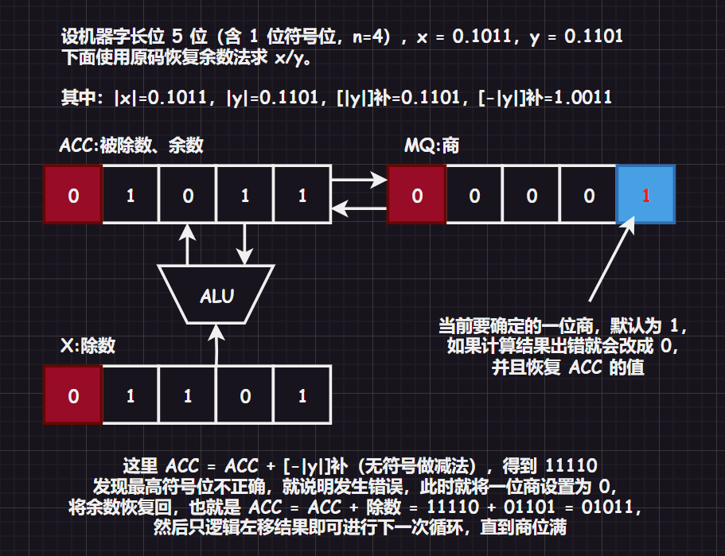
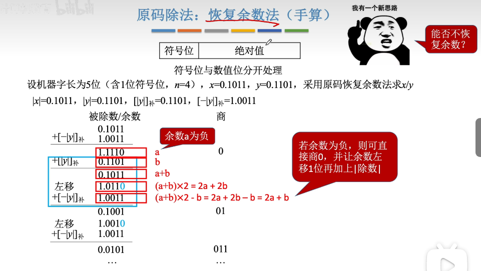
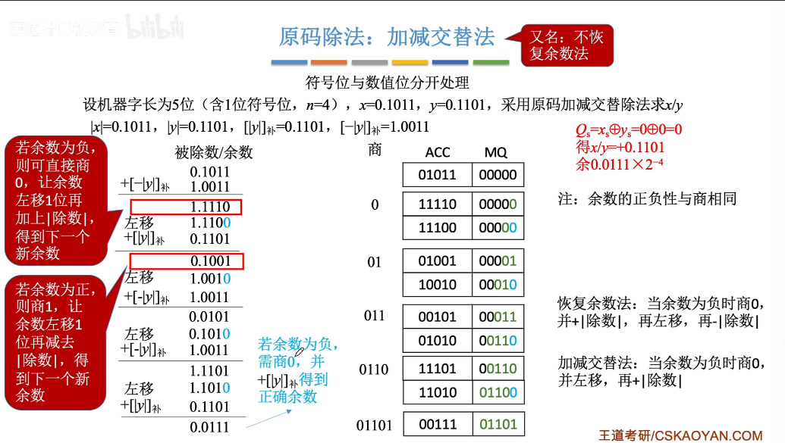
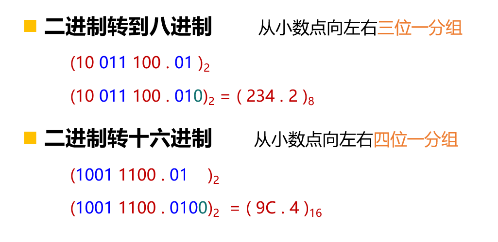
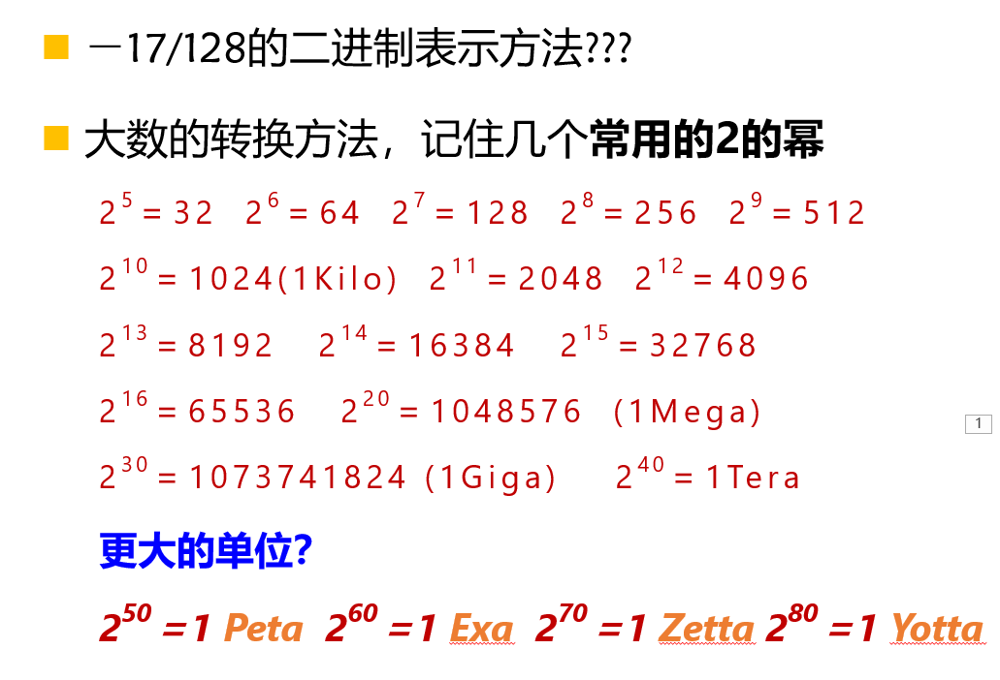
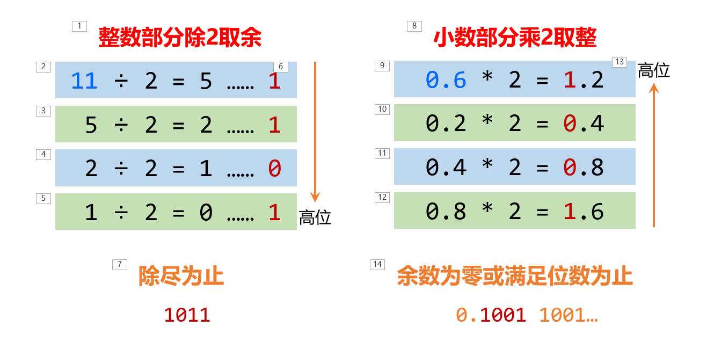

[TOC]

数据表示可以方便计算机识别和使用，一般要考虑：数据类型、范围和精度、存储和处理代价、可移植性等。一般使用 `+/-` 符号直接表示的二进制数为真值，但是机器无法识别这种专门供人类阅读的书写形式，需要转化为对应的机器码（原码、反码、补码、移码等）。

# 1.整数

## 1.1.整数分类

根据符号正负分为正整数和负整数，而根据有无符号分为有符号整数和无符号整数。

## 1.2.原反补移

1.   原码：使用 `1/0` 符号位表示正负，剩下的二进制位都是数据位，存储数值，存在两个机器 `0`

     

2.   反码：除符号位，将原码的所有二进制位全部取反即可得到

     

3.   补码：考虑符号位，在反码的基础上 `+1` 即可得到（也可以使用向右扫描，左取反的扫描法）

     

| $(n + 1)bit序列$ | 合法范围                     | Max        | Min                                        | 真值 $0$ 的表示                       |
| -------------------------- | ---------------------------- | ---------- | ------------------------------------------ | ----------------------------------- |
| 带符号整数原码             | $[-(2^{n} - 1),(2^{n} - 1)]$ | $0,111..1$ | $1,111..1$                                 | 有 $\pm 0$                           |
| 带符号整数反码             | $[-(2^{n} - 1),(2^{n} - 1)]$ | $0,111..1$ | $1,111..1$                                 | 有 $\pm 0$                           |
| 带符号整数补码             | $[-2^{n},(2^{n} - 1)]$       | $0,111..1$ | $1,000..0$ 该数无法在 $n+1\,bit$ 内转变为原码 | 只有 $0$，$-0$ 是有意义的，表示最小数 |
| 不带符号整数                | $[0,(2^{n+1} - 1)]$          | $1111..1$  | $0000..0$                                  | 只有 $0$                             |

>   补充：判断溢出可以先转化为十进制再验证是否溢出。

移码是在补码的基础上将其符号位取反诞生的，移码只能表示整数。移码对于真值 `0` 的表示也只有一种，表示的合法范围和补码一样，也是可以多表示一个负数，两者是一一对应的。真值转化为补码，然后转化为移码，将移码作为无符号整数理解，则可以更好对比大小。

移码会运用在浮点数的阶码当中（以后讲）。

>   补充：$ [-0]原码=1000\,0000,[-0]反码=1111\,1111,[-0]补码=[1]_{溢出抛弃}0000\,0000$

## 1.2.整数加减

1.   无符号整数加法：两操作数直接 `bit` 位相加
     $$
     A + B = (A_{取补} + B_{取补})_{取原}
     $$

2.   无符号整数减法：将 `-` 交给减数构成 `-减数`，式子变成加式，取 $被减数_{补}$ 和 $(-减数)_{补}$，然后全部 `bit` 位相加
     $$
     A - B = A_{取补} + (-B)_{取补}
     $$

3.   有符号整数加法：两操作数全部取补码，进行补码相加（即全部 `bit` 位相加）
     $$
     A + B = (A_{取补} + B_{取补})_{取原}
     $$

4.   有符号整数减法：两操作数全部取补码，进行补码相减（即将补码理解为无符号整数的相减，转化为无符号整数相减）
     $$
     A - B = (A_{取补} - B_{取补})_{取原}\\
     $$

> 补充 `1`：如果希望加快转化 $X_{补}$ 到 $(-X)_{补}$ 的速度，可以从右往左找到第一个 `1`，然后这个 `1` 左边的所有 `比特位`（要包括符号位）按位取反即可。
>
> 补充 `2`：如果希望加快转化 $X_{原}$ 到 $X_{补}$ 的速度，可以从右往左找到第一个 `1`，然后这个 `1` 左边的所有 `数值位`（不包括符号位）按位取反即可。
>
> 补充 `3`：如果没有指明字长，写带符号位的二进制可以不用写多余的 `0`，例如：`1000011` 可以写成 `1,11`
>
> 补充 `4`：实际上，“无符号整数的减法运算的过程”和“补码减法的过程”是一样的。因为补码可以理解为无符号整数。由于这两个过程是一样的，因此可以让“无符号整数相减”和“补码相减”共用一个加法器。

# 2.小数

## 2.1.小数分类

### 2.1.1.定点小数

定点小数的小数点固定在符号位后面的某一位置（无特殊规定，默认是符号位后一位），小数点位置的不同，会导致二进制的位权不一样，造成结果不同。

与定点小数相对的，也存在定点整数，定点整数也就是带符号整数，默认小数点固定在最后的位置。

> 补充：分割符的区别
>
> 1.   定点整数通常会在符号位后使用 `,` 隔离开符号位和数值位
>2.   定点小数通常会在符号位后使用 `.` 来隔开符号位和数值位

如果我们需要对定点数进行比特位拓展，由于小数点的位置不同，为了保持位权不变：

1.   定点整数应该在符号位后面拓展比特位（例：$1,110 \to 1,[000]110$）
2.   定点小数应该在最末尾后面拓展比特位（例：$1.110 \to 1.110[000]$）

### 2.1.2.浮点小数

[略]

## 2.2.原反补移

定点小数的原反补码以及有无符号相加和定点整数一样没有太大区别（定点小数没有移码的概念），不过需要注意的是，定点小数的补码也会多出一位，并且真值 `0` 也只有一种表达方式。

## 2.3.小数加减

除了解读方法不一样，小数的加法和减法和整数都一样。

# 3.编码

## 3.1.BCD/8421 码映射

`BCD` 码（Binary-Coded Decimal）是一种用二进制数来编码十进制数字的方式。`BCD` 码使用 `4` 位二进制数来表示一个十进制数的每一位。而 `8421` 码是 `BCD` 码的一种实例化：

| 0    | 1    | 2    | 3    | 4    | 5    | 6    | 7    | 8    | 9    |
| ---- | ---- | ---- | ---- | ---- | ---- | ---- | ---- | ---- | ---- |
| 0000 | 0001 | 0010 | 0011 | 0100 | 0101 | 0110 | 0111 | 1000 | 1001 |

因此 `132` 可以表示为 `0001 0011 0010`，其中 `8421` 码没有 `1010~1111` 的定义（也就是 `10~15`）。那么如果进行计算 `+` 运算呢？

`5 + 8 = 13` 就可以先直接 `0101 + 1000 = 1101`，但是 `BCD` 码没有 `1101` 定义怎么办呢？可以在原二进制值 `+6` 来进行进位修正。即：`1101 + 0110 = 1 0011 = (13)10`。

>   补充：由于 `BCD` 码只使用了 `4bit` 位组中的 10 个定义，还剩下了 6 个定义没有被使用，因此如果我们修改映射方案就可以得到不同的编码规则。

## 3.2.余 3 码映射

在 `8421` 码的基础上，每个码值的定义都加上 `0011`（十进制为 3）

| 0    | 1    | 2    | 3    | 4    | 5    | 6    | 7    | 8    | 9    |
| ---- | ---- | ---- | ---- | ---- | ---- | ---- | ---- | ---- | ---- |
| 0011 | 0100 | 0101 | 0110 | 0111 | 1000 | 1001 | 1010 | 1011 | 1100 |

## 3.3.2412 码映射

这种映射方案直接改变了权值，把 `8421` 对应的二进制权值修改为 `2421`，因此码值的映射关系如下：

| 0    | 1    | 2    | 3    | 4    | 5    | 6    | 7    | 8    | 9    |
| ---- | ---- | ---- | ---- | ---- | ---- | ---- | ---- | ---- | ---- |
| 0000 | 0001 | 0010 | 0011 | 0100 | 1011 | 1100 | 1101 | 1110 | 1111 |

但是这种编码方案有一个问题，比如 `5` 有两种表示方法 `0101` 和 `1011`，因此我们还额外规定 `0~4` 的第一位二进制位是 `0`，`5~9` 的第一位二进制位是 `1`，这样就可以使得定义变得唯一确定。

# 4.定点数的位移运算

## 4.1.算术位移

算术一位实际上就是改变小数点和数码位的相对位置，数学描述就是 $number ×/÷ 10^{n}$，我们可以拓展到原码（包括整数和小数）的位移。

### 4.1.1.原码的位移运算

1.   原码的算数右移运算就是：符号位保持不变，仅对数值位进行右移位，高位数值位补 $0$，其中有可能会发生精度损失（舍弃位为 $0$ 则相当于除以 $2$，舍弃位为 $1$ 则会丢失精度）。
2.   原码的算数左移运算就是：符号位保持不变，仅对数值位进行左移位，低位数值位补 $0$，其中有可能会发生严重误差（舍弃位为 $0$ 则相当于乘以 $2$，舍弃位为 $1$ 则会严重误差）。

### 4.1.2.反码的位移运算

正数的原码和反码是一样的，因此位移操作一样。但是负数的原码和反码是不一样的，反码在补位时需要补 $1$。

### 4.1.3.补码的位移运算

正数的原码和补码码是一样的，因此位移操作一样。但是负数的补码位移比较复杂，最右边的 $1$ 及其右边同原码操作，最右边的 $1$ 的左边同反码操作。

>   补充：算术移位应用
>
>   为什么要提及位移操作呢？实际上位移操作是计算乘法的重要基础。假设有 $-20 × 7$，则有
>   $$
>   \begin{array}{left}
>   -20 × 7\\
>   = -20 × (2^0 + 2^1 + 2^2) \\
>   = (-20 × 2^0)_{位移操作} + (-20 × 2^1)_{位移操作} + (-20 × 2^2)_{位移操作}\\
>   \end{array}
>   $$

## 4.2.逻辑位移

对于所有 `bit` 位来说：

1.   逻辑右移：高位补 $0$，低位舍弃
2.   逻辑左移：低位补 $0$，高位舍弃

可以把此时的二进制看作是无符号整数。

>   补充：逻辑移位应用
>
>   常用在颜色存储中，位移操作可以将三个颜色的数据组合在一起。

## 4.3.循环位移

类似队列，但是移出来的位需要在另一端重新入队，这样的位移就是：循环左移和循环右移。

还有一种情况是带有进位位 `CF` 的循环位移，进位位实际上就是在计算加法时产生的溢出进位，在循环位移的时候，也考虑这个位即可。

>   补充：循环位移应用
>
>   循环位移可以将一个数的高字节和低字节进行调换，这很适合将数据在大小端之间做转化。

# 5.乘法和除法运算

之前我们有稍微提及过乘法和除法的计算和位移有关，这次我们来细细分析一下。
$$
\begin{array}{right}
0.985\\
× 0.211\\
\hline
985\\  
985\enspace\\
1970\enspace\enspace\\
\hline
0.207835\\
\end{array}
$$
实际上，对于上述的计算可以拆分为：
$$
\begin{array}{left}
0.985 = 985 × 10^{-3}\\
0.211 = 2 × 10^{-1} + 1 × 10^{-2} + 1 × 10^{-3} \\
所以: 0.985 × 0.211\\
= (985 × 1 × 10^{-6}) + (985 × 1 × 10^{-5}) + (985 × 2 × 10^{-4}) \\

\end{array}
$$
这种思想就可以迁移到原码补码上。

## 5.1.原码的运算

### 5.1.1.原码的一位乘法运算

对于 $x_{原} = 1.1101$ 和 $y_{原} = 0.1011$，求 $x_{原} × y_{原}$。

1.   符号位：用 $x_{符号位} \textasciicircum y_{符号位}$ 可得符号位

2.   数值位：数值位的计算过程如下，并且可以利用位移缩短空间
     $$
     \begin{array}{right}
     0.1101\\
     × 0.1011\\
     \hline
     01101\\  
     01101\enspace\\
     00000\enspace\enspace\\
     01101\enspace\enspace\enspace\\
     \hline
     0.10001111\\
     \end{array}
     $$
     

因此符号位和数值位我们都有了，就可以算出来结果了。

### 5.1.2.原码的一位除法运算

如果是手算，实际上和十进制是一样的，如何用加法器实现呢？ 

1.   符号位：用 $x_{符号位} \textasciicircum y_{符号位}$ 可得符号位

2.   数值位：取绝对值后，数值位的计算过程如下，同样利用位移缩短空间

上述方法还可以优化，也就是加减交替法：

## 5.2.补码的运算

### 5.2.1.补码的一位乘法运算

补码一位乘法和原码的一位乘法很像，但是最后要再来一次加法，并且原码一位乘法是根据最低位，要么是加 $0$ 要么就是加 $[|x|]_{原}$，这点补码也会有差别。

先说结论，在补码乘法中会多出一个辅助位，辅助位初始为 $0$，后续通过算术右移更新辅助位：

1.   若 $辅助位 - 最低位 = 1$，$ACC + [x]_{补}$
2.   若 $辅助位 - 最低位 = 0$，$ACC + 0$
3.   若 $辅助位 - 最低位 = -1$，$ACC + [-x]_{补}$

并且，补码的乘法运算采用算术右移。原码的符号位不参与运算，补码的符号位参与运算。

### 5.2.2.补码的除法运算

>   补充：上述的各种计算方法建议转化为 `mermain` 流程图语法，后续有时间就使用 `AE` 或者 `py` 来做动画。

# 6.数据校验

## 6.1.校验原理

在二进制信息的传输中，由于多种不明干扰，有可能造成二进制错乱（位错误，`1` 变成 `0`，`0` 变成 `1`），导致信息错误的产生，这个时候就诞生出“校验”的概念。

如果在两位的二进制数据的最高位加上用于校验的 `校验位`，则计算机可以依靠这个校验位达到校验的目的，确认数据的正确性。

原数据映射表（有 4 种合法状态）：

| 信息 | A    | B    | C    | D    |
| ---- | ---- | ---- | ---- | ---- |
| 编码 | `00` | `01` | `10` | `11` |

加上校验位则变为（除了四种合法状态还有 `4` 种冗余的非法状态）：

| 信息 | A      | B      | C      | D      |
| ---- | ------ | ------ | ------ | ------ |
| 编码 | `1 00` | `0 01` | `0 10` | `1 11` |

对于原来的映射表，如果发生了位错误，例如：`00` 变成 `10` 或者 `01` 则计算机识别不出来携带位错误。

对于修正后的映射表，如果发生了位错误，例如：`100` 变成了 `110` 或者 `101` 或者 `000` 计算机都能识别出来这是非法的编码。同理其他情况也是，不过这种只能针对只有一个比特位数据发生修改的行为，如果发生多个比特位数据的位错误就不一定能识别出来了。

## 6.2.奇偶校验

因此我们可以根据类似的校验原理得到奇偶校验码的相关概念。

```mermaid
graph LR
A{"奇偶校验码(1位校验位 + n位信息位)"} --> B["奇校验码"] --> D["整个校验码“1”的个数为奇数"]
A --> C["偶校验码"] --> E["整个校验码“1”的个数为偶数"]
```

例如 `100 1101` 的奇校验码的校验位就是 `1`（最终得到 `1100 1101`），`100 1101` 的偶校验码的校验位就是 `0`（最终得到 `0100 1101`）。

那么计算机究竟是怎么“察觉错误”的呢？

我们是通过计数的方式，来查看是否为奇数个 `1` 或偶数个 `1`。

而计算机则通过 `^`（或叫“模 `2` 加运算”）运算，比如：对于奇校验码 `11001101`，对每一个二进制位使用异或，异或到一起的值就是 `1^1^0^0^1^1^0^1` 为 `1` 因此计算机认为这是正确的数据，但是如果发生位错误，数据变为 `11001100`，则异或的结果变为 `0`，计算机成功识别出错误！（对于奇校验码异或的结果一定为 `1`，对于偶校验码异或的结果一定为 `0`）

根据异或的特性，我们很容易明白一个事情。

1.   “奇校验码”只有奇数个位发生位错乱才可以识别出错误
2.   “偶校验码”只有偶数个位发生位错乱才可以识别出错误。

并且无论是奇校验码还是偶校验码都无法察觉出究竟是哪一个比特位发生错误，只能知道所给的二进制码必然发生了错误，进而抛弃整个二进制码，要求对方重新发送。

## 6.3.海明校验

待补充...

## 6.4.CRC校验

待补充...

# 7.进制转换

## 7.1.二进制互转八进制、十六进制

## 7.2.二进制互转十进制

# 8.数据单位

