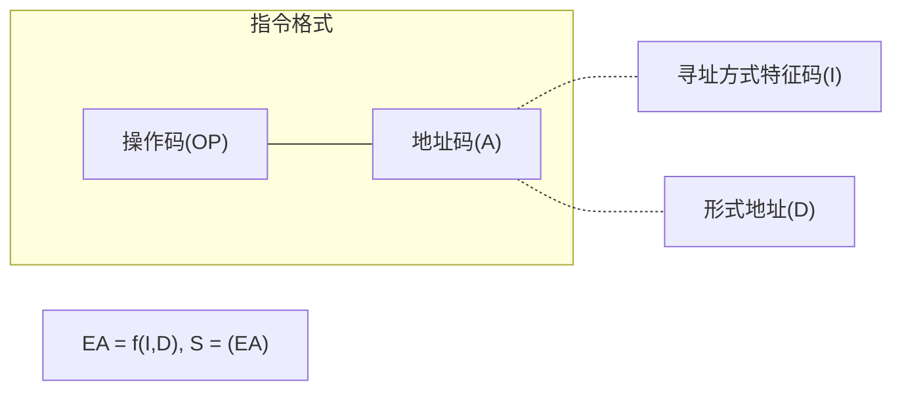
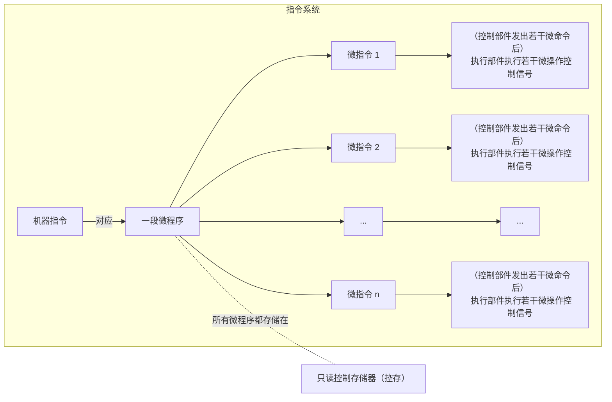

>   前要：提到 `CPU`，首先就需要知道 `CPU` 处理的指令集是怎么构成的，然后才深入到 `CPU` 的原理。

# 1.指令和指令集

## 1.1.一般指令格式

### 1.1.1.指令概念

是指示计算机执行某种操作的命令，是计算机运行的最小功能单位。一台计算机中所有指令构成该计算机的指令系统/指令集。

>   注意：一台计算机只能执行自己指令系统中的指令，不能执行其他系统的指令，一般不具备可移植性。

### 1.1.2.指令构成

指令是计算机传递信息的载体，指令格式是用二进制代码表示指令的结构形式。

指令格式一般要求明确：

1.   处理什么操作数
2.   对操作数做什么操作
3.   以何种凡是获取操作数等信息

指令格式的一般格式为：**操作码(OP) + 地址码(A)**，可根据操作码的类型分类，或者根据地址码的数目分类（都在后面提及）。

>   补充：一条指令可能会有多个地址码，而通过什么方式来获取操作数由寻址方式字段决定（说白了就是地址码中某几个位会作为标识位，表示某种寻址方式），这在后面操作数寻址会提及。

而一条指令中所包含的二进制位数就被称为 **指令字长**，可根据字长是否位固定值来分类（后面提及）。

>   注意：需要区分开三个字长
>
>   1.   指令字长：一条指令的总长度（有可能不是固定长度的）
>   2.   机器字长：`CPU` 进行依次运算能处理的二进制的位数（通常和加法器 `ALU` 相关）
>   3.   存储字长：一个存储单元中的二进制位数（通常和主存中的存储数据寄存器 `MDR` 相关）

### 1.1.3.指令分类

#### 1.1.3.1.根据地址码的数目分类

1.   **零地址指令**：例如一些空操作、停机、关中断指令（无需操作数，因此不需要通过地址码寻找操作数）
2.   **一地址指令**：例如加一、减一、取反、求补操作（只需要一个操作数即可），某些需要两个操作数指令也有可能是一地址指令，因为另外一个操作数可能存放在寄存器中，这样做的目的是为了加快速度
3.   **二地址指令**：例如 `C` 语言的 `+=` 操作就是典型的二地址指令，二地址指令还可以分为 `RR`（寄存器-寄存器）、`RS`（寄存器-存储器）、`SS`（存储器-存储器） 型指令
4.   **多地址指令**：三地址指令、四地址指令（有些四地址指令最后一个地址码存储的是下一条将要被执行指令的地址，因此四地址指令通常可以完成在程序流中跳转的目的）

#### 1.1.3.2.根据指令字长固定分类

1.   **定长指令字结构**：指令系统中所有指令的长度全都相等（控制器的译码电路设计简单，但灵活性比较低）
2.   **变长指令字结构**：指令系统中各种指令的长度可能不等（控制器的译码电路设计复杂，但灵活性比较高）

>   补充：变长指令根据指令长度和机器字长的倍数可以继续细分为
>
>   1.   半字长指令（指令长度是机器字长的 `0.5` 倍）
>   2.   单字长指令、双字长指令 
>
>   指令长度不能太长，假设有双字长指令，而 ` CPU` 每次只能操作一个字长的指令，因此需要执行该双字长指令的操作就必须要访存两次，才能取到完整的指令。

#### 1.1.3.3.根据操作码的操作分类

1.   **数据传送指令**：例如 `LOAD`（把寄存器中的数据放到另外一个寄存器）、`STORE`（把寄存器中的数据放到其他存储器中）
2.   **算术逻辑指令**：算术操作（加减乘除）和逻辑操作（与或非）
3.   **移位指令**：算术位移、逻辑位移、循环位移
4.   **跳转/转移指令**：例如 `JMP`（无条件跳转）、`JZ`（结果为零跳转）、`JO`（结果溢出跳转）、`JC`（结果进位跳转）、`CALL`（函数调用指令）、`RETURN`（函数返回指令）
5.   **输入输出指令**：`CPU` 寄存器和 `IO` 端口之间的数据传送（这里的端口指的是 `IO` 接口内的寄存器）

## 1.2.拓展操作码指令格式

就是定长指令结构下，而内部操作码可变长的一种指令格式（或者说地址码的数量可变），因此可以根据这点将指令分为：

1.   定长操作码（不是定长指令结构）
2.   变长操作码（不是变长指令结构）

并且还可以根据设定拓展位来拓展指令，这使得指令设计跟加灵活，这里举个例子。

若指令字长固定为 `16` 位，一个基本地址码都需要占用 `4` 位比特位，若有三地址数据，则编码如下：

| 操作码 1 | 地址码 1 | 地址码 2 | 地址码 3 |
| ------- | ------- | ------- | ------- |
| 0000    | A1      | A2      | A3      |
| 0001    | A1      | A2      | A3      |
| ...     | ...     | ...     | ...     |
| 1110    | A1      | A2      | A3      |

而如果只有两个地址码，则编码如下：

| 操作码 1 | 操作码 2 | 地址码 1 | 地址码 2 |
| ------- | ------- | ------- | ------- |
| 1111    | 0001    | A1      | A2      |
| 1111    | 0010    | A1      | A2      |
| ...     | ...     | ...     | ...     |
| 1111    | 1110    | A1      | A2      |

一地址码、零地址码也依次类推...

>   例题：假设给定字长为 `16`，最多具有 `3` 个基本地址码（每个基本地址码为 `4` 位），若已知设计了指令集中，三地址指令有 `15` 条、双地址指令集有 `14` 条、单地址指令集有 `22` 条，问：最多可以设计多少条零地址指令？
>
>   只需要将除去已经编码的指令条数，剩下的未编码的指令就可以设计未零地址指令。
>
>   并且需要注意，双地址只能使用三地址剩下的不用的剩余状态，一地址只能使用而地址剩下的不同的剩余状态。
>
>   -   三地址指令总共有 `2^4 = 16` 种状态，还剩 `1` 种状态没被使用
>
>   -   二地址指令总共有 `2^4 = 16` 种状态，还剩 `2` 种状态没被使用
>   -   一地址指令里，如果三地址和二地址指令是满编（全都定义了）的，则共有 `2^4 = 16` 状态，但是由于前面二地址指令还有两种状态没被使用，因此应该一起统计进来，也就是 `2*2^4 = 32` 种状态，还剩 `10` 种状态没被使用
>   -   因此零地址指令的数目最多为 `10*x^4`

## 1.3.指令寻址

指令寻址问题就是在于：“如何确定出下一条指令的存放地址”。

如果指令是顺序存放那好办，只要对存放指令的 `PC` 寄存器内部进行简单的加一即可，但是我们的指令并不一定是顺序存放的，因此只靠 `PC+=1` 是远远不够的。

但有一点可以肯定，下一条要被执行的指令一定是 `PC` 寄存器内存储的地址（但是这个值不一定是 `PC+=1` 来的）。

### 1.3.1.顺序寻址

因为机器指令序列在主存中往往顺序存放，则直接 `PC+=1` 即可，但是必须是定长指令格式，变长指令格式很难靠 `PC+=1` 的操作和下一条指令进行区分。

### 1.3.2.跳跃寻址

典型的情况就是程序里有跳转（循环、分支、函数调用等），会暂时或者长久改变程序流的执行顺序，此时就不采用 `PC+=1` 的操作，只能依靠一些跳转指令（比如 `jmp`）。

## 1.4.操作数寻址

操作数寻址就是形成操作数有效地址的方法，操作数是程序运行中取出并且加工的对象，其存储方式比较灵活多样，比指令寻址要复杂得多。

操作数的来源主要有种情况：

1.   来自指令地址字段
2.   来自寄存器中（寄存器操作数）
3.   来自存储器中（存储器操作数）

由此可以衍生出多种寻址方式：立即寻址、直接寻址、寄存器寻址、间接寻址、寄存器间断寻址、相对寻址、变址寻址、基址寻址、堆栈寻址。

不同指令可能会有不同的寻址方式，因此我们需要对地址码做一个简单的划分（如下），以某些字段标识。



形式地址不一定是操作数真正的存储地址，需要结合寻址方式特征码组合转化为有效地址（实际存储的地址），假设最终得到的地址是 `EA`，对应存储操作数为 `S`，则有 `S=(EA)`，表示该地址存储了该操作数，类似 `C` 语言指针解引用，是一种访问对应地址数据的表示方法。

### 1.4.1.立即寻址

`I` 字段表示立即寻址的编码，`D` 字段就是操作数本身（也就是说，操作数 `S=D`，因此执行时可以直接从指令中获取操作数）。

```assembly
MOV EAX, 2008H # 为寄存器 EAX 赋值 2008H
```

速度极快，但是 `D` 字段的位数有限，无法存储大容量的数据，一般用作赋值指令，而这样的操作数也被称为“立即数”）。

### 1.4.2.直接寻址

`I` 字段表示直接寻址的编码，`D` 字段就是主存储器中的地址，内部存储操作数 `S` （也就是说，可以通过 `D=EA` 字段找到操作数 `S`）。

直接寻址的地址十分直观（形式地址此时等于实际地址，也被叫做直接地址），不需要通过计算来得出实际地址。

但是也有不足之处：

1.   寻址的范围只能限定于 `D` 字段能表示的范围
2.   操作数地址硬编码进程序中，不容易修改（或者修改困难），因此代码维护困难

```assembly
MOV EAX, [2008H] # 将 2008H 的主存单元内部内容送入寄存器 EAX 中
```

### 1.4.3.寄存器寻址

`I` 字段表示寄存器寻址的编码，`D` 字段就是寄存器的编号，该编号的寄存器内部存储操作数 `S`（也就是在某个寄存器中存储操作数，使用寄存器编号来寻找该操作数，和直接寻址很类似，就是速度要快一些，一方面时体现在寄存器本身的读取速度，另外一方面时因为寄存器本身的数量不会太多，编号所需比特位较少）。

```assembly
MOV EAX, ECX # 将寄存器 ECX 中的数据送入到寄存器 EAX 中 
```

最大的不足之处和直接寻址类似：寄存器有限，所给编号有限（这里可以提及 `C` 语言的关键字 `register`，待补充...）。

### 1.4.4.间接寻址

`I` 字段表示间接寻址的编码，`D` 字段就是主存储器中的地址，该地址处存储有效地址，有效地址处存储操作数（也就是说 `EA=(D), S=(EA)` 即 `S=((D))`，类似 ` C` 语言中的二级指针解引用）

```assembly
MOV EAX, @2008H # 其中 @ 代表间接寻址的标志
```

优点很明显，灵活，使得代码易于修改（修改操作数地址时，不用修改代码，只修改形式地址 `D` 指向的指针即可），能使用较短的地址码访问较大的主存空间。

但是两次寻址（还是在主存中两次寻址）会导致指令执行速度变慢，大部分情况下会被寄存器间接寻址替代。

### 1.4.5.寄存器间接寻址

`I` 字段表示寄存器间接寻址的编码，`D` 字段就是寄存器编号，该编号的寄存器内部存储操作数在主存中的地址，因此时一次寄存器寻址和一次主存寻址，比间接寻址少一次访问主存，速度要快一些。

```assembly
MOV AL, [EBX] # 将寄存器 EBX 内存储的主存地址指向的操作数送给 AL
```

### 1.4.6.相对寻址

`I` 字段表示相对寻址的编码，相对寻址就和前五种寻址区分较大，利用程序计数器 `PC` 指针的内容，加上形式地址 `D` 来形成操作数的实际地址（因此有 `EA=PC+D, S=(EA)=(PC+D)`，而实际地址指向的通常也是注主存空间）。

`PC` 在取指令完成的时候完成，上式中的 `PC` 内容应为 `PC` 的当前值，也就是下一条将要执行指令的地址值。

```assembly
# 暂时没找到对应的指令
```

相对寻址的优点是编程时只需确定程序内部操作数与指令之间的相对距离，而无须确定操作数在主存中的绝对地址，便于实现程序浮动。除可用于访问内存外，相对寻址也可以用于分支转移类指令，实现相对跳转转移，有利于程序在主存中的灵活定位。

### 1.4.7.变址寻址

`I` 字段设置为变址寻址的编码，使用寄存器来存放变化的地址，此时的寄存器就叫做“变址寄存器”，此时 `D` 字段包含了该寄存器的编号和形式地址（形式地址是偏移量，寄存器里的是需要变化的地址），两者相加才可以得到主存地址，找到对应的操作数。

```assembly
MOV EAX, 32[ESI] # 变址寄存器 ESI 的值加上便偏移量 32 来形成主存中的实际地址
```

其他寻址方式以后补充...

>   注意：这里的存储器是非寄存器的存储器，大概率指主存，以后编写文章将这句话加上去。
>
>   注意：上述指令都是基于 `Intel x86` 的指令集

>   补充 `1`：某计算机字长为 `16` 位，主存由 `64KB=1024B` 指令采用单字长、单地址结构，要求至少能支持 `80` 条指令和直接、间接、相对、变址等四种方式，请设计指令格式并且计算每种寻址方式能访问的主存空间范围。
>
>   >   解析：首先 `I` 是最好确定的，需要标志四种取值方式，因此就需要 `2` 为比特位，需要 `80` 条指令，那么最少需要 `7` 位比特位（`6` 位比特位的话最多由 `64` 条指令） ，而机器字长有需要 `16` 位，因此最后留有 `16-7-2=7` 为作为形式地址。
>   >
>   >   1.   如果用来作为直接寻址，则 `7` 位存储 `[0, 127]` 这些直接地址（每个地址指向一个字节的数据
>   >
>   >   2.   如果用来作为间接寻址，虽然 `7` 位存储 `[0, 127]` 这些间接地址，但是可以访问每一块可以表示的主存空间 `[0, 65535=2^16]`
>   >   3.   如果用来作为相对寻址，也可以可以访问可以表示的主存空间 `[0, 65535=2^16]` （程序计数器 `PC` 为 `16` 位）
>   >   4.   如果用来作为变址寻址，也可以可以访问可以表示的主存空间 `[0, 65535=2^16]` （变址寄存器 `X` 为 `16` 位）
>
>   补充 `2`：某计算机指令字长为定长 `16` 位（这意味着 `PC` 指针的加一操作是在地址基础上加两个字节），假设形式地址 `D` 字段为 `8` 位，内存按字节寻址，指令中的数据采用补码表示，且 `PC` 的值在取指令阶段完成修改。若采用相对寻址指令的当前地址为 `2003H` ，且要求数据有效地址为 `200AH` ，则该相对寻址指令的形式地址字段的值为多少？
>
>   >   解析：首先需要知道相对地址是使用 `PC+D` 得到实际地址，并且 `PC` 在取指令完成的时候完成修改，所以取得指令后 `PC` 变为 `PC=2003H+2H=2005H`，所以 `D=EA-PC=200AH-2005H=5H`。

# 2.微程序控制



微程序控制的基本思想是：仿照程序设计的基本方法，将实现指令系统中所有指令功能所需要的“所有控制信号”，按照一定的规则编码成微指令。

若干条实现同一条指令功能的微指令构成一段微程序，将实现所有指令的微程序存放在一个只读存储器中，这个存储器称为控制存储器（简称控存）。

## 2.1.微操作

控制部件发出若干微命令后，执行部件就会执行若干“微操作控制信号”，微操作可分为 **相容性微操作** 和 **互斥性微操作** 两种。

1.   相容性微操作：能够在同一个时间周期内执行的微操作
2.   互斥性微操作：不能在同一个时间周期内执行的微操作

>   补充：通常存储器对同一个存储单元的读和写就是互斥微操作。

## 2.2.微指令

在计算机的某个时间周期内，一组实现一点操作功能的相容性微操作称为“微指令”。

微指令包括操作 **操作控制字段** 和 **顺序控制字段** 两部分。

| 操作控制字段        | 顺序控制字段          |
| ------------------- | --------------------- |
| `1,0,0,0,1,0,1,0,0` | 判别测试字段+下址字段 |

操作控制字段是主体，由若干微命令位组成，每一位均对应一个微操作控制信号，有多少个微操作控制信号，就对应有多少个比特位（微指令是否含某个微命令，由对应位的状态 `1` 或 `0` 决定）。

微程序控制器向执行部件发出的微命令就是通过微指令的操作控制字段发出的。

而顺序控制字段决定多条微指令的先后执行顺序，顺序控制字段包括 **判别测试字段** 和 **下址字段** 两部分。

1.   判别测试字段：指出微指令执行过程中需要测试的外部条件（例如是否要根据指令译码进行微程序分支、进位、运算结果是否为零、是否是当前微程序的最后一条微指令...）
2.   下址字段：存放的是下条微指令的地址，位宽与微程序规模有关，最终是否按照该地址执行微程序与判别测试结果有关。通常会按下址字段取下一条微指令，若需要进行条件测试且测试条件成立，则会对下址字段给出的地址进行修改，实现微程序分支跳转

## 2.3.微程序

实现一条指令功能的若干微指令的集合称为”微程序/机器指令。

其中有一类比较特殊的微程序，即“取指微程序（取得指令的指令）”。通常将取指周期（就是取得指令内的时间）内的操作编制成一段公共的微程序，并将其存放在控制存储器 `0` 号单元开始的区域（方便共享、启动这段微程序），系统上电时会自动从取指微程序开始执行。

指令取出后再根据指令译码情况分支跳转到对应指令的微程序入口地址（微程序指令译码分支跳转是通过判别测试字段中的译码测试位实现的，取指令微程序最后一条微指令的译码测试位应设置为 `1`, 为 `1` 表示并不需要检查其他状态条件，直接根据译码情况进行分支跳转）。

>   补充：微指令周期
>
>   与微程序/机器指令的执行类似，微指令只有从控制存储器中被读出后才能被执行。因此我们将取出并且执行一条微指令所需的时间定义为“微指令周期”，简称“微周期”，有多少微指令就有多少个微周期.

>   总结：微指令是比较容易理解和设计的描述指令执行控制信号的方法，微程序的执行意味着控制一条指令执行所需要的控制信号按照一定的顺序被依次被激活，这是一种**软件时序调制**。

## 2.4.控存器

待补充...

# 3.CPU 内的主要寄存器

## 3.1.程序计数器

也就是常说的 `PC` 指针，保存将要执行的指令的地址（`Intel x86` 称为 `IP`），内部存储的指令与主存总线地址总线位宽相同，`CPU` 取指令会根据这个 `PC` 的内容来取得指令送入指令寄存器种，然后更新 `PC` 指向下一条指令的地址（顺序跳转直接 `+1`，分支跳转则使用分支指令提供的分支地址修改 `PC` 的值）。

## 3.2.地址寄存器

也就是 `AR` 寄存器，存储 `CPU` 需要访问的地址，并不是必须存在的，有些计算机可以直接将访存地址加载在地址总线上实现访存，==其位数和主存总线位宽相同==。

## 3.3.数据寄存器

也就是 `DR` 寄存器，存储从主存中读出的数据（或者将要写入主存的数据），同样在实际实现中 `DR` 也不是必须存在的，这和地址寄存器类似，==其数据位宽和机器字长相同==。

## 3.4.指令寄存器

也就是 `IR` 存放当前正在指向的指令，从主存中取出的指令就放在这里，指令字由指令译码器 `ID` 翻译成若干个指令译码信号，每个指令译码信号代表一条不同的指令，同一时刻只有一个信号生效，同样也不是必须存在的，==其位宽和指令字长相同==

## 3.5.通用寄存器

`GR` 是通用的寄存器，作用很杂，有多种用途，增加通用寄存器可以减少访问主存的次数，从而提高 `CPU` 的处理效率，还可以方便汇编程序以及生成汇编代码，并且属于用户可见寄存器。

## 3.6.状态寄存器

`PSW/PSR` 主要用于保存算术运算、逻辑运算指令、测试指令等建立的各种标志位（`flag`）。

常见的状态信息包括进位标志 `C` 、溢出标志 `V` 、结果为负数标志 `S`、结果为零标志 `Z` ...

通常条件分支指令利用 `PSW` 的值实现分支条件，程序状态字寄存器还可用于保存中断和系统工作的状态信息，以便 `CPU` 能及时了解运行的状态，从而便于控制程序，并且属于用户可见寄存器。

