# 1.指令基础

## 1.1.指令概念

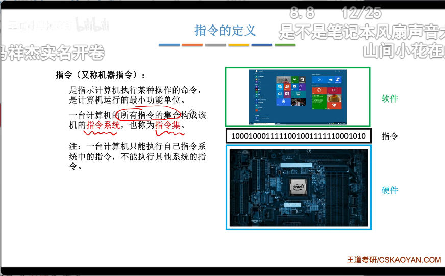

## 1.2.指令构成

操作码和地址码

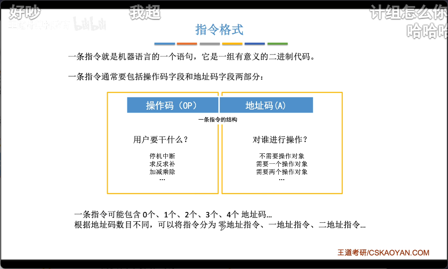

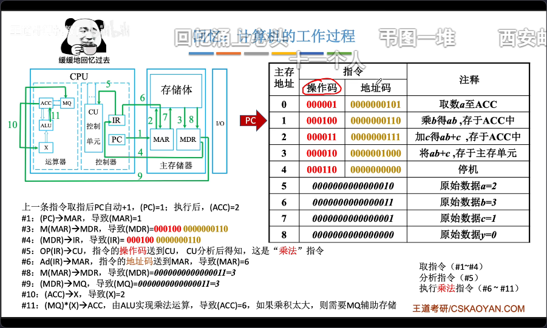

## 1.3.指令分类

### 1.3.1.根据地址码数目分类

#### 1.3.1.1.零地址指令

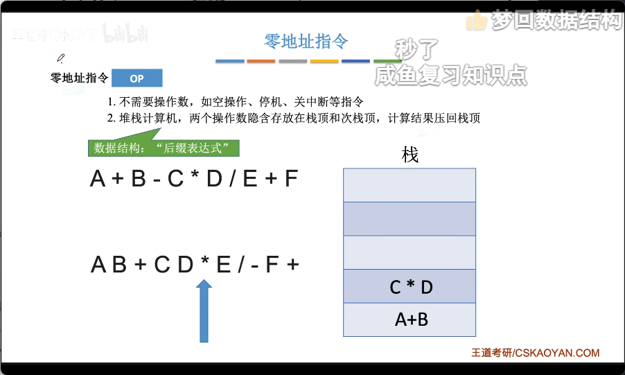

#### 1.3.1.2.一地址指令

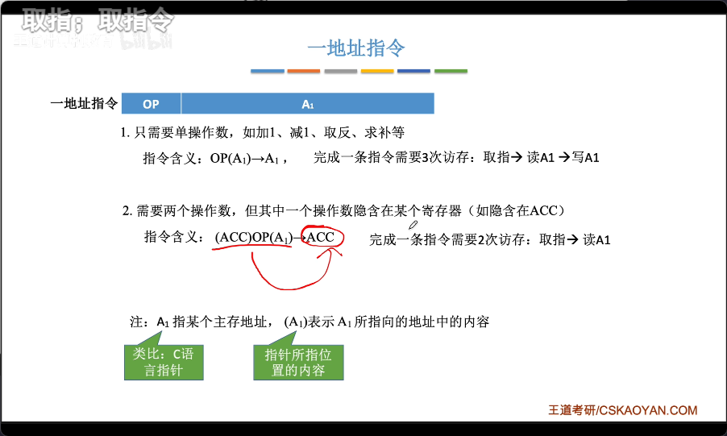

#### 1.3.1.3.多地址指令

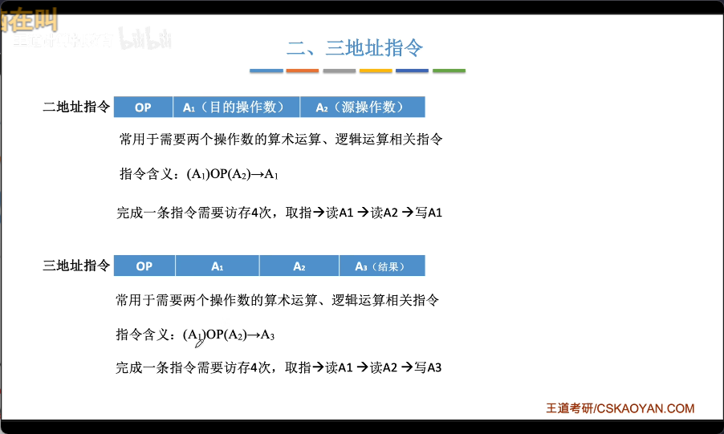

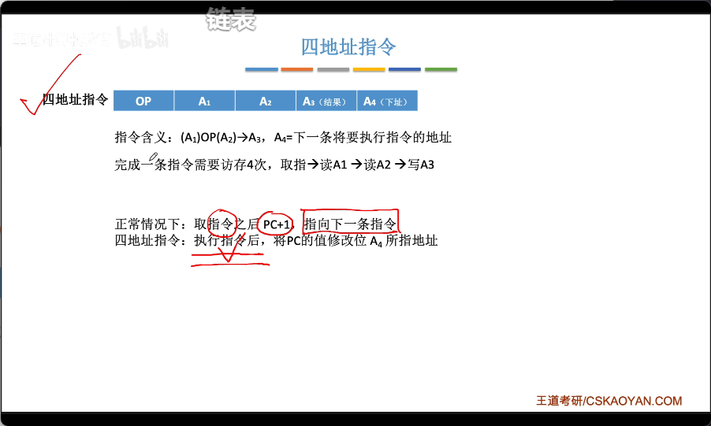

>   注意：四地址可以完成跳转。

### 1.3.2.根据指令长度分类

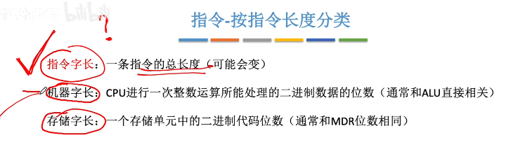

后两者大部分情况下是不变的。

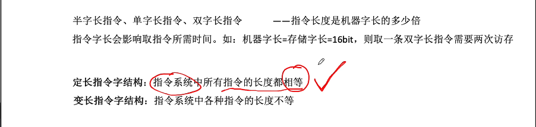

### 1.3.3.根据操作码长度分类

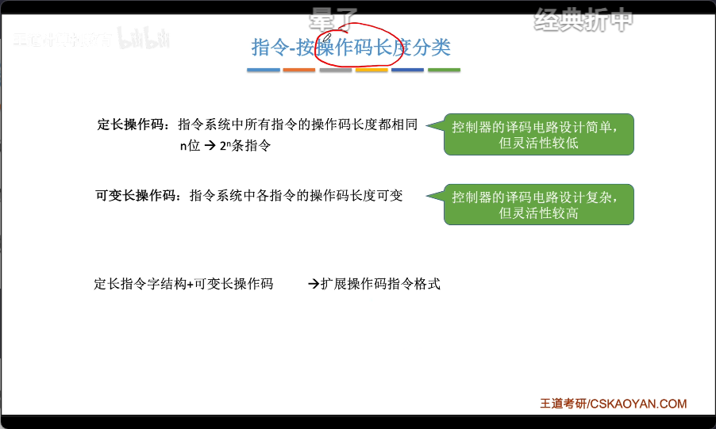

### 1.3.4.根据操作码类型分类

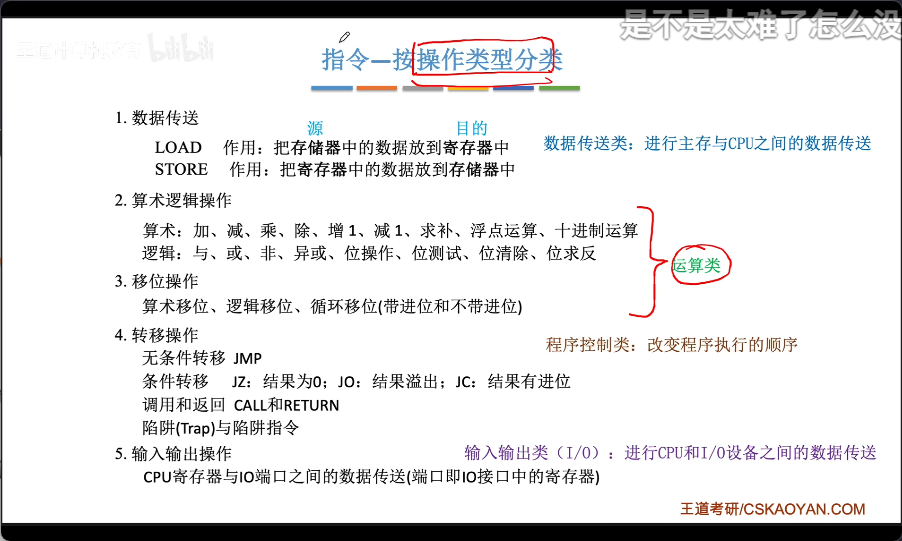

# 2.拓展操作码指令格式

就是定长指令结构下，内部操作码可变长的指令格式。

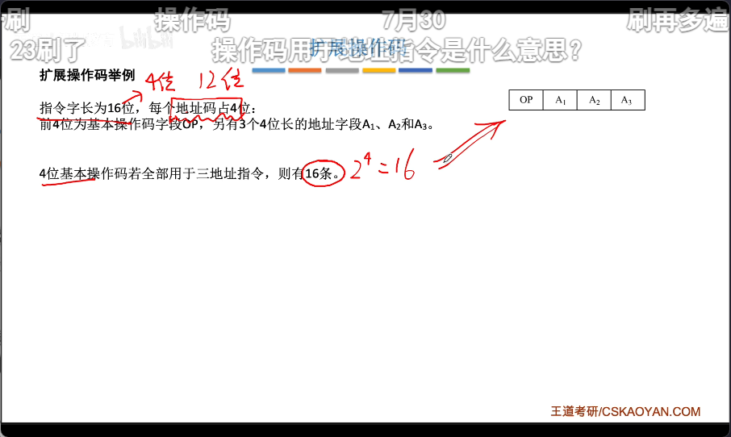

根据设定拓展位来拓展。

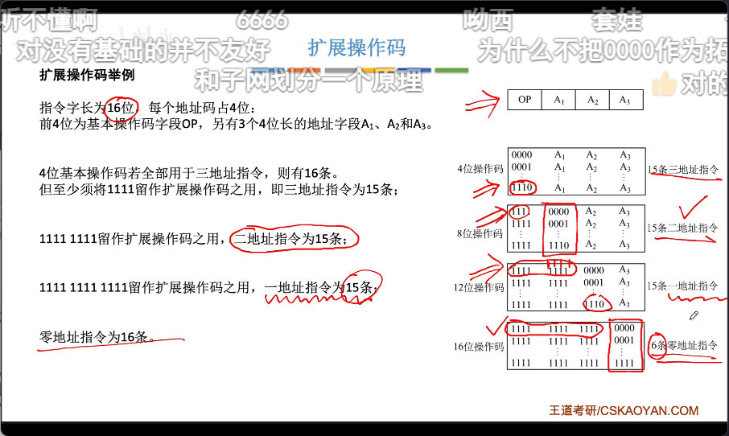

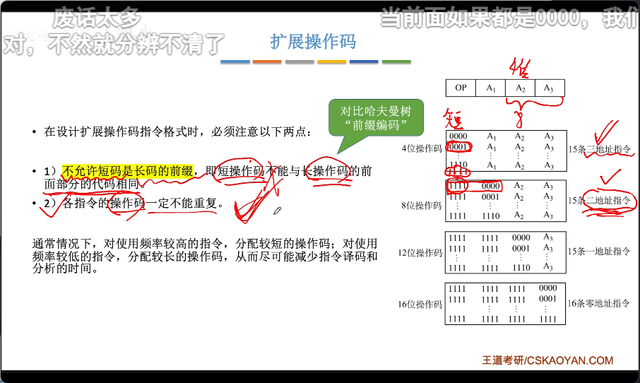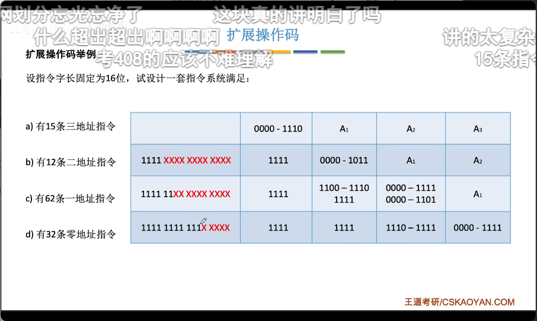

>   注意：这个图有点问题...不明确

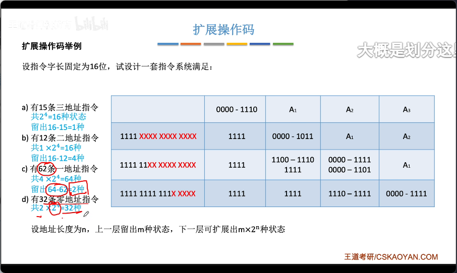

优缺点：

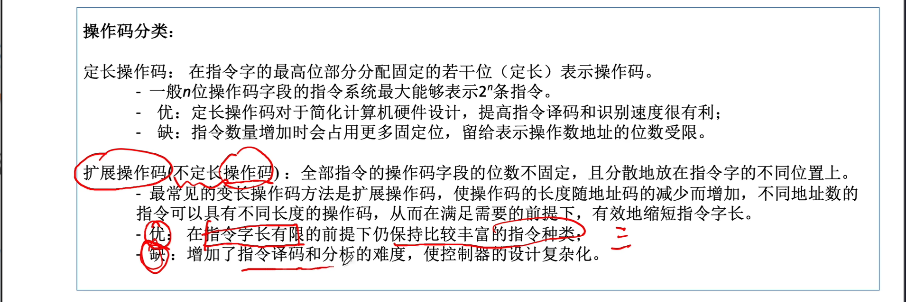

# 3.指令寻址

指令寻址问题就是在于：“如何让确定下一条指令的存放地址”。

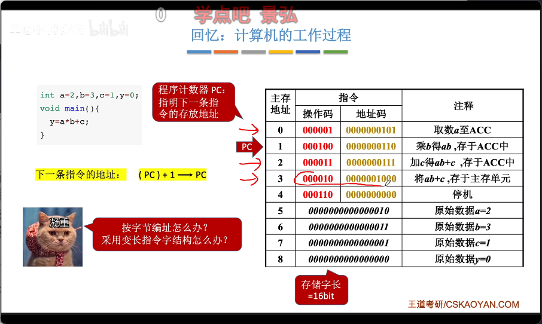

可以看到对 `PC` 地址简单的 `1`，是不够的，但有一点可以肯定，下一条要被执行的指令一定是 `PC` 寄存器内存储的地址。

## 3.1.顺序寻址

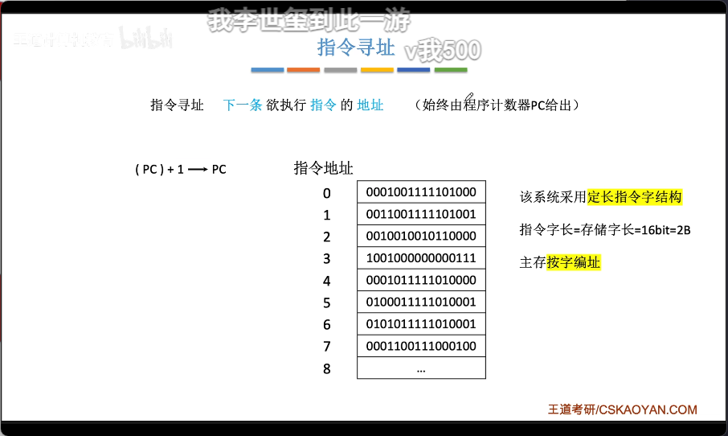

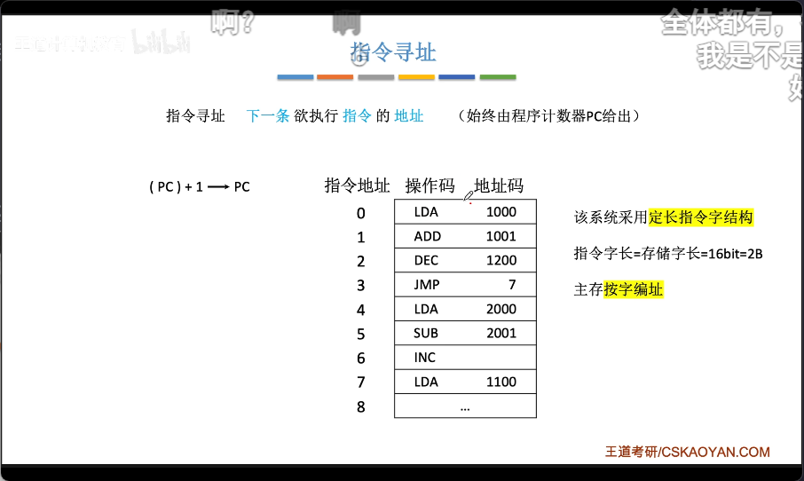

## 3.2.跳跃寻址

