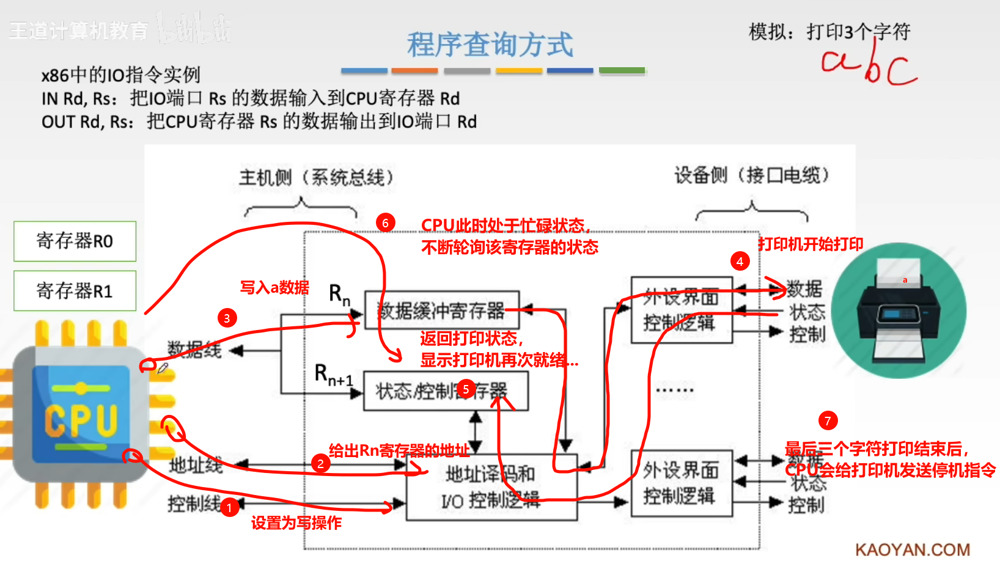

# 1.输入输出系统的组成

外部设备、接口不加、总线和配套的管理软件统称为计算机输出输出系统，也就是 `IO` 系统，主要由以下功能：

1.   完成计算机内部二进制信息与外部多种信息形式间的交流
2.   保证 `CPU` 能够正确选择 `IO` 设备并实现对其控制，与数据传输
3.   利用数据缓冲、合适的数据传送方式，实现主机外设间速度匹配

>   补充：`IO` 硬件和 `IO` 软件的组成
>
>   1.   `IO` 硬件：外设、控制器、`IO` 接口、总线
>   2.   `IO` 软件：`OS` 无关库、设备无关库、驱动、`IO` 指令、通道指令
>
>   
>
>   

# 2.IO 接口结构和控制

## 2.1.IO 接口作用

`IO` 接口又称 `IO` 控制器 （`IO controller`） 、设备控制器，负责协调主机与外部设备之间的数据传输。

## 2.2.IO 接口标准

## 2.3.IO 接口控制

## 2.4.IO 接口原理

>   注意：有可能由于切换的原因，在不断轮询的时候不一定不做其他的事情，因此可以分为定时查询和独占查询。

## 2.5.IO 接口分类

# 3.常见外围设备

外围设备是指与计算机系统相连但不是计算机核心部分的设备。这些设备用于输入、输出、存储和其他辅助功能，以帮助用户与计算机进行交互。外围设备的例子包括但不限于：

1.  **键盘和鼠标：** 用于输入数据和控制计算机
2.  **显示器：** 用于显示计算机输出的信息
3.  **打印机：** 用于输出文档或图形
4.  **扫描仪：** 用于将纸质文档转换为数字格式 
5.  **摄像头：** 用于捕捉图像或视频
6.  **音频设备：** 包括麦克风和扬声器，用于音频输入和输出
7.  **外部存储设备：** 如硬盘驱动器、`USB` 闪存驱动器等，用于数据存储和传输
8.  **网络适配器：** 用于连接计算机到网络
9.  **游戏控制器：** 用于与计算机进行游戏交互
10.  **扩展卡：** 例如显卡、声卡等，用于提供额外的功能或性能

其中 `CPU` 和外围设备的输入输出过程如下：

1.   输入过程
   
     (1)`CPU` 将一个地址放在地址总线上，选择设备
   
     (2)`CPU` 等候输入设备的数据成为有效
   
     (3)`CPU` 从数据总线读入数据 
   
2.   输出过程
   
     (1)`CPU` 将一个地址放在地址总线上，选择设备
   
     (2)`CPU` 把数据放在数据总线上
   
     (3)输出设备认为数据有效，取走数据

# 4.程序中断系统

引入这个中断的概念是为了解读 `IO` 的中断方式。

## 4.1.中断概念

不同的中断请求内部细节是不一样的，因此需要不同的中断服务程序，`CPU` 会在每个指令的末尾检查是否有中断指令信号。

## 4.2.工作流程

>   补充：若使用了“关中断”指令，就会导致 `CPU` 暂时无法响应任何的中断请求。

## 4.3.中断分类

## 4.4.请求标记

## 4.5.中断判优

>   补充：通常使用硬件，响应会快一些。

## 4.6.中断处理

中断隐指令

### 4.6.1.硬件向量法

上述做出一个中间层的原因是怕中断程序处的程序发送改动，导致资源空间发生变化，那就需要重新...嗯？？

>   补充：中断隐指令
>
>   

### 4.6.2.软件查询法

待补充...

## 4.7.中断方式

### 4.7.1.单重中断

### 4.7.2.多重中断

可以加到硬件实现。

# 5.IO 系统中的中断方式

## 5.1.程序中断方式

## 5.2.DMA中断方式

通常用来控制块设备，典型有的磁盘。

>   补充：DMA传送方式
>
>   

