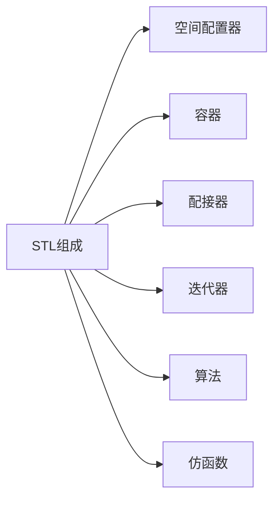

1.STL简介
=======

1.1.STL的概念
----------

`STL`(`standard template libaray`即：“标准模板库”)是`C++`标准库的重要组成部分，不仅是一个可复用的组件库，而且是一个包罗数据结构与算法的软件框架。  

1.2.STL的版本
----------

1. 原始版本：`Alexander Stepanov`、`Meng Lee`两人在惠普实验室完成了`STL`的原始版本，本着开源精神，他们声明允许任何人任意运用、拷贝、修改、传播、商业使用这些代码，无需付费。唯一的条件就是也需要向原始版本一样做开源使用。原始版本也叫`HP`版本，是所有`STL`实现版本的始祖。

2. `P.J.`版本：由`P.J.Plauger`开发，继承自`HP`版本，被`Windows Visual C++`采用，不能公开或修改。缺陷是，可读性比较低，符号命名比较怪异。

3. `RW`版本：由`Rouge Wage`公司开发，继承自`HP`版本，被`C++ Builder`采用，不能公开或修改，可读性一般（该编译器后来被微软的`VS`打败，已经没落）。

4. `SGI`版本：由`Silicon Graphics Computer Systems`，`Inc`公司开发，继承自`HP`版本。被`GCC(Linux)`采用，可移植性好，可公开、修改甚至贩卖，从命名风格和编程风格上看，阅读性非常高。后面学习`STL`要阅读部分源代码，主要参考的就是这个版本。

2.STL的六大组件
==========

`STL`可以划分为六个组件：

> 补充：“容器”实际上就是“数据结构”。

3.STL的学习境界
==========

1. 能熟用`STL`语法

2. 明白`STL`的底层原理

3. 能够根据需求来自主拓展、扩充`STL`

4.STL的缺陷
========

1. 更新速度：这里值得吐槽的是`STL`的更新速度，比较靠谱的上一版本是`C++98`，`C++03`是一些基本修订，`13`年后`C++11`才推出，STL才得以进一步更新。

2. 线程安全：`STL`到现在都没有支持线程安全，并发环境下需要自己加锁，而且锁的粒度比较大。

3. 过于效率：`STL`太追求效率了，导致内部比较复杂，例如：类型萃取、迭代器萃取等。

4. 代码膨胀：`STL`的使用会有代码膨胀的问题，这是模板语法本身导致的。
