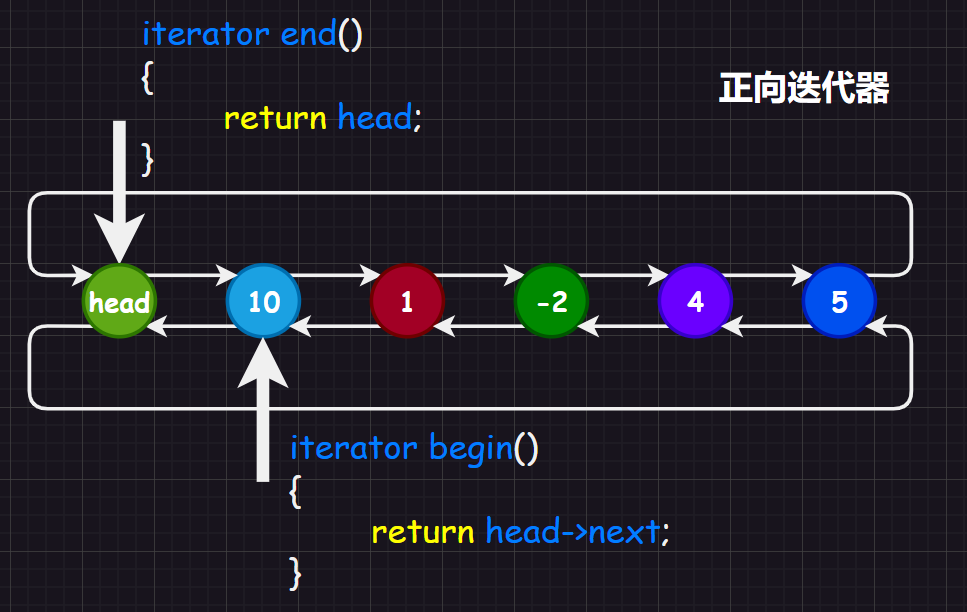

迭代器号称`C++`的六大组件之一，那么就注意说明迭代器的重要性。

而关于反向迭代器，之前我们在顺序表模拟实现中，只是简单地复制正向迭代器的代码，然后稍微修改即可，但是`C++`为了效率，降低代码重复率，使用了`萃取`这一技巧，但是太过于复杂，后期有机会再补充。

再举一个例子：以前我们在写双向循环链表的时候，写正向迭代器的时候，如图：



而如果是反向迭代器，则可能会认为`rend()`指向的就是头节点，然后`rbegin()`指向的是最后一个节点，这样子的话，一直`rbegin()++`到遇到头节点就停下，如图：


但是能不能使用正向迭代器适配反向迭代器呢？实际上是可以的：

```cpp
#pragma once
//1.使用正向迭代器构造反向迭代器
template <class Iterator>//传递一个正向迭代器类型，可以是任意支持双向和随机迭代器
class ReverseIterator
{
public:
	typedef ReverseIterator<Iterator> self;
	Iterator _it;//一个正向迭代器的成员变量

	ReverseIterator(Iterator it) : _it(it) {}//构造一个反向迭代器的时候，首先传递一个正向迭代器变量然后初始化内部的正向迭代器成员变量
	self& operator++()
	{
		--_it;//对于反向迭代器，++就是正向迭代器的--
		return *this;
	}
	self& operator--()
	{
		_it++;//对于反向迭代器，--就是正向迭代器的++
		return *this;
	}
	bool operator!=(const Self& s)
	{
		return _it != s._it;//对于反向迭代器，相等也就是正向迭代器的相等
	}
};
```

我们来编写一个伪代码，用正向迭代器来使用适配器构造方向迭代器：

```cpp
//1.Node节点结构体
template <typename T>
struct list_node
{
	T _data;
	list_node<T>* _next;
	list_node<T>* _prev;
	//构造函数
	list_node(const T& x = T())//注意不能给0，因为不一定是int，这个内置类型有了模板之后就升级了，也有构造函数了
		: _data(x)
		, _next(nullptr)
		, _prev(nullptr)
	{}
};

//2.list有关雨迭代器的实现部分
template<class T>
class list
{
	typedef list_Node Node;
public:
	//2.1.正向迭代器
	typedef __list_iterator<T> iterator;
	//2.2.反向迭代器
	typedef ReverseIterator<iterator> reverse_iterator;
	//2.3.使用rbegin()和rend()来构造一个反向迭代器对象并且返回
	reverse_iterator rbegin()
	{
		return reverse_iterator(--end());
	}
	reverse_iterator rend()
	{
		return reverse_iterator(end());
	}
};
```

也就是如图：


如果还要对反向迭代器更加细致化、更像库内的设计，可以写出下面的代码：

```cpp
#pragma once
namespace limou
{
    template<typename Iterator, class Ref, class Ptr>//传递正向迭代器的类型、迭代器内部节点的_data引用、_data指针
    struct ReverseIterator
    {
        typedef ReverseIterator<Iterator, Ref, Ptr> Self;
        Iterator _cur;//正向迭代器成员变量
        ReverseIterator(Iterator it) : _cur(it) {}

        Ref operator*()
        {
            //...
        }
        Ptr operator->()
        {
        	//...
        }
        
        Self& operator++()
        {
            _cur--;
            return *this;
        }
        Self& operator--()
        {
            _cur++;
            return *this;
        }
        bool operator!=(const Self& s)
        {
            return _cur != s._cur;
        }
    };
}
```

也就是：


这里的`begin()`和`rbegin()`以及`end()`和`rend()`是设计成对称的，只需要在`++`和`--`的时候动一些“手脚”即可。

使用适配器最厉害的地方在于：无论您使用哪一种正向迭代器，只需要是双向迭代器和随机迭代器，就可以构造出任意类型的反向迭代器。

