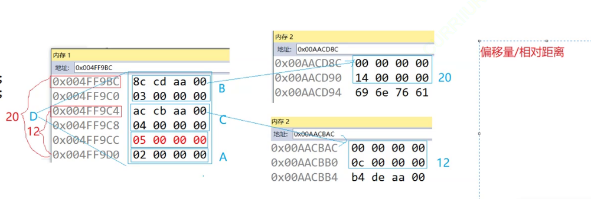

# 1.继承概念

“继承”是面向对象语言的三大特性之一（封装、继承、多态）。

继承（`inheritance`）机制是面向对象程序设计使代码可以复用的最重要的手段，它允许程序员在保持原有类特性基础上进行扩展，增加功能，这样产生新的类，称派生类。

继承呈现了面向对象程序设计的层次结构，体现了由简单到复杂的认知过程。

之前接触的复用都是函数复用，继承是类设计层次的复用。

# 2.继承使用和方式

继承发生在“基类/父类”和“派生类/子类”之间。

语法形式就是：

```c++
class 父类名
{
    //方法
    //属性
};
class 子类名 : 继承方式 父类
{
    //...
};
```

那这个继承方式又是什么呢？在字面上和我们之前看到的`public`、`protected`、`private`是一样的，但是意义有所不同。继承方式和访问限定符可以相互组合，在父子类中有以下组合：

| 类成员/继承方式             | `public`继承         | `protected`继承      | `private`继承      |
| -------------------- | ------------------ | ------------------ | ---------------- |
| **子类的`public`成员**    | 子类中仍是`public`成员    | 子类中变成`protected`成员 | 子类中变成`private`成员 |
| **子类的`protected`成员** | 子类中仍是`protected`成员 | 子类中仍是`protected`成员 | 子类中变成`private`成员 |
| **子类的`private`成员**   | 子类中不可见，该成员为父类私有    | 子类中不可见，该成员为父类私有    | 子类中不可见，该成员为父类私有  |

实际上规律也简单：`公有>保护>私有`，在两个关键字中取小即可，有点类似权限缩小的感觉，当然：您可以选择调用父类的函数来无视这些限定（也就是间接访问）。

不过需要注意的是，如果不写继承方式，那么默认继承方式是`private`（如果是结构体`struct`就默认`public`）。

> 注意：实际应用中继承方式大多使用`public`，还有类内的访问限定符也大多使用`public`和`protected`。

```c++
class Person  
{  
public:  
    void Print()  
    {  
        cout << "name:" << _name << endl;  
        cout << "age:" << _age << endl;  
    }
protected:  
    string _name = "peter"; // 姓名  
    int _age = 18; // 年龄  
};  
//继承后父类的Person的成员（成员函数+成员变量）都会变成子类的一部分。这里体现出了Student和Teacher复用了Person的成员。   
class Student : public Person  
{  
    protected:  
    int _stuid; //学号  
};
class Teacher : public Person
{
    protected:
    int _jobid; //工号
};

int main()
{
    Student s;
    Teacher t;
    s.Print();
    t.Print();
    return 0;
}
```

# 3.基类和派生类对象赋值转化

公有类继承的子类可以赋值给父类，这个过程形象的说法叫做“切割/切片”，也有叫“赋值兼容转化”的，这个过程是天然的，没有隐式类型转化的发生（没有临时变量），并且还有可以调用拷贝构造函数。

```c++
#include <iostream>
#include <string>
using namespace std;
class Person
{
public:
    void Print()
    {
        cout << "name:" << _name << endl;
        cout << "age:" << _age << endl;
    }
protected:
    string _name = "peter";
    int _age = 18;
};

class Student : public Person
{
protected:
    int _stuid;  
};

class Teacher : public Person
{
protected:
    int _jobid;
};

int main()
{
    double a = 1.1;
    int b = 2;
    a = b;//发生类型转化
    const int& ra = a;//产生临时变量
    Student s;
    Person p = s;//没有发生类型转化，只是将子类中的成员变量拷贝给父类
    Person& rp = s;//没有产生临时变量，并且使用这一特性就好像给子类做了“切片”，rp本身还是子类，但是却只引用/切出了子类中继承自父类的那一部分成员
    Person* pp = &s;//同理指针也是做了一些“切片”，指针解引用只能看到子类从父类哪里继承的那一部分成员、
    return 0;
}
```

那反过来可以么？不可以父类不可以给子类（但是后续有一种特殊情况），容易造成子类的属性缺失，比较容易出现问题。

# 4.继承作用域

1. 在继承体现中父类和子类都有自己独立的作用域

2. 子类和父类有同名成员，但是子类将屏蔽父对类同名对象的直接访问，这种情况就叫“隐藏/重定义”

3. 函数也有类似“隐藏”的情况，注意需要和“重载区分（在同一个作用域）”，只需要函数名相同就可以达到“隐藏父类成员函数”

4. 尽可能不使用同名的成员构成隐藏，不然有的时候会给自己挖坑...

```c++
#include <iostream>
#include <string>
using namespace std;
class Person
{
public:
    void Print()
    {
        cout << "name:" << _name << endl;
        cout << "age:" << _age << endl;
    }
protected:
    string _name = "peter";
    int _age = 18;
};

class Student : public Person
{
protected:
    string _name = "student";//父类的_name被子类Student隐藏了
    int _stuid;
public:
    void Print()//父类的Print()被子类Student隐藏了
    {
        cout << "name:" << _name << endl;
        cout << "age:" << _age << endl;//_age没有被子类隐藏，依旧打印父类的_age
    }
};

class Teacher : public Person
{
protected:
    string _name = "teacher";//父类的_name被子类Teacher隐藏了
    int _jobid;
public:
    void Print()//父类的Print()被子类Teacher隐藏了
    {
        cout << "name:" << _name << endl;
        cout << "age:" << _age << endl;//_age没有被子类隐藏，依旧打印父类的_age
    }
};

int main()
{
    Student s;
    s.Print();
    Teacher t;
    t.Print();
    return 0;
}
```

但是想要直接访问父类中被子类隐藏的成员怎么办呢？使用访问限定符即可。

```c++
#include <iostream>
#include <string>
using namespace std;
class Person
{
public:
    void Print()
    {
        cout << "name:" << _name << endl;
        cout << "age:" << _age << endl;
    }
protected:
    string _name = "peter";
    int _age = 18;
};

class Student : public Person
{
protected:
    string _name = "student";//父类的_name被子类Student隐藏了
    int _stuid;
public:
    void Print()//父类的Print()被子类Student隐藏了
    {
        cout << "name:" << _name << endl;
        cout << "age:" << _age << endl;//_age没有被子类隐藏，依旧打印父类的_age
    }
};

class Teacher : public Person
{
protected:
    string _name = "teacher";//父类的_name被子类Teacher隐藏了
    int _jobid;
public:
    void Print()//父类的Print()被子类Teacher隐藏了
    {
        cout << "name:" << _name << endl;
        cout << "age:" << _age << endl;//_age没有被子类隐藏，依旧打印父类的_age
    }
};

int main()
{
    Student s;
    s.Print();
    Teacher t;
    t.Print();
    s.Person::Print();
    t.Person::Print();
    return 0;
}
```

# 5.派生类的默认成员函数

如果我们不写派生类，子类就会默认调用父类的成员函数，比如：构造函数和析构函数，但是子类是没有办法隐藏这个成员函数的（这也体现了成员函数的特殊性）。

如果子类要写自己的构造函数时，在初始化成员变量的时候，就会隐式调用父类的构造函数（也可以自己显式调用，比如：在初始化列表中使用访问限定符来调用父类的构造函数）。

但是拷贝构造不会，拷贝构造必须使用父类的拷贝构造初始化继承父类的成员变量，但是父类的拷贝构造函数需要传递一个父类对象过去，如何把继承于父类的成员变量拿出来作为父类对象传给父类的拷贝构造函数呢？使用切片即可，这就是切片的实际应用。 

```c++
#include <iostream>
#include <string>
using namespace std;
class Person
{
public:
    Person()
        : _name("peter"), _age(18)
    {
        cout << "Person()" << endl;
    }
    ~Person()
    {
        cout << "~Person()" << endl;
    }
    Person(Person& p)
    {
        cout << "Person(Person& p)" << endl;
        _name = p._name;
        _age = p._age;
    }
    void Print()
    {
        cout << "name:" << _name << endl;
        cout << "age:" << _age << endl;
    }

protected:
    string _name;
    int _age;
};

class Student : public Person
{
public:
    Student()
        :Person(), _stuid(22103)
    {}
    Student(Student& s)
        : Person::Person(s)//使用了切片
        , _stuid(s._stuid)
    {}
    void Print()
    {
        cout << "name:" << _name << endl;
        cout << "age:" << _age << endl;
        cout << "stuid:" << _stuid << endl;
    }
protected:
    int _stuid;
};

class Teacher : public Person
{
public:
    Teacher()
        :Person(), _jobid(88903)
    {}
    Teacher(Teacher& s)
        : Person::Person(s)//使用了切片
        , _jobid(s._jobid)
    {}
    void Print()
    {
        cout << "name:" << _name << endl;
        cout << "age:" << _age << endl;
        cout << "jobid:" << _jobid << endl;
    }
protected:
    int _jobid;
};

int main()
{
    Student s;
    Teacher t;
    s.Print();
    t.Print();
    Student s1(s);
    Teacher t1(t);
    s1.Print();
    t1.Print();

    return 0;
}
```

注意使用父类的成员函数一定要带上父类和访问限定符，否则就有可能因为隐藏而出现自己调用自己的情况，就会变成无穷递归。

但是又还有一个很离谱的点：子类不能自己显式调用父类的析构函数，否则会重复调用。也就是说，在子类析构结束后，会自动调用父类的析构函数。这在语法逻辑上很不自洽，析构函数编译器会自己调用（保证析构顺序，先析构子类成员再析构父类成员，如果用户自己调用则有可能出现父类成员先被释放了，但是子类依旧可以使用父类的成员，造成内存泄漏）。

# 6.父类不被继承的部分

## 6.1.友元关系

友元关系是不会被继承的，也就是说，如果父类有一个友元函数，那么这个友元函数只可以使用父类的成员变量，而不可以使用从父类继承过来的子类的内部成员变量。

这种情况下只能再定义一个友元关系给子类。

## 6.2 .静态成员变量

静态成员变量属于整个类，不仅仅属于父类，也属于子类，因此不能说子类继承静态成员变量，这么说是不对的。

也就是说父类中使用的静态成员变量和子类的静态成员变量是一样的（不过这也就是说，从父类中的成员变量和子类中的成员变量只是拷贝关系，各自的地址是不一样的）。  

# 7.不可被继承部分

有两种方法：

构造函数或者析构函数变成私有化（无法隐式调用两者）

# 8.虚继承

## 8.1.不可能棱形

以上我们提到的继承都是单继承（单变多），但是`C++`在开发之初为了更加符合现实中多继承（多变单）的现象。

但是没有想到出现了一个新的大问题：棱形继承，具有二义性和数据冗余。

其内容为”假设有一个父类，其有两个子类，而两个子类又多继承出一个子子类，这个子子类创建出来的对象由于会从两个子类继承，那么就有可能出现二义性和数据冗余“。

```c++
#include <iostream>
#include <string>
using namespace std;
class Person
{
public:
    Person()
        : _name("peter"), _age(18)
    {
        cout << "Person()" << endl;
    }
public:
    string _name;
    int _age;
};

class Student : public Person
{
public:
    Student()
        :Person(), _stuid(22103)
    {}
public:
    int _stuid;
};

class Teacher : public Person
{
public:
    Teacher()
        :Person(), _jobid(88903)
    {}
protected:
    int _jobid;
};
class Graduate : public Student, public Teacher//多继承
{
protected:
    int _graid;
};

int main()
{
    Graduate g;
    //cout << g._name << endl;//运行失败，具有二义性
    cout << g.Student::_name << endl;//运行成功，成功解决二义性
    cout << g.Teacher::_name << endl;//运行成功，成功解决二义性
    return 0;
}
```


二义性我们尚且可以通过作用域限定符来解决，但是数据冗余还需要使用`virtual`关键字才能解决。

> 补充：因此`Java`直接砍掉了这个多继承的功能。

但是`C++`也对多继承做了一定的处理，也就是关键字`virtual（虚继承）`，加在两个子类的继承方式处，但是也因此变得很复杂，背后的原理我们以后来学习...

## 8.2.虚继承操作

为什么数据冗余使用`virtual`关键字就能解决呢？我们来查看一下底层。

这里我们最好不要查看编译器的调试窗口，而是使用内存窗口（因为调试窗口为了方便展示又可能做了一些优化，比如：使用内联函数，有些编译器的调试器会让您觉得这是在调用函数）。

1. 不加关键字
   
   ```c++
   #include <iostream>
   #include <string>
   using namespace std;
   class A
   {
   public:
       int _a;
   };
   
   class B : public A
   {
   public:
       int _b;
   };
   
   class C : public A
   {
   public:
       int _c;
   };
   class D : public B, public C//多继承
   {
   public:
       int _d;
   };
   
   int main()
   {
       D d;
       d.B::_a = 1;
       d.C::_a = 2;
   
       d._b = 3;
       d._c = 4;
   
       d._d = 5;
       return 0;
   }
   ```
   
   
   
   

2. 加上关键字
   
   
   
   将`B`和`C`中同属于`A`的部分变成公共部分，在继承自`B`和`C`的部分中多出一个指针，指向一个表空间，这些表存储了指针偏移量信息。利用指针偏移量和该指针的值即可找到一个公共空间。
   那为什么是指针指向一个偏移量表，而不是直接使用指针指向公共空间呢？这些后面多态再来讨论，指针固然能解决这个问题，但是使用偏移量还能再进一步解决多态的问题...
   这样子子类在使用从两个子类继承过来的变量的时候，实际上是同一个变量，解决了冗余性和二义性。

并且这里还有一个坑点，多继承后的对象如果使用指针切片，其地址会发生偏移。

这里使用指针造成的偏移量有点小复杂，之后补上。

实际上在`iostream`就是棱形继承来的...

```c++
#include <iostream>
#include <string>
using namespace std;
class A
{
public:
    A(const char* s)
    {
        cout << s << endl;
    }
    ~A() {}
};

class B : virtual public A
{
public:
    B(const char* s1, const char* s2)
        : A(s1)
    {
        cout << s2 << endl;
    }
};

class C : virtual public A
{
public:
    C(const char* s1, const char* s2)
        : A(s1)
    {
        cout << s2 << endl;
    }
};
class D : public B, public C//多继承
{
public:
    D(const char* s1, const char* s2, const char* s3, const char* s4)
        : B(s1, s2), C(s1, s3), A(s1)
    {
        cout << s4 << endl;
    }
};

int main()
{
    D* p = new D("class A", "class B", "class C", "class D");
    //先调用B(s1, s2)，然后调用C(s1, s3)，然后调用A(s1)，然后打印"class D"
    //先调用A(s1)，然后打印"class B"，然后调用A(s1)，然后打印"class C"，然后调用A(s1)，然后打印"class D"
    //由于在D中A的成员是公共部分，因此只会调用一次构造函数A(s1)，并且这个构造函数A(s1)是在D中被调用的
    //于是得到：A、B、C、D
    delete p;
    return 0;
}
```

## 8.3.虚继承和构造函数

```c++
#include <iostream>
#include <string>
using namespace std;
class A
{
public:
    A(const char* s)
    {
        cout << s << endl;
    }
    ~A() {}
};

class B : virtual public A
{
public:
    B(const char* s1, const char* s2)
        : A(s1)
    {
        cout << s2 << endl;
    }
};

class C : virtual public A
{
public:
    C(const char* s1, const char* s2)
        : A(s1)
    {
        cout << s2 << endl;
    }
};
class D : public B, public C//多继承
{
public:
    D(const char* s1, const char* s2, const char* s3, const char* s4)
        : B(s1, s2), C(s1, s3), A(s1)
    {
        cout << s4 << endl;
    }
};

int main()
{
    D* p = new D("class A", "class B", "class C", "class D");
    //前提1：由于在D中A的成员是公共部分，因此只会调用一次构造函数A(s1)，并且这个构造函数A(s1)是在D中被调用的
    //前提2：注意初始化列表是谁先声明谁先初始化（谁先继承谁就先初始化）
    //调用顺序：A(s1),B(s1,s2),C(s1,s3)-->put(s1),put(s2),put(3),put(4)
    //于是得到：A、B、C、D
    delete p;
    return 0;
}
```

因此使用多个父类的构造函数初始化需要注意初始化列表的顺序。

# 9.继承和组合

继承和组合都是一种复用，以下是继承和组合的区别（不过这里只讨论公有方式的继承）：

```c++
//继承is-a
class A1
{}
class B1 : public A1
{}

//组合has-a
class A2
{}
class B2
{
private:
    A2 _a;
}
```

那么这个`is-a`和`has-a`，是什么呢？一个是“判断是”，一个是“属于”。

从关联关系/耦合度上来看继承更高，`B1`可以直接使用`A1`的所有成员，但是`B2`只能使用`A2`的函数成员，间接调用其他的`A2`成员（因此对象组合也是一种黑箱/黑盒风格）。

但在软件设计中有一种设计理念就是“低耦合、高内聚”，因此在实践中，应该尽可能去用组合，代码的维护性更好。

如果是实现多态，那就必须使用继承。但是如果描述类之间的关系时，继承和组合都可以，那么应该尽量使用组合。
